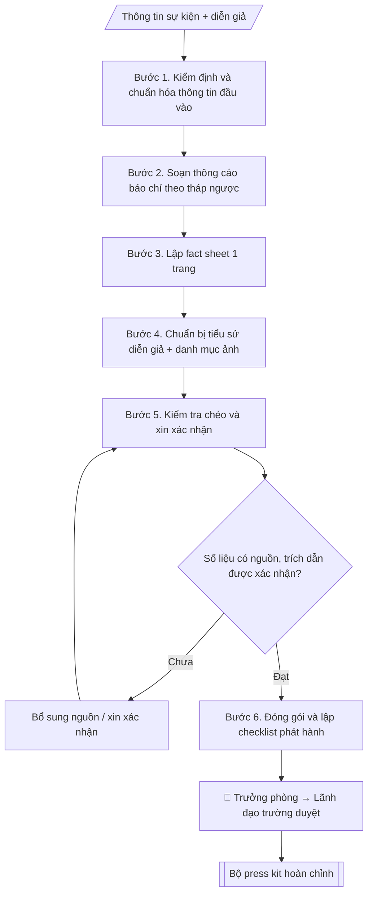

# Press kit sự kiện

## Định dạng và file đầu ra

Định dạng đầu ra có thể chọn theo sản phẩm/yêu cầu: .docx, .pdf, .txt, .md, .html. Đọc mục “Định dạng bổ sung” trong quy cách đầu ra trước khi chọn.

**Phải tạo file thực tế để tải xuống, không chỉ trả nội dung trong chat.** Định dạng mặc định của skill: **.docx**. Nếu có bảng số liệu nghiệp vụ yêu cầu file bảng tính riêng, tạo thêm Excel theo yêu cầu; không tự tạo file kiểm tra. Không chờ người dùng yêu cầu xuất file lần nữa. Ưu tiên định dạng người dùng chỉ định; đọc quy tắc xuất file tại references/quy-cach-dau-ra.md.

## Quy cách đầu ra và thông tin thiếu

Đọc [quy cách và cấu trúc sản phẩm](references/quy-cach-dau-ra.md) trước khi soạn/xuất. File giao chỉ gồm văn bản hoặc sản phẩm nghiệp vụ được yêu cầu; kiểm tra nội bộ không xuất kèm. Thiếu thông tin giữ nguyên trường/mục và chỗ điền theo mẫu gốc (dòng dấu chấm, dấu gạch hoặc ô trống); không tự điền dữ liệu mẫu, số 0, mã chờ xác minh hoặc dòng chờ ký. Mẫu chuyên ngành còn áp dụng được ưu tiên về cấu trúc, mã biểu và người ký. Các trường “bắt buộc” là điều kiện hoàn thiện hồ sơ, không ngăn việc soạn bản có chỗ chừa để điền. Mọi chỉ dẫn “để trống” trong skill được hiểu là không điền dữ liệu và giữ cách chừa chỗ của mẫu gốc, không phải xóa dấu chấm của mẫu.

## Kiểm soát áp dụng và phê duyệt

Trước khi chạy quy trình, xác định `ngay_ap_dung`, `loai_hinh_truong`, `quy_che_noi_bo`, `nguon_du_lieu` và `nguoi_kiem_duyet`. Chỉ yêu cầu thông tin có liên quan đến nghiệp vụ; không dùng giá trị giả định thay dữ liệu bắt buộc. Đối chiếu nội bộ hồ sơ có yếu tố pháp lý với văn bản gốc, hiệu lực, điều khoản áp dụng và chuyển tiếp; không tự đính kèm bảng kiểm tra vào file giao.

## Giới hạn và human gate

AI hỗ trợ chuẩn bị và đối chiếu. Cán bộ phụ trách kiểm tra dữ liệu/căn cứ, người có thẩm quyền duyệt và ký. Văn bản soạn chưa được coi là đã ban hành; không tự chèn nhãn trạng thái kiểm duyệt vào file giao; không đánh dấu đã ký, đã duyệt hoặc đã công bố nếu chưa có chứng cứ. Dữ liệu sinh viên, sức khỏe, nhân sự và tài chính phải hạn chế theo mục đích, phân quyền và che thông tin định danh khi dùng ví dụ. Không tải dữ liệu lên dịch vụ ngoài khi chưa có quyền. Kiểm tra Luật 91/2025/QH15 về bảo vệ dữ liệu cá nhân (hiệu lực 01/01/2026) và quy định áp dụng trước xử lý/chia sẻ dữ liệu cá nhân.

## Khi nào dùng
Khi tổ chức sự kiện cần mời báo chí đưa tin: lễ khai giảng, kỷ niệm thành lập, hội thảo lớn,
ký kết hợp tác, ngày hội tuyển sinh...

## Đầu vào (Input)

| Trường | Mô tả | Bắt buộc |
|---|---|---|
| `ten_su_kien` | Tên sự kiện | Có |
| `thoi_gian_dia_diem` | Thời gian, địa điểm tổ chức | Có |
| `noi_dung_chinh` | Các điểm nhấn của sự kiện (diễn giả, nội dung, con số nổi bật) | Có |
| `dien_gia` | Danh sách diễn giả/khách mời chính + tiểu sử ngắn | Không |
| `so_lieu` | Số liệu bắt buộc có nguồn (quy mô, thành tựu...) | Không |
| `lien_he_bao_chi` | Đầu mối báo chí của trường (tên, điện thoại, email) | Có |

## Quy trình

**Bước 1. Kiểm định và chuẩn hóa thông tin đầu vào**
- Làm gì: gom toàn bộ các trường input; lập bảng đối chiếu từng số liệu trong `so_lieu` và `noi_dung_chinh` với nguồn kèm theo; kiểm tra `lien_he_bao_chi` đủ tên – điện thoại – email; đối chiếu `thoi_gian_dia_diem` với giấy mời/thông báo chính thức của sự kiện.
- Dùng input: `ten_su_kien`, `thoi_gian_dia_diem`, `noi_dung_chinh`, `dien_gia`, `so_lieu`, `lien_he_bao_chi`.
- Vai trò: Chuyên viên Phòng Truyền thông – Tuyển sinh · AI hỗ trợ: đối chiếu tự động, cảnh báo sai lệch, lập bảng biểu, định dạng · ⏱ ~30–60 phút (ước tính)
- Lưu ý nghiệp vụ: số liệu không có nguồn được đưa vào danh sách "chờ xác nhận", tuyệt đối không đưa vào thông cáo; thời gian/địa điểm sai dù một chi tiết cũng gây sự cố với báo chí.
- → Kết quả bước: Bảng kiểm định dữ liệu (OK / thiếu nguồn / cần xác nhận) + bộ dữ liệu sạch đã chuẩn hóa.

**Bước 2. Soạn thông cáo báo chí theo tháp ngược**
- Làm gì: viết tiêu đề 1 dòng chứa tin mới nhất; đoạn mở 2–3 câu trả lời 5W1H; thân bài triển khai các điểm nhấn từ `noi_dung_chinh`, chèn trích dẫn lãnh đạo; đoạn nền 2–3 câu giới thiệu trường; khối liên hệ báo chí ở cuối.
- Dùng input: toàn bộ trường input + bộ dữ liệu sạch (Bước 1).
- Vai trò: Chuyên viên Phòng Truyền thông – Tuyển sinh · AI hỗ trợ: soạn dự thảo · ⏱ ~30–60 phút (ước tính)
- Lưu ý nghiệp vụ: mỗi con số trong bài phải gắn với nguồn đã kiểm định ở Bước 1; trích dẫn phải được người phát ngôn đọc và xác nhận nguyên văn trước khi đưa vào; tránh tính từ tuyệt đối ("hàng đầu", "duy nhất") nếu không chứng minh được.
- → Kết quả bước: Dự thảo thông cáo báo chí (mỗi số liệu có đánh dấu nguồn).

**Bước 3. Lập fact sheet 1 trang**
- Làm gì: rút gọn dự thảo thông cáo thành bảng 1 trang: tên sự kiện, thời gian, địa điểm, quy mô, diễn giả chính, 3–5 con số nổi bật kèm ghi chú nguồn từng số.
- Dùng input: `ten_su_kien`, `thoi_gian_dia_diem`, `dien_gia`, `so_lieu` + dự thảo thông cáo (Bước 2).
- Vai trò: Chuyên viên Phòng Truyền thông – Tuyển sinh · AI hỗ trợ: soạn dự thảo · ⏱ ~30–60 phút (ước tính)
- Lưu ý nghiệp vụ: fact sheet không được chứa số liệu nào không có trong thông cáo; mọi con số phải khớp tuyệt đối giữa hai tài liệu.
- → Kết quả bước: Fact sheet 1 trang (dự thảo).

**Bước 4. Chuẩn bị tiểu sử diễn giả và danh mục ảnh**
- Làm gì: viết tiểu sử 3–5 dòng/người từ `dien_gia` (học vị, chức danh, lĩnh vực); lập danh mục ảnh cần có (chân dung diễn giả, toàn cảnh sự kiện, ảnh điểm nhấn) kèm ghi chú bản quyền và sự đồng ý sử dụng.
- Dùng input: `dien_gia` + dự thảo thông cáo (Bước 2).
- Vai trò: Chuyên viên Phòng Truyền thông – Tuyển sinh · AI hỗ trợ: soạn dự thảo · ⏱ ~30–60 phút (ước tính)
- Lưu ý nghiệp vụ: học vị, chức danh phải đúng quyết định bổ nhiệm; chỉ dùng ảnh rõ nguồn và đã được đồng ý bằng văn bản.
- → Kết quả bước: Tiểu sử diễn giả (3–5 dòng/người) + danh mục ảnh kèm ghi chú bản quyền.

**Bước 5. Kiểm tra chéo và xin xác nhận**
- Làm gì: đối chiếu 3 chiều — thông cáo ↔ fact sheet ↔ nguồn gốc — cho từng số liệu; gửi trích dẫn cho người phát ngôn xác nhận nguyên văn; kiểm tra lại thông tin liên hệ báo chí.
- Dùng input: bán thành phẩm Bước 2–4 + `so_lieu` gốc.
- Vai trò: Trưởng phòng Truyền thông – Tuyển sinh · AI hỗ trợ: đối chiếu tự động, cảnh báo sai lệch · ⏱ ~1–2 giờ (ước tính)
- Lưu ý nghiệp vụ: quy tắc "3 nguồn khớp nhau" cho con số nhạy cảm (quy mô, kinh phí); một lỗi số liệu nhỏ trên báo chí tốn rất nhiều công đính chính.
- → Kết quả bước: Bộ press kit đã xác nhận (có xác nhận trích dẫn của người phát ngôn) + biên bản kiểm tra.

**Bước 6. Đóng gói và lập checklist phát hành**
- Làm gì: gom thông cáo + fact sheet + tiểu sử diễn giả + danh mục ảnh thành một bộ; lập checklist phát hành: gửi trước sự kiện bao lâu, danh sách báo/nhà báo nhận, kênh gửi (email), người gửi.
- Dùng input: bộ press kit đã xác nhận (Bước 5).
- Vai trò: Chuyên viên Phòng Truyền thông – Tuyển sinh · AI hỗ trợ: chuẩn bị bản phát hành · ⏱ ~30–60 phút (ước tính)
- Lưu ý nghiệp vụ: gửi trước sự kiện 3–5 ngày cho báo in, 1–2 ngày cho báo điện tử; người gửi phải đúng là đầu mối báo chí đã nêu trong thông cáo.
- → Kết quả bước: Bộ press kit hoàn chỉnh + checklist phát hành.

## Luồng quy trình (Workflow)

## Đầu ra

File nghiệp vụ thực tế theo định dạng mặc định ở đầu skill hoặc định dạng người dùng yêu cầu, kèm liên kết tải trong phản hồi cuối.

Sản phẩm nghiệp vụ hoàn chỉnh theo [quy cách và cấu trúc](references/quy-cach-dau-ra.md), giữ các trường chưa có dữ liệu ở trạng thái trống. Không xuất kèm checklist/phụ lục kiểm tra đầu ra.

## Kiểm tra nội bộ trước khi giao

- [ ] Bố cục khớp mẫu áp dụng và cấu trúc tại references/quy-cach-dau-ra.md.
- [ ] Có đầy đủ sản phẩm: Thông cáo báo chí hoàn chỉnh
- [ ] Có đầy đủ sản phẩm: Fact sheet 1 trang + danh mục ảnh + thông tin liên hệ
- [ ] Mọi số liệu, tên, ngày tháng trong output khớp với Input đã cung cấp (không thêm bớt, không suy đoán)
- [ ] Không bịa đặt số liệu, minh chứng, trích dẫn hay căn cứ
- [ ] Đúng thể thức, định dạng văn bản theo quy định hiện hành
- [ ] Căn cứ pháp lý nêu đầy đủ, còn hiệu lực tại thời điểm lập
- [ ] Đã qua Human gate: người có thẩm quyền đã kiểm tra/ký duyệt trước khi phát hành
- [ ] Số liệu không có nguồn được đưa vào danh sách "chờ xác nhận", tuyệt đối không đưa vào thông cáo
- [ ] Mỗi con số trong bài phải gắn với nguồn đã kiểm định ở Bước 1

> Tiêu chí đạt: tất cả các ô đều được đánh dấu.

## Human gate (người kiểm duyệt)
- Trưởng phòng duyệt thông cáo và fact sheet.
- Lãnh đạo trường duyệt trước khi phát hành cho báo chí.
- Người phát ngôn xác nhận mọi trích dẫn mang tên mình.

## Giới hạn (guardrails)
- Không phát hành press kit khi chưa được lãnh đạo duyệt.
- Không đưa số liệu chưa có nguồn xác thực.
- Không dùng ảnh không rõ bản quyền hoặc chưa được đồng ý.
- Không tự gửi thông cáo cho báo chí.

## Căn cứ & lưu ý
- Thông cáo báo chí viết theo cấu trúc tháp ngược (quan trọng nhất lên đầu).
- Không dùng tên thật của trường/cá nhân khi mô phỏng.

## Quản trị phiên bản

- Phiên bản gói: `1.3.1`; ngày cập nhật: `2026-10-10`.
- Kho nguồn: https://github.com/phamtruong91/university-skills-framework
- Người duy trì trên GitHub: `phamtruong91` (Phạm Văn Trường). Người phê duyệt nghiệp vụ: **chưa chỉ định**.
- Commit nguồn trước cập nhật: `346719e6b0318ed034b4b016703f79733aa575e7`. Commit chứa phiên bản này xem bằng `git log -1 -- skills/press-kit-su-kien`; không tự gán SHA chưa tạo.
- Giấy phép: theo LICENSE của kho; bản quyền CES Global.
- Lịch sử 1.1.0: bổ sung metadata giao diện, kiểm soát áp dụng, quản trị phiên bản.
- Trạng thái: dự thảo nghiệp vụ; kiểm tra pháp lý trước thực thi. Ngày cập nhật không đồng nghĩa mọi văn bản đã được rà soát toàn văn.
