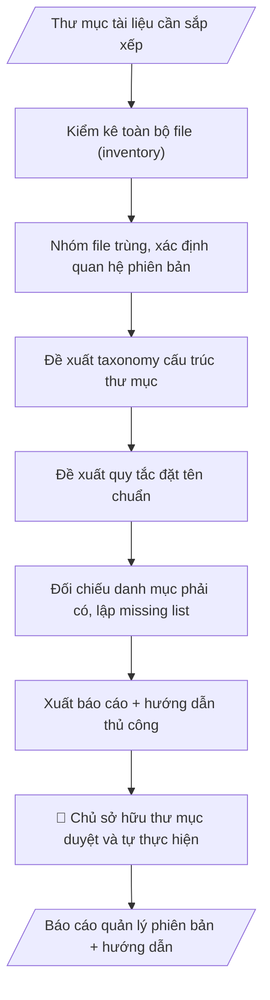

# Skill: Quản lý file & phiên bản (chỉ đọc)

## Khi nào dùng
Khi thư mục tài liệu của đơn vị trở nên lộn xộn (nhiều bản "final", "final2", "mới nhất"...),
cần kiểm kê, sắp xếp lại và xây dựng quy tắc quản lý — nhưng yêu cầu an toàn tuyệt đối:
AI chỉ phân tích và đề xuất, con người thực hiện thay đổi thủ công.

## Đầu vào (Input)

| Trường | Mô tả | Bắt buộc |
|---|---|---|
| `mo_ta_thu_muc` | Mô tả cấu trúc thư mục hiện tại (các thư mục con, loại tài liệu) | Có |
| `danh_sach_file` | Liệt kê file (tên, ngày sửa, dung lượng — không cần nội dung) | Có |
| `quy_tac_hien_tai` | Quy tắc đặt tên/lưu trữ đang áp dụng (nếu có) | Không |
| `chinh_sach_luu_tru` | Thời hạn lưu trữ, phân loại mật (nếu có) | Không |

## Quy trình

**Bước 1. Kiểm kê toàn bộ file (inventory)**
- Làm gì: Từ `mo_ta_thu_muc` và `danh_sach_file`, lập bảng kiểm kê: tên file, thư mục chứa, ngày sửa đổi cuối, dung lượng, loại tài liệu suy từ tên/mô tả; đánh dấu file có tên bất thường (ký tự lạ, thiếu đuôi mở rộng) hoặc thiếu ngày sửa.
- Dùng input: `mo_ta_thu_muc`, `danh_sach_file`.
- Vai trò: Chủ sở hữu thư mục · AI hỗ trợ: kiểm kê tự động toàn bộ file từ metadata (tên, ngày sửa, dung lượng) · ⏱ ~15–30 phút (ước tính)
- Lưu ý nghiệp vụ: chỉ làm việc với metadata (tên, ngày, dung lượng) — tuyệt đối không mở nội dung file nhạy cảm; file thiếu ngày sửa ghi rõ "không xác định" thay vì đoán.
- → Kết quả bước: Bảng inventory đầy đủ — đầu vào cho mọi bước sau.

**Bước 2. Phát hiện trùng lặp và xác định quan hệ phiên bản**
- Làm gì: Nhóm các file có tên gốc tương tự nhau (bỏ hậu tố kiểu final/final2/mới nhất/chốt/sửa) thành từng nhóm phiên bản; sắp xếp trong mỗi nhóm theo ngày sửa đổi; đề xuất "bản mới nhất dự kiến" (ngày mới nhất) kèm mức tin cậy; ghi rõ nhóm nào chưa chắc chắn, cần chủ sở hữu xác nhận.
- Dùng input: `danh_sach_file`, `quy_tac_hien_tai`.
- Vai trò: Chủ sở hữu thư mục · AI hỗ trợ: nhóm file theo tên gốc, sắp xếp theo ngày, đề xuất bản mới nhất kèm mức tin cậy · ⏱ ~15–30 phút (ước tính)
- Lưu ý nghiệp vụ: ngày sửa mới nhất chưa chắc là bản đúng nhất (có thể ai đó mở–lưu nhầm) — mọi kết luận đều ghi "dự kiến, cần xác nhận"; không suy đoán về khác biệt nội dung giữa các bản khi chưa mở file.
- → Kết quả bước: Version map sơ bộ (nhóm phiên bản + bản mới nhất dự kiến).

**Bước 3. Đề xuất taxonomy cấu trúc thư mục**
- Làm gì: Căn cứ loại tài liệu trong bảng inventory, thiết kế cấu trúc thư mục đề xuất theo loại tài liệu / năm / trạng thái (VD: `/VanBan2026/DaBanHanh/`, `/DuThao/`, `/ThamKhao/`); mỗi thư mục ghi rõ tiêu chí file nào được xếp vào.
- Dùng input: `mo_ta_thu_muc`, `chinh_sach_luu_tru` (bảng inventory từ bước 1).
- Vai trò: Chủ sở hữu thư mục · AI hỗ trợ: thiết kế taxonomy thư mục đề xuất (không quá 3 cấp) + tiêu chí xếp file · ⏱ ~15–25 phút (ước tính)
- Lưu ý nghiệp vụ: taxonomy phải đơn giản, không quá 3 cấp sâu; tách riêng thư mục Tham khảo/Lưu trữ để tài liệu cũ không lẫn với văn bản đang hiệu lực; tôn trọng phân loại mật trong `chinh_sach_luu_tru`.
- → Kết quả bước: Sơ đồ taxonomy đề xuất + tiêu chí xếp file từng thư mục.

**Bước 4. Đề xuất quy tắc đặt tên chuẩn**
- Làm gì: Xây dựng mẫu tên file chuẩn (VD: `YYYYMMDD_Loai_SoKyHieu_TrichYeu_vN.ext`); quy định đánh phiên bản bằng v1, v2... thay vì "final2"; lập bảng chuyển đổi tên cũ → tên mới cho từng nhóm trong version map.
- Dùng input: `quy_tac_hien_tai` (version map từ bước 2).
- Vai trò: Chủ sở hữu thư mục · AI hỗ trợ: xây dựng mẫu tên file chuẩn + bảng chuyển đổi tên cũ → tên mới · ⏱ ~15–25 phút (ước tính)
- Lưu ý nghiệp vụ: tên file không dấu, không khoảng trắng (dùng gạch nối/gạch dưới), ngày đặt ở đầu để sắp xếp tự động; số/ký hiệu văn bản giữ nguyên định dạng gốc để tra cứu được.
- → Kết quả bước: Naming plan (mẫu tên chuẩn + bảng đối chiếu tên cũ → tên mới).

**Bước 5. Đối chiếu danh mục phải có, lập missing list**
- Làm gì: So bảng inventory với danh mục tài liệu bắt buộc (sổ văn bản đi/đến, danh mục hồ sơ theo quy định lưu trữ trong `chinh_sach_luu_tru`); liệt kê tài liệu còn thiếu theo từng nhóm, ghi rõ thiếu số/ký hiệu nào.
- Dùng input: `danh_sach_file`, `chinh_sach_luu_tru`.
- Vai trò: Chuyên viên văn thư / Chủ sở hữu thư mục · AI hỗ trợ: đối chiếu inventory với danh mục bắt buộc, lập missing list · ⏱ ~10–20 phút (ước tính)
- Lưu ý nghiệp vụ: chỉ liệt kê thiếu khi có căn cứ (danh mục bắt buộc) — không suy đoán "đáng lẽ phải có"; phân biệt "thiếu thật" với "đặt tên khác nên chưa nhận ra".
- → Kết quả bước: Missing list theo nhóm tài liệu.

**Bước 6. Xuất báo cáo và hướng dẫn thực hiện thủ công**
- Làm gì: Gộp inventory, version map, naming plan, taxonomy, missing list thành báo cáo quản lý phiên bản theo Cấu trúc output chuẩn; viết checklist hướng dẫn từng bước để chủ sở hữu tự thực hiện (xác nhận bản mới nhất → đổi tên → sắp xếp thư mục), ghi rõ AI không thực hiện bất kỳ thao tác nào trên file.
- Dùng input: (kết quả các bước 1–5).
- Vai trò: Chủ sở hữu thư mục · AI hỗ trợ: xuất báo cáo quản lý phiên bản + checklist hướng dẫn thực hiện thủ công chi tiết · ⏱ ~15–25 phút (ước tính)
- Lưu ý nghiệp vụ: hướng dẫn phải chi tiết đến mức người không rành công nghệ cũng làm được; nhấn mạnh sao lưu (backup) trước khi đổi tên/di chuyển; chế độ CHỈ ĐỌC là tuyệt đối.
- → Kết quả bước: Báo cáo quản lý phiên bản hoàn chỉnh — sản phẩm cuối.
## Luồng quy trình (Workflow)

## Đầu ra (Output)
- File index (danh mục toàn bộ file).
- Version map (nhóm phiên bản, bản mới nhất dự kiến).
- Naming plan (quy tắc đặt tên + taxonomy đề xuất).
- Missing list (tài liệu thiếu).
- Hướng dẫn thực hiện thủ công.

**Cấu trúc output chuẩn:** khung mẫu CỐ ĐỊNH của sản phẩm chính (Báo cáo quản lý phiên bản):
1. Thông tin đợt kiểm kê: phạm vi thư mục, thời gian kiểm kê, tổng số file.
2. File index: danh mục toàn bộ file (tên, thư mục, ngày sửa, dung lượng, loại tài liệu).
3. Version map: các nhóm phiên bản, bản mới nhất dự kiến của từng nhóm + mức tin cậy.
4. Naming plan + taxonomy đề xuất: mẫu tên file chuẩn, bảng chuyển đổi tên cũ → tên mới, sơ đồ thư mục đề xuất.
5. Missing list: tài liệu còn thiếu theo nhóm, ghi rõ thiếu số/ký hiệu nào.
6. Hướng dẫn thực hiện thủ công: checklist từng bước cho chủ sở hữu (xác nhận bản mới nhất → đổi tên → sắp xếp thư mục).

## Checklist nghiệm thu

- [ ] Báo cáo đầy đủ 6 phần theo Cấu trúc output chuẩn: thông tin đợt kiểm kê (phạm vi, thời gian, tổng số file); file index; version map + mức tin cậy; naming plan + taxonomy đề xuất; missing list; hướng dẫn thực hiện thủ công.
- [ ] Version map nhóm đúng các phiên bản của cùng một tài liệu; bản mới nhất ghi "dự kiến, cần chủ sở hữu xác nhận", kèm mức tin cậy.
- [ ] Naming plan có mẫu tên file chuẩn (ngày ở đầu, không dấu, không khoảng trắng) + bảng chuyển đổi tên cũ → tên mới cho từng nhóm.
- [ ] Missing list chỉ liệt kê khi có căn cứ (danh mục bắt buộc trong chính sách lưu trữ); phân biệt "thiếu thật" với "đặt tên khác nên chưa nhận ra".
- [ ] Chế độ CHỈ ĐỌC tuyệt đối: chỉ làm việc với metadata (không mở nội dung file nhạy cảm); không xóa, không đổi tên, không di chuyển, không ghi đè bất kỳ file nào.
- [ ] Hướng dẫn thủ công chi tiết đến mức người không rành công nghệ cũng làm được; nhấn mạnh sao lưu (backup) trước khi đổi tên/di chuyển.
- [ ] Đã qua Human gate: chủ sở hữu thư mục đã duyệt toàn bộ version map và naming plan trước khi làm bất kỳ thay đổi nào.

> Tiêu chí đạt: tất cả các ô được đánh dấu.

## Ví dụ mô phỏng (dữ liệu giả lập)

> Tất cả tên trường, cá nhân, số liệu dưới đây đều là **giả lập**.
> Ví dụ: thư mục văn bản của một phòng ban — áp dụng tương tự cho mọi đơn vị.

### Input mẫu

| Trường | Giá trị |
|---|---|
| `mo_ta_thu_muc` | Thư mục "VanBan2026" của Phòng Đào tạo: 48 file docx, không có thư mục con |
| `danh_sach_file` | `TB_nghi Tet_final.docx` (05/01/2026), `TB_nghi Tet_final_sua.docx` (06/01/2026), `TB_nghi Tet_chot.docx` (07/01/2026), `QD_12.docx`... |
| `quy_tac_hien_tai` | Không có quy tắc chính thức |

### Output mẫu

**1. Thông tin đợt kiểm kê:** Thư mục "VanBan2026" của Phòng Đào tạo (giả lập) — kiểm kê ngày 09/10/2026 — tổng 48 file docx, không có thư mục con.

**2. File index (trích):** `TB_nghi Tet_final.docx` (05/01/2026) | `TB_nghi Tet_final_sua.docx` (06/01/2026) | `TB_nghi Tet_chot.docx` (07/01/2026) | `QD_12.docx`...

**3. Version map (trích):**
| Nhóm | Các phiên bản | Bản mới nhất (dự kiến) |
|---|---|---|
| Thông báo nghỉ Tết | `TB_nghi Tet_final` (05/01) → `..._sua` (06/01) → `..._chot` (07/01) | `TB_nghi Tet_chot.docx` (07/01/2026) — cần chủ sở hữu xác nhận |

**4. Naming plan + taxonomy đề xuất:** mẫu tên `20260107_TB_03-TB-ĐHA-ĐT_Nghi-Tet_v1.docx`; bảng chuyển đổi tên cũ → tên mới cho từng nhóm; taxonomy: `/VanBan2026/DaBanHanh/`, `/VanBan2026/DuThao/`, `/VanBan2026/ThamKhao/`.

**5. Missing list (trích):** thiếu văn bản số 04-TB-ĐHA-ĐT (có trong sổ văn bản đi nhưng không thấy file).

**6. Hướng dẫn thủ công:** B1. Chủ sở hữu xác nhận bản mới nhất từng nhóm. B2. Đổi tên theo mẫu... (AI không thực hiện — chế độ chỉ đọc).

## Human gate (người kiểm duyệt)
1. **Chủ sở hữu thư mục** (trưởng đơn vị hoặc người được phân công): duyệt toàn bộ version map,
   naming plan trước khi làm bất cứ thay đổi nào.
2. Mọi thao tác đổi tên/di chuyển/xóa đều do con người thực hiện thủ công theo hướng dẫn;
   AI không được thực hiện hoặc "hỗ trợ chạy lệnh" thay.

## Giới hạn (guardrails)
- CHẾ ĐỘ CHỈ ĐỌC là tuyệt đối: KHÔNG xóa, KHÔNG di chuyển, KHÔNG đổi tên, KHÔNG ghi đè
  bất kỳ file nào dưới mọi hình thức.
- KHÔNG truy cập các thư mục/file được phân loại mật hoặc hạn chế truy cập.
- KHÔNG mở nội dung file nhạy cảm (hồ sơ cá nhân, tài chính chi tiết) — chỉ làm việc với tên file
  và metadata.
- Khi không chắc file nào là bản mới nhất, ghi rõ "cần chủ sở hữu xác nhận", không tự kết luận.

## Căn cứ & lưu ý
- Quy tắc đặt tên sau khi duyệt nên ban hành thành văn bản nội bộ của đơn vị để mọi người cùng theo.
- Nên chạy kiểm kê định kỳ (mỗi quý) để thư mục không lộn xộn trở lại.
- Mọi ví dụ đều giả lập; không dùng tên thật của trường/cá nhân.
