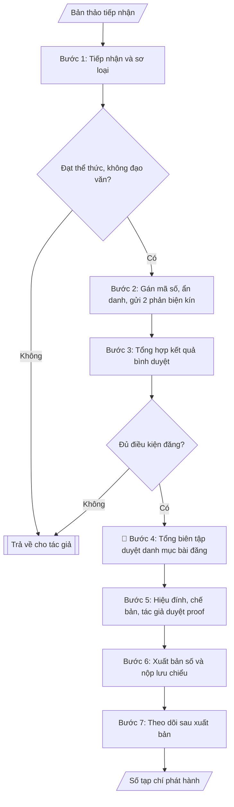

# Quản trị tạp chí khoa học

## Định dạng và file đầu ra

Định dạng đầu ra có thể chọn theo sản phẩm/yêu cầu: .docx, .pdf. Đọc mục “Định dạng bổ sung” trong quy cách đầu ra trước khi chọn.

**Phải tạo file thực tế để tải xuống, không chỉ trả nội dung trong chat.** Định dạng mặc định của skill: **.docx**. Nếu có bảng số liệu nghiệp vụ yêu cầu file bảng tính riêng, tạo thêm Excel theo yêu cầu; không tự tạo file kiểm tra. Không chờ người dùng yêu cầu xuất file lần nữa. Ưu tiên định dạng người dùng chỉ định; đọc quy tắc xuất file tại references/quy-cach-dau-ra.md.

## Quy cách đầu ra và thông tin thiếu

Đọc [quy cách và cấu trúc sản phẩm](references/quy-cach-dau-ra.md) trước khi soạn/xuất. File giao chỉ gồm văn bản hoặc sản phẩm nghiệp vụ được yêu cầu; kiểm tra nội bộ không xuất kèm. Thiếu thông tin giữ nguyên trường/mục và chỗ điền theo mẫu gốc (dòng dấu chấm, dấu gạch hoặc ô trống); không tự điền dữ liệu mẫu, số 0, mã chờ xác minh hoặc dòng chờ ký. Mẫu chuyên ngành còn áp dụng được ưu tiên về cấu trúc, mã biểu và người ký. Các trường “bắt buộc” là điều kiện hoàn thiện hồ sơ, không ngăn việc soạn bản có chỗ chừa để điền. Mọi chỉ dẫn “để trống” trong skill được hiểu là không điền dữ liệu và giữ cách chừa chỗ của mẫu gốc, không phải xóa dấu chấm của mẫu.

## Kiểm soát áp dụng và phê duyệt

Trước khi chạy quy trình, xác định `ngay_ap_dung`, `loai_hinh_truong`, `quy_che_noi_bo`, `nguon_du_lieu` và `nguoi_kiem_duyet`. Chỉ yêu cầu thông tin có liên quan đến nghiệp vụ; không dùng giá trị giả định thay dữ liệu bắt buộc. Đối chiếu nội bộ hồ sơ có yếu tố pháp lý với văn bản gốc, hiệu lực, điều khoản áp dụng và chuyển tiếp; không tự đính kèm bảng kiểm tra vào file giao.

## Giới hạn và human gate

AI hỗ trợ chuẩn bị và đối chiếu. Cán bộ phụ trách kiểm tra dữ liệu/căn cứ, người có thẩm quyền duyệt và ký. Văn bản soạn chưa được coi là đã ban hành; không tự chèn nhãn trạng thái kiểm duyệt vào file giao; không đánh dấu đã ký, đã duyệt hoặc đã công bố nếu chưa có chứng cứ. Dữ liệu sinh viên, sức khỏe, nhân sự và tài chính phải hạn chế theo mục đích, phân quyền và che thông tin định danh khi dùng ví dụ. Không tải dữ liệu lên dịch vụ ngoài khi chưa có quyền. Kiểm tra Luật 91/2025/QH15 về bảo vệ dữ liệu cá nhân (hiệu lực 01/01/2026) và quy định áp dụng trước xử lý/chia sẻ dữ liệu cá nhân.

## Khi nào dùng
Khi Ban biên tập tạp chí khoa học của trường cần tổ chức quy trình từ tiếp nhận bản thảo đến
xuất bản một số tạp chí: phân công phản biện, theo dõi tiến độ bình duyệt, hiệu đính, chế bản
và phát hành số mới.

## Đầu vào (Input)

| Trường | Mô tả | Bắt buộc |
|---|---|---|
| `ten_tap_chi` | Tên tạp chí, mã ISSN (in/điện tử) | Có |
| `so_tap_chi` | Số, tập, năm xuất bản dự kiến | Có |
| `ban_thao` | Danh sách bản thảo tiếp nhận (mã số, tên bài, tác giả, lĩnh vực) | Có |
| `hoi_dong_bien_tap` | Danh sách thành viên hội đồng biên tập, phản biện theo lĩnh vực | Có |
| `thoi_han` | Mốc thời gian: hạn phản biện, hạn hiệu đính, ngày phát hành | Có |
| `quy_dinh_binh_duyet` | Quy chế bình duyệt (số phản biện/bài, thang điểm, tiêu chí loại) | Không (mặc định: 2 phản biện kín/bài) |

## Quy trình

**Bước 1. Tiếp nhận và sơ loại bản thảo**
- Làm gì: với mỗi bản thảo trong `ban_thao`: kiểm tra thể thức theo quy định của tạp chí, chạy kiểm tra đạo văn/trùng lặp, đánh giá sự phù hợp với phạm vi của tạp chí; bản thảo không đạt thì trả về cho tác giả kèm lý do cụ thể; bản thảo đạt thì gán mã số và ẩn danh tác giả (xóa tên, đơn vị, lời cảm ơn — cả trong nội dung lẫn thuộc tính file) trước khi gửi phản biện.
- Dùng input: `ban_thao`, `ten_tap_chi`, `quy_dinh_binh_duyet`.
- Vai trò: Tổng biên tập · AI hỗ trợ: kiểm tra thể thức và đạo văn · ⏱ ~2–4 giờ (ước tính)
- Lưu ý nghiệp vụ: ẩn danh phải triệt để — kiểm tra cả metadata tác giả trong file, không chỉ nội dung; đây là điều kiện bắt buộc của bình duyệt kín.
- → Kết quả bước: danh sách bản thảo đã sơ loại (đạt/trả về + lý do) kèm mã số ẩn danh.

**Bước 2. Phân công bình duyệt kín**
- Làm gì: mỗi bản thảo đạt sơ loại gửi 02 phản biện độc lập cùng lĩnh vực từ `hoi_dong_bien_tap`; kiểm tra xung đột lợi ích (phản biện không cùng đơn vị hoặc có quan hệ cộng tác gần với tác giả); đặt hạn phản biện theo `thoi_han` (thường 21–30 ngày); gửi kèm phiếu nhận xét theo `quy_dinh_binh_duyet` (thang điểm, tiêu chí đánh giá).
- Dùng input: kết quả bước 1, `hoi_dong_bien_tap`, `thoi_han`, `quy_dinh_binh_duyet`.
- Vai trò: Thư ký Tòa soạn Tạp chí · AI hỗ trợ: đề xuất phân công phản biện · ⏱ ~1–2 giờ (ước tính)
- Lưu ý nghiệp vụ: tuyệt đối không tiết lộ danh tính phản biện cho tác giả và ngược lại; phản biện trễ hạn thì nhắc 01 lần, quá 7 ngày thì thay phản biện dự phòng để không vỡ tiến độ số tạp chí.
- → Kết quả bước: bảng phân công phản biện (mã bản thảo – 2 phản biện – hạn phản biện).

**Bước 3. Tổng hợp kết quả bình duyệt**
- Làm gì: thu nhận xét của 02 phản biện; phân loại mỗi bản thảo theo 4 mức: Chấp nhận / Sửa nhỏ / Sửa lớn & phản biện lại / Từ chối; trường hợp 02 phản biện chênh nhau từ 2 mức trở lên thì xin ý kiến phản biện thứ 3 hoặc trưởng ban chuyên môn; gửi nhận xét (đã ẩn danh) về cho tác giả, đặt hạn sửa bài.
- Dùng input: kết quả bước 2.
- Vai trò: Thư ký Tòa soạn Tạp chí · AI hỗ trợ: tổng hợp kết quả 2 phản biện và phân loại 4 mức · ⏱ ~1 giờ (ước tính)
- Lưu ý nghiệp vụ: AI không được thay phản biện chuyên môn đánh giá chất lượng khoa học của bản thảo; việc tổng hợp chỉ dựa trên nhận xét của phản biện, không tự ý nâng/hạ mức đánh giá.
- → Kết quả bước: bảng kết quả bình duyệt từng bản thảo (mức đánh giá + hạn sửa bài).

**Bước 4. Duyệt danh mục bài đăng**
- Làm gì: trưởng ban chuyên môn xác nhận kết quả bình duyệt từng lĩnh vực; Tổng biên tập duyệt danh mục bài đăng chính thức của số tạp chí (`so_tap_chi`) dựa trên kết quả bình duyệt, cân đối cơ cấu lĩnh vực và số trang; lập biên bản họp hội đồng biên tập.
- Dùng input: kết quả bước 3, `so_tap_chi`.
- Vai trò: Hội đồng biên tập, Tổng biên tập · AI hỗ trợ: chuẩn bị tài liệu họp, tổng hợp ý kiến · ⏱ ~1 buổi họp (ước tính, 2–3 giờ)
- Lưu ý nghiệp vụ: không tự ý chấp nhận/từ chối bản thảo thay Hội đồng biên tập; bài "Sửa lớn" chưa phản biện lại xong thì không đưa vào danh mục chính thức — chỉ ghi ở mức dự kiến.
- → Kết quả bước: quyết định danh mục bài đăng + biên bản họp hội đồng biên tập.

**Bước 5. Hiệu đính và chế bản**
- Làm gì: hiệu đính ngôn ngữ, chuẩn hóa định dạng trích dẫn, dàn trang theo khuôn khổ của tạp chí; gửi bản in thử (proof) cho tác giả duyệt; chốt bản cuối sau khi tác giả xác nhận.
- Dùng input: kết quả bước 4 (các bản thảo được duyệt đăng).
- Vai trò: Tác giả · AI hỗ trợ: hiệu đính ngôn ngữ · ⏱ ~3–5 ngày làm việc (ước tính)
- Lưu ý nghiệp vụ: ở vòng proof, tác giả chỉ được sửa lỗi chế bản, không được thay đổi nội dung khoa học đã được duyệt; mọi thay đổi sau proof phải có xác nhận của Tổng biên tập.
- → Kết quả bước: bản chế bản cuối cùng đã được tác giả duyệt proof.

**Bước 6. Xuất bản và lưu chiểu**
- Làm gì: phát hành số tạp chí (bản in/điện tử) đúng `thoi_han` phát hành; nộp lưu chiểu theo quy định của Luật Báo chí; cập nhật cơ sở dữ liệu bài báo của trường; công bố số mới trên website của tạp chí.
- Dùng input: kết quả bước 5, `thoi_han`, `ten_tap_chi`.
- Vai trò: Thư ký Tòa soạn Tạp chí · AI hỗ trợ: rà soát kỹ thuật, tổng hợp và lưu trữ hồ sơ · ⏱ ~1 ngày làm việc (ước tính)
- Lưu ý nghiệp vụ: nộp lưu chiểu đúng hạn là nghĩa vụ pháp lý — trễ lưu chiểu có thể bị xử phạt hành chính; kiểm tra mã ISSN in trên ấn phẩm khớp với ISSN đã đăng ký.
- → Kết quả bước: số tạp chí đã phát hành + biên nhận nộp lưu chiểu.

**Bước 7. Theo dõi sau xuất bản**
- Làm gì: ghi nhận chỉ số trích dẫn, lượt tải/đọc, phản hồi bạn đọc của số vừa phát hành; tổng hợp các chỉ số điều hành (tỷ lệ từ chối, thời gian bình duyệt trung bình...) làm bài học cho số tiếp theo.
- Dùng input: kết quả bước 6.
- Vai trò: Thư ký Tòa soạn Tạp chí · AI hỗ trợ: tổng hợp chỉ số trích dẫn, lượt tải và chỉ số điều hành · ⏱ ~30–60 phút (ước tính)
- Lưu ý nghiệp vụ: dữ liệu sau xuất bản là đầu vào cải tiến chất lượng tạp chí (VD: lĩnh vực nào thiếu bài, phản biện nào hay trễ hạn cần thay thế).
- → Kết quả bước: báo cáo theo dõi sau xuất bản.

## Luồng quy trình (Workflow)

## Đầu ra

File nghiệp vụ thực tế theo định dạng mặc định ở đầu skill hoặc định dạng người dùng yêu cầu, kèm liên kết tải trong phản hồi cuối.

Sản phẩm nghiệp vụ hoàn chỉnh theo [quy cách và cấu trúc](references/quy-cach-dau-ra.md), giữ các trường chưa có dữ liệu ở trạng thái trống. Không xuất kèm checklist/phụ lục kiểm tra đầu ra.

## Kiểm tra nội bộ trước khi giao

- [ ] Bố cục khớp mẫu áp dụng và cấu trúc tại references/quy-cach-dau-ra.md.
- [ ] Thông tin bản thảo (mã số, lĩnh vực, phản biện, kết quả, hạn sửa) khớp dữ liệu thực của số tạp chí.
- [ ] Danh mục bài đăng chính thức chỉ gồm bài đạt yêu cầu bình duyệt; bài "Sửa lớn" chưa phản biện lại không đưa vào danh mục chính thức.
- [ ] Không bịa đặt kết quả phản biện hoặc đánh giá chất lượng khoa học của bản thảo.
- [ ] Bình duyệt kín: danh tính phản biện và tác giả ẩn danh hai chiều, không tiết lộ chéo.
- [ ] Xuất bản đúng hạn; nộp lưu chiểu đúng hạn theo Luật Báo chí; mã ISSN trên ấn phẩm khớp ISSN đã đăng ký.
- [ ] Phiếu nhận xét phản biện dùng đúng thang điểm và tiêu chí theo quy chế bình duyệt.
- [ ] Đã qua Human gate: trưởng ban chuyên môn xác nhận kết quả bình duyệt; Tổng biên tập duyệt danh mục và ký phát hành; tác giả duyệt bản in thử.

Tiêu chí đạt = tất cả các ô được đánh dấu.

## Human gate
- **Tổng biên tập** duyệt danh mục bài đăng cuối cùng và ký duyệt phát hành số tạp chí.
- **Trưởng ban chuyên môn** xác nhận kết quả bình duyệt từng lĩnh vực trước khi gửi về tác giả.
- Tác giả duyệt bản in thử (proof) của bài mình trước khi dàn trang cuối.

## Giới hạn
- AI không được thay phản biện chuyên môn đánh giá chất lượng khoa học của bản thảo.
- Không tiết lộ danh tính phản biện cho tác giả và ngược lại (bình duyệt kín).
- Không tự ý chấp nhận/từ chối bản thảo thay Hội đồng biên tập.

## Căn cứ & lưu ý
- Luật Báo chí 2016 và các văn bản hướng dẫn về hoạt động tạp chí khoa học; quy chế bình duyệt
  nội bộ của tạp chí.
- Không dùng tên thật của trường/cá nhân/tạp chí khi mô phỏng.

## Quản trị phiên bản

- Phiên bản gói: `1.3.1`; ngày cập nhật: `2026-10-10`.
- Kho nguồn: https://github.com/phamtruong91/university-skills-framework
- Người duy trì trên GitHub: `phamtruong91` (Phạm Văn Trường). Người phê duyệt nghiệp vụ: **chưa chỉ định**.
- Commit nguồn trước cập nhật: `346719e6b0318ed034b4b016703f79733aa575e7`. Commit chứa phiên bản này xem bằng `git log -1 -- skills/quan-tri-tap-chi-khoa-hoc`; không tự gán SHA chưa tạo.
- Giấy phép: theo LICENSE của kho; bản quyền CES Global.
- Lịch sử 1.1.0: bổ sung metadata giao diện, kiểm soát áp dụng, quản trị phiên bản.
- Trạng thái: dự thảo nghiệp vụ; kiểm tra pháp lý trước thực thi. Ngày cập nhật không đồng nghĩa mọi văn bản đã được rà soát toàn văn.
