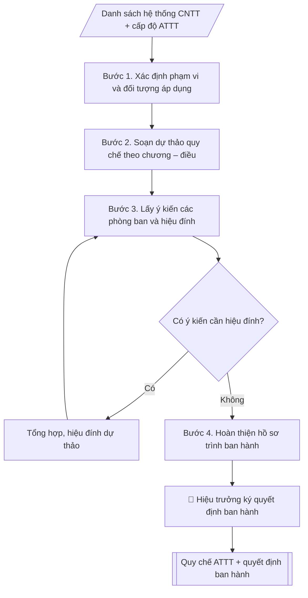

# Quy chế an toàn thông tin mạng

## Kiểm soát áp dụng và phê duyệt

Trước khi chạy quy trình, xác định `ngay_ap_dung`, `loai_hinh_truong`, `quy_che_noi_bo`, `nguon_du_lieu` và `nguoi_kiem_duyet`. Chỉ yêu cầu thông tin có liên quan đến nghiệp vụ; không dùng giá trị giả định thay dữ liệu bắt buộc. Hồ sơ có yếu tố pháp lý phải kèm văn bản gốc, tình trạng hiệu lực, điều khoản áp dụng và chuyển tiếp.

## Giới hạn và human gate

AI hỗ trợ chuẩn bị và đối chiếu. Cán bộ phụ trách kiểm tra dữ liệu/căn cứ, người có thẩm quyền duyệt và ký. Mọi đầu ra mặc định là **DỰ THẢO – CHỜ KIỂM DUYỆT**; không đánh dấu đã ký, đã duyệt hoặc đã công bố nếu chưa có chứng cứ. Dữ liệu sinh viên, sức khỏe, nhân sự và tài chính phải hạn chế theo mục đích, phân quyền và che thông tin định danh khi dùng ví dụ. Không tải dữ liệu lên dịch vụ ngoài khi chưa có quyền. Kiểm tra Luật 91/2025/QH15 về bảo vệ dữ liệu cá nhân (hiệu lực 01/01/2026) và quy định áp dụng trước xử lý/chia sẻ dữ liệu cá nhân.


## Khi nào dùng
Khi cần ban hành hoặc sửa đổi quy chế quản lý an toàn thông tin cho các hệ thống
CNTT của trường (SIS, LMS, email, website, dữ liệu dùng chung...).

## Đầu vào (Input)

| Trường | Mô tả | Bắt buộc |
|---|---|---|
| `pham_vi` | Hệ thống áp dụng (toàn trường / từng hệ thống) | Có |
| `cac_he_thong` | Danh sách hệ thống CNTT (SIS, LMS, email, website, wifi...) | Có |
| `cap_do_att` | Cấp độ an toàn thông tin mục tiêu (1–5) | Không (mặc định: cấp độ 3) |
| `don_vi_dau_moi` | Trung tâm CNTT | Không |

## Quy trình

**Bước 1. Xác định phạm vi và đối tượng áp dụng**
- Làm gì: từ `pham_vi` và `cac_he_thong`, liệt kê đầy đủ hệ thống thuộc phạm vi điều chỉnh (SIS, LMS, email, website, wifi nội bộ...); xác định đối tượng áp dụng (cán bộ, giảng viên, sinh viên, đơn vị vận hành, đối tác); chốt `cap_do_att` mục tiêu (mặc định cấp độ 3) và các yêu cầu tương ứng theo Nghị định 85/2016/NĐ-CP.
- Dùng input: `pham_vi`, `cac_he_thong`, `cap_do_att`.
- Vai trò: Chuyên viên Trung tâm CNTT · AI hỗ trợ: xử lý sơ bộ, tổng hợp · ⏱ ~30–90 phút (ước tính)
- Lưu ý nghiệp vụ: hệ thống nào không liệt kê trong phạm vi thì quy chế không điều chỉnh được — phải liệt kê đủ, kể cả hệ thống thuê ngoài/cloud.
- → Kết quả bước: Bảng phạm vi – đối tượng – cấp độ ATTT đã chốt.

**Bước 2. Soạn dự thảo quy chế theo chương – điều**
- Làm gì: viết dự thảo 6 chương: I. Quy định chung (phạm vi, đối tượng, nguyên tắc); II. Quản lý tài khoản và phân quyền (cấp phát, mật khẩu tối thiểu 08 ký tự, thay đổi 90 ngày/lần, thu hồi trong 07 ngày làm việc); III. Bảo vệ dữ liệu (phân loại, sao lưu hằng ngày 02 bản/02 vị trí, mã hóa dữ liệu nhạy cảm); IV. Sử dụng hệ thống (thiết bị đầu cuối, wifi, thư điện tử, cấm phần mềm không rõ nguồn gốc); V. Ứng phó sự cố (phát hiện – báo cáo trong 01 giờ – xử lý – báo cáo BGH trong 24 giờ); VI. Trách nhiệm và xử lý vi phạm + điều khoản thi hành.
- Dùng input: bảng phạm vi – đối tượng (Bước 1) + `don_vi_dau_moi`.
- Vai trò: Chuyên viên Trung tâm CNTT · AI hỗ trợ: soạn dự thảo, lưu trữ hồ sơ · ⏱ ~30–60 phút (ước tính)
- Lưu ý nghiệp vụ: mỗi điều phải ghi rõ "ai làm – làm gì – thời hạn"; dữ liệu sinh viên/cán bộ là dữ liệu cá nhân theo Luật Bảo vệ dữ liệu cá nhân 2025 — phải có điều khoản bảo vệ tương ứng; tham chiếu đúng văn bản pháp luật, không ghi căn cứ mơ hồ.
- → Kết quả bước: Dự thảo quy chế 6 chương (đầy đủ điều khoản).

**Bước 3. Lấy ý kiến các phòng ban và hiệu đính**
- Làm gì: gửi dự thảo cho các phòng/khoa/trung tâm góp ý (thời hạn 7–10 ngày làm việc); `don_vi_dau_moi` (Trung tâm CNTT) tổng hợp ý kiến vào bảng (ý kiến – đơn vị – tiếp thu/không tiếp thu + lý do); hiệu đính dự thảo.
- Dùng input: dự thảo quy chế (Bước 2).
- Vai trò: Chuyên viên Trung tâm CNTT · AI hỗ trợ: soạn dự thảo, tổng hợp, chuẩn hóa dữ liệu · ⏱ ~0,5–1 ngày làm việc (ước tính)
- Lưu ý nghiệp vụ: ý kiến không tiếp thu phải giải trình bằng văn bản; sau hiệu đính phải kiểm tra lại đánh số chương/điều không bị lệch.
- → Kết quả bước: Dự thảo hiệu đính + bảng tổng hợp ý kiến (tiếp thu/không tiếp thu).

**Bước 4. Hoàn thiện hồ sơ trình ban hành**
- Làm gì: soạn tờ trình Hiệu trưởng kèm dự thảo quy chế và bảng tổng hợp ý kiến; kiểm tra thể thức văn bản theo Nghị định 30/2020 (căn cứ ban hành, bố cục, chính tả); chuẩn bị kế hoạch phổ biến, tập huấn sau ban hành.
- Dùng input: dự thảo hiệu đính + bảng tổng hợp ý kiến (Bước 3).
- Vai trò: Chuyên viên Trung tâm CNTT (chuẩn bị hồ sơ trình); Hiệu trưởng (người ký) ban hành · AI hỗ trợ: soạn dự thảo, tổng hợp, chuẩn hóa dữ liệu · ⏱ ~1–3 giờ (ước tính)
- Lưu ý nghiệp vụ: căn cứ pháp lý phải còn hiệu lực tại thời điểm ban hành; quyết định ban hành phải ghi đúng tên quy chế kèm theo.
- → Kết quả bước: Hồ sơ trình ban hành (tờ trình + dự thảo quy chế + dự thảo quyết định ban hành + kế hoạch phổ biến).

## Luồng quy trình (Workflow)



## Đầu ra (Output)
- Văn bản quy chế an toàn thông tin mạng hoàn chỉnh (chương/điều).
- Quyết định ban hành quy chế.

**Cấu trúc output chuẩn** (khung mẫu cố định của sản phẩm chính — Quy chế ATTT mạng):
1. Tiêu đề quy chế + dòng ban hành (kèm theo Quyết định số... ngày... của Hiệu trưởng).
2. Chương I. Quy định chung (phạm vi điều chỉnh, đối tượng áp dụng, nguyên tắc, giải thích từ ngữ).
3. Chương II. Quản lý tài khoản và phân quyền (cấp phát, mật khẩu, phân quyền tối thiểu, thu hồi).
4. Chương III. Bảo vệ dữ liệu (phân loại, sao lưu, mã hóa, bảo vệ dữ liệu cá nhân).
5. Chương IV. Sử dụng hệ thống (thiết bị đầu cuối, mạng wifi, thư điện tử, phần mềm).
6. Chương V. Ứng phó sự cố (phát hiện, báo cáo, xử lý, khắc phục, báo cáo cơ quan chức năng).
7. Chương VI. Trách nhiệm và xử lý vi phạm + Điều khoản thi hành (hiệu lực, trách nhiệm phổ biến).
- Kèm theo: Quyết định ban hành quy chế.

## Checklist nghiệm thu

- [ ] Đủ các phần theo "Cấu trúc output chuẩn": Tiêu đề quy chế + dòng ban hành (kèm theo…; Chương I. Quy định chung (phạm vi điều…; Chương II. Quản lý tài khoản và phân quyền…; Chương III. Bảo vệ dữ liệu (phân loại, sao…; Chương IV. Sử dụng hệ thống (thiết bị đầu…; Chương V. Ứng phó sự cố (phát hiện, báo cáo,…; …
- [ ] Có đầy đủ sản phẩm: Văn bản quy chế an toàn thông tin mạng hoàn chỉnh (chương/điều)
- [ ] Có đầy đủ sản phẩm: Quyết định ban hành quy chế
- [ ] Mọi số liệu, tên, ngày tháng trong output khớp với Input đã cung cấp (không thêm bớt, không suy đoán)
- [ ] Không bịa đặt số liệu, minh chứng, trích dẫn hay căn cứ
- [ ] Đúng thể thức, định dạng văn bản theo quy định hiện hành
- [ ] Căn cứ pháp lý nêu đầy đủ, còn hiệu lực tại thời điểm lập
- [ ] Đã qua Human gate: người có thẩm quyền đã kiểm tra/ký duyệt trước khi phát hành
- [ ] Hệ thống nào không liệt kê trong phạm vi thì quy chế không điều chỉnh được — phải liệt kê đủ, kể cả hệ thống thuê ngoài/cloud.
- [ ] Mỗi điều phải ghi rõ "ai làm – làm gì – thời hạn"

> Tiêu chí đạt: tất cả các ô đều được đánh dấu.

## Ví dụ mô phỏng (dữ liệu giả lập)

> Tất cả tên trường, cá nhân, số liệu dưới đây đều là **giả lập**, không liên quan tổ chức/cá nhân có thật.

### Input mẫu

| Trường | Giá trị |
|---|---|
| `pham_vi` | Toàn trường |
| `cac_he_thong` | SIS, LMS, email @dha.edu.vn, website, wifi nội bộ |
| `cap_do_att` | Cấp độ 3 |

### Output mẫu (trích các điều chính)

```
QUY CHẾ AN TOÀN THÔNG TIN MẠNG
(Ban hành kèm theo Quyết định số 156/QĐ-ĐHA ngày 09/10/2026
 của Hiệu trưởng Trường Đại học A)

Chương I. QUY ĐỊNH CHUNG

Điều 1. Phạm vi điều chỉnh
Quy chế này quy định việc bảo đảm an toàn thông tin mạng đối với các hệ thống:
quản lý đào tạo (SIS), học trực tuyến (LMS), thư điện tử, website và mạng wifi
nội bộ của Trường Đại học A.

Điều 2. Đối tượng áp dụng
Cán bộ, giảng viên, sinh viên, học viên và các tổ chức, cá nhân sử dụng hệ thống
CNTT của Trường.

Chương II. QUẢN LÝ TÀI KHOẢN VÀ PHÂN QUYỀN

Điều 3. Cấp phát và quản lý tài khoản
1. Mỗi cá nhân được cấp 01 tài khoản định danh duy nhất; nghiêm cấm dùng chung
   hoặc cho mượn tài khoản.
2. Mật khẩu tối thiểu 08 ký tự, gồm chữ hoa, chữ thường, số và ký tự đặc biệt;
   bắt buộc thay đổi 90 ngày/lần.
3. Tài khoản của người nghỉ việc, tốt nghiệp được thu hồi trong 07 ngày làm việc.

Điều 4. Phân quyền truy cập
1. Phân quyền theo nguyên tắc "tối thiểu cần thiết" gắn với vai trò công việc.
2. Dữ liệu điểm thi, đề thi chỉ cán bộ Phòng Khảo thí & ĐBCL được truy cập.

Chương III. BẢO VỆ DỮ LIỆU

Điều 5. Sao lưu dữ liệu
1. Dữ liệu hệ thống SIS, LMS được sao lưu tự động hằng ngày, lưu trữ 02 bản
   tại 02 vị trí vật lý khác nhau.
2. Kiểm tra khả năng khôi phục dữ liệu 06 tháng/lần.

Điều 6. Bảo vệ dữ liệu cá nhân
Dữ liệu điểm thi, hồ sơ sinh viên, thông tin cán bộ được mã hóa khi lưu trữ
và truyền tải; chỉ sử dụng đúng mục đích công vụ.

Chương IV. SỬ DỤNG HỆ THỐNG

Điều 7. Thiết bị đầu cuối và mạng nội bộ
1. Cán bộ, giảng viên cài đặt phần mềm diệt virus do Trung tâm CNTT cấp phép;
   không cài đặt phần mềm không rõ nguồn gốc trên máy tính của Trường.
2. Mạng wifi nội bộ chia 02 vùng: vùng cán bộ (xác thực bằng tài khoản cá nhân)
   và vùng khách (đăng ký theo phiên).

Điều 8. Thư điện tử công vụ
1. Sử dụng email @dha.edu.vn cho mọi giao dịch công vụ; không chuyển tiếp
   tài liệu mật ra email cá nhân.

Chương V. ỨNG PHÓ SỰ CỐ

Điều 9. Quy trình ứng phó
1. Khi phát hiện sự cố (tấn công mạng, rò rỉ dữ liệu, mã độc), cá nhân báo ngay
   cho Trung tâm CNTT qua đường dây nóng trong 01 giờ.
2. Trung tâm CNTT cô lập hệ thống bị ảnh hưởng, đánh giá mức độ, khắc phục và
   báo cáo Ban Giám hiệu trong 24 giờ.
3. Sự cố nghiêm trọng được báo cáo cơ quan chức năng theo quy định.

Chương VI. TRÁCH NHIỆM, XỬ LÝ VI PHẠM VÀ ĐIỀU KHOẢN THI HÀNH

Điều 10. Cá nhân vi phạm quy chế tùy mức độ bị nhắc nhở, kỷ luật theo quy định
của Trường và pháp luật về an toàn thông tin mạng.

Điều 11. Hiệu lực và trách nhiệm phổ biến
1. Quy chế này có hiệu lực kể từ ngày ký Quyết định ban hành.
2. Trung tâm CNTT chủ trì phổ biến, tập huấn quy chế đến toàn thể cán bộ, giảng viên,
   sinh viên trong 30 ngày kể từ ngày ban hành.
```

## Căn cứ & lưu ý
- Luật An toàn thông tin mạng 2015; Nghị định 85/2016/NĐ-CP về bảo đảm ATTT theo cấp độ.
- Luật Bảo vệ dữ liệu cá nhân 2025 (hiệu lực từ 2026) — dữ liệu sinh viên/cán bộ là
  dữ liệu cá nhân, phải bảo vệ theo quy định.
- Quy chế phải được phổ biến, tập huấn đến toàn thể cán bộ, giảng viên, sinh viên;
  rà soát, cập nhật khi có thay đổi hệ thống hoặc quy định pháp luật.
- Không dùng tên thật của trường/cá nhân khi mô phỏng.

## Quản trị phiên bản

- Phiên bản gói: `1.1.0`; ngày cập nhật: `2026-10-09`.
- Kho nguồn: https://github.com/phamtruong91/dh-skills
- Người duy trì trên GitHub: `phamtruong91` (Phạm Văn Trường). Người phê duyệt nghiệp vụ: **chưa chỉ định**.
- Commit nguồn trước cập nhật: `78fd1d51b8acd1a724d9b9af6c488460bc7551ad`. Commit chứa phiên bản này xem bằng `git log -1 -- skills/quy-che-an-toan-thong-tin`; không tự gán SHA chưa tạo.
- Giấy phép: theo LICENSE của kho; bản quyền CES Global.
- Lịch sử 1.1.0: bổ sung metadata giao diện, kiểm soát áp dụng, quản trị phiên bản.
- Trạng thái: dự thảo nghiệp vụ; kiểm tra pháp lý trước thực thi. Ngày cập nhật không đồng nghĩa mọi văn bản đã được rà soát toàn văn.
