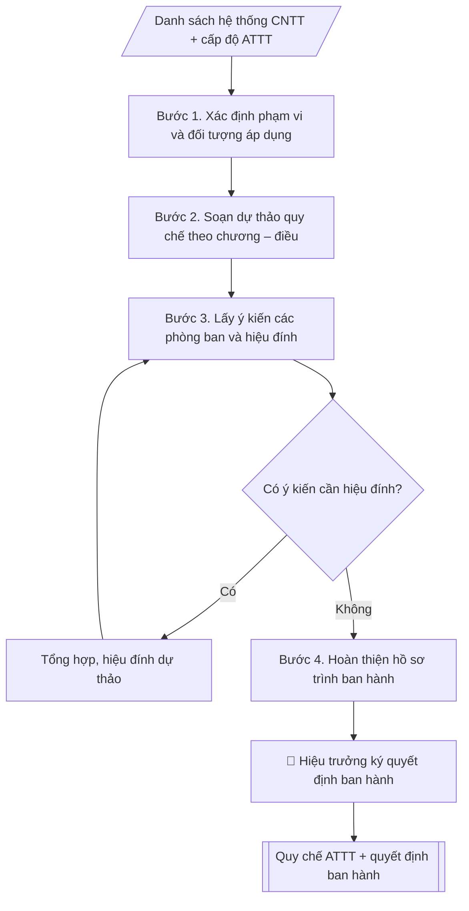

# Quy chế an toàn thông tin mạng

## Định dạng và file đầu ra

Định dạng đầu ra có thể chọn theo sản phẩm/yêu cầu: .docx, .pdf. Đọc mục “Định dạng bổ sung” trong quy cách đầu ra trước khi chọn.

**Phải tạo file thực tế để tải xuống, không chỉ trả nội dung trong chat.** Định dạng mặc định của skill: **.docx**. Nếu có bảng số liệu nghiệp vụ yêu cầu file bảng tính riêng, tạo thêm Excel theo yêu cầu; không tự tạo file kiểm tra. Không chờ người dùng yêu cầu xuất file lần nữa. Ưu tiên định dạng người dùng chỉ định; đọc quy tắc xuất file tại references/quy-cach-dau-ra.md.

## Quy cách đầu ra và thông tin thiếu

Đọc [quy cách và cấu trúc sản phẩm](references/quy-cach-dau-ra.md) trước khi soạn/xuất. File giao chỉ gồm văn bản hoặc sản phẩm nghiệp vụ được yêu cầu; kiểm tra nội bộ không xuất kèm. Thiếu thông tin giữ nguyên trường/mục và chỗ điền theo mẫu gốc (dòng dấu chấm, dấu gạch hoặc ô trống); không tự điền dữ liệu mẫu, số 0, mã chờ xác minh hoặc dòng chờ ký. Mẫu chuyên ngành còn áp dụng được ưu tiên về cấu trúc, mã biểu và người ký. Các trường “bắt buộc” là điều kiện hoàn thiện hồ sơ, không ngăn việc soạn bản có chỗ chừa để điền. Mọi chỉ dẫn “để trống” trong skill được hiểu là không điền dữ liệu và giữ cách chừa chỗ của mẫu gốc, không phải xóa dấu chấm của mẫu.

## Kiểm soát áp dụng và phê duyệt

Trước khi chạy quy trình, xác định `ngay_ap_dung`, `loai_hinh_truong`, `quy_che_noi_bo`, `nguon_du_lieu` và `nguoi_kiem_duyet`. Chỉ yêu cầu thông tin có liên quan đến nghiệp vụ; không dùng giá trị giả định thay dữ liệu bắt buộc. Đối chiếu nội bộ hồ sơ có yếu tố pháp lý với văn bản gốc, hiệu lực, điều khoản áp dụng và chuyển tiếp; không tự đính kèm bảng kiểm tra vào file giao.

## Giới hạn và human gate

AI hỗ trợ chuẩn bị và đối chiếu. Cán bộ phụ trách kiểm tra dữ liệu/căn cứ, người có thẩm quyền duyệt và ký. Văn bản soạn chưa được coi là đã ban hành; không tự chèn nhãn trạng thái kiểm duyệt vào file giao; không đánh dấu đã ký, đã duyệt hoặc đã công bố nếu chưa có chứng cứ. Dữ liệu sinh viên, sức khỏe, nhân sự và tài chính phải hạn chế theo mục đích, phân quyền và che thông tin định danh khi dùng ví dụ. Không tải dữ liệu lên dịch vụ ngoài khi chưa có quyền. Kiểm tra Luật 91/2025/QH15 về bảo vệ dữ liệu cá nhân (hiệu lực 01/01/2026) và quy định áp dụng trước xử lý/chia sẻ dữ liệu cá nhân.

## Khi nào dùng
Khi cần ban hành hoặc sửa đổi quy chế quản lý an toàn thông tin cho các hệ thống
CNTT của trường (SIS, LMS, email, website, dữ liệu dùng chung...).

## Đầu vào (Input)

| Trường | Mô tả | Bắt buộc |
|---|---|---|
| `pham_vi` | Hệ thống áp dụng (toàn trường / từng hệ thống) | Có |
| `cac_he_thong` | Danh sách hệ thống CNTT (SIS, LMS, email, website, wifi...) | Có |
| `cap_do_att` | Cấp độ an toàn thông tin mục tiêu (1–5) | Không (mặc định: cấp độ 3) |
| `don_vi_dau_moi` | Trung tâm CNTT | Không |

## Quy trình

**Bước 1. Xác định phạm vi và đối tượng áp dụng**
- Làm gì: từ `pham_vi` và `cac_he_thong`, liệt kê đầy đủ hệ thống thuộc phạm vi điều chỉnh (SIS, LMS, email, website, wifi nội bộ...); xác định đối tượng áp dụng (cán bộ, giảng viên, sinh viên, đơn vị vận hành, đối tác); chốt `cap_do_att` mục tiêu (mặc định cấp độ 3) và các yêu cầu tương ứng theo Nghị định 85/2016/NĐ-CP.
- Dùng input: `pham_vi`, `cac_he_thong`, `cap_do_att`.
- Vai trò: Chuyên viên Trung tâm CNTT · AI hỗ trợ: xử lý sơ bộ, tổng hợp · ⏱ ~30–90 phút (ước tính)
- Lưu ý nghiệp vụ: hệ thống nào không liệt kê trong phạm vi thì quy chế không điều chỉnh được — phải liệt kê đủ, kể cả hệ thống thuê ngoài/cloud.
- → Kết quả bước: Bảng phạm vi – đối tượng – cấp độ ATTT đã chốt.

**Bước 2. Soạn dự thảo quy chế theo chương – điều**
- Làm gì: viết dự thảo 6 chương: I. Quy định chung (phạm vi, đối tượng, nguyên tắc); II. Quản lý tài khoản và phân quyền (cấp phát, mật khẩu tối thiểu 08 ký tự, thay đổi 90 ngày/lần, thu hồi trong 07 ngày làm việc); III. Bảo vệ dữ liệu (phân loại, sao lưu hằng ngày 02 bản/02 vị trí, mã hóa dữ liệu nhạy cảm); IV. Sử dụng hệ thống (thiết bị đầu cuối, wifi, thư điện tử, cấm phần mềm không rõ nguồn gốc); V. Ứng phó sự cố (phát hiện – báo cáo trong 01 giờ – xử lý – báo cáo BGH trong 24 giờ); VI. Trách nhiệm và xử lý vi phạm + điều khoản thi hành.
- Dùng input: bảng phạm vi – đối tượng (Bước 1) + `don_vi_dau_moi`.
- Vai trò: Chuyên viên Trung tâm CNTT · AI hỗ trợ: soạn dự thảo, lưu trữ hồ sơ · ⏱ ~30–60 phút (ước tính)
- Lưu ý nghiệp vụ: mỗi điều phải ghi rõ "ai làm – làm gì – thời hạn"; dữ liệu sinh viên/cán bộ là dữ liệu cá nhân theo Luật Bảo vệ dữ liệu cá nhân 2025 — phải có điều khoản bảo vệ tương ứng; tham chiếu đúng văn bản pháp luật, không ghi căn cứ mơ hồ.
- → Kết quả bước: Dự thảo quy chế 6 chương (đầy đủ điều khoản).

**Bước 3. Lấy ý kiến các phòng ban và hiệu đính**
- Làm gì: gửi dự thảo cho các phòng/khoa/trung tâm góp ý (thời hạn 7–10 ngày làm việc); `don_vi_dau_moi` (Trung tâm CNTT) tổng hợp ý kiến vào bảng (ý kiến – đơn vị – tiếp thu/không tiếp thu + lý do); hiệu đính dự thảo.
- Dùng input: dự thảo quy chế (Bước 2).
- Vai trò: Chuyên viên Trung tâm CNTT · AI hỗ trợ: soạn dự thảo, tổng hợp, chuẩn hóa dữ liệu · ⏱ ~0,5–1 ngày làm việc (ước tính)
- Lưu ý nghiệp vụ: ý kiến không tiếp thu phải giải trình bằng văn bản; sau hiệu đính phải kiểm tra lại đánh số chương/điều không bị lệch.
- → Kết quả bước: Dự thảo hiệu đính + bảng tổng hợp ý kiến (tiếp thu/không tiếp thu).

**Bước 4. Hoàn thiện hồ sơ trình ban hành**
- Làm gì: soạn tờ trình Hiệu trưởng kèm dự thảo quy chế và bảng tổng hợp ý kiến; kiểm tra thể thức văn bản theo Nghị định 30/2020 (căn cứ ban hành, bố cục, chính tả); chuẩn bị kế hoạch phổ biến, tập huấn sau ban hành.
- Dùng input: dự thảo hiệu đính + bảng tổng hợp ý kiến (Bước 3).
- Vai trò: Chuyên viên Trung tâm CNTT (chuẩn bị hồ sơ trình); Hiệu trưởng (người ký) ban hành · AI hỗ trợ: soạn dự thảo, tổng hợp, chuẩn hóa dữ liệu · ⏱ ~1–3 giờ (ước tính)
- Lưu ý nghiệp vụ: căn cứ pháp lý phải còn hiệu lực tại thời điểm ban hành; quyết định ban hành phải ghi đúng tên quy chế kèm theo.
- → Kết quả bước: Hồ sơ trình ban hành (tờ trình + dự thảo quy chế + dự thảo quyết định ban hành + kế hoạch phổ biến).

## Luồng quy trình (Workflow)

## Đầu ra

File nghiệp vụ thực tế theo định dạng mặc định ở đầu skill hoặc định dạng người dùng yêu cầu, kèm liên kết tải trong phản hồi cuối.

Sản phẩm nghiệp vụ hoàn chỉnh theo [quy cách và cấu trúc](references/quy-cach-dau-ra.md), giữ các trường chưa có dữ liệu ở trạng thái trống. Không xuất kèm checklist/phụ lục kiểm tra đầu ra.

## Kiểm tra nội bộ trước khi giao

- [ ] Bố cục khớp mẫu áp dụng và cấu trúc tại references/quy-cach-dau-ra.md.
- [ ] Có đầy đủ sản phẩm: Văn bản quy chế an toàn thông tin mạng hoàn chỉnh (chương/điều)
- [ ] Có đầy đủ sản phẩm: Quyết định ban hành quy chế
- [ ] Mọi số liệu, tên, ngày tháng trong output khớp với Input đã cung cấp (không thêm bớt, không suy đoán)
- [ ] Không bịa đặt số liệu, minh chứng, trích dẫn hay căn cứ
- [ ] Đúng thể thức, định dạng văn bản theo quy định hiện hành
- [ ] Căn cứ pháp lý nêu đầy đủ, còn hiệu lực tại thời điểm lập
- [ ] Đã qua Human gate: người có thẩm quyền đã kiểm tra/ký duyệt trước khi phát hành
- [ ] Hệ thống nào không liệt kê trong phạm vi thì quy chế không điều chỉnh được — phải liệt kê đủ, kể cả hệ thống thuê ngoài/cloud.
- [ ] Mỗi điều phải ghi rõ "ai làm – làm gì – thời hạn"

> Tiêu chí đạt: tất cả các ô đều được đánh dấu.

## Căn cứ & lưu ý
- Luật An toàn thông tin mạng 2015; Nghị định 85/2016/NĐ-CP về bảo đảm ATTT theo cấp độ.
- Luật Bảo vệ dữ liệu cá nhân 2025 (hiệu lực từ 2026) — dữ liệu sinh viên/cán bộ là
  dữ liệu cá nhân, phải bảo vệ theo quy định.
- Quy chế phải được phổ biến, tập huấn đến toàn thể cán bộ, giảng viên, sinh viên;
  rà soát, cập nhật khi có thay đổi hệ thống hoặc quy định pháp luật.
- Không dùng tên thật của trường/cá nhân khi mô phỏng.

## Quản trị phiên bản

- Phiên bản gói: `1.3.1`; ngày cập nhật: `2026-10-10`.
- Kho nguồn: https://github.com/phamtruong91/university-skills-framework
- Người duy trì trên GitHub: `phamtruong91` (Phạm Văn Trường). Người phê duyệt nghiệp vụ: **chưa chỉ định**.
- Commit nguồn trước cập nhật: `346719e6b0318ed034b4b016703f79733aa575e7`. Commit chứa phiên bản này xem bằng `git log -1 -- skills/quy-che-an-toan-thong-tin`; không tự gán SHA chưa tạo.
- Giấy phép: theo LICENSE của kho; bản quyền CES Global.
- Lịch sử 1.1.0: bổ sung metadata giao diện, kiểm soát áp dụng, quản trị phiên bản.
- Trạng thái: dự thảo nghiệp vụ; kiểm tra pháp lý trước thực thi. Ngày cập nhật không đồng nghĩa mọi văn bản đã được rà soát toàn văn.
