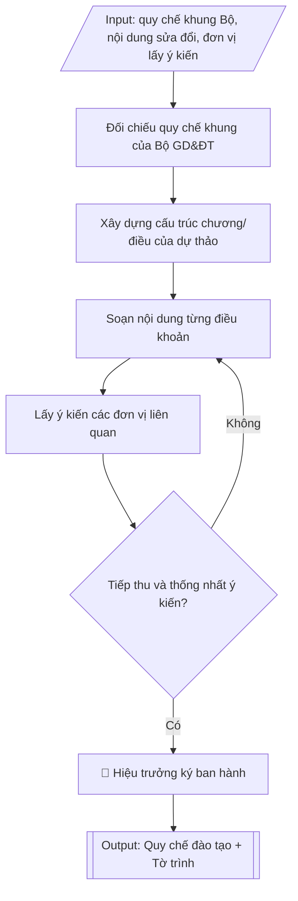

# Skill: Soạn/sửa đổi quy chế đào tạo của trường

## Khi nào dùng
Khi nhà trường cần ban hành mới hoặc sửa đổi, bổ sung quy chế đào tạo trình độ đại học:
đối chiếu quy chế khung của Bộ GD&ĐT, xây dựng các chương điều về tổ chức đào tạo, đánh giá
kết quả học tập, công tác học vụ, xét tốt nghiệp và xử lý vi phạm, lấy ý kiến các đơn vị
trước khi trình ban hành.

## Đầu vào (Input)

| Trường | Mô tả | Bắt buộc |
|---|---|---|
| `loai_van_ban` | Ban hành mới / Sửa đổi, bổ sung | Có |
| `quy_che_hien_hanh` | Số, ngày ban hành quy chế hiện hành (nếu loại Sửa đổi, bổ sung) | Không |
| `noi_dung_sua_doi` | Các điều/khoản cần sửa đổi, bổ sung và lý do | Có (nếu sửa đổi) |
| `hinh_thuc_dao_tao` | Chính quy / vừa làm vừa học / từ xa (quy chế áp dụng) | Có |
| `dieu_khoan_dac_thu` | Quy định đặc thù của trường muốn đưa vào (học vượt, học song ngành...) | Không |
| `don_vi_lay_y_kien` | Danh sách đơn vị lấy ý kiến (các khoa, phòng ban liên quan) | Có |
| `nguoi_trinh` | Đơn vị trình (Phòng Đào tạo) và người ký ban hành (Hiệu trưởng) | Có |

## Quy trình

**Bước 1. Đối chiếu quy chế khung của Bộ GD&ĐT**
- Làm gì: rà soát Thông tư 08/2021/TT-BGDĐT (quy chế đào tạo trình độ đại học): xác định các
  nội dung bắt buộc trường phải tuân thủ và các nội dung Bộ giao trường quy định chi tiết;
  nếu là sửa đổi (`loai_van_ban` = Sửa đổi, bổ sung) thì đối chiếu `quy_che_hien_hanh` với
  quy chế khung để đánh dấu các điểm chưa phù hợp hoặc đã lạc hậu; lập bảng đối chiếu các
  nội dung cần bổ sung/sửa đổi từ `noi_dung_sua_doi`.
- Dùng input: `loai_van_ban`, `quy_che_hien_hanh`, `noi_dung_sua_doi`, `hinh_thuc_dao_tao`.
- Vai trò: Chuyên viên Phòng Đào tạo · AI hỗ trợ: rà soát văn bản Thông tư 08/2021 và văn bản sửa đổi, lập bảng đối chiếu · ⏱ ~1 giờ (ước tính)
- Lưu ý nghiệp vụ: quy chế của trường không được trái quy chế khung của Bộ — đây là nguyên
  tắc "trần" không thể vi phạm; kiểm tra cả văn bản sửa đổi, bổ sung Thông tư 08/2021 (nếu có)
  để dùng bản quy chế khung đang có hiệu lực; ghi rõ lý do của từng nội dung sửa đổi để
  thuyết minh khi trình ký.
- → Kết quả bước: bảng đối chiếu quy chế khung – quy chế hiện hành, xác định các nội dung
  bắt buộc và các điểm cần sửa đổi, bổ sung.

**Bước 2. Xây dựng cấu trúc chương/điều của dự thảo**
- Làm gì: dựng khung cấu trúc dự thảo gồm các chương: (1) Quy định chung; (2) Tổ chức đào tạo
  (kế hoạch, thời khóa biểu, đăng ký học phần); (3) Đánh giá kết quả học tập và xếp loại
  (đánh giá học phần, thang điểm, điểm trung bình); (4) Công tác học vụ (cảnh báo học vụ,
  thôi học, bảo lưu, chuyển trường/ngành); (5) Xét và công nhận tốt nghiệp; (6) Xử lý vi phạm
  và khiếu nại; (7) Điều khoản thi hành; chèn các điều khoản đặc thù từ `dieu_khoan_dac_thu`
  vào chương phù hợp.
- Dùng input: `dieu_khoan_dac_thu`, `hinh_thuc_dao_tao`, kết quả Bước 1 (các nội dung cần
- Vai trò: Chuyên viên Phòng Đào tạo · AI hỗ trợ: dựng dàn ý cấu trúc chương/điều, kiểm tra bao phủ nội dung Bộ giao · ⏱ ~1 giờ (ước tính)
  sửa đổi).
- Lưu ý nghiệp vụ: cấu trúc phải bao phủ hết các nội dung Bộ giao trường quy định chi tiết —
  thiếu chương/mục là lỗi khi thẩm định pháp chế; điều khoản đặc thù của trường (học vượt,
  học song ngành) phải đặt đúng chương và không trái quy chế khung.
- → Kết quả bước: dàn ý cấu trúc chương/điều của dự thảo quy chế (khung xương chi tiết đến
  từng điều dự kiến).

**Bước 3. Soạn nội dung từng điều khoản**
- Làm gì: viết nội dung từng điều theo dàn ý Bước 2: câu văn quy phạm rõ ràng, thống nhất
  thuật ngữ trong toàn văn bản; mỗi điều quy định đầy đủ chủ thể, điều kiện, trình tự, thẩm
  quyền; kiểm tra từng điều không trái quy chế khung của Bộ.
- Dùng input: kết quả Bước 1–2, `noi_dung_sua_doi`, `dieu_khoan_dac_thu`.
- Vai trò: Chuyên viên Phòng Đào tạo · AI hỗ trợ: soạn dự thảo từng điều, kiểm tra thuật ngữ thống nhất và tính hợp pháp · ⏱ ~2 giờ (ước tính)
- Lưu ý nghiệp vụ: bẫy thường gặp — thuật ngữ không thống nhất giữa các điều (lúc "sinh viên",
  lúc "người học"); điều khoản thiếu một trong bốn yếu tố (chủ thể, điều kiện, trình tự, thẩm
  quyền) gây khó áp dụng; các mức số (tín chỉ tối đa, % học trực tuyến, thang điểm) phải khớp
  với nội dung sửa đổi đã xác định ở Bước 1.
- → Kết quả bước: dự thảo quy chế hoàn chỉnh đến từng điều khoản, thống nhất thuật ngữ.

**Bước 4. Lấy ý kiến các đơn vị liên quan**
- Làm gì: gửi dự thảo Bước 3 đến `don_vi_lay_y_kien` (các khoa, Phòng Khảo thí & ĐBCL, Phòng
  CTSV, Phòng Thanh tra & Pháp chế...); thu thập ý kiến góp ý; tổng hợp và giải trình từng ý
  kiến (tiếp thu/không tiếp thu và lý do); chỉnh sửa dự thảo theo các ý kiến được tiếp thu.
- Dùng input: `don_vi_lay_y_kien`, kết quả Bước 3 (dự thảo).
- Vai trò: Chuyên viên Phòng Đào tạo gửi và theo dõi; các đơn vị liên quan góp ý · AI hỗ trợ: tổng hợp ý kiến góp ý, soạn giải trình tiếp thu/không tiếp thu · ⏱ ~3–5 ngày làm việc (ước tính)
- Lưu ý nghiệp vụ: Phòng Thanh tra & Pháp chế thẩm định tính hợp pháp là bước bắt buộc —
  không được bỏ qua; mọi ý kiến không tiếp thu phải có giải trình bằng văn bản để tránh khiếu
  nại sau này; lưu đầy đủ văn bản góp ý làm hồ sơ ban hành.
- → Kết quả bước: bảng tổng hợp ý kiến góp ý và giải trình tiếp thu; dự thảo đã chỉnh sửa
  sau lấy ý kiến.

**Bước 5. Hoàn thiện, trình ký và ban hành**
- Làm gì: rà soát lần cuối dự thảo sau Bước 4 (chính tả, thể thức, đánh số điều); Phòng Đào
  tạo lập tờ trình kèm dự thảo và bảng tổng hợp ý kiến; trình `nguoi_trinh` — Hiệu trưởng ký
  quyết định ban hành; công bố quy chế và phổ biến đến toàn thể giảng viên, sinh viên.
- Dùng input: `nguoi_trinh`, kết quả Bước 4.
- Vai trò: Hiệu trưởng ký ban hành; chuyên viên Phòng Đào tạo hoàn thiện tờ trình và công bố · AI hỗ trợ: rà soát chính tả/thể thức, chuẩn bị hồ sơ trình ký · ⏱ ~1 ngày làm việc (ước tính)
- Lưu ý nghiệp vụ: quy chế chỉ có hiệu lực kể từ ngày ký quyết định ban hành — phải ghi rõ
  hiệu lực và quy chế cũ bị thay thế; sau ban hành phải phổ biến rộng rãi (website, email,
  buổi phổ biến đầu năm học) thì quy chế mới thực sự đi vào thực tiễn.
- → Kết quả bước: quy chế đào tạo đã ký ban hành kèm tờ trình; bảng đối chiếu điểm mới so
  với quy chế khung của Bộ/quy chế cũ.

## Luồng quy trình (Workflow)


## Đầu ra (Output)
- Dự thảo quy chế đào tạo có cấu trúc chương/điều hoàn chỉnh, kèm tờ trình ban hành.
- Bảng tổng hợp ý kiến góp ý và giải trình tiếp thu.
- Bảng đối chiếu điểm mới so với quy chế khung của Bộ / quy chế cũ.

**Cấu trúc output chuẩn:** khung mẫu CỐ ĐỊNH của sản phẩm chính (Quy chế đào tạo của trường),
các phần bắt buộc theo đúng thứ tự xuất hiện:
1. Tờ trình ban hành: tiêu đề hành chính, tên tờ trình, kính gửi Hiệu trưởng, căn cứ trình,
   nội dung trình (lý do ban hành/sửa đổi, tóm tắt điểm mới), nơi nhận, chữ ký người trình.
2. Dự thảo quy chế — Phần mở đầu: tên quy chế; quyết định ban hành kèm theo (số, ngày, người ký).
3. Chương I – Quy định chung: phạm vi điều chỉnh, đối tượng áp dụng, giải thích từ ngữ,
   mục tiêu đào tạo.
4. Chương II – Tổ chức đào tạo: kế hoạch đào tạo, đăng ký học phần, tổ chức lớp học, hình
   thức tổ chức dạy – học.
5. Chương III – Đánh giá kết quả học tập và xếp loại: đánh giá học phần, điểm học phần
   (thang điểm), điểm trung bình tích lũy và xếp loại.
6. Chương IV – Công tác học vụ: cảnh báo học vụ, thôi học, bảo lưu kết quả, chuyển
   ngành/chuyển trường.
7. Chương V – Xét và công nhận tốt nghiệp: điều kiện xét tốt nghiệp, công nhận tốt nghiệp.
8. Chương VI – Xử lý vi phạm và khiếu nại.
9. Chương VII – Điều khoản thi hành: hiệu lực thi hành, trách nhiệm thi hành; chữ ký người
   ký ban hành.
10. Tài liệu kèm theo: Bảng tổng hợp ý kiến góp ý và giải trình tiếp thu; Bảng đối chiếu
    điểm mới so với quy chế khung của Bộ/quy chế cũ.

## Checklist nghiệm thu

- [ ] Đủ 10 phần theo "Cấu trúc output chuẩn": tờ trình ban hành, phần mở đầu quy chế, Chương I quy định chung, Chương II tổ chức đào tạo, Chương III đánh giá và xếp loại, Chương IV công tác học vụ, Chương V xét và công nhận tốt nghiệp, Chương VI xử lý vi phạm và khiếu nại, Chương VII điều khoản thi hành, bảng tổng hợp ý kiến + bảng đối chiếu điểm mới.
- [ ] Bao phủ hết các nội dung Bộ giao trường quy định chi tiết (không thiếu chương/mục); điều khoản đặc thù đặt đúng chương.
- [ ] Không có điều khoản nào trái quy chế khung của Bộ; dùng bản quy chế khung đang có hiệu lực (kể cả văn bản sửa đổi, bổ sung).
- [ ] Thuật ngữ thống nhất toàn văn bản; mỗi điều quy định đầy đủ 4 yếu tố: chủ thể, điều kiện, trình tự, thẩm quyền.
- [ ] Các mức số (tín chỉ tối đa, % học trực tuyến, thang điểm...) khớp nội dung sửa đổi đã xác định ở bước đối chiếu.
- [ ] Đã lấy ý kiến đầy đủ các đơn vị; Phòng Thanh tra & Pháp chế đã thẩm định tính hợp pháp; ý kiến không tiếp thu có giải trình bằng văn bản, hồ sơ góp ý lưu đầy đủ.
- [ ] Ghi rõ hiệu lực thi hành và quy chế cũ bị thay thế; quy chế được phổ biến rộng rãi sau ban hành.
- [ ] Mọi số liệu, số văn bản, điều khoản trích dẫn khớp Input; không bịa đặt.
- [ ] Căn cứ pháp lý đầy đủ, còn hiệu lực; đúng thể thức văn bản hành chính theo NĐ 30/2020/NĐ-CP.
- [ ] Đã qua Human gate: Hiệu trưởng đã ký quyết định ban hành.

Tiêu chí đạt = tất cả các ô được đánh dấu.

## Ví dụ mô phỏng (dữ liệu giả lập)

> Tất cả tên trường, cá nhân, số liệu dưới đây đều là **giả lập**, không liên quan tổ chức/cá nhân có thật.

### Input mẫu

| Trường | Giá trị |
|---|---|
| `loai_van_ban` | Sửa đổi, bổ sung |
| `quy_che_hien_hanh` | Quyết định số 88/QĐ-ĐHA ngày 15/8/2022 của Hiệu trưởng Trường Đại học A |
| `noi_dung_sua_doi` | 1. Bổ sung quy định học vượt và tốt nghiệp sớm (Điều 12a). 2. Điều chỉnh thang điểm đánh giá học phần sang thang điểm 10 chi tiết đến 0,1 (Điều 18). 3. Bổ sung quy định học trực tuyến tối đa 30% khối lượng CTĐT (Điều 7). |
| `hinh_thuc_dao_tao` | Chính quy |
| `dieu_khoan_dac_thu` | Cho phép sinh viên đăng ký tối đa 25 tín chỉ/học kỳ nếu điểm TB tích lũy ≥ 3,2/4 |
| `don_vi_lay_y_kien` | Các khoa; Phòng Khảo thí & ĐBCL; Phòng CTSV; Phòng Thanh tra & Pháp chế |
| `nguoi_trinh` | Phòng Đào tạo (Trưởng phòng ThS. Đỗ Thị A) trình; Hiệu trưởng ký ban hành |

### Output mẫu

```
TRƯỜNG ĐẠI HỌC A
PHÒNG ĐÀO TẠO
      Số: 72/TTr-ĐHA-ĐT
                                                 Thành phố C, ngày 09 tháng 10 năm 2026

TỜ TRÌNH
Về việc ban hành Quy chế đào tạo trình độ đại học (sửa đổi, bổ sung)

Kính gửi: Hiệu trưởng Trường Đại học A

Căn cứ Thông tư 08/2021/TT-BGDĐT ngày 18/3/2021 của Bộ trưởng Bộ Giáo dục và Đào tạo
ban hành Quy chế đào tạo trình độ đại học;
Căn cứ nhu cầu cập nhật các quy định về học trực tuyến, học vượt và thang điểm đánh giá;
Phòng Đào tạo kính trình Hiệu trưởng xem xét, ban hành Quy chế đào tạo trình độ đại học
(sửa đổi, bổ sung) của Trường Đại học A (dự thảo kèm theo).

Dự thảo đã được lấy ý kiến các khoa, Phòng Khảo thí & ĐBCL, Phòng CTSV, Phòng Thanh tra &
Pháp chế; các ý kiến đã được tổng hợp, tiếp thu (bảng tổng hợp kèm theo).

Kính trình Hiệu trưởng xem xét, quyết định./.

Nơi nhận:                                    TRƯỞNG PHÒNG ĐÀO TẠO
- Như trên;                                       (đã ký)
- Lưu: VT, ĐT.
                                             ThS. Đỗ Thị A
```

```
DỰ THẢO
QUY CHẾ ĐÀO TẠO TRÌNH ĐỘ ĐẠI HỌC
TRƯỜNG ĐẠI HỌC A
(Ban hành kèm theo Quyết định số .../QĐ-ĐHA ngày .../.../2026 của Hiệu trưởng)

Chương I. QUY ĐỊNH CHUNG
Điều 1. Phạm vi điều chỉnh và đối tượng áp dụng
Quy chế này quy định về tổ chức đào tạo, đánh giá kết quả học tập, công tác học vụ,
xét tốt nghiệp trình độ đại học hình thức chính quy tại Trường Đại học A (sau
đây gọi là Trường).
Điều 2. Giải thích từ ngữ
Các thuật ngữ "học phần", "tín chỉ", "điểm trung bình tích lũy" được hiểu theo Quy chế
đào tạo trình độ đại học ban hành kèm theo Thông tư 08/2021/TT-BGDĐT.
Điều 3. Mục tiêu đào tạo
Đào tạo cử nhân, kỹ sư có phẩm chất, năng lực đáp ứng chuẩn đầu ra của chương trình
đào tạo đã công bố.

Chương II. TỔ CHỨC ĐÀO TẠO
Điều 4. Kế hoạch đào tạo
Phòng Đào tạo chủ trì xây dựng kế hoạch đào tạo toàn khóa và từng học kỳ, trình Hiệu
trưởng phê duyệt trước khi triển khai.
Điều 5. Đăng ký học phần
Sinh viên đăng ký học phần theo kế hoạch học tập cá nhân trong thời gian quy định;
khối lượng đăng ký tối thiểu 14 tín chỉ/học kỳ, tối đa 25 tín chỉ/học kỳ đối với sinh
viên có điểm trung bình tích lũy từ 3,2/4 trở lên.
Điều 6. Tổ chức lớp học
Lớp học phần được tổ chức khi có tối thiểu 20 sinh viên đăng ký, trừ các học phần
đặc thù do Hiệu trưởng quyết định.
Điều 7. Hình thức tổ chức dạy – học (ĐIỀU BỔ SUNG MỚI)
Ngoài hình thức trực tiếp, Trường tổ chức một phần nội dung đào tạo bằng hình thức
trực tuyến, tối đa không quá 30% tổng khối lượng của chương trình đào tạo, bảo đảm
chất lượng theo quy định.

Chương III. ĐÁNH GIÁ KẾT QUẢ HỌC TẬP VÀ XẾP LOẠI
Điều 15. Đánh giá học phần
Kết quả học tập của sinh viên được đánh giá qua quá trình học và thi kết thúc học phần,
tổng trọng số các thành phần đánh giá bằng 100%.
Điều 16. Điểm học phần
Điểm học phần tính theo thang điểm 10, chi tiết đến 0,1; quy đổi sang thang điểm 4 và
xếp loại theo quy định. (ĐIỀU ĐƯỢC SỬA ĐỔI: trước đây chi tiết đến 0,5)
Điều 17. Điểm trung bình tích lũy và xếp loại học lực
Xếp loại: Xuất sắc (3,6–4,0); Giỏi (3,2–3,59); Khá (2,5–3,19); Trung bình (2,0–2,49);
Trung bình yếu (1,0–1,99).

Chương IV. CÔNG TÁC HỌC VỤ
Điều 20. Cảnh báo học vụ
Sinh viên bị cảnh báo học vụ khi điểm trung bình tích lũy dưới 2,0 hoặc số tín chỉ
tích lũy không đạt tiến độ quy định.
Điều 21. Thôi học, bảo lưu kết quả học tập
Sinh viên được bảo lưu kết quả học tập tối đa 02 học kỳ trong toàn khóa học theo đơn
đề nghị và quyết định của Hiệu trưởng.
Điều 22. Chuyển ngành, chuyển trường
Thực hiện theo quy định của Bộ GD&ĐT và hướng dẫn chi tiết của Phòng Đào tạo.

Chương V. XÉT VÀ CÔNG NHẬN TỐT NGHIỆP
Điều 25. Điều kiện xét tốt nghiệp
Sinh viên được xét tốt nghiệp khi tích lũy đủ số tín chỉ của CTĐT, điểm trung bình
tích lũy từ 2,0 trở lên, hoàn thành các yêu cầu về giáo dục quốc phòng, giáo dục thể
chất và chuẩn đầu ra ngoại ngữ, tin học.
Điều 26. Công nhận tốt nghiệp
Hiệu trưởng ra quyết định công nhận tốt nghiệp theo đợt xét của Hội đồng xét tốt nghiệp.

Chương VI. XỬ LÝ VI PHẠM VÀ KHIẾU NẠI (ĐIỀU BỔ SUNG: Điều 12a – Học vượt và tốt nghiệp sớm)
Điều 12a. Học vượt và tốt nghiệp sớm
Sinh viên có điểm trung bình tích lũy từ 3,2/4 trở lên được đăng ký học vượt để rút ngắn
thời gian đào tạo, tối thiểu 3 năm đối với chương trình 4 năm, bảo đảm đạt chuẩn đầu ra.
Điều 28. Xử lý vi phạm trong thi cử
Sinh viên vi phạm quy chế thi bị xử lý từ khiển trách đến đình chỉ thi, hủy kết quả
tùy mức độ; tái phạm bị buộc thôi học.
Điều 29. Khiếu nại
Sinh viên có quyền khiếu nại quyết định liên quan đến kết quả học tập, học vụ theo
trình tự quy định của pháp luật về khiếu nại.

Chương VII. ĐIỀU KHOẢN THI HÀNH
Điều 30. Hiệu lực thi hành
Quy chế này có hiệu lực kể từ ngày ký và thay thế Quy chế ban hành theo Quyết định
số 88/QĐ-ĐHA ngày 15/8/2022.
Điều 31. Trách nhiệm thi hành
Trưởng phòng Đào tạo, Trưởng các khoa và các đơn vị liên quan chịu trách nhiệm thi
hành Quy chế này.

                                        KT. HIỆU TRƯỞNG
                                        PHÓ HIỆU TRƯỞNG

                                        (dự thảo – chờ ký)

                                   PGS.TS. Trần Văn B
```

**Bảng đối chiếu điểm mới (kèm theo)**

| Nội dung | Quy chế cũ (QĐ 88/2022) | Dự thảo sửa đổi |
|---|---|---|
| Học trực tuyến | Chưa quy định | Tối đa 30% khối lượng CTĐT (Điều 7 mới) |
| Thang điểm học phần | Chi tiết đến 0,5 | Chi tiết đến 0,1 (Điều 16 sửa đổi) |
| Học vượt, tốt nghiệp sớm | Chưa quy định | Cho phép nếu TB tích lũy ≥ 3,2/4 (Điều 12a mới) |
| Đăng ký tối đa/học kỳ | 21 tín chỉ | 25 tín chỉ nếu TB tích lũy ≥ 3,2/4 (Điều 5 sửa đổi) |

## Căn cứ & lưu ý
- Thông tư 08/2021/TT-BGDĐT ngày 18/3/2021 của Bộ GD&ĐT ban hành Quy chế đào tạo trình độ
  đại học (quy chế khung).
- Quy chế của trường không được trái với quy chế khung của Bộ; các nội dung Bộ giao trường
  quy định chi tiết phải được thể chế hóa đầy đủ.
- Dự thảo phải qua lấy ý kiến các đơn vị liên quan và Phòng Thanh tra & Pháp chế thẩm định
  trước khi trình Hiệu trưởng ký ban hành.
- Không dùng tên thật của trường/cá nhân khi mô phỏng.
