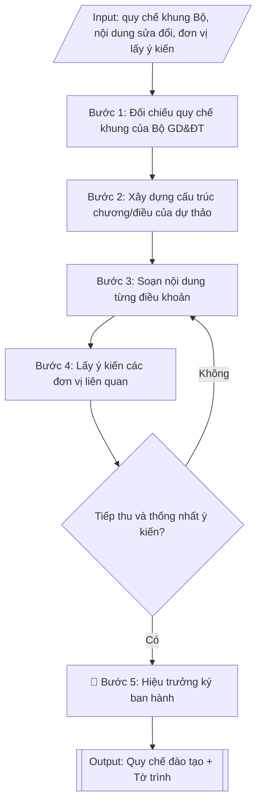

# Soạn/sửa đổi quy chế đào tạo của trường

## Định dạng và file đầu ra
Định dạng đầu ra có thể chọn theo sản phẩm/yêu cầu: .docx, .pdf. Đọc mục “Định dạng bổ sung” trong quy cách đầu ra trước khi chọn.

**Phải tạo file thực tế để tải xuống, không chỉ trả nội dung trong chat.** Định dạng mặc định của skill: **.docx**. Nếu có bảng số liệu nghiệp vụ yêu cầu file bảng tính riêng, tạo thêm Excel theo yêu cầu; không tự tạo file kiểm tra. Không chờ người dùng yêu cầu xuất file lần nữa. Ưu tiên định dạng người dùng chỉ định; đọc quy tắc xuất file tại references/quy-cach-dau-ra.md.

## Quy cách đầu ra và thông tin thiếu
Khi dựng file Word/Excel, áp dụng mục “Thể thức và bảng biểu khi dựng file” trong quy cách đầu ra (cỡ chữ từng thành phần, bảng nhiều trang, số trang, phụ lục). Đọc [quy cách và cấu trúc sản phẩm](references/quy-cach-dau-ra.md) trước khi soạn/xuất. File giao chỉ gồm sản phẩm nghiệp vụ được yêu cầu; kiểm tra nội bộ không xuất kèm. Thiếu thông tin thì giữ nguyên trường/mục và chỗ điền theo mẫu gốc (dòng dấu chấm, dấu gạch hoặc ô trống); không tự điền dữ liệu mẫu, số 0, mã chờ xác minh hay dòng chờ ký. Mẫu chuyên ngành còn áp dụng được ưu tiên về cấu trúc, mã biểu và người ký. Bản đầy đủ: [quy tắc chung](references/quy-tac-chung.md).

## Kiểm soát áp dụng và phê duyệt
Trước khi chạy, xác định `ngay_ap_dung`, `loai_hinh_truong`, `quy_che_noi_bo`, `nguon_du_lieu`, `nguoi_kiem_duyet`; chỉ hỏi thông tin liên quan nghiệp vụ, không dùng giá trị giả định thay dữ liệu bắt buộc. Đối chiếu căn cứ pháp lý với văn bản gốc, hiệu lực, điều khoản áp dụng và chuyển tiếp. Bản đầy đủ: [quy tắc chung](references/quy-tac-chung.md).

Nếu có cập nhật pháp lý dưới đây, đọc [căn cứ và điều kiện áp dụng](references/phap-ly.md) trước khi làm. Quy trình dưới đây giữ nghiệp vụ từ bản gốc; mọi viện dẫn văn bản, mẫu biểu, điều khoản phải theo căn cứ đã chọn trong phap-ly.md, không theo văn bản cũ.

## Giới hạn và human gate
AI hỗ trợ chuẩn bị và đối chiếu; cán bộ phụ trách kiểm tra dữ liệu/căn cứ, người có thẩm quyền duyệt và ký. Không đánh dấu đã ký, đã duyệt, đã công bố khi chưa có chứng cứ. Dữ liệu sinh viên, sức khỏe, nhân sự, tài chính chỉ dùng theo mục đích và phân quyền, che thông tin định danh khi dùng ví dụ (Luật 91/2025/QH15, hiệu lực 01/01/2026); không tải dữ liệu lên dịch vụ ngoài khi chưa có quyền. Bản đầy đủ: [quy tắc chung](references/quy-tac-chung.md).

## Khi nào dùng
Khi nhà trường cần ban hành mới hoặc sửa đổi, bổ sung quy chế đào tạo trình độ đại học:
đối chiếu quy chế khung của Bộ GD&ĐT, xây dựng các chương điều về tổ chức đào tạo, đánh giá
kết quả học tập, công tác học vụ, xét tốt nghiệp và xử lý vi phạm, lấy ý kiến các đơn vị
trước khi trình ban hành.

## Đầu vào (Input)
| Trường | Mô tả | Bắt buộc |
|---|---|---|
| `loai_van_ban` | Ban hành mới / Sửa đổi, bổ sung | Có |
| `quy_che_hien_hanh` | Số, ngày ban hành quy chế hiện hành (nếu loại Sửa đổi, bổ sung) | Không |
| `noi_dung_sua_doi` | Các điều/khoản cần sửa đổi, bổ sung và lý do | Có (nếu sửa đổi) |
| `hinh_thuc_dao_tao` | Chính quy / vừa làm vừa học / từ xa (quy chế áp dụng) | Có |
| `dieu_khoan_dac_thu` | Quy định đặc thù của trường muốn đưa vào (học vượt, học song ngành...) | Không |
| `don_vi_lay_y_kien` | Danh sách đơn vị lấy ý kiến (các khoa, phòng ban liên quan) | Có |
| `nguoi_trinh` | Đơn vị trình (Phòng Đào tạo) và người ký ban hành (Hiệu trưởng) | Có |

## Quy trình
**Ràng buộc pháp lý khi thực hiện** (trích references/phap-ly.md; đối chiếu toàn văn và hiệu lực tại ngày nghiệp vụ):
- Thông tư 56/2026/TT-BGDĐT, hiệu lực 07/07/2026: Yêu cầu khóa tuyển sinh, chương trình, ngày áp dụng và quy chế đào tạo nội bộ. Đối chiếu điều khoản chuyển tiếp trong toàn văn trước khi chọn quy tắc; không tự áp dụng quy định mới hồi tố cho mọi khóa. Không dùng điều/khoản, thang điểm hoặc điều kiện tốt nghiệp cũ như quy định hiện hành nếu chưa đối chiếu.
- Trước Bước 1: chọn căn cứ theo đối tượng, loại hình trường và chuyển tiếp; lập bảng văn bản / điều khoản / lý do áp dụng / bằng chứng. Thiếu văn bản gốc hoặc điều khoản thì ghi nhận nội bộ [CẦN XÁC MINH] (không đưa vào file giao), để trống phần tương ứng, chưa kết luận tuân thủ.
- Các con số, thời hạn, số điều, số mức xếp loại, hệ số và mẫu biểu nêu trong các bước dưới đây được giữ từ quy trình gốc (trước cập nhật pháp lý); chỉ dùng khi đã đối chiếu đúng với căn cứ đã chọn, khác thì theo căn cứ. Danh sách điểm cần đối chiếu: docs/DIEM_CAN_DOI_CHIEU_PHAP_LY.md.

**Bước 1. Đối chiếu quy chế khung của Bộ GD&ĐT**
- Làm gì: rà soát văn bản hiện hành nêu tại phap-ly.md (quy chế đào tạo trình độ đại học): xác định các
  nội dung bắt buộc trường phải tuân thủ và các nội dung Bộ giao trường quy định chi tiết;
  nếu là sửa đổi (`loai_van_ban` = Sửa đổi, bổ sung) thì đối chiếu `quy_che_hien_hanh` với
  quy chế khung để đánh dấu các điểm chưa phù hợp hoặc đã lạc hậu; lập bảng đối chiếu các
  nội dung cần bổ sung/sửa đổi từ `noi_dung_sua_doi`.
- Dùng input: `loai_van_ban`, `quy_che_hien_hanh`, `noi_dung_sua_doi`, `hinh_thuc_dao_tao`.
- Vai trò: Chuyên viên Phòng Đào tạo · AI hỗ trợ: rà soát văn bản hiện hành nêu tại phap-ly.md và văn bản sửa đổi, lập bảng đối chiếu · ⏱ ~1 giờ (ước tính)
- Lưu ý nghiệp vụ: quy chế của trường không được trái quy chế khung của Bộ — đây là nguyên
  tắc "trần" không thể vi phạm; kiểm tra cả văn bản sửa đổi, bổ sung văn bản hiện hành nêu tại phap-ly.md (nếu có)
  để dùng bản quy chế khung đang có hiệu lực; ghi rõ lý do của từng nội dung sửa đổi để
  thuyết minh khi trình ký.
- → Kết quả bước: bảng đối chiếu quy chế khung – quy chế hiện hành, xác định các nội dung
  bắt buộc và các điểm cần sửa đổi, bổ sung.

**Bước 2. Xây dựng cấu trúc chương/điều của dự thảo**
- Làm gì: dựng khung cấu trúc dự thảo gồm các chương: (1) Quy định chung; (2) Tổ chức đào tạo
  (kế hoạch, thời khóa biểu, đăng ký học phần); (3) Đánh giá kết quả học tập và xếp loại
  (đánh giá học phần, thang điểm, điểm trung bình); (4) Công tác học vụ (cảnh báo học vụ,
  thôi học, bảo lưu, chuyển trường/ngành); (5) Xét và công nhận tốt nghiệp; (6) Xử lý vi phạm
  và khiếu nại; (7) Điều khoản thi hành; chèn các điều khoản đặc thù từ `dieu_khoan_dac_thu`
  vào chương phù hợp.
- Dùng input: `dieu_khoan_dac_thu`, `hinh_thuc_dao_tao`, kết quả Bước 1 (các nội dung cần
- Vai trò: Chuyên viên Phòng Đào tạo · AI hỗ trợ: dựng dàn ý cấu trúc chương/điều, kiểm tra bao phủ nội dung Bộ giao · ⏱ ~1 giờ (ước tính)
  sửa đổi).
- Lưu ý nghiệp vụ: cấu trúc phải bao phủ hết các nội dung Bộ giao trường quy định chi tiết —
  thiếu chương/mục là lỗi khi thẩm định pháp chế; điều khoản đặc thù của trường (học vượt,
  học song ngành) phải đặt đúng chương và không trái quy chế khung.
- → Kết quả bước: dàn ý cấu trúc chương/điều của dự thảo quy chế (khung xương chi tiết đến
  từng điều dự kiến).

**Bước 3. Soạn nội dung từng điều khoản**
- Làm gì: viết nội dung từng điều theo dàn ý Bước 2: câu văn quy phạm rõ ràng, thống nhất
  thuật ngữ trong toàn văn bản; mỗi điều quy định đầy đủ chủ thể, điều kiện, trình tự, thẩm
  quyền; kiểm tra từng điều không trái quy chế khung của Bộ.
- Dùng input: kết quả Bước 1–2, `noi_dung_sua_doi`, `dieu_khoan_dac_thu`.
- Vai trò: Chuyên viên Phòng Đào tạo · AI hỗ trợ: soạn dự thảo từng điều, kiểm tra thuật ngữ thống nhất và tính hợp pháp · ⏱ ~2 giờ (ước tính)
- Lưu ý nghiệp vụ: bẫy thường gặp — thuật ngữ không thống nhất giữa các điều (lúc "sinh viên",
  lúc "người học"); điều khoản thiếu một trong bốn yếu tố (chủ thể, điều kiện, trình tự, thẩm
  quyền) gây khó áp dụng; các mức số (tín chỉ tối đa, % học trực tuyến, thang điểm) phải khớp
  với nội dung sửa đổi đã xác định ở Bước 1.
- → Kết quả bước: dự thảo quy chế hoàn chỉnh đến từng điều khoản, thống nhất thuật ngữ.

**Bước 4. Lấy ý kiến các đơn vị liên quan**
- Làm gì: gửi dự thảo Bước 3 đến `don_vi_lay_y_kien` (các khoa, Phòng Khảo thí & ĐBCL, Phòng
  CTSV, Phòng Thanh tra & Pháp chế...); thu thập ý kiến góp ý; tổng hợp và giải trình từng ý
  kiến (tiếp thu/không tiếp thu và lý do); chỉnh sửa dự thảo theo các ý kiến được tiếp thu.
- Dùng input: `don_vi_lay_y_kien`, kết quả Bước 3 (dự thảo).
- Vai trò: Chuyên viên Phòng Đào tạo gửi và theo dõi; các đơn vị liên quan góp ý · AI hỗ trợ: tổng hợp ý kiến góp ý, soạn giải trình tiếp thu/không tiếp thu · ⏱ ~3–5 ngày làm việc (ước tính)
- Lưu ý nghiệp vụ: Phòng Thanh tra & Pháp chế thẩm định tính hợp pháp là bước bắt buộc —
  không được bỏ qua; mọi ý kiến không tiếp thu phải có giải trình bằng văn bản để tránh khiếu
  nại sau này; lưu đầy đủ văn bản góp ý làm hồ sơ ban hành.
- → Kết quả bước: bảng tổng hợp ý kiến góp ý và giải trình tiếp thu; dự thảo đã chỉnh sửa
  sau lấy ý kiến.

**Bước 5. Hoàn thiện, trình ký và ban hành**
- Làm gì: rà soát lần cuối dự thảo sau Bước 4 (chính tả, thể thức, đánh số điều); Phòng Đào
  tạo lập tờ trình kèm dự thảo và bảng tổng hợp ý kiến; trình `nguoi_trinh` — Hiệu trưởng ký
  quyết định ban hành; công bố quy chế và phổ biến đến toàn thể giảng viên, sinh viên.
- Dùng input: `nguoi_trinh`, kết quả Bước 4.
- Vai trò: Hiệu trưởng ký ban hành; chuyên viên Phòng Đào tạo hoàn thiện tờ trình và công bố · AI hỗ trợ: rà soát chính tả/thể thức, chuẩn bị hồ sơ trình ký · ⏱ ~1 ngày làm việc (ước tính)
- Lưu ý nghiệp vụ: quy chế chỉ có hiệu lực kể từ ngày ký quyết định ban hành — phải ghi rõ
  hiệu lực và quy chế cũ bị thay thế; sau ban hành phải phổ biến rộng rãi (website, email,
  buổi phổ biến đầu năm học) thì quy chế mới thực sự đi vào thực tiễn.
- → Kết quả bước: quy chế đào tạo đã ký ban hành kèm tờ trình; bảng đối chiếu điểm mới so
  với quy chế khung của Bộ/quy chế cũ.

## Luồng quy trình (Workflow)

## Đầu ra
- Dự thảo quy chế đào tạo có cấu trúc chương/điều hoàn chỉnh, kèm tờ trình ban hành.
- Bảng tổng hợp ý kiến góp ý và giải trình tiếp thu.
- Bảng đối chiếu điểm mới so với quy chế khung của Bộ / quy chế cũ.

File nghiệp vụ thực tế theo định dạng mặc định ở đầu skill hoặc định dạng người dùng yêu cầu, kèm liên kết tải trong phản hồi cuối.

Sản phẩm nghiệp vụ hoàn chỉnh theo [quy cách và cấu trúc](references/quy-cach-dau-ra.md), giữ các trường chưa có dữ liệu ở trạng thái trống. Không xuất kèm checklist/phụ lục kiểm tra đầu ra.

## Kiểm tra nội bộ trước khi giao
Các tiêu chí sau dùng để tự đối chiếu; không sao chép vào file xuất. Mục thiếu dữ liệu được để trống, không đánh dấu đã đạt hoặc đã duyệt.

- [ ] Đủ các phần và đúng bố cục theo cấu trúc tại references/quy-cach-dau-ra.md (không theo cấu trúc của bản gốc).
- [ ] Bao phủ hết các nội dung Bộ giao trường quy định chi tiết (không thiếu chương/mục); điều khoản đặc thù đặt đúng chương.
- [ ] Không có điều khoản nào trái quy chế khung của Bộ; dùng bản quy chế khung đang có hiệu lực (kể cả văn bản sửa đổi, bổ sung).
- [ ] Thuật ngữ thống nhất toàn văn bản; mỗi điều quy định đầy đủ 4 yếu tố: chủ thể, điều kiện, trình tự, thẩm quyền.
- [ ] Các mức số (tín chỉ tối đa, % học trực tuyến, thang điểm...) khớp nội dung sửa đổi đã xác định ở bước đối chiếu.
- [ ] Đã lấy ý kiến đầy đủ các đơn vị; Phòng Thanh tra & Pháp chế đã thẩm định tính hợp pháp; ý kiến không tiếp thu có giải trình bằng văn bản, hồ sơ góp ý lưu đầy đủ.
- [ ] Ghi rõ hiệu lực thi hành và quy chế cũ bị thay thế; quy chế được phổ biến rộng rãi sau ban hành.
- [ ] Mọi số liệu, số văn bản, điều khoản trích dẫn khớp Input; không bịa đặt.
- [ ] Căn cứ pháp lý đầy đủ, còn hiệu lực; đúng thể thức văn bản hành chính theo NĐ 30/2020/NĐ-CP.
- [ ] Đã qua Human gate: Hiệu trưởng đã ký quyết định ban hành.

## Căn cứ & lưu ý
- Căn cứ hiện hành: xem [căn cứ và điều kiện áp dụng](references/phap-ly.md); phải đối chiếu văn bản gốc, hiệu lực và chuyển tiếp tại ngày nghiệp vụ.
- Quy chế của trường không được trái với quy chế khung của Bộ; các nội dung Bộ giao trường
  quy định chi tiết phải được thể chế hóa đầy đủ.
- Dự thảo phải qua lấy ý kiến các đơn vị liên quan và Phòng Thanh tra & Pháp chế thẩm định
  trước khi trình Hiệu trưởng ký ban hành.
- Không dùng tên thật của trường/cá nhân khi mô phỏng.

## Tư liệu đối chiếu
Bản gốc trước cập nhật pháp lý (kèm ví dụ giả lập) lưu tại `references/quy-trinh-lich-su.md`, chỉ để đối chiếu hồ sơ lịch sử; không dùng căn cứ, mẫu hay số liệu trong đó làm chỉ dẫn hiện hành.

## Quản trị phiên bản
- Phiên bản gói `1.3.2` (cập nhật 2026-10-10); hồ sơ đầy đủ tại [references/version.json](references/version.json).
- Người phê duyệt nghiệp vụ: **chưa chỉ định**. Trạng thái: dự thảo nghiệp vụ; kiểm tra pháp lý trước thực thi. Ngày cập nhật không đồng nghĩa mọi văn bản đã được rà soát toàn văn.
- Giấy phép theo LICENSE của kho (bản quyền CES Global). Lịch sử thay đổi: CHANGELOG.md.
