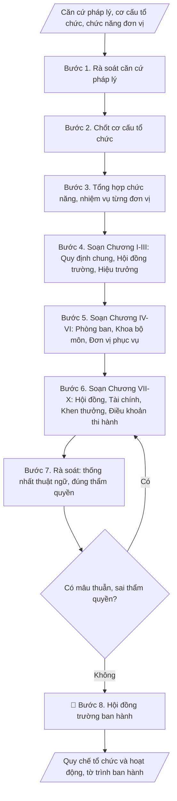

# Soạn quy chế tổ chức và hoạt động của trường

## Định dạng và file đầu ra
Định dạng đầu ra có thể chọn theo sản phẩm/yêu cầu: .docx, .pdf. Đọc mục “Định dạng bổ sung” trong quy cách đầu ra trước khi chọn.

**Phải tạo file thực tế để tải xuống, không chỉ trả nội dung trong chat.** Định dạng mặc định của skill: **.docx**. Nếu có bảng số liệu nghiệp vụ yêu cầu file bảng tính riêng, tạo thêm Excel theo yêu cầu; không tự tạo file kiểm tra. Không chờ người dùng yêu cầu xuất file lần nữa. Ưu tiên định dạng người dùng chỉ định; đọc quy tắc xuất file tại references/quy-cach-dau-ra.md.

## Quy cách đầu ra và thông tin thiếu
Khi dựng file Word/Excel, áp dụng mục “Thể thức và bảng biểu khi dựng file” trong quy cách đầu ra (cỡ chữ từng thành phần, bảng nhiều trang, số trang, phụ lục). Đọc [quy cách và cấu trúc sản phẩm](references/quy-cach-dau-ra.md) trước khi soạn/xuất. File giao chỉ gồm sản phẩm nghiệp vụ được yêu cầu; kiểm tra nội bộ không xuất kèm. Thiếu thông tin thì giữ nguyên trường/mục và chỗ điền theo mẫu gốc (dòng dấu chấm, dấu gạch hoặc ô trống); không tự điền dữ liệu mẫu, số 0, mã chờ xác minh hay dòng chờ ký. Mẫu chuyên ngành còn áp dụng được ưu tiên về cấu trúc, mã biểu và người ký. Bản đầy đủ: [quy tắc chung](references/quy-tac-chung.md).

Khi người dùng yêu cầu bộ slide (.pptx), đọc mục “Xuất PowerPoint (.pptx) khi được yêu cầu” trong quy cách đầu ra.

## Kiểm soát áp dụng và phê duyệt
Trước khi chạy, xác định `ngay_ap_dung`, `loai_hinh_truong`, `quy_che_noi_bo`, `nguon_du_lieu`, `nguoi_kiem_duyet`; chỉ hỏi thông tin liên quan nghiệp vụ, không dùng giá trị giả định thay dữ liệu bắt buộc. Đối chiếu căn cứ pháp lý với văn bản gốc, hiệu lực, điều khoản áp dụng và chuyển tiếp. Bản đầy đủ: [quy tắc chung](references/quy-tac-chung.md).

Nếu có cập nhật pháp lý dưới đây, đọc [căn cứ và điều kiện áp dụng](references/phap-ly.md) trước khi làm. Quy trình dưới đây giữ nghiệp vụ từ bản gốc; mọi viện dẫn văn bản, mẫu biểu, điều khoản phải theo căn cứ đã chọn trong phap-ly.md, không theo văn bản cũ.

## Giới hạn và human gate
AI hỗ trợ chuẩn bị và đối chiếu; cán bộ phụ trách kiểm tra dữ liệu/căn cứ, người có thẩm quyền duyệt và ký. Không đánh dấu đã ký, đã duyệt, đã công bố khi chưa có chứng cứ. Dữ liệu sinh viên, sức khỏe, nhân sự, tài chính chỉ dùng theo mục đích và phân quyền, che thông tin định danh khi dùng ví dụ (Luật 91/2025/QH15, hiệu lực 01/01/2026); không tải dữ liệu lên dịch vụ ngoài khi chưa có quyền. Bản đầy đủ: [quy tắc chung](references/quy-tac-chung.md).

## Khi nào dùng
Khi xây dựng mới quy chế tổ chức và hoạt động; khi sửa đổi, bổ sung cho phù hợp
Luật Giáo dục đại học sửa đổi và tình hình thực tế của trường.

## Đầu vào (Input)
| Trường | Mô tả | Bắt buộc |
|---|---|---|
| `co_so_phap_ly` | Căn cứ pháp lý (Luật GDĐH, nghị định, điều lệ trường ĐH...) | Có |
| `co_cau_to_chuc` | Sơ đồ tổ chức: Hội đồng trường, Ban Giám hiệu, các phòng ban, khoa, đơn vị trực thuộc | Có |
| `chuc_nang_don_vi` | Chức năng, nhiệm vụ tóm tắt của từng đơn vị | Có |
| `noi_dung_dac_thu` | Quy định đặc thù của trường (tài chính, nhân sự...) | Không |

## Quy trình
**Ràng buộc pháp lý khi thực hiện** (trích references/phap-ly.md; đối chiếu toàn văn và hiệu lực tại ngày nghiệp vụ):
- Luật 125/2025/QH15; Nghị quyết 10/2026/NQ-CP giữ99/2019 một phần; phạm vi: Quản trị cơ sở giáo dục đại học; phân biệt công lập và tư thục: 99/2019 không bị thay thế toàn bộ. NQ 10 loại trừ quy định về hội đồng trường/đại học công lập: điểm b khoản 4 Điều 2, điểm e khoản 1 Điều 3, điểm a khoản 2 Điều 4, điểm c khoản 4 Điều 4, điểm b khoản 2 Điều 5, Điều 7, khoản 1 Điều 9, điểm c khoản 2 Điều 16. Không tổ chức hoạt động mới của hội đồng trường công lập theo quy trình cũ. Yêu cầu loại hình trường, thời điểm xử lý, quy chế hiện hành, quyết định phân quyền; tư thục phải đối chiếu Luật 125.
- Trước Bước 1: chọn căn cứ theo đối tượng, loại hình trường và chuyển tiếp; lập bảng văn bản / điều khoản / lý do áp dụng / bằng chứng. Thiếu văn bản gốc hoặc điều khoản thì ghi nhận nội bộ [CẦN XÁC MINH] (không đưa vào file giao), để trống phần tương ứng, chưa kết luận tuân thủ.
- Các con số, thời hạn, số điều, số mức xếp loại, hệ số và mẫu biểu nêu trong các bước dưới đây được giữ từ quy trình gốc (trước cập nhật pháp lý); chỉ dùng khi đã đối chiếu đúng với căn cứ đã chọn, khác thì theo căn cứ. Danh sách điểm cần đối chiếu: docs/DIEM_CAN_DOI_CHIEU_PHAP_LY.md.

**Bước 1. Rà soát căn cứ pháp lý**
- Làm gì: Thu thập đầy đủ văn bản pháp lý liên quan (Luật Giáo dục đại học và luật
  sửa đổi, nghị định hướng dẫn, điều lệ trường đại học...); xác định các điều khoản
  quy định bắt buộc về tổ chức, quản trị trường đại học; lập bảng căn cứ pháp lý
  (tên văn bản, số/ký hiệu, điều khoản liên quan, nội dung áp dụng); kiểm tra văn bản
  nào đã hết hiệu lực hoặc được thay thế.
- Dùng input: `co_so_phap_ly`
- Vai trò: Chuyên viên Phòng TCCB · AI hỗ trợ: tra cứu và lập bảng căn cứ pháp lý (số/ký hiệu, điều khoản) · ⏱ 2–3 ngày làm việc (ước tính)
- Lưu ý nghiệp vụ: Chỉ dùng văn bản còn hiệu lực — trích dẫn văn bản hết hiệu lực là
  lỗi nghiêm trọng có thể khiến quy chế bị yêu cầu sửa; ghi đúng số/ký hiệu, ngày ban
  hành của từng văn bản; lưu ý các quy định đặc thù với trường công lập tự chủ.
- → Kết quả bước: Bảng căn cứ pháp lý (văn bản còn hiệu lực + điều khoản áp dụng).

**Bước 2. Chốt cơ cấu tổ chức**
- Làm gì: Thu thập sơ đồ tổ chức hiện hành của trường; đối chiếu với quy định pháp
  luật (các đơn vị bắt buộc phải có); xác định các thay đổi cần đưa vào quy chế mới
  (thành lập mới, sáp nhập, giải thể, đổi tên đơn vị); vẽ sơ đồ tổ chức dự kiến; lấy ý
  kiến Ban Giám hiệu và chốt sơ đồ chính thức.
- Dùng input: `co_cau_to_chuc`
- Vai trò: Ban Giám hiệu · AI hỗ trợ: vẽ sơ đồ tổ chức dự kiến từ cơ cấu hiện hành, Ban Giám hiệu lấy ý kiến và chốt · ⏱ 3–5 ngày làm việc (ước tính)
- Lưu ý nghiệp vụ: Sơ đồ trong quy chế phải phản ánh đúng thực tế tổ chức tại thời
  điểm ban hành — sơ đồ "vẽ cho đẹp" khác thực tế sẽ gây rắc rối khi thanh tra; mỗi
  đơn vị trong sơ đồ phải có tên gọi chính thức, thống nhất, không dùng tên viết tắt
  gây nhầm lẫn.
- → Kết quả bước: Sơ đồ tổ chức đã chốt (kèm danh sách đơn vị thành lập/sáp nhập/
  đổi tên).

**Bước 3. Tổng hợp chức năng, nhiệm vụ từng đơn vị**
- Làm gì: Thu thập chức năng, nhiệm vụ tóm tắt của từng đơn vị trong sơ đồ (phòng,
  ban, khoa, bộ môn, đơn vị phục vụ); chuẩn hóa cách diễn đạt (mỗi đơn vị: chức năng
  chung + các nhiệm vụ cụ thể); ghi nhận các quy định đặc thù của trường (tài chính,
  nhân sự, phân cấp quản lý); lập bảng tổng hợp chức năng/nhiệm vụ toàn trường.
- Dùng input: `chuc_nang_don_vi`, `noi_dung_dac_thu`
- Vai trò: Chuyên viên Phòng TCCB · AI hỗ trợ: chuẩn hóa diễn đạt chức năng/nhiệm vụ và phát hiện chồng chéo, các đơn vị xác nhận · ⏱ 3–5 ngày làm việc (ước tính)
- Lưu ý nghiệp vụ: Kiểm tra không chồng chéo chức năng giữa các đơn vị (VD: cả hai
  phòng cùng "quản lý đề tài NCKH") — chồng chéo phải phân định rõ ngay ở bước này;
  nhiệm vụ ghi trong quy chế phải là nhiệm vụ ổn định, lâu dài, không đưa nhiệm vụ
  tạm thời/nhiệm kỳ vào.
- → Kết quả bước: Bảng tổng hợp chức năng, nhiệm vụ từng đơn vị (đã phân định rõ,
  không chồng chéo).

**Bước 4. Soạn Chương I–III: Quy định chung, Hội đồng trường, Hiệu trưởng**
- Làm gì: Soạn Chương I (phạm vi điều chỉnh, đối tượng áp dụng; vị trí pháp lý, tên
  gọi, trụ sở của trường); Chương II (chức năng, nhiệm vụ, quyền hạn; cơ cấu, số
  lượng thành viên; nhiệm kỳ của Hội đồng trường); Chương III (tiêu chuẩn, nhiệm vụ,
  quyền hạn của Hiệu trưởng và các Phó Hiệu trưởng; phân công phụ trách lĩnh vực).
- Dùng input: `co_so_phap_ly`, `co_cau_to_chuc`
- Vai trò: Hội đồng trường · AI hỗ trợ: soạn dự thảo Chương I–III bám sát từng điều luật · ⏱ 2–3 ngày làm việc (ước tính)
- Lưu ý nghiệp vụ: Các chương này chủ yếu "luật hóa" quy định của pháp luật — phải
  bám sát từng điều luật, không sáng tạo thêm thẩm quyền trái luật; số lượng thành
  viên Hội đồng trường phải đúng khung luật định.
- → Kết quả bước: Bản thảo Chương I–III.

**Bước 5. Soạn Chương IV–VI: Phòng ban, Khoa/bộ môn, Đơn vị phục vụ**
- Làm gì: Soạn Chương IV — liệt kê từng phòng, ban chức năng kèm chức năng, nhiệm vụ
  (tham mưu, giúp việc Hiệu trưởng); Chương V — khoa, bộ môn (chức năng đào tạo,
  NCKH, quản lý SV; nhiệm vụ của trưởng khoa, trưởng bộ môn); Chương VI — các đơn vị
  phục vụ, đơn vị trực thuộc (thư viện, trung tâm, ký túc xá...).
- Dùng input: `co_cau_to_chuc`, `chuc_nang_don_vi`
- Vai trò: Chuyên viên Phòng TCCB · AI hỗ trợ: soạn dự thảo Chương IV–VI từ bảng chức năng, các đơn vị góp ý và xác nhận · ⏱ 2–3 ngày làm việc (ước tính)
- Lưu ý nghiệp vụ: Mỗi đơn vị một điều riêng, đánh số điều liên tục toàn quy chế;
  cách diễn đạt chức năng các đơn vị phải song song, thống nhất (tránh đơn vị viết
  3 dòng, đơn vị viết 3 trang); tên đơn vị trong quy chế phải khớp 100% với sơ đồ
  tổ chức đã chốt ở Bước 2.
- → Kết quả bước: Bản thảo Chương IV–VI.

**Bước 6. Soạn Chương VII–X: Hội đồng, Tài chính, Khen thưởng, Điều khoản thi hành**
- Làm gì: Soạn Chương VII (Hội đồng khoa học và đào tạo, các hội đồng tư vấn);
  Chương VIII (tài chính, tài sản: nguyên tắc quản lý, sử dụng); Chương IX (khen
  thưởng, kỷ luật; khiếu nại, tố cáo); Chương X (điều khoản thi hành: hiệu lực, trách
  nhiệm tổ chức thực hiện, sửa đổi bổ sung; điều khoản thay thế quy chế cũ).
- Dùng input: `co_so_phap_ly`, `noi_dung_dac_thu`
- Vai trò: Hội đồng trường · AI hỗ trợ: soạn dự thảo Chương VII–X · ⏱ 2–3 ngày làm việc (ước tính)
- Lưu ý nghiệp vụ: Chương VIII, IX liên quan trực tiếp đến quyền lợi, nghĩa vụ của
  viên chức, người học — phải bám luật, tránh quy định "chặt" hơn luật mà không có
  căn cứ; Chương X phải ghi rõ quy chế mới thay thế văn bản nào (số/ký hiệu, ngày ban
  hành) để tránh hai quy chế cùng hiệu lực.
- → Kết quả bước: Bản thảo Chương VII–X.

**Bước 7. Rà soát thống nhất toàn văn quy chế**
- Làm gì: Đọc soát toàn bộ 10 chương: thống nhất thuật ngữ (một khái niệm — một tên
  gọi xuyên suốt); kiểm tra không mâu thuẫn giữa các chương (VD: thẩm quyền ở Chương
  III với nhiệm vụ đơn vị ở Chương IV); kiểm tra đánh số chương/điều liên tục, đúng
  chính tả, thể thức văn bản quy phạm; xác nhận thẩm quyền ban hành đúng là Hội đồng
  trường.
- Dùng input: (rà soát trên toàn bộ bản thảo từ Bước 4–6)
- Vai trò: Chuyên viên Phòng TCCB · AI hỗ trợ: rà soát thuật ngữ, đánh số và mâu thuẫn giữa các chương, ít nhất 2 người đọc soát độc lập · ⏱ 2–3 ngày làm việc (ước tính)
- Lưu ý nghiệp vụ: Bẫy thường gặp: thuật ngữ "phòng ban" vs "đơn vị" dùng lẫn lộn;
  một đơn vị được giao nhiệm vụ ở Chương IV nhưng không có trong sơ đồ Chương I–II;
  nên có ít nhất 2 người đọc soát độc lập (một người am hiểu pháp lý, một người am
  hiểu tổ chức thực tế).
- → Kết quả bước: Bản thảo quy chế đã rà soát + danh sách mâu thuẫn đã xử lý.

**Bước 8. Trình Hội đồng trường ban hành**
- Làm gì: Soạn tờ trình ban hành quy chế (lý do xây dựng/sửa đổi, quá trình soạn
  thảo, nội dung chính, đề nghị ban hành); trình Hội đồng trường xem xét, thông qua
  và ban hành theo đúng trình tự, thủ tục; sau ban hành, phổ biến đến toàn trường và
  lưu hồ sơ.
- Dùng input: (không dùng trường input mới)
- Vai trò: Hội đồng trường · AI hỗ trợ: chuẩn bị dự thảo, tài liệu và số liệu phục vụ bước này · ⏱ 1–2 tuần (ước tính)
- Lưu ý nghiệp vụ: Quy chế do Hội đồng trường ban hành (trường công lập tự chủ) —
  Hiệu trưởng ký ban hành thay là sai thẩm quyền; kiểm tra đủ chữ ký, đóng dấu, số
  ký hiệu trên văn bản ban hành trước khi phổ biến; gửi lưu chiểu theo quy định.
- → Kết quả bước: Quy chế tổ chức và hoạt động đã ban hành + tờ trình ban hành.

## Luồng quy trình (Workflow)

## Đầu ra
- Quy chế tổ chức và hoạt động hoàn chỉnh (theo chương, điều).
- Tờ trình ban hành quy chế.

File nghiệp vụ thực tế theo định dạng mặc định ở đầu skill hoặc định dạng người dùng yêu cầu, kèm liên kết tải trong phản hồi cuối.

Sản phẩm nghiệp vụ hoàn chỉnh theo [quy cách và cấu trúc](references/quy-cach-dau-ra.md), giữ các trường chưa có dữ liệu ở trạng thái trống. Không xuất kèm checklist/phụ lục kiểm tra đầu ra.

## Kiểm tra nội bộ trước khi giao
Các tiêu chí sau dùng để tự đối chiếu; không sao chép vào file xuất. Mục thiếu dữ liệu được để trống, không đánh dấu đã đạt hoặc đã duyệt.

- [ ] Đủ các phần và đúng bố cục theo cấu trúc tại references/quy-cach-dau-ra.md (không theo cấu trúc của bản gốc).
- [ ] Đủ 10 chương; các điều được đánh số liên tục toàn quy chế.
- [ ] Nội dung khớp với Input: cơ cấu tổ chức, chức năng đơn vị, nội dung đặc thù đã cho.
- [ ] Thuật ngữ thống nhất xuyên suốt (một khái niệm — một tên gọi); không mâu thuẫn giữa các chương về thẩm quyền, chức năng.
- [ ] Tên đơn vị trong quy chế khớp 100% với sơ đồ tổ chức đã chốt; không chồng chéo chức năng giữa các đơn vị.
- [ ] Căn cứ pháp lý đầy đủ, còn hiệu lực; các chương "luật hóa" bám sát từng điều luật, không sáng tạo thẩm quyền trái luật.
- [ ] Chương X ghi rõ văn bản bị thay thế (số/ký hiệu, ngày ban hành); thẩm quyền ban hành đúng là Hội đồng trường.
- [ ] Không bịa đặt số liệu, điều khoản pháp lý, tên và số/ký hiệu văn bản.
- [ ] Đúng thể thức: đủ chữ ký, đóng dấu, số ký hiệu trên văn bản ban hành.
- [ ] Đã qua Human gate: Hội đồng trường đã thông qua và ban hành; quy chế đã phổ biến toàn trường và lưu hồ sơ.

## Căn cứ & lưu ý
- Luật Giáo dục đại học 2012, sửa đổi bổ sung 2018; Nghị định 99/2019/NĐ-CP.
- Quy chế do Hội đồng trường ban hành (trường công lập tự chủ).
- Không dùng tên thật của trường/cá nhân khi mô phỏng.

## Tư liệu đối chiếu
Bản gốc trước cập nhật pháp lý (kèm ví dụ giả lập) lưu tại `references/quy-trinh-lich-su.md`, chỉ để đối chiếu hồ sơ lịch sử; không dùng căn cứ, mẫu hay số liệu trong đó làm chỉ dẫn hiện hành.

## Quản trị phiên bản
- Phiên bản gói `1.3.2` (cập nhật 2026-10-10); hồ sơ đầy đủ tại [references/version.json](references/version.json).
- Người phê duyệt nghiệp vụ: **chưa chỉ định**. Trạng thái: dự thảo nghiệp vụ; kiểm tra pháp lý trước thực thi. Ngày cập nhật không đồng nghĩa mọi văn bản đã được rà soát toàn văn.
- Giấy phép theo LICENSE của kho (bản quyền CES Global). Lịch sử thay đổi: CHANGELOG.md.
