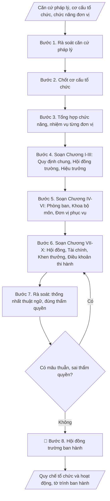

# Tư liệu lịch sử – không phải quy trình hiện hành

Nội dung từ phiên bản nguồn trước 1.1.0, giữ để đối chiếu dữ liệu đầu vào và thay đổi; căn cứ, điều kiện, mẫu và ví dụ có thể đã lỗi thời. Không dùng để thực hiện nghiệp vụ hiện tại.

## Khi nào dùng
Khi xây dựng mới quy chế tổ chức và hoạt động; khi sửa đổi, bổ sung cho phù hợp
Luật Giáo dục đại học sửa đổi và tình hình thực tế của trường.

## Đầu vào (Input)

| Trường | Mô tả | Bắt buộc |
|---|---|---|
| `co_so_phap_ly` | Căn cứ pháp lý (Luật GDĐH, nghị định, điều lệ trường ĐH...) | Có |
| `co_cau_to_chuc` | Sơ đồ tổ chức: Hội đồng trường, Ban Giám hiệu, các phòng ban, khoa, đơn vị trực thuộc | Có |
| `chuc_nang_don_vi` | Chức năng, nhiệm vụ tóm tắt của từng đơn vị | Có |
| `noi_dung_dac_thu` | Quy định đặc thù của trường (tài chính, nhân sự...) | Không |

## Quy trình

**Bước 1. Rà soát căn cứ pháp lý**
- Làm gì: Thu thập đầy đủ văn bản pháp lý liên quan (Luật Giáo dục đại học và luật
  sửa đổi, nghị định hướng dẫn, điều lệ trường đại học...); xác định các điều khoản
  quy định bắt buộc về tổ chức, quản trị trường đại học; lập bảng căn cứ pháp lý
  (tên văn bản, số/ký hiệu, điều khoản liên quan, nội dung áp dụng); kiểm tra văn bản
  nào đã hết hiệu lực hoặc được thay thế.
- Dùng input: `co_so_phap_ly`
- Vai trò: Chuyên viên Phòng TCCB · AI hỗ trợ: tra cứu và lập bảng căn cứ pháp lý (số/ký hiệu, điều khoản) · ⏱ 2–3 ngày làm việc (ước tính)
- Lưu ý nghiệp vụ: Chỉ dùng văn bản còn hiệu lực — trích dẫn văn bản hết hiệu lực là
  lỗi nghiêm trọng có thể khiến quy chế bị yêu cầu sửa; ghi đúng số/ký hiệu, ngày ban
  hành của từng văn bản; lưu ý các quy định đặc thù với trường công lập tự chủ.
- → Kết quả bước: Bảng căn cứ pháp lý (văn bản còn hiệu lực + điều khoản áp dụng).

**Bước 2. Chốt cơ cấu tổ chức**
- Làm gì: Thu thập sơ đồ tổ chức hiện hành của trường; đối chiếu với quy định pháp
  luật (các đơn vị bắt buộc phải có); xác định các thay đổi cần đưa vào quy chế mới
  (thành lập mới, sáp nhập, giải thể, đổi tên đơn vị); vẽ sơ đồ tổ chức dự kiến; lấy ý
  kiến Ban Giám hiệu và chốt sơ đồ chính thức.
- Dùng input: `co_cau_to_chuc`
- Vai trò: Ban Giám hiệu · AI hỗ trợ: vẽ sơ đồ tổ chức dự kiến từ cơ cấu hiện hành, Ban Giám hiệu lấy ý kiến và chốt · ⏱ 3–5 ngày làm việc (ước tính)
- Lưu ý nghiệp vụ: Sơ đồ trong quy chế phải phản ánh đúng thực tế tổ chức tại thời
  điểm ban hành — sơ đồ "vẽ cho đẹp" khác thực tế sẽ gây rắc rối khi thanh tra; mỗi
  đơn vị trong sơ đồ phải có tên gọi chính thức, thống nhất, không dùng tên viết tắt
  gây nhầm lẫn.
- → Kết quả bước: Sơ đồ tổ chức đã chốt (kèm danh sách đơn vị thành lập/sáp nhập/
  đổi tên).

**Bước 3. Tổng hợp chức năng, nhiệm vụ từng đơn vị**
- Làm gì: Thu thập chức năng, nhiệm vụ tóm tắt của từng đơn vị trong sơ đồ (phòng,
  ban, khoa, bộ môn, đơn vị phục vụ); chuẩn hóa cách diễn đạt (mỗi đơn vị: chức năng
  chung + các nhiệm vụ cụ thể); ghi nhận các quy định đặc thù của trường (tài chính,
  nhân sự, phân cấp quản lý); lập bảng tổng hợp chức năng/nhiệm vụ toàn trường.
- Dùng input: `chuc_nang_don_vi`, `noi_dung_dac_thu`
- Vai trò: Chuyên viên Phòng TCCB · AI hỗ trợ: chuẩn hóa diễn đạt chức năng/nhiệm vụ và phát hiện chồng chéo, các đơn vị xác nhận · ⏱ 3–5 ngày làm việc (ước tính)
- Lưu ý nghiệp vụ: Kiểm tra không chồng chéo chức năng giữa các đơn vị (VD: cả hai
  phòng cùng "quản lý đề tài NCKH") — chồng chéo phải phân định rõ ngay ở bước này;
  nhiệm vụ ghi trong quy chế phải là nhiệm vụ ổn định, lâu dài, không đưa nhiệm vụ
  tạm thời/nhiệm kỳ vào.
- → Kết quả bước: Bảng tổng hợp chức năng, nhiệm vụ từng đơn vị (đã phân định rõ,
  không chồng chéo).

**Bước 4. Soạn Chương I–III: Quy định chung, Hội đồng trường, Hiệu trưởng**
- Làm gì: Soạn Chương I (phạm vi điều chỉnh, đối tượng áp dụng; vị trí pháp lý, tên
  gọi, trụ sở của trường); Chương II (chức năng, nhiệm vụ, quyền hạn; cơ cấu, số
  lượng thành viên; nhiệm kỳ của Hội đồng trường); Chương III (tiêu chuẩn, nhiệm vụ,
  quyền hạn của Hiệu trưởng và các Phó Hiệu trưởng; phân công phụ trách lĩnh vực).
- Dùng input: `co_so_phap_ly`, `co_cau_to_chuc`
- Vai trò: Hội đồng trường · AI hỗ trợ: soạn dự thảo Chương I–III bám sát từng điều luật · ⏱ 2–3 ngày làm việc (ước tính)
- Lưu ý nghiệp vụ: Các chương này chủ yếu "luật hóa" quy định của pháp luật — phải
  bám sát từng điều luật, không sáng tạo thêm thẩm quyền trái luật; số lượng thành
  viên Hội đồng trường phải đúng khung luật định.
- → Kết quả bước: Bản thảo Chương I–III.

**Bước 5. Soạn Chương IV–VI: Phòng ban, Khoa/bộ môn, Đơn vị phục vụ**
- Làm gì: Soạn Chương IV — liệt kê từng phòng, ban chức năng kèm chức năng, nhiệm vụ
  (tham mưu, giúp việc Hiệu trưởng); Chương V — khoa, bộ môn (chức năng đào tạo,
  NCKH, quản lý SV; nhiệm vụ của trưởng khoa, trưởng bộ môn); Chương VI — các đơn vị
  phục vụ, đơn vị trực thuộc (thư viện, trung tâm, ký túc xá...).
- Dùng input: `co_cau_to_chuc`, `chuc_nang_don_vi`
- Vai trò: Chuyên viên Phòng TCCB · AI hỗ trợ: soạn dự thảo Chương IV–VI từ bảng chức năng, các đơn vị góp ý và xác nhận · ⏱ 2–3 ngày làm việc (ước tính)
- Lưu ý nghiệp vụ: Mỗi đơn vị một điều riêng, đánh số điều liên tục toàn quy chế;
  cách diễn đạt chức năng các đơn vị phải song song, thống nhất (tránh đơn vị viết
  3 dòng, đơn vị viết 3 trang); tên đơn vị trong quy chế phải khớp 100% với sơ đồ
  tổ chức đã chốt ở Bước 2.
- → Kết quả bước: Bản thảo Chương IV–VI.

**Bước 6. Soạn Chương VII–X: Hội đồng, Tài chính, Khen thưởng, Điều khoản thi hành**
- Làm gì: Soạn Chương VII (Hội đồng khoa học và đào tạo, các hội đồng tư vấn);
  Chương VIII (tài chính, tài sản: nguyên tắc quản lý, sử dụng); Chương IX (khen
  thưởng, kỷ luật; khiếu nại, tố cáo); Chương X (điều khoản thi hành: hiệu lực, trách
  nhiệm tổ chức thực hiện, sửa đổi bổ sung; điều khoản thay thế quy chế cũ).
- Dùng input: `co_so_phap_ly`, `noi_dung_dac_thu`
- Vai trò: Hội đồng trường · AI hỗ trợ: soạn dự thảo Chương VII–X · ⏱ 2–3 ngày làm việc (ước tính)
- Lưu ý nghiệp vụ: Chương VIII, IX liên quan trực tiếp đến quyền lợi, nghĩa vụ của
  viên chức, người học — phải bám luật, tránh quy định "chặt" hơn luật mà không có
  căn cứ; Chương X phải ghi rõ quy chế mới thay thế văn bản nào (số/ký hiệu, ngày ban
  hành) để tránh hai quy chế cùng hiệu lực.
- → Kết quả bước: Bản thảo Chương VII–X.

**Bước 7. Rà soát thống nhất toàn văn quy chế**
- Làm gì: Đọc soát toàn bộ 10 chương: thống nhất thuật ngữ (một khái niệm — một tên
  gọi xuyên suốt); kiểm tra không mâu thuẫn giữa các chương (VD: thẩm quyền ở Chương
  III với nhiệm vụ đơn vị ở Chương IV); kiểm tra đánh số chương/điều liên tục, đúng
  chính tả, thể thức văn bản quy phạm; xác nhận thẩm quyền ban hành đúng là Hội đồng
  trường.
- Dùng input: (rà soát trên toàn bộ bản thảo từ Bước 4–6)
- Vai trò: Chuyên viên Phòng TCCB · AI hỗ trợ: rà soát thuật ngữ, đánh số và mâu thuẫn giữa các chương, ít nhất 2 người đọc soát độc lập · ⏱ 2–3 ngày làm việc (ước tính)
- Lưu ý nghiệp vụ: Bẫy thường gặp: thuật ngữ "phòng ban" vs "đơn vị" dùng lẫn lộn;
  một đơn vị được giao nhiệm vụ ở Chương IV nhưng không có trong sơ đồ Chương I–II;
  nên có ít nhất 2 người đọc soát độc lập (một người am hiểu pháp lý, một người am
  hiểu tổ chức thực tế).
- → Kết quả bước: Bản thảo quy chế đã rà soát + danh sách mâu thuẫn đã xử lý.

**Bước 8. Trình Hội đồng trường ban hành**
- Làm gì: Soạn tờ trình ban hành quy chế (lý do xây dựng/sửa đổi, quá trình soạn
  thảo, nội dung chính, đề nghị ban hành); trình Hội đồng trường xem xét, thông qua
  và ban hành theo đúng trình tự, thủ tục; sau ban hành, phổ biến đến toàn trường và
  lưu hồ sơ.
- Dùng input: (không dùng trường input mới)
- Vai trò: Hội đồng trường · AI hỗ trợ: chuẩn bị dự thảo, tài liệu và số liệu phục vụ bước này · ⏱ 1–2 tuần (ước tính)
- Lưu ý nghiệp vụ: Quy chế do Hội đồng trường ban hành (trường công lập tự chủ) —
  Hiệu trưởng ký ban hành thay là sai thẩm quyền; kiểm tra đủ chữ ký, đóng dấu, số
  ký hiệu trên văn bản ban hành trước khi phổ biến; gửi lưu chiểu theo quy định.
- → Kết quả bước: Quy chế tổ chức và hoạt động đã ban hành + tờ trình ban hành.

## Luồng quy trình (Workflow)


## Đầu ra (Output)
- Quy chế tổ chức và hoạt động hoàn chỉnh (theo chương, điều).
- Tờ trình ban hành quy chế.

**Cấu trúc output chuẩn** (sản phẩm chính: Quy chế tổ chức và hoạt động) — các phần
bắt buộc theo đúng thứ tự:
1. Tiêu đề: QUY CHẾ TỔ CHỨC VÀ HOẠT ĐỘNG CỦA TRƯỜNG ĐẠI HỌC ...
2. Chương I. QUY ĐỊNH CHUNG (phạm vi điều chỉnh, đối tượng áp dụng; vị trí pháp lý,
   tên gọi, trụ sở).
3. Chương II. HỘI ĐỒNG TRƯỜNG (chức năng, nhiệm vụ, quyền hạn; cơ cấu, số lượng
   thành viên; nhiệm kỳ).
4. Chương III. HIỆU TRƯỞNG VÀ PHÓ HIỆU TRƯỞNG (tiêu chuẩn, nhiệm vụ, quyền hạn;
   phân công phụ trách lĩnh vực).
5. Chương IV. CÁC PHÒNG, BAN CHỨC NĂNG (từng phòng ban một điều riêng).
6. Chương V. KHOA, BỘ MÔN.
7. Chương VI. CÁC ĐƠN VỊ PHỤC VỤ, ĐƠN VỊ TRỰC THUỘC.
8. Chương VII. HỘI ĐỒNG KHOA HỌC VÀ ĐÀO TẠO, CÁC HỘI ĐỒNG TƯ VẤN.
9. Chương VIII. TÀI CHÍNH, TÀI SẢN.
10. Chương IX. KHEN THƯỞNG, KỶ LUẬT; KHIẾU NẠI, TỐ CÁO.
11. Chương X. ĐIỀU KHOẢN THI HÀNH (hiệu lực, thay thế quy chế cũ, trách nhiệm tổ
    chức thực hiện, sửa đổi bổ sung).
12. Tờ trình ban hành quy chế (văn bản kèm theo).

## Checklist nghiệm thu

- [ ] Đủ các phần của "Cấu trúc output chuẩn": tiêu đề + Chương I–X theo đúng thứ tự + tờ trình ban hành.
- [ ] Đủ 10 chương; các điều được đánh số liên tục toàn quy chế.
- [ ] Nội dung khớp với Input: cơ cấu tổ chức, chức năng đơn vị, nội dung đặc thù đã cho.
- [ ] Thuật ngữ thống nhất xuyên suốt (một khái niệm — một tên gọi); không mâu thuẫn giữa các chương về thẩm quyền, chức năng.
- [ ] Tên đơn vị trong quy chế khớp 100% với sơ đồ tổ chức đã chốt; không chồng chéo chức năng giữa các đơn vị.
- [ ] Căn cứ pháp lý đầy đủ, còn hiệu lực; các chương "luật hóa" bám sát từng điều luật, không sáng tạo thẩm quyền trái luật.
- [ ] Chương X ghi rõ văn bản bị thay thế (số/ký hiệu, ngày ban hành); thẩm quyền ban hành đúng là Hội đồng trường.
- [ ] Không bịa đặt số liệu, điều khoản pháp lý, tên và số/ký hiệu văn bản.
- [ ] Đúng thể thức: đủ chữ ký, đóng dấu, số ký hiệu trên văn bản ban hành.
- [ ] Đã qua Human gate: Hội đồng trường đã thông qua và ban hành; quy chế đã phổ biến toàn trường và lưu hồ sơ.

Tiêu chí đạt = tất cả các ô được đánh dấu.

## Ví dụ mô phỏng (dữ liệu giả lập)

> Tất cả tên trường, cá nhân, số liệu dưới đây đều là **giả lập**, không liên quan tổ chức/cá nhân có thật.

### Input mẫu

| Trường | Giá trị |
|---|---|
| `co_so_phap_ly` | Luật GDĐH 2012, sửa đổi 2018; Nghị định 99/2019/NĐ-CP |
| `co_cau_to_chuc` | Hội đồng trường; Hiệu trưởng + 03 Phó HT; 10 phòng ban (HCTH, TCCB, Đào tạo, SĐH, KT&ĐBCL, KHCN&HTQT, CTSV, TCKT, QTTB, TT&PC); 08 khoa; Thư viện, TT CNTT, KTX |
| `chuc_nang_don_vi` | (tóm tắt chức năng từng đơn vị theo danh mục đã khảo sát) |

### Output mẫu (trích cấu trúc)

```
QUY CHẾ TỔ CHỨC VÀ HOẠT ĐỘNG
CỦA TRƯỜNG ĐẠI HỌC A
(Dữ liệu giả lập – trích cấu trúc)

Chương I. QUY ĐỊNH CHUNG
Điều 1. Phạm vi điều chỉnh và đối tượng áp dụng
Điều 2. Vị trí pháp lý, tên gọi của Trường

Chương II. HỘI ĐỒNG TRƯỜNG
Điều 3. Chức năng, nhiệm vụ, quyền hạn của Hội đồng trường
Điều 4. Cơ cấu tổ chức của Hội đồng trường (gồm 21 thành viên...)

Chương III. HIỆU TRƯỞNG VÀ PHÓ HIỆU TRƯỞNG
Điều 5. Hiệu trưởng: tiêu chuẩn, nhiệm vụ, quyền hạn
Điều 6. Phó Hiệu trưởng: giúp việc Hiệu trưởng theo lĩnh vực phân công

Chương IV. CÁC PHÒNG, BAN CHỨC NĂNG
Điều 7. Phòng Hành chính – Tổng hợp: tham mưu, giúp việc Hiệu trưởng về công
tác văn phòng, văn thư, lễ tân...
Điều 8. Phòng Tổ chức – Cán bộ: ...
(... các phòng ban còn lại ...)

Chương V. KHOA, BỘ MÔN
Điều 18. Khoa: đơn vị đào tạo, NCKH trực thuộc Trường...
Điều 19. Bộ môn: đơn vị chuyên môn thuộc khoa...

Chương VI. CÁC ĐƠN VỊ PHỤC VỤ, TRỰC THUỘC
Điều 20. Thư viện, Trung tâm CNTT, Ban Quản lý ký túc xá...

Chương VII. HỘI ĐỒNG KHOA HỌC VÀ ĐÀO TẠO
Chương VIII. TÀI CHÍNH, TÀI SẢN
Chương IX. KHEN THƯỞNG, KỶ LUẬT; KHIẾU NẠI, TỐ CÁO
Chương X. ĐIỀU KHOẢN THI HÀNH
Điều 35. Hiệu lực thi hành – Quy chế có hiệu lực kể từ ngày ký, thay thế Quy
chế ban hành kèm theo Quyết định số .../QĐ-ĐHA.
```

## Căn cứ & lưu ý
- Luật Giáo dục đại học 2012, sửa đổi bổ sung 2018; Nghị định 99/2019/NĐ-CP.
- Quy chế do Hội đồng trường ban hành (trường công lập tự chủ).
- Không dùng tên thật của trường/cá nhân khi mô phỏng.
