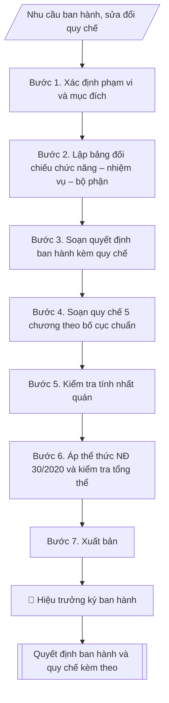

# Soạn quy chế tổ chức và hoạt động của đơn vị trực thuộc

## Định dạng và file đầu ra

Định dạng đầu ra có thể chọn theo sản phẩm/yêu cầu: .docx, .pdf. Đọc mục “Định dạng bổ sung” trong quy cách đầu ra trước khi chọn.

**Phải tạo file thực tế để tải xuống, không chỉ trả nội dung trong chat.** Định dạng mặc định của skill: **.docx**. Nếu có bảng số liệu nghiệp vụ yêu cầu file bảng tính riêng, tạo thêm Excel theo yêu cầu; không tự tạo file kiểm tra. Không chờ người dùng yêu cầu xuất file lần nữa. Ưu tiên định dạng người dùng chỉ định; đọc quy tắc xuất file tại references/quy-cach-dau-ra.md.

## Quy cách đầu ra và thông tin thiếu
Khi dựng file Word/Excel, áp dụng mục “Thể thức và bảng biểu khi dựng file” trong quy cách đầu ra (cỡ chữ từng thành phần, bảng nhiều trang, số trang, phụ lục). Đọc [quy cách và cấu trúc sản phẩm](references/quy-cach-dau-ra.md) trước khi soạn/xuất. File giao chỉ gồm sản phẩm nghiệp vụ được yêu cầu; kiểm tra nội bộ không xuất kèm. Thiếu thông tin thì giữ nguyên trường/mục và chỗ điền theo mẫu gốc (dòng dấu chấm, dấu gạch hoặc ô trống); không tự điền dữ liệu mẫu, số 0, mã chờ xác minh hay dòng chờ ký. Mẫu chuyên ngành còn áp dụng được ưu tiên về cấu trúc, mã biểu và người ký. Bản đầy đủ: [quy tắc chung](references/quy-tac-chung.md).

## Kiểm soát áp dụng và phê duyệt
Trước khi chạy, xác định `ngay_ap_dung`, `loai_hinh_truong`, `quy_che_noi_bo`, `nguon_du_lieu`, `nguoi_kiem_duyet`; chỉ hỏi thông tin liên quan nghiệp vụ, không dùng giá trị giả định thay dữ liệu bắt buộc. Đối chiếu căn cứ pháp lý với văn bản gốc, hiệu lực, điều khoản áp dụng và chuyển tiếp. Bản đầy đủ: [quy tắc chung](references/quy-tac-chung.md).

## Giới hạn và human gate
AI hỗ trợ chuẩn bị và đối chiếu; cán bộ phụ trách kiểm tra dữ liệu/căn cứ, người có thẩm quyền duyệt và ký. Không đánh dấu đã ký, đã duyệt, đã công bố khi chưa có chứng cứ. Dữ liệu sinh viên, sức khỏe, nhân sự, tài chính chỉ dùng theo mục đích và phân quyền, che thông tin định danh khi dùng ví dụ (Luật 91/2025/QH15, hiệu lực 01/01/2026); không tải dữ liệu lên dịch vụ ngoài khi chưa có quyền. Bản đầy đủ: [quy tắc chung](references/quy-tac-chung.md).

## Khi nào dùng
Khi cần ban hành (hoặc sửa đổi, bổ sung) quy chế tổ chức và hoạt động của một đơn vị trực thuộc
trường — phòng chức năng, khoa, trung tâm, viện: quy định rõ đơn vị là gì, làm gì (chức năng,
nhiệm vụ), tổ chức ra sao (cơ cấu, lãnh đạo, các bộ phận), làm việc thế nào (chế độ làm việc,
mối quan hệ công tác). Thường dùng khi thành lập mới, chia tách/sáp nhập đơn vị, hoặc rà soát
định kỳ theo yêu cầu quản trị.

## Đầu vào (Input)

| Trường | Mô tả | Bắt buộc |
|---|---|---|
| `ten_don_vi` | Tên đầy đủ của đơn vị (VD: Phòng Tổ chức – Cán bộ) | Có |
| `chuc_nang` | Chức năng của đơn vị (1–2 câu khái quát) | Có |
| `nhiem_vu` | Danh sách nhiệm vụ cụ thể của đơn vị (gạch đầu dòng) | Có |
| `co_cau` | Cơ cấu tổ chức: lãnh đạo (Trưởng/Phó), các tổ/bộ phận trực thuộc, số lượng dự kiến | Có |
| `che_do_lam_viec` | Chế độ làm việc: hội họp, báo cáo, chế độ thủ trưởng, phân công nhiệm vụ | Không |
| `moi_quan_he` | Mối quan hệ công tác với Ban Giám hiệu, các đơn vị trong trường, cơ quan ngoài | Không |
| `so_quyet_dinh` | Số quyết định ban hành kèm quy chế (VD: 250/QĐ-ĐHA) | Có |
| `ngay_ky` | Ngày ký quyết định ban hành | Có |
| `nguoi_ky` | Hiệu trưởng | Có |

## Quy trình

**Bước 1. Xác định phạm vi và mục đích**
- Làm gì: xác định đây là quy chế mới hoàn toàn hay sửa đổi, bổ sung quy chế hiện hành;
nếu sửa đổi: liệt kê các điều khoản được sửa, bãi bỏ, bổ sung và lý do (thành lập mới, chia
tách/sáp nhập đơn vị, thay đổi chức năng nhiệm vụ, rà soát định kỳ).
- Dùng input: `ten_don_vi`, `so_quyet_dinh` (quyết định ban hành mới).
- Vai trò: Chuyên viên Phòng TCCB · AI hỗ trợ: phân tích input, xác định yêu cầu · ⏱ ~20–45 phút (ước tính)
- Lưu ý nghiệp vụ: sửa đổi, bổ sung quy chế phải ban hành quyết định mới (thay thế hoặc sửa
đổi từng điều) — không được sửa trực tiếp trên văn bản cũ; ghi rõ quy chế này thay thế văn
bản nào để tránh tồn tại hai quy chế cùng hiệu lực.
- → Kết quả bước: phiếu xác định phạm vi (mới/sửa đổi + danh sách điều khoản sửa đổi nếu có).

**Bước 2. Lập bảng đối chiếu chức năng – nhiệm vụ – bộ phận phụ trách**
- Làm gì: từ `chuc_nang` và `nhiem_vu`, đối chiếu với `co_cau`: mỗi nhiệm vụ phải có tổ/bộ
phận hoặc vị trí phụ trách; mỗi tổ/bộ phận phải gắn với nhiệm vụ cụ thể; đánh dấu nhiệm vụ
chưa có bộ phận phụ trách hoặc bộ phận chưa gắn nhiệm vụ để điều chỉnh cơ cấu.
- Dùng input: `chuc_nang`, `nhiem_vu`, `co_cau`.
- Vai trò: Chuyên viên Phòng TCCB (Trưởng phòng kiểm tra lại) · AI hỗ trợ: lập bảng tính toán · ⏱ ~15–30 phút (ước tính)
- Lưu ý nghiệp vụ: làm bước này TRƯỚC khi soạn quy chế để bảo đảm tính nhất quán chức năng
→ nhiệm vụ → cơ cấu; bẫy thường gặp là cơ cấu copy từ đơn vị khác nhưng nhiệm vụ thì khác —
quy chế sẽ có bộ phận không có việc hoặc nhiệm vụ không ai làm.
- → Kết quả bước: bảng đối chiếu chức năng – nhiệm vụ – bộ phận phụ trách (không trùng lắp,
không bỏ sót).

**Bước 3. Soạn quyết định ban hành kèm quy chế**
- Làm gì: soạn quyết định hành chính của Hiệu trưởng theo thể thức NĐ 30/2020: Quốc hiệu –
Tiêu ngữ, tên trường, `so_quyet_dinh`, địa danh và `ngay_ky`; tên loại "QUYẾT ĐỊNH" + trích
yếu (Về việc ban hành Quy chế tổ chức và hoạt động của `ten_don_vi`); chức danh người ký;
phần căn cứ (quy chế tổ chức và hoạt động của trường; đề nghị của đơn vị); các Điều: Điều 1
(ban hành kèm theo quyết định này Quy chế...); Điều 2 (hiệu lực kể từ ngày ký; thay thế các
quy định trước đây trái với quyết định); Điều 3 (trách nhiệm thi hành); Nơi nhận; `nguoi_ky` ký.
- Dùng input: `ten_don_vi`, `so_quyet_dinh`, `ngay_ky`, `nguoi_ky`.
- Vai trò: Chuyên viên Phòng TCCB · AI hỗ trợ: soạn dự thảo đúng thể thức · ⏱ ~20–45 phút (ước tính)
- Lưu ý nghiệp vụ: quy chế là văn bản kèm theo quyết định, phải đóng dấu giáp lai theo quy
định văn thư; Điều 2 bắt buộc ghi rõ thay thế văn bản cũ nào (nếu có) để bảo đảm tính pháp lý.
- → Kết quả bước: dự thảo quyết định ban hành kèm quy chế.

**Bước 4. Soạn quy chế theo bố cục chương – điều chuẩn**
- Làm gì: soạn nội dung quy chế gồm 5 chương:
  - Chương I. Quy định chung: Điều 1 (phạm vi điều chỉnh, đối tượng áp dụng); Điều 2
    (vị trí, chức năng của đơn vị — từ `chuc_nang`);
  - Chương II. Nhiệm vụ và quyền hạn: liệt kê đầy đủ `nhiem_vu`, đánh số từng khoản
    (Điều 3); quyền hạn của đơn vị và của người đứng đầu (Điều 4);
  - Chương III. Cơ cấu tổ chức: lãnh đạo đơn vị — Trưởng, các Phó, nhiệm vụ/quyền hạn từng
    chức danh (Điều 5); các tổ/bộ phận trực thuộc và chức năng từng bộ phận, biên chế
    (Điều 6) — từ `co_cau` và bảng đối chiếu Bước 2;
  - Chương IV. Chế độ làm việc và mối quan hệ công tác: chế độ thủ trưởng, hội họp, báo cáo,
    thông tin (Điều 7 — từ `che_do_lam_viec`); mối quan hệ với Ban Giám hiệu (chịu sự lãnh
    đạo, chỉ đạo trực tiếp), với các đơn vị trong trường (phối hợp), với cơ quan ngoài (theo
    ủy quyền) (Điều 8 — từ `moi_quan_he`);
  - Chương V. Điều khoản thi hành: hiệu lực (Điều 9); trách nhiệm tổ chức thực hiện, sửa đổi
    bổ sung (Điều 10).
- Dùng input: `ten_don_vi`, `chuc_nang`, `nhiem_vu`, `co_cau`, `che_do_lam_viec`, `moi_quan_he`.
- Vai trò: Chuyên viên Phòng TCCB · AI hỗ trợ: soạn dự thảo đúng thể thức · ⏱ ~20–45 phút (ước tính)
- Lưu ý nghiệp vụ: nhiệm vụ ở Chương II phải đầy đủ, đánh số từng khoản để dễ viện dẫn;
quyền hạn (Điều 4) phải tương xứng với nhiệm vụ, không ghi quyền hạn vượt thẩm quyền đơn vị;
cơ cấu ở Chương III phải khớp với bảng đối chiếu Bước 2.
- → Kết quả bước: dự thảo quy chế đầy đủ 5 chương.

**Bước 5. Kiểm tra tính nhất quán**
- Làm gì: đối chiếu chéo: chức năng (Điều 2) → nhiệm vụ (Điều 3) → cơ cấu (Điều 5–6): mỗi
nhiệm vụ có bộ phận/vị trí phụ trách; không trùng lắp nhiệm vụ giữa các bộ phận; không bỏ sót
nhiệm vụ được giao; đối chiếu với quy chế tổ chức và hoạt động của trường và đề án vị trí
việc làm (không trái, không vượt).
- Dùng input: kết quả Bước 2–4 (tổng soát).
- Vai trò: Chuyên viên Phòng TCCB (Trưởng phòng kiểm tra lại) · AI hỗ trợ: quét lỗi theo checklist · ⏱ ~15–30 phút (ước tính)
- Lưu ý nghiệp vụ: quy chế đơn vị không được trái với quy chế tổ chức và hoạt động của
trường — mọi điểm khác biệt phải được lý giải và chấp thuận; kiểm tra tên đơn vị, tên các
tổ/bộ phận thống nhất trong toàn văn.
- → Kết quả bước: biên bản kiểm tra nhất quán (đạt/các điểm cần chỉnh).

**Bước 6. Áp thể thức NĐ 30/2020 và kiểm tra tổng thể**
- Làm gì: áp thể thức cho cả quyết định ban hành và quy chế kèm theo: Quốc hiệu – Tiêu ngữ,
số/ký hiệu, địa danh ngày tháng, chữ ký, nơi nhận đúng vị trí; thể thức trình bày chương/điều
("Chương I", "Điều 1." in đậm); quy chế có dòng ghi chú "Ban hành kèm theo Quyết định số...
ngày... của..."; soát chính tả toàn văn; kiểm tra thẩm quyền ban hành (`nguoi_ky` là Hiệu
trưởng), Nơi nhận đầy đủ; đánh giá tính khả thi của cơ cấu và chế độ làm việc.
- Dùng input: `so_quyet_dinh`, `ngay_ky`, `nguoi_ky` + kết quả Bước 3–5.
- Vai trò: Chuyên viên Phòng TCCB (Trưởng phòng kiểm tra lại) · AI hỗ trợ: quét lỗi theo checklist · ⏱ ~15–30 phút (ước tính)
- Lưu ý nghiệp vụ: dòng ghi chú "Ban hành kèm theo Quyết định số..." trên quy chế là bắt buộc
để gắn quy chế với quyết định ban hành; kiểm tra số quyết định trên quy chế khớp với số trên
quyết định ban hành.
- → Kết quả bước: bộ văn bản đã áp thể thức; phần kiểm tra giữ nội bộ.

**Bước 7. Xuất bản**
- Làm gì: hoàn thiện bộ văn bản (quyết định ban hành + quy chế kèm theo) file theo định dạng đầu ra của skill,
sẵn sàng trình ký / xuất file Word; bảng đối chiếu chức năng – nhiệm vụ – bộ phận chỉ dùng nội bộ
(Bước 2) và checklist kiểm tra (Bước 6) để lưu hồ sơ.
- Dùng input: `nguoi_ky` (trình ký).
- Vai trò: Văn thư Phòng TCCB · AI hỗ trợ: định dạng bản chính, cập nhật sổ phát hành · ⏱ ~30 phút (ước tính)
- Lưu ý nghiệp vụ: sau khi ký, quy chế phải được phổ biến đến toàn thể viên chức đơn vị và
gửi các đơn vị liên quan; lưu 01 bản tại Văn phòng và 01 bản tại đơn vị.
- → Kết quả bước: bộ văn bản hoàn chỉnh (quyết định ban hành + quy chế kèm theo) +
bảng đối chiếu + checklist, sẵn sàng trình ký.

## Luồng quy trình (Workflow)

## Đầu ra

File nghiệp vụ thực tế theo định dạng mặc định ở đầu skill hoặc định dạng người dùng yêu cầu, kèm liên kết tải trong phản hồi cuối.

Sản phẩm nghiệp vụ hoàn chỉnh theo [quy cách và cấu trúc](references/quy-cach-dau-ra.md), giữ các trường chưa có dữ liệu ở trạng thái trống. Không xuất kèm checklist/phụ lục kiểm tra đầu ra.

## Kiểm tra nội bộ trước khi giao

Các tiêu chí sau dùng để tự đối chiếu; không sao chép vào file xuất. Mục thiếu dữ liệu được để trống, không đánh dấu đã đạt hoặc đã duyệt.

- [ ] Bố cục khớp mẫu áp dụng và cấu trúc tại references/quy-cach-dau-ra.md.
- [ ] Nội dung và số liệu trong output khớp đúng với Input đã cho (không thêm, bớt hay suy diễn)
- [ ] Không bịa đặt số liệu, minh chứng, trích dẫn hay căn cứ
- [ ] Đúng thể thức và định dạng theo Nghị định 30/2020/NĐ-CP về công tác văn thư (thể thức quyết định và văn bản kèm theo).
- [ ] Căn cứ pháp lý được trích dẫn đầy đủ và còn hiệu lực
- [ ] Không coi bản soạn là đã ký/đã duyệt; việc phê duyệt thuộc người có thẩm quyền trước phát hành
- [ ] Sửa đổi, bổ sung quy chế phải ban hành quyết định mới (thay thế hoặc sửa
- [ ] Quy chế là văn bản kèm theo quyết định, phải đóng dấu giáp lai theo quy
- [ ] Nhiệm vụ ở Chương II phải đầy đủ, đánh số từng khoản để dễ viện dẫn;

## Căn cứ & lưu ý
- Nghị định 30/2020/NĐ-CP về công tác văn thư (thể thức quyết định và văn bản kèm theo).
- Căn cứ vị trí việc làm: Nghị định 232/2026/NĐ-CP về vị trí việc làm viên chức (theo nguồn thứ cấp, một công văn địa phương tháng 9/2026; chưa đọc toàn văn nên chưa biết nghị định này thay thế văn bản nào); cần Tổ chức cán bộ/pháp chế xác nhận
  (cơ cấu tổ chức phải gắn với danh mục vị trí việc làm).
- Quy chế tổ chức và hoạt động của trường; quy định công tác cán bộ
  (thẩm quyền thành lập, chia tách, sáp nhập đơn vị; bổ nhiệm người đứng đầu).
- Quy chế đơn vị không được trái với quy chế tổ chức và hoạt động của trường;
  khi sửa đổi, bổ sung phải ban hành quyết định mới thay thế hoặc sửa đổi từng điều.
- Không dùng tên thật của trường/cá nhân khi mô phỏng.

## Quản trị phiên bản
- Phiên bản gói `1.3.2` (cập nhật 2026-10-10); hồ sơ đầy đủ tại [references/version.json](references/version.json).
- Người phê duyệt nghiệp vụ: **chưa chỉ định**. Trạng thái: dự thảo nghiệp vụ; kiểm tra pháp lý trước thực thi. Ngày cập nhật không đồng nghĩa mọi văn bản đã được rà soát toàn văn.
- Giấy phép theo LICENSE của kho (bản quyền CES Global). Lịch sử thay đổi: CHANGELOG.md.
