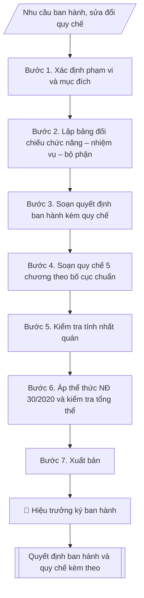

# Soạn quy chế tổ chức và hoạt động của đơn vị trực thuộc

## Kiểm soát áp dụng và phê duyệt

Trước khi chạy quy trình, xác định `ngay_ap_dung`, `loai_hinh_truong`, `quy_che_noi_bo`, `nguon_du_lieu` và `nguoi_kiem_duyet`. Chỉ yêu cầu thông tin có liên quan đến nghiệp vụ; không dùng giá trị giả định thay dữ liệu bắt buộc. Hồ sơ có yếu tố pháp lý phải kèm văn bản gốc, tình trạng hiệu lực, điều khoản áp dụng và chuyển tiếp.

## Giới hạn và human gate

AI hỗ trợ chuẩn bị và đối chiếu. Cán bộ phụ trách kiểm tra dữ liệu/căn cứ, người có thẩm quyền duyệt và ký. Mọi đầu ra mặc định là **DỰ THẢO – CHỜ KIỂM DUYỆT**; không đánh dấu đã ký, đã duyệt hoặc đã công bố nếu chưa có chứng cứ. Dữ liệu sinh viên, sức khỏe, nhân sự và tài chính phải hạn chế theo mục đích, phân quyền và che thông tin định danh khi dùng ví dụ. Không tải dữ liệu lên dịch vụ ngoài khi chưa có quyền. Kiểm tra Luật 91/2025/QH15 về bảo vệ dữ liệu cá nhân (hiệu lực 01/01/2026) và quy định áp dụng trước xử lý/chia sẻ dữ liệu cá nhân.


## Khi nào dùng
Khi cần ban hành (hoặc sửa đổi, bổ sung) quy chế tổ chức và hoạt động của một đơn vị trực thuộc
trường — phòng chức năng, khoa, trung tâm, viện: quy định rõ đơn vị là gì, làm gì (chức năng,
nhiệm vụ), tổ chức ra sao (cơ cấu, lãnh đạo, các bộ phận), làm việc thế nào (chế độ làm việc,
mối quan hệ công tác). Thường dùng khi thành lập mới, chia tách/sáp nhập đơn vị, hoặc rà soát
định kỳ theo yêu cầu quản trị.

## Đầu vào (Input)

| Trường | Mô tả | Bắt buộc |
|---|---|---|
| `ten_don_vi` | Tên đầy đủ của đơn vị (VD: Phòng Tổ chức – Cán bộ) | Có |
| `chuc_nang` | Chức năng của đơn vị (1–2 câu khái quát) | Có |
| `nhiem_vu` | Danh sách nhiệm vụ cụ thể của đơn vị (gạch đầu dòng) | Có |
| `co_cau` | Cơ cấu tổ chức: lãnh đạo (Trưởng/Phó), các tổ/bộ phận trực thuộc, số lượng dự kiến | Có |
| `che_do_lam_viec` | Chế độ làm việc: hội họp, báo cáo, chế độ thủ trưởng, phân công nhiệm vụ | Không |
| `moi_quan_he` | Mối quan hệ công tác với Ban Giám hiệu, các đơn vị trong trường, cơ quan ngoài | Không |
| `so_quyet_dinh` | Số quyết định ban hành kèm quy chế (VD: 250/QĐ-ĐHA) | Có |
| `ngay_ky` | Ngày ký quyết định ban hành | Có |
| `nguoi_ky` | Hiệu trưởng | Có |

## Quy trình

**Bước 1. Xác định phạm vi và mục đích**
- Làm gì: xác định đây là quy chế mới hoàn toàn hay sửa đổi, bổ sung quy chế hiện hành;
nếu sửa đổi: liệt kê các điều khoản được sửa, bãi bỏ, bổ sung và lý do (thành lập mới, chia
tách/sáp nhập đơn vị, thay đổi chức năng nhiệm vụ, rà soát định kỳ).
- Dùng input: `ten_don_vi`, `so_quyet_dinh` (quyết định ban hành mới).
- Vai trò: Chuyên viên Phòng TCCB · AI hỗ trợ: phân tích input, xác định yêu cầu · ⏱ ~20–45 phút (ước tính)
- Lưu ý nghiệp vụ: sửa đổi, bổ sung quy chế phải ban hành quyết định mới (thay thế hoặc sửa
đổi từng điều) — không được sửa trực tiếp trên văn bản cũ; ghi rõ quy chế này thay thế văn
bản nào để tránh tồn tại hai quy chế cùng hiệu lực.
- → Kết quả bước: phiếu xác định phạm vi (mới/sửa đổi + danh sách điều khoản sửa đổi nếu có).

**Bước 2. Lập bảng đối chiếu chức năng – nhiệm vụ – bộ phận phụ trách**
- Làm gì: từ `chuc_nang` và `nhiem_vu`, đối chiếu với `co_cau`: mỗi nhiệm vụ phải có tổ/bộ
phận hoặc vị trí phụ trách; mỗi tổ/bộ phận phải gắn với nhiệm vụ cụ thể; đánh dấu nhiệm vụ
chưa có bộ phận phụ trách hoặc bộ phận chưa gắn nhiệm vụ để điều chỉnh cơ cấu.
- Dùng input: `chuc_nang`, `nhiem_vu`, `co_cau`.
- Vai trò: Chuyên viên Phòng TCCB (Trưởng phòng kiểm tra lại) · AI hỗ trợ: lập bảng tính toán · ⏱ ~15–30 phút (ước tính)
- Lưu ý nghiệp vụ: làm bước này TRƯỚC khi soạn quy chế để bảo đảm tính nhất quán chức năng
→ nhiệm vụ → cơ cấu; bẫy thường gặp là cơ cấu copy từ đơn vị khác nhưng nhiệm vụ thì khác —
quy chế sẽ có bộ phận không có việc hoặc nhiệm vụ không ai làm.
- → Kết quả bước: bảng đối chiếu chức năng – nhiệm vụ – bộ phận phụ trách (không trùng lắp,
không bỏ sót).

**Bước 3. Soạn quyết định ban hành kèm quy chế**
- Làm gì: soạn quyết định hành chính của Hiệu trưởng theo thể thức NĐ 30/2020: Quốc hiệu –
Tiêu ngữ, tên trường, `so_quyet_dinh`, địa danh và `ngay_ky`; tên loại "QUYẾT ĐỊNH" + trích
yếu (Về việc ban hành Quy chế tổ chức và hoạt động của `ten_don_vi`); chức danh người ký;
phần căn cứ (quy chế tổ chức và hoạt động của trường; đề nghị của đơn vị); các Điều: Điều 1
(ban hành kèm theo quyết định này Quy chế...); Điều 2 (hiệu lực kể từ ngày ký; thay thế các
quy định trước đây trái với quyết định); Điều 3 (trách nhiệm thi hành); Nơi nhận; `nguoi_ky` ký.
- Dùng input: `ten_don_vi`, `so_quyet_dinh`, `ngay_ky`, `nguoi_ky`.
- Vai trò: Chuyên viên Phòng TCCB · AI hỗ trợ: soạn dự thảo đúng thể thức · ⏱ ~20–45 phút (ước tính)
- Lưu ý nghiệp vụ: quy chế là văn bản kèm theo quyết định, phải đóng dấu giáp lai theo quy
định văn thư; Điều 2 bắt buộc ghi rõ thay thế văn bản cũ nào (nếu có) để bảo đảm tính pháp lý.
- → Kết quả bước: dự thảo quyết định ban hành kèm quy chế.

**Bước 4. Soạn quy chế theo bố cục chương – điều chuẩn**
- Làm gì: soạn nội dung quy chế gồm 5 chương:
  - Chương I. Quy định chung: Điều 1 (phạm vi điều chỉnh, đối tượng áp dụng); Điều 2
    (vị trí, chức năng của đơn vị — từ `chuc_nang`);
  - Chương II. Nhiệm vụ và quyền hạn: liệt kê đầy đủ `nhiem_vu`, đánh số từng khoản
    (Điều 3); quyền hạn của đơn vị và của người đứng đầu (Điều 4);
  - Chương III. Cơ cấu tổ chức: lãnh đạo đơn vị — Trưởng, các Phó, nhiệm vụ/quyền hạn từng
    chức danh (Điều 5); các tổ/bộ phận trực thuộc và chức năng từng bộ phận, biên chế
    (Điều 6) — từ `co_cau` và bảng đối chiếu Bước 2;
  - Chương IV. Chế độ làm việc và mối quan hệ công tác: chế độ thủ trưởng, hội họp, báo cáo,
    thông tin (Điều 7 — từ `che_do_lam_viec`); mối quan hệ với Ban Giám hiệu (chịu sự lãnh
    đạo, chỉ đạo trực tiếp), với các đơn vị trong trường (phối hợp), với cơ quan ngoài (theo
    ủy quyền) (Điều 8 — từ `moi_quan_he`);
  - Chương V. Điều khoản thi hành: hiệu lực (Điều 9); trách nhiệm tổ chức thực hiện, sửa đổi
    bổ sung (Điều 10).
- Dùng input: `ten_don_vi`, `chuc_nang`, `nhiem_vu`, `co_cau`, `che_do_lam_viec`, `moi_quan_he`.
- Vai trò: Chuyên viên Phòng TCCB · AI hỗ trợ: soạn dự thảo đúng thể thức · ⏱ ~20–45 phút (ước tính)
- Lưu ý nghiệp vụ: nhiệm vụ ở Chương II phải đầy đủ, đánh số từng khoản để dễ viện dẫn;
quyền hạn (Điều 4) phải tương xứng với nhiệm vụ, không ghi quyền hạn vượt thẩm quyền đơn vị;
cơ cấu ở Chương III phải khớp với bảng đối chiếu Bước 2.
- → Kết quả bước: dự thảo quy chế đầy đủ 5 chương.

**Bước 5. Kiểm tra tính nhất quán**
- Làm gì: đối chiếu chéo: chức năng (Điều 2) → nhiệm vụ (Điều 3) → cơ cấu (Điều 5–6): mỗi
nhiệm vụ có bộ phận/vị trí phụ trách; không trùng lắp nhiệm vụ giữa các bộ phận; không bỏ sót
nhiệm vụ được giao; đối chiếu với quy chế tổ chức và hoạt động của trường và đề án vị trí
việc làm (không trái, không vượt).
- Dùng input: kết quả Bước 2–4 (tổng soát).
- Vai trò: Chuyên viên Phòng TCCB (Trưởng phòng kiểm tra lại) · AI hỗ trợ: quét lỗi theo checklist · ⏱ ~15–30 phút (ước tính)
- Lưu ý nghiệp vụ: quy chế đơn vị không được trái với quy chế tổ chức và hoạt động của
trường — mọi điểm khác biệt phải được lý giải và chấp thuận; kiểm tra tên đơn vị, tên các
tổ/bộ phận thống nhất trong toàn văn.
- → Kết quả bước: biên bản kiểm tra nhất quán (đạt/các điểm cần chỉnh).

**Bước 6. Áp thể thức NĐ 30/2020 và kiểm tra tổng thể**
- Làm gì: áp thể thức cho cả quyết định ban hành và quy chế kèm theo: Quốc hiệu – Tiêu ngữ,
số/ký hiệu, địa danh ngày tháng, chữ ký, nơi nhận đúng vị trí; thể thức trình bày chương/điều
("Chương I", "Điều 1." in đậm); quy chế có dòng ghi chú "Ban hành kèm theo Quyết định số...
ngày... của..."; soát chính tả toàn văn; kiểm tra thẩm quyền ban hành (`nguoi_ky` là Hiệu
trưởng), Nơi nhận đầy đủ; đánh giá tính khả thi của cơ cấu và chế độ làm việc.
- Dùng input: `so_quyet_dinh`, `ngay_ky`, `nguoi_ky` + kết quả Bước 3–5.
- Vai trò: Chuyên viên Phòng TCCB (Trưởng phòng kiểm tra lại) · AI hỗ trợ: quét lỗi theo checklist · ⏱ ~15–30 phút (ước tính)
- Lưu ý nghiệp vụ: dòng ghi chú "Ban hành kèm theo Quyết định số..." trên quy chế là bắt buộc
để gắn quy chế với quyết định ban hành; kiểm tra số quyết định trên quy chế khớp với số trên
quyết định ban hành.
- → Kết quả bước: bộ văn bản đã áp thể thức + checklist kiểm tra.

**Bước 7. Xuất bản**
- Làm gì: hoàn thiện bộ văn bản (quyết định ban hành + quy chế kèm theo) ở định dạng markdown,
sẵn sàng trình ký / chuyển sang Word; đính kèm bảng đối chiếu chức năng – nhiệm vụ – bộ phận
(Bước 2) và checklist kiểm tra (Bước 6) để lưu hồ sơ.
- Dùng input: `nguoi_ky` (trình ký).
- Vai trò: Văn thư Phòng TCCB · AI hỗ trợ: định dạng bản chính, cập nhật sổ phát hành · ⏱ ~30 phút (ước tính)
- Lưu ý nghiệp vụ: sau khi ký, quy chế phải được phổ biến đến toàn thể viên chức đơn vị và
gửi các đơn vị liên quan; lưu 01 bản tại Văn phòng và 01 bản tại đơn vị.
- → Kết quả bước: bộ văn bản hoàn chỉnh (quyết định ban hành + quy chế kèm theo) +
bảng đối chiếu + checklist, sẵn sàng trình ký.

## Luồng quy trình (Workflow)



## Đầu ra (Output)
- Quyết định ban hành kèm quy chế tổ chức và hoạt động hoàn chỉnh của đơn vị.
- Bảng đối chiếu chức năng – nhiệm vụ – bộ phận phụ trách (bảo đảm không trùng/sót).
- Checklist kiểm tra thể thức và tính đầy đủ các chương.

**Cấu trúc output chuẩn:** (bộ văn bản gồm Quyết định ban hành + Quy chế kèm theo —
theo thể thức NĐ 30/2020)

A. Quyết định ban hành:
1. Quốc hiệu – Tiêu ngữ ("CỘNG HÒA XÃ HỘI CHỦ NGHĨA VIỆT NAM" / "Độc lập – Tự do – Hạnh phúc").
2. Tên cơ quan ban hành (Trường Đại học A).
3. Số, ký hiệu quyết định.
4. Địa danh, ngày tháng năm ban hành.
5. Tên loại văn bản "QUYẾT ĐỊNH" + trích yếu ("Về việc ban hành Quy chế tổ chức và hoạt
động của ...").
6. Chức danh người ký (HIỆU TRƯỞNG TRƯỜNG ĐẠI HỌC A).
7. Phần căn cứ: quy chế tổ chức và hoạt động của trường (số, ngày ban hành); đề nghị của
đơn vị.
8. Cụm "QUYẾT ĐỊNH:" và các Điều: Điều 1 (ban hành kèm theo Quyết định này Quy chế...);
Điều 2 (hiệu lực kể từ ngày ký; thay thế các quy định trước đây trái với Quyết định này);
Điều 3 (trách nhiệm thi hành).
9. Nơi nhận (như Điều 3; lưu VT, TCCB).
10. Chữ ký (chức danh người ký + họ tên).

B. Quy chế kèm theo:
1. Tên loại "QUY CHẾ" + tên quy chế ("TỔ CHỨC VÀ HOẠT ĐỘNG CỦA ...") + dòng ghi chú
"(Ban hành kèm theo Quyết định số ... ngày ... của Hiệu trưởng Trường Đại học A)".
2. Chương I. Quy định chung: Điều 1 (phạm vi điều chỉnh, đối tượng áp dụng); Điều 2
(vị trí, chức năng).
3. Chương II. Nhiệm vụ và quyền hạn: Điều 3 (nhiệm vụ — liệt kê đánh số từng khoản);
Điều 4 (quyền hạn).
4. Chương III. Cơ cấu tổ chức: Điều 5 (lãnh đạo đơn vị); Điều 6 (các tổ/bộ phận trực thuộc).
5. Chương IV. Chế độ làm việc và mối quan hệ công tác: Điều 7 (chế độ làm việc); Điều 8
(mối quan hệ công tác).
6. Chương V. Điều khoản thi hành: Điều 9 (hiệu lực thi hành); Điều 10 (trách nhiệm thi hành
và sửa đổi, bổ sung).

## Checklist nghiệm thu

Tiêu chí đạt: tất cả các ô dưới đây được đánh dấu.

- [ ] Đủ các phần theo Cấu trúc output chuẩn: Quốc hiệu – Tiêu ngữ ("CỘNG HÒA XÃ HỘI CHỦ NGHĨA VIỆT NAM" / "Độc l…; Tên cơ quan ban hành (Trường Đại học A).; Số, ký hiệu quyết định.; Địa danh, ngày tháng năm ban hành.; … (đủ 16 phần)
- [ ] Nội dung và số liệu trong output khớp đúng với Input đã cho (không thêm, bớt hay suy diễn)
- [ ] Không bịa đặt số liệu, minh chứng, trích dẫn hay căn cứ
- [ ] Đúng thể thức và định dạng theo Nghị định 30/2020/NĐ-CP về công tác văn thư (thể thức quyết định và…
- [ ] Căn cứ pháp lý được trích dẫn đầy đủ và còn hiệu lực
- [ ] Đã qua Human gate: người có thẩm quyền đã kiểm tra/duyệt trước khi phát hành
- [ ] Sửa đổi, bổ sung quy chế phải ban hành quyết định mới (thay thế hoặc sửa
- [ ] Quy chế là văn bản kèm theo quyết định, phải đóng dấu giáp lai theo quy
- [ ] Nhiệm vụ ở Chương II phải đầy đủ, đánh số từng khoản để dễ viện dẫn;

## Ví dụ mô phỏng (dữ liệu giả lập)

> Tất cả tên trường, cá nhân, số liệu dưới đây đều là **giả lập**, không liên quan tổ chức/cá nhân có thật.

### Input mẫu

| Trường | Giá trị |
|---|---|
| `ten_don_vi` | Phòng Tổ chức – Cán bộ |
| `chuc_nang` | Là đơn vị tham mưu, giúp việc Hiệu trưởng về công tác tổ chức bộ máy và quản lý viên chức, người lao động của Trường |
| `nhiem_vu` | 1. Tham mưu xây dựng đề án vị trí việc làm, kế hoạch tuyển dụng viên chức. 2. Thực hiện quy trình bổ nhiệm, bổ nhiệm lại, miễn nhiệm, điều động viên chức quản lý. 3. Quản lý hồ sơ viên chức; thực hiện chế độ tiền lương, phụ cấp, bảo hiểm. 4. Tham mưu công tác thi đua, khen thưởng, kỷ luật. 5. Tổ chức đào tạo, bồi dưỡng cán bộ; đánh giá, xếp loại viên chức hằng năm |
| `co_cau` | Lãnh đạo: 01 Trưởng phòng, 02 Phó Trưởng phòng. Các tổ: Tổ Tổ chức cán bộ (03 người), Tổ Chế độ chính sách (02 người), Tổ Thi đua – khen thưởng (02 người) |
| `che_do_lam_viec` | Chế độ thủ trưởng; họp giao ban Phòng 01 lần/tuần; báo cáo Hiệu trưởng định kỳ hằng tháng và đột xuất |
| `moi_quan_he` | Chịu sự lãnh đạo, chỉ đạo trực tiếp của Hiệu trưởng; phối hợp với các đơn vị trong trường; quan hệ với cơ quan cấp trên về công tác cán bộ theo ủy quyền của Hiệu trưởng |
| `so_quyet_dinh` | 250/QĐ-ĐHA |
| `ngay_ky` | 09/10/2026 |
| `nguoi_ky` | Hiệu trưởng |

### Output mẫu

```
TRƯỜNG ĐẠI HỌC A            CỘNG HÒA XÃ HỘI CHỦ NGHĨA VIỆT NAM
                                          Độc lập – Tự do – Hạnh phúc
      Số: 250/QĐ-ĐHA
                                                 Thành phố C, ngày 09 tháng 10 năm 2026

                    QUYẾT ĐỊNH
     Về việc ban hành Quy chế tổ chức và hoạt động
              của Phòng Tổ chức – Cán bộ

                              HIỆU TRƯỞNG TRƯỜNG ĐẠI HỌC A

Căn cứ Quy chế tổ chức và hoạt động của Trường Đại học A ban hành kèm
theo Quyết định số 12/QĐ-ĐHA ngày 15 tháng 01 năm 2024 của Hiệu trưởng;
Theo đề nghị của Trưởng phòng Tổ chức – Cán bộ,

                              QUYẾT ĐỊNH:

Điều 1. Ban hành kèm theo Quyết định này Quy chế tổ chức và hoạt động của
Phòng Tổ chức – Cán bộ, Trường Đại học A.

Điều 2. Quyết định này có hiệu lực kể từ ngày ký và thay thế các quy định
trước đây trái với Quyết định này.

Điều 3. Trưởng phòng Tổ chức – Cán bộ, thủ trưởng các đơn vị trực thuộc và
các cá nhân có liên quan chịu trách nhiệm thi hành Quyết định này./.

Nơi nhận:                                              HIỆU TRƯỞNG
- Như Điều 3;
- Lưu: VT, TCCB.                                           [CHỜ KÝ]

                                                     PGS.TS. Trần Văn B


_________________________________________________________________________

              QUY CHẾ
TỔ CHỨC VÀ HOẠT ĐỘNG CỦA PHÒNG TỔ CHỨC – CÁN BỘ
    (Ban hành kèm theo Quyết định số 250/QĐ-ĐHA ngày 09/10/2026
              của Hiệu trưởng Trường Đại học A)

Chương I
QUY ĐỊNH CHUNG

Điều 1. Phạm vi điều chỉnh, đối tượng áp dụng
1. Quy chế này quy định chức năng, nhiệm vụ, quyền hạn, cơ cấu tổ chức, chế độ
làm việc và mối quan hệ công tác của Phòng Tổ chức – Cán bộ.
2. Quy chế áp dụng đối với toàn thể viên chức, người lao động của Phòng và các
tổ chức, cá nhân có liên quan.

Điều 2. Vị trí, chức năng
Phòng Tổ chức – Cán bộ là đơn vị tham mưu, giúp việc Hiệu trưởng về công tác
tổ chức bộ máy và quản lý viên chức, người lao động của Trường.

Chương II
NHIỆM VỤ VÀ QUYỀN HẠN

Điều 3. Nhiệm vụ
1. Tham mưu xây dựng đề án vị trí việc làm, kế hoạch tuyển dụng viên chức hằng năm.
2. Thực hiện quy trình bổ nhiệm, bổ nhiệm lại, miễn nhiệm, điều động viên chức quản lý.
3. Quản lý hồ sơ viên chức; thực hiện chế độ tiền lương, phụ cấp, bảo hiểm xã hội,
bảo hiểm y tế cho viên chức, người lao động.
4. Tham mưu công tác thi đua, khen thưởng, kỷ luật viên chức, người lao động.
5. Tổ chức đào tạo, bồi dưỡng cán bộ; tổng hợp đánh giá, xếp loại viên chức hằng năm.
6. Thực hiện chế độ thống kê, báo cáo về công tác tổ chức, cán bộ theo quy định.

Điều 4. Quyền hạn
1. Đề xuất với Hiệu trưởng các chủ trương, biện pháp về công tác tổ chức, cán bộ.
2. Yêu cầu các đơn vị trực thuộc cung cấp thông tin, số liệu phục vụ công tác
quản lý cán bộ.
3. Được tham gia các hội đồng, ban chỉ đạo về công tác cán bộ theo phân công
của Hiệu trưởng.

Chương III
CƠ CẤU TỔ CHỨC

Điều 5. Lãnh đạo Phòng
1. Phòng có Trưởng phòng và không quá 02 Phó Trưởng phòng do Hiệu trưởng bổ nhiệm.
2. Trưởng phòng chịu trách nhiệm trước Hiệu trưởng về toàn bộ hoạt động của Phòng;
điều hành, phân công nhiệm vụ cho các Phó Trưởng phòng và các tổ.
3. Phó Trưởng phòng giúp Trưởng phòng, chịu trách nhiệm trước Trưởng phòng về
lĩnh vực được phân công.

Điều 6. Các tổ trực thuộc
1. Tổ Tổ chức cán bộ (03 người): phụ trách tuyển dụng, bổ nhiệm, điều động, hồ sơ
viên chức, đánh giá xếp loại.
2. Tổ Chế độ chính sách (02 người): phụ trách tiền lương, phụ cấp, bảo hiểm,
nghỉ hưu, thôi việc.
3. Tổ Thi đua – khen thưởng (02 người): phụ trách phong trào thi đua, hồ sơ khen
thưởng, kỷ luật.

Chương IV
CHẾ ĐỘ LÀM VIỆC VÀ MỐI QUAN HỆ CÔNG TÁC

Điều 7. Chế độ làm việc
1. Phòng làm việc theo chế độ thủ trưởng; Trưởng phòng quyết định các công việc
thuộc thẩm quyền sau khi bàn bạc tập thể khi cần thiết.
2. Họp giao ban Phòng 01 lần/tuần; họp đột xuất khi có yêu cầu.
3. Báo cáo Hiệu trưởng định kỳ hằng tháng và đột xuất khi có vấn đề phát sinh.

Điều 8. Mối quan hệ công tác
1. Chịu sự lãnh đạo, chỉ đạo trực tiếp của Hiệu trưởng.
2. Phối hợp chặt chẽ với các đơn vị trực thuộc trong triển khai nhiệm vụ.
3. Quan hệ với cơ quan cấp trên về công tác cán bộ theo sự ủy quyền của Hiệu trưởng.

Chương V
ĐIỀU KHOẢN THI HÀNH

Điều 9. Hiệu lực thi hành
Quy chế này có hiệu lực kể từ ngày ký Quyết định ban hành.

Điều 10. Trách nhiệm thi hành và sửa đổi, bổ sung
1. Trưởng phòng Tổ chức – Cán bộ có trách nhiệm tổ chức thực hiện Quy chế này.
2. Trong quá trình thực hiện, nếu có vướng mắc, Phòng tổng hợp báo cáo Hiệu trưởng
xem xét sửa đổi, bổ sung cho phù hợp./.
```

### Bảng đối chiếu chức năng – nhiệm vụ – bộ phận phụ trách (output kèm theo)

| Nhiệm vụ (Điều 3) | Bộ phận phụ trách | Ghi chú |
|---|---|---|
| Khoản 1, 2, 5 (tuyển dụng, bổ nhiệm, hồ sơ, đánh giá) | Tổ Tổ chức cán bộ | Khớp |
| Khoản 3 (lương, phụ cấp, bảo hiểm) | Tổ Chế độ chính sách | Khớp |
| Khoản 4 (thi đua, khen thưởng, kỷ luật) | Tổ Thi đua – khen thưởng | Khớp |
| Khoản 6 (thống kê, báo cáo) | Các tổ theo lĩnh vực, Tổ TCCB tổng hợp | Khớp |

### Checklist kiểm tra (output kèm theo)
- [x] Quyết định ban hành có đủ căn cứ, các điều, chữ ký Hiệu trưởng
- [x] Quy chế đủ 5 chương: Quy định chung – Nhiệm vụ/quyền hạn – Cơ cấu – Chế độ làm việc – Điều khoản thi hành
- [x] Chức năng → nhiệm vụ → cơ cấu khớp nhau, không trùng lắp, không bỏ sót
- [x] Quy định rõ chế độ thủ trưởng, hội họp, báo cáo, mối quan hệ công tác
- [x] Phù hợp quy chế tổ chức và hoạt động của trường và đề án vị trí việc làm
- [x] Thể thức chương/điều, chính tả, nơi nhận đúng NĐ 30/2020

## Căn cứ & lưu ý
- Nghị định 30/2020/NĐ-CP về công tác văn thư (thể thức quyết định và văn bản kèm theo).
- Nghị định 62/2017/NĐ-CP về vị trí việc làm trong đơn vị sự nghiệp công lập
  (cơ cấu tổ chức phải gắn với danh mục vị trí việc làm).
- Quy chế tổ chức và hoạt động của trường; quy định công tác cán bộ
  (thẩm quyền thành lập, chia tách, sáp nhập đơn vị; bổ nhiệm người đứng đầu).
- Quy chế đơn vị không được trái với quy chế tổ chức và hoạt động của trường;
  khi sửa đổi, bổ sung phải ban hành quyết định mới thay thế hoặc sửa đổi từng điều.
- Không dùng tên thật của trường/cá nhân khi mô phỏng.

## Quản trị phiên bản

- Phiên bản gói: `1.1.0`; ngày cập nhật: `2026-10-09`.
- Kho nguồn: https://github.com/phamtruong91/dh-skills
- Người duy trì trên GitHub: `phamtruong91` (Phạm Văn Trường). Người phê duyệt nghiệp vụ: **chưa chỉ định**.
- Commit nguồn trước cập nhật: `78fd1d51b8acd1a724d9b9af6c488460bc7551ad`. Commit chứa phiên bản này xem bằng `git log -1 -- skills/quy-che-to-chuc-hoat-dong`; không tự gán SHA chưa tạo.
- Giấy phép: theo LICENSE của kho; bản quyền CES Global.
- Lịch sử 1.1.0: bổ sung metadata giao diện, kiểm soát áp dụng, quản trị phiên bản.
- Trạng thái: dự thảo nghiệp vụ; kiểm tra pháp lý trước thực thi. Ngày cập nhật không đồng nghĩa mọi văn bản đã được rà soát toàn văn.
