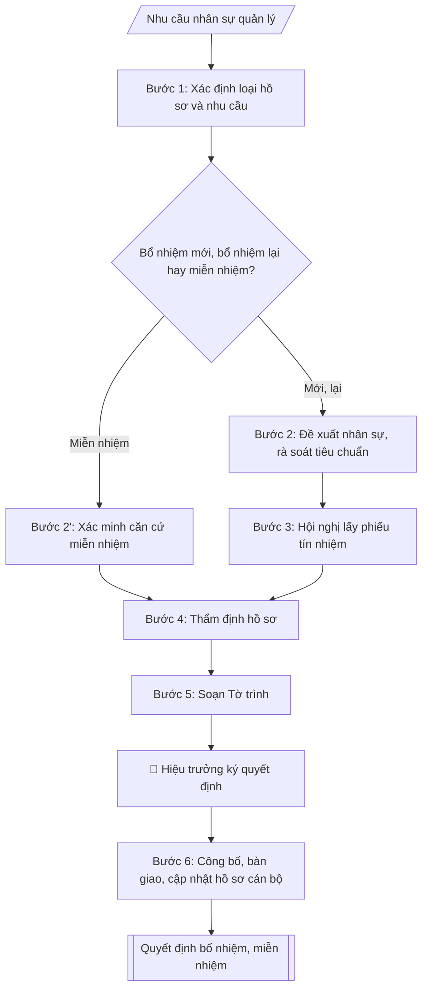

# Quy trình bổ nhiệm, bổ nhiệm lại, miễn nhiệm

## Định dạng và file đầu ra
Định dạng đầu ra có thể chọn theo sản phẩm/yêu cầu: .docx, .pdf. Đọc mục “Định dạng bổ sung” trong quy cách đầu ra trước khi chọn.

**Phải tạo file thực tế để tải xuống, không chỉ trả nội dung trong chat.** Định dạng mặc định của skill: **.docx**. Nếu có bảng số liệu nghiệp vụ yêu cầu file bảng tính riêng, tạo thêm Excel theo yêu cầu; không tự tạo file kiểm tra. Không chờ người dùng yêu cầu xuất file lần nữa. Ưu tiên định dạng người dùng chỉ định; đọc quy tắc xuất file tại references/quy-cach-dau-ra.md.

## Quy cách đầu ra và thông tin thiếu
Đọc [quy cách và cấu trúc sản phẩm](references/quy-cach-dau-ra.md) trước khi soạn/xuất. File giao chỉ gồm sản phẩm nghiệp vụ được yêu cầu; kiểm tra nội bộ không xuất kèm. Thiếu thông tin thì giữ nguyên trường/mục và chỗ điền theo mẫu gốc (dòng dấu chấm, dấu gạch hoặc ô trống); không tự điền dữ liệu mẫu, số 0, mã chờ xác minh hay dòng chờ ký. Mẫu chuyên ngành còn áp dụng được ưu tiên về cấu trúc, mã biểu và người ký. Bản đầy đủ: [quy tắc chung](references/quy-tac-chung.md).

## Kiểm soát áp dụng và phê duyệt
Trước khi chạy, xác định `ngay_ap_dung`, `loai_hinh_truong`, `quy_che_noi_bo`, `nguon_du_lieu`, `nguoi_kiem_duyet`; chỉ hỏi thông tin liên quan nghiệp vụ, không dùng giá trị giả định thay dữ liệu bắt buộc. Đối chiếu căn cứ pháp lý với văn bản gốc, hiệu lực, điều khoản áp dụng và chuyển tiếp. Bản đầy đủ: [quy tắc chung](references/quy-tac-chung.md).

Nếu có cập nhật pháp lý dưới đây, đọc [căn cứ và điều kiện áp dụng](references/phap-ly.md) trước khi làm. Quy trình dưới đây giữ nghiệp vụ từ bản gốc; mọi viện dẫn văn bản, mẫu biểu, điều khoản phải theo căn cứ đã chọn trong phap-ly.md, không theo văn bản cũ.

## Giới hạn và human gate
AI hỗ trợ chuẩn bị và đối chiếu; cán bộ phụ trách kiểm tra dữ liệu/căn cứ, người có thẩm quyền duyệt và ký. Không đánh dấu đã ký, đã duyệt, đã công bố khi chưa có chứng cứ. Dữ liệu sinh viên, sức khỏe, nhân sự, tài chính chỉ dùng theo mục đích và phân quyền, che thông tin định danh khi dùng ví dụ (Luật 91/2025/QH15, hiệu lực 01/01/2026); không tải dữ liệu lên dịch vụ ngoài khi chưa có quyền. Bản đầy đủ: [quy tắc chung](references/quy-tac-chung.md).

## Khi nào dùng
Khi Nhà trường cần bổ nhiệm mới, bổ nhiệm lại (hết nhiệm kỳ) hoặc miễn nhiệm cán bộ lãnh đạo, quản lý
(Trưởng/Phó trưởng khoa, phòng, ban, trung tâm và tương đương): cần checklist các bước theo quy định
công tác cán bộ và soạn đầy đủ bộ hồ sơ gồm Tờ trình, Biên bản hội nghị lấy phiếu tín nhiệm,
Biên bản kiểm phiếu và Quyết định bổ nhiệm / bổ nhiệm lại / miễn nhiệm.

## Đầu vào (Input)
| Trường | Mô tả | Bắt buộc |
|---|---|---|
| `loai_ho_so` | Bổ nhiệm mới / Bổ nhiệm lại / Miễn nhiệm | Có |
| `ho_ten` | Họ tên, học hàm/học vị của nhân sự (giả lập khi mô phỏng) | Có |
| `chuc_vu_du_kien` | Chức vụ dự kiến bổ nhiệm / đang giữ (VD: Trưởng khoa, Phó Trưởng phòng) | Có |
| `don_vi` | Đơn vị công tác (khoa/phòng/trung tâm) | Có |
| `nhiem_ky` | Thời hạn bổ nhiệm (thường 05 năm; bổ nhiệm lại theo nhiệm kỳ) | Có (trừ miễn nhiệm) |
| `tieu_chuan` | Tóm tắt quá trình công tác, trình độ, phẩm chất đáp ứng tiêu chuẩn chức vụ | Có (bổ nhiệm/bổ nhiệm lại) |
| `ly_do_mien_nhiem` | Lý do miễn nhiệm (nguyện vọng cá nhân / hết nhiệm kỳ không bổ nhiệm lại / vi phạm...) | Có (nếu miễn nhiệm) |
| `ket_qua_phieu` | Kết quả phiếu tín nhiệm: số phiếu đồng ý / tổng số (nếu đã tổ chức lấy phiếu) | Không |
| `nguoi_ky` | Hiệu trưởng (người có thẩm quyền bổ nhiệm) | Có |

## Quy trình
**Ràng buộc pháp lý khi thực hiện** (trích references/phap-ly.md; đối chiếu toàn văn và hiệu lực tại ngày nghiệp vụ):
- Luật 129/2025/QH15; Nghị định 259/2026/NĐ-CP; phạm vi: Viên chức đơn vị sự nghiệp công lập; kiểm tra chuyển tiếp và quy định riêng về nhà giáo: Cập nhật căn cứ tuyển dụng, hợp đồng làm việc, bổ nhiệm, điều động và đào tạo viên chức. Không tái sử dụng số điều hoặc mẫu phiếu của NĐ 115. Phải yêu cầu ngày tuyển dụng, ngày phê duyệt kế hoạch, loại hợp đồng, trạng thái hồ sơ và bản văn NĐ 259 để chọn điều khoản chuyển tiếp; không tự áp dụng điều22 Luật Viên chức2010. Các văn bản cũ chỉ là căn cứ lịch sử khi chuyển tiếp cho phép.
- Luật Nhà giáo; Nghị định 93/2026/NĐ-CP; khoản 9 Điều 62 NĐ 259/2026; phạm vi: Viên chức là nhà giáo: Thêm input đối tượng là nhà giáo hay viên chức khác. Nếu pháp luật nhà giáo có quy định khác về thẩm quyền, tiêu chuẩn, điều kiện, trình tự, thủ tục tuyển dụng/sử dụng/quản lý, áp dụng quy định nhà giáo và hướng dẫn Bộ GDĐT thay vì quy tắc chung NĐ 259.
- Trước Bước 1: chọn căn cứ theo đối tượng, loại hình trường và chuyển tiếp; lập bảng văn bản / điều khoản / lý do áp dụng / bằng chứng. Thiếu văn bản gốc hoặc điều khoản thì ghi nhận nội bộ [CẦN XÁC MINH] (không đưa vào file giao), để trống phần tương ứng, chưa kết luận tuân thủ.
- Các con số, thời hạn, số điều, số mức xếp loại, hệ số và mẫu biểu nêu trong các bước dưới đây được giữ từ quy trình gốc (trước cập nhật pháp lý); chỉ dùng khi đã đối chiếu đúng với căn cứ đã chọn, khác thì theo căn cứ. Danh sách điểm cần đối chiếu: docs/DIEM_CAN_DOI_CHIEU_PHAP_LY.md.

**Bước 1. Xác định loại hồ sơ và nhu cầu nhân sự**
- Làm gì: tiếp nhận nhu cầu kiện toàn cán bộ quản lý (khuyết chức danh, sắp hết nhiệm kỳ, đơn xin thôi giữ chức vụ); xác định thuộc trường hợp nào: Bổ nhiệm mới / Bổ nhiệm lại / Miễn nhiệm; tra cứu thời hạn — bổ nhiệm lại phải triển khai trước khi hết nhiệm kỳ (thường 90 ngày).
- Dùng input: `loai_ho_so`, `chuc_vu_du_kien`, `don_vi`, `nhiem_ky` (trừ miễn nhiệm), `ly_do_mien_nhiem` (nếu miễn nhiệm).
- Vai trò: Chuyên viên Phòng TCCB · AI hỗ trợ: phân tích input, xác định yêu cầu · ⏱ ~20–45 phút (ước tính)
- Lưu ý nghiệp vụ: phân biệt đúng loại hồ sơ ngay từ đầu — miễn nhiệm do hết nhiệm kỳ khác miễn nhiệm do vi phạm (ảnh hưởng phương án bố trí công tác tiếp theo và thời điểm thôi hưởng phụ cấp chức vụ).
- → Kết quả bước: phiếu xác định loại hồ sơ + mốc thời gian phải hoàn thành.

**Bước 2. Đề xuất nhân sự và rà soát tiêu chuẩn** (bổ nhiệm mới / bổ nhiệm lại)
- Làm gì: tiếp nhận đề xuất của đơn vị hoặc lập danh sách nhân sự dự kiến; rà soát tiêu chuẩn, điều kiện của chức danh: trình độ đào tạo, thâm niên công tác, độ tuổi, quy hoạch cán bộ; đối chiếu quá trình công tác, phẩm chất, năng lực với tiêu chuẩn chức vụ; loại nhân sự không đủ điều kiện kèm lý do cụ thể. Đối với bổ nhiệm lại: yêu cầu cá nhân làm bản tự kiểm điểm nhiệm kỳ và kết quả đánh giá nhiệm kỳ của đơn vị.
- Dùng input: `ho_ten`, `chuc_vu_du_kien`, `don_vi`, `tieu_chuan`.
- Lưu ý nghiệp vụ: nhân sự đang trong thời gian thi hành kỷ luật không đưa vào danh sách đề xuất; tiêu chuẩn chức danh lấy theo quy định công tác cán bộ của trường, không tự đặt thêm tiêu chí.
- → Kết quả bước: danh sách nhân sự đủ tiêu chuẩn + bảng đối chiếu tiêu chuẩn (đạt/không đạt từng tiêu chí).

**Bước 2'. Xác minh căn cứ miễn nhiệm** (trường hợp miễn nhiệm — thay cho Bước 2)
- Làm gì: thu thập căn cứ miễn nhiệm: đơn xin thôi giữ chức vụ của cá nhân; hoặc kết luận không đủ tiêu chuẩn, vi phạm kỷ luật; hoặc văn bản về việc hết nhiệm kỳ không bổ nhiệm lại; đối chiếu với căn cứ miễn nhiệm theo quy định; dự kiến phương án bố trí công tác tiếp theo (nếu có).
- Dùng input: `ho_ten`, `chuc_vu_du_kien`, `don_vi`, `ly_do_mien_nhiem`.
- Vai trò: Chuyên viên Phòng TCCB (Trưởng phòng kiểm tra lại) · AI hỗ trợ: quét lỗi theo checklist · ⏱ ~15–30 phút (ước tính)
- Lưu ý nghiệp vụ: miễn nhiệm do vi phạm phải có kết luận xử lý kỷ luật kèm theo; phương án bố trí tiếp theo quyết định việc giải quyết phụ cấp chức vụ và vị trí việc làm mới.
- → Kết quả bước: biên bản xác minh căn cứ miễn nhiệm + dự thảo phương án bố trí công tác.

**Bước 3. Tổ chức lấy phiếu tín nhiệm**
- Làm gì: tổ chức hội nghị tập thể lãnh đạo đơn vị và hội nghị cán bộ chủ chốt lấy phiếu tín nhiệm đối với nhân sự dự kiến; lập danh sách cử tri; phát – thu – kiểm phiếu; lập Biên bản hội nghị và Biên bản kiểm phiếu (ghi rõ: tổng số phiếu phát ra, thu về, hợp lệ; số phiếu đồng ý và tỷ lệ %).
- Dùng input: `ho_ten`, `chuc_vu_du_kien`, `don_vi`, `ket_qua_phieu` (nếu đã tổ chức lấy phiếu trước đó).
- Vai trò: Tập thể lãnh đạo trường · AI hỗ trợ: chuẩn bị tài liệu, dự thảo biên bản/báo cáo · ⏱ ~1–3 giờ (ước tính)
- Lưu ý nghiệp vụ: nếu đã có kết quả phiếu hợp lệ thì dùng luôn, không tổ chức lại; tỷ lệ phiếu đồng ý là căn cứ chính để quyết định có trình bổ nhiệm; miễn nhiệm theo nguyện vọng cá nhân không bắt buộc lấy phiếu tín nhiệm.
- → Kết quả bước: Biên bản hội nghị + Biên bản kiểm phiếu tín nhiệm.

**Bước 4. Thẩm định hồ sơ**
- Làm gì: tổng hợp hồ sơ nhân sự: sơ yếu lý lịch, bản kê khai tài sản, thu nhập (nếu thuộc diện kê khai), nhận xét của chi bộ nơi công tác, kết quả phiếu tín nhiệm, bản tự kiểm điểm nhiệm kỳ (trường hợp bổ nhiệm lại); báo cáo Ban Giám hiệu / Đảng ủy đối với nhân sự thuộc diện quản lý.
- Dùng input: `ho_ten`, `tieu_chuan`, `ket_qua_phieu`.
- Vai trò: Chuyên viên Phòng TCCB (Trưởng phòng kiểm tra lại) · AI hỗ trợ: xử lý sơ bộ theo quy trình · ⏱ ~15–30 phút (ước tính)
- Lưu ý nghiệp vụ: thiếu một trong các giấy tờ bắt buộc thì trả về bổ sung, chưa trình Tờ trình; nhận xét của chi bộ phải còn trong thời hạn hiệu lực (thường 06 tháng).
- → Kết quả bước: bộ hồ sơ nhân sự đầy đủ + báo cáo thẩm định (đạt/không đạt, lý do).

**Bước 5. Soạn Tờ trình**
- Làm gì: soạn Tờ trình đề nghị Hiệu trưởng theo thể thức: nêu sự cần thiết; tóm tắt tiêu chuẩn, quá trình công tác của nhân sự; quá trình thực hiện (hội nghị, phiếu tín nhiệm, kết quả); đề nghị cụ thể: họ tên, chức vụ, đơn vị, thời hạn nhiệm kỳ (trường hợp miễn nhiệm: nêu lý do, căn cứ và phương án bố trí tiếp theo).
- Dùng input: `loai_ho_so`, `ho_ten`, `chuc_vu_du_kien`, `don_vi`, `nhiem_ky`, `tieu_chuan`, `ly_do_mien_nhiem`, `ket_qua_phieu`.
- Vai trò: Chuyên viên Phòng TCCB · AI hỗ trợ: soạn dự thảo đúng thể thức · ⏱ ~20–45 phút (ước tính)
- Lưu ý nghiệp vụ: nhiệm kỳ ghi rõ "05 năm kể từ ngày..." hoặc "từ ngày – đến ngày"; trường hợp miễn nhiệm ghi rõ thời điểm thôi giữ chức vụ và thôi hưởng phụ cấp chức vụ.
- → Kết quả bước: dự thảo Tờ trình.

**Bước 6. Công bố quyết định và cập nhật hồ sơ**
- Làm gì: tiếp nhận quyết định đã được Hiệu trưởng ký; tổ chức công bố quyết định và bàn giao công việc; cập nhật hồ sơ cán bộ, sổ theo dõi bổ nhiệm; thông báo các đơn vị liên quan.
- Dùng input: `nguoi_ky` và toàn bộ hồ sơ đã thẩm định ở các bước trước.
- Vai trò: Văn thư Phòng TCCB · AI hỗ trợ: định dạng bản chính, cập nhật sổ phát hành · ⏱ ~30 phút (ước tính)
- Lưu ý nghiệp vụ: quyết định bổ nhiệm lại phải được ký trước ngày hết nhiệm kỳ; quyết định miễn nhiệm đồng thời giải quyết chế độ phụ cấp chức vụ.
- → Kết quả bước: quyết định đã ban hành + biên bản bàn giao + hồ sơ cán bộ đã cập nhật (sản phẩm cuối cùng của skill).

## Luồng quy trình (Workflow)

## Đầu ra
- Bộ hồ sơ bổ nhiệm gồm: (1) Tờ trình đề nghị bổ nhiệm/bổ nhiệm lại/miễn nhiệm; (2) Biên bản hội nghị
  lấy phiếu tín nhiệm; (3) Biên bản kiểm phiếu tín nhiệm; (4) Quyết định bổ nhiệm/bổ nhiệm lại/miễn nhiệm.
- Checklist quy trình (đánh dấu hoàn thành từng bước).

File nghiệp vụ thực tế theo định dạng mặc định ở đầu skill hoặc định dạng người dùng yêu cầu, kèm liên kết tải trong phản hồi cuối.

Sản phẩm nghiệp vụ hoàn chỉnh theo [quy cách và cấu trúc](references/quy-cach-dau-ra.md), giữ các trường chưa có dữ liệu ở trạng thái trống. Không xuất kèm checklist/phụ lục kiểm tra đầu ra.

## Kiểm tra nội bộ trước khi giao
Các tiêu chí sau dùng để tự đối chiếu; không sao chép vào file xuất. Mục thiếu dữ liệu được để trống, không đánh dấu đã đạt hoặc đã duyệt.

- [ ] Đủ các phần và đúng bố cục theo cấu trúc tại references/quy-cach-dau-ra.md (không theo cấu trúc của bản gốc).
- [ ] Nội dung và số liệu trong output khớp đúng với Input đã cho (không thêm, bớt hay suy diễn)
- [ ] Không bịa đặt số liệu, minh chứng, trích dẫn hay căn cứ
- [ ] Đúng thể thức và cấu trúc theo references/quy-cach-dau-ra.md và căn cứ đã chọn tại references/phap-ly.md.
- [ ] Căn cứ pháp lý được trích dẫn đầy đủ và còn hiệu lực
- [ ] Đã qua Human gate: người có thẩm quyền đã kiểm tra/duyệt trước khi phát hành
- [ ] Miễn nhiệm do vi phạm phải có kết luận xử lý kỷ luật kèm theo
- [ ] Miễn nhiệm theo nguyện vọng cá nhân không bắt buộc lấy phiếu tín nhiệm
- [ ] Thiếu một trong các giấy tờ bắt buộc thì trả về bổ sung, chưa trình Tờ trình

## Căn cứ & lưu ý
- Căn cứ hiện hành: xem [căn cứ và điều kiện áp dụng](references/phap-ly.md); phải đối chiếu văn bản gốc, hiệu lực và chuyển tiếp tại ngày nghiệp vụ.
- Quy định về công tác cán bộ của Nhà trường / cơ quan chủ quản và Quy định của Đảng về công tác cán bộ
  (quy trình 5 bước giới thiệu, lấy phiếu tín nhiệm đối với nhân sự thuộc diện Đảng ủy quản lý).
- Nghị định 30/2020/NĐ-CP về thể thức văn bản (tờ trình, biên bản, quyết định).
- Lưu ý: bổ nhiệm lại phải thực hiện trước khi hết nhiệm kỳ (thường 90 ngày); miễn nhiệm đồng thời
  giải quyết phụ cấp chức vụ và bố trí công tác tiếp theo.
- Không dùng tên thật của trường/cá nhân khi mô phỏng; mọi số liệu trong ví dụ đều giả lập.

## Tư liệu đối chiếu
Bản gốc trước cập nhật pháp lý (kèm ví dụ giả lập) lưu tại `references/quy-trinh-lich-su.md`, chỉ để đối chiếu hồ sơ lịch sử; không dùng căn cứ, mẫu hay số liệu trong đó làm chỉ dẫn hiện hành.

## Quản trị phiên bản
- Phiên bản gói `1.3.2` (cập nhật 2026-10-10); hồ sơ đầy đủ tại [references/version.json](references/version.json).
- Người phê duyệt nghiệp vụ: **chưa chỉ định**. Trạng thái: dự thảo nghiệp vụ; kiểm tra pháp lý trước thực thi. Ngày cập nhật không đồng nghĩa mọi văn bản đã được rà soát toàn văn.
- Giấy phép theo LICENSE của kho (bản quyền CES Global). Lịch sử thay đổi: CHANGELOG.md.
