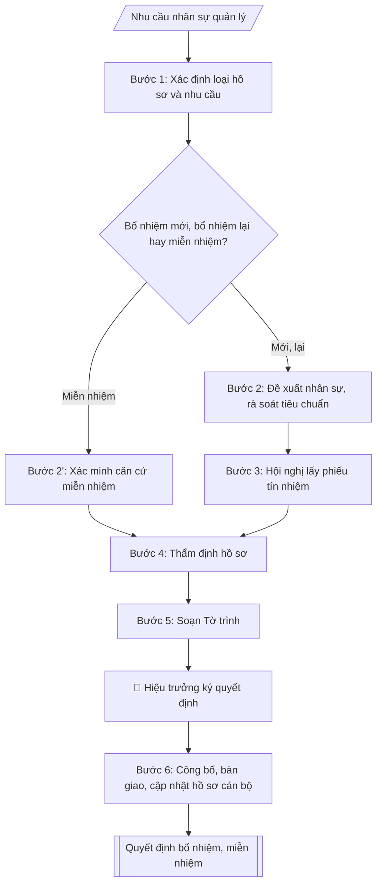

# Tư liệu lịch sử – không phải quy trình hiện hành

Nội dung từ phiên bản nguồn trước 1.1.0, giữ để đối chiếu dữ liệu đầu vào và thay đổi; căn cứ, điều kiện, mẫu và ví dụ có thể đã lỗi thời. Không dùng để thực hiện nghiệp vụ hiện tại.

## Khi nào dùng
Khi Nhà trường cần bổ nhiệm mới, bổ nhiệm lại (hết nhiệm kỳ) hoặc miễn nhiệm cán bộ lãnh đạo, quản lý
(Trưởng/Phó trưởng khoa, phòng, ban, trung tâm và tương đương): cần checklist các bước theo quy định
công tác cán bộ và soạn đầy đủ bộ hồ sơ gồm Tờ trình, Biên bản hội nghị lấy phiếu tín nhiệm,
Biên bản kiểm phiếu và Quyết định bổ nhiệm / bổ nhiệm lại / miễn nhiệm.

## Đầu vào (Input)

| Trường | Mô tả | Bắt buộc |
|---|---|---|
| `loai_ho_so` | Bổ nhiệm mới / Bổ nhiệm lại / Miễn nhiệm | Có |
| `ho_ten` | Họ tên, học hàm/học vị của nhân sự (giả lập khi mô phỏng) | Có |
| `chuc_vu_du_kien` | Chức vụ dự kiến bổ nhiệm / đang giữ (VD: Trưởng khoa, Phó Trưởng phòng) | Có |
| `don_vi` | Đơn vị công tác (khoa/phòng/trung tâm) | Có |
| `nhiem_ky` | Thời hạn bổ nhiệm (thường 05 năm; bổ nhiệm lại theo nhiệm kỳ) | Có (trừ miễn nhiệm) |
| `tieu_chuan` | Tóm tắt quá trình công tác, trình độ, phẩm chất đáp ứng tiêu chuẩn chức vụ | Có (bổ nhiệm/bổ nhiệm lại) |
| `ly_do_mien_nhiem` | Lý do miễn nhiệm (nguyện vọng cá nhân / hết nhiệm kỳ không bổ nhiệm lại / vi phạm...) | Có (nếu miễn nhiệm) |
| `ket_qua_phieu` | Kết quả phiếu tín nhiệm: số phiếu đồng ý / tổng số (nếu đã tổ chức lấy phiếu) | Không |
| `nguoi_ky` | Hiệu trưởng (người có thẩm quyền bổ nhiệm) | Có |

## Quy trình

**Bước 1. Xác định loại hồ sơ và nhu cầu nhân sự**
- Làm gì: tiếp nhận nhu cầu kiện toàn cán bộ quản lý (khuyết chức danh, sắp hết nhiệm kỳ, đơn xin thôi giữ chức vụ); xác định thuộc trường hợp nào: Bổ nhiệm mới / Bổ nhiệm lại / Miễn nhiệm; tra cứu thời hạn — bổ nhiệm lại phải triển khai trước khi hết nhiệm kỳ (thường 90 ngày).
- Dùng input: `loai_ho_so`, `chuc_vu_du_kien`, `don_vi`, `nhiem_ky` (trừ miễn nhiệm), `ly_do_mien_nhiem` (nếu miễn nhiệm).
- Vai trò: Chuyên viên Phòng TCCB · AI hỗ trợ: phân tích input, xác định yêu cầu · ⏱ ~20–45 phút (ước tính)
- Lưu ý nghiệp vụ: phân biệt đúng loại hồ sơ ngay từ đầu — miễn nhiệm do hết nhiệm kỳ khác miễn nhiệm do vi phạm (ảnh hưởng phương án bố trí công tác tiếp theo và thời điểm thôi hưởng phụ cấp chức vụ).
- → Kết quả bước: phiếu xác định loại hồ sơ + mốc thời gian phải hoàn thành.

**Bước 2. Đề xuất nhân sự và rà soát tiêu chuẩn** (bổ nhiệm mới / bổ nhiệm lại)
- Làm gì: tiếp nhận đề xuất của đơn vị hoặc lập danh sách nhân sự dự kiến; rà soát tiêu chuẩn, điều kiện của chức danh: trình độ đào tạo, thâm niên công tác, độ tuổi, quy hoạch cán bộ; đối chiếu quá trình công tác, phẩm chất, năng lực với tiêu chuẩn chức vụ; loại nhân sự không đủ điều kiện kèm lý do cụ thể. Đối với bổ nhiệm lại: yêu cầu cá nhân làm bản tự kiểm điểm nhiệm kỳ và kết quả đánh giá nhiệm kỳ của đơn vị.
- Dùng input: `ho_ten`, `chuc_vu_du_kien`, `don_vi`, `tieu_chuan`.
- Lưu ý nghiệp vụ: nhân sự đang trong thời gian thi hành kỷ luật không đưa vào danh sách đề xuất; tiêu chuẩn chức danh lấy theo quy định công tác cán bộ của trường, không tự đặt thêm tiêu chí.
- → Kết quả bước: danh sách nhân sự đủ tiêu chuẩn + bảng đối chiếu tiêu chuẩn (đạt/không đạt từng tiêu chí).

**Bước 2'. Xác minh căn cứ miễn nhiệm** (trường hợp miễn nhiệm — thay cho Bước 2)
- Làm gì: thu thập căn cứ miễn nhiệm: đơn xin thôi giữ chức vụ của cá nhân; hoặc kết luận không đủ tiêu chuẩn, vi phạm kỷ luật; hoặc văn bản về việc hết nhiệm kỳ không bổ nhiệm lại; đối chiếu với căn cứ miễn nhiệm theo quy định; dự kiến phương án bố trí công tác tiếp theo (nếu có).
- Dùng input: `ho_ten`, `chuc_vu_du_kien`, `don_vi`, `ly_do_mien_nhiem`.
- Vai trò: Chuyên viên Phòng TCCB (Trưởng phòng kiểm tra lại) · AI hỗ trợ: quét lỗi theo checklist · ⏱ ~15–30 phút (ước tính)
- Lưu ý nghiệp vụ: miễn nhiệm do vi phạm phải có kết luận xử lý kỷ luật kèm theo; phương án bố trí tiếp theo quyết định việc giải quyết phụ cấp chức vụ và vị trí việc làm mới.
- → Kết quả bước: biên bản xác minh căn cứ miễn nhiệm + dự thảo phương án bố trí công tác.

**Bước 3. Tổ chức lấy phiếu tín nhiệm**
- Làm gì: tổ chức hội nghị tập thể lãnh đạo đơn vị và hội nghị cán bộ chủ chốt lấy phiếu tín nhiệm đối với nhân sự dự kiến; lập danh sách cử tri; phát – thu – kiểm phiếu; lập Biên bản hội nghị và Biên bản kiểm phiếu (ghi rõ: tổng số phiếu phát ra, thu về, hợp lệ; số phiếu đồng ý và tỷ lệ %).
- Dùng input: `ho_ten`, `chuc_vu_du_kien`, `don_vi`, `ket_qua_phieu` (nếu đã tổ chức lấy phiếu trước đó).
- Vai trò: Tập thể lãnh đạo trường · AI hỗ trợ: chuẩn bị tài liệu, dự thảo biên bản/báo cáo · ⏱ ~1–3 giờ (ước tính)
- Lưu ý nghiệp vụ: nếu đã có kết quả phiếu hợp lệ thì dùng luôn, không tổ chức lại; tỷ lệ phiếu đồng ý là căn cứ chính để quyết định có trình bổ nhiệm; miễn nhiệm theo nguyện vọng cá nhân không bắt buộc lấy phiếu tín nhiệm.
- → Kết quả bước: Biên bản hội nghị + Biên bản kiểm phiếu tín nhiệm.

**Bước 4. Thẩm định hồ sơ**
- Làm gì: tổng hợp hồ sơ nhân sự: sơ yếu lý lịch, bản kê khai tài sản, thu nhập (nếu thuộc diện kê khai), nhận xét của chi bộ nơi công tác, kết quả phiếu tín nhiệm, bản tự kiểm điểm nhiệm kỳ (trường hợp bổ nhiệm lại); báo cáo Ban Giám hiệu / Đảng ủy đối với nhân sự thuộc diện quản lý.
- Dùng input: `ho_ten`, `tieu_chuan`, `ket_qua_phieu`.
- Vai trò: Chuyên viên Phòng TCCB (Trưởng phòng kiểm tra lại) · AI hỗ trợ: xử lý sơ bộ theo quy trình · ⏱ ~15–30 phút (ước tính)
- Lưu ý nghiệp vụ: thiếu một trong các giấy tờ bắt buộc thì trả về bổ sung, chưa trình Tờ trình; nhận xét của chi bộ phải còn trong thời hạn hiệu lực (thường 06 tháng).
- → Kết quả bước: bộ hồ sơ nhân sự đầy đủ + báo cáo thẩm định (đạt/không đạt, lý do).

**Bước 5. Soạn Tờ trình**
- Làm gì: soạn Tờ trình đề nghị Hiệu trưởng theo thể thức: nêu sự cần thiết; tóm tắt tiêu chuẩn, quá trình công tác của nhân sự; quá trình thực hiện (hội nghị, phiếu tín nhiệm, kết quả); đề nghị cụ thể: họ tên, chức vụ, đơn vị, thời hạn nhiệm kỳ (trường hợp miễn nhiệm: nêu lý do, căn cứ và phương án bố trí tiếp theo).
- Dùng input: `loai_ho_so`, `ho_ten`, `chuc_vu_du_kien`, `don_vi`, `nhiem_ky`, `tieu_chuan`, `ly_do_mien_nhiem`, `ket_qua_phieu`.
- Vai trò: Chuyên viên Phòng TCCB · AI hỗ trợ: soạn dự thảo đúng thể thức · ⏱ ~20–45 phút (ước tính)
- Lưu ý nghiệp vụ: nhiệm kỳ ghi rõ "05 năm kể từ ngày..." hoặc "từ ngày – đến ngày"; trường hợp miễn nhiệm ghi rõ thời điểm thôi giữ chức vụ và thôi hưởng phụ cấp chức vụ.
- → Kết quả bước: dự thảo Tờ trình.

**Bước 6. Công bố quyết định và cập nhật hồ sơ**
- Làm gì: tiếp nhận quyết định đã được Hiệu trưởng ký; tổ chức công bố quyết định và bàn giao công việc; cập nhật hồ sơ cán bộ, sổ theo dõi bổ nhiệm; thông báo các đơn vị liên quan.
- Dùng input: `nguoi_ky` và toàn bộ hồ sơ đã thẩm định ở các bước trước.
- Vai trò: Văn thư Phòng TCCB · AI hỗ trợ: định dạng bản chính, cập nhật sổ phát hành · ⏱ ~30 phút (ước tính)
- Lưu ý nghiệp vụ: quyết định bổ nhiệm lại phải được ký trước ngày hết nhiệm kỳ; quyết định miễn nhiệm đồng thời giải quyết chế độ phụ cấp chức vụ.
- → Kết quả bước: quyết định đã ban hành + biên bản bàn giao + hồ sơ cán bộ đã cập nhật (sản phẩm cuối cùng của skill).

## Luồng quy trình (Workflow)



## Đầu ra (Output)
- Bộ hồ sơ bổ nhiệm gồm: (1) Tờ trình đề nghị bổ nhiệm/bổ nhiệm lại/miễn nhiệm; (2) Biên bản hội nghị
  lấy phiếu tín nhiệm; (3) Biên bản kiểm phiếu tín nhiệm; (4) Quyết định bổ nhiệm/bổ nhiệm lại/miễn nhiệm.
- Checklist quy trình (đánh dấu hoàn thành từng bước).

**Cấu trúc output chuẩn** (áp dụng cho từng văn bản trong bộ hồ sơ):
- *Tờ trình:* 1. Quốc hiệu – Tiêu ngữ; 2. Tên cơ quan, số/ký hiệu tờ trình; 3. Địa danh, ngày tháng;
  4. Tên loại "TỜ TRÌNH" + trích yếu; 5. Kính gửi (Hiệu trưởng); 6. Phần căn cứ; 7. Nội dung trình:
  sự cần thiết, nhân sự đề nghị (họ tên, học hàm/học vị, quá trình công tác, tiêu chuẩn đáp ứng),
  quá trình thực hiện (hội nghị, phiếu tín nhiệm, kết quả), đề nghị cụ thể (chức vụ, đơn vị, nhiệm kỳ);
  8. Nơi nhận; 9. Chữ ký người có thẩm quyền.
- *Biên bản kiểm phiếu tín nhiệm:* 1. Tên cơ quan/đơn vị; 2. Tên loại "BIÊN BẢN KIỂM PHIẾU TÍN NHIỆM"
  + trích yếu; 3. Thời gian, địa điểm kiểm phiếu; 4. Thành phần Ban kiểm phiếu; 5. Nội dung kiểm phiếu
  (phiếu phát ra / thu về / hợp lệ; phiếu đồng ý, không đồng ý và tỷ lệ %); 6. Chữ ký các thành viên
  Ban kiểm phiếu.
- *Quyết định:* 1. Quốc hiệu – Tiêu ngữ; 2. Tên cơ quan, số/ký hiệu; 3. Địa danh, ngày tháng;
  4. Tên loại "QUYẾT ĐỊNH" + trích yếu; 5. Người ban hành (Hiệu trưởng); 6. Phần "Căn cứ...";
  7. Phần "Xét..."; 8. Nội dung "QUYẾT ĐỊNH:": Điều 1 (bổ nhiệm/bổ nhiệm lại/miễn nhiệm — họ tên,
  học hàm/học vị, chức vụ, đơn vị, thời hạn nhiệm kỳ), Điều 2 (phụ cấp chức vụ), Điều 3 (trách nhiệm
  thi hành); 9. Nơi nhận; 10. Chữ ký.

## Checklist nghiệm thu

Tiêu chí đạt: tất cả các ô dưới đây được đánh dấu.

- [ ] Đủ các phần theo Cấu trúc output chuẩn: Tên loại "TỜ TRÌNH" + trích yếu; 5. Kính gửi (Hiệu trưởng); 6. Phần…; Nơi nhận; 9. Chữ ký người có thẩm quyền. + trích yếu; 3. Thời gian,…; Tên loại "QUYẾT ĐỊNH" + trích yếu; 5. Người ban hành (Hiệu trưởng);…; Phần "Xét..."; 8. Nội dung "QUYẾT ĐỊNH:": Điều 1 (bổ nhiệm/bổ nhiệm…
- [ ] Nội dung và số liệu trong output khớp đúng với Input đã cho (không thêm, bớt hay suy diễn)
- [ ] Không bịa đặt số liệu, minh chứng, trích dẫn hay căn cứ
- [ ] Đúng thể thức và định dạng theo Nghị định 115/2020/NĐ-CP về tuyển dụng, sử dụng và quản lý viên chứ…
- [ ] Căn cứ pháp lý được trích dẫn đầy đủ và còn hiệu lực
- [ ] Đã qua Human gate: người có thẩm quyền đã kiểm tra/duyệt trước khi phát hành
- [ ] Miễn nhiệm do vi phạm phải có kết luận xử lý kỷ luật kèm theo
- [ ] Miễn nhiệm theo nguyện vọng cá nhân không bắt buộc lấy phiếu tín nhiệm
- [ ] Thiếu một trong các giấy tờ bắt buộc thì trả về bổ sung, chưa trình Tờ trình

## Ví dụ mô phỏng (dữ liệu giả lập)

> Tất cả tên trường, cá nhân, số liệu dưới đây đều là **giả lập**, không liên quan tổ chức/cá nhân có thật.

### Input mẫu

| Trường | Giá trị |
|---|---|
| `loai_ho_so` | Bổ nhiệm mới |
| `ho_ten` | TS. Trần Văn D |
| `chuc_vu_du_kien` | Phó Trưởng khoa |
| `don_vi` | Khoa Công nghệ thông tin |
| `nhiem_ky` | 05 năm (2026 – 2031) |
| `tieu_chuan` | Tiến sĩ Khoa học máy tính; 08 năm giảng dạy; Trưởng bộ môn 03 năm; đảng viên; có 12 bài báo khoa học; hoàn thành xuất sắc nhiệm vụ 3 năm liên tục |
| `ket_qua_phieu` | 28/30 phiếu đồng ý (93,3%) tại hội nghị cán bộ chủ chốt Khoa CNTT ngày 02/10/2026 |

### Output mẫu

**1) Tờ trình đề nghị bổ nhiệm:**

```
TRƯỜNG ĐẠI HỌC A            CỘNG HÒA XÃ HỘI CHỦ NGHĨA VIỆT NAM
PHÒNG TỔ CHỨC – CÁN BỘ                   Độc lập – Tự do – Hạnh phúc
      Số: 58/TTr-ĐHA-TCCB
                                                 Thành phố C, ngày 06 tháng 10 năm 2026

TỜ TRÌNH
Về việc đề nghị bổ nhiệm Phó Trưởng khoa Công nghệ thông tin

Kính gửi: Hiệu trưởng Trường Đại học A

Căn cứ quy định về công tác cán bộ của Trường Đại học A;
Căn cứ nhu cầu kiện toàn cán bộ lãnh đạo Khoa Công nghệ thông tin,
Phòng Tổ chức – Cán bộ kính trình Hiệu trưởng xem xét, quyết định việc
bổ nhiệm cán bộ như sau:

1. Sự cần thiết: Khoa Công nghệ thông tin hiện khuyết 01 Phó Trưởng khoa
phụ trách đào tạo; cần kiện toàn để bảo đảm công tác quản lý, điều hành
của Khoa.

2. Nhân sự đề nghị: ông Trần Văn D, sinh năm 1985 (giả lập), Tiến sĩ
Khoa học máy tính, giảng viên chính, hiện là Trưởng Bộ môn Kỹ thuật phần mềm,
Khoa Công nghệ thông tin; đảng viên; có 08 năm công tác giảng dạy, 03 năm
giữ chức vụ Trưởng bộ môn; có 12 bài báo khoa học đã công bố; 03 năm liên tục
hoàn thành xuất sắc nhiệm vụ; đáp ứng đầy đủ tiêu chuẩn chức danh Phó Trưởng khoa.

3. Quá trình thực hiện: ngày 02/10/2026, Khoa Công nghệ thông tin đã tổ chức
Hội nghị cán bộ chủ chốt lấy phiếu tín nhiệm; kết quả: 28/30 phiếu đồng ý
(đạt 93,3%).

Phòng Tổ chức – Cán bộ kính đề nghị Hiệu trưởng xem xét, quyết định bổ nhiệm
ông Trần Văn D giữ chức vụ Phó Trưởng khoa Công nghệ thông tin, nhiệm kỳ
05 năm (2026 – 2031), hưởng phụ cấp chức vụ theo quy định./.

Nơi nhận:                                  KT. HIỆU TRƯỞNG
- Như trên;                                TRƯỞNG PHÒNG TỔ CHỨC – CÁN BỘ
- Lưu: VT, TCCB.                                        [CHỜ KÝ]

                                                ThS. Đỗ Thị A
```

**2) Biên bản kiểm phiếu tín nhiệm (trích):**

```
TRƯỜNG ĐẠI HỌC A
KHOA CÔNG NGHỆ THÔNG TIN

BIÊN BẢN KIỂM PHIẾU TÍN NHIỆM
(Về việc bổ nhiệm Phó Trưởng khoa Công nghệ thông tin)

Hôm nay, ngày 02 tháng 10 năm 2026, tại Hội nghị cán bộ chủ chốt Khoa Công nghệ
thông tin, Ban kiểm phiếu gồm:
1. Bà Bùi Thị A – Trưởng ban;
2. Ông Nguyễn Văn C – Ủy viên;
3. Bà Hoàng Thị B – Thư ký (tên giả lập),
đã tiến hành kiểm phiếu tín nhiệm đối với ông Trần Văn D – nhân sự dự kiến
bổ nhiệm Phó Trưởng khoa, nhiệm kỳ 2026 – 2031.

Kết quả kiểm phiếu:
- Tổng số phiếu phát ra: 30 phiếu; thu về: 30 phiếu (hợp lệ: 30).
- Số phiếu đồng ý: 28 phiếu (đạt 93,3%).
- Số phiếu không đồng ý: 02 phiếu.

Biên bản được lập thành 03 bản, các thành viên Ban kiểm phiếu cùng ký tên./.

                                     TM. BAN KIỂM PHIẾU
                                          TRƯỞNG BAN
                                            [CHỜ KÝ]

                                       Bùi Thị A
```

**3) Quyết định bổ nhiệm:**

```
TRƯỜNG ĐẠI HỌC A            CỘNG HÒA XÃ HỘI CHỦ NGHĨA VIỆT NAM
                                         Độc lập – Tự do – Hạnh phúc
      Số: 250/QĐ-ĐHA-TCCB
                                                 Thành phố C, ngày 09 tháng 10 năm 2026

QUYẾT ĐỊNH
Về việc bổ nhiệm Phó Trưởng khoa Công nghệ thông tin

HIỆU TRƯỞNG TRƯỜNG ĐẠI HỌC A

Căn cứ quy định về công tác cán bộ của Trường Đại học A;
Căn cứ Tờ trình số 58/TTr-ĐHA-TCCB ngày 06/10/2026 của Phòng Tổ chức – Cán bộ;
Xét phẩm chất, năng lực của ông Trần Văn D,

QUYẾT ĐỊNH:

Điều 1. Bổ nhiệm ông Trần Văn D, Tiến sĩ Khoa học máy tính, giảng viên chính,
Trưởng Bộ môn Kỹ thuật phần mềm, giữ chức vụ Phó Trưởng khoa Công nghệ thông tin,
Trường Đại học A, nhiệm kỳ 05 năm kể từ ngày 09/10/2026.

Điều 2. Ông Trần Văn D được hưởng phụ cấp chức vụ lãnh đạo theo quy định hiện hành.

Điều 3. Trưởng phòng Tổ chức – Cán bộ, Trưởng khoa Công nghệ thông tin và
ông Trần Văn D chịu trách nhiệm thi hành Quyết định này./.

Nơi nhận:                                         HIỆU TRƯỞNG
- Như Điều 3;                                              [CHỜ KÝ]
- Lưu: VT, TCCB, hồ sơ CB.
                                              PGS.TS. Trần Văn B
```

### Checklist quy trình (output kèm theo — trường hợp bổ nhiệm mới)
- [x] Bước 1: Xác định loại hồ sơ và nhu cầu nhân sự
- [x] Bước 2: Đề xuất nhân sự, rà soát tiêu chuẩn chức danh
- [x] Bước 3: Hội nghị lấy phiếu tín nhiệm (biên bản hội nghị + biên bản kiểm phiếu)
- [x] Bước 4: Thẩm định hồ sơ (lý lịch, nhận xét chi bộ, kết quả phiếu)
- [x] Bước 5: Tờ trình đề nghị bổ nhiệm
- [x] Bước 6: Quyết định bổ nhiệm (ghi rõ nhiệm kỳ, phụ cấp chức vụ); công bố, bàn giao; cập nhật hồ sơ cán bộ

## Căn cứ & lưu ý
- Nghị định 115/2020/NĐ-CP về tuyển dụng, sử dụng và quản lý viên chức (quản lý, sử dụng viên chức giữ chức vụ quản lý).
- Quy định về công tác cán bộ của Nhà trường / cơ quan chủ quản và Quy định của Đảng về công tác cán bộ
  (quy trình 5 bước giới thiệu, lấy phiếu tín nhiệm đối với nhân sự thuộc diện Đảng ủy quản lý).
- Nghị định 30/2020/NĐ-CP về thể thức văn bản (tờ trình, biên bản, quyết định).
- Lưu ý: bổ nhiệm lại phải thực hiện trước khi hết nhiệm kỳ (thường 90 ngày); miễn nhiệm đồng thời
  giải quyết phụ cấp chức vụ và bố trí công tác tiếp theo.
- Không dùng tên thật của trường/cá nhân khi mô phỏng; mọi số liệu trong ví dụ đều giả lập.
