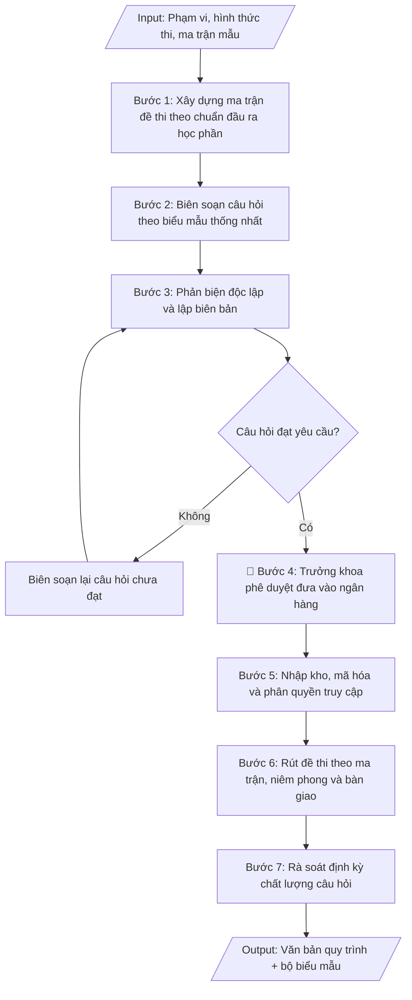

# Quy trình xây dựng ngân hàng đề thi

## Định dạng và file đầu ra
Định dạng đầu ra có thể chọn theo sản phẩm/yêu cầu: .docx, .pdf. Đọc mục “Định dạng bổ sung” trong quy cách đầu ra trước khi chọn.

**Phải tạo file thực tế để tải xuống, không chỉ trả nội dung trong chat.** Định dạng mặc định của skill: **.docx**. Nếu có bảng số liệu nghiệp vụ yêu cầu file bảng tính riêng, tạo thêm Excel theo yêu cầu; không tự tạo file kiểm tra. Không chờ người dùng yêu cầu xuất file lần nữa. Ưu tiên định dạng người dùng chỉ định; đọc quy tắc xuất file tại references/quy-cach-dau-ra.md.

## Quy cách đầu ra và thông tin thiếu
Khi dựng file Word/Excel, áp dụng mục “Thể thức và bảng biểu khi dựng file” trong quy cách đầu ra (cỡ chữ từng thành phần, bảng nhiều trang, số trang, phụ lục). Đọc [quy cách và cấu trúc sản phẩm](references/quy-cach-dau-ra.md) trước khi soạn/xuất. File giao chỉ gồm sản phẩm nghiệp vụ được yêu cầu; kiểm tra nội bộ không xuất kèm. Thiếu thông tin thì giữ nguyên trường/mục và chỗ điền theo mẫu gốc (dòng dấu chấm, dấu gạch hoặc ô trống); không tự điền dữ liệu mẫu, số 0, mã chờ xác minh hay dòng chờ ký. Mẫu chuyên ngành còn áp dụng được ưu tiên về cấu trúc, mã biểu và người ký. Bản đầy đủ: [quy tắc chung](references/quy-tac-chung.md).

## Kiểm soát áp dụng và phê duyệt
Trước khi chạy, xác định `ngay_ap_dung`, `loai_hinh_truong`, `quy_che_noi_bo`, `nguon_du_lieu`, `nguoi_kiem_duyet`; chỉ hỏi thông tin liên quan nghiệp vụ, không dùng giá trị giả định thay dữ liệu bắt buộc. Đối chiếu căn cứ pháp lý với văn bản gốc, hiệu lực, điều khoản áp dụng và chuyển tiếp. Bản đầy đủ: [quy tắc chung](references/quy-tac-chung.md).

Nếu có cập nhật pháp lý dưới đây, đọc [căn cứ và điều kiện áp dụng](references/phap-ly.md) trước khi làm. Quy trình dưới đây giữ nghiệp vụ từ bản gốc; mọi viện dẫn văn bản, mẫu biểu, điều khoản phải theo căn cứ đã chọn trong phap-ly.md, không theo văn bản cũ.

## Giới hạn và human gate
AI hỗ trợ chuẩn bị và đối chiếu; cán bộ phụ trách kiểm tra dữ liệu/căn cứ, người có thẩm quyền duyệt và ký. Không đánh dấu đã ký, đã duyệt, đã công bố khi chưa có chứng cứ. Dữ liệu sinh viên, sức khỏe, nhân sự, tài chính chỉ dùng theo mục đích và phân quyền, che thông tin định danh khi dùng ví dụ (Luật 91/2025/QH15, hiệu lực 01/01/2026); không tải dữ liệu lên dịch vụ ngoài khi chưa có quyền. Bản đầy đủ: [quy tắc chung](references/quy-tac-chung.md).

## Khi nào dùng
Khi cần ban hành mới hoặc sửa đổi quy trình quản lý đề thi: từ khâu biên soạn câu hỏi,
phản biện, phê duyệt, lưu trữ bảo mật đến rút đề thi theo ma trận.

## Đầu vào (Input)
| Trường | Mô tả | Bắt buộc |
|---|---|---|
| `pham_vi` | Toàn trường / Khoa / Bộ môn | Có |
| `hinh_thuc_thi` | Trắc nghiệm / Tự luận / Vấn đáp / Thực hành / Kết hợp | Có |
| `ma_tran_mau` | Ma trận đề mẫu (tỷ lệ % theo mức độ nhận thức: Nhớ – Hiểu – Vận dụng – Vận dụng cao) | Không |
| `so_luong_muc_tieu` | Số câu hỏi mục tiêu cho mỗi học phần | Không (mặc định: gấp 3 lần số câu của 1 đề thi) |
| `don_vi_thuc_hien` | Phòng Khảo thí & ĐBCL phối hợp Khoa/Bộ môn | Không |

## Quy trình
**Ràng buộc pháp lý khi thực hiện** (trích references/phap-ly.md; đối chiếu toàn văn và hiệu lực tại ngày nghiệp vụ):
- Thông tư 56/2026/TT-BGDĐT, hiệu lực 07/07/2026: Yêu cầu khóa tuyển sinh, chương trình, ngày áp dụng và quy chế đào tạo nội bộ. Đối chiếu điều khoản chuyển tiếp trong toàn văn trước khi chọn quy tắc; không tự áp dụng quy định mới hồi tố cho mọi khóa. Không dùng điều/khoản, thang điểm hoặc điều kiện tốt nghiệp cũ như quy định hiện hành nếu chưa đối chiếu.
- Trước Bước 1: chọn căn cứ theo đối tượng, loại hình trường và chuyển tiếp; lập bảng văn bản / điều khoản / lý do áp dụng / bằng chứng. Thiếu văn bản gốc hoặc điều khoản thì ghi nhận nội bộ [CẦN XÁC MINH] (không đưa vào file giao), để trống phần tương ứng, chưa kết luận tuân thủ.
- Các con số, thời hạn, số điều, số mức xếp loại, hệ số và mẫu biểu nêu trong các bước dưới đây được giữ từ quy trình gốc (trước cập nhật pháp lý); chỉ dùng khi đã đối chiếu đúng với căn cứ đã chọn, khác thì theo căn cứ. Danh sách điểm cần đối chiếu: docs/DIEM_CAN_DOI_CHIEU_PHAP_LY.md.

**Bước 1. Xây dựng ma trận đề thi theo chuẩn đầu ra học phần**
- Làm gì: căn cứ chuẩn đầu ra học phần (CLO), lập ma trận phân bố câu hỏi theo 4 mức độ nhận thức:
  Nhớ – Hiểu – Vận dụng – Vận dụng cao. Tỷ lệ gợi ý: Nhớ 20% – Hiểu 30% – Vận dụng 30% – Vận dụng
  cao 20%; điều chỉnh theo đặc thù hình thức thi (trắc nghiệm/tự luận/vấn đáp/thực hành).
- Dùng input: `pham_vi`, `hinh_thuc_thi`, `ma_tran_mau`
- Vai trò: Bộ môn phụ trách học phần · AI hỗ trợ: lập ma trận mẫu theo CLO và 4 mức độ nhận thức · ⏱ ~2 giờ (ước tính)
- Lưu ý nghiệp vụ: mỗi CLO phải được phủ ít nhất một câu hỏi trong ma trận; ma trận phải được
  thống nhất trước khi biên soạn — không biên soạn rồi mới ép vào ma trận.
- → Kết quả bước: ma trận đề thi của học phần (bảng phân bố % theo CLO và mức độ nhận thức).

**Bước 2. Biên soạn câu hỏi theo biểu mẫu thống nhất**
- Làm gì: giảng viên phụ trách học phần biên soạn đủ số lượng câu hỏi mục tiêu (mặc định gấp 3 lần
  số câu của 1 đề thi) theo Phiếu biên soạn (Mẫu 01): nội dung câu hỏi, đáp án/thang điểm chi tiết,
  CLO tương ứng, mức độ nhận thức, thời gian làm bài dự kiến.
- Dùng input: `so_luong_muc_tieu`, `hinh_thuc_thi`
- Vai trò: Giảng viên phụ trách học phần · AI hỗ trợ: gợi ý cấu trúc câu hỏi theo ma trận, kiểm tra độ phủ CLO · ⏱ ~2–3 ngày (ước tính)
- Lưu ý nghiệp vụ: đáp án trắc nghiệm phải có 1 đáp án đúng rõ ràng, các phương án nhiễu phải hợp
  lý; thang điểm tự luận phải chi tiết đến từng ý; ghi đúng CLO và mức độ nhận thức của từng câu.
- → Kết quả bước: bộ câu hỏi biên soạn theo biểu mẫu thống nhất (đủ số lượng mục tiêu).

**Bước 3. Phản biện độc lập và lập biên bản**
- Làm gì: tổ phản biện (ít nhất 02 giảng viên không tham gia biên soạn) kiểm tra từng câu hỏi về:
  tính chính xác nội dung, độ rõ ràng của đề bài, tính đúng đắn của đáp án/thang điểm, độ phù hợp
  với ma trận; lập Biên bản phản biện (Mẫu 02) ghi nhận xét từng câu đạt/không đạt và lý do.
- Dùng input: `don_vi_thuc_hien`
- Vai trò: Tổ phản biện độc lập (≥02 giảng viên) · AI hỗ trợ: chuẩn bị checklist tiêu chí kiểm tra từng câu hỏi · ⏱ ~1–2 ngày (ước tính)
- Lưu ý nghiệp vụ: phản biện phải độc lập tuyệt đối với người biên soạn; câu hỏi không đạt thì
  trả về biên soạn lại, không tự sửa thay người biên soạn.
- → Kết quả bước: biên bản phản biện (đánh giá đạt/không đạt từng câu hỏi kèm lý do).

**Bước 4. Hiệu đính và phê duyệt đưa vào ngân hàng**
- Làm gì: trưởng bộ môn hiệu đính các câu hỏi theo ý kiến phản biện; trưởng khoa (hoặc trưởng
  phòng Khảo thí & ĐBCL theo phân cấp) phê duyệt đưa câu hỏi đạt yêu cầu vào ngân hàng đề thi.
  Đây là Human gate trước khi câu hỏi được nhập kho chính thức.
- Dùng input: `don_vi_thuc_hien`, `pham_vi`
- Vai trò: Trưởng bộ môn hiệu đính, Trưởng khoa phê duyệt · AI hỗ trợ: tổng hợp ý kiến phản biện để đối chiếu · ⏱ ~1 ngày (ước tính)
- Lưu ý nghiệp vụ: chỉ câu hỏi đã qua phản biện và hiệu đính mới được phê duyệt; ghi rõ người
  phê duyệt và ngày phê duyệt để truy xuất trách nhiệm.
- → Kết quả bước: bộ câu hỏi đã được phê duyệt, đủ điều kiện nhập ngân hàng.

**Bước 5. Nhập kho, mã hóa và phân quyền truy cập**
- Làm gì: nhập từng câu hỏi đã duyệt vào kho lưu trữ tập trung; mã hóa mỗi câu hỏi (mã học phần +
  mức độ nhận thức + số thứ tự); phân quyền truy cập theo vai trò (ai được xem, ai được rút đề,
  ai được quản trị).
- Dùng input: `don_vi_thuc_hien`
- Vai trò: Cán bộ đơn vị khảo thí · AI hỗ trợ: nhập và mã hóa câu hỏi (mã học phần + ...) · ⏱ ~2–3 giờ (ước tính)
- Lưu ý nghiệp vụ: đề thi là tài liệu mật — phân quyền tối thiểu (chỉ người có nhiệm vụ mới được
  truy cập); log mọi lượt truy cập, rút đề; không lưu bản sao ngoài kho tập trung.
- → Kết quả bước: ngân hàng câu hỏi đã mã hóa, lưu trữ tập trung, phân quyền theo vai trò.

**Bước 6. Rút đề thi theo ma trận, niêm phong và bàn giao**
- Làm gì: khi tổ chức thi, rút ngẫu nhiên câu hỏi từ ngân hàng đúng theo ma trận và tỷ lệ đã duyệt;
  in đề thi, niêm phong; bàn giao có biên bản (ghi vào Sổ theo dõi rút đề thi — Mẫu 03) cho đơn vị
  tổ chức thi theo quy trình bảo mật.
- Dùng input: `hinh_thuc_thi`
- Vai trò: Đơn vị khảo thí · AI hỗ trợ: chuẩn bị biên bản rút đề và bàn giao theo quy trình · ⏱ ~2 giờ (ước tính)
- Lưu ý nghiệp vụ: kiểm tra đề rút ra phủ đủ CLO và đúng tỷ lệ mức độ nhận thức trước khi niêm
  phong; nghiêm cấm sao chép, phát tán đề thi dưới mọi hình thức — quy định rõ chế tài vi phạm.
- → Kết quả bước: đề thi đã rút đúng ma trận, niêm phong, bàn giao có biên bản.

**Bước 7. Rà soát định kỳ chất lượng câu hỏi**
- Làm gì: sau mỗi học kỳ/năm, phân tích chất lượng câu hỏi đã dùng (độ khó, độ phân biệt qua kết
  quả thi); loại bỏ câu hỏi kém chất lượng, bổ sung câu hỏi mới; cập nhật ngân hàng (tối thiểu
  20% số câu hỏi mỗi năm).
- Dùng input: `pham_vi`
- Vai trò: Bộ môn phụ trách học phần · AI hỗ trợ: phân tích độ khó, độ phân biệt của câu hỏi đã dùng · ⏱ ~1–2 ngày (ước tính)
- Lưu ý nghiệp vụ: câu hỏi bị lộ hoặc có độ phân biệt kém phải loại ngay, không chờ kỳ rà soát;
  lưu lịch sử thay đổi ngân hàng để truy xuất.
- → Kết quả bước: báo cáo rà soát định kỳ + ngân hàng câu hỏi đã được cập nhật.

## Luồng quy trình (Workflow)

## Đầu ra
- Văn bản quy trình xây dựng và quản lý ngân hàng đề thi (hoàn chỉnh).
- Bộ biểu mẫu kèm theo: phiếu biên soạn câu hỏi, biên bản phản biện, sổ theo dõi rút đề thi.

File nghiệp vụ thực tế theo định dạng mặc định ở đầu skill hoặc định dạng người dùng yêu cầu, kèm liên kết tải trong phản hồi cuối.

Sản phẩm nghiệp vụ hoàn chỉnh theo [quy cách và cấu trúc](references/quy-cach-dau-ra.md), giữ các trường chưa có dữ liệu ở trạng thái trống. Không xuất kèm checklist/phụ lục kiểm tra đầu ra.

## Kiểm tra nội bộ trước khi giao
Các tiêu chí sau dùng để tự đối chiếu; không sao chép vào file xuất. Mục thiếu dữ liệu được để trống, không đánh dấu đã đạt hoặc đã duyệt.

- [ ] Đủ các phần và đúng bố cục theo cấu trúc tại references/quy-cach-dau-ra.md (không theo cấu trúc của bản gốc).
- [ ] Số liệu/nội dung trong output khớp với Input đã cho (phạm vi, hình thức thi, ma trận mẫu, số lượng mục tiêu, đơn vị thực hiện).
- [ ] Không bịa đặt số liệu, minh chứng, trích dẫn.
- [ ] Đúng thể thức văn bản hành chính của quy trình (ban hành kèm quyết định, có điều khoản đánh số).
- [ ] Căn cứ pháp lý đầy đủ, còn hiệu lực (văn bản hiện hành nêu tại phap-ly.md, quy chế tổ chức và hoạt động của trường).
- [ ] Đã qua Human gate: Trưởng khoa (hoặc Trưởng phòng Khảo thí & ĐBCL theo phân cấp) đã phê duyệt đưa câu hỏi đạt yêu cầu vào ngân hàng; ghi rõ người và ngày phê duyệt.
- [ ] Ma trận được thống nhất trước khi biên soạn; mỗi CLO được phủ ít nhất một câu hỏi; chỉ câu hỏi đã qua phản biện và hiệu đính mới được phê duyệt.
- [ ] Đáp án trắc nghiệm có 1 đáp án đúng rõ ràng, phương án nhiễu hợp lý; thang điểm tự luận chi tiết đến từng ý; ghi đúng CLO và mức độ nhận thức từng câu.
- [ ] Tổ phản biện độc lập tuyệt đối với người biên soạn; câu hỏi không đạt trả về biên soạn lại, không tự sửa thay người biên soạn.
- [ ] Đề thi được rút ngẫu nhiên đúng ma trận, phủ đủ CLO và đúng tỷ lệ mức độ nhận thức trước khi niêm phong; phân quyền truy cập tối thiểu, log mọi lượt truy cập/rút đề, không lưu bản sao ngoài kho tập trung; quy định rõ chế tài vi phạm bảo mật.

## Căn cứ & lưu ý
- Căn cứ hiện hành: xem [căn cứ và điều kiện áp dụng](references/phap-ly.md); phải đối chiếu văn bản gốc, hiệu lực và chuyển tiếp tại ngày nghiệp vụ.
- Quy chế tổ chức và hoạt động của Trường Đại học A (giả lập).
- Đề thi là tài liệu mật: quy trình phải quy định rõ trách nhiệm bảo mật và chế tài vi phạm.
- Không dùng tên thật của trường/cá nhân khi mô phỏng.

## Tư liệu đối chiếu
Bản gốc trước cập nhật pháp lý (kèm ví dụ giả lập) lưu tại `references/quy-trinh-lich-su.md`, chỉ để đối chiếu hồ sơ lịch sử; không dùng căn cứ, mẫu hay số liệu trong đó làm chỉ dẫn hiện hành.

## Quản trị phiên bản
- Phiên bản gói `1.3.2` (cập nhật 2026-10-10); hồ sơ đầy đủ tại [references/version.json](references/version.json).
- Người phê duyệt nghiệp vụ: **chưa chỉ định**. Trạng thái: dự thảo nghiệp vụ; kiểm tra pháp lý trước thực thi. Ngày cập nhật không đồng nghĩa mọi văn bản đã được rà soát toàn văn.
- Giấy phép theo LICENSE của kho (bản quyền CES Global). Lịch sử thay đổi: CHANGELOG.md.
