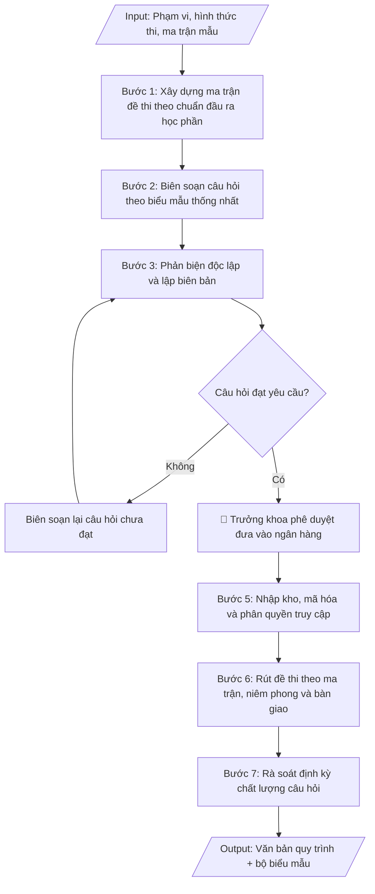

# Tư liệu lịch sử – không phải quy trình hiện hành

Nội dung từ phiên bản nguồn trước 1.1.0, giữ để đối chiếu dữ liệu đầu vào và thay đổi; căn cứ, điều kiện, mẫu và ví dụ có thể đã lỗi thời. Không dùng để thực hiện nghiệp vụ hiện tại.

## Khi nào dùng
Khi cần ban hành mới hoặc sửa đổi quy trình quản lý đề thi: từ khâu biên soạn câu hỏi,
phản biện, phê duyệt, lưu trữ bảo mật đến rút đề thi theo ma trận.

## Đầu vào (Input)

| Trường | Mô tả | Bắt buộc |
|---|---|---|
| `pham_vi` | Toàn trường / Khoa / Bộ môn | Có |
| `hinh_thuc_thi` | Trắc nghiệm / Tự luận / Vấn đáp / Thực hành / Kết hợp | Có |
| `ma_tran_mau` | Ma trận đề mẫu (tỷ lệ % theo mức độ nhận thức: Nhớ – Hiểu – Vận dụng – Vận dụng cao) | Không |
| `so_luong_muc_tieu` | Số câu hỏi mục tiêu cho mỗi học phần | Không (mặc định: gấp 3 lần số câu của 1 đề thi) |
| `don_vi_thuc_hien` | Phòng Khảo thí & ĐBCL phối hợp Khoa/Bộ môn | Không |

## Quy trình

**Bước 1. Xây dựng ma trận đề thi theo chuẩn đầu ra học phần**
- Làm gì: căn cứ chuẩn đầu ra học phần (CLO), lập ma trận phân bố câu hỏi theo 4 mức độ nhận thức:
  Nhớ – Hiểu – Vận dụng – Vận dụng cao. Tỷ lệ gợi ý: Nhớ 20% – Hiểu 30% – Vận dụng 30% – Vận dụng
  cao 20%; điều chỉnh theo đặc thù hình thức thi (trắc nghiệm/tự luận/vấn đáp/thực hành).
- Dùng input: `pham_vi`, `hinh_thuc_thi`, `ma_tran_mau`
- Vai trò: Bộ môn phụ trách học phần · AI hỗ trợ: lập ma trận mẫu theo CLO và 4 mức độ nhận thức · ⏱ ~2 giờ (ước tính)
- Lưu ý nghiệp vụ: mỗi CLO phải được phủ ít nhất một câu hỏi trong ma trận; ma trận phải được
  thống nhất trước khi biên soạn — không biên soạn rồi mới ép vào ma trận.
- → Kết quả bước: ma trận đề thi của học phần (bảng phân bố % theo CLO và mức độ nhận thức).

**Bước 2. Biên soạn câu hỏi theo biểu mẫu thống nhất**
- Làm gì: giảng viên phụ trách học phần biên soạn đủ số lượng câu hỏi mục tiêu (mặc định gấp 3 lần
  số câu của 1 đề thi) theo Phiếu biên soạn (Mẫu 01): nội dung câu hỏi, đáp án/thang điểm chi tiết,
  CLO tương ứng, mức độ nhận thức, thời gian làm bài dự kiến.
- Dùng input: `so_luong_muc_tieu`, `hinh_thuc_thi`
- Vai trò: Giảng viên phụ trách học phần · AI hỗ trợ: gợi ý cấu trúc câu hỏi theo ma trận, kiểm tra độ phủ CLO · ⏱ ~2–3 ngày (ước tính)
- Lưu ý nghiệp vụ: đáp án trắc nghiệm phải có 1 đáp án đúng rõ ràng, các phương án nhiễu phải hợp
  lý; thang điểm tự luận phải chi tiết đến từng ý; ghi đúng CLO và mức độ nhận thức của từng câu.
- → Kết quả bước: bộ câu hỏi biên soạn theo biểu mẫu thống nhất (đủ số lượng mục tiêu).

**Bước 3. Phản biện độc lập và lập biên bản**
- Làm gì: tổ phản biện (ít nhất 02 giảng viên không tham gia biên soạn) kiểm tra từng câu hỏi về:
  tính chính xác nội dung, độ rõ ràng của đề bài, tính đúng đắn của đáp án/thang điểm, độ phù hợp
  với ma trận; lập Biên bản phản biện (Mẫu 02) ghi nhận xét từng câu đạt/không đạt và lý do.
- Dùng input: `don_vi_thuc_hien`
- Vai trò: Tổ phản biện độc lập (≥02 giảng viên) · AI hỗ trợ: chuẩn bị checklist tiêu chí kiểm tra từng câu hỏi · ⏱ ~1–2 ngày (ước tính)
- Lưu ý nghiệp vụ: phản biện phải độc lập tuyệt đối với người biên soạn; câu hỏi không đạt thì
  trả về biên soạn lại, không tự sửa thay người biên soạn.
- → Kết quả bước: biên bản phản biện (đánh giá đạt/không đạt từng câu hỏi kèm lý do).

**Bước 4. Hiệu đính và phê duyệt đưa vào ngân hàng**
- Làm gì: trưởng bộ môn hiệu đính các câu hỏi theo ý kiến phản biện; trưởng khoa (hoặc trưởng
  phòng Khảo thí & ĐBCL theo phân cấp) phê duyệt đưa câu hỏi đạt yêu cầu vào ngân hàng đề thi.
  Đây là Human gate trước khi câu hỏi được nhập kho chính thức.
- Dùng input: `don_vi_thuc_hien`, `pham_vi`
- Vai trò: Trưởng bộ môn hiệu đính, Trưởng khoa phê duyệt · AI hỗ trợ: tổng hợp ý kiến phản biện để đối chiếu · ⏱ ~1 ngày (ước tính)
- Lưu ý nghiệp vụ: chỉ câu hỏi đã qua phản biện và hiệu đính mới được phê duyệt; ghi rõ người
  phê duyệt và ngày phê duyệt để truy xuất trách nhiệm.
- → Kết quả bước: bộ câu hỏi đã được phê duyệt, đủ điều kiện nhập ngân hàng.

**Bước 5. Nhập kho, mã hóa và phân quyền truy cập**
- Làm gì: nhập từng câu hỏi đã duyệt vào kho lưu trữ tập trung; mã hóa mỗi câu hỏi (mã học phần +
  mức độ nhận thức + số thứ tự); phân quyền truy cập theo vai trò (ai được xem, ai được rút đề,
  ai được quản trị).
- Dùng input: `don_vi_thuc_hien`
- Vai trò: Cán bộ đơn vị khảo thí · AI hỗ trợ: nhập và mã hóa câu hỏi (mã học phần + ...) · ⏱ ~2–3 giờ (ước tính)
- Lưu ý nghiệp vụ: đề thi là tài liệu mật — phân quyền tối thiểu (chỉ người có nhiệm vụ mới được
  truy cập); log mọi lượt truy cập, rút đề; không lưu bản sao ngoài kho tập trung.
- → Kết quả bước: ngân hàng câu hỏi đã mã hóa, lưu trữ tập trung, phân quyền theo vai trò.

**Bước 6. Rút đề thi theo ma trận, niêm phong và bàn giao**
- Làm gì: khi tổ chức thi, rút ngẫu nhiên câu hỏi từ ngân hàng đúng theo ma trận và tỷ lệ đã duyệt;
  in đề thi, niêm phong; bàn giao có biên bản (ghi vào Sổ theo dõi rút đề thi — Mẫu 03) cho đơn vị
  tổ chức thi theo quy trình bảo mật.
- Dùng input: `hinh_thuc_thi`
- Vai trò: Đơn vị khảo thí · AI hỗ trợ: chuẩn bị biên bản rút đề và bàn giao theo quy trình · ⏱ ~2 giờ (ước tính)
- Lưu ý nghiệp vụ: kiểm tra đề rút ra phủ đủ CLO và đúng tỷ lệ mức độ nhận thức trước khi niêm
  phong; nghiêm cấm sao chép, phát tán đề thi dưới mọi hình thức — quy định rõ chế tài vi phạm.
- → Kết quả bước: đề thi đã rút đúng ma trận, niêm phong, bàn giao có biên bản.

**Bước 7. Rà soát định kỳ chất lượng câu hỏi**
- Làm gì: sau mỗi học kỳ/năm, phân tích chất lượng câu hỏi đã dùng (độ khó, độ phân biệt qua kết
  quả thi); loại bỏ câu hỏi kém chất lượng, bổ sung câu hỏi mới; cập nhật ngân hàng (tối thiểu
  20% số câu hỏi mỗi năm).
- Dùng input: `pham_vi`
- Vai trò: Bộ môn phụ trách học phần · AI hỗ trợ: phân tích độ khó, độ phân biệt của câu hỏi đã dùng · ⏱ ~1–2 ngày (ước tính)
- Lưu ý nghiệp vụ: câu hỏi bị lộ hoặc có độ phân biệt kém phải loại ngay, không chờ kỳ rà soát;
  lưu lịch sử thay đổi ngân hàng để truy xuất.
- → Kết quả bước: báo cáo rà soát định kỳ + ngân hàng câu hỏi đã được cập nhật.

## Luồng quy trình (Workflow)


## Đầu ra (Output)
- Văn bản quy trình xây dựng và quản lý ngân hàng đề thi (hoàn chỉnh).
- Bộ biểu mẫu kèm theo: phiếu biên soạn câu hỏi, biên bản phản biện, sổ theo dõi rút đề thi.

**Cấu trúc output chuẩn:** khung mẫu cố định của văn bản quy trình xây dựng và quản lý ngân hàng
đề thi, các phần theo đúng thứ tự:
1. Tên quy trình + quyết định ban hành kèm theo (số, ngày ban hành, chức danh người ký).
2. Các điều khoản theo đúng trình tự vòng đời câu hỏi: Điều 1. Ma trận đề thi (phân bố theo CLO
   và 4 mức độ nhận thức); Điều 2. Biên soạn câu hỏi (biểu mẫu, nội dung bắt buộc của phiếu);
   Điều 3. Phản biện độc lập (thành phần tổ phản biện, nội dung kiểm tra, biên bản; câu hỏi
   không đạt phải biên soạn lại); Điều 4. Phê duyệt và lưu trữ (hiệu đính, phê duyệt, mã hóa,
   lưu trữ tập trung, phân quyền truy cập); Điều 5. Rút đề và bảo mật (rút ngẫu nhiên theo ma
   trận, niêm phong, bàn giao có biên bản, chế tài vi phạm bảo mật); Điều 6. Rà soát định kỳ
   (phân tích chất lượng câu hỏi, loại bỏ/bổ sung, tỷ lệ cập nhật tối thiểu hằng năm).
3. Bộ biểu mẫu kèm theo: Mẫu 01 – Phiếu biên soạn câu hỏi; Mẫu 02 – Biên bản phản biện;
   Mẫu 03 – Sổ theo dõi rút đề thi.


## Checklist nghiệm thu
- [ ] Đủ các phần theo "Cấu trúc output chuẩn": tên quy trình + quyết định ban hành; Điều 1–6 theo đúng vòng đời câu hỏi (ma trận; biên soạn; phản biện; phê duyệt – lưu trữ; rút đề – bảo mật; rà soát định kỳ); bộ biểu mẫu (Mẫu 01 phiếu biên soạn, Mẫu 02 biên bản phản biện, Mẫu 03 sổ theo dõi rút đề).
- [ ] Số liệu/nội dung trong output khớp với Input đã cho (phạm vi, hình thức thi, ma trận mẫu, số lượng mục tiêu, đơn vị thực hiện).
- [ ] Không bịa đặt số liệu, minh chứng, trích dẫn.
- [ ] Đúng thể thức văn bản hành chính của quy trình (ban hành kèm quyết định, có điều khoản đánh số).
- [ ] Căn cứ pháp lý đầy đủ, còn hiệu lực (Thông tư 08/2021/TT-BGDĐT, quy chế tổ chức và hoạt động của trường).
- [ ] Đã qua Human gate: Trưởng khoa (hoặc Trưởng phòng Khảo thí & ĐBCL theo phân cấp) đã phê duyệt đưa câu hỏi đạt yêu cầu vào ngân hàng; ghi rõ người và ngày phê duyệt.
- [ ] Ma trận được thống nhất trước khi biên soạn; mỗi CLO được phủ ít nhất một câu hỏi; chỉ câu hỏi đã qua phản biện và hiệu đính mới được phê duyệt.
- [ ] Đáp án trắc nghiệm có 1 đáp án đúng rõ ràng, phương án nhiễu hợp lý; thang điểm tự luận chi tiết đến từng ý; ghi đúng CLO và mức độ nhận thức từng câu.
- [ ] Tổ phản biện độc lập tuyệt đối với người biên soạn; câu hỏi không đạt trả về biên soạn lại, không tự sửa thay người biên soạn.
- [ ] Đề thi được rút ngẫu nhiên đúng ma trận, phủ đủ CLO và đúng tỷ lệ mức độ nhận thức trước khi niêm phong; phân quyền truy cập tối thiểu, log mọi lượt truy cập/rút đề, không lưu bản sao ngoài kho tập trung; quy định rõ chế tài vi phạm bảo mật.
Tiêu chí đạt = tất cả các ô được đánh dấu.

## Ví dụ mô phỏng (dữ liệu giả lập)

> Tất cả tên trường, cá nhân, số liệu dưới đây đều là **giả lập**, không liên quan tổ chức/cá nhân có thật.

### Input mẫu

| Trường | Giá trị |
|---|---|
| `pham_vi` | Khoa Công nghệ thông tin |
| `hinh_thuc_thi` | Trắc nghiệm kết hợp tự luận |
| `so_luong_muc_tieu` | 150 câu trắc nghiệm + 20 câu tự luận cho học phần "Nhập môn lập trình" |
| `ma_tran_mau` | Nhớ 20% – Hiểu 30% – Vận dụng 30% – Vận dụng cao 20% |

### Output mẫu (trích quy trình)

```
QUY TRÌNH XÂY DỰNG VÀ QUẢN LÝ NGÂN HÀNG ĐỀ THI
(Ban hành kèm theo Quyết định số 45/QĐ-ĐHA-KTĐBCL ngày 09/10/2026
 của Hiệu trưởng Trường Đại học A)

Điều 1. Ma trận đề thi
Mỗi học phần xây dựng 01 ma trận đề thi theo chuẩn đầu ra học phần, phân bố:
Nhớ 20% – Hiểu 30% – Vận dụng 30% – Vận dụng cao 20%.

Điều 2. Biên soạn
Giảng viên phụ trách học phần biên soạn câu hỏi theo Phiếu biên soạn (Mẫu 01),
ghi rõ đáp án, thang điểm, CLO tương ứng và mức độ nhận thức.

Điều 3. Phản biện
Tổ phản biện gồm ít nhất 02 giảng viên độc lập kiểm tra và lập Biên bản
phản biện (Mẫu 02). Câu hỏi không đạt phải biên soạn lại.

Điều 4. Phê duyệt và lưu trữ
Trưởng bộ môn hiệu đính, Trưởng khoa phê duyệt; Phòng Khảo thí & ĐBCL mã hóa,
lưu trữ tập trung và phân quyền truy cập.

Điều 5. Rút đề và bảo mật
Đề thi được rút ngẫu nhiên theo ma trận, niêm phong và bàn giao có biên bản.
Nghiêm cấm sao chép, phát tán đề thi dưới mọi hình thức.

Điều 6. Rà soát định kỳ
Hằng năm, các bộ môn rà soát, cập nhật tối thiểu 20% số câu hỏi trong ngân hàng.
```

### Biểu mẫu kèm theo (mẫu rút gọn)

**Mẫu 01 – Phiếu biên soạn câu hỏi**

| Mục | Nội dung (ví dụ giả lập) |
|---|---|
| Học phần | Nhập môn lập trình (mã HP: CNTT101) |
| Người biên soạn | ThS. Phạm Văn B – Bộ môn Khoa học máy tính |
| Câu hỏi | Viết chương trình tính tổng các số chẵn từ 1 đến n (n nhập từ bàn phím) |
| Đáp án / thang điểm | Đúng thuật toán: 7 điểm; đúng cú pháp: 3 điểm |
| CLO tương ứng | CLO3 – Vận dụng cấu trúc điều khiển để giải bài toán |
| Mức độ nhận thức | Vận dụng |

## Căn cứ & lưu ý
- Quy chế đào tạo trình độ đại học (Thông tư 08/2021/TT-BGDĐT).
- Quy chế tổ chức và hoạt động của Trường Đại học A (giả lập).
- Đề thi là tài liệu mật: quy trình phải quy định rõ trách nhiệm bảo mật và chế tài vi phạm.
- Không dùng tên thật của trường/cá nhân khi mô phỏng.
