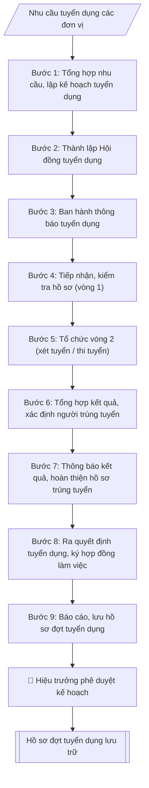

# Quy trình tuyển dụng viên chức

## Định dạng và file đầu ra
Định dạng đầu ra có thể chọn theo sản phẩm/yêu cầu: .docx, .pdf. Đọc mục “Định dạng bổ sung” trong quy cách đầu ra trước khi chọn.

**Phải tạo file thực tế để tải xuống, không chỉ trả nội dung trong chat.** Định dạng mặc định của skill: **.docx**. Nếu có bảng số liệu nghiệp vụ yêu cầu file bảng tính riêng, tạo thêm Excel theo yêu cầu; không tự tạo file kiểm tra. Không chờ người dùng yêu cầu xuất file lần nữa. Ưu tiên định dạng người dùng chỉ định; đọc quy tắc xuất file tại references/quy-cach-dau-ra.md.

## Quy cách đầu ra và thông tin thiếu
Đọc [quy cách và cấu trúc sản phẩm](references/quy-cach-dau-ra.md) trước khi soạn/xuất. File giao chỉ gồm sản phẩm nghiệp vụ được yêu cầu; kiểm tra nội bộ không xuất kèm. Thiếu thông tin thì giữ nguyên trường/mục và chỗ điền theo mẫu gốc (dòng dấu chấm, dấu gạch hoặc ô trống); không tự điền dữ liệu mẫu, số 0, mã chờ xác minh hay dòng chờ ký. Mẫu chuyên ngành còn áp dụng được ưu tiên về cấu trúc, mã biểu và người ký. Bản đầy đủ: [quy tắc chung](references/quy-tac-chung.md).

## Kiểm soát áp dụng và phê duyệt
Trước khi chạy, xác định `ngay_ap_dung`, `loai_hinh_truong`, `quy_che_noi_bo`, `nguon_du_lieu`, `nguoi_kiem_duyet`; chỉ hỏi thông tin liên quan nghiệp vụ, không dùng giá trị giả định thay dữ liệu bắt buộc. Đối chiếu căn cứ pháp lý với văn bản gốc, hiệu lực, điều khoản áp dụng và chuyển tiếp. Bản đầy đủ: [quy tắc chung](references/quy-tac-chung.md).

Nếu có cập nhật pháp lý dưới đây, đọc [căn cứ và điều kiện áp dụng](references/phap-ly.md) trước khi làm. Quy trình dưới đây giữ nghiệp vụ từ bản gốc; mọi viện dẫn văn bản, mẫu biểu, điều khoản phải theo căn cứ đã chọn trong phap-ly.md, không theo văn bản cũ.

## Giới hạn và human gate
AI hỗ trợ chuẩn bị và đối chiếu; cán bộ phụ trách kiểm tra dữ liệu/căn cứ, người có thẩm quyền duyệt và ký. Không đánh dấu đã ký, đã duyệt, đã công bố khi chưa có chứng cứ. Dữ liệu sinh viên, sức khỏe, nhân sự, tài chính chỉ dùng theo mục đích và phân quyền, che thông tin định danh khi dùng ví dụ (Luật 91/2025/QH15, hiệu lực 01/01/2026); không tải dữ liệu lên dịch vụ ngoài khi chưa có quyền. Bản đầy đủ: [quy tắc chung](references/quy-tac-chung.md).

## Khi nào dùng
Khi Nhà trường phát sinh nhu cầu tuyển mới viên chức (giảng viên, nghiên cứu viên, chuyên viên, kỹ thuật viên,
nhân viên) và cần triển khai trọn vẹn một đợt tuyển dụng đúng quy định: từ kế hoạch, thông báo, tiếp nhận hồ sơ,
tổ chức xét tuyển (vòng 1 kiểm tra điều kiện + vòng 2 thi/phỏng vấn), công nhận kết quả, đến quyết định tuyển dụng
và ký hợp đồng làm việc.

## Đầu vào (Input)
| Trường | Mô tả | Bắt buộc |
|---|---|---|
| `don_vi_de_xuat` | Đơn vị đề xuất tuyển (khoa/phòng/trung tâm) | Có |
| `vi_tri_tuyen` | Danh sách vị trí: tên vị trí việc làm + số lượng + chức danh nghề nghiệp (VD: Giảng viên hạng III – 05) | Có |
| `tieu_chuan` | Tiêu chuẩn, điều kiện từng vị trí: trình độ, ngành/chuyên ngành đào tạo, chứng chỉ (ngoại ngữ, tin học), kinh nghiệm | Có |
| `hinh_thuc_xet_tuyen` | Xét tuyển / Thi tuyển / Kết hợp (theo đề án vị trí việc làm) | Có |
| `noi_dung_vong2` | Nội dung vòng 2: phỏng vấn / thi viết / thực hành; thang điểm; điểm liệt | Có (nếu xét tuyển) |
| `thoi_gian_du_kien` | Mốc thời gian dự kiến: thông báo, nhận hồ sơ, xét tuyển, công nhận kết quả | Có |
| `hoi_dong_du_kien` | Thành phần dự kiến Hội đồng tuyển dụng (nếu đã có) | Không |
| `ke_hoach_nam` | Đợt tuyển dụng thuộc kế hoạch năm nào | Không (mặc định: năm hiện tại) |

## Quy trình
**Ràng buộc pháp lý khi thực hiện** (trích references/phap-ly.md; đối chiếu toàn văn và hiệu lực tại ngày nghiệp vụ):
- Luật 129/2025/QH15; Nghị định 259/2026/NĐ-CP; phạm vi: Viên chức đơn vị sự nghiệp công lập; kiểm tra chuyển tiếp và quy định riêng về nhà giáo: Cập nhật căn cứ tuyển dụng, hợp đồng làm việc, bổ nhiệm, điều động và đào tạo viên chức. Không tái sử dụng số điều hoặc mẫu phiếu của NĐ 115. Phải yêu cầu ngày tuyển dụng, ngày phê duyệt kế hoạch, loại hợp đồng, trạng thái hồ sơ và bản văn NĐ 259 để chọn điều khoản chuyển tiếp; không tự áp dụng điều22 Luật Viên chức2010. Các văn bản cũ chỉ là căn cứ lịch sử khi chuyển tiếp cho phép.
- Luật Nhà giáo; Nghị định 93/2026/NĐ-CP; khoản 9 Điều 62 NĐ 259/2026; phạm vi: Viên chức là nhà giáo: Thêm input đối tượng là nhà giáo hay viên chức khác. Nếu pháp luật nhà giáo có quy định khác về thẩm quyền, tiêu chuẩn, điều kiện, trình tự, thủ tục tuyển dụng/sử dụng/quản lý, áp dụng quy định nhà giáo và hướng dẫn Bộ GDĐT thay vì quy tắc chung NĐ 259.
- Trước Bước 1: chọn căn cứ theo đối tượng, loại hình trường và chuyển tiếp; lập bảng văn bản / điều khoản / lý do áp dụng / bằng chứng. Thiếu văn bản gốc hoặc điều khoản thì ghi nhận nội bộ [CẦN XÁC MINH] (không đưa vào file giao), để trống phần tương ứng, chưa kết luận tuân thủ.

**Bước 1. Tổng hợp nhu cầu, lập kế hoạch tuyển dụng**
- Làm gì: Phòng Tổ chức – Cán bộ tổng hợp đề xuất từ `don_vi_de_xuat`; đối chiếu `vi_tri_tuyen` với đề án vị trí việc làm và số lượng người làm việc được giao (không tuyển vượt chỉ tiêu); dự thảo Kế hoạch tuyển dụng gồm: số lượng, cơ cấu vị trí, `tieu_chuan`, `hinh_thuc_xet_tuyen`, kinh phí, tiến độ theo `thoi_gian_du_kien`; trình Hiệu trưởng phê duyệt.
- Dùng input: `don_vi_de_xuat`, `vi_tri_tuyen`, `tieu_chuan`, `hinh_thuc_xet_tuyen`, `thoi_gian_du_kien`, `ke_hoach_nam`.
- Vai trò: Chuyên viên Phòng TCCB · AI hỗ trợ: tổng hợp và chuẩn hóa dữ liệu · ⏱ ~20–45 phút (ước tính)
- Lưu ý nghiệp vụ: tiêu chuẩn từng vị trí phải phù hợp đề án vị trí việc làm — bẫy là đặt tiêu chuẩn cao hơn/quá thấp so với đề án; hình thức xét/thi tuyển phải đúng quy định tại văn bản hiện hành nêu tại phap-ly.md; kế hoạch chưa được phê duyệt thì không được ban hành thông báo.
- → Kết quả bước: Kế hoạch tuyển dụng đã được Hiệu trưởng phê duyệt.

**Bước 2. Thành lập Hội đồng tuyển dụng**
- Làm gì: tham mưu Hiệu trưởng ra quyết định thành lập Hội đồng tuyển dụng: Chủ tịch, Phó Chủ tịch, Ủy viên kiêm Thư ký, các ủy viên (căn cứ `hoi_dong_du_kien` nếu có); thành lập Ban kiểm tra, sát hạch; thành lập Ban giám sát (bắt buộc nếu thi tuyển).
- Dùng input: `hoi_dong_du_kien`, `hinh_thuc_xet_tuyen`.
- Vai trò: Hội đồng tuyển dụng · AI hỗ trợ: chuẩn bị tài liệu, dự thảo biên bản/báo cáo · ⏱ ~1–3 giờ (ước tính)
- Lưu ý nghiệp vụ: thành viên Hội đồng không được có người thân dự tuyển trong đợt — kiểm tra xung đột lợi ích; quyết định thành lập phải ban hành trước khi nhận hồ sơ.
- → Kết quả bước: Quyết định thành lập Hội đồng tuyển dụng + các ban giúp việc.

**Bước 3. Ban hành thông báo tuyển dụng**
- Làm gì: soạn Thông báo tuyển dụng theo skill `thong-bao-tuyen-dung` (vị trí, chỉ tiêu, tiêu chuẩn, hồ sơ, thời hạn, địa điểm, lệ phí, hình thức tuyển); Hiệu trưởng ký ban hành; đăng trên website trường, niêm yết tại trụ sở và các kênh truyền thông; thời gian nhận hồ sơ **ít nhất 30 ngày** kể từ ngày thông báo.
- Dùng input: `vi_tri_tuyen`, `tieu_chuan`, `hinh_thuc_xet_tuyen`, `thoi_gian_du_kien`.
- Vai trò: Văn thư Phòng TCCB · AI hỗ trợ: định dạng bản chính, cập nhật sổ phát hành · ⏱ ~30 phút (ước tính)
- Lưu ý nghiệp vụ: tổng chỉ tiêu trong thông báo phải khớp 100% kế hoạch đã duyệt; thời hạn nhận hồ sơ dưới 30 ngày là vi phạm quy định; lưu bằng chứng đăng tải (ảnh chụp web, biên bản niêm yết).
- → Kết quả bước: Thông báo tuyển dụng đã đăng công khai, đang trong thời gian nhận hồ sơ.

**Bước 4. Tiếp nhận, kiểm tra hồ sơ (vòng 1)**
- Làm gì: tiếp nhận Phiếu đăng ký dự tuyển (theo mẫu văn bản hiện hành nêu tại phap-ly.md) trong thời hạn thông báo; kiểm tra điều kiện, `tieu_chuan` của từng vị trí đối với từng hồ sơ; lập danh sách người đủ điều kiện / không đủ điều kiện (ghi rõ lý do loại); công khai danh sách và triệu tập người đủ điều kiện dự vòng 2.
- Dùng input: `tieu_chuan`, `vi_tri_tuyen`.
- Vai trò: Chuyên viên Phòng TCCB (Trưởng phòng kiểm tra lại) · AI hỗ trợ: quét lỗi theo checklist · ⏱ ~15–30 phút (ước tính)
- Lưu ý nghiệp vụ: không nhận hồ sơ nộp quá hạn dưới mọi hình thức; kiểm tra văn bằng, chứng chỉ đối chiếu đúng ngành/chuyên ngành yêu cầu — bẫy là bằng "tương đương" không đúng chuyên ngành; danh sách không đủ điều kiện phải nêu lý do cụ thể để giải quyết khiếu nại.
- → Kết quả bước: Danh sách vòng 1 (đủ / không đủ điều kiện) đã công khai.

**Bước 5. Tổ chức vòng 2 (xét tuyển / thi tuyển)**
- Làm gì: thực hiện theo phương án đã phê duyệt — *Xét tuyển*: phỏng vấn theo `noi_dung_vong2` (thang điểm 100, điểm liệt dưới 50); *Thi tuyển*: thi kiến thức chung, ngoại ngữ, tin học (vòng 1) + thi môn nghiệp vụ chuyên ngành (vòng 2); lập biên bản từng buổi thi/phỏng vấn; chấm theo đáp án, thang điểm đã duyệt; niêm phong bài thi (nếu thi viết).
- Dùng input: `hinh_thuc_xet_tuyen`, `noi_dung_vong2`.
- Vai trò: Phòng TCCB chủ trì, các đơn vị phối hợp · AI hỗ trợ: lập kế hoạch, phân công nhiệm vụ · ⏱ ~1–2 giờ (ước tính)
- Lưu ý nghiệp vụ: đề thi, đáp án, thang điểm phải được duyệt và niêm phong trước giờ thi; thành viên chấm thi ký xác nhận từng bài; thí sinh dưới điểm liệt bị loại ngay, không xét tiếp.
- → Kết quả bước: Biên bản vòng 2 + bảng điểm có xác nhận.

**Bước 6. Tổng hợp kết quả, xác định người trúng tuyển**
- Làm gì: tổng hợp điểm vòng 2, cộng điểm ưu tiên (nếu có) theo quy định; xếp hạng từ cao xuống thấp trong phạm vi chỉ tiêu từng vị trí; Hội đồng họp, lập biên bản và báo cáo Hiệu trưởng công nhận kết quả trúng tuyển.
- Dùng input: `vi_tri_tuyen` (chỉ tiêu từng vị trí), kết quả Bước 5.
- Vai trò: Chuyên viên Phòng TCCB · AI hỗ trợ: phân tích input, xác định yêu cầu · ⏱ ~20–45 phút (ước tính)
- Lưu ý nghiệp vụ: điểm ưu tiên chỉ cộng một lần theo mức cao nhất nếu thí sinh thuộc nhiều diện; trường hợp bằng điểm ở vị trí cuối cùng thì xét theo thứ tự ưu tiên quy định; số người trúng tuyển không vượt chỉ tiêu đã duyệt.
- → Kết quả bước: Báo cáo kết quả + Quyết định công nhận kết quả trúng tuyển (kèm danh sách).

**Bước 7. Thông báo kết quả, hoàn thiện hồ sơ trúng tuyển**
- Làm gì: thông báo công khai người trúng tuyển (website, niêm yết); hướng dẫn người trúng tuyển hoàn thiện hồ sơ trong thời hạn quy định: bản sao văn bằng, chứng chỉ, giấy khám sức khỏe, sơ yếu lý lịch...; kiểm tra, đối chiếu văn bằng gốc với bản sao đã nộp.
- Dùng input: (thực hiện trên danh sách trúng tuyển từ Bước 6).
- Vai trò: Chuyên viên Phòng TCCB (Trưởng phòng kiểm tra lại) · AI hỗ trợ: áp dụng góp ý, hoàn thiện bản thảo · ⏱ ~15–30 phút (ước tính)
- Lưu ý nghiệp vụ: đối chiếu văn bằng gốc là bắt buộc — phát hiện văn bằng giả thì hủy kết quả trúng tuyển; người trúng tuyển không hoàn thiện hồ sơ đúng hạn thì xét người kế tiếp theo thứ tự xếp hạng.
- → Kết quả bước: hồ sơ người trúng tuyển đã hoàn thiện, đối chiếu văn bằng gốc.

**Bước 8. Ra quyết định tuyển dụng, ký hợp đồng làm việc**
- Làm gì: tham mưu Hiệu trưởng ký Quyết định tuyển dụng từng người; ký Hợp đồng làm việc (xác định thời hạn lần đầu, thường 12–60 tháng) với người trúng tuyển; thực hiện chế độ tập sự nếu thuộc đối tượng tập sự theo quy định (phân công người hướng dẫn, đánh giá hết tập sự).
- Dùng input: (thực hiện trên hồ sơ đã hoàn thiện từ Bước 7).
- Vai trò: Hiệu trưởng (người ký) · AI hỗ trợ: chuẩn bị hồ sơ trình ký đầy đủ để xem xét nhanh · ⏱ ~0.5–1 ngày làm việc (ước tính)
- Lưu ý nghiệp vụ: quyết định tuyển dụng phải ban hành trước khi ký hợp đồng làm việc; nội dung hợp đồng ghi đúng vị trí việc làm, chức danh nghề nghiệp, đơn vị công tác, thời hạn.
- → Kết quả bước: Quyết định tuyển dụng + Hợp đồng làm việc đã ký.

**Bước 9. Báo cáo, lưu hồ sơ đợt tuyển dụng**
- Làm gì: báo cáo kết quả tuyển dụng về cơ quan quản lý cấp trên (nếu thuộc diện báo cáo); lưu toàn bộ hồ sơ đợt tuyển dụng tại Phòng Tổ chức – Cán bộ: kế hoạch, thông báo, hồ sơ dự tuyển, biên bản, quyết định, hợp đồng; hoàn thành checklist tiến độ 9 bước.
- Dùng input: (tổng hợp toàn bộ sản phẩm các bước 1–8).
- Vai trò: Chuyên viên Phòng TCCB · AI hỗ trợ: xử lý sơ bộ theo quy trình · ⏱ ~20–30 phút (ước tính)
- Lưu ý nghiệp vụ: hồ sơ tuyển dụng lưu trữ đầy đủ là căn cứ giải quyết khiếu nại, thanh tra sau này; phân loại hồ sơ người trúng tuyển (chuyển hồ sơ cán bộ) và hồ sơ người không trúng tuyển (lưu theo thời hạn).
- → Kết quả bước: hồ sơ đợt tuyển dụng lưu trữ đầy đủ + checklist 9 bước hoàn thành.

## Luồng quy trình (Workflow)

## Đầu ra
- Bộ hồ sơ tuyển dụng hoàn chỉnh gồm: (1) Kế hoạch tuyển dụng; (2) Quyết định thành lập Hội đồng;
  (3) Thông báo tuyển dụng; (4) Danh sách vòng 1 (đủ/không đủ điều kiện); (5) Biên bản vòng 2;
  (6) Báo cáo kết quả + Quyết định công nhận kết quả trúng tuyển; (7) Quyết định tuyển dụng từng người;
  (8) Hợp đồng làm việc.
- Checklist tiến độ 9 bước (đánh dấu hoàn thành từng bước).

**Cấu trúc output chuẩn:** khung mẫu cố định của bộ hồ sơ tuyển dụng — các văn bản xếp theo đúng trình tự phát sinh trong đợt tuyển dụng:
1. Kế hoạch tuyển dụng (đã được Hiệu trưởng phê duyệt);
2. Quyết định thành lập Hội đồng tuyển dụng (+ các ban giúp việc);
3. Thông báo tuyển dụng (đã đăng công khai, niêm yết);
4. Danh sách vòng 1: người đủ điều kiện / không đủ điều kiện (kèm lý do loại);
5. Biên bản vòng 2 + bảng điểm (có xác nhận);
6. Báo cáo kết quả + Quyết định công nhận kết quả trúng tuyển (kèm danh sách người trúng tuyển);
7. Quyết định tuyển dụng từng người;
8. Hợp đồng làm việc;
9. Checklist tiến độ 9 bước (đánh dấu hoàn thành từng bước).

File nghiệp vụ thực tế theo định dạng mặc định ở đầu skill hoặc định dạng người dùng yêu cầu, kèm liên kết tải trong phản hồi cuối.

Sản phẩm nghiệp vụ hoàn chỉnh theo [quy cách và cấu trúc](references/quy-cach-dau-ra.md), giữ các trường chưa có dữ liệu ở trạng thái trống. Không xuất kèm checklist/phụ lục kiểm tra đầu ra.

## Kiểm tra nội bộ trước khi giao
Các tiêu chí sau dùng để tự đối chiếu; không sao chép vào file xuất. Mục thiếu dữ liệu được để trống, không đánh dấu đã đạt hoặc đã duyệt.

- [ ] Đủ các phần theo Cấu trúc output chuẩn: Kế hoạch tuyển dụng (đã được Hiệu trưởng phê duyệt); Quyết định thành lập Hội đồng tuyển dụng (+ các ban giúp việc); Thông báo tuyển dụng (đã đăng công khai, niêm yết); Danh sách vòng 1: người đủ điều kiện / không đủ điều kiện (kèm lý d…; … (đủ 9 phần)
- [ ] Nội dung và số liệu trong output khớp đúng với Input đã cho (không thêm, bớt hay suy diễn)
- [ ] Không bịa đặt số liệu, minh chứng, trích dẫn hay căn cứ
- [ ] Đúng thể thức và cấu trúc theo references/quy-cach-dau-ra.md và căn cứ đã chọn tại references/phap-ly.md.
- [ ] Căn cứ pháp lý được trích dẫn đầy đủ và còn hiệu lực
- [ ] Đã qua Human gate: người có thẩm quyền đã kiểm tra/duyệt trước khi phát hành
- [ ] Tiêu chuẩn từng vị trí phải phù hợp đề án vị trí việc làm — bẫy là đặt tiêu chuẩn cao hơn/quá thấp so với đề án
- [ ] Hình thức xét/thi tuyển phải đúng quy định tại văn bản hiện hành nêu tại phap-ly.md
- [ ] Kế hoạch chưa được phê duyệt thì không được ban hành thông báo

## Căn cứ & lưu ý
- Căn cứ hiện hành: xem [căn cứ và điều kiện áp dụng](references/phap-ly.md); phải đối chiếu văn bản gốc, hiệu lực và chuyển tiếp tại ngày nghiệp vụ.
- Quy định về công tác cán bộ của Nhà trường / cơ quan chủ quản (phân cấp thẩm quyền tuyển dụng).
- Nghị định 30/2020/NĐ-CP về thể thức văn bản hành chính (kế hoạch, thông báo, quyết định).
- Không dùng tên thật của trường/cá nhân khi mô phỏng; số liệu ví dụ hoàn toàn giả lập.

## Tư liệu đối chiếu
Bản gốc trước cập nhật pháp lý (kèm ví dụ giả lập) lưu tại `references/quy-trinh-lich-su.md`, chỉ để đối chiếu hồ sơ lịch sử; không dùng căn cứ, mẫu hay số liệu trong đó làm chỉ dẫn hiện hành.

## Quản trị phiên bản
- Phiên bản gói `1.3.2` (cập nhật 2026-10-10); hồ sơ đầy đủ tại [references/version.json](references/version.json).
- Người phê duyệt nghiệp vụ: **chưa chỉ định**. Trạng thái: dự thảo nghiệp vụ; kiểm tra pháp lý trước thực thi. Ngày cập nhật không đồng nghĩa mọi văn bản đã được rà soát toàn văn.
- Giấy phép theo LICENSE của kho (bản quyền CES Global). Lịch sử thay đổi: CHANGELOG.md.
