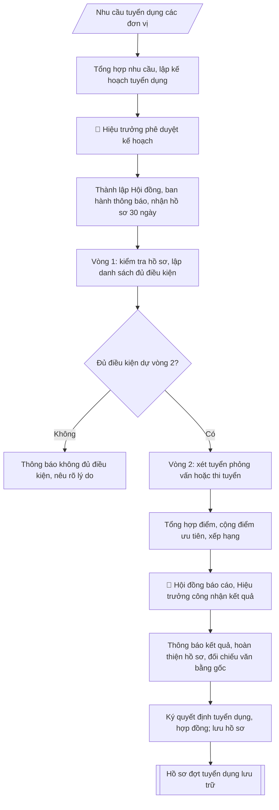

# Tư liệu lịch sử – không phải quy trình hiện hành

Nội dung từ phiên bản nguồn trước 1.1.0, giữ để đối chiếu dữ liệu đầu vào và thay đổi; căn cứ, điều kiện, mẫu và ví dụ có thể đã lỗi thời. Không dùng để thực hiện nghiệp vụ hiện tại.

## Khi nào dùng
Khi Nhà trường phát sinh nhu cầu tuyển mới viên chức (giảng viên, nghiên cứu viên, chuyên viên, kỹ thuật viên,
nhân viên) và cần triển khai trọn vẹn một đợt tuyển dụng đúng quy định: từ kế hoạch, thông báo, tiếp nhận hồ sơ,
tổ chức xét tuyển (vòng 1 kiểm tra điều kiện + vòng 2 thi/phỏng vấn), công nhận kết quả, đến quyết định tuyển dụng
và ký hợp đồng làm việc.

## Đầu vào (Input)

| Trường | Mô tả | Bắt buộc |
|---|---|---|
| `don_vi_de_xuat` | Đơn vị đề xuất tuyển (khoa/phòng/trung tâm) | Có |
| `vi_tri_tuyen` | Danh sách vị trí: tên vị trí việc làm + số lượng + chức danh nghề nghiệp (VD: Giảng viên hạng III – 05) | Có |
| `tieu_chuan` | Tiêu chuẩn, điều kiện từng vị trí: trình độ, ngành/chuyên ngành đào tạo, chứng chỉ (ngoại ngữ, tin học), kinh nghiệm | Có |
| `hinh_thuc_xet_tuyen` | Xét tuyển / Thi tuyển / Kết hợp (theo đề án vị trí việc làm) | Có |
| `noi_dung_vong2` | Nội dung vòng 2: phỏng vấn / thi viết / thực hành; thang điểm; điểm liệt | Có (nếu xét tuyển) |
| `thoi_gian_du_kien` | Mốc thời gian dự kiến: thông báo, nhận hồ sơ, xét tuyển, công nhận kết quả | Có |
| `hoi_dong_du_kien` | Thành phần dự kiến Hội đồng tuyển dụng (nếu đã có) | Không |
| `ke_hoach_nam` | Đợt tuyển dụng thuộc kế hoạch năm nào | Không (mặc định: năm hiện tại) |

## Quy trình

**Bước 1. Tổng hợp nhu cầu, lập kế hoạch tuyển dụng**
- Làm gì: Phòng Tổ chức – Cán bộ tổng hợp đề xuất từ `don_vi_de_xuat`; đối chiếu `vi_tri_tuyen` với đề án vị trí việc làm và số lượng người làm việc được giao (không tuyển vượt chỉ tiêu); dự thảo Kế hoạch tuyển dụng gồm: số lượng, cơ cấu vị trí, `tieu_chuan`, `hinh_thuc_xet_tuyen`, kinh phí, tiến độ theo `thoi_gian_du_kien`; trình Hiệu trưởng phê duyệt.
- Dùng input: `don_vi_de_xuat`, `vi_tri_tuyen`, `tieu_chuan`, `hinh_thuc_xet_tuyen`, `thoi_gian_du_kien`, `ke_hoach_nam`.
- Vai trò: Chuyên viên Phòng TCCB · AI hỗ trợ: tổng hợp và chuẩn hóa dữ liệu · ⏱ ~20–45 phút (ước tính)
- Lưu ý nghiệp vụ: tiêu chuẩn từng vị trí phải phù hợp đề án vị trí việc làm — bẫy là đặt tiêu chuẩn cao hơn/quá thấp so với đề án; hình thức xét/thi tuyển phải đúng quy định tại NĐ 115/2020; kế hoạch chưa được phê duyệt thì không được ban hành thông báo.
- → Kết quả bước: Kế hoạch tuyển dụng đã được Hiệu trưởng phê duyệt.

**Bước 2. Thành lập Hội đồng tuyển dụng**
- Làm gì: tham mưu Hiệu trưởng ra quyết định thành lập Hội đồng tuyển dụng: Chủ tịch, Phó Chủ tịch, Ủy viên kiêm Thư ký, các ủy viên (căn cứ `hoi_dong_du_kien` nếu có); thành lập Ban kiểm tra, sát hạch; thành lập Ban giám sát (bắt buộc nếu thi tuyển).
- Dùng input: `hoi_dong_du_kien`, `hinh_thuc_xet_tuyen`.
- Vai trò: Hội đồng tuyển dụng · AI hỗ trợ: chuẩn bị tài liệu, dự thảo biên bản/báo cáo · ⏱ ~1–3 giờ (ước tính)
- Lưu ý nghiệp vụ: thành viên Hội đồng không được có người thân dự tuyển trong đợt — kiểm tra xung đột lợi ích; quyết định thành lập phải ban hành trước khi nhận hồ sơ.
- → Kết quả bước: Quyết định thành lập Hội đồng tuyển dụng + các ban giúp việc.

**Bước 3. Ban hành thông báo tuyển dụng**
- Làm gì: soạn Thông báo tuyển dụng theo skill `thong-bao-tuyen-dung` (vị trí, chỉ tiêu, tiêu chuẩn, hồ sơ, thời hạn, địa điểm, lệ phí, hình thức tuyển); Hiệu trưởng ký ban hành; đăng trên website trường, niêm yết tại trụ sở và các kênh truyền thông; thời gian nhận hồ sơ **ít nhất 30 ngày** kể từ ngày thông báo.
- Dùng input: `vi_tri_tuyen`, `tieu_chuan`, `hinh_thuc_xet_tuyen`, `thoi_gian_du_kien`.
- Vai trò: Văn thư Phòng TCCB · AI hỗ trợ: định dạng bản chính, cập nhật sổ phát hành · ⏱ ~30 phút (ước tính)
- Lưu ý nghiệp vụ: tổng chỉ tiêu trong thông báo phải khớp 100% kế hoạch đã duyệt; thời hạn nhận hồ sơ dưới 30 ngày là vi phạm quy định; lưu bằng chứng đăng tải (ảnh chụp web, biên bản niêm yết).
- → Kết quả bước: Thông báo tuyển dụng đã đăng công khai, đang trong thời gian nhận hồ sơ.

**Bước 4. Tiếp nhận, kiểm tra hồ sơ (vòng 1)**
- Làm gì: tiếp nhận Phiếu đăng ký dự tuyển (theo mẫu NĐ 115/2020) trong thời hạn thông báo; kiểm tra điều kiện, `tieu_chuan` của từng vị trí đối với từng hồ sơ; lập danh sách người đủ điều kiện / không đủ điều kiện (ghi rõ lý do loại); công khai danh sách và triệu tập người đủ điều kiện dự vòng 2.
- Dùng input: `tieu_chuan`, `vi_tri_tuyen`.
- Vai trò: Chuyên viên Phòng TCCB (Trưởng phòng kiểm tra lại) · AI hỗ trợ: quét lỗi theo checklist · ⏱ ~15–30 phút (ước tính)
- Lưu ý nghiệp vụ: không nhận hồ sơ nộp quá hạn dưới mọi hình thức; kiểm tra văn bằng, chứng chỉ đối chiếu đúng ngành/chuyên ngành yêu cầu — bẫy là bằng "tương đương" không đúng chuyên ngành; danh sách không đủ điều kiện phải nêu lý do cụ thể để giải quyết khiếu nại.
- → Kết quả bước: Danh sách vòng 1 (đủ / không đủ điều kiện) đã công khai.

**Bước 5. Tổ chức vòng 2 (xét tuyển / thi tuyển)**
- Làm gì: thực hiện theo phương án đã phê duyệt — *Xét tuyển*: phỏng vấn theo `noi_dung_vong2` (thang điểm 100, điểm liệt dưới 50); *Thi tuyển*: thi kiến thức chung, ngoại ngữ, tin học (vòng 1) + thi môn nghiệp vụ chuyên ngành (vòng 2); lập biên bản từng buổi thi/phỏng vấn; chấm theo đáp án, thang điểm đã duyệt; niêm phong bài thi (nếu thi viết).
- Dùng input: `hinh_thuc_xet_tuyen`, `noi_dung_vong2`.
- Vai trò: Phòng TCCB chủ trì, các đơn vị phối hợp · AI hỗ trợ: lập kế hoạch, phân công nhiệm vụ · ⏱ ~1–2 giờ (ước tính)
- Lưu ý nghiệp vụ: đề thi, đáp án, thang điểm phải được duyệt và niêm phong trước giờ thi; thành viên chấm thi ký xác nhận từng bài; thí sinh dưới điểm liệt bị loại ngay, không xét tiếp.
- → Kết quả bước: Biên bản vòng 2 + bảng điểm có xác nhận.

**Bước 6. Tổng hợp kết quả, xác định người trúng tuyển**
- Làm gì: tổng hợp điểm vòng 2, cộng điểm ưu tiên (nếu có) theo quy định; xếp hạng từ cao xuống thấp trong phạm vi chỉ tiêu từng vị trí; Hội đồng họp, lập biên bản và báo cáo Hiệu trưởng công nhận kết quả trúng tuyển.
- Dùng input: `vi_tri_tuyen` (chỉ tiêu từng vị trí), kết quả Bước 5.
- Vai trò: Chuyên viên Phòng TCCB · AI hỗ trợ: phân tích input, xác định yêu cầu · ⏱ ~20–45 phút (ước tính)
- Lưu ý nghiệp vụ: điểm ưu tiên chỉ cộng một lần theo mức cao nhất nếu thí sinh thuộc nhiều diện; trường hợp bằng điểm ở vị trí cuối cùng thì xét theo thứ tự ưu tiên quy định; số người trúng tuyển không vượt chỉ tiêu đã duyệt.
- → Kết quả bước: Báo cáo kết quả + Quyết định công nhận kết quả trúng tuyển (kèm danh sách).

**Bước 7. Thông báo kết quả, hoàn thiện hồ sơ trúng tuyển**
- Làm gì: thông báo công khai người trúng tuyển (website, niêm yết); hướng dẫn người trúng tuyển hoàn thiện hồ sơ trong thời hạn quy định: bản sao văn bằng, chứng chỉ, giấy khám sức khỏe, sơ yếu lý lịch...; kiểm tra, đối chiếu văn bằng gốc với bản sao đã nộp.
- Dùng input: (thực hiện trên danh sách trúng tuyển từ Bước 6).
- Vai trò: Chuyên viên Phòng TCCB (Trưởng phòng kiểm tra lại) · AI hỗ trợ: áp dụng góp ý, hoàn thiện bản thảo · ⏱ ~15–30 phút (ước tính)
- Lưu ý nghiệp vụ: đối chiếu văn bằng gốc là bắt buộc — phát hiện văn bằng giả thì hủy kết quả trúng tuyển; người trúng tuyển không hoàn thiện hồ sơ đúng hạn thì xét người kế tiếp theo thứ tự xếp hạng.
- → Kết quả bước: hồ sơ người trúng tuyển đã hoàn thiện, đối chiếu văn bằng gốc.

**Bước 8. Ra quyết định tuyển dụng, ký hợp đồng làm việc**
- Làm gì: tham mưu Hiệu trưởng ký Quyết định tuyển dụng từng người; ký Hợp đồng làm việc (xác định thời hạn lần đầu, thường 12–60 tháng) với người trúng tuyển; thực hiện chế độ tập sự nếu thuộc đối tượng tập sự theo quy định (phân công người hướng dẫn, đánh giá hết tập sự).
- Dùng input: (thực hiện trên hồ sơ đã hoàn thiện từ Bước 7).
- Vai trò: Hiệu trưởng (người ký) · AI hỗ trợ: chuẩn bị hồ sơ trình ký đầy đủ để xem xét nhanh · ⏱ ~0.5–1 ngày làm việc (ước tính)
- Lưu ý nghiệp vụ: quyết định tuyển dụng phải ban hành trước khi ký hợp đồng làm việc; nội dung hợp đồng ghi đúng vị trí việc làm, chức danh nghề nghiệp, đơn vị công tác, thời hạn.
- → Kết quả bước: Quyết định tuyển dụng + Hợp đồng làm việc đã ký.

**Bước 9. Báo cáo, lưu hồ sơ đợt tuyển dụng**
- Làm gì: báo cáo kết quả tuyển dụng về cơ quan quản lý cấp trên (nếu thuộc diện báo cáo); lưu toàn bộ hồ sơ đợt tuyển dụng tại Phòng Tổ chức – Cán bộ: kế hoạch, thông báo, hồ sơ dự tuyển, biên bản, quyết định, hợp đồng; hoàn thành checklist tiến độ 9 bước.
- Dùng input: (tổng hợp toàn bộ sản phẩm các bước 1–8).
- Vai trò: Chuyên viên Phòng TCCB · AI hỗ trợ: xử lý sơ bộ theo quy trình · ⏱ ~20–30 phút (ước tính)
- Lưu ý nghiệp vụ: hồ sơ tuyển dụng lưu trữ đầy đủ là căn cứ giải quyết khiếu nại, thanh tra sau này; phân loại hồ sơ người trúng tuyển (chuyển hồ sơ cán bộ) và hồ sơ người không trúng tuyển (lưu theo thời hạn).
- → Kết quả bước: hồ sơ đợt tuyển dụng lưu trữ đầy đủ + checklist 9 bước hoàn thành.

## Luồng quy trình (Workflow)



## Đầu ra (Output)
- Bộ hồ sơ tuyển dụng hoàn chỉnh gồm: (1) Kế hoạch tuyển dụng; (2) Quyết định thành lập Hội đồng;
  (3) Thông báo tuyển dụng; (4) Danh sách vòng 1 (đủ/không đủ điều kiện); (5) Biên bản vòng 2;
  (6) Báo cáo kết quả + Quyết định công nhận kết quả trúng tuyển; (7) Quyết định tuyển dụng từng người;
  (8) Hợp đồng làm việc.
- Checklist tiến độ 9 bước (đánh dấu hoàn thành từng bước).

**Cấu trúc output chuẩn:** khung mẫu cố định của bộ hồ sơ tuyển dụng — các văn bản xếp theo đúng trình tự phát sinh trong đợt tuyển dụng:
1. Kế hoạch tuyển dụng (đã được Hiệu trưởng phê duyệt);
2. Quyết định thành lập Hội đồng tuyển dụng (+ các ban giúp việc);
3. Thông báo tuyển dụng (đã đăng công khai, niêm yết);
4. Danh sách vòng 1: người đủ điều kiện / không đủ điều kiện (kèm lý do loại);
5. Biên bản vòng 2 + bảng điểm (có xác nhận);
6. Báo cáo kết quả + Quyết định công nhận kết quả trúng tuyển (kèm danh sách người trúng tuyển);
7. Quyết định tuyển dụng từng người;
8. Hợp đồng làm việc;
9. Checklist tiến độ 9 bước (đánh dấu hoàn thành từng bước).

## Checklist nghiệm thu

Tiêu chí đạt: tất cả các ô dưới đây được đánh dấu.

- [ ] Đủ các phần theo Cấu trúc output chuẩn: Kế hoạch tuyển dụng (đã được Hiệu trưởng phê duyệt); Quyết định thành lập Hội đồng tuyển dụng (+ các ban giúp việc); Thông báo tuyển dụng (đã đăng công khai, niêm yết); Danh sách vòng 1: người đủ điều kiện / không đủ điều kiện (kèm lý d…; … (đủ 9 phần)
- [ ] Nội dung và số liệu trong output khớp đúng với Input đã cho (không thêm, bớt hay suy diễn)
- [ ] Không bịa đặt số liệu, minh chứng, trích dẫn hay căn cứ
- [ ] Đúng thể thức và định dạng theo Nghị định 115/2020/NĐ-CP về tuyển dụng, sử dụng và quản lý viên chứ…
- [ ] Căn cứ pháp lý được trích dẫn đầy đủ và còn hiệu lực
- [ ] Đã qua Human gate: người có thẩm quyền đã kiểm tra/duyệt trước khi phát hành
- [ ] Tiêu chuẩn từng vị trí phải phù hợp đề án vị trí việc làm — bẫy là đặt tiêu chuẩn cao hơn/quá thấp so với đề án
- [ ] Hình thức xét/thi tuyển phải đúng quy định tại NĐ 115/2020
- [ ] Kế hoạch chưa được phê duyệt thì không được ban hành thông báo

## Ví dụ mô phỏng (dữ liệu giả lập)

> Tất cả tên trường, cá nhân, số liệu dưới đây đều là **giả lập**, không liên quan tổ chức/cá nhân có thật.

### Input mẫu

| Trường | Giá trị |
|---|---|
| `don_vi_de_xuat` | Khoa Công nghệ thông tin; Phòng Đào tạo |
| `vi_tri_tuyen` | Giảng viên hạng III (mã V.07.01.03): 04 chỉ tiêu; Chuyên viên (mã 01.003): 01 chỉ tiêu |
| `tieu_chuan` | Giảng viên: Thạc sĩ trở lên đúng ngành CNTT/KHMT; chứng chỉ ngoại ngữ B1, tin học cơ bản; ưu tiên Tiến sĩ. Chuyên viên: Đại học trở lên ngành Quản lý giáo dục/Hành chính. |
| `hinh_thuc_xet_tuyen` | Xét tuyển (vòng 1 kiểm tra điều kiện + vòng 2 phỏng vấn) |
| `noi_dung_vong2` | Phỏng vấn 30 phút: kiến thức chuyên môn (40đ), kỹ năng sư phạm/xử lý tình huống (40đ), định hướng gắn bó (20đ); điểm liệt < 50/100 |
| `thoi_gian_du_kien` | Thông báo 10/10/2026 → nhận hồ sơ đến 10/11/2026 → vòng 2: 25–27/11/2026 → công nhận kết quả: 05/12/2026 |

### Output mẫu (trích các văn bản chính)

**1) Kế hoạch tuyển dụng (trích):**

```
TRƯỜNG ĐẠI HỌC A            CỘNG HÒA XÃ HỘI CHỦ NGHĨA VIỆT NAM
                                         Độc lập – Tự do – Hạnh phúc

KẾ HOẠCH
Tuyển dụng viên chức năm 2026

Căn cứ Nghị định số 115/2020/NĐ-CP ngày 25/9/2020 của Chính phủ quy định về
tuyển dụng, sử dụng và quản lý viên chức;
Căn cứ Đề án vị trí việc làm của Trường Đại học A đã được phê duyệt;
Theo đề nghị của Trưởng phòng Tổ chức – Cán bộ,

HIỆU TRƯỞNG TRƯỜNG ĐẠI HỌC A BAN HÀNH KẾ HOẠCH TUYỂN DỤNG
VIÊN CHỨC NĂM 2026 NHƯ SAU:

I. SỐ LƯỢNG, VỊ TRÍ TUYỂN DỤNG
1. Khoa Công nghệ thông tin: 04 Giảng viên hạng III (mã số V.07.01.03).
2. Phòng Đào tạo: 01 Chuyên viên (mã số 01.003).

II. TIÊU CHUẨN, ĐIỀU KIỆN
- Giảng viên: có bằng Thạc sĩ trở lên đúng ngành Công nghệ thông tin/Khoa học
  máy tính; chứng chỉ ngoại ngữ B1, chứng chỉ tin học cơ bản; ưu tiên Tiến sĩ,
  có công trình khoa học công bố.
- Chuyên viên: tốt nghiệp Đại học trở lên ngành Quản lý giáo dục, Hành chính học
  hoặc ngành phù hợp; thành thạo tin học văn phòng.

III. HÌNH THỨC TUYỂN DỤNG: Xét tuyển (vòng 1: kiểm tra điều kiện, tiêu chuẩn;
vòng 2: phỏng vấn, thang điểm 100, điểm liệt dưới 50).

IV. TIẾN ĐỘ THỰC HIỆN
- 10/10/2026: ban hành Thông báo tuyển dụng.
- 10/10 – 10/11/2026: tiếp nhận Phiếu đăng ký dự tuyển.
- 12 – 20/11/2026: kiểm tra điều kiện vòng 1, công bố danh sách.
- 25 – 27/11/2026: tổ chức phỏng vấn vòng 2.
- 05/12/2026: công nhận kết quả trúng tuyển.

V. KINH PHÍ: từ nguồn thu sự nghiệp của Trường theo quy định.

Nơi nhận:                                         HIỆU TRƯỞNG
- Các đơn vị (thực hiện);                                  [CHỜ KÝ]
- Lưu: VT, TCCB.
                                              PGS.TS. Trần Văn B
```

**2) Quyết định công nhận kết quả trúng tuyển (trích):**

```
TRƯỜNG ĐẠI HỌC A            CỘNG HÒA XÃ HỘI CHỦ NGHĨA VIỆT NAM
                                         Độc lập – Tự do – Hạnh phúc
      Số: 245/QĐ-ĐHA-TCCB
                                                 Thành phố C, ngày 05 tháng 12 năm 2026

QUYẾT ĐỊNH
Về việc công nhận kết quả trúng tuyển viên chức năm 2026

HIỆU TRƯỞNG TRƯỜNG ĐẠI HỌC A

Căn cứ Nghị định số 115/2020/NĐ-CP ngày 25/9/2020 của Chính phủ quy định về
tuyển dụng, sử dụng và quản lý viên chức;
Căn cứ Kế hoạch tuyển dụng viên chức năm 2026 của Trường;
Xét báo cáo kết quả xét tuyển của Hội đồng tuyển dụng viên chức năm 2026,

QUYẾT ĐỊNH:

Điều 1. Công nhận kết quả trúng tuyển viên chức năm 2026 của Trường Đại học
A đối với 05 người có tên trong danh sách kèm theo Quyết định này,
gồm: 04 Giảng viên hạng III (Khoa Công nghệ thông tin) và 01 Chuyên viên
(Phòng Đào tạo).

Điều 2. Giao Phòng Tổ chức – Cán bộ thông báo kết quả, hướng dẫn người trúng
tuyển hoàn thiện hồ sơ và tham mưu Hiệu trưởng ký quyết định tuyển dụng,
hợp đồng làm việc theo quy định.

Điều 3. Trưởng phòng Tổ chức – Cán bộ, Trưởng các đơn vị có liên quan và các
ông (bà) có tên tại Điều 1 chịu trách nhiệm thi hành Quyết định này./.

Nơi nhận:                                         HIỆU TRƯỞNG
- Như Điều 3;                                              [CHỜ KÝ]
- Lưu: VT, TCCB.
                                              PGS.TS. Trần Văn B

DANH SÁCH NGƯỜI TRÚNG TUYỂN (kèm theo Quyết định số 245/QĐ-ĐHA-TCCB)
1. TS. Trần Văn D – Giảng viên hạng III – Khoa CNTT – 92,5 điểm
2. ThS. Bùi Thị A – Giảng viên hạng III – Khoa CNTT – 88,0 điểm
3. ThS. Đỗ Thị A – Giảng viên hạng III – Khoa CNTT – 85,5 điểm
4. ThS. Nguyễn Văn C – Giảng viên hạng III – Khoa CNTT – 83,0 điểm
5. CN. Ngô Văn B – Chuyên viên – Phòng Đào tạo – 81,5 điểm
```

### Checklist tiến độ (output kèm theo)
- [x] Kế hoạch tuyển dụng được phê duyệt
- [x] Quyết định thành lập Hội đồng tuyển dụng
- [x] Thông báo tuyển dụng (đăng web + niêm yết, ≥ 30 ngày nhận hồ sơ)
- [x] Danh sách vòng 1 (đủ / không đủ điều kiện) đã công khai
- [x] Biên bản vòng 2 (phỏng vấn/thi) đầy đủ
- [x] Báo cáo kết quả + Quyết định công nhận trúng tuyển
- [x] Người trúng tuyển hoàn thiện hồ sơ (đối chiếu văn bằng gốc)
- [x] Quyết định tuyển dụng + Hợp đồng làm việc đã ký
- [x] Báo cáo cấp trên & lưu hồ sơ đợt tuyển dụng

## Căn cứ & lưu ý
- Nghị định 115/2020/NĐ-CP về tuyển dụng, sử dụng và quản lý viên chức (quy trình, điều kiện, điểm ưu tiên, thời hạn nhận hồ sơ).
- Quy định về công tác cán bộ của Nhà trường / cơ quan chủ quản (phân cấp thẩm quyền tuyển dụng).
- Nghị định 30/2020/NĐ-CP về thể thức văn bản hành chính (kế hoạch, thông báo, quyết định).
- Không dùng tên thật của trường/cá nhân khi mô phỏng; số liệu ví dụ hoàn toàn giả lập.
