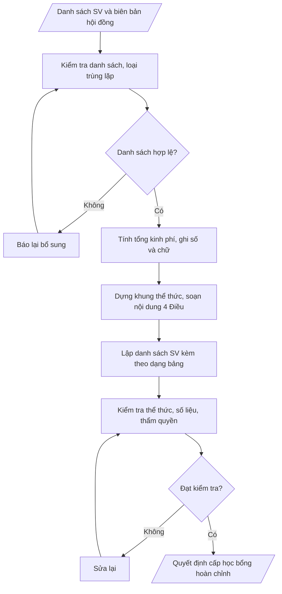

# Tư liệu lịch sử – không phải quy trình hiện hành

Nội dung từ phiên bản nguồn trước 1.1.0, giữ để đối chiếu dữ liệu đầu vào và thay đổi; căn cứ, điều kiện, mẫu và ví dụ có thể đã lỗi thời. Không dùng để thực hiện nghiệp vụ hiện tại.

## Khi nào dùng
Khi hội đồng xét học bổng (hoặc hội đồng xét miễn, giảm học phí) đã họp, thống nhất danh sách
sinh viên đủ điều kiện, cần ban hành quyết định của Hiệu trưởng để cấp học bổng khuyến khích học
tập, học bổng tài trợ, học bổng chính sách, hoặc miễn/giảm học phí, kèm danh sách sinh viên được
hưởng.

## Đầu vào (Input)

| Trường | Mô tả | Bắt buộc |
|---|---|---|
| `loai_quyet_dinh` | Cấp học bổng khuyến khích / Cấp học bổng tài trợ / Cấp học bổng chính sách / Miễn, giảm học phí | Có |
| `ten_dot` | Tên đợt xét (ví dụ: học kỳ 1, năm học 2026–2027) | Có |
| `danh_sach` | Danh sách sinh viên: họ tên, mã SV, lớp, khoa, mức học bổng hoặc mức miễn/giảm, ghi chú | Có |
| `can_cu` | Các văn bản căn cứ: quy chế học bổng, biên bản họp hội đồng, tờ trình của Phòng CTSV... | Có |
| `tong_kinh_phi` | Tổng kinh phí của đợt (số tiền bằng số và bằng chữ) | Có |
| `nguon_kinh_phi` | Nguồn kinh phí chi trả (ngân sách trường, quỹ tài trợ, ngân sách nhà nước...) | Có |
| `thoi_gian_ap_dung` | Học kỳ / năm học áp dụng quyết định | Có |
| `don_vi_thuc_hien` | Các đơn vị chịu trách nhiệm thi hành (Phòng CTSV, Phòng Tài chính, các khoa...) | Có |
| `nguoi_ky` | Hiệu trưởng | Có (mặc định: Hiệu trưởng) |

## Quy trình

**Bước 1. Kiểm tra và làm sạch danh sách đầu vào**
- Làm gì: kiểm tra từng sinh viên trong `danh_sach` phải có đủ họ tên, mã SV, lớp, khoa, mức học bổng hoặc mức miễn/giảm; loại bỏ trùng lặp (trùng mã SV); đối chiếu điều kiện từng sinh viên với biên bản họp hội đồng xét trong `can_cu`.
- Dùng input: `danh_sach`, `can_cu`.
- Vai trò: Chuyên viên Phòng Công tác sinh viên · AI hỗ trợ: đối chiếu và phát hiện lỗi danh sách · ⏱ ~1–2 giờ (ước tính)
- Lưu ý nghiệp vụ: trùng mã SV nhưng khác tên là dấu hiệu danh sách lỗi nguồn — phải xác minh lại với Phòng CTSV, không tự chọn một trong hai; sinh viên có trong danh sách nhưng không có trong biên bản hội đồng thì loại khỏi quyết định.
- → Kết quả bước: danh sách sinh viên đã làm sạch (đủ trường thông tin, không trùng lặp) + danh sách lỗi/loại kèm lý do.

**Bước 2. Tính tổng kinh phí và đối chiếu nguồn**
- Làm gì: cộng mức hưởng của từng sinh viên trong danh sách đã làm sạch; ghi tổng kinh phí bằng số và bằng chữ; đối chiếu với `tong_kinh_phi` đầu vào và `nguon_kinh_phi` đã được phê duyệt.
- Dùng input: `danh_sach`, `tong_kinh_phi`, `nguon_kinh_phi`.
- Vai trò: Chuyên viên Phòng Công tác sinh viên · AI hỗ trợ: tính tổng kinh phí, ghi bằng số và bằng chữ, đối chiếu nguồn · ⏱ ~15–30 phút (ước tính)
- Lưu ý nghiệp vụ: tổng cộng tay phải khớp `tong_kinh_phi` — nếu lệch dù 1 đồng cũng phải rà lại từng dòng, không tự điều chỉnh cho khớp; số tiền bằng chữ phải viết đúng chính tả tiếng Việt (ví dụ "Ba mươi sáu triệu đồng").
- → Kết quả bước: bảng tính tổng kinh phí (tổng số SV, tổng tiền bằng số, bằng chữ, nguồn kinh phí) đã đối chiếu khớp.

**Bước 3. Dựng khung thể thức quyết định**
- Làm gì: dựng khung theo Nghị định 30/2020/NĐ-CP: Quốc hiệu – Tiêu ngữ → tên cơ quan ban hành → số, ký hiệu → địa danh, ngày tháng năm → tiêu đề "QUYẾT ĐỊNH" → trích yếu → phần Căn cứ (liệt kê từ `can_cu`: quy chế học bổng, biên bản họp hội đồng, tờ trình của Phòng CTSV theo trình tự) → khung Nơi nhận → khối chữ ký Hiệu trưởng.
- Dùng input: `can_cu`, `nguoi_ky`.
- Vai trò: Chuyên viên Phòng Công tác sinh viên · AI hỗ trợ: dựng khung thể thức quyết định theo Nghị định 30/2020 · ⏱ ~30 phút (ước tính)
- Lưu ý nghiệp vụ: căn cứ phải viện dẫn theo trình tự từ văn bản quy phạm đến văn bản cụ thể của đợt xét; kiểm tra các văn bản căn cứ còn hiệu lực — căn cứ hết hiệu lực thì quyết định vô giá trị.
- → Kết quả bước: khung thể thức quyết định (đầy đủ yếu tố hình thức + phần căn cứ).

**Bước 4. Soạn nội dung 4 Điều**
- Làm gì: viết 4 Điều: Điều 1 quyết định nội dung chính — cấp học bổng / miễn, giảm học phí cho các sinh viên có tên trong danh sách kèm theo (ghi rõ tổng số sinh viên); Điều 2 mức hưởng, tổng kinh phí (số và chữ), nguồn kinh phí, thời gian áp dụng; Điều 3 hiệu lực thi hành (kể từ ngày ký); Điều 4 trách nhiệm thi hành của các đơn vị, cá nhân.
- Dùng input: `loai_quyet_dinh`, `ten_dot`, `tong_kinh_phi`, `nguon_kinh_phi`, `thoi_gian_ap_dung`, `don_vi_thuc_hien`, kết quả Bước 1–2.
- Vai trò: Chuyên viên Phòng Công tác sinh viên · AI hỗ trợ: soạn dự thảo nội dung 4 Điều · ⏱ ~30–45 phút (ước tính)
- Lưu ý nghiệp vụ: tổng số sinh viên ở Điều 1 phải bằng số dòng trong danh sách kèm theo; Điều 4 phải nêu tên đầy đủ các đơn vị trong `don_vi_thuc_hien` — thiếu đơn vị thì đơn vị đó không có trách nhiệm thi hành.
- → Kết quả bước: dự thảo nội dung 4 Điều của quyết định.

**Bước 5. Lập danh sách sinh viên kèm theo**
- Làm gì: lập bảng danh sách với các cột STT | Họ và tên | Mã SV | Lớp | Khoa | Mức học bổng (hoặc Mức miễn/giảm) | Ghi chú; đánh số thứ tự liên tục; sắp xếp theo khoa/lớp; thêm dòng tổng cộng cuối bảng (tổng số SV, tổng kinh phí).
- Dùng input: `danh_sach`.
- Vai trò: Chuyên viên Phòng Công tác sinh viên · AI hỗ trợ: lập bảng danh sách sinh viên, thêm dòng tổng cộng · ⏱ ~30 phút (ước tính)
- Lưu ý nghiệp vụ: tiêu đề danh sách phải ghi rõ "Kèm theo Quyết định số ... ngày ... của Hiệu trưởng" — danh sách không gắn với quyết định cụ thể thì không có giá trị pháp lý; mức hưởng từng sinh viên trong bảng phải khớp mức đã duyệt ở biên bản hội đồng.
- → Kết quả bước: bảng danh sách sinh viên kèm theo (có dòng tổng cộng).

**Bước 6. Kiểm tra chéo toàn văn**
- Làm gì: kiểm tra thể thức theo Nghị định 30/2020/NĐ-CP; số sinh viên ở Điều 1 khớp số dòng trong danh sách kèm theo; tổng kinh phí bằng số khớp bằng chữ và khớp tổng các mức trong bảng; thẩm quyền ký là Hiệu trưởng; nơi nhận đầy đủ.
- Dùng input: toàn bộ input + dự thảo (đối chiếu chéo).
- Vai trò: Chuyên viên Phòng Công tác sinh viên · AI hỗ trợ: kiểm tra chéo số liệu toàn văn · ⏱ ~30–60 phút (ước tính)
- Lưu ý nghiệp vụ: đây là điểm kiểm tra cuối trước khi trình ký — lỗi thường gặp nhất là tổng tiền bảng không khớp Điều 2 và số SV Điều 1 không khớp số dòng bảng; phát hiện lỗi thì quay lại bước tương ứng sửa, không sửa "cho qua".
- → Kết quả bước: checklist kiểm tra đã đánh dấu (thể thức, căn cứ, số liệu, thẩm quyền, nơi nhận).

**Bước 7. Xuất bản quyết định**
- Làm gì: hoàn thiện quyết định + danh sách kèm theo ở định dạng markdown, sẵn sàng trình Hiệu trưởng ký và ban hành.
- Dùng input: kết quả các Bước 1–6.
- Vai trò: Hiệu trưởng · AI hỗ trợ: chuẩn bị hồ sơ trình ký, nhắc lịch và theo dõi tiến độ · ⏱ ~1–2 ngày làm việc (ước tính)
- Lưu ý nghiệp vụ: sau khi ký, lưu hồ sơ quyết định và danh sách kèm theo tại Phòng CTSV; chuyển bản đến Phòng Tài chính – Kế toán để chi trả — quyết định ký mà không chuyển thì sinh viên không nhận được học bổng.
- → Kết quả bước: quyết định cấp học bổng / miễn giảm học phí hoàn chỉnh + danh sách kèm theo, sẵn sàng trình ký.

## Luồng quy trình (Workflow)


## Đầu ra (Output)
- Văn bản quyết định hoàn chỉnh (4 Điều).
- Danh sách sinh viên kèm theo dạng bảng (STT, họ tên, mã SV, lớp, khoa, mức hưởng).
- Checklist kiểm tra thể thức và số liệu.

**Cấu trúc output chuẩn:** khung mẫu cố định của sản phẩm chính — Quyết định cấp học bổng /
miễn giảm học phí, các phần bắt buộc theo đúng thứ tự:
1. Quốc hiệu – Tiêu ngữ; tên cơ quan ban hành; số, ký hiệu văn bản; địa danh, ngày tháng năm.
2. Tiêu đề "QUYẾT ĐỊNH" + trích yếu (V/v...).
3. Tên và chức danh người ký (HIỆU TRƯỞNG TRƯỜNG ĐẠI HỌC...).
4. Các căn cứ (quy chế học bổng, biên bản họp hội đồng, tờ trình — viện dẫn theo trình tự).
5. Điều 1: nội dung cấp học bổng / miễn, giảm học phí + tổng số sinh viên (danh sách kèm theo).
6. Điều 2: mức hưởng từng sinh viên (theo danh sách kèm theo), tổng kinh phí (bằng số và bằng chữ), nguồn kinh phí, thời gian áp dụng.
7. Điều 3: hiệu lực thi hành (kể từ ngày ký).
8. Điều 4: trách nhiệm thi hành của các đơn vị, cá nhân có tên.
9. Nơi nhận.
10. Chữ ký (Hiệu trưởng: chức danh, họ tên).
11. Danh sách kèm theo: tiêu đề danh sách + dòng "Kèm theo Quyết định số ... ngày ... của Hiệu trưởng" + bảng (STT | Họ và tên | Mã SV | Lớp | Khoa | Mức học bổng/Mức miễn giảm | Ghi chú) + dòng tổng cộng (tổng số SV – tổng kinh phí).

## Checklist nghiệm thu

- [ ] Đủ các phần theo "Cấu trúc output chuẩn": quốc hiệu – tiêu ngữ; tiêu đề "QUYẾT ĐỊNH" + trích yếu; tên và chức danh người ký; các căn cứ; Điều 1–4; nơi nhận; chữ ký; danh sách kèm theo có dòng "Kèm theo Quyết định số ... ngày ..." + bảng + dòng tổng cộng.
- [ ] Danh sách sinh viên khớp Input: đủ họ tên, mã SV, lớp, khoa, mức hưởng; không trùng mã SV.
- [ ] Số sinh viên ở Điều 1 khớp số dòng trong danh sách kèm theo.
- [ ] Tổng kinh phí bằng số khớp bằng chữ và khớp tổng các mức trong bảng.
- [ ] Mỗi sinh viên trong quyết định đều có trong biên bản họp hội đồng xét.
- [ ] Không bịa đặt danh sách sinh viên, mức hưởng, số hiệu biên bản hội đồng, văn bản căn cứ.
- [ ] Thể thức đúng Nghị định 30/2020/NĐ-CP; căn cứ còn hiệu lực, viện dẫn đúng trình tự; thẩm quyền ký là Hiệu trưởng.
- [ ] Đã qua Human gate: Hội đồng xét họp và thống nhất danh sách; Hiệu trưởng ký.
- [ ] Sau ký: chuyển bản đến Phòng Tài chính – Kế toán để chi trả; lưu hồ sơ tại Phòng CTSV.

Tiêu chí đạt = tất cả các ô được đánh dấu.

## Ví dụ mô phỏng (dữ liệu giả lập)

> Tất cả tên trường, cá nhân, số liệu dưới đây đều là **giả lập**,
> không liên quan tổ chức/cá nhân có thật.

### Input mẫu

| Trường | Giá trị |
|---|---|
| `loai_quyet_dinh` | Cấp học bổng khuyến khích học tập |
| `ten_dot` | Học kỳ 1, năm học 2026–2027 |
| `danh_sach` | 06 sinh viên (chi tiết ở bảng danh sách kèm theo bên dưới) |
| `can_cu` | 1. Quyết định số 120/QĐ-ĐHA ngày 01/09/2026 về Quy chế học bổng sinh viên; 2. Biên bản họp Hội đồng xét học bổng ngày 05/11/2026; 3. Tờ trình số 30/TTr-CTSV ngày 06/11/2026 của Phòng Công tác sinh viên |
| `tong_kinh_phi` | 36.000.000 đồng (Ba mươi sáu triệu đồng) |
| `nguon_kinh_phi` | Quỹ học bổng khuyến khích học tập của Trường |
| `thoi_gian_ap_dung` | Học kỳ 1, năm học 2026–2027 |
| `don_vi_thuc_hien` | Phòng Công tác sinh viên, Phòng Tài chính – Kế toán, Phòng Đào tạo, các khoa có sinh viên được cấp học bổng |
| `nguoi_ky` | Hiệu trưởng |

### Output mẫu

```
TRƯỜNG ĐẠI HỌC A            CỘNG HÒA XÃ HỘI CHỦ NGHĨA VIỆT NAM
                                         Độc lập – Tự do – Hạnh phúc
      Số: 215/QĐ-ĐHA
                                                 Thành phố C, ngày 09 tháng 11 năm 2026

                                   QUYẾT ĐỊNH
       V/v cấp học bổng khuyến khích học tập học kỳ 1, năm học 2026–2027

                              HIỆU TRƯỞNG
                       TRƯỜNG ĐẠI HỌC A

Căn cứ Quyết định số 120/QĐ-ĐHA ngày 01/09/2026 của Hiệu trưởng Trường Đại học
A về việc ban hành Quy chế học bổng sinh viên;
Căn cứ Biên bản họp Hội đồng xét học bổng Trường Đại học A ngày
05/11/2026;
Xét Tờ trình số 30/TTr-CTSV ngày 06/11/2026 của Trưởng phòng Công tác sinh viên,

                                QUYẾT ĐỊNH:

Điều 1. Cấp học bổng khuyến khích học tập học kỳ 1, năm học 2026–2027 cho
06 sinh viên có tên trong danh sách kèm theo Quyết định này.

Điều 2. Mức học bổng của từng sinh viên theo danh sách kèm theo; tổng kinh phí
36.000.000 đồng (Ba mươi sáu triệu đồng), trích từ Quỹ học bổng khuyến khích
học tập của Trường; áp dụng cho học kỳ 1, năm học 2026–2027.

Điều 3. Quyết định này có hiệu lực thi hành kể từ ngày ký.

Điều 4. Trưởng phòng Công tác sinh viên, Trưởng phòng Tài chính – Kế toán,
Trưởng phòng Đào tạo, Trưởng các khoa có sinh viên được cấp học bổng và các
sinh viên có tên trong danh sách chịu trách nhiệm thi hành Quyết định này./.

Nơi nhận:                                            HIỆU TRƯỞNG
- Như Điều 4;
- Lưu: VT, CTSV, TC-KT.                                 [CHỜ KÝ]

                                                GS.TS. Ngô Văn B
```

### Danh sách kèm theo (output mẫu)

**DANH SÁCH SINH VIÊN ĐƯỢC CẤP HỌC BỔNG KHUYẾN KHÍCH HỌC TẬP**
**HỌC KỲ 1, NĂM HỌC 2026–2027**
*(Kèm theo Quyết định số 215/QĐ-ĐHA ngày 09/11/2026 của Hiệu trưởng Trường Đại học A)*

| STT | Họ và tên | Mã SV | Lớp | Khoa | Mức học bổng | Ghi chú |
|---|---|---|---|---|---|---|
| 1 | Nguyễn Thị Hồng Nhung | 202301001 | KT23A | Kinh tế | 8.000.000 đồng | Loại Xuất sắc |
| 2 | Trần Văn Hùng | 202302015 | CNTT23B | Công nghệ thông tin | 8.000.000 đồng | Loại Xuất sắc |
| 3 | Lê Thị Mai Anh | 202401022 | QT24A | Quản trị kinh doanh | 5.000.000 đồng | Loại Giỏi |
| 4 | Phạm Đức Anh | 202303008 | KT23C | Kỹ thuật | 5.000.000 đồng | Loại Giỏi |
| 5 | Đỗ Thị Lan Hương | 202501031 | NN25A | Ngoại ngữ | 5.000.000 đồng | Loại Giỏi |
| 6 | Bùi Văn Nam | 202402019 | L24B | Luật | 5.000.000 đồng | Loại Giỏi |

**Tổng cộng: 06 sinh viên – Tổng kinh phí: 36.000.000 đồng** *(dữ liệu giả lập)*

### Checklist kiểm tra (output kèm theo)
- [x] Thể thức quyết định theo Nghị định 30/2020/NĐ-CP
- [x] Đủ 4 Điều, căn cứ còn hiệu lực, viện dẫn đúng trình tự
- [x] Số sinh viên ở Điều 1 khớp số dòng trong danh sách kèm theo
- [x] Tổng kinh phí bằng số khớp bằng chữ, khớp tổng các mức trong bảng
- [x] Thẩm quyền ký: Hiệu trưởng
- [x] Nơi nhận đầy đủ

## Căn cứ & lưu ý
- Nghị định 30/2020/NĐ-CP về công tác văn thư (thể thức quyết định).
- Quyết định 44/2007/QĐ-BGDĐT về học bổng khuyến khích học tập.
- Đối với miễn, giảm học phí: căn cứ Nghị định 81/2021/NĐ-CP về cơ chế thu, quản lý
  học phí và chính sách miễn, giảm học phí, hỗ trợ chi phí học tập.
- Quyết định cấp học bổng tài trợ phải phù hợp với văn bản thỏa thuận tài trợ.
- Không dùng tên thật của trường/cá nhân khi mô phỏng.
