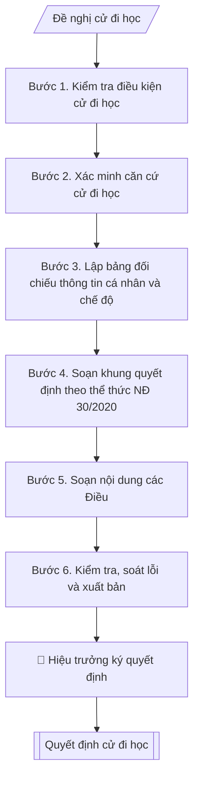

# Quyết định cử cán bộ đi đào tạo / tập huấn

## Định dạng và file đầu ra

Định dạng đầu ra có thể chọn theo sản phẩm/yêu cầu: .docx, .pdf. Đọc mục “Định dạng bổ sung” trong quy cách đầu ra trước khi chọn.

**Phải tạo file thực tế để tải xuống, không chỉ trả nội dung trong chat.** Định dạng mặc định của skill: **.docx**. Nếu có bảng số liệu nghiệp vụ yêu cầu file bảng tính riêng, tạo thêm Excel theo yêu cầu; không tự tạo file kiểm tra. Không chờ người dùng yêu cầu xuất file lần nữa. Ưu tiên định dạng người dùng chỉ định; đọc quy tắc xuất file tại references/quy-cach-dau-ra.md.

## Quy cách đầu ra và thông tin thiếu

Đọc [quy cách và cấu trúc sản phẩm](references/quy-cach-dau-ra.md) trước khi soạn/xuất. File giao chỉ gồm văn bản hoặc sản phẩm nghiệp vụ được yêu cầu; kiểm tra nội bộ không xuất kèm. Thiếu thông tin giữ nguyên trường/mục và chỗ điền theo mẫu gốc (dòng dấu chấm, dấu gạch hoặc ô trống); không tự điền dữ liệu mẫu, số 0, mã chờ xác minh hoặc dòng chờ ký. Mẫu chuyên ngành còn áp dụng được ưu tiên về cấu trúc, mã biểu và người ký. Các trường “bắt buộc” là điều kiện hoàn thiện hồ sơ, không ngăn việc soạn bản có chỗ chừa để điền. Mọi chỉ dẫn “để trống” trong skill được hiểu là không điền dữ liệu và giữ cách chừa chỗ của mẫu gốc, không phải xóa dấu chấm của mẫu.

## Kiểm soát áp dụng và phê duyệt

Trước khi chạy quy trình, xác định `ngay_ap_dung`, `loai_hinh_truong`, `quy_che_noi_bo`, `nguon_du_lieu` và `nguoi_kiem_duyet`. Chỉ yêu cầu thông tin có liên quan đến nghiệp vụ; không dùng giá trị giả định thay dữ liệu bắt buộc. Đối chiếu nội bộ hồ sơ có yếu tố pháp lý với văn bản gốc, hiệu lực, điều khoản áp dụng và chuyển tiếp; không tự đính kèm bảng kiểm tra vào file giao.

## Giới hạn và human gate

AI hỗ trợ chuẩn bị và đối chiếu. Cán bộ phụ trách kiểm tra dữ liệu/căn cứ, người có thẩm quyền duyệt và ký. Văn bản soạn chưa được coi là đã ban hành; không tự chèn nhãn trạng thái kiểm duyệt vào file giao; không đánh dấu đã ký, đã duyệt hoặc đã công bố nếu chưa có chứng cứ. Dữ liệu sinh viên, sức khỏe, nhân sự và tài chính phải hạn chế theo mục đích, phân quyền và che thông tin định danh khi dùng ví dụ. Không tải dữ liệu lên dịch vụ ngoài khi chưa có quyền. Kiểm tra Luật 91/2025/QH15 về bảo vệ dữ liệu cá nhân (hiệu lực 01/01/2026) và quy định áp dụng trước xử lý/chia sẻ dữ liệu cá nhân.

## Khi nào dùng
Khi cần cử cán bộ, viên chức, giảng viên đi học: đào tạo sau đại học, bồi dưỡng nghiệp vụ,
tập huấn chuyên môn, hội thảo khoa học trong và ngoài nước; làm căn cứ hưởng chế độ,
thanh toán kinh phí và quản lý thời gian công tác.

## Đầu vào (Input)

| Trường | Mô tả | Bắt buộc |
|---|---|---|
| `ho_ten` | Họ tên cán bộ được cử | Có |
| `chuc_vu` | Chức vụ, chức danh nghề nghiệp | Có |
| `don_vi` | Đơn vị công tác | Có |
| `khoa_hoc` | Tên khóa đào tạo / tập huấn / hội thảo | Có |
| `don_vi_to_chuc` | Cơ sở đào tạo / đơn vị tổ chức khóa học | Có |
| `thoi_gian` | Từ ngày ... đến ngày ... | Có |
| `dia_diem` | Nơi tổ chức | Có |
| `kinh_phi` | Kinh phí và nguồn chi trả (ngân sách / nguồn thu / tự túc một phần...) | Có |
| `can_cu` | Kế hoạch bồi dưỡng năm / công văn triệu tập / đề nghị của đơn vị | Có |
| `nguoi_ky` | Hiệu trưởng / Phó Hiệu trưởng | Có |

## Quy trình

**Bước 1. Kiểm tra điều kiện cử đi học**
- Làm gì: đối chiếu đề nghị cử đi học với kế hoạch bồi dưỡng năm của trường; xác nhận
đối tượng thuộc diện được cử (thuộc kế hoạch năm hoặc nhu cầu đột xuất có tờ trình hợp lệ);
kiểm tra thời gian đi học không trùng lịch giảng dạy/quản lý đã phân công, đã bố trí người
dạy thay hoặc người thay thế nhiệm vụ nếu cần.
- Dùng input: `ho_ten`, `chuc_vu`, `don_vi`, `thoi_gian`, `can_cu`.
- Vai trò: Chuyên viên Phòng TCCB (Trưởng phòng kiểm tra lại) · AI hỗ trợ: quét lỗi theo checklist · ⏱ ~15–30 phút (ước tính)
- Lưu ý nghiệp vụ: cử đi học trong thời gian giảng dạy mà không bố trí dạy thay là bẫy
thường gặp — phải có xác nhận của đơn vị quản lý cán bộ; trường hợp đột xuất ngoài kế
hoạch năm cần tờ trình nêu rõ lý do và được Ban Giám hiệu đồng ý trước.
- → Kết quả bước: phiếu kiểm tra điều kiện (đạt/không đạt từng tiêu chí + phương án
bố trí thay thế).

**Bước 2. Xác minh căn cứ cử đi học**
- Làm gì: thu thập và đối chiếu từng văn bản nêu trong `can_cu`: kế hoạch bồi dưỡng năm
đã phê duyệt (số, ngày ban hành, trích phần liên quan), công văn triệu tập của đơn vị
tổ chức (số, ngày, đối tượng triệu tập), tờ trình đề nghị của đơn vị quản lý cán bộ;
kiểm tra tên khóa học, đơn vị tổ chức, thời gian, địa điểm trong các văn bản có khớp
nhau không.
- Dùng input: `can_cu`, `khoa_hoc`, `don_vi_to_chuc`, `thoi_gian`, `dia_diem`.
- Vai trò: Chuyên viên Phòng TCCB · AI hỗ trợ: đối chiếu chéo tự động · ⏱ ~20–30 phút (ước tính)
- Lưu ý nghiệp vụ: tên khóa học trên công văn triệu tập và trên tờ trình thường lệch nhau
vài chữ — phải thống nhất một tên chính thức để dùng trong quyết định; kiểm tra thời hạn
đăng ký/nộp hồ sơ của đơn vị tổ chức để quyết định được ký kịp thời.
- → Kết quả bước: bảng đối chiếu căn cứ (căn cứ | số, ngày văn bản | nội dung liên quan |
khớp/không khớp).

**Bước 3. Lập bảng đối chiếu thông tin cá nhân và chế độ**
- Làm gì: đối chiếu `ho_ten`, `chuc_vu`, `don_vi` với hồ sơ cán bộ (đúng chính tả họ tên,
đúng chức danh và đơn vị hiện tại); phân tích `kinh_phi`: tách các khoản (học phí, công tác
phí, lưu trú), xác định nguồn chi (ngân sách / nguồn thu / tự túc một phần) và kiểm tra
nguồn chi có được phép dùng cho mục đích này không.
- Dùng input: `ho_ten`, `chuc_vu`, `don_vi`, `kinh_phi`.
- Vai trò: Chuyên viên Phòng TCCB (Trưởng phòng kiểm tra lại) · AI hỗ trợ: lập bảng tính toán · ⏱ ~15–30 phút (ước tính)
- Lưu ý nghiệp vụ: chức danh trong quyết định phải là chức danh hiện tại (kiểm tra quyết
định bổ nhiệm gần nhất); kinh phí trong quyết định ghi cả số tiền bằng số và bằng chữ;
nếu tự túc một phần phải ghi rõ phần nào tự túc để tránh tranh chấp khi thanh toán.
- → Kết quả bước: bảng đối chiếu thông tin cá nhân và kinh phí đã xác minh.

**Bước 4. Soạn khung quyết định theo thể thức NĐ 30/2020**
- Làm gì: soạn phần mở đầu văn bản: Quốc hiệu – Tiêu ngữ, tên cơ quan ban hành, số và ký
hiệu văn bản, địa danh và ngày tháng năm; tên loại văn bản "QUYẾT ĐỊNH" kèm trích yếu;
chức danh người ký; phần căn cứ (mỗi căn cứ một dòng bắt đầu bằng "Căn cứ", sắp xếp từ
căn cứ thành lập trường → quy chế trường → kế hoạch bồi dưỡng năm → công văn triệu tập →
đề nghị của P. TCCB).
- Dùng input: `can_cu`, `nguoi_ky`.
- Vai trò: Chuyên viên Phòng TCCB · AI hỗ trợ: soạn dự thảo đúng thể thức · ⏱ ~20–45 phút (ước tính)
- Lưu ý nghiệp vụ: số, ký hiệu lấy từ sổ đăng ký văn bản đi của Văn phòng (không tự đặt số
trùng); trích yếu ngắn gọn nêu đúng nội dung "Về việc cử cán bộ đi bồi dưỡng, tập huấn";
thẩm quyền ký: Hiệu trưởng hoặc Phó Hiệu trưởng được ủy quyền bằng văn bản.
- → Kết quả bước: khung quyết định (phần mở đầu + căn cứ) đúng thể thức.

**Bước 5. Soạn nội dung các Điều**
- Làm gì: viết các điều sau cụm "QUYẾT ĐỊNH:": Điều 1 — cử ông/bà nào (họ tên, chức vụ,
đơn vị) đi học khóa nào, đơn vị tổ chức nào, thời gian nào, địa điểm nào; Điều 2 — chế độ
được hưởng và kinh phí (số tiền bằng số + bằng chữ, nguồn chi); Điều 3 — các đơn vị, cá nhân
chịu trách nhiệm thi hành (P. TCCB, P. Tài chính – Kế toán, đơn vị quản lý, cá nhân được cử).
- Dùng input: `ho_ten`, `chuc_vu`, `don_vi`, `khoa_hoc`, `don_vi_to_chuc`, `thoi_gian`, `dia_diem`, `kinh_phi`.
- Vai trò: Chuyên viên Phòng TCCB · AI hỗ trợ: soạn dự thảo đúng thể thức · ⏱ ~20–45 phút (ước tính)
- Lưu ý nghiệp vụ: Điều 1 phải đầy đủ 5 yếu tố (ai – học gì – ai tổ chức – khi nào – ở đâu);
Điều 2 ghi nguồn chi cụ thể để P. Tài chính – Kế toán có căn cứ thanh toán; Điều 3 liệt kê
đủ đầu mối để không sót khâu theo dõi (đặc biệt là đơn vị quản lý trực tiếp của cán bộ).
- → Kết quả bước: dự thảo quyết định đầy đủ các Điều.

**Bước 6. Kiểm tra, soát lỗi và xuất bản**
- Làm gì: soát toàn văn: chính tả họ tên/chức vụ/đơn vị, thời gian – địa điểm – kinh phí
khớp với căn cứ đã xác minh ở Bước 2–3; kiểm tra thẩm quyền ký của `nguoi_ky`; hoàn thiện
mục Nơi nhận (các đơn vị/cá nhân ở Điều 3 + lưu VT, TCCB); lập danh sách giấy tờ kèm theo
cần chuẩn bị (công văn triệu tập, tờ trình đơn vị, trích lục kế hoạch bồi dưỡng).
- Dùng input: toàn bộ input (tổng soát), `nguoi_ky`.
- Vai trò: Chuyên viên Phòng TCCB (Trưởng phòng kiểm tra lại) · AI hỗ trợ: quét lỗi theo checklist · ⏱ ~15–30 phút (ước tính)
- Lưu ý nghiệp vụ: lỗi phổ biến nhất là họ tên/chức danh sai một chữ so với hồ sơ cán bộ —
quyết định sai tên không có giá trị làm căn cứ thanh toán; Nơi nhận phải có "Lưu: VT, TCCB"
để lưu hồ sơ cán bộ.
- → Kết quả bước: quyết định cử đi học hoàn chỉnh + danh sách giấy tờ kèm theo, sẵn sàng trình ký.

## Luồng quy trình (Workflow)

## Đầu ra

File nghiệp vụ thực tế theo định dạng mặc định ở đầu skill hoặc định dạng người dùng yêu cầu, kèm liên kết tải trong phản hồi cuối.

Sản phẩm nghiệp vụ hoàn chỉnh theo [quy cách và cấu trúc](references/quy-cach-dau-ra.md), giữ các trường chưa có dữ liệu ở trạng thái trống. Không xuất kèm checklist/phụ lục kiểm tra đầu ra.

## Kiểm tra nội bộ trước khi giao

Các tiêu chí sau dùng để tự đối chiếu; không sao chép vào file xuất. Mục thiếu dữ liệu được để trống, không đánh dấu đã đạt hoặc đã duyệt.

- [ ] Bố cục khớp mẫu áp dụng và cấu trúc tại references/quy-cach-dau-ra.md.
- [ ] Nội dung và số liệu trong output khớp đúng với Input đã cho (không thêm, bớt hay suy diễn)
- [ ] Không bịa đặt số liệu, minh chứng, trích dẫn hay căn cứ
- [ ] Đúng thể thức và định dạng theo Nghị định 30/2020/NĐ-CP về công tác văn thư (thể thức văn bản).
- [ ] Căn cứ pháp lý được trích dẫn đầy đủ và còn hiệu lực
- [ ] Không coi bản soạn là đã ký/đã duyệt; việc phê duyệt thuộc người có thẩm quyền trước phát hành
- [ ] Chức danh trong quyết định phải là chức danh hiện tại (kiểm tra quyết
- [ ] Điều 1 phải đầy đủ 5 yếu tố (ai – học gì – ai tổ chức – khi nào – ở đâu);

## Căn cứ & lưu ý
- Nghị định 30/2020/NĐ-CP về công tác văn thư (thể thức văn bản).
- Luật Viên chức và các quy định về đào tạo, bồi dưỡng viên chức.
- Kiểm tra thời gian đi học không trùng lịch giảng dạy đã phân công; bố trí dạy thay nếu cần.
- Không dùng tên thật của trường/cá nhân khi mô phỏng.

## Quản trị phiên bản

- Phiên bản gói: `1.3.1`; ngày cập nhật: `2026-10-10`.
- Kho nguồn: https://github.com/phamtruong91/university-skills-framework
- Người duy trì trên GitHub: `phamtruong91` (Phạm Văn Trường). Người phê duyệt nghiệp vụ: **chưa chỉ định**.
- Commit nguồn trước cập nhật: `346719e6b0318ed034b4b016703f79733aa575e7`. Commit chứa phiên bản này xem bằng `git log -1 -- skills/quyet-dinh-cu-di-hoc`; không tự gán SHA chưa tạo.
- Giấy phép: theo LICENSE của kho; bản quyền CES Global.
- Lịch sử 1.1.0: bổ sung metadata giao diện, kiểm soát áp dụng, quản trị phiên bản.
- Trạng thái: dự thảo nghiệp vụ; kiểm tra pháp lý trước thực thi. Ngày cập nhật không đồng nghĩa mọi văn bản đã được rà soát toàn văn.
