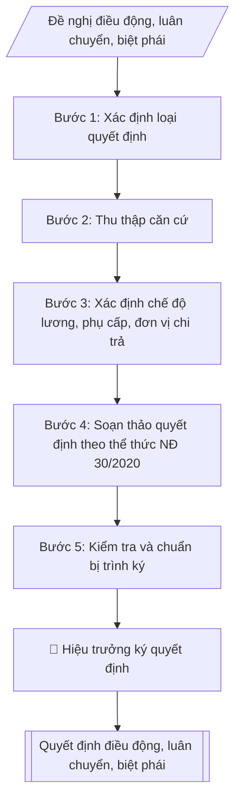

# Soạn quyết định điều động, luân chuyển, biệt phái

## Định dạng và file đầu ra
Định dạng đầu ra có thể chọn theo sản phẩm/yêu cầu: .docx, .pdf. Đọc mục “Định dạng bổ sung” trong quy cách đầu ra trước khi chọn.

**Phải tạo file thực tế để tải xuống, không chỉ trả nội dung trong chat.** Định dạng mặc định của skill: **.docx**. Nếu có bảng số liệu nghiệp vụ yêu cầu file bảng tính riêng, tạo thêm Excel theo yêu cầu; không tự tạo file kiểm tra. Không chờ người dùng yêu cầu xuất file lần nữa. Ưu tiên định dạng người dùng chỉ định; đọc quy tắc xuất file tại references/quy-cach-dau-ra.md.

## Quy cách đầu ra và thông tin thiếu
Đọc [quy cách và cấu trúc sản phẩm](references/quy-cach-dau-ra.md) trước khi soạn/xuất. File giao chỉ gồm sản phẩm nghiệp vụ được yêu cầu; kiểm tra nội bộ không xuất kèm. Thiếu thông tin thì giữ nguyên trường/mục và chỗ điền theo mẫu gốc (dòng dấu chấm, dấu gạch hoặc ô trống); không tự điền dữ liệu mẫu, số 0, mã chờ xác minh hay dòng chờ ký. Mẫu chuyên ngành còn áp dụng được ưu tiên về cấu trúc, mã biểu và người ký. Bản đầy đủ: [quy tắc chung](references/quy-tac-chung.md).

## Kiểm soát áp dụng và phê duyệt
Trước khi chạy, xác định `ngay_ap_dung`, `loai_hinh_truong`, `quy_che_noi_bo`, `nguon_du_lieu`, `nguoi_kiem_duyet`; chỉ hỏi thông tin liên quan nghiệp vụ, không dùng giá trị giả định thay dữ liệu bắt buộc. Đối chiếu căn cứ pháp lý với văn bản gốc, hiệu lực, điều khoản áp dụng và chuyển tiếp. Bản đầy đủ: [quy tắc chung](references/quy-tac-chung.md).

Nếu có cập nhật pháp lý dưới đây, đọc [căn cứ và điều kiện áp dụng](references/phap-ly.md) trước khi làm. Quy trình dưới đây giữ nghiệp vụ từ bản gốc; mọi viện dẫn văn bản, mẫu biểu, điều khoản phải theo căn cứ đã chọn trong phap-ly.md, không theo văn bản cũ.

## Giới hạn và human gate
AI hỗ trợ chuẩn bị và đối chiếu; cán bộ phụ trách kiểm tra dữ liệu/căn cứ, người có thẩm quyền duyệt và ký. Không đánh dấu đã ký, đã duyệt, đã công bố khi chưa có chứng cứ. Dữ liệu sinh viên, sức khỏe, nhân sự, tài chính chỉ dùng theo mục đích và phân quyền, che thông tin định danh khi dùng ví dụ (Luật 91/2025/QH15, hiệu lực 01/01/2026); không tải dữ liệu lên dịch vụ ngoài khi chưa có quyền. Bản đầy đủ: [quy tắc chung](references/quy-tac-chung.md).

## Khi nào dùng
Khi Nhà trường cần ban hành Quyết định về nhân sự thuộc một trong ba trường hợp:
- **Điều động**: chuyển viên chức từ đơn vị này sang đơn vị khác (trong trường hoặc đến đơn vị ngoài trường
  theo thỏa thuận), thay đổi vị trí việc làm;
- **Luân chuyển**: chuyển cán bộ lãnh đạo, quản lý sang giữ chức vụ khác (thường cùng cấp hoặc để đào tạo,
  rèn luyện qua thực tiễn);
- **Biệt phái**: cử viên chức đến làm việc có thời hạn tại cơ quan, đơn vị khác để thực hiện nhiệm vụ
  cụ thể, hết thời hạn trở về đơn vị cũ.

## Đầu vào (Input)
| Trường | Mô tả | Bắt buộc |
|---|---|---|
| `loai_quyet_dinh` | Điều động / Luân chuyển / Biệt phái | Có |
| `ho_ten` | Họ tên, học hàm/học vị, chức danh nghề nghiệp (giả lập khi mô phỏng) | Có |
| `don_vi_hien_tai` | Đơn vị đang công tác + vị trí việc làm hiện tại | Có |
| `don_vi_moi` | Đơn vị tiếp nhận + vị trí việc làm / chức vụ mới | Có |
| `thoi_han` | Thời hạn (biệt phái: từ ngày – đến ngày; điều động/luân chuyển: "kể từ ngày...") | Có |
| `ly_do` | Lý do: nhu cầu công tác / nguyện vọng cá nhân / thực hiện nhiệm vụ... | Có |
| `che_do` | Chế độ được hưởng: lương, phụ cấp giữ nguyên hay thay đổi; đơn vị chi trả (đối với biệt phái) | Có |
| `can_cu` | Căn cứ pháp lý, tờ trình/đề nghị của đơn vị (số, ngày) | Có |
| `hieu_luc` | Ngày quyết định có hiệu lực | Có |
| `nguoi_ky` | Hiệu trưởng | Có |

## Quy trình
**Ràng buộc pháp lý khi thực hiện** (trích references/phap-ly.md; đối chiếu toàn văn và hiệu lực tại ngày nghiệp vụ):
- Luật 129/2025/QH15; Nghị định 259/2026/NĐ-CP; phạm vi: Viên chức đơn vị sự nghiệp công lập; kiểm tra chuyển tiếp và quy định riêng về nhà giáo: Cập nhật căn cứ tuyển dụng, hợp đồng làm việc, bổ nhiệm, điều động và đào tạo viên chức. Không tái sử dụng số điều hoặc mẫu phiếu của NĐ 115. Phải yêu cầu ngày tuyển dụng, ngày phê duyệt kế hoạch, loại hợp đồng, trạng thái hồ sơ và bản văn NĐ 259 để chọn điều khoản chuyển tiếp; không tự áp dụng điều22 Luật Viên chức2010. Các văn bản cũ chỉ là căn cứ lịch sử khi chuyển tiếp cho phép.
- Luật Nhà giáo; Nghị định 93/2026/NĐ-CP; khoản 9 Điều 62 NĐ 259/2026; phạm vi: Viên chức là nhà giáo: Thêm input đối tượng là nhà giáo hay viên chức khác. Nếu pháp luật nhà giáo có quy định khác về thẩm quyền, tiêu chuẩn, điều kiện, trình tự, thủ tục tuyển dụng/sử dụng/quản lý, áp dụng quy định nhà giáo và hướng dẫn Bộ GDĐT thay vì quy tắc chung NĐ 259.
- Trước Bước 1: chọn căn cứ theo đối tượng, loại hình trường và chuyển tiếp; lập bảng văn bản / điều khoản / lý do áp dụng / bằng chứng. Thiếu văn bản gốc hoặc điều khoản thì ghi nhận nội bộ [CẦN XÁC MINH] (không đưa vào file giao), để trống phần tương ứng, chưa kết luận tuân thủ.
- Các con số, thời hạn, số điều, số mức xếp loại, hệ số và mẫu biểu nêu trong các bước dưới đây được giữ từ quy trình gốc (trước cập nhật pháp lý); chỉ dùng khi đã đối chiếu đúng với căn cứ đã chọn, khác thì theo căn cứ. Danh sách điểm cần đối chiếu: docs/DIEM_CAN_DOI_CHIEU_PHAP_LY.md.

**Bước 1. Xác định loại quyết định**
- Làm gì: căn cứ bản chất của việc chuyển đổi để phân loại: Điều động (chuyển đơn vị, thay đổi vị trí việc làm lâu dài), Luân chuyển (chuyển cán bộ quản lý sang giữ chức vụ khác), hay Biệt phái (cử đi làm việc có thời hạn, giữ nguyên biên chế đơn vị cũ).
- Dùng input: `loai_quyet_dinh`, `don_vi_hien_tai`, `don_vi_moi`, `thoi_han`.
- Vai trò: Chuyên viên Phòng TCCB · AI hỗ trợ: phân tích input, xác định yêu cầu · ⏱ ~20–45 phút (ước tính)
- Lưu ý nghiệp vụ: chọn sai loại thì sai toàn bộ điều khoản — điều động không có điều khoản "trở về đơn vị cũ"; biệt phái bắt buộc ghi thời hạn và đơn vị chi trả lương.
- → Kết quả bước: phiếu xác định loại quyết định.

**Bước 2. Thu thập căn cứ**
- Làm gì: thu thập tờ trình/đề nghị của đơn vị có nhu cầu hoặc của Phòng Tổ chức – Cán bộ; văn bản thể hiện ý kiến thống nhất của đơn vị tiếp nhận (điều động đến đơn vị ngoài trường phải có văn bản thỏa thuận tiếp nhận); văn bản thể hiện nguyện vọng của viên chức (đối với điều động theo nguyện vọng).
- Dùng input: `can_cu`, `ly_do`, `don_vi_moi`.
- Vai trò: Chuyên viên Phòng TCCB · AI hỗ trợ: xử lý sơ bộ theo quy trình · ⏱ ~20–45 phút (ước tính)
- Lưu ý nghiệp vụ: điều động đến đơn vị ngoài trường mà chưa có văn bản thỏa thuận tiếp nhận thì dừng lại, không soạn quyết định.
- → Kết quả bước: bộ căn cứ pháp lý và tờ trình/đề nghị đã đầy đủ.

**Bước 3. Xác định chế độ**
- Làm gì: đối chiếu vị trí việc làm mới để xác định tiền lương, phụ cấp chức vụ, phụ cấp thâm niên được bảo lưu hay điều chỉnh; đối với biệt phái: xác định đơn vị chi trả lương/phụ cấp và chế độ công tác phí trong thời gian biệt phái.
- Dùng input: `che_do`, `thoi_han`, `don_vi_moi`.
- Vai trò: Chuyên viên Phòng TCCB · AI hỗ trợ: phân tích input, xác định yêu cầu · ⏱ ~20–45 phút (ước tính)
- Lưu ý nghiệp vụ: biệt phái bắt buộc ghi rõ đơn vị chi trả; điều động gắn với thay đổi ngạch/chức danh thì đối chiếu bảng lương văn bản hiện hành nêu tại phap-ly.md.
- → Kết quả bước: bảng chế độ (lương, phụ cấp cũ → mới; đơn vị chi trả).

**Bước 4. Soạn thảo quyết định theo thể thức NĐ 30/2020**
- Làm gì: soạn quyết định đầy đủ các phần: Quốc hiệu – Tiêu ngữ; tên cơ quan; số/ký hiệu; địa danh, ngày tháng; tên loại "QUYẾT ĐỊNH" + trích yếu; phần "Căn cứ..."; phần "Xét..."; nội dung "QUYẾT ĐỊNH:" với các điều đánh số — Điều 1: họ tên, chức danh, đơn vị hiện tại → đơn vị/vị trí mới (ghi rõ loại: điều động/luân chuyển/biệt phái + thời hạn); Điều 2: chế độ lương, phụ cấp, đơn vị chi trả (nếu biệt phái); Điều 3: hiệu lực thi hành, trách nhiệm bàn giao công việc (biệt phái: điều khoản trở về đơn vị cũ khi hết hạn); Điều 4: nơi nhận — các đơn vị và cá nhân chịu trách nhiệm thi hành.
- Dùng input: toàn bộ input đã thu thập ở các bước 1–3 (`loai_quyet_dinh`, `ho_ten`, `don_vi_hien_tai`, `don_vi_moi`, `thoi_han`, `ly_do`, `che_do`, `can_cu`, `hieu_luc`).
- Vai trò: Chuyên viên Phòng TCCB · AI hỗ trợ: soạn dự thảo đúng thể thức · ⏱ ~20–45 phút (ước tính)
- Lưu ý nghiệp vụ: Điều 1 phải ghi đúng thuật ngữ loại quyết định đã xác định ở Bước 1; thời hạn biệt phái ghi cụ thể "từ ngày – đến ngày".
- → Kết quả bước: dự thảo quyết định hoàn chỉnh.

**Bước 5. Kiểm tra và chuẩn bị trình ký**
- Làm gì: kiểm tra lần cuối: thẩm quyền ký (Hiệu trưởng), thời hạn biệt phái, chế độ chính sách, nơi nhận (đơn vị cũ, đơn vị mới, cá nhân, lưu hồ sơ cán bộ); ngày hiệu lực không sớm hơn ngày ký; hoàn thiện dự thảo để trình Hiệu trưởng ký, đóng dấu.
- Dùng input: `nguoi_ky`, `hieu_luc`.
- Vai trò: Chuyên viên Phòng TCCB chuẩn bị, Hiệu trưởng phê duyệt · AI hỗ trợ: tổng hợp hồ sơ, soạn phiếu trình/tờ trình đầy đủ · ⏱ ~15–30 phút chuẩn bị + chờ duyệt (ước tính)
- Lưu ý nghiệp vụ: dùng checklist kiểm tra trước khi trình ký; quyết định chưa ký, đóng dấu thì chưa có hiệu lực pháp lý.
- → Kết quả bước: dự thảo quyết định đã kiểm tra + checklist kiểm tra (trình ký tại Human gate; sau khi ký: ban hành, gửi các đơn vị, lưu hồ sơ cán bộ).

## Luồng quy trình (Workflow)

## Đầu ra
- Văn bản Quyết định điều động / luân chuyển / biệt phái hoàn chỉnh.
- Checklist kiểm tra (loại quyết định, thời hạn, chế độ, thẩm quyền ký, nơi nhận).

File nghiệp vụ thực tế theo định dạng mặc định ở đầu skill hoặc định dạng người dùng yêu cầu, kèm liên kết tải trong phản hồi cuối.

Sản phẩm nghiệp vụ hoàn chỉnh theo [quy cách và cấu trúc](references/quy-cach-dau-ra.md), giữ các trường chưa có dữ liệu ở trạng thái trống. Không xuất kèm checklist/phụ lục kiểm tra đầu ra.

## Kiểm tra nội bộ trước khi giao
Các tiêu chí sau dùng để tự đối chiếu; không sao chép vào file xuất. Mục thiếu dữ liệu được để trống, không đánh dấu đã đạt hoặc đã duyệt.

- [ ] Đủ các phần và đúng bố cục theo cấu trúc tại references/quy-cach-dau-ra.md (không theo cấu trúc của bản gốc).
- [ ] Nội dung và số liệu trong output khớp đúng với Input đã cho (không thêm, bớt hay suy diễn)
- [ ] Không bịa đặt số liệu, minh chứng, trích dẫn hay căn cứ
- [ ] Đúng thể thức và cấu trúc theo references/quy-cach-dau-ra.md và căn cứ đã chọn tại references/phap-ly.md.
- [ ] Căn cứ pháp lý được trích dẫn đầy đủ và còn hiệu lực
- [ ] Đã qua Human gate: người có thẩm quyền đã kiểm tra/duyệt trước khi phát hành
- [ ] Biệt phái bắt buộc ghi thời hạn và đơn vị chi trả lương
- [ ] Biệt phái bắt buộc ghi rõ đơn vị chi trả
- [ ] Điều 1 phải ghi đúng thuật ngữ loại quyết định đã xác định ở Bước 1

## Căn cứ & lưu ý
- Căn cứ hiện hành: xem [căn cứ và điều kiện áp dụng](references/phap-ly.md); phải đối chiếu văn bản gốc, hiệu lực và chuyển tiếp tại ngày nghiệp vụ.
- Quy định về công tác cán bộ của Nhà trường / cơ quan chủ quản (thẩm quyền, trình tự điều động, luân chuyển).
- Nghị định 30/2020/NĐ-CP về thể thức văn bản hành chính.
- Lưu ý phân biệt: điều động thay đổi đơn vị công tác lâu dài; luân chuyển gắn với chức vụ quản lý;
  biệt phái có thời hạn và viên chức trở về đơn vị cũ khi hết hạn.
- Không dùng tên thật của trường/cá nhân khi mô phỏng; mọi số liệu trong ví dụ đều giả lập.

## Tư liệu đối chiếu
Bản gốc trước cập nhật pháp lý (kèm ví dụ giả lập) lưu tại `references/quy-trinh-lich-su.md`, chỉ để đối chiếu hồ sơ lịch sử; không dùng căn cứ, mẫu hay số liệu trong đó làm chỉ dẫn hiện hành.

## Quản trị phiên bản
- Phiên bản gói `1.3.2` (cập nhật 2026-10-10); hồ sơ đầy đủ tại [references/version.json](references/version.json).
- Người phê duyệt nghiệp vụ: **chưa chỉ định**. Trạng thái: dự thảo nghiệp vụ; kiểm tra pháp lý trước thực thi. Ngày cập nhật không đồng nghĩa mọi văn bản đã được rà soát toàn văn.
- Giấy phép theo LICENSE của kho (bản quyền CES Global). Lịch sử thay đổi: CHANGELOG.md.
