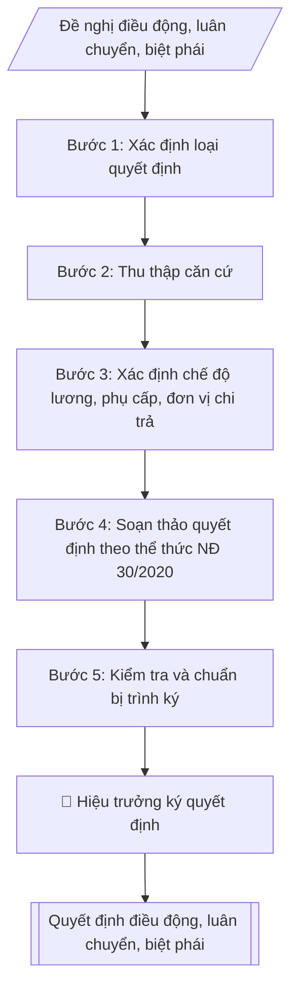

# Tư liệu lịch sử – không phải quy trình hiện hành

Nội dung từ phiên bản nguồn trước 1.1.0, giữ để đối chiếu dữ liệu đầu vào và thay đổi; căn cứ, điều kiện, mẫu và ví dụ có thể đã lỗi thời. Không dùng để thực hiện nghiệp vụ hiện tại.

## Khi nào dùng
Khi Nhà trường cần ban hành Quyết định về nhân sự thuộc một trong ba trường hợp:
- **Điều động**: chuyển viên chức từ đơn vị này sang đơn vị khác (trong trường hoặc đến đơn vị ngoài trường
  theo thỏa thuận), thay đổi vị trí việc làm;
- **Luân chuyển**: chuyển cán bộ lãnh đạo, quản lý sang giữ chức vụ khác (thường cùng cấp hoặc để đào tạo,
  rèn luyện qua thực tiễn);
- **Biệt phái**: cử viên chức đến làm việc có thời hạn tại cơ quan, đơn vị khác để thực hiện nhiệm vụ
  cụ thể, hết thời hạn trở về đơn vị cũ.

## Đầu vào (Input)

| Trường | Mô tả | Bắt buộc |
|---|---|---|
| `loai_quyet_dinh` | Điều động / Luân chuyển / Biệt phái | Có |
| `ho_ten` | Họ tên, học hàm/học vị, chức danh nghề nghiệp (giả lập khi mô phỏng) | Có |
| `don_vi_hien_tai` | Đơn vị đang công tác + vị trí việc làm hiện tại | Có |
| `don_vi_moi` | Đơn vị tiếp nhận + vị trí việc làm / chức vụ mới | Có |
| `thoi_han` | Thời hạn (biệt phái: từ ngày – đến ngày; điều động/luân chuyển: "kể từ ngày...") | Có |
| `ly_do` | Lý do: nhu cầu công tác / nguyện vọng cá nhân / thực hiện nhiệm vụ... | Có |
| `che_do` | Chế độ được hưởng: lương, phụ cấp giữ nguyên hay thay đổi; đơn vị chi trả (đối với biệt phái) | Có |
| `can_cu` | Căn cứ pháp lý, tờ trình/đề nghị của đơn vị (số, ngày) | Có |
| `hieu_luc` | Ngày quyết định có hiệu lực | Có |
| `nguoi_ky` | Hiệu trưởng | Có |

## Quy trình

**Bước 1. Xác định loại quyết định**
- Làm gì: căn cứ bản chất của việc chuyển đổi để phân loại: Điều động (chuyển đơn vị, thay đổi vị trí việc làm lâu dài), Luân chuyển (chuyển cán bộ quản lý sang giữ chức vụ khác), hay Biệt phái (cử đi làm việc có thời hạn, giữ nguyên biên chế đơn vị cũ).
- Dùng input: `loai_quyet_dinh`, `don_vi_hien_tai`, `don_vi_moi`, `thoi_han`.
- Vai trò: Chuyên viên Phòng TCCB · AI hỗ trợ: phân tích input, xác định yêu cầu · ⏱ ~20–45 phút (ước tính)
- Lưu ý nghiệp vụ: chọn sai loại thì sai toàn bộ điều khoản — điều động không có điều khoản "trở về đơn vị cũ"; biệt phái bắt buộc ghi thời hạn và đơn vị chi trả lương.
- → Kết quả bước: phiếu xác định loại quyết định.

**Bước 2. Thu thập căn cứ**
- Làm gì: thu thập tờ trình/đề nghị của đơn vị có nhu cầu hoặc của Phòng Tổ chức – Cán bộ; văn bản thể hiện ý kiến thống nhất của đơn vị tiếp nhận (điều động đến đơn vị ngoài trường phải có văn bản thỏa thuận tiếp nhận); văn bản thể hiện nguyện vọng của viên chức (đối với điều động theo nguyện vọng).
- Dùng input: `can_cu`, `ly_do`, `don_vi_moi`.
- Vai trò: Chuyên viên Phòng TCCB · AI hỗ trợ: xử lý sơ bộ theo quy trình · ⏱ ~20–45 phút (ước tính)
- Lưu ý nghiệp vụ: điều động đến đơn vị ngoài trường mà chưa có văn bản thỏa thuận tiếp nhận thì dừng lại, không soạn quyết định.
- → Kết quả bước: bộ căn cứ pháp lý và tờ trình/đề nghị đã đầy đủ.

**Bước 3. Xác định chế độ**
- Làm gì: đối chiếu vị trí việc làm mới để xác định tiền lương, phụ cấp chức vụ, phụ cấp thâm niên được bảo lưu hay điều chỉnh; đối với biệt phái: xác định đơn vị chi trả lương/phụ cấp và chế độ công tác phí trong thời gian biệt phái.
- Dùng input: `che_do`, `thoi_han`, `don_vi_moi`.
- Vai trò: Chuyên viên Phòng TCCB · AI hỗ trợ: phân tích input, xác định yêu cầu · ⏱ ~20–45 phút (ước tính)
- Lưu ý nghiệp vụ: biệt phái bắt buộc ghi rõ đơn vị chi trả; điều động gắn với thay đổi ngạch/chức danh thì đối chiếu bảng lương NĐ 204/2004.
- → Kết quả bước: bảng chế độ (lương, phụ cấp cũ → mới; đơn vị chi trả).

**Bước 4. Soạn thảo quyết định theo thể thức NĐ 30/2020**
- Làm gì: soạn quyết định đầy đủ các phần: Quốc hiệu – Tiêu ngữ; tên cơ quan; số/ký hiệu; địa danh, ngày tháng; tên loại "QUYẾT ĐỊNH" + trích yếu; phần "Căn cứ..."; phần "Xét..."; nội dung "QUYẾT ĐỊNH:" với các điều đánh số — Điều 1: họ tên, chức danh, đơn vị hiện tại → đơn vị/vị trí mới (ghi rõ loại: điều động/luân chuyển/biệt phái + thời hạn); Điều 2: chế độ lương, phụ cấp, đơn vị chi trả (nếu biệt phái); Điều 3: hiệu lực thi hành, trách nhiệm bàn giao công việc (biệt phái: điều khoản trở về đơn vị cũ khi hết hạn); Điều 4: nơi nhận — các đơn vị và cá nhân chịu trách nhiệm thi hành.
- Dùng input: toàn bộ input đã thu thập ở các bước 1–3 (`loai_quyet_dinh`, `ho_ten`, `don_vi_hien_tai`, `don_vi_moi`, `thoi_han`, `ly_do`, `che_do`, `can_cu`, `hieu_luc`).
- Vai trò: Chuyên viên Phòng TCCB · AI hỗ trợ: soạn dự thảo đúng thể thức · ⏱ ~20–45 phút (ước tính)
- Lưu ý nghiệp vụ: Điều 1 phải ghi đúng thuật ngữ loại quyết định đã xác định ở Bước 1; thời hạn biệt phái ghi cụ thể "từ ngày – đến ngày".
- → Kết quả bước: dự thảo quyết định hoàn chỉnh.

**Bước 5. Kiểm tra và chuẩn bị trình ký**
- Làm gì: kiểm tra lần cuối: thẩm quyền ký (Hiệu trưởng), thời hạn biệt phái, chế độ chính sách, nơi nhận (đơn vị cũ, đơn vị mới, cá nhân, lưu hồ sơ cán bộ); ngày hiệu lực không sớm hơn ngày ký; hoàn thiện dự thảo để trình Hiệu trưởng ký, đóng dấu.
- Dùng input: `nguoi_ky`, `hieu_luc`.
- Vai trò: Chuyên viên Phòng TCCB chuẩn bị, Hiệu trưởng phê duyệt · AI hỗ trợ: tổng hợp hồ sơ, soạn phiếu trình/tờ trình đầy đủ · ⏱ ~15–30 phút chuẩn bị + chờ duyệt (ước tính)
- Lưu ý nghiệp vụ: dùng checklist kiểm tra trước khi trình ký; quyết định chưa ký, đóng dấu thì chưa có hiệu lực pháp lý.
- → Kết quả bước: dự thảo quyết định đã kiểm tra + checklist kiểm tra (trình ký tại Human gate; sau khi ký: ban hành, gửi các đơn vị, lưu hồ sơ cán bộ).

## Luồng quy trình (Workflow)



## Đầu ra (Output)
- Văn bản Quyết định điều động / luân chuyển / biệt phái hoàn chỉnh.
- Checklist kiểm tra (loại quyết định, thời hạn, chế độ, thẩm quyền ký, nơi nhận).

**Cấu trúc output chuẩn** (Quyết định điều động / luân chuyển / biệt phái):
1. Quốc hiệu – Tiêu ngữ;
2. Tên cơ quan ban hành;
3. Số, ký hiệu văn bản;
4. Địa danh, ngày tháng năm ban hành;
5. Tên loại văn bản "QUYẾT ĐỊNH" + trích yếu nội dung;
6. Người ban hành (HIỆU TRƯỞNG TRƯỜNG ĐẠI HỌC A);
7. Phần "Căn cứ..." (căn cứ pháp lý + tờ trình/đề nghị của đơn vị);
8. Phần "Xét..." (nhu cầu công tác / nguyện vọng);
9. Nội dung "QUYẾT ĐỊNH:": Điều 1 (điều động/luân chuyển/biệt phái — họ tên, chức danh, đơn vị hiện tại
→ đơn vị/vị trí mới, thời hạn), Điều 2 (chế độ lương, phụ cấp; đơn vị chi trả), Điều 3 (hiệu lực thi hành;
trách nhiệm bàn giao công việc), Điều 4 (trách nhiệm thi hành);
10. Nơi nhận;
11. Chữ ký, đóng dấu.

## Checklist nghiệm thu

Tiêu chí đạt: tất cả các ô dưới đây được đánh dấu.

- [ ] Đủ các phần theo Cấu trúc output chuẩn: Quốc hiệu – Tiêu ngữ; Tên cơ quan ban hành; Số, ký hiệu văn bản; Địa danh, ngày tháng năm ban hành; … (đủ 11 phần)
- [ ] Nội dung và số liệu trong output khớp đúng với Input đã cho (không thêm, bớt hay suy diễn)
- [ ] Không bịa đặt số liệu, minh chứng, trích dẫn hay căn cứ
- [ ] Đúng thể thức và định dạng theo Nghị định 115/2020/NĐ-CP về tuyển dụng, sử dụng và quản lý viên chứ…
- [ ] Căn cứ pháp lý được trích dẫn đầy đủ và còn hiệu lực
- [ ] Đã qua Human gate: người có thẩm quyền đã kiểm tra/duyệt trước khi phát hành
- [ ] Biệt phái bắt buộc ghi thời hạn và đơn vị chi trả lương
- [ ] Biệt phái bắt buộc ghi rõ đơn vị chi trả
- [ ] Điều 1 phải ghi đúng thuật ngữ loại quyết định đã xác định ở Bước 1

## Ví dụ mô phỏng (dữ liệu giả lập)

> Tất cả tên trường, cá nhân, số liệu dưới đây đều là **giả lập**, không liên quan tổ chức/cá nhân có thật.

### Input mẫu

| Trường | Giá trị |
|---|---|
| `loai_quyet_dinh` | Biệt phái |
| `ho_ten` | ThS. Bùi Thị A, giảng viên |
| `don_vi_hien_tai` | Khoa Công nghệ thông tin – giảng dạy học phần Kỹ thuật phần mềm |
| `don_vi_moi` | Trung tâm Chuyển đổi số (đơn vị trực thuộc Trường) – tham gia triển khai hệ thống quản lý đào tạo |
| `thoi_han` | 12 tháng, từ 01/11/2026 đến hết 31/10/2027 |
| `ly_do` | Thực hiện nhiệm vụ triển khai hệ thống quản lý đào tạo trực tuyến của Trường |
| `che_do` | Giữ nguyên lương, phụ cấp theo vị trí giảng viên tại Khoa CNTT do Trường chi trả; hưởng công tác phí theo quy định |
| `can_cu` | Tờ trình số 61/TTr-ĐHA-TCCB ngày 20/10/2026 của Phòng Tổ chức – Cán bộ |
| `hieu_luc` | 01/11/2026 |

### Output mẫu

```
TRƯỜNG ĐẠI HỌC A            CỘNG HÒA XÃ HỘI CHỦ NGHĨA VIỆT NAM
                                         Độc lập – Tự do – Hạnh phúc
      Số: 262/QĐ-ĐHA-TCCB
                                                 Thành phố C, ngày 26 tháng 10 năm 2026

QUYẾT ĐỊNH
Về việc biệt phái viên chức

HIỆU TRƯỞNG TRƯỜNG ĐẠI HỌC A

Căn cứ Nghị định số 115/2020/NĐ-CP ngày 25/9/2020 của Chính phủ quy định về
tuyển dụng, sử dụng và quản lý viên chức;
Căn cứ Quy chế tổ chức và hoạt động của Trường Đại học A;
Căn cứ Tờ trình số 61/TTr-ĐHA-TCCB ngày 20/10/2026 của Phòng Tổ chức – Cán bộ
về việc biệt phái viên chức thực hiện nhiệm vụ chuyển đổi số;
Xét nhu cầu công tác của Nhà trường,

QUYẾT ĐỊNH:

Điều 1. Biệt phái bà Bùi Thị A, Thạc sĩ, giảng viên Khoa Công nghệ thông tin,
đến nhận nhiệm vụ tại Trung tâm Chuyển đổi số để tham gia triển khai hệ thống
quản lý đào tạo trực tuyến của Trường, thời hạn 12 tháng kể từ ngày 01/11/2026
đến hết ngày 31/10/2027.

Điều 2. Trong thời gian biệt phái, bà Bùi Thị A được giữ nguyên tiền lương,
phụ cấp theo vị trí giảng viên tại Khoa Công nghệ thông tin do Trường chi trả;
được hưởng chế độ công tác phí theo quy định hiện hành. Hết thời hạn biệt phái,
bà Bùi Thị A trở về nhận công tác tại Khoa Công nghệ thông tin.

Điều 3. Quyết định này có hiệu lực kể từ ngày 01/11/2026. Bà Bùi Thị A có
trách nhiệm bàn giao công việc giảng dạy tại Khoa Công nghệ thông tin trước khi
đi biệt phái theo quy định.

Điều 4. Trưởng phòng Tổ chức – Cán bộ, Trưởng khoa Công nghệ thông tin, Giám đốc
Trung tâm Chuyển đổi số và bà Bùi Thị A chịu trách nhiệm thi hành
Quyết định này./.

Nơi nhận:                                         HIỆU TRƯỞNG
- Như Điều 4;                                              [CHỜ KÝ]
- Lưu: VT, TCCB, hồ sơ CB.
                                              PGS.TS. Trần Văn B
```

### Checklist kiểm tra (output kèm theo)
- [x] Loại quyết định đúng bản chất (điều động / luân chuyển / biệt phái)
- [x] Căn cứ pháp lý + tờ trình/đề nghị của đơn vị
- [x] Họ tên, chức danh, đơn vị cũ → đơn vị/vị trí mới rõ ràng
- [x] Thời hạn ghi cụ thể (biệt phái: từ ngày – đến ngày)
- [x] Chế độ lương, phụ cấp; đơn vị chi trả (biệt phái)
- [x] Điều khoản bàn giao công việc và trở về đơn vị cũ (biệt phái)
- [x] Ngày hiệu lực; thẩm quyền ký (Hiệu trưởng); nơi nhận đầy đủ

## Căn cứ & lưu ý
- Nghị định 115/2020/NĐ-CP về tuyển dụng, sử dụng và quản lý viên chức (quy định về biệt phái, điều động viên chức).
- Quy định về công tác cán bộ của Nhà trường / cơ quan chủ quản (thẩm quyền, trình tự điều động, luân chuyển).
- Nghị định 30/2020/NĐ-CP về thể thức văn bản hành chính.
- Lưu ý phân biệt: điều động thay đổi đơn vị công tác lâu dài; luân chuyển gắn với chức vụ quản lý;
  biệt phái có thời hạn và viên chức trở về đơn vị cũ khi hết hạn.
- Không dùng tên thật của trường/cá nhân khi mô phỏng; mọi số liệu trong ví dụ đều giả lập.
