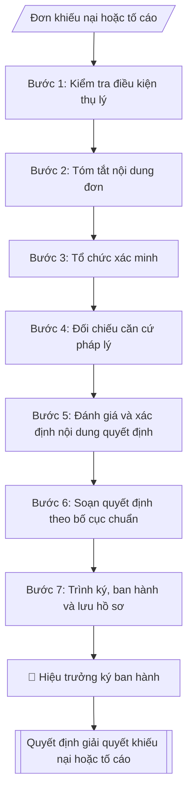

# Soạn quyết định giải quyết khiếu nại / tố cáo

## Định dạng và file đầu ra

Định dạng đầu ra có thể chọn theo sản phẩm/yêu cầu: .docx, .pdf. Đọc mục “Định dạng bổ sung” trong quy cách đầu ra trước khi chọn.

**Phải tạo file thực tế để tải xuống, không chỉ trả nội dung trong chat.** Định dạng mặc định của skill: **.docx**. Nếu có bảng số liệu nghiệp vụ yêu cầu file bảng tính riêng, tạo thêm Excel theo yêu cầu; không tự tạo file kiểm tra. Không chờ người dùng yêu cầu xuất file lần nữa. Ưu tiên định dạng người dùng chỉ định; đọc quy tắc xuất file tại references/quy-cach-dau-ra.md.

## Quy cách đầu ra và thông tin thiếu
Khi dựng file Word/Excel, áp dụng mục “Thể thức và bảng biểu khi dựng file” trong quy cách đầu ra (cỡ chữ từng thành phần, bảng nhiều trang, số trang, phụ lục). Đọc [quy cách và cấu trúc sản phẩm](references/quy-cach-dau-ra.md) trước khi soạn/xuất. File giao chỉ gồm sản phẩm nghiệp vụ được yêu cầu; kiểm tra nội bộ không xuất kèm. Thiếu thông tin thì giữ nguyên trường/mục và chỗ điền theo mẫu gốc (dòng dấu chấm, dấu gạch hoặc ô trống); không tự điền dữ liệu mẫu, số 0, mã chờ xác minh hay dòng chờ ký. Mẫu chuyên ngành còn áp dụng được ưu tiên về cấu trúc, mã biểu và người ký. Bản đầy đủ: [quy tắc chung](references/quy-tac-chung.md).

Khi người dùng yêu cầu bộ slide (.pptx), đọc mục “Xuất PowerPoint (.pptx) khi được yêu cầu” trong quy cách đầu ra.

## Kiểm soát áp dụng và phê duyệt
Trước khi chạy, xác định `ngay_ap_dung`, `loai_hinh_truong`, `quy_che_noi_bo`, `nguon_du_lieu`, `nguoi_kiem_duyet`; chỉ hỏi thông tin liên quan nghiệp vụ, không dùng giá trị giả định thay dữ liệu bắt buộc. Đối chiếu căn cứ pháp lý với văn bản gốc, hiệu lực, điều khoản áp dụng và chuyển tiếp. Bản đầy đủ: [quy tắc chung](references/quy-tac-chung.md).

## Giới hạn và human gate
AI hỗ trợ chuẩn bị và đối chiếu; cán bộ phụ trách kiểm tra dữ liệu/căn cứ, người có thẩm quyền duyệt và ký. Không đánh dấu đã ký, đã duyệt, đã công bố khi chưa có chứng cứ. Dữ liệu sinh viên, sức khỏe, nhân sự, tài chính chỉ dùng theo mục đích và phân quyền, che thông tin định danh khi dùng ví dụ (Luật 91/2025/QH15, hiệu lực 01/01/2026); không tải dữ liệu lên dịch vụ ngoài khi chưa có quyền. Bản đầy đủ: [quy tắc chung](references/quy-tac-chung.md).

## Khi nào dùng
Khi cần ban hành quyết định giải quyết khiếu nại lần đầu hoặc kết luận nội dung tố cáo
thuộc thẩm quyền của Hiệu trưởng: sau khi đã thụ lý, tổ chức xác minh và có báo cáo
xác minh đầy đủ.

## Đầu vào (Input)

| Trường | Mô tả | Bắt buộc |
|---|---|---|
| `loai_don` | Khiếu nại / Tố cáo | Có |
| `nguoi_kn_tc` | Họ tên, chức vụ/đơn vị, địa chỉ người khiếu nại hoặc người tố cáo | Có |
| `tom_tat_don` | Tóm tắt nội dung đơn: khiếu nại/tố cáo về việc gì, yêu cầu gì | Có |
| `quyet_dinh_bi_kn` | Quyết định hành chính bị khiếu nại (số, ký hiệu, ngày, nội dung chính) | Không (bắt buộc nếu là khiếu nại) |
| `qua_trinh_xac_minh` | Các bước đã thực hiện: thụ lý, thành lập tổ xác minh, làm việc các bên, kết quả xác minh | Có |
| `can_cu_phap_ly` | Luật Khiếu nại 2011 / Luật Tố cáo 2018, văn bản hướng dẫn và quy định nội bộ liên quan | Có |
| `noi_dung_quyet_dinh` | Giữ nguyên / sửa đổi, hủy bỏ một phần hoặc toàn bộ quyết định bị khiếu nại; công nhận toàn bộ/một phần hoặc bác khiếu nại; kết luận tố cáo đúng/sai | Có |
| `quyen_kn_tiep` | Hướng dẫn quyền khiếu nại lần hai / khởi kiện vụ án hành chính | Có |

## Quy trình

**Bước 1. Kiểm tra điều kiện thụ lý**
- Làm gì: kiểm tra từng điều kiện: đơn có đủ họ tên, địa chỉ, nội dung rõ ràng; còn thời hiệu khiếu nại/tố cáo theo luật; vụ việc thuộc thẩm quyền giải quyết của Hiệu trưởng (không thuộc thẩm quyền cơ quan khác, không đang được tòa án thụ lý).
- Dùng input: `loai_don`, `nguoi_kn_tc`, `tom_tat_don`.
- Vai trò: Chuyên viên Phòng Thanh tra – Pháp chế · AI hỗ trợ: đối chiếu tự động, cảnh báo sai lệch · ⏱ ~1–2 giờ (ước tính)
- Lưu ý nghiệp vụ: nếu không đủ điều kiện thì trả đơn kèm văn bản hướng dẫn, không im lặng; bảo mật thông tin người tố cáo ngay từ khâu tiếp nhận.
- → Kết quả bước: Phiếu kiểm tra điều kiện thụ lý (đủ / không đủ + lý do).

**Bước 2. Tóm tắt nội dung đơn**
- Làm gì: trích rõ 3 yếu tố: người khiếu nại/tố cáo là ai; khiếu nại/tố cáo về việc gì (quyết định hành chính nào / hành vi nào); yêu cầu cụ thể gì.
- Dùng input: `nguoi_kn_tc`, `tom_tat_don`, `quyet_dinh_bi_kn` (bắt buộc nếu là khiếu nại).
- Vai trò: Chuyên viên Phòng Thanh tra – Pháp chế · AI hỗ trợ: xử lý sơ bộ, tổng hợp · ⏱ ~1–2 giờ (ước tính)
- Lưu ý nghiệp vụ: tóm tắt trung thực, không thêm bớt ý của người khiếu nại; nếu đơn chưa rõ thì yêu cầu bổ sung trước khi xác minh, không xác minh theo suy đoán.
- → Kết quả bước: Bản tóm tắt nội dung đơn.

**Bước 3. Tổ chức xác minh**
- Làm gì: thành lập tổ xác minh; làm việc với người khiếu nại/tố cáo, đơn vị, cá nhân liên quan; thu thập hồ sơ, chứng cứ; lập báo cáo kết quả xác minh nêu rõ sự việc đúng/sai ở mức nào.
- Dùng input: `qua_trinh_xac_minh`.
- Vai trò: Tổ xác minh · AI hỗ trợ: tổng hợp, chuẩn hóa dữ liệu, đối chiếu tự động, cảnh báo sai lệch · ⏱ ~1–2 giờ (ước tính)
- Lưu ý nghiệp vụ: bảo vệ bí mật người tố cáo trong suốt quá trình; mọi buổi làm việc phải có biên bản; chứng cứ phải được thu thập hợp pháp mới có giá trị.
- → Kết quả bước: Báo cáo kết quả xác minh.

**Bước 4. Đối chiếu căn cứ pháp lý**
- Làm gì: đối chiếu sự việc đã xác minh với căn cứ pháp lý tương ứng: Luật Khiếu nại 2011 + Nghị định 124/2020/NĐ-CP (đối với khiếu nại) hoặc Luật Tố cáo 2018 + Nghị định 31/2019/NĐ-CP (đối với tố cáo), cùng các quy định nội bộ liên quan.
- Dùng input: `can_cu_phap_ly`, `loai_don`.
- Vai trò: Chuyên viên Phòng Thanh tra – Pháp chế · AI hỗ trợ: đối chiếu tự động, cảnh báo sai lệch · ⏱ ~1–2 giờ (ước tính)
- Lưu ý nghiệp vụ: kiểm tra văn bản viện dẫn còn hiệu lực; áp đúng luật theo loại đơn, không lẫn lộn khiếu nại với tố cáo.
- → Kết quả bước: Bảng đối chiếu sự việc – căn cứ pháp lý.

**Bước 5. Đánh giá và xác định nội dung quyết định**
- Làm gì: đánh giá mức độ: khiếu nại đúng toàn bộ / đúng một phần / sai; tố cáo đúng / sai / đúng một phần; xác định trách nhiệm tập thể, cá nhân và biện pháp khắc phục; chốt nội dung quyết định (giữ nguyên / sửa đổi / hủy bỏ / công nhận / bác).
- Dùng input: `noi_dung_quyet_dinh` (kết hợp kết quả Bước 3, 4).
- Vai trò: Trưởng phòng Thanh tra – Pháp chế (đánh giá, chốt nội dung quyết định) · AI hỗ trợ: xử lý sơ bộ, tổng hợp · ⏱ ~1–2 giờ (ước tính)
- Lưu ý nghiệp vụ: nội dung quyết định phải tương ứng với mức độ đúng/sai đã đánh giá; biện pháp khắc phục phải khả thi, có thời hạn cụ thể.
- → Kết quả bước: Bản đánh giá + nội dung quyết định đã chốt.

**Bước 6. Soạn quyết định theo bố cục chuẩn**
- Làm gì: soạn văn bản theo bố cục: phần căn cứ → Điều 1. Tóm tắt nội dung khiếu nại/tố cáo → Điều 2. Quá trình xác minh → Điều 3. Căn cứ giải quyết → Điều 4. Nội dung quyết định → Điều 5. Quyền khiếu nại tiếp/khởi kiện → Điều 6. Hiệu lực thi hành → nơi nhận, chữ ký.
- Dùng input: `quyen_kn_tiep`, `nguoi_kn_tc`.
- Vai trò: Chuyên viên Phòng Thanh tra – Pháp chế · AI hỗ trợ: soạn dự thảo, đối chiếu tự động, cảnh báo sai lệch · ⏱ ~1–2 giờ (ước tính)
- Lưu ý nghiệp vụ: quyết định giải quyết khiếu nại lần đầu BẮT BUỘC ghi rõ quyền khiếu nại lần hai và quyền khởi kiện; thời hạn, tên cơ quan cấp trên/tòa án ghi chính xác.
- → Kết quả bước: Dự thảo Quyết định giải quyết.

**Bước 7. Trình ký, ban hành và lưu hồ sơ**
- Làm gì: trình Hiệu trưởng ký; gửi quyết định đến người khiếu nại/tố cáo, đơn vị, cá nhân liên quan; lưu toàn bộ hồ sơ giải quyết theo quy định; theo dõi việc thực hiện biện pháp khắc phục.
- Dùng input: (kết quả Bước 6).
- Vai trò: Chuyên viên Phòng Thanh tra – Pháp chế (chuẩn bị hồ sơ trình); Hiệu trưởng (người ký) ban hành · AI hỗ trợ: chuẩn bị hồ sơ trình đầy đủ, lưu trữ hồ sơ · ⏱ ~1–3 giờ (ước tính)
- Lưu ý nghiệp vụ: bảo đảm thời hạn giải quyết theo luật định; hồ sơ phải đầy đủ để phục vụ giải quyết lần hai hoặc khởi kiện.
- → Kết quả bước: Quyết định đã ban hành + hồ sơ giải quyết hoàn chỉnh.

## Luồng quy trình (Workflow)


```

## Đầu ra

File nghiệp vụ thực tế theo định dạng mặc định ở đầu skill hoặc định dạng người dùng yêu cầu, kèm liên kết tải trong phản hồi cuối.

Sản phẩm nghiệp vụ hoàn chỉnh theo [quy cách và cấu trúc](references/quy-cach-dau-ra.md), giữ các trường chưa có dữ liệu ở trạng thái trống. Không xuất kèm checklist/phụ lục kiểm tra đầu ra.

## Kiểm tra nội bộ trước khi giao

- [ ] Bố cục khớp mẫu áp dụng và cấu trúc tại references/quy-cach-dau-ra.md.
- [ ] Có đầy đủ sản phẩm: Quyết định giải quyết khiếu nại / kết luận nội dung tố cáo hoàn chỉnh
- [ ] Có đầy đủ sản phẩm: Tóm tắt kết quả: khiếu nại đúng/sai mức nào, biện pháp khắc phục, thời hạn thực hiện
- [ ] Mọi số liệu, tên, ngày tháng trong output khớp với Input đã cung cấp (không thêm bớt, không suy đoán)
- [ ] Không bịa đặt số liệu, minh chứng, trích dẫn hay căn cứ
- [ ] Đúng thể thức, định dạng văn bản theo quy định hiện hành
- [ ] Căn cứ pháp lý nêu đầy đủ, còn hiệu lực tại thời điểm lập
- [ ] Đã qua Human gate: người có thẩm quyền đã kiểm tra/ký duyệt trước khi phát hành
- [ ] Nếu không đủ điều kiện thì trả đơn kèm văn bản hướng dẫn, không im lặng
- [ ] Tóm tắt trung thực, không thêm bớt ý của người khiếu nại

> Tiêu chí đạt: tất cả các ô đều được đánh dấu.

## Căn cứ & lưu ý
- Luật Khiếu nại 2011 (Luật số 02/2011/QH13); Nghị định 124/2020/NĐ-CP.
- Luật Tố cáo 2018 (Luật số 25/2018/QH14); Nghị định 31/2019/NĐ-CP quy định chi tiết
thi hành Luật Tố cáo.
- Phải bảo đảm thời hạn giải quyết theo luật định; bảo vệ bí mật thông tin người tố cáo.
- Quyết định giải quyết khiếu nại lần đầu phải ghi rõ quyền khiếu nại lần hai và quyền
khởi kiện để người khiếu nại thực hiện.
- Không dùng tên thật của trường/cá nhân khi mô phỏng.

## Quản trị phiên bản
- Phiên bản gói `1.3.2` (cập nhật 2026-10-10); hồ sơ đầy đủ tại [references/version.json](references/version.json).
- Người phê duyệt nghiệp vụ: **chưa chỉ định**. Trạng thái: dự thảo nghiệp vụ; kiểm tra pháp lý trước thực thi. Ngày cập nhật không đồng nghĩa mọi văn bản đã được rà soát toàn văn.
- Giấy phép theo LICENSE của kho (bản quyền CES Global). Lịch sử thay đổi: CHANGELOG.md.
