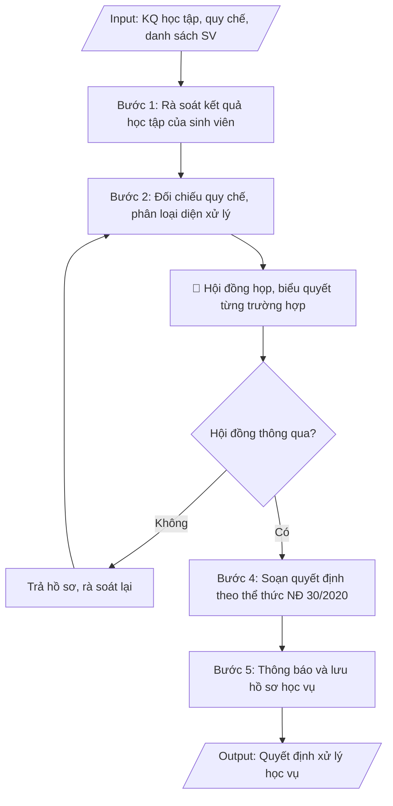

# Skill: Soạn quyết định xử lý học vụ

## Khi nào dùng
Khi kết thúc mỗi học kỳ hoặc năm học, cần rà soát kết quả học tập của sinh viên và ban hành
quyết định xử lý học vụ đối với các trường hợp: cảnh báo học vụ, buộc thôi học, cho phép
bảo lưu kết quả học tập, cho phép chuyển trường — theo quy chế đào tạo của trường.

## Đầu vào (Input)

| Trường | Mô tả | Bắt buộc |
|---|---|---|
| `loai_xu_ly` | Cảnh báo học vụ / Buộc thôi học / Bảo lưu / Chuyển trường | Có |
| `hoc_ky` | Học kỳ, năm học áp dụng (ví dụ: Học kỳ 1 năm học 2026–2027) | Có |
| `danh_sach_sv` | Danh sách SV đủ điều kiện từng diện (mã SV, họ tên, lớp, ngành, lý do) | Có |
| `can_cu_quy_che` | Điều, khoản cụ thể của quy chế đào tạo áp dụng cho từng diện | Có |
| `bien_ban_hoi_dong` | Biên bản họp hội đồng xem xét xử lý học vụ (số, ngày họp, kết luận) | Có |
| `nguoi_ky` | Hiệu trưởng / Phó Hiệu trưởng phụ trách đào tạo | Có |
| `so_quyet_dinh` | Số quyết định (nếu đã cấp số; nếu chưa, để trống để điền khi ban hành) | Không |

## Quy trình

**Bước 1. Rà soát kết quả học tập của sinh viên**
- Làm gì: trích xuất từ hệ thống quản lý đào tạo của từng SV: điểm trung bình chung học kỳ/năm học,
  số tín chỉ đã tích lũy, số tín chỉ còn nợ, tổng thời gian đã học so với thời gian đào tạo tối đa;
  đối chiếu thêm hồ sơ kỷ luật (đình chỉ học tập) nếu có.
- Dùng input: `hoc_ky`, `danh_sach_sv`
- Vai trò: Chuyên viên Phòng Đào tạo · AI hỗ trợ: trích xuất và đối chiếu số liệu tự động từ hệ thống · ⏱ ~45 phút (ước tính)
- Lưu ý nghiệp vụ: số liệu phải chốt tại thời điểm kết thúc học kỳ/năm học và ghi rõ thời điểm chốt
  để hội đồng đối chiếu; loại khỏi danh sách rà soát các SV đã bảo lưu/thôi học trước đó.
- → Kết quả bước: bảng số liệu kết quả học tập chi tiết từng SV (mã SV, họ tên, lớp, ngành,
  ĐTB học kỳ, tín chỉ tích lũy/nợ, thời gian đào tạo còn lại).

**Bước 2. Đối chiếu quy chế, phân loại diện xử lý**
- Làm gì: áp từng dòng số liệu ở Bước 1 vào các điều, khoản của quy chế đào tạo; phân loại SV vào
  4 diện: cảnh báo học vụ, buộc thôi học, bảo lưu, chuyển trường; ghi rõ điều, khoản áp dụng cho
  từng trường hợp.
- Dùng input: `danh_sach_sv`, `can_cu_quy_che`, `loai_xu_ly`
- Vai trò: Chuyên viên Phòng Đào tạo · AI hỗ trợ: phân loại sơ bộ theo quy chế, cảnh báo trường hợp chưa khớp · ⏱ ~1 giờ (ước tính)
- Lưu ý nghiệp vụ: cảnh báo học vụ khi ĐTB học kỳ dưới ngưỡng quy định (thường < 2.00) hoặc nợ quá
  số tín chỉ cho phép; buộc thôi học khi vượt số lần cảnh báo quy định hoặc quá thời gian đào tạo
  tối đa; bảo lưu/chuyển trường chỉ áp dụng khi có đơn của SV với lý do chính đáng và đủ điều kiện;
  không gộp SV thuộc các diện khác nhau vào cùng một quyết định.
- → Kết quả bước: danh sách SV phân loại theo từng diện xử lý, kèm điều/khoản quy chế áp dụng
  cho từng trường hợp.

**Bước 3. Hội đồng xem xét, biểu quyết từng trường hợp**
- Làm gì: Phòng Đào tạo trình danh sách đã phân loại kèm hồ sơ minh chứng (bảng điểm, đơn của SV,
  hồ sơ kỷ luật) lên hội đồng xử lý học vụ; hội đồng họp, thảo luận và biểu quyết từng trường hợp;
  thư ký lập biên bản ghi kết luận từng trường hợp.
- Dùng input: `bien_ban_hoi_dong`, `danh_sach_sv`, `loai_xu_ly`
- Vai trò: Hội đồng xử lý học vụ · AI hỗ trợ: chuẩn bị tài liệu, tổng hợp hồ sơ minh chứng trước phiên họp · ⏱ ~1 buổi (ước tính)
- Lưu ý nghiệp vụ: đây là Human gate — chỉ các trường hợp được hội đồng thông qua mới được đưa
  vào quyết định; biên bản phải ghi rõ số, ngày họp và kết luận từng trường hợp; trường hợp không
  thông qua thì trả hồ sơ, rà soát lại từ Bước 2.
- → Kết quả bước: biên bản họp hội đồng xử lý học vụ (số, ngày họp, kết luận từng trường hợp) —
  căn cứ pháp lý bắt buộc của quyết định.

**Bước 4. Soạn quyết định theo thể thức NĐ 30/2020**
- Làm gì: soạn quyết định gồm: quốc hiệu – tiêu ngữ, tên cơ quan, số/ký hiệu quyết định, địa danh –
  ngày tháng năm ban hành, tên loại + trích yếu, phần căn cứ (quy chế đào tạo, biên bản hội đồng,
  đề nghị của Trưởng phòng Đào tạo), các điều khoản (Điều 1: xử lý đối với danh sách SV kèm theo;
  Điều 2: nghĩa vụ của SV; Điều 3: trách nhiệm thi hành), danh sách SV kèm theo, nơi nhận, chữ ký
  người có thẩm quyền.
- Dùng input: `loai_xu_ly`, `hoc_ky`, `danh_sach_sv`, `can_cu_quy_che`, `bien_ban_hoi_dong`,
  `nguoi_ky`, `so_quyet_dinh`
- Vai trò: Chuyên viên Phòng Đào tạo · AI hỗ trợ: soạn dự thảo đúng thể thức NĐ 30/2020, kiểm tra căn cứ · ⏱ ~30 phút (ước tính)
- Lưu ý nghiệp vụ: kiểm tra thẩm quyền ký (Hiệu trưởng hoặc Phó Hiệu trưởng được ủy quyền);
  danh sách SV trong quyết định phải khớp 100% với biên bản hội đồng; nếu chưa cấp số quyết định
  thì để trống để điền khi ban hành.
- → Kết quả bước: dự thảo quyết định xử lý học vụ đúng thể thức NĐ 30/2020, kèm danh sách SV
  theo từng diện.

**Bước 5. Thông báo và lưu hồ sơ học vụ**
- Làm gì: gửi quyết định đã ký đến từng SV, cố vấn học tập, khoa quản lý SV và các đơn vị liên quan
  (Phòng CTSV; Phòng TC-KT nếu liên quan học phí/học bổng); cập nhật trạng thái học vụ vào hồ sơ
  SV trên hệ thống; lưu hồ sơ (quyết định + biên bản + minh chứng) theo quy định lưu trữ.
- Dùng input: `danh_sach_sv`, `loai_xu_ly`
- Vai trò: Chuyên viên Phòng Đào tạo · AI hỗ trợ: soạn mẫu thông báo gửi SV và đơn vị liên quan · ⏱ ~1 giờ (ước tính)
- Lưu ý nghiệp vụ: đảm bảo SV được thông báo và biết quyền khiếu nại theo quy định; quyết định
  buộc thôi học phải lưu bản chính vào hồ sơ SV; cập nhật hệ thống ngay để các đơn vị liên quan
  đồng bộ trạng thái.
- → Kết quả bước: quyết định đã được gửi đến các bên liên quan; hồ sơ học vụ SV đã cập nhật và
  lưu trữ đầy đủ.

## Luồng quy trình (Workflow)


## Đầu ra (Output)
- Quyết định xử lý học vụ hoàn chỉnh (đúng thể thức), kèm danh sách SV theo từng diện.
- Checklist kiểm tra: căn cứ pháp lý đầy đủ, danh sách khớp biên bản hội đồng, thẩm quyền ký, nơi nhận.

**Cấu trúc output chuẩn:** khung mẫu cố định của quyết định xử lý học vụ, các phần theo đúng thứ tự:
1. Phần đầu văn bản: quốc hiệu – tiêu ngữ; tên cơ quan ban hành; số, ký hiệu quyết định;
   địa danh, ngày tháng năm ban hành.
2. Tên loại và trích yếu: "QUYẾT ĐỊNH" + "Về việc…" (ghi rõ diện xử lý và học kỳ/năm học).
3. Thẩm quyền ban hành: chức danh người ký (HIỆU TRƯỞNG / KT. HIỆU TRƯỞNG – PHÓ HIỆU TRƯỞNG).
4. Phần căn cứ: quy chế đào tạo (điều, khoản cụ thể); biên bản họp hội đồng xử lý học vụ
   (số, ngày họp); đề nghị của Trưởng phòng Đào tạo.
5. Phần quyết định: Điều 1 (xử lý đối với các SV có tên trong danh sách kèm theo, ghi rõ
   diện xử lý và căn cứ điều khoản); Điều 2 (nghĩa vụ của SV sau xử lý); Điều 3 (trách nhiệm
   thi hành).
6. Phần cuối: nơi nhận; chữ ký, họ tên người ký.
7. Phụ lục kèm theo: danh sách SV theo từng diện (STT, mã SV, họ tên, lớp, ngành, ĐTB học kỳ, lý do).


## Checklist nghiệm thu
- [ ] Đủ các phần theo "Cấu trúc output chuẩn": phần đầu văn bản; tên loại + trích yếu; thẩm quyền ban hành; phần căn cứ; 3 điều khoản quyết định; nơi nhận, chữ ký; phụ lục danh sách SV theo từng diện.
- [ ] Số liệu/nội dung trong output khớp với Input đã cho (mã SV, họ tên, lớp, ngành, ĐTB học kỳ, học kỳ áp dụng).
- [ ] Không bịa đặt số liệu, minh chứng, trích dẫn.
- [ ] Đúng thể thức văn bản hành chính theo Nghị định 30/2020/NĐ-CP (quốc hiệu, số/ký hiệu, nơi nhận, chữ ký).
- [ ] Căn cứ pháp lý đầy đủ, còn hiệu lực (Thông tư 08/2021/TT-BGDĐT, quy chế đào tạo của trường, biên bản họp hội đồng).
- [ ] Đã qua Human gate: hội đồng xử lý học vụ đã họp, biểu quyết từng trường hợp; người có thẩm quyền (Hiệu trưởng/Phó Hiệu trưởng) đã ký duyệt.
- [ ] Không gộp SV thuộc các diện xử lý khác nhau vào cùng một quyết định; mỗi trường hợp ghi rõ điều/khoản quy chế áp dụng.
- [ ] Danh sách SV trong quyết định khớp 100% với biên bản họp hội đồng; SV đã bảo lưu/thôi học trước đó đã loại khỏi danh sách rà soát.
- [ ] SV đã được thông báo quyết định và biết quyền khiếu nại; quyết định buộc thôi học đã lưu bản chính vào hồ sơ SV.
Tiêu chí đạt = tất cả các ô được đánh dấu.

## Ví dụ mô phỏng (dữ liệu giả lập)

> Tất cả tên trường, cá nhân, số liệu dưới đây đều là **giả lập**, không liên quan tổ chức/cá nhân có thật.

### Input mẫu

| Trường | Giá trị |
|---|---|
| `loai_xu_ly` | Cảnh báo học vụ |
| `hoc_ky` | Học kỳ 1 năm học 2026–2027 |
| `danh_sach_sv` | 1. Phạm Văn B — MSSV 202400123 — Lớp CNTT-K18 — Ngành CNTT — ĐTB HK 1.75. 2. Bùi Thị B — MSSV 202400456 — Lớp KT-K18 — Ngành Kế toán — ĐTB HK 1.90. |
| `can_cu_quy_che` | Điều 12 Quy chế đào tạo trình độ đại học của Trường Đại học A (ban hành kèm Quyết định số 88/QĐ-ĐHA ngày 15/08/2022) |
| `bien_ban_hoi_dong` | Biên bản họp Hội đồng xử lý học vụ ngày 20/01/2027 |
| `nguoi_ky` | Phó Hiệu trưởng |

### Output mẫu

```
TRƯỜNG ĐẠI HỌC A            CỘNG HÒA XÃ HỘI CHỦ NGHĨA VIỆT NAM
       Số: 56/QĐ-ĐHA-ĐT                   Độc lập – Tự do – Hạnh phúc
                                                 Thành phố C, ngày 22 tháng 01 năm 2027

                                  QUYẾT ĐỊNH
                    Về việc cảnh báo học vụ học kỳ 1 năm học 2026–2027

HIỆU TRƯỞNG TRƯỜNG ĐẠI HỌC A

Căn cứ Quy chế đào tạo trình độ đại học ban hành kèm theo Thông tư số 08/2021/TT-BGDĐT
ngày 18 tháng 3 năm 2021 của Bộ trưởng Bộ Giáo dục và Đào tạo;
Căn cứ Quy chế đào tạo trình độ đại học của Trường Đại học A ban hành kèm theo
Quyết định số 88/QĐ-ĐHA ngày 15 tháng 8 năm 2022 của Hiệu trưởng Trường Đại học A;
Căn cứ Biên bản họp Hội đồng xử lý học vụ ngày 20 tháng 01 năm 2027;
Theo đề nghị của Trưởng phòng Đào tạo,

                                  QUYẾT ĐỊNH:

Điều 1. Cảnh báo học vụ đối với 02 sinh viên có kết quả học tập học kỳ 1 năm học 2026–2027
dưới mức quy định tại Điều 12 Quy chế đào tạo của Trường (danh sách kèm theo).

Điều 2. Các sinh viên có tên trong danh sách phải liên hệ cố vấn học tập để được hướng dẫn
kế hoạch học tập; nếu tiếp tục vi phạm sẽ bị xử lý ở mức cao hơn theo quy định.

Điều 3. Trưởng phòng Đào tạo, Trưởng các khoa, cố vấn học tập và các sinh viên có tên
trong danh sách chịu trách nhiệm thi hành Quyết định này./.

Nơi nhận:                                          KT. HIỆU TRƯỞNG
- Như Điều 3;                                      PHÓ HIỆU TRƯỞNG
- Lưu: VT, ĐT.
                                                         (đã ký)

                                                PGS.TS. Trần Văn B

DANH SÁCH SINH VIÊN BỊ CẢNH BÁO HỌC VỤ
(Kèm theo Quyết định số 56/QĐ-ĐHA-ĐT ngày 22/01/2027)

| STT | Mã SV | Họ và tên | Lớp | Ngành | ĐTB học kỳ | Lý do |
|---|---|---|---|---|---|---|
| 1 | 202400123 | Phạm Văn B | CNTT-K18 | Công nghệ thông tin | 1.75 | ĐTB HK < 2.00 (lần 1) |
| 2 | 202400456 | Bùi Thị B | KT-K18 | Kế toán | 1.90 | ĐTB HK < 2.00 (lần 1) |
```

### Checklist kiểm tra (output kèm theo)
- [x] Căn cứ pháp lý: TT 08/2021/TT-BGDĐT + Quy chế đào tạo của trường + Biên bản hội đồng
- [x] Danh sách SV khớp với biên bản hội đồng (02 SV)
- [x] Thể thức quyết định đúng NĐ 30/2020 (quốc hiệu, số/ký hiệu, nơi nhận, chữ ký)
- [x] Thẩm quyền ký phù hợp (Phó Hiệu trưởng thừa ủy quyền)
- [x] Nơi nhận đầy đủ (đơn vị thi hành + lưu)

## Căn cứ & lưu ý
- Thông tư 08/2021/TT-BGDĐT (Quy chế đào tạo trình độ đại học) và Quy chế đào tạo nội bộ của trường.
- Nghị định 30/2020/NĐ-CP về công tác văn thư (thể thức quyết định).
- Quyết định xử lý học vụ ảnh hưởng trực tiếp đến quyền lợi SV: phải có biên bản hội đồng,
  đảm bảo SV được thông báo và có quyền khiếu nại theo quy định.
- Khi mô phỏng không dùng tên thật của trường/cá nhân.
