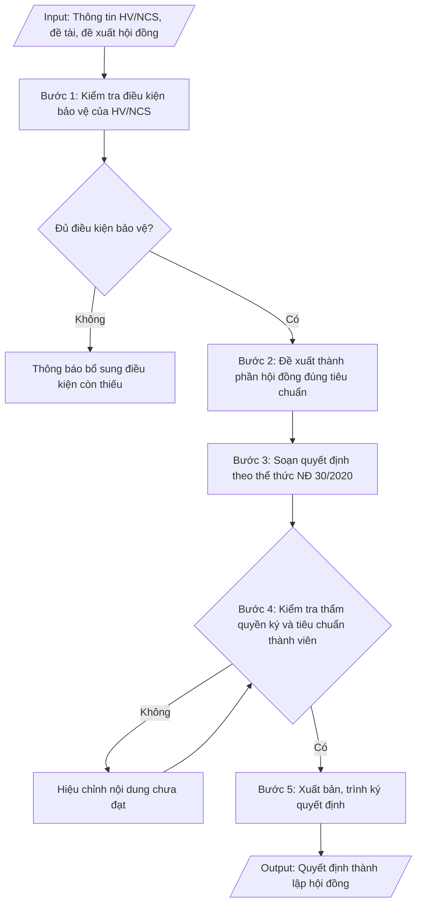

# Quyết định thành lập hội đồng bảo vệ luận văn / luận án

## Định dạng và file đầu ra

Định dạng đầu ra có thể chọn theo sản phẩm/yêu cầu: .docx, .pdf. Đọc mục “Định dạng bổ sung” trong quy cách đầu ra trước khi chọn.

**Phải tạo file thực tế để tải xuống, không chỉ trả nội dung trong chat.** Định dạng mặc định của skill: **.docx**. Nếu có bảng số liệu nghiệp vụ yêu cầu file bảng tính riêng, tạo thêm Excel theo yêu cầu; không tự tạo file kiểm tra. Không chờ người dùng yêu cầu xuất file lần nữa. Ưu tiên định dạng người dùng chỉ định; đọc quy tắc xuất file tại references/quy-cach-dau-ra.md.

## Quy cách đầu ra và thông tin thiếu
Khi dựng file Word/Excel, áp dụng mục “Thể thức và bảng biểu khi dựng file” trong quy cách đầu ra (cỡ chữ từng thành phần, bảng nhiều trang, số trang, phụ lục). Đọc [quy cách và cấu trúc sản phẩm](references/quy-cach-dau-ra.md) trước khi soạn/xuất. File giao chỉ gồm sản phẩm nghiệp vụ được yêu cầu; kiểm tra nội bộ không xuất kèm. Thiếu thông tin thì giữ nguyên trường/mục và chỗ điền theo mẫu gốc (dòng dấu chấm, dấu gạch hoặc ô trống); không tự điền dữ liệu mẫu, số 0, mã chờ xác minh hay dòng chờ ký. Mẫu chuyên ngành còn áp dụng được ưu tiên về cấu trúc, mã biểu và người ký. Bản đầy đủ: [quy tắc chung](references/quy-tac-chung.md).

Khi người dùng yêu cầu bộ slide (.pptx), đọc mục “Xuất PowerPoint (.pptx) khi được yêu cầu” trong quy cách đầu ra.

## Kiểm soát áp dụng và phê duyệt
Trước khi chạy, xác định `ngay_ap_dung`, `loai_hinh_truong`, `quy_che_noi_bo`, `nguon_du_lieu`, `nguoi_kiem_duyet`; chỉ hỏi thông tin liên quan nghiệp vụ, không dùng giá trị giả định thay dữ liệu bắt buộc. Đối chiếu căn cứ pháp lý với văn bản gốc, hiệu lực, điều khoản áp dụng và chuyển tiếp. Bản đầy đủ: [quy tắc chung](references/quy-tac-chung.md).

## Giới hạn và human gate
AI hỗ trợ chuẩn bị và đối chiếu; cán bộ phụ trách kiểm tra dữ liệu/căn cứ, người có thẩm quyền duyệt và ký. Không đánh dấu đã ký, đã duyệt, đã công bố khi chưa có chứng cứ. Dữ liệu sinh viên, sức khỏe, nhân sự, tài chính chỉ dùng theo mục đích và phân quyền, che thông tin định danh khi dùng ví dụ (Luật 91/2025/QH15, hiệu lực 01/01/2026); không tải dữ liệu lên dịch vụ ngoài khi chưa có quyền. Bản đầy đủ: [quy tắc chung](references/quy-tac-chung.md).

## Khi nào dùng
Khi học viên cao học / nghiên cứu sinh đã đủ điều kiện bảo vệ (hoàn thành học phần, đề cương được duyệt,
đủ bài báo công bố theo quy định) và cần ban hành quyết định thành lập hội đồng đánh giá luận văn thạc sĩ
hoặc luận án tiến sĩ, ấn định thời gian, địa điểm bảo vệ.

## Đầu vào (Input)

| Trường | Mô tả | Bắt buộc |
|---|---|---|
| `bac_dao_tao` | Thạc sĩ / Tiến sĩ | Có |
| `ho_ten_hv` | Họ tên học viên / NCS | Có |
| `ma_hv` | Mã học viên / NCS | Có |
| `nganh` | Ngành đào tạo | Có |
| `ten_de_tai` | Tên đề tài luận văn / luận án | Có |
| `nguoi_huong_dan` | Họ tên, học hàm/học vị người hướng dẫn | Có |
| `thanh_phan_hd` | Danh sách thành viên hội đồng: Chủ tịch, 02 phản biện, Ủy viên, Thư ký (họ tên, học hàm/học vị, đơn vị) | Có |
| `thoi_gian_dia_diem` | Ngày, giờ, địa điểm bảo vệ | Có |
| `nguoi_ky` | Hiệu trưởng / Phó Hiệu trưởng | Có |
| `so_quyet_dinh` | Số, ký hiệu quyết định (nếu có) | Không |

## Quy trình

**Bước 1. Kiểm tra điều kiện bảo vệ của HV/NCS**
- Làm gì: đối chiếu hồ sơ HV/NCS với điều kiện bảo vệ theo trình độ trước khi soạn quyết định:
  - Thạc sĩ: hoàn thành chương trình học phần; luận văn được người hướng dẫn đồng ý cho bảo vệ;
    đề cương đã được hội đồng khoa thông qua.
  - Tiến sĩ: hoàn thành học phần; bảo vệ thành công đề cương và các chuyên đề; có bài báo khoa học
    công bố theo quy định (tối thiểu 02 bài, trong đó có bài trên tạp chí khoa học); luận án được
    tập thể hướng dẫn đồng ý cho bảo vệ cấp cơ sở/trường.
- Dùng input: `bac_dao_tao`, `ho_ten_hv`, `ma_hv`, `nganh`, `ten_de_tai`, `nguoi_huong_dan`
- Vai trò: Chuyên viên Phòng Sau đại học · AI hỗ trợ: đối chiếu hồ sơ HV/NCS với điều kiện bảo vệ theo trình độ · ⏱ ~45 phút (ước tính)
- Lưu ý nghiệp vụ: thiếu bất kỳ điều kiện nào thì dừng lại, thông báo cho HV/NCS bổ sung — không
  soạn quyết định khi chưa đủ điều kiện; kiểm tra tên đề tài trên hồ sơ khớp với đề tài đã duyệt.
- → Kết quả bước: xác nhận HV/NCS đủ điều kiện bảo vệ (hoặc danh sách điều kiện còn thiếu cần
  bổ sung).

**Bước 2. Đề xuất thành phần hội đồng đúng tiêu chuẩn**
- Làm gì: lập danh sách đề xuất thành viên hội đồng theo đúng cơ cấu quy định:
  - Luận văn thạc sĩ: 05 thành viên (Chủ tịch, 02 phản biện, 02 ủy viên trong đó 01 thư ký);
    phản biện phải có trình độ TS trở lên, không phải người hướng dẫn.
  - Luận án tiến sĩ: 07 thành viên (Chủ tịch, 03 phản biện, 03 ủy viên trong đó 01 thư ký);
    Chủ tịch và phản biện phải có học hàm GS/PGS hoặc trình độ TS có uy tín trong ngành; số thành
    viên thuộc đơn vị đào tạo của NCS không quá 1/3.
  Ghi rõ họ tên, học hàm/học vị, đơn vị công tác và vai trò của từng thành viên.
- Dùng input: `bac_dao_tao`, `thanh_phan_hd`, `nguoi_huong_dan`
- Vai trò: Chuyên viên Phòng Sau đại học · AI hỗ trợ: đề xuất danh sách thành viên, kiểm tra tiêu chuẩn và xung đột lợi ích · ⏱ ~1 giờ (ước tính)
- Lưu ý nghiệp vụ: người hướng dẫn tuyệt đối không được làm phản biện hoặc chủ tịch hội đồng;
  kiểm tra xung đột lợi ích (người thân, đồng tác giả chính của NCS) khi đề xuất thành viên.
- → Kết quả bước: danh sách đề xuất thành viên hội đồng (họ tên, học hàm/học vị, đơn vị, vai trò)
  đúng cơ cấu và tiêu chuẩn.

**Bước 3. Soạn quyết định theo thể thức NĐ 30/2020**
- Làm gì: soạn quyết định theo đúng trình tự thể thức: Quốc hiệu – Tiêu ngữ → Tên trường → Số, ký
  hiệu → Địa danh, ngày tháng năm → Tên loại ("QUYẾT ĐỊNH") + trích yếu (thành lập Hội đồng đánh
  giá luận văn thạc sĩ / luận án tiến sĩ) → Căn cứ pháp lý (quy chế đào tạo, quy chế SĐH của trường,
  tờ trình đề nghị của Trưởng phòng Đào tạo SĐH) → Điều 1 (thành lập hội đồng: thông tin HV/NCS,
  đề tài, người hướng dẫn, danh sách thành viên theo vai trò) → Điều 2 (trách nhiệm hội đồng;
  thời gian, địa điểm bảo vệ) → Điều 3 (trách nhiệm thi hành, hiệu lực) → Nơi nhận → Chữ ký.
- Dùng input: `bac_dao_tao`, `ho_ten_hv`, `ma_hv`, `nganh`, `ten_de_tai`, `nguoi_huong_dan`,
  `thanh_phan_hd`, `thoi_gian_dia_diem`, `nguoi_ky`, `so_quyet_dinh`
- Vai trò: Chuyên viên Phòng Sau đại học · AI hỗ trợ: soạn dự thảo quyết định đúng thể thức · ⏱ ~30 phút (ước tính)
- Lưu ý nghiệp vụ: tên đề tài trong Điều 1 phải đặt trong ngoặc kép, khớp từng chữ với đề tài đã
  duyệt; thời gian bảo vệ ghi cả giờ, ngày, địa điểm cụ thể.
- → Kết quả bước: dự thảo quyết định thành lập hội đồng đúng thể thức NĐ 30/2020.

**Bước 4. Kiểm tra thẩm quyền ký và tiêu chuẩn thành viên**
- Làm gì: kiểm tra lần cuối trước khi trình ký: thẩm quyền ký (Hiệu trưởng hoặc Phó Hiệu trưởng);
  tiêu chuẩn từng thành viên hội đồng (trình độ, cơ cấu, không trùng người hướng dẫn làm phản
  biện/chủ tịch); thời gian bảo vệ phải sau ngày ký quyết định ít nhất 15 ngày (đối với luận án
  tiến sĩ). Nội dung chưa đạt thì hiệu chỉnh rồi kiểm tra lại.
- Dùng input: `thanh_phan_hd`, `nguoi_huong_dan`, `thoi_gian_dia_diem`, `nguoi_ky`
- Vai trò: Trưởng phòng Sau đại học · AI hỗ trợ: kiểm tra chéo thẩm quyền ký và cơ cấu hội đồng · ⏱ ~45 phút (ước tính)
- Lưu ý nghiệp vụ: bẫy thường gặp là ngày bảo vệ quá gần ngày ký quyết định (không đủ thời gian
  gửi luận án cho phản biện đọc); kiểm tra chính tả họ tên, học hàm/học vị từng thành viên.
- → Kết quả bước: dự thảo quyết định đã qua kiểm tra, đạt yêu cầu, sẵn sàng trình ký.

**Bước 5. Xuất bản, trình ký quyết định**
- Làm gì: hoàn thiện quyết định file theo định dạng đầu ra của skill; trình người có thẩm quyền ký; chuyển sang
  Word để lưu trữ và gửi đến các thành viên hội đồng, HV/NCS.
- Dùng input: `nguoi_ky`
- Vai trò: Hiệu trưởng/Phó Hiệu trưởng ký ban hành · AI hỗ trợ: chuẩn bị hồ sơ trình ký · ⏱ ~1 giờ (ước tính)
- Lưu ý nghiệp vụ: gửi quyết định đến thành viên hội đồng kèm theo luận văn/luận án (đối với phản
  biện) đủ thời gian đọc trước buổi bảo vệ.
- → Kết quả bước: quyết định thành lập hội đồng đã ký duyệt và đã gửi các bên liên quan.

## Luồng quy trình (Workflow)

## Đầu ra

File nghiệp vụ thực tế theo định dạng mặc định ở đầu skill hoặc định dạng người dùng yêu cầu, kèm liên kết tải trong phản hồi cuối.

Sản phẩm nghiệp vụ hoàn chỉnh theo [quy cách và cấu trúc](references/quy-cach-dau-ra.md), giữ các trường chưa có dữ liệu ở trạng thái trống. Không xuất kèm checklist/phụ lục kiểm tra đầu ra.

## Kiểm tra nội bộ trước khi giao
- [ ] Bố cục khớp mẫu áp dụng và cấu trúc tại references/quy-cach-dau-ra.md.
- [ ] Số liệu/nội dung trong output khớp với Input đã cho (bậc đào tạo, họ tên/mã HV-NCS, ngành, tên đề tài, người hướng dẫn, thành viên hội đồng, thời gian – địa điểm).
- [ ] Không bịa đặt số liệu, minh chứng, trích dẫn.
- [ ] Đúng thể thức văn bản hành chính theo Nghị định 30/2020/NĐ-CP; tên đề tài trong Điều 1 đặt trong ngoặc kép.
- [ ] Căn cứ pháp lý đầy đủ, còn hiệu lực (Thông tư 23/2021/TT-BGDĐT đối với thạc sĩ; Thông tư 18/2021/TT-BGDĐT đối với tiến sĩ).
- [ ] Đã qua Human gate: người có thẩm quyền (Hiệu trưởng/Phó Hiệu trưởng) đã ký quyết định.
- [ ] HV/NCS đủ mọi điều kiện bảo vệ (hoàn thành học phần, đề cương được duyệt, đủ bài báo công bố đối với NCS, người hướng dẫn đồng ý); tên đề tài khớp từng chữ với đề tài đã duyệt.
- [ ] Cơ cấu hội đồng đúng quy định (thạc sĩ 05 thành viên, tiến sĩ 07 thành viên); phản biện có trình độ TS trở lên; người hướng dẫn không làm phản biện hoặc chủ tịch.
- [ ] Không có xung đột lợi ích (người thân, đồng tác giả chính của NCS) trong thành phần hội đồng; chính tả họ tên, học hàm/học vị từng thành viên chính xác.
- [ ] Ngày bảo vệ sau ngày ký quyết định ít nhất 15 ngày (đối với luận án tiến sĩ); giờ, ngày, địa điểm ghi cụ thể; quyết định đã gửi đến thành viên hội đồng kèm luận văn/luận án cho phản biện đủ thời gian đọc.
Tiêu chí đạt = tất cả các ô được đánh dấu.

## Căn cứ & lưu ý
- Thông tư 23/2021/TT-BGDĐT (Quy chế đào tạo trình độ thạc sĩ); Thông tư 18/2021/TT-BGDĐT
  (Quy chế tuyển sinh và đào tạo trình độ tiến sĩ); Nghị định 30/2020/NĐ-CP (thể thức văn bản).
- Luận án tiến sĩ: hội đồng 07 thành viên, ít nhất 02 phản biện ngoài trường;
  công bố luận án tóm tắt trước bảo vệ theo quy định.
- Người hướng dẫn không tham gia hội đồng với tư cách phản biện hoặc chủ tịch.
- Không dùng tên thật của trường/cá nhân khi mô phỏng.

## Quản trị phiên bản
- Phiên bản gói `1.3.2` (cập nhật 2026-10-10); hồ sơ đầy đủ tại [references/version.json](references/version.json).
- Người phê duyệt nghiệp vụ: **chưa chỉ định**. Trạng thái: dự thảo nghiệp vụ; kiểm tra pháp lý trước thực thi. Ngày cập nhật không đồng nghĩa mọi văn bản đã được rà soát toàn văn.
- Giấy phép theo LICENSE của kho (bản quyền CES Global). Lịch sử thay đổi: CHANGELOG.md.
