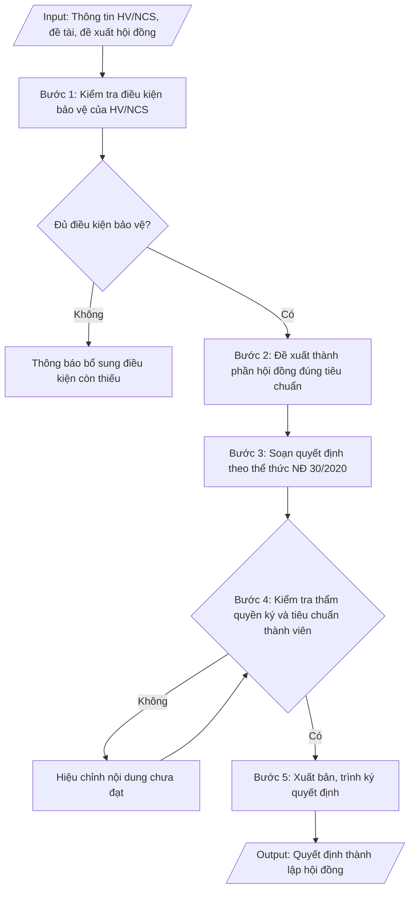

# Skill: Quyết định thành lập hội đồng bảo vệ luận văn / luận án

## Khi nào dùng
Khi học viên cao học / nghiên cứu sinh đã đủ điều kiện bảo vệ (hoàn thành học phần, đề cương được duyệt,
đủ bài báo công bố theo quy định) và cần ban hành quyết định thành lập hội đồng đánh giá luận văn thạc sĩ
hoặc luận án tiến sĩ, ấn định thời gian, địa điểm bảo vệ.

## Đầu vào (Input)

| Trường | Mô tả | Bắt buộc |
|---|---|---|
| `bac_dao_tao` | Thạc sĩ / Tiến sĩ | Có |
| `ho_ten_hv` | Họ tên học viên / NCS | Có |
| `ma_hv` | Mã học viên / NCS | Có |
| `nganh` | Ngành đào tạo | Có |
| `ten_de_tai` | Tên đề tài luận văn / luận án | Có |
| `nguoi_huong_dan` | Họ tên, học hàm/học vị người hướng dẫn | Có |
| `thanh_phan_hd` | Danh sách thành viên hội đồng: Chủ tịch, 02 phản biện, Ủy viên, Thư ký (họ tên, học hàm/học vị, đơn vị) | Có |
| `thoi_gian_dia_diem` | Ngày, giờ, địa điểm bảo vệ | Có |
| `nguoi_ky` | Hiệu trưởng / Phó Hiệu trưởng | Có |
| `so_quyet_dinh` | Số, ký hiệu quyết định (nếu có) | Không |

## Quy trình

**Bước 1. Kiểm tra điều kiện bảo vệ của HV/NCS**
- Làm gì: đối chiếu hồ sơ HV/NCS với điều kiện bảo vệ theo trình độ trước khi soạn quyết định:
  - Thạc sĩ: hoàn thành chương trình học phần; luận văn được người hướng dẫn đồng ý cho bảo vệ;
    đề cương đã được hội đồng khoa thông qua.
  - Tiến sĩ: hoàn thành học phần; bảo vệ thành công đề cương và các chuyên đề; có bài báo khoa học
    công bố theo quy định (tối thiểu 02 bài, trong đó có bài trên tạp chí khoa học); luận án được
    tập thể hướng dẫn đồng ý cho bảo vệ cấp cơ sở/trường.
- Dùng input: `bac_dao_tao`, `ho_ten_hv`, `ma_hv`, `nganh`, `ten_de_tai`, `nguoi_huong_dan`
- Vai trò: Chuyên viên Phòng Sau đại học · AI hỗ trợ: đối chiếu hồ sơ HV/NCS với điều kiện bảo vệ theo trình độ · ⏱ ~45 phút (ước tính)
- Lưu ý nghiệp vụ: thiếu bất kỳ điều kiện nào thì dừng lại, thông báo cho HV/NCS bổ sung — không
  soạn quyết định khi chưa đủ điều kiện; kiểm tra tên đề tài trên hồ sơ khớp với đề tài đã duyệt.
- → Kết quả bước: xác nhận HV/NCS đủ điều kiện bảo vệ (hoặc danh sách điều kiện còn thiếu cần
  bổ sung).

**Bước 2. Đề xuất thành phần hội đồng đúng tiêu chuẩn**
- Làm gì: lập danh sách đề xuất thành viên hội đồng theo đúng cơ cấu quy định:
  - Luận văn thạc sĩ: 05 thành viên (Chủ tịch, 02 phản biện, 02 ủy viên trong đó 01 thư ký);
    phản biện phải có trình độ TS trở lên, không phải người hướng dẫn.
  - Luận án tiến sĩ: 07 thành viên (Chủ tịch, 03 phản biện, 03 ủy viên trong đó 01 thư ký);
    Chủ tịch và phản biện phải có học hàm GS/PGS hoặc trình độ TS có uy tín trong ngành; số thành
    viên thuộc đơn vị đào tạo của NCS không quá 1/3.
  Ghi rõ họ tên, học hàm/học vị, đơn vị công tác và vai trò của từng thành viên.
- Dùng input: `bac_dao_tao`, `thanh_phan_hd`, `nguoi_huong_dan`
- Vai trò: Chuyên viên Phòng Sau đại học · AI hỗ trợ: đề xuất danh sách thành viên, kiểm tra tiêu chuẩn và xung đột lợi ích · ⏱ ~1 giờ (ước tính)
- Lưu ý nghiệp vụ: người hướng dẫn tuyệt đối không được làm phản biện hoặc chủ tịch hội đồng;
  kiểm tra xung đột lợi ích (người thân, đồng tác giả chính của NCS) khi đề xuất thành viên.
- → Kết quả bước: danh sách đề xuất thành viên hội đồng (họ tên, học hàm/học vị, đơn vị, vai trò)
  đúng cơ cấu và tiêu chuẩn.

**Bước 3. Soạn quyết định theo thể thức NĐ 30/2020**
- Làm gì: soạn quyết định theo đúng trình tự thể thức: Quốc hiệu – Tiêu ngữ → Tên trường → Số, ký
  hiệu → Địa danh, ngày tháng năm → Tên loại ("QUYẾT ĐỊNH") + trích yếu (thành lập Hội đồng đánh
  giá luận văn thạc sĩ / luận án tiến sĩ) → Căn cứ pháp lý (quy chế đào tạo, quy chế SĐH của trường,
  tờ trình đề nghị của Trưởng phòng Đào tạo SĐH) → Điều 1 (thành lập hội đồng: thông tin HV/NCS,
  đề tài, người hướng dẫn, danh sách thành viên theo vai trò) → Điều 2 (trách nhiệm hội đồng;
  thời gian, địa điểm bảo vệ) → Điều 3 (trách nhiệm thi hành, hiệu lực) → Nơi nhận → Chữ ký.
- Dùng input: `bac_dao_tao`, `ho_ten_hv`, `ma_hv`, `nganh`, `ten_de_tai`, `nguoi_huong_dan`,
  `thanh_phan_hd`, `thoi_gian_dia_diem`, `nguoi_ky`, `so_quyet_dinh`
- Vai trò: Chuyên viên Phòng Sau đại học · AI hỗ trợ: soạn dự thảo quyết định đúng thể thức · ⏱ ~30 phút (ước tính)
- Lưu ý nghiệp vụ: tên đề tài trong Điều 1 phải đặt trong ngoặc kép, khớp từng chữ với đề tài đã
  duyệt; thời gian bảo vệ ghi cả giờ, ngày, địa điểm cụ thể.
- → Kết quả bước: dự thảo quyết định thành lập hội đồng đúng thể thức NĐ 30/2020.

**Bước 4. Kiểm tra thẩm quyền ký và tiêu chuẩn thành viên**
- Làm gì: kiểm tra lần cuối trước khi trình ký: thẩm quyền ký (Hiệu trưởng hoặc Phó Hiệu trưởng);
  tiêu chuẩn từng thành viên hội đồng (trình độ, cơ cấu, không trùng người hướng dẫn làm phản
  biện/chủ tịch); thời gian bảo vệ phải sau ngày ký quyết định ít nhất 15 ngày (đối với luận án
  tiến sĩ). Nội dung chưa đạt thì hiệu chỉnh rồi kiểm tra lại.
- Dùng input: `thanh_phan_hd`, `nguoi_huong_dan`, `thoi_gian_dia_diem`, `nguoi_ky`
- Vai trò: Trưởng phòng Sau đại học · AI hỗ trợ: kiểm tra chéo thẩm quyền ký và cơ cấu hội đồng · ⏱ ~45 phút (ước tính)
- Lưu ý nghiệp vụ: bẫy thường gặp là ngày bảo vệ quá gần ngày ký quyết định (không đủ thời gian
  gửi luận án cho phản biện đọc); kiểm tra chính tả họ tên, học hàm/học vị từng thành viên.
- → Kết quả bước: dự thảo quyết định đã qua kiểm tra, đạt yêu cầu, sẵn sàng trình ký.

**Bước 5. Xuất bản, trình ký quyết định**
- Làm gì: hoàn thiện quyết định ở định dạng markdown; trình người có thẩm quyền ký; chuyển sang
  Word để lưu trữ và gửi đến các thành viên hội đồng, HV/NCS.
- Dùng input: `nguoi_ky`
- Vai trò: Hiệu trưởng/Phó Hiệu trưởng ký ban hành · AI hỗ trợ: chuẩn bị hồ sơ trình ký · ⏱ ~1 giờ (ước tính)
- Lưu ý nghiệp vụ: gửi quyết định đến thành viên hội đồng kèm theo luận văn/luận án (đối với phản
  biện) đủ thời gian đọc trước buổi bảo vệ.
- → Kết quả bước: quyết định thành lập hội đồng đã ký duyệt và đã gửi các bên liên quan.

## Luồng quy trình (Workflow)


## Đầu ra (Output)
- Quyết định thành lập hội đồng hoàn chỉnh.
- Checklist điều kiện bảo vệ + tiêu chuẩn thành viên hội đồng.

**Cấu trúc output chuẩn:** khung mẫu cố định của quyết định thành lập hội đồng đánh giá luận văn/
luận án, các phần theo đúng thứ tự:
1. Phần đầu văn bản: quốc hiệu – tiêu ngữ; tên trường; số, ký hiệu quyết định; địa danh,
   ngày tháng năm ban hành.
2. Tên loại và trích yếu: "QUYẾT ĐỊNH" + "Về việc thành lập Hội đồng đánh giá luận văn thạc sĩ /
   luận án tiến sĩ".
3. Thẩm quyền ban hành: chức danh người ký (HIỆU TRƯỞNG / KT. HIỆU TRƯỞNG – PHÓ HIỆU TRƯỞNG).
4. Phần căn cứ: quy chế đào tạo trình độ thạc sĩ (TT 23/2021) / tiến sĩ (TT 18/2021); quy chế
   đào tạo sau đại học của trường; tờ trình đề nghị của Trưởng phòng Đào tạo Sau đại học
   (số, ngày).
5. Phần quyết định: Điều 1 (thành lập hội đồng: họ tên HV/NCS, mã HV, ngành, tên đề tài trong
   ngoặc kép, người hướng dẫn, danh sách thành viên đánh số theo vai trò); Điều 2 (trách nhiệm
   của hội đồng; thời gian — giờ, ngày — và địa điểm bảo vệ); Điều 3 (trách nhiệm thi hành,
   hiệu lực kể từ ngày ký).
6. Phần cuối: nơi nhận; chữ ký, họ tên người ký.
7. Sản phẩm kèm theo: checklist điều kiện bảo vệ của HV/NCS + tiêu chuẩn thành viên hội đồng.


## Checklist nghiệm thu
- [ ] Đủ các phần theo "Cấu trúc output chuẩn": phần đầu văn bản; tên loại + trích yếu; thẩm quyền ban hành; phần căn cứ (TT 23/2021 hoặc TT 18/2021, quy chế SĐH của trường, tờ trình); Điều 1–3; nơi nhận, chữ ký; checklist điều kiện bảo vệ + tiêu chuẩn thành viên hội đồng.
- [ ] Số liệu/nội dung trong output khớp với Input đã cho (bậc đào tạo, họ tên/mã HV-NCS, ngành, tên đề tài, người hướng dẫn, thành viên hội đồng, thời gian – địa điểm).
- [ ] Không bịa đặt số liệu, minh chứng, trích dẫn.
- [ ] Đúng thể thức văn bản hành chính theo Nghị định 30/2020/NĐ-CP; tên đề tài trong Điều 1 đặt trong ngoặc kép.
- [ ] Căn cứ pháp lý đầy đủ, còn hiệu lực (Thông tư 23/2021/TT-BGDĐT đối với thạc sĩ; Thông tư 18/2021/TT-BGDĐT đối với tiến sĩ).
- [ ] Đã qua Human gate: người có thẩm quyền (Hiệu trưởng/Phó Hiệu trưởng) đã ký quyết định.
- [ ] HV/NCS đủ mọi điều kiện bảo vệ (hoàn thành học phần, đề cương được duyệt, đủ bài báo công bố đối với NCS, người hướng dẫn đồng ý); tên đề tài khớp từng chữ với đề tài đã duyệt.
- [ ] Cơ cấu hội đồng đúng quy định (thạc sĩ 05 thành viên, tiến sĩ 07 thành viên); phản biện có trình độ TS trở lên; người hướng dẫn không làm phản biện hoặc chủ tịch.
- [ ] Không có xung đột lợi ích (người thân, đồng tác giả chính của NCS) trong thành phần hội đồng; chính tả họ tên, học hàm/học vị từng thành viên chính xác.
- [ ] Ngày bảo vệ sau ngày ký quyết định ít nhất 15 ngày (đối với luận án tiến sĩ); giờ, ngày, địa điểm ghi cụ thể; quyết định đã gửi đến thành viên hội đồng kèm luận văn/luận án cho phản biện đủ thời gian đọc.
Tiêu chí đạt = tất cả các ô được đánh dấu.

## Ví dụ mô phỏng (dữ liệu giả lập)

> Tất cả tên trường, cá nhân, số liệu dưới đây đều là **giả lập**, không liên quan tổ chức/cá nhân có thật.

### Input mẫu

| Trường | Giá trị |
|---|---|
| `bac_dao_tao` | Thạc sĩ |
| `ho_ten_hv` | Hoàng Thị Yến |
| `ma_hv` | CH2024-018 |
| `nganh` | Quản trị kinh doanh |
| `ten_de_tai` | Các nhân tố ảnh hưởng đến ý định mua sắm trực tuyến của người tiêu dùng trẻ tại thành phố C |
| `nguoi_huong_dan` | PGS.TS. Ngô Thị A |
| `thanh_phan_hd` | Chủ tịch: GS.TS. Lê Văn D (Trường ĐH A); Phản biện 1: PGS.TS. Trần Văn B (Trường ĐH A); Phản biện 2: TS. Trần Văn D (Học viện Tài chính); Ủy viên: TS. Phạm Thị C (Trường ĐH A); Thư ký: ThS. Đỗ Thị A (Trường ĐH A) |
| `thoi_gian_dia_diem` | 09h00, ngày 25/10/2026, Phòng họp A2.03, Trường Đại học A |
| `nguoi_ky` | Phó Hiệu trưởng |

### Output mẫu

```
TRƯỜNG ĐẠI HỌC A             CỘNG HÒA XÃ HỘI CHỦ NGHĨA VIỆT NAM
                                           Độc lập – Tự do – Hạnh phúc
      Số: 486/QĐ-ĐHA-SĐH
                                                   Thành phố C, ngày 09 tháng 10 năm 2026

                                     QUYẾT ĐỊNH
              Về việc thành lập Hội đồng đánh giá luận văn thạc sĩ

HIỆU TRƯỞNG TRƯỜNG ĐẠI HỌC A

Căn cứ Quy chế đào tạo trình độ thạc sĩ ban hành kèm theo Thông tư số
23/2021/TT-BGDĐT ngày 30/8/2021 của Bộ trưởng Bộ Giáo dục và Đào tạo;
Căn cứ Quy chế đào tạo sau đại học của Trường Đại học A;
Căn cứ đề nghị của Trưởng phòng Đào tạo Sau đại học tại Tờ trình
số 112/TTr-SĐH ngày 05/10/2026,

                                    QUYẾT ĐỊNH:

Điều 1. Thành lập Hội đồng đánh giá luận văn thạc sĩ của học viên
Hoàng Thị Yến, mã học viên CH2024-018, ngành Quản trị kinh doanh,
đề tài: "Các nhân tố ảnh hưởng đến ý định mua sắm trực tuyến của
người tiêu dùng trẻ tại thành phố C", người hướng dẫn: PGS.TS. Ngô Thị A,
gồm các thành viên có tên sau:
1. GS.TS. Lê Văn D — Chủ tịch Hội đồng;
2. PGS.TS. Trần Văn B — Phản biện 1;
3. TS. Trần Văn D — Phản biện 2;
4. TS. Phạm Thị C — Ủy viên;
5. ThS. Đỗ Thị A — Ủy viên, Thư ký Hội đồng.

Điều 2. Hội đồng có trách nhiệm tổ chức đánh giá luận văn thạc sĩ theo
đúng quy chế hiện hành. Buổi bảo vệ được tổ chức vào hồi 09h00,
ngày 25 tháng 10 năm 2026, tại Phòng họp A2.03, Trường Đại học A.

Điều 3. Trưởng phòng Đào tạo Sau đại học, Trưởng các đơn vị có liên quan
và các thành viên có tên tại Điều 1 chịu trách nhiệm thi hành Quyết định này.
Quyết định có hiệu lực kể từ ngày ký./.

Nơi nhận:                                        KT. HIỆU TRƯỞNG
- Như Điều 3;                                    PHÓ HIỆU TRƯỞNG
- Học viên Hoàng Thị Yến;
- Lưu: VT, SĐH.                                      (đã ký)

                                                PGS.TS. Trần Văn B
```

### Checklist điều kiện & tiêu chuẩn (output kèm theo)
- [x] Học viên hoàn thành học phần, đề cương được duyệt, người HD đồng ý cho bảo vệ
- [x] Hội đồng 05 thành viên, đủ: Chủ tịch + 02 phản biện + 02 ủy viên (01 thư ký)
- [x] Phản biện có trình độ TS trở lên, không phải người hướng dẫn
- [x] Thời gian bảo vệ sau ngày ký quyết định ≥ 15 ngày
- [x] Thẩm quyền ký: Phó Hiệu trưởng (thừa ủy quyền)

## Căn cứ & lưu ý
- Thông tư 23/2021/TT-BGDĐT (Quy chế đào tạo trình độ thạc sĩ); Thông tư 18/2021/TT-BGDĐT
  (Quy chế tuyển sinh và đào tạo trình độ tiến sĩ); Nghị định 30/2020/NĐ-CP (thể thức văn bản).
- Luận án tiến sĩ: hội đồng 07 thành viên, ít nhất 02 phản biện ngoài trường;
  công bố luận án tóm tắt trước bảo vệ theo quy định.
- Người hướng dẫn không tham gia hội đồng với tư cách phản biện hoặc chủ tịch.
- Không dùng tên thật của trường/cá nhân khi mô phỏng.
