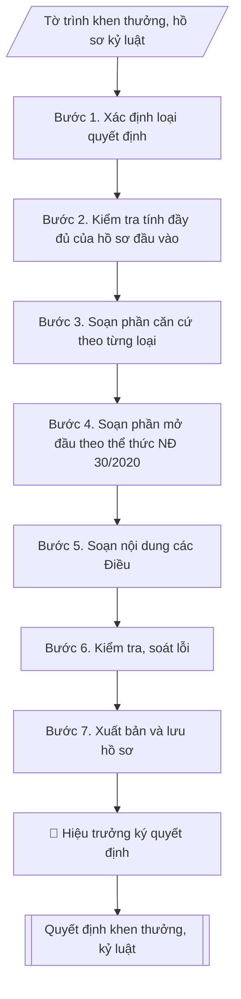

# Quyết định khen thưởng / kỷ luật viên chức

## Định dạng và file đầu ra

Định dạng đầu ra có thể chọn theo sản phẩm/yêu cầu: .docx, .pdf. Đọc mục “Định dạng bổ sung” trong quy cách đầu ra trước khi chọn.

**Phải tạo file thực tế để tải xuống, không chỉ trả nội dung trong chat.** Định dạng mặc định của skill: **.docx**. Nếu có bảng số liệu nghiệp vụ yêu cầu file bảng tính riêng, tạo thêm Excel theo yêu cầu; không tự tạo file kiểm tra. Không chờ người dùng yêu cầu xuất file lần nữa. Ưu tiên định dạng người dùng chỉ định; đọc quy tắc xuất file tại references/quy-cach-dau-ra.md.

## Quy cách đầu ra và thông tin thiếu
Khi dựng file Word/Excel, áp dụng mục “Thể thức và bảng biểu khi dựng file” trong quy cách đầu ra (cỡ chữ từng thành phần, bảng nhiều trang, số trang, phụ lục). Đọc [quy cách và cấu trúc sản phẩm](references/quy-cach-dau-ra.md) trước khi soạn/xuất. File giao chỉ gồm sản phẩm nghiệp vụ được yêu cầu; kiểm tra nội bộ không xuất kèm. Thiếu thông tin thì giữ nguyên trường/mục và chỗ điền theo mẫu gốc (dòng dấu chấm, dấu gạch hoặc ô trống); không tự điền dữ liệu mẫu, số 0, mã chờ xác minh hay dòng chờ ký. Mẫu chuyên ngành còn áp dụng được ưu tiên về cấu trúc, mã biểu và người ký. Bản đầy đủ: [quy tắc chung](references/quy-tac-chung.md).

Khi người dùng yêu cầu bộ slide (.pptx), đọc mục “Xuất PowerPoint (.pptx) khi được yêu cầu” trong quy cách đầu ra.

## Kiểm soát áp dụng và phê duyệt
Trước khi chạy, xác định `ngay_ap_dung`, `loai_hinh_truong`, `quy_che_noi_bo`, `nguon_du_lieu`, `nguoi_kiem_duyet`; chỉ hỏi thông tin liên quan nghiệp vụ, không dùng giá trị giả định thay dữ liệu bắt buộc. Đối chiếu căn cứ pháp lý với văn bản gốc, hiệu lực, điều khoản áp dụng và chuyển tiếp. Bản đầy đủ: [quy tắc chung](references/quy-tac-chung.md).

## Giới hạn và human gate
AI hỗ trợ chuẩn bị và đối chiếu; cán bộ phụ trách kiểm tra dữ liệu/căn cứ, người có thẩm quyền duyệt và ký. Không đánh dấu đã ký, đã duyệt, đã công bố khi chưa có chứng cứ. Dữ liệu sinh viên, sức khỏe, nhân sự, tài chính chỉ dùng theo mục đích và phân quyền, che thông tin định danh khi dùng ví dụ (Luật 91/2025/QH15, hiệu lực 01/01/2026); không tải dữ liệu lên dịch vụ ngoài khi chưa có quyền. Bản đầy đủ: [quy tắc chung](references/quy-tac-chung.md).

## Khi nào dùng
Khi cần ban hành quyết định chính thức về khen thưởng (Giấy khen của Hiệu trưởng, đề nghị cấp trên khen...)
hoặc kỷ luật (khiển trách, cảnh cáo, giáng chức, cách chức) đối với viên chức, người lao động —
sau khi Hội đồng thi đua – khen thưởng / Hội đồng kỷ luật đã họp, bỏ phiếu và có biên bản kết luận.

## Đầu vào (Input)

| Trường | Mô tả | Bắt buộc |
|---|---|---|
| `loai_quyet_dinh` | Khen thưởng / Kỷ luật | Có |
| `ho_ten` | Họ tên viên chức được khen thưởng / bị kỷ luật | Có |
| `chuc_vu_don_vi` | Chức vụ, đơn vị công tác hiện tại | Có |
| `hinh_thuc` | Khen thưởng: Giấy khen của Hiệu trưởng (hoặc danh hiệu đề nghị cấp trên). Kỷ luật: Khiển trách / Cảnh cáo / Giáng chức / Cách chức | Có |
| `ly_do` | Thành tích đạt được (khen thưởng) hoặc hành vi vi phạm cụ thể (kỷ luật) | Có |
| `can_cu` | Biên bản họp Hội đồng (số, ngày), kết quả bỏ phiếu, các văn bản pháp lý viện dẫn | Có |
| `muc_thuong` | Mức tiền thưởng kèm theo (nếu khen thưởng có thưởng tiền) | Không |
| `thoi_han_thi_hanh` | Thời hạn kỷ luật có hiệu lực / thời gian thi hành (mặc định: kể từ ngày ký) | Không |
| `so_quyet_dinh` | Số, ký hiệu quyết định (VD: 245/QĐ-ĐHA-TCCB) | Có |
| `ngay_ky` | Ngày ký quyết định | Có |
| `nguoi_ky` | Hiệu trưởng (hoặc người được ủy quyền) | Có |

## Quy trình

**Bước 1. Xác định loại quyết định**
- Làm gì: căn cứ `loai_quyet_dinh` để chọn nhánh xử lý: Khen thưởng hay Kỷ luật — hai loại
dùng chung khung thể thức NĐ 30/2020 nhưng khác nhau ở phần căn cứ pháp lý, nội dung các
Điều và yêu cầu lưu hồ sơ.
- Dùng input: `loai_quyet_dinh`, `hinh_thuc`.
- Vai trò: Chuyên viên Phòng TCCB · AI hỗ trợ: phân tích input, xác định yêu cầu · ⏱ ~20–45 phút (ước tính)
- Lưu ý nghiệp vụ: xác định đúng loại ngay từ đầu vì căn cứ pháp lý của kỷ luật (Luật Viên
chức, trình tự xử lý kỷ luật, thời hiệu) khắt khe hơn nhiều so với khen thưởng; nhầm loại
dẫn đến phải soạn lại toàn bộ phần căn cứ và các Điều.
- → Kết quả bước: xác nhận nhánh xử lý (khen thưởng/kỷ luật) + danh sách hồ sơ đầu vào
cần kiểm tra tương ứng.

**Bước 2. Kiểm tra tính đầy đủ của hồ sơ đầu vào**
- Làm gì:
  - Nhánh khen thưởng: kiểm tra tờ trình đề nghị của đơn vị, báo cáo thành tích có xác nhận,
    biên bản họp Hội đồng thi đua – khen thưởng (số, ngày họp), kết quả bỏ phiếu đạt tỷ lệ
    theo quy định.
  - Nhánh kỷ luật: kiểm tra biên bản họp Hội đồng kỷ luật, bản tự kiểm điểm của viên chức,
    biên bản xác minh (nếu có); đối chiếu trình tự, thủ tục và thời hiệu xử lý kỷ luật theo
    quy định công tác cán bộ.
- Dùng input: `can_cu`, `ho_ten`, `chuc_vu_don_vi`, `ly_do`, `hinh_thuc`.
- Vai trò: Chuyên viên Phòng TCCB (Trưởng phòng kiểm tra lại) · AI hỗ trợ: quét lỗi theo checklist · ⏱ ~15–30 phút (ước tính)
- Lưu ý nghiệp vụ: kỷ luật thiếu bản tự kiểm điểm hoặc quá thời hiệu xử lý thì quyết định
không có giá trị — phải dừng lại và báo cáo; khen thưởng thiếu biên bản họp Hội đồng hoặc
tỷ lệ bỏ phiếu không đạt thì chưa đủ điều kiện ban hành quyết định.
- → Kết quả bước: biên bản kiểm tra hồ sơ đầu vào (đủ điều kiện / còn thiếu gì).

**Bước 3. Soạn phần căn cứ theo từng loại**
- Làm gì: viết phần căn cứ, mỗi căn cứ một dòng bắt đầu bằng "Căn cứ", sắp xếp từ văn bản
pháp lý cao đến văn bản nội bộ:
  - Khen thưởng: Luật Thi đua, khen thưởng; quy chế thi đua – khen thưởng của trường;
    biên bản họp Hội đồng thi đua – khen thưởng (số, ngày, kết quả bỏ phiếu); "Theo đề nghị
    của Trưởng phòng Tổ chức – Cán bộ".
  - Kỷ luật: Luật Viên chức và văn bản hướng dẫn xử lý kỷ luật viên chức; nội quy, quy chế
    của trường; biên bản họp Hội đồng kỷ luật (số, ngày, kết quả bỏ phiếu).
- Dùng input: `can_cu`, `loai_quyet_dinh`.
- Vai trò: Chuyên viên Phòng TCCB · AI hỗ trợ: soạn dự thảo đúng thể thức · ⏱ ~20–45 phút (ước tính)
- Lưu ý nghiệp vụ: biên bản họp Hội đồng là căn cứ bắt buộc — phải ghi rõ số, ngày họp và
kết quả bỏ phiếu; căn cứ pháp lý phải trích đúng tên, số, ngày văn bản, không ghi chung chung.
- → Kết quả bước: đoạn văn bản phần căn cứ hoàn chỉnh.

**Bước 4. Soạn phần mở đầu theo thể thức NĐ 30/2020**
- Làm gì: soạn Quốc hiệu – Tiêu ngữ, tên cơ quan ban hành (Trường Đại học A), số và
ký hiệu quyết định (`so_quyet_dinh`), địa danh và `ngay_ky`; tên loại văn bản "QUYẾT ĐỊNH"
kèm trích yếu (về việc khen thưởng... / về việc xử lý kỷ luật...); chức danh người ký
(HIỆU TRƯỞNG TRƯỜNG ĐẠI HỌC A).
- Dùng input: `so_quyet_dinh`, `ngay_ky`, `nguoi_ky`, `loai_quyet_dinh`, `hinh_thuc`.
- Vai trò: Chuyên viên Phòng TCCB · AI hỗ trợ: soạn dự thảo đúng thể thức · ⏱ ~20–45 phút (ước tính)
- Lưu ý nghiệp vụ: số, ký hiệu lấy từ sổ đăng ký văn bản đi, không tự đặt trùng; trích yếu
phải phản ánh đúng loại quyết định và đối tượng; thẩm quyền ký: Hiệu trưởng hoặc người được
ủy quyền — hình thức kỷ luật nặng (cách chức) kiểm tra kỹ thẩm quyền theo phân cấp quản lý.
- → Kết quả bước: phần mở đầu quyết định đúng thể thức.

**Bước 5. Soạn nội dung các Điều**
- Làm gì: viết các điều sau cụm "QUYẾT ĐỊNH:":
  - Điều 1 (nội dung chính): khen thưởng — tặng hình thức gì cho ông/bà nào (họ tên, chức vụ,
    đơn vị), vì thành tích/lý do gì; kỷ luật — áp dụng hình thức kỷ luật gì đối với ông/bà nào,
    vì hành vi vi phạm cụ thể nào.
  - Điều 2 (chế độ kèm theo): khen thưởng — mức tiền thưởng (`muc_thuong`, ghi số tiền bằng
    số + bằng chữ, nguồn chi); kỷ luật — hậu quả về lương, chức vụ, `thoi_han_thi_hanh`.
  - Điều 3 (trách nhiệm thi hành): các đơn vị, cá nhân liên quan chịu trách nhiệm thi hành;
    quyết định có hiệu lực kể từ ngày ký (hoặc thời điểm ghi trong `thoi_han_thi_hanh`).
- Dùng input: `ho_ten`, `chuc_vu_don_vi`, `hinh_thuc`, `ly_do`, `muc_thuong`, `thoi_han_thi_hanh`.
- Vai trò: Chuyên viên Phòng TCCB · AI hỗ trợ: soạn dự thảo đúng thể thức · ⏱ ~20–45 phút (ước tính)
- Lưu ý nghiệp vụ: Điều 1 của quyết định kỷ luật phải mô tả hành vi vi phạm cụ thể, có căn
cứ (không dùng từ chung chung như "vi phạm kỷ luật"); Điều 2 kỷ luật ghi rõ thời hạn thi hành
để làm căn cứ tính thời gian xóa kỷ luật sau này.
- → Kết quả bước: dự thảo đầy đủ các Điều của quyết định.

**Bước 6. Kiểm tra, soát lỗi**
- Làm gì: soát toàn văn: thể thức, chính tả; họ tên – chức vụ – đơn vị chính xác tuyệt đối;
hình thức khen thưởng/kỷ luật đúng thẩm quyền `nguoi_ky`; Nơi nhận đầy đủ (cá nhân, đơn vị
liên quan, lưu hồ sơ cán bộ); số liệu tiền thưởng khớp giữa Điều 2 và hồ sơ đề nghị.
- Dùng input: toàn bộ input (tổng soát), `nguoi_ky`.
- Vai trò: Chuyên viên Phòng TCCB (Trưởng phòng kiểm tra lại) · AI hỗ trợ: quét lỗi theo checklist · ⏱ ~15–30 phút (ước tính)
- Lưu ý nghiệp vụ: quyết định kỷ luật sai tên người bị kỷ luật hoặc sai hình thức kỷ luật là
lỗi nghiêm trọng về pháp lý — kiểm tra chéo với biên bản họp Hội đồng; Nơi nhận của quyết
định kỷ luật bắt buộc có lưu hồ sơ viên chức.
- → Kết quả bước: dự thảo quyết định đã soát lỗi, đã đối chiếu nội bộ về thể thức và hồ sơ.

**Bước 7. Xuất bản và lưu hồ sơ**
- Làm gì: hoàn thiện văn bản quyết định file theo định dạng đầu ra của skill, sẵn sàng trình ký / chuyển sang
Word; lập danh mục hồ sơ kèm theo (tờ trình, báo cáo thành tích, biên bản họp Hội đồng +
kết quả bỏ phiếu — hoặc biên bản HĐ kỷ luật, bản tự kiểm điểm); lưu ý lưu trữ: bản kỷ luật
phải lưu 01 bản vào hồ sơ viên chức theo quy định công tác cán bộ.
- Dùng input: `nguoi_ky` (trình ký).
- Vai trò: Chuyên viên Phòng TCCB chuẩn bị, Hiệu trưởng phê duyệt · AI hỗ trợ: tổng hợp hồ sơ, soạn phiếu trình/tờ trình đầy đủ · ⏱ ~15–30 phút chuẩn bị + chờ duyệt (ước tính)
- Lưu ý nghiệp vụ: quyết định chỉ có hiệu lực sau khi ký và đóng dấu, phát hành theo Nơi nhận;
bản lưu hồ sơ viên chức (đối với kỷ luật) là bắt buộc, không được bỏ sót.
- → Kết quả bước: văn bản quyết định hoàn chỉnh; phần kiểm tra giữ nội bộ thể thức và hồ sơ kèm theo.

## Luồng quy trình (Workflow)

## Đầu ra

File nghiệp vụ thực tế theo định dạng mặc định ở đầu skill hoặc định dạng người dùng yêu cầu, kèm liên kết tải trong phản hồi cuối.

Sản phẩm nghiệp vụ hoàn chỉnh theo [quy cách và cấu trúc](references/quy-cach-dau-ra.md), giữ các trường chưa có dữ liệu ở trạng thái trống. Không xuất kèm checklist/phụ lục kiểm tra đầu ra.

## Kiểm tra nội bộ trước khi giao

Các tiêu chí sau dùng để tự đối chiếu; không sao chép vào file xuất. Mục thiếu dữ liệu được để trống, không đánh dấu đã đạt hoặc đã duyệt.

- [ ] Bố cục khớp mẫu áp dụng và cấu trúc tại references/quy-cach-dau-ra.md.
- [ ] Nội dung và số liệu trong output khớp đúng với Input đã cho (không thêm, bớt hay suy diễn)
- [ ] Không bịa đặt số liệu, minh chứng, trích dẫn hay căn cứ
- [ ] Đúng thể thức và định dạng theo Luật Thi đua, khen thưởng (sửa đổi, bổ sung hiện hành).
- [ ] Căn cứ pháp lý được trích dẫn đầy đủ và còn hiệu lực
- [ ] Không coi bản soạn là đã ký/đã duyệt; việc phê duyệt thuộc người có thẩm quyền trước phát hành
- [ ] Xác định đúng loại ngay từ đầu vì căn cứ pháp lý của kỷ luật (Luật Viên
- [ ] Biên bản họp Hội đồng là căn cứ bắt buộc — phải ghi rõ số, ngày họp và
- [ ] Điều 1 của quyết định kỷ luật phải mô tả hành vi vi phạm cụ thể, có căn

## Căn cứ & lưu ý
- Luật Thi đua, khen thưởng (sửa đổi, bổ sung hiện hành).
- Luật Viên chức và các văn bản hướng dẫn về xử lý kỷ luật viên chức.
- Nghị định 30/2020/NĐ-CP về công tác văn thư (thể thức văn bản).
- Quy chế thi đua – khen thưởng nội bộ của trường; quy định công tác cán bộ
  (trình tự, thủ tục, thời hiệu xử lý kỷ luật; lưu trữ hồ sơ viên chức).
- Quyết định kỷ luật phải bảo đảm quyền được trình bày, tự kiểm điểm của viên chức
  và đúng thẩm quyền xử lý kỷ luật.
- Không dùng tên thật của trường/cá nhân khi mô phỏng.

## Quản trị phiên bản
- Phiên bản gói `1.3.2` (cập nhật 2026-10-10); hồ sơ đầy đủ tại [references/version.json](references/version.json).
- Người phê duyệt nghiệp vụ: **chưa chỉ định**. Trạng thái: dự thảo nghiệp vụ; kiểm tra pháp lý trước thực thi. Ngày cập nhật không đồng nghĩa mọi văn bản đã được rà soát toàn văn.
- Giấy phép theo LICENSE của kho (bản quyền CES Global). Lịch sử thay đổi: CHANGELOG.md.
