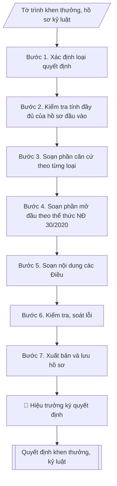

# Skill: Quyết định khen thưởng / kỷ luật viên chức

## Khi nào dùng
Khi cần ban hành quyết định chính thức về khen thưởng (Giấy khen của Hiệu trưởng, đề nghị cấp trên khen...)
hoặc kỷ luật (khiển trách, cảnh cáo, giáng chức, cách chức) đối với viên chức, người lao động —
sau khi Hội đồng thi đua – khen thưởng / Hội đồng kỷ luật đã họp, bỏ phiếu và có biên bản kết luận.

## Đầu vào (Input)

| Trường | Mô tả | Bắt buộc |
|---|---|---|
| `loai_quyet_dinh` | Khen thưởng / Kỷ luật | Có |
| `ho_ten` | Họ tên viên chức được khen thưởng / bị kỷ luật | Có |
| `chuc_vu_don_vi` | Chức vụ, đơn vị công tác hiện tại | Có |
| `hinh_thuc` | Khen thưởng: Giấy khen của Hiệu trưởng (hoặc danh hiệu đề nghị cấp trên). Kỷ luật: Khiển trách / Cảnh cáo / Giáng chức / Cách chức | Có |
| `ly_do` | Thành tích đạt được (khen thưởng) hoặc hành vi vi phạm cụ thể (kỷ luật) | Có |
| `can_cu` | Biên bản họp Hội đồng (số, ngày), kết quả bỏ phiếu, các văn bản pháp lý viện dẫn | Có |
| `muc_thuong` | Mức tiền thưởng kèm theo (nếu khen thưởng có thưởng tiền) | Không |
| `thoi_han_thi_hanh` | Thời hạn kỷ luật có hiệu lực / thời gian thi hành (mặc định: kể từ ngày ký) | Không |
| `so_quyet_dinh` | Số, ký hiệu quyết định (VD: 245/QĐ-ĐHA-TCCB) | Có |
| `ngay_ky` | Ngày ký quyết định | Có |
| `nguoi_ky` | Hiệu trưởng (hoặc người được ủy quyền) | Có |

## Quy trình

**Bước 1. Xác định loại quyết định**
- Làm gì: căn cứ `loai_quyet_dinh` để chọn nhánh xử lý: Khen thưởng hay Kỷ luật — hai loại
dùng chung khung thể thức NĐ 30/2020 nhưng khác nhau ở phần căn cứ pháp lý, nội dung các
Điều và yêu cầu lưu hồ sơ.
- Dùng input: `loai_quyet_dinh`, `hinh_thuc`.
- Vai trò: Chuyên viên Phòng TCCB · AI hỗ trợ: phân tích input, xác định yêu cầu · ⏱ ~20–45 phút (ước tính)
- Lưu ý nghiệp vụ: xác định đúng loại ngay từ đầu vì căn cứ pháp lý của kỷ luật (Luật Viên
chức, trình tự xử lý kỷ luật, thời hiệu) khắt khe hơn nhiều so với khen thưởng; nhầm loại
dẫn đến phải soạn lại toàn bộ phần căn cứ và các Điều.
- → Kết quả bước: xác nhận nhánh xử lý (khen thưởng/kỷ luật) + danh sách hồ sơ đầu vào
cần kiểm tra tương ứng.

**Bước 2. Kiểm tra tính đầy đủ của hồ sơ đầu vào**
- Làm gì:
  - Nhánh khen thưởng: kiểm tra tờ trình đề nghị của đơn vị, báo cáo thành tích có xác nhận,
    biên bản họp Hội đồng thi đua – khen thưởng (số, ngày họp), kết quả bỏ phiếu đạt tỷ lệ
    theo quy định.
  - Nhánh kỷ luật: kiểm tra biên bản họp Hội đồng kỷ luật, bản tự kiểm điểm của viên chức,
    biên bản xác minh (nếu có); đối chiếu trình tự, thủ tục và thời hiệu xử lý kỷ luật theo
    quy định công tác cán bộ.
- Dùng input: `can_cu`, `ho_ten`, `chuc_vu_don_vi`, `ly_do`, `hinh_thuc`.
- Vai trò: Chuyên viên Phòng TCCB (Trưởng phòng kiểm tra lại) · AI hỗ trợ: quét lỗi theo checklist · ⏱ ~15–30 phút (ước tính)
- Lưu ý nghiệp vụ: kỷ luật thiếu bản tự kiểm điểm hoặc quá thời hiệu xử lý thì quyết định
không có giá trị — phải dừng lại và báo cáo; khen thưởng thiếu biên bản họp Hội đồng hoặc
tỷ lệ bỏ phiếu không đạt thì chưa đủ điều kiện ban hành quyết định.
- → Kết quả bước: biên bản kiểm tra hồ sơ đầu vào (đủ điều kiện / còn thiếu gì).

**Bước 3. Soạn phần căn cứ theo từng loại**
- Làm gì: viết phần căn cứ, mỗi căn cứ một dòng bắt đầu bằng "Căn cứ", sắp xếp từ văn bản
pháp lý cao đến văn bản nội bộ:
  - Khen thưởng: Luật Thi đua, khen thưởng; quy chế thi đua – khen thưởng của trường;
    biên bản họp Hội đồng thi đua – khen thưởng (số, ngày, kết quả bỏ phiếu); "Theo đề nghị
    của Trưởng phòng Tổ chức – Cán bộ".
  - Kỷ luật: Luật Viên chức và văn bản hướng dẫn xử lý kỷ luật viên chức; nội quy, quy chế
    của trường; biên bản họp Hội đồng kỷ luật (số, ngày, kết quả bỏ phiếu).
- Dùng input: `can_cu`, `loai_quyet_dinh`.
- Vai trò: Chuyên viên Phòng TCCB · AI hỗ trợ: soạn dự thảo đúng thể thức · ⏱ ~20–45 phút (ước tính)
- Lưu ý nghiệp vụ: biên bản họp Hội đồng là căn cứ bắt buộc — phải ghi rõ số, ngày họp và
kết quả bỏ phiếu; căn cứ pháp lý phải trích đúng tên, số, ngày văn bản, không ghi chung chung.
- → Kết quả bước: đoạn văn bản phần căn cứ hoàn chỉnh.

**Bước 4. Soạn phần mở đầu theo thể thức NĐ 30/2020**
- Làm gì: soạn Quốc hiệu – Tiêu ngữ, tên cơ quan ban hành (Trường Đại học A), số và
ký hiệu quyết định (`so_quyet_dinh`), địa danh và `ngay_ky`; tên loại văn bản "QUYẾT ĐỊNH"
kèm trích yếu (về việc khen thưởng... / về việc xử lý kỷ luật...); chức danh người ký
(HIỆU TRƯỞNG TRƯỜNG ĐẠI HỌC A).
- Dùng input: `so_quyet_dinh`, `ngay_ky`, `nguoi_ky`, `loai_quyet_dinh`, `hinh_thuc`.
- Vai trò: Chuyên viên Phòng TCCB · AI hỗ trợ: soạn dự thảo đúng thể thức · ⏱ ~20–45 phút (ước tính)
- Lưu ý nghiệp vụ: số, ký hiệu lấy từ sổ đăng ký văn bản đi, không tự đặt trùng; trích yếu
phải phản ánh đúng loại quyết định và đối tượng; thẩm quyền ký: Hiệu trưởng hoặc người được
ủy quyền — hình thức kỷ luật nặng (cách chức) kiểm tra kỹ thẩm quyền theo phân cấp quản lý.
- → Kết quả bước: phần mở đầu quyết định đúng thể thức.

**Bước 5. Soạn nội dung các Điều**
- Làm gì: viết các điều sau cụm "QUYẾT ĐỊNH:":
  - Điều 1 (nội dung chính): khen thưởng — tặng hình thức gì cho ông/bà nào (họ tên, chức vụ,
    đơn vị), vì thành tích/lý do gì; kỷ luật — áp dụng hình thức kỷ luật gì đối với ông/bà nào,
    vì hành vi vi phạm cụ thể nào.
  - Điều 2 (chế độ kèm theo): khen thưởng — mức tiền thưởng (`muc_thuong`, ghi số tiền bằng
    số + bằng chữ, nguồn chi); kỷ luật — hậu quả về lương, chức vụ, `thoi_han_thi_hanh`.
  - Điều 3 (trách nhiệm thi hành): các đơn vị, cá nhân liên quan chịu trách nhiệm thi hành;
    quyết định có hiệu lực kể từ ngày ký (hoặc thời điểm ghi trong `thoi_han_thi_hanh`).
- Dùng input: `ho_ten`, `chuc_vu_don_vi`, `hinh_thuc`, `ly_do`, `muc_thuong`, `thoi_han_thi_hanh`.
- Vai trò: Chuyên viên Phòng TCCB · AI hỗ trợ: soạn dự thảo đúng thể thức · ⏱ ~20–45 phút (ước tính)
- Lưu ý nghiệp vụ: Điều 1 của quyết định kỷ luật phải mô tả hành vi vi phạm cụ thể, có căn
cứ (không dùng từ chung chung như "vi phạm kỷ luật"); Điều 2 kỷ luật ghi rõ thời hạn thi hành
để làm căn cứ tính thời gian xóa kỷ luật sau này.
- → Kết quả bước: dự thảo đầy đủ các Điều của quyết định.

**Bước 6. Kiểm tra, soát lỗi**
- Làm gì: soát toàn văn: thể thức, chính tả; họ tên – chức vụ – đơn vị chính xác tuyệt đối;
hình thức khen thưởng/kỷ luật đúng thẩm quyền `nguoi_ky`; Nơi nhận đầy đủ (cá nhân, đơn vị
liên quan, lưu hồ sơ cán bộ); số liệu tiền thưởng khớp giữa Điều 2 và hồ sơ đề nghị.
- Dùng input: toàn bộ input (tổng soát), `nguoi_ky`.
- Vai trò: Chuyên viên Phòng TCCB (Trưởng phòng kiểm tra lại) · AI hỗ trợ: quét lỗi theo checklist · ⏱ ~15–30 phút (ước tính)
- Lưu ý nghiệp vụ: quyết định kỷ luật sai tên người bị kỷ luật hoặc sai hình thức kỷ luật là
lỗi nghiêm trọng về pháp lý — kiểm tra chéo với biên bản họp Hội đồng; Nơi nhận của quyết
định kỷ luật bắt buộc có lưu hồ sơ viên chức.
- → Kết quả bước: dự thảo quyết định đã soát lỗi, kèm checklist kiểm tra thể thức và hồ sơ.

**Bước 7. Xuất bản và lưu hồ sơ**
- Làm gì: hoàn thiện văn bản quyết định ở định dạng markdown, sẵn sàng trình ký / chuyển sang
Word; lập danh mục hồ sơ kèm theo (tờ trình, báo cáo thành tích, biên bản họp Hội đồng +
kết quả bỏ phiếu — hoặc biên bản HĐ kỷ luật, bản tự kiểm điểm); lưu ý lưu trữ: bản kỷ luật
phải lưu 01 bản vào hồ sơ viên chức theo quy định công tác cán bộ.
- Dùng input: `nguoi_ky` (trình ký).
- Vai trò: Chuyên viên Phòng TCCB chuẩn bị, Hiệu trưởng phê duyệt · AI hỗ trợ: tổng hợp hồ sơ, soạn phiếu trình/tờ trình đầy đủ · ⏱ ~15–30 phút chuẩn bị + chờ duyệt (ước tính)
- Lưu ý nghiệp vụ: quyết định chỉ có hiệu lực sau khi ký và đóng dấu, phát hành theo Nơi nhận;
bản lưu hồ sơ viên chức (đối với kỷ luật) là bắt buộc, không được bỏ sót.
- → Kết quả bước: văn bản quyết định hoàn chỉnh + checklist kiểm tra thể thức và hồ sơ kèm theo.

## Luồng quy trình (Workflow)



## Đầu ra (Output)
- Văn bản quyết định hoàn chỉnh (khen thưởng hoặc kỷ luật).
- Checklist kiểm tra thể thức và tính hợp lệ hồ sơ kèm theo.

**Cấu trúc output chuẩn:** (Quyết định khen thưởng / kỷ luật — theo thể thức NĐ 30/2020)
1. Quốc hiệu – Tiêu ngữ ("CỘNG HÒA XÃ HỘI CHỦ NGHĨA VIỆT NAM" / "Độc lập – Tự do – Hạnh phúc").
2. Tên cơ quan ban hành (Trường Đại học A).
3. Số, ký hiệu quyết định.
4. Địa danh, ngày tháng năm ban hành.
5. Tên loại văn bản "QUYẾT ĐỊNH" + trích yếu ("Về việc khen thưởng..." / "Về việc xử lý
kỷ luật...").
6. Chức danh người ký (HIỆU TRƯỞNG TRƯỜNG ĐẠI HỌC A).
7. Phần căn cứ: mỗi căn cứ một dòng bắt đầu bằng "Căn cứ" — nhánh khen thưởng (Luật Thi đua,
khen thưởng → quy chế thi đua – khen thưởng của trường → biên bản họp Hội đồng thi đua –
khen thưởng); nhánh kỷ luật (Luật Viên chức và văn bản hướng dẫn xử lý kỷ luật → nội quy,
quy chế của trường → biên bản họp Hội đồng kỷ luật) — tiếp theo là "Theo đề nghị của...".
8. Cụm "QUYẾT ĐỊNH:" và các Điều: Điều 1 (nội dung chính: khen thưởng ai / áp dụng hình thức
kỷ luật gì đối với ai, lý do / hành vi vi phạm cụ thể); Điều 2 (chế độ kèm theo: mức tiền
thưởng bằng số + bằng chữ, nguồn chi / hậu quả về lương, chức vụ, thời hạn thi hành);
Điều 3 (trách nhiệm thi hành; hiệu lực kể từ ngày ký).
9. Nơi nhận (cá nhân, đơn vị liên quan; lưu VT, TCCB — quyết định kỷ luật bắt buộc lưu
01 bản vào hồ sơ viên chức).
10. Chữ ký (chức danh người ký + họ tên).

## Checklist nghiệm thu

Tiêu chí đạt: tất cả các ô dưới đây được đánh dấu.

- [ ] Đủ các phần theo Cấu trúc output chuẩn: Quốc hiệu – Tiêu ngữ ("CỘNG HÒA XÃ HỘI CHỦ NGHĨA VIỆT NAM" / "Độc l…; Tên cơ quan ban hành (Trường Đại học A).; Số, ký hiệu quyết định.; Địa danh, ngày tháng năm ban hành.; … (đủ 10 phần)
- [ ] Nội dung và số liệu trong output khớp đúng với Input đã cho (không thêm, bớt hay suy diễn)
- [ ] Không bịa đặt số liệu, minh chứng, trích dẫn hay căn cứ
- [ ] Đúng thể thức và định dạng theo Luật Thi đua, khen thưởng (sửa đổi, bổ sung hiện hành).
- [ ] Căn cứ pháp lý được trích dẫn đầy đủ và còn hiệu lực
- [ ] Đã qua Human gate: người có thẩm quyền đã kiểm tra/duyệt trước khi phát hành
- [ ] Xác định đúng loại ngay từ đầu vì căn cứ pháp lý của kỷ luật (Luật Viên
- [ ] Biên bản họp Hội đồng là căn cứ bắt buộc — phải ghi rõ số, ngày họp và
- [ ] Điều 1 của quyết định kỷ luật phải mô tả hành vi vi phạm cụ thể, có căn

## Ví dụ mô phỏng (dữ liệu giả lập)

> Tất cả tên trường, cá nhân, số liệu dưới đây đều là **giả lập**, không liên quan tổ chức/cá nhân có thật.

### Input mẫu (quyết định khen thưởng)

| Trường | Giá trị |
|---|---|
| `loai_quyet_dinh` | Khen thưởng |
| `ho_ten` | Bùi Thị A |
| `chuc_vu_don_vi` | Giảng viên chính, Khoa Kinh tế |
| `hinh_thuc` | Giấy khen của Hiệu trưởng |
| `ly_do` | Đạt danh hiệu "Giảng viên xuất sắc" năm học 2025–2026; chủ nhiệm 01 đề tài NCKH cấp trường xếp loại Xuất sắc; công bố 03 bài báo khoa học trên tạp chí trong nước có uy tín |
| `can_cu` | Biên bản họp Hội đồng thi đua – khen thưởng ngày 28/9/2026 (kết quả bỏ phiếu: 9/9 đồng ý) |
| `muc_thuong` | 1.500.000 đồng (kèm theo Giấy khen) |
| `so_quyet_dinh` | 245/QĐ-ĐHA-TCCB |
| `ngay_ky` | 09/10/2026 |
| `nguoi_ky` | Hiệu trưởng |

### Output mẫu

```
TRƯỜNG ĐẠI HỌC A            CỘNG HÒA XÃ HỘI CHỦ NGHĨA VIỆT NAM
                                          Độc lập – Tự do – Hạnh phúc
      Số: 245/QĐ-ĐHA-TCCB
                                                 Thành phố C, ngày 09 tháng 10 năm 2026

                    QUYẾT ĐỊNH
      Về việc khen thưởng viên chức năm học 2025–2026

                              HIỆU TRƯỞNG TRƯỜNG ĐẠI HỌC A

Căn cứ Luật Thi đua, khen thưởng ngày 15 tháng 6 năm 2022;
Căn cứ Quy chế thi đua – khen thưởng của Trường Đại học A ban hành kèm
theo Quyết định số 88/QĐ-ĐHA ngày 20 tháng 8 năm 2024 của Hiệu trưởng;
Căn cứ Biên bản họp Hội đồng thi đua – khen thưởng Trường ngày 28 tháng 9 năm
2026 (kết quả bỏ phiếu: 9/9 thành viên đồng ý);
Theo đề nghị của Trưởng phòng Tổ chức – Cán bộ,

                              QUYẾT ĐỊNH:

Điều 1. Tặng Giấy khen của Hiệu trưởng Trường Đại học A cho bà
Bùi Thị A, Giảng viên chính, Khoa Kinh tế, vì đã đạt danh hiệu
"Giảng viên xuất sắc" năm học 2025–2026; chủ nhiệm 01 đề tài nghiên cứu khoa học
cấp trường xếp loại Xuất sắc; công bố 03 bài báo khoa học trên tạp chí trong
nước có uy tín.

Điều 2. Bà Bùi Thị A được thưởng kèm theo Giấy khen số tiền
1.500.000 đồng (Một triệu năm trăm nghìn đồng), trích từ quỹ thi đua –
khen thưởng của Nhà trường.

Điều 3. Trưởng phòng Tổ chức – Cán bộ, Trưởng phòng Tài chính – Kế toán,
Trưởng khoa Kinh tế, bà Bùi Thị A và các đơn vị, cá nhân có liên quan
chịu trách nhiệm thi hành Quyết định này.
Quyết định này có hiệu lực kể từ ngày ký./.

Nơi nhận:                                              HIỆU TRƯỞNG
- Như Điều 3;
- Lưu: VT, TCCB (hồ sơ).                                   (đã ký)

                                                     PGS.TS. Trần Văn B
```

### Checklist kiểm tra thể thức và hồ sơ (output kèm theo)
- [x] Quốc hiệu – Tiêu ngữ đúng vị trí, chữ in hoa
- [x] Số, ký hiệu quyết định
- [x] Địa danh, ngày tháng năm
- [x] Tên loại văn bản + trích yếu
- [x] Đủ các căn cứ pháp lý (Luật, Quy chế, Biên bản họp HĐ)
- [x] Các Điều đánh số, nội dung rõ ràng
- [x] Họ tên, chức vụ, đơn vị người được khen thưởng chính xác
- [x] Hình thức khen thưởng đúng thẩm quyền Hiệu trưởng
- [x] Nơi nhận đầy đủ, có lưu hồ sơ cán bộ
- [x] Hồ sơ kèm theo đủ: tờ trình, báo cáo thành tích, biên bản họp HĐ + kết quả bỏ phiếu

> Ghi chú: Quyết định **kỷ luật** dùng chung khung thể thức trên, thay phần căn cứ bằng Luật Viên chức
> và quy định xử lý kỷ luật viên chức, nội dung các Điều ghi rõ hình thức kỷ luật, hành vi vi phạm,
> thời hạn thi hành; bắt buộc lưu 01 bản vào hồ sơ viên chức và bảo đảm đúng trình tự, thời hiệu
> xử lý kỷ luật theo quy định công tác cán bộ.

## Căn cứ & lưu ý
- Luật Thi đua, khen thưởng (sửa đổi, bổ sung hiện hành).
- Luật Viên chức và các văn bản hướng dẫn về xử lý kỷ luật viên chức.
- Nghị định 30/2020/NĐ-CP về công tác văn thư (thể thức văn bản).
- Quy chế thi đua – khen thưởng nội bộ của trường; quy định công tác cán bộ
  (trình tự, thủ tục, thời hiệu xử lý kỷ luật; lưu trữ hồ sơ viên chức).
- Quyết định kỷ luật phải bảo đảm quyền được trình bày, tự kiểm điểm của viên chức
  và đúng thẩm quyền xử lý kỷ luật.
- Không dùng tên thật của trường/cá nhân khi mô phỏng.
