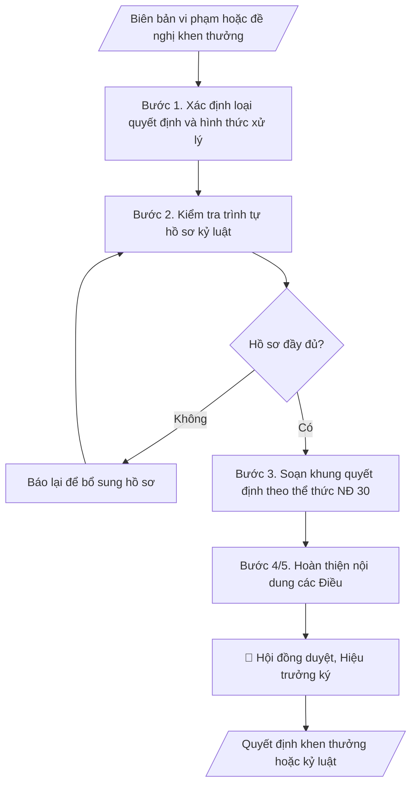

# Quyết định khen thưởng / kỷ luật sinh viên

## Định dạng và file đầu ra

Định dạng đầu ra có thể chọn theo sản phẩm/yêu cầu: .docx, .pdf. Đọc mục “Định dạng bổ sung” trong quy cách đầu ra trước khi chọn.

**Phải tạo file thực tế để tải xuống, không chỉ trả nội dung trong chat.** Định dạng mặc định của skill: **.docx**. Nếu có bảng số liệu nghiệp vụ yêu cầu file bảng tính riêng, tạo thêm Excel theo yêu cầu; không tự tạo file kiểm tra. Không chờ người dùng yêu cầu xuất file lần nữa. Ưu tiên định dạng người dùng chỉ định; đọc quy tắc xuất file tại references/quy-cach-dau-ra.md.

## Quy cách đầu ra và thông tin thiếu
Đọc [quy cách và cấu trúc sản phẩm](references/quy-cach-dau-ra.md) trước khi soạn/xuất. File giao chỉ gồm sản phẩm nghiệp vụ được yêu cầu; kiểm tra nội bộ không xuất kèm. Thiếu thông tin thì giữ nguyên trường/mục và chỗ điền theo mẫu gốc (dòng dấu chấm, dấu gạch hoặc ô trống); không tự điền dữ liệu mẫu, số 0, mã chờ xác minh hay dòng chờ ký. Mẫu chuyên ngành còn áp dụng được ưu tiên về cấu trúc, mã biểu và người ký. Bản đầy đủ: [quy tắc chung](references/quy-tac-chung.md).

## Kiểm soát áp dụng và phê duyệt
Trước khi chạy, xác định `ngay_ap_dung`, `loai_hinh_truong`, `quy_che_noi_bo`, `nguon_du_lieu`, `nguoi_kiem_duyet`; chỉ hỏi thông tin liên quan nghiệp vụ, không dùng giá trị giả định thay dữ liệu bắt buộc. Đối chiếu căn cứ pháp lý với văn bản gốc, hiệu lực, điều khoản áp dụng và chuyển tiếp. Bản đầy đủ: [quy tắc chung](references/quy-tac-chung.md).

## Giới hạn và human gate
AI hỗ trợ chuẩn bị và đối chiếu; cán bộ phụ trách kiểm tra dữ liệu/căn cứ, người có thẩm quyền duyệt và ký. Không đánh dấu đã ký, đã duyệt, đã công bố khi chưa có chứng cứ. Dữ liệu sinh viên, sức khỏe, nhân sự, tài chính chỉ dùng theo mục đích và phân quyền, che thông tin định danh khi dùng ví dụ (Luật 91/2025/QH15, hiệu lực 01/01/2026); không tải dữ liệu lên dịch vụ ngoài khi chưa có quyền. Bản đầy đủ: [quy tắc chung](references/quy-tac-chung.md).

## Khi nào dùng
Khi có biên bản vi phạm của sinh viên cần ban hành quyết định kỷ luật theo quy chế công tác
sinh viên, hoặc khi xét khen thưởng sinh viên đạt thành tích học tập, rèn luyện, hoạt động
phong trào, nghiên cứu khoa học theo đợt (học kỳ, năm học, đột xuất).

## Đầu vào (Input)

| Trường | Mô tả | Bắt buộc |
|---|---|---|
| `loai_quyet_dinh` | Khen thưởng / Kỷ luật | Có |
| `ho_ten_sv` | Họ tên sinh viên (kỷ luật: từng trường hợp; khen thưởng: danh sách) | Có |
| `ma_sv` | Mã sinh viên | Có |
| `lop_khoa` | Lớp, khoa đào tạo của sinh viên | Có |
| `hanh_vi_vi_pham` | Mô tả hành vi vi phạm, thời gian, địa điểm (nếu loại Kỷ luật) | Có (với kỷ luật) |
| `bien_ban` | Số, ký hiệu, ngày của biên bản vi phạm (nếu loại Kỷ luật) | Có (với kỷ luật) |
| `thanh_tich` | Thành tích, danh hiệu khen thưởng (nếu loại Khen thưởng) | Có (với khen thưởng) |
| `muc_khen_thuong` | Giấy khen Hiệu trưởng / Giấy khen Khoa / Bằng khen cấp trên (nếu loại Khen thưởng) | Có (với khen thưởng) |
| `hoi_dong` | Hội đồng xét khen thưởng / kỷ luật đã họp (số biên bản, ngày họp) | Có |
| `nguoi_ky` | Hiệu trưởng / Phó Hiệu trưởng (thừa ủy quyền) | Có |

## Quy trình

**Bước 1. Xác định loại quyết định và hình thức xử lý**
- Làm gì: căn cứ loại quyết định (khen thưởng/kỷ luật), đối chiếu hành vi vi phạm với quy chế
  công tác sinh viên để xác định hình thức: khiển trách, cảnh cáo, đình chỉ học tập có thời
  hạn, buộc thôi học (kỷ luật) hoặc Giấy khen Hiệu trưởng / Giấy khen Khoa / Bằng khen cấp
  trên (khen thưởng); xác định thẩm quyền ký theo phân cấp.
- Dùng input: `loai_quyet_dinh`, `ho_ten_sv`, `ma_sv`, `lop_khoa`, `hanh_vi_vi_pham`,
  `thanh_tich`, `muc_khen_thuong`.
- Vai trò: Trưởng Phòng Công tác sinh viên · AI hỗ trợ: đối chiếu hành vi với quy chế công tác sinh viên · ⏱ ~30–60 phút (ước tính)
- Lưu ý nghiệp vụ: hình thức kỷ luật phải tương xứng với hành vi và mức độ tái phạm; khiển
  trách do Hội đồng cấp Khoa đề nghị (Hiệu trưởng hoặc Trưởng khoa ký theo phân cấp), từ cảnh
  cáo trở lên do Hội đồng kỷ luật trường đề nghị và Hiệu trưởng ký.
- → Kết quả bước: phiếu xác định hình thức xử lý (loại quyết định, hình thức áp dụng, thẩm
  quyền ký).

**Bước 2. Kiểm tra trình tự hồ sơ kỷ luật**
- Làm gì: kiểm tra đủ 4 thành phần hồ sơ trước khi soạn quyết định kỷ luật: (1) biên bản vi
  phạm do người có thẩm quyền lập, có chữ ký sinh viên (hoặc ghi rõ vắng mặt không lý do);
  (2) bản tường trình/tự kiểm điểm của sinh viên; (3) biên bản họp Hội đồng kỷ luật (thành
  phần theo quy chế, hình thức đề nghị, tỷ lệ biểu quyết); (4) tờ trình đề nghị ra quyết định
  của Hội đồng/Khoa. Với khen thưởng: kiểm tra biên bản họp Hội đồng xét khen thưởng.
- Dùng input: `bien_ban`, `hoi_dong`.
- Vai trò: Chuyên viên Phòng Công tác sinh viên · AI hỗ trợ: chuẩn bị tài liệu họp, tổng hợp ý kiến · ⏱ ~30–60 phút (ước tính)
- Lưu ý nghiệp vụ: thiếu bất kỳ thành phần nào thì báo lại để bổ sung — tuyệt đối không soạn
  quyết định khi hồ sơ chưa đầy đủ.
- → Kết quả bước: checklist hồ sơ (đủ/thiếu theo từng mục) + yêu cầu bổ sung nếu thiếu.

**Bước 3. Soạn khung quyết định theo thể thức NĐ 30/2020**
- Làm gì: dựng khung văn bản đủ các thành phần thể thức: Quốc hiệu – Tiêu ngữ; tên cơ quan;
  số, ký hiệu; địa danh, ngày tháng năm; trích yếu; các căn cứ (Luật Giáo dục đại học; quy
  chế công tác sinh viên của trường; biên bản vi phạm; biên bản họp Hội đồng); phần
  "QUYẾT ĐỊNH:"; nơi nhận; chữ ký.
- Dùng input: kết quả bước 1–2, `nguoi_ky`.
- Vai trò: Chuyên viên Phòng Công tác sinh viên · AI hỗ trợ: dựng khung quyết định đúng thể thức NĐ 30/2020 · ⏱ ~30 phút (ước tính)
- Lưu ý nghiệp vụ: căn cứ liệt kê đầy đủ, đúng số/ký hiệu/ngày của từng văn bản; trích yếu
  ngắn gọn, đúng nội dung quyết định.
- → Kết quả bước: khung dự thảo quyết định đúng thể thức NĐ 30/2020 (chờ điền nội dung các
  Điều).

**Bước 4. Hoàn thiện nội dung các Điều — quyết định kỷ luật**
- Làm gì: viết Điều 1 (hình thức kỷ luật + họ tên, mã SV, lớp, khoa + lý do vi phạm: hành vi,
  thời gian, địa điểm); Điều 2 (thời gian thi hành, phạm vi áp dụng: với đình chỉ học tập ghi
  thời hạn cụ thể; với buộc thôi học ghi ngày có hiệu lực; hệ quả kèm theo như hạ bậc xếp loại
  rèn luyện, không xét học bổng); Điều 3 (trách nhiệm của Khoa, Phòng CTSV, Phòng Đào tạo...
  và quyền khiếu nại của sinh viên).
- Dùng input: `ho_ten_sv`, `ma_sv`, `lop_khoa`, `hanh_vi_vi_pham`, `bien_ban`.
- Vai trò: Chuyên viên Phòng Công tác sinh viên · AI hỗ trợ: soạn dự thảo 3 Điều kỷ luật · ⏱ ~30–60 phút (ước tính)
- Lưu ý nghiệp vụ: thông tin sinh viên chính xác tuyệt đối; ngày hiệu lực rõ ràng; quyền
  khiếu nại phải được ghi nhận.
- → Kết quả bước: nội dung 3 Điều của quyết định kỷ luật, hoàn chỉnh.

**Bước 5. Hoàn thiện nội dung các Điều — quyết định khen thưởng**
- Làm gì: viết Điều 1 (danh sách sinh viên được khen thưởng: họ tên, mã SV, lớp, khoa; mức
  khen thưởng; nếu có tiền thưởng ghi rõ mức); Điều 2 (nguồn kinh phí chi khen thưởng);
  Điều 3 (trách nhiệm thi hành của các đơn vị).
- Dùng input: `ho_ten_sv`, `ma_sv`, `lop_khoa`, `thanh_tich`, `muc_khen_thuong`, `hoi_dong`.
- Vai trò: Chuyên viên Phòng Công tác sinh viên · AI hỗ trợ: soạn dự thảo 3 Điều khen thưởng · ⏱ ~30–60 phút (ước tính)
- Lưu ý nghiệp vụ: danh sách chính xác, đúng thứ tự; mức tiền thưởng và nguồn kinh phí khớp
  với tờ trình của Hội đồng.
- → Kết quả bước: nội dung 3 Điều của quyết định khen thưởng, hoàn chỉnh.

**Bước 6. Kiểm tra và xuất bản**
- Làm gì: kiểm tra thẩm quyền ký đúng phân cấp, hình thức tương xứng hành vi, thông tin sinh
  viên chính xác, ngày tháng hiệu lực rõ ràng; xuất văn bản hoàn chỉnh file theo định dạng đầu ra của skill kèm
  danh sách nơi nhận.
- Dùng input: `nguoi_ky`, kết quả bước 3–5.
- Vai trò: Chuyên viên Phòng Công tác sinh viên · AI hỗ trợ: kiểm tra thể thức và số liệu · ⏱ ~1–2 giờ (ước tính)
- Lưu ý nghiệp vụ: rà soát lần cuối chính tả, số liệu, thể thức trước khi trình ký.
- → Kết quả bước: văn bản quyết định hoàn chỉnh + checklist hồ sơ, sẵn sàng trình ký.

## Luồng quy trình (Workflow)

## Đầu ra

File nghiệp vụ thực tế theo định dạng mặc định ở đầu skill hoặc định dạng người dùng yêu cầu, kèm liên kết tải trong phản hồi cuối.

Sản phẩm nghiệp vụ hoàn chỉnh theo [quy cách và cấu trúc](references/quy-cach-dau-ra.md), giữ các trường chưa có dữ liệu ở trạng thái trống. Không xuất kèm checklist/phụ lục kiểm tra đầu ra.

## Kiểm tra nội bộ trước khi giao

- [ ] Bố cục khớp mẫu áp dụng và cấu trúc tại references/quy-cach-dau-ra.md.
- [ ] Thông tin sinh viên (họ tên, mã SV, lớp, khoa) khớp Input, chính xác tuyệt đối.
- [ ] Quyết định kỷ luật: lý do vi phạm (hành vi, thời gian, địa điểm) khớp biên bản vi phạm; hình thức kỷ luật tương xứng hành vi; ngày hiệu lực rõ ràng; ghi đầy đủ hệ quả kèm theo (hạ xếp loại rèn luyện, không xét học bổng).
- [ ] Quyết định khen thưởng: danh sách chính xác; mức tiền thưởng và nguồn kinh phí khớp tờ trình của Hội đồng.
- [ ] Không bịa đặt biên bản vi phạm, kết quả biểu quyết hội đồng, thành tích, văn bản căn cứ.
- [ ] Hồ sơ kỷ luật đầy đủ 4 thành phần trước khi soạn quyết định (biên bản vi phạm, tường trình, biên bản họp Hội đồng, tờ trình).
- [ ] Thẩm quyền ký đúng phân cấp (khiển trách theo phân cấp; cảnh cáo trở lên Hiệu trưởng ký); căn cứ còn hiệu lực; quyết định kỷ luật ghi nhận quyền khiếu nại của sinh viên.
- [ ] Đã qua Human gate: Hội đồng kỷ luật/thi đua – khen thưởng họp và biểu quyết; Hiệu trưởng ký.

Tiêu chí đạt = tất cả các ô được đánh dấu.

## Căn cứ & lưu ý
- Quy chế công tác sinh viên của trường (ban hành theo Thông tư 10/2016/TT-BGDĐT
  và các văn bản sửa đổi, bổ sung của Bộ Giáo dục và Đào tạo).
- Quyết định kỷ luật phải có đủ hồ sơ: biên bản vi phạm, tường trình của sinh viên,
  biên bản họp Hội đồng kỷ luật, tờ trình đề nghị.
- Sinh viên có quyền khiếu nại quyết định kỷ luật theo quy định; đơn vị lưu hồ sơ
  kỷ luật trong hồ sơ sinh viên.
- Không dùng tên thật của trường/cá nhân khi mô phỏng.

## Quản trị phiên bản
- Phiên bản gói `1.3.2` (cập nhật 2026-10-10); hồ sơ đầy đủ tại [references/version.json](references/version.json).
- Người phê duyệt nghiệp vụ: **chưa chỉ định**. Trạng thái: dự thảo nghiệp vụ; kiểm tra pháp lý trước thực thi. Ngày cập nhật không đồng nghĩa mọi văn bản đã được rà soát toàn văn.
- Giấy phép theo LICENSE của kho (bản quyền CES Global). Lịch sử thay đổi: CHANGELOG.md.
