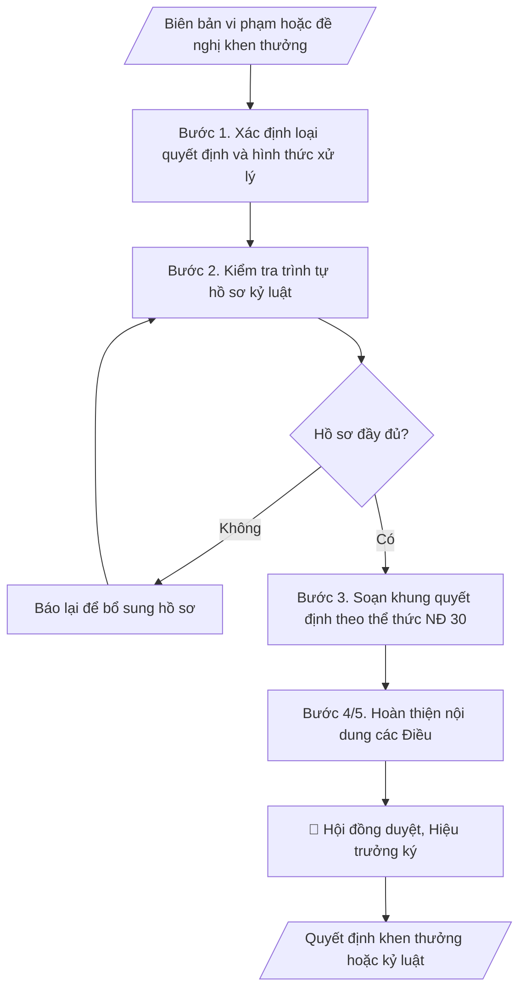

# Quyết định khen thưởng / kỷ luật sinh viên

## Kiểm soát áp dụng và phê duyệt

Trước khi chạy quy trình, xác định `ngay_ap_dung`, `loai_hinh_truong`, `quy_che_noi_bo`, `nguon_du_lieu` và `nguoi_kiem_duyet`. Chỉ yêu cầu thông tin có liên quan đến nghiệp vụ; không dùng giá trị giả định thay dữ liệu bắt buộc. Hồ sơ có yếu tố pháp lý phải kèm văn bản gốc, tình trạng hiệu lực, điều khoản áp dụng và chuyển tiếp.

## Giới hạn và human gate

AI hỗ trợ chuẩn bị và đối chiếu. Cán bộ phụ trách kiểm tra dữ liệu/căn cứ, người có thẩm quyền duyệt và ký. Mọi đầu ra mặc định là **DỰ THẢO – CHỜ KIỂM DUYỆT**; không đánh dấu đã ký, đã duyệt hoặc đã công bố nếu chưa có chứng cứ. Dữ liệu sinh viên, sức khỏe, nhân sự và tài chính phải hạn chế theo mục đích, phân quyền và che thông tin định danh khi dùng ví dụ. Không tải dữ liệu lên dịch vụ ngoài khi chưa có quyền. Kiểm tra Luật 91/2025/QH15 về bảo vệ dữ liệu cá nhân (hiệu lực 01/01/2026) và quy định áp dụng trước xử lý/chia sẻ dữ liệu cá nhân.


## Khi nào dùng
Khi có biên bản vi phạm của sinh viên cần ban hành quyết định kỷ luật theo quy chế công tác
sinh viên, hoặc khi xét khen thưởng sinh viên đạt thành tích học tập, rèn luyện, hoạt động
phong trào, nghiên cứu khoa học theo đợt (học kỳ, năm học, đột xuất).

## Đầu vào (Input)

| Trường | Mô tả | Bắt buộc |
|---|---|---|
| `loai_quyet_dinh` | Khen thưởng / Kỷ luật | Có |
| `ho_ten_sv` | Họ tên sinh viên (kỷ luật: từng trường hợp; khen thưởng: danh sách) | Có |
| `ma_sv` | Mã sinh viên | Có |
| `lop_khoa` | Lớp, khoa đào tạo của sinh viên | Có |
| `hanh_vi_vi_pham` | Mô tả hành vi vi phạm, thời gian, địa điểm (nếu loại Kỷ luật) | Có (với kỷ luật) |
| `bien_ban` | Số, ký hiệu, ngày của biên bản vi phạm (nếu loại Kỷ luật) | Có (với kỷ luật) |
| `thanh_tich` | Thành tích, danh hiệu khen thưởng (nếu loại Khen thưởng) | Có (với khen thưởng) |
| `muc_khen_thuong` | Giấy khen Hiệu trưởng / Giấy khen Khoa / Bằng khen cấp trên (nếu loại Khen thưởng) | Có (với khen thưởng) |
| `hoi_dong` | Hội đồng xét khen thưởng / kỷ luật đã họp (số biên bản, ngày họp) | Có |
| `nguoi_ky` | Hiệu trưởng / Phó Hiệu trưởng (thừa ủy quyền) | Có |

## Quy trình

**Bước 1. Xác định loại quyết định và hình thức xử lý**
- Làm gì: căn cứ loại quyết định (khen thưởng/kỷ luật), đối chiếu hành vi vi phạm với quy chế
  công tác sinh viên để xác định hình thức: khiển trách, cảnh cáo, đình chỉ học tập có thời
  hạn, buộc thôi học (kỷ luật) hoặc Giấy khen Hiệu trưởng / Giấy khen Khoa / Bằng khen cấp
  trên (khen thưởng); xác định thẩm quyền ký theo phân cấp.
- Dùng input: `loai_quyet_dinh`, `ho_ten_sv`, `ma_sv`, `lop_khoa`, `hanh_vi_vi_pham`,
  `thanh_tich`, `muc_khen_thuong`.
- Vai trò: Trưởng Phòng Công tác sinh viên · AI hỗ trợ: đối chiếu hành vi với quy chế công tác sinh viên · ⏱ ~30–60 phút (ước tính)
- Lưu ý nghiệp vụ: hình thức kỷ luật phải tương xứng với hành vi và mức độ tái phạm; khiển
  trách do Hội đồng cấp Khoa đề nghị (Hiệu trưởng hoặc Trưởng khoa ký theo phân cấp), từ cảnh
  cáo trở lên do Hội đồng kỷ luật trường đề nghị và Hiệu trưởng ký.
- → Kết quả bước: phiếu xác định hình thức xử lý (loại quyết định, hình thức áp dụng, thẩm
  quyền ký).

**Bước 2. Kiểm tra trình tự hồ sơ kỷ luật**
- Làm gì: kiểm tra đủ 4 thành phần hồ sơ trước khi soạn quyết định kỷ luật: (1) biên bản vi
  phạm do người có thẩm quyền lập, có chữ ký sinh viên (hoặc ghi rõ vắng mặt không lý do);
  (2) bản tường trình/tự kiểm điểm của sinh viên; (3) biên bản họp Hội đồng kỷ luật (thành
  phần theo quy chế, hình thức đề nghị, tỷ lệ biểu quyết); (4) tờ trình đề nghị ra quyết định
  của Hội đồng/Khoa. Với khen thưởng: kiểm tra biên bản họp Hội đồng xét khen thưởng.
- Dùng input: `bien_ban`, `hoi_dong`.
- Vai trò: Chuyên viên Phòng Công tác sinh viên · AI hỗ trợ: chuẩn bị tài liệu họp, tổng hợp ý kiến · ⏱ ~30–60 phút (ước tính)
- Lưu ý nghiệp vụ: thiếu bất kỳ thành phần nào thì báo lại để bổ sung — tuyệt đối không soạn
  quyết định khi hồ sơ chưa đầy đủ.
- → Kết quả bước: checklist hồ sơ (đủ/thiếu theo từng mục) + yêu cầu bổ sung nếu thiếu.

**Bước 3. Soạn khung quyết định theo thể thức NĐ 30/2020**
- Làm gì: dựng khung văn bản đủ các thành phần thể thức: Quốc hiệu – Tiêu ngữ; tên cơ quan;
  số, ký hiệu; địa danh, ngày tháng năm; trích yếu; các căn cứ (Luật Giáo dục đại học; quy
  chế công tác sinh viên của trường; biên bản vi phạm; biên bản họp Hội đồng); phần
  "QUYẾT ĐỊNH:"; nơi nhận; chữ ký.
- Dùng input: kết quả bước 1–2, `nguoi_ky`.
- Vai trò: Chuyên viên Phòng Công tác sinh viên · AI hỗ trợ: dựng khung quyết định đúng thể thức NĐ 30/2020 · ⏱ ~30 phút (ước tính)
- Lưu ý nghiệp vụ: căn cứ liệt kê đầy đủ, đúng số/ký hiệu/ngày của từng văn bản; trích yếu
  ngắn gọn, đúng nội dung quyết định.
- → Kết quả bước: khung dự thảo quyết định đúng thể thức NĐ 30/2020 (chờ điền nội dung các
  Điều).

**Bước 4. Hoàn thiện nội dung các Điều — quyết định kỷ luật**
- Làm gì: viết Điều 1 (hình thức kỷ luật + họ tên, mã SV, lớp, khoa + lý do vi phạm: hành vi,
  thời gian, địa điểm); Điều 2 (thời gian thi hành, phạm vi áp dụng: với đình chỉ học tập ghi
  thời hạn cụ thể; với buộc thôi học ghi ngày có hiệu lực; hệ quả kèm theo như hạ bậc xếp loại
  rèn luyện, không xét học bổng); Điều 3 (trách nhiệm của Khoa, Phòng CTSV, Phòng Đào tạo...
  và quyền khiếu nại của sinh viên).
- Dùng input: `ho_ten_sv`, `ma_sv`, `lop_khoa`, `hanh_vi_vi_pham`, `bien_ban`.
- Vai trò: Chuyên viên Phòng Công tác sinh viên · AI hỗ trợ: soạn dự thảo 3 Điều kỷ luật · ⏱ ~30–60 phút (ước tính)
- Lưu ý nghiệp vụ: thông tin sinh viên chính xác tuyệt đối; ngày hiệu lực rõ ràng; quyền
  khiếu nại phải được ghi nhận.
- → Kết quả bước: nội dung 3 Điều của quyết định kỷ luật, hoàn chỉnh.

**Bước 5. Hoàn thiện nội dung các Điều — quyết định khen thưởng**
- Làm gì: viết Điều 1 (danh sách sinh viên được khen thưởng: họ tên, mã SV, lớp, khoa; mức
  khen thưởng; nếu có tiền thưởng ghi rõ mức); Điều 2 (nguồn kinh phí chi khen thưởng);
  Điều 3 (trách nhiệm thi hành của các đơn vị).
- Dùng input: `ho_ten_sv`, `ma_sv`, `lop_khoa`, `thanh_tich`, `muc_khen_thuong`, `hoi_dong`.
- Vai trò: Chuyên viên Phòng Công tác sinh viên · AI hỗ trợ: soạn dự thảo 3 Điều khen thưởng · ⏱ ~30–60 phút (ước tính)
- Lưu ý nghiệp vụ: danh sách chính xác, đúng thứ tự; mức tiền thưởng và nguồn kinh phí khớp
  với tờ trình của Hội đồng.
- → Kết quả bước: nội dung 3 Điều của quyết định khen thưởng, hoàn chỉnh.

**Bước 6. Kiểm tra và xuất bản**
- Làm gì: kiểm tra thẩm quyền ký đúng phân cấp, hình thức tương xứng hành vi, thông tin sinh
  viên chính xác, ngày tháng hiệu lực rõ ràng; xuất văn bản hoàn chỉnh định dạng markdown kèm
  danh sách nơi nhận.
- Dùng input: `nguoi_ky`, kết quả bước 3–5.
- Vai trò: Chuyên viên Phòng Công tác sinh viên · AI hỗ trợ: kiểm tra thể thức và số liệu · ⏱ ~1–2 giờ (ước tính)
- Lưu ý nghiệp vụ: rà soát lần cuối chính tả, số liệu, thể thức trước khi trình ký.
- → Kết quả bước: văn bản quyết định hoàn chỉnh + checklist hồ sơ, sẵn sàng trình ký.

## Luồng quy trình (Workflow)


## Đầu ra (Output)
- Văn bản quyết định hoàn chỉnh (khen thưởng hoặc kỷ luật).
- Checklist hồ sơ: biên bản vi phạm, tường trình, biên bản họp Hội đồng, tờ trình đề nghị.

**Cấu trúc output chuẩn:** khung cố định của Quyết định (hai biến thể khen thưởng / kỷ luật):
1. Quốc hiệu – Tiêu ngữ; tên cơ quan ban hành; số, ký hiệu; địa danh, ngày tháng năm.
2. Tên loại văn bản: "QUYẾT ĐỊNH" + trích yếu (Về việc kỷ luật sinh viên / Về việc khen thưởng
   sinh viên...).
3. Chức danh người ký ban hành (HIỆU TRƯỞNG TRƯỜNG...).
4. Các căn cứ: Luật Giáo dục đại học; Quy chế công tác sinh viên của trường; biên bản vi phạm
   / biên bản họp Hội đồng (ghi rõ số, ký hiệu, ngày).
5. Phần "QUYẾT ĐỊNH:" gồm các Điều:
   - Kỷ luật: Điều 1 (hình thức kỷ luật + thông tin sinh viên + lý do); Điều 2 (hiệu lực, thời
     hạn, hệ quả kèm theo); Điều 3 (trách nhiệm thi hành, quyền khiếu nại của sinh viên).
   - Khen thưởng: Điều 1 (danh sách sinh viên + mức khen thưởng, tiền thưởng nếu có);
     Điều 2 (nguồn kinh phí); Điều 3 (trách nhiệm thi hành).
6. Nơi nhận + chữ ký (`nguoi_ky`).

## Checklist nghiệm thu

- [ ] Đủ các phần theo "Cấu trúc output chuẩn": quốc hiệu – tiêu ngữ; "QUYẾT ĐỊNH" + trích yếu; chức danh người ký; các căn cứ (ghi rõ số, ký hiệu, ngày); các Điều theo đúng biến thể khen thưởng/kỷ luật; nơi nhận + chữ ký.
- [ ] Thông tin sinh viên (họ tên, mã SV, lớp, khoa) khớp Input, chính xác tuyệt đối.
- [ ] Quyết định kỷ luật: lý do vi phạm (hành vi, thời gian, địa điểm) khớp biên bản vi phạm; hình thức kỷ luật tương xứng hành vi; ngày hiệu lực rõ ràng; ghi đầy đủ hệ quả kèm theo (hạ xếp loại rèn luyện, không xét học bổng).
- [ ] Quyết định khen thưởng: danh sách chính xác; mức tiền thưởng và nguồn kinh phí khớp tờ trình của Hội đồng.
- [ ] Không bịa đặt biên bản vi phạm, kết quả biểu quyết hội đồng, thành tích, văn bản căn cứ.
- [ ] Hồ sơ kỷ luật đầy đủ 4 thành phần trước khi soạn quyết định (biên bản vi phạm, tường trình, biên bản họp Hội đồng, tờ trình).
- [ ] Thẩm quyền ký đúng phân cấp (khiển trách theo phân cấp; cảnh cáo trở lên Hiệu trưởng ký); căn cứ còn hiệu lực; quyết định kỷ luật ghi nhận quyền khiếu nại của sinh viên.
- [ ] Đã qua Human gate: Hội đồng kỷ luật/thi đua – khen thưởng họp và biểu quyết; Hiệu trưởng ký.

Tiêu chí đạt = tất cả các ô được đánh dấu.

## Ví dụ mô phỏng (dữ liệu giả lập)

> Tất cả tên trường, cá nhân, số liệu dưới đây đều là **giả lập**, không liên quan tổ chức/cá nhân có thật.

### Input mẫu (kỷ luật)

| Trường | Giá trị |
|---|---|
| `loai_quyet_dinh` | Kỷ luật |
| `ho_ten_sv` | Phạm Văn B |
| `ma_sv` | MD20221234 |
| `lop_khoa` | Lớp K12-CNTT, Khoa Công nghệ thông tin |
| `hanh_vi_vi_pham` | Sử dụng tài liệu trong giờ thi môn Cơ sở dữ liệu, kỳ thi kết thúc học phần học kỳ I năm học 2026–2027, ngày 15/12/2026, phòng thi A2.3 |
| `bien_ban` | Biên bản vi phạm số 07/BBVP-KT ngày 15/12/2026 của Hội đồng coi thi |
| `hoi_dong` | Hội đồng kỷ luật sinh viên họp ngày 20/12/2026, thống nhất đề nghị hình thức Cảnh cáo (biểu quyết 7/7) |
| `nguoi_ky` | Hiệu trưởng |

### Output mẫu (quyết định kỷ luật)

```
TRƯỜNG ĐẠI HỌC A            CỘNG HÒA XÃ HỘI CHỦ NGHĨA VIỆT NAM
       Số: 45/QĐ-ĐHA-CTSV                 Độc lập – Tự do – Hạnh phúc
                                                 Thành phố C, ngày 22 tháng 12 năm 2026

QUYẾT ĐỊNH
Về việc kỷ luật sinh viên

HIỆU TRƯỞNG TRƯỜNG ĐẠI HỌC A

Căn cứ Luật Giáo dục đại học ngày 18/6/2012 và Luật sửa đổi, bổ sung một số điều
của Luật Giáo dục đại học ngày 19/11/2018;
Căn cứ Quy chế công tác sinh viên của Trường Đại học A ban hành kèm theo
Quyết định số 12/QĐ-ĐHA ngày 10/8/2024 của Hiệu trưởng;
Căn cứ Biên bản vi phạm số 07/BBVP-KT ngày 15/12/2026 của Hội đồng coi thi;
Căn cứ Biên bản họp ngày 20/12/2026 của Hội đồng kỷ luật sinh viên Trường;

QUYẾT ĐỊNH:

Điều 1. Áp dụng hình thức kỷ luật CẢNH CÁO đối với sinh viên:
- Họ và tên: Phạm Văn B; Mã sinh viên: MD20221234;
- Lớp: K12-CNTT, Khoa Công nghệ thông tin.
Lý do: Sử dụng tài liệu trong giờ thi môn Cơ sở dữ liệu, kỳ thi kết thúc học
phần học kỳ I năm học 2026–2027, ngày 15/12/2026, phòng thi A2.3.

Điều 2. Quyết định có hiệu lực kể từ ngày ký. Sinh viên Phạm Văn B bị hạ
một bậc xếp loại rèn luyện trong học kỳ I năm học 2026–2027 và không được xét
học bổng khuyến khích học tập trong học kỳ tiếp theo.

Điều 3. Trưởng Khoa Công nghệ thông tin, Trưởng phòng Công tác sinh viên,
Trưởng phòng Đào tạo, sinh viên Phạm Văn B và các đơn vị liên quan chịu
trách nhiệm thi hành Quyết định này. Sinh viên có quyền khiếu nại theo quy
định của Nhà trường và pháp luật.

Nơi nhận:                                             HIỆU TRƯỞNG
- Như Điều 3;
- Lưu: VT, CTSV.                                         [CHỜ KÝ]

                                                  PGS.TS. Hoàng Thị B
```

### Output mẫu (quyết định khen thưởng — ngắn)

```
TRƯỜNG ĐẠI HỌC A            CỘNG HÒA XÃ HỘI CHỦ NGHĨA VIỆT NAM
       Số: 46/QĐ-ĐHA-CTSV                 Độc lập – Tự do – Hạnh phúc
                                                 Thành phố C, ngày 22 tháng 12 năm 2026

QUYẾT ĐỊNH
Về việc khen thưởng sinh viên đạt thành tích xuất sắc học kỳ I năm học 2026–2027

HIỆU TRƯỞNG TRƯỜNG ĐẠI HỌC A

Căn cứ Quy chế công tác sinh viên của Trường Đại học A;
Căn cứ kết quả xét khen thưởng của Hội đồng thi đua – khen thưởng sinh viên
họp ngày 18/12/2026;
Theo đề nghị của Trưởng phòng Công tác sinh viên,

QUYẾT ĐỊNH:

Điều 1. Tặng Giấy khen của Hiệu trưởng cho 05 sinh viên đạt danh hiệu "Sinh
viên xuất sắc" học kỳ I năm học 2026–2027 (danh sách kèm theo), kèm tiền thưởng
2.000.000 đồng/sinh viên:
1. Trần Thị Bình – MD20231101 – K13-KT – Khoa Kinh tế
2. Đặng Văn C – MD20220512 – K12-CNTT – Khoa Công nghệ thông tin
3. Phạm Thị Dung – MD20230877 – K13-NN – Khoa Ngoại ngữ
4. Đỗ Văn Em – MD20210456 – K11-QTKD – Khoa Quản trị kinh doanh
5. Ngô Thị A – MD20231230 – K13-LKT – Khoa Luật kinh tế

Điều 2. Kinh phí khen thưởng trích từ Quỹ thi đua – khen thưởng của Nhà trường
năm 2026.

Điều 3. Trưởng phòng Công tác sinh viên, Trưởng phòng Tài chính – Kế toán,
Trưởng các Khoa có sinh viên được khen thưởng và các sinh viên có tên tại
Điều 1 chịu trách nhiệm thi hành Quyết định này./.

Nơi nhận:                                             HIỆU TRƯỞNG
- Như Điều 3;
- Lưu: VT, CTSV.                                         [CHỜ KÝ]

                                                  PGS.TS. Hoàng Thị B
```

## Căn cứ & lưu ý
- Quy chế công tác sinh viên của trường (ban hành theo Thông tư 10/2016/TT-BGDĐT
  và các văn bản sửa đổi, bổ sung của Bộ Giáo dục và Đào tạo).
- Quyết định kỷ luật phải có đủ hồ sơ: biên bản vi phạm, tường trình của sinh viên,
  biên bản họp Hội đồng kỷ luật, tờ trình đề nghị.
- Sinh viên có quyền khiếu nại quyết định kỷ luật theo quy định; đơn vị lưu hồ sơ
  kỷ luật trong hồ sơ sinh viên.
- Không dùng tên thật của trường/cá nhân khi mô phỏng.

## Quản trị phiên bản

- Phiên bản gói: `1.1.0`; ngày cập nhật: `2026-10-09`.
- Kho nguồn: https://github.com/phamtruong91/dh-skills
- Người duy trì trên GitHub: `phamtruong91` (Phạm Văn Trường). Người phê duyệt nghiệp vụ: **chưa chỉ định**.
- Commit nguồn trước cập nhật: `78fd1d51b8acd1a724d9b9af6c488460bc7551ad`. Commit chứa phiên bản này xem bằng `git log -1 -- skills/quyet-dinh-ky-luat-sv`; không tự gán SHA chưa tạo.
- Giấy phép: theo LICENSE của kho; bản quyền CES Global.
- Lịch sử 1.1.0: bổ sung metadata giao diện, kiểm soát áp dụng, quản trị phiên bản.
- Trạng thái: dự thảo nghiệp vụ; kiểm tra pháp lý trước thực thi. Ngày cập nhật không đồng nghĩa mọi văn bản đã được rà soát toàn văn.
