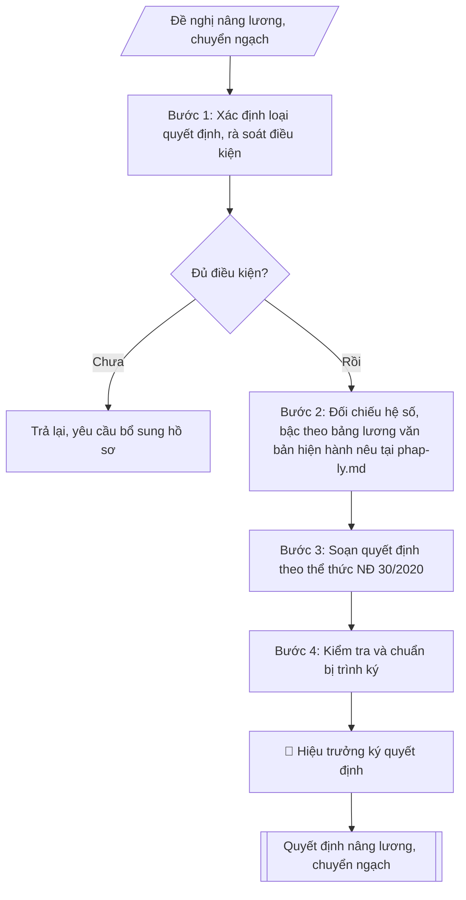

# Soạn quyết định nâng lương, phụ cấp thâm niên, chuyển ngạch

## Định dạng và file đầu ra
Định dạng đầu ra có thể chọn theo sản phẩm/yêu cầu: .docx, .pdf. Đọc mục “Định dạng bổ sung” trong quy cách đầu ra trước khi chọn.

**Phải tạo file thực tế để tải xuống, không chỉ trả nội dung trong chat.** Định dạng mặc định của skill: **.docx**. Nếu có bảng số liệu nghiệp vụ yêu cầu file bảng tính riêng, tạo thêm Excel theo yêu cầu; không tự tạo file kiểm tra. Không chờ người dùng yêu cầu xuất file lần nữa. Ưu tiên định dạng người dùng chỉ định; đọc quy tắc xuất file tại references/quy-cach-dau-ra.md.

## Quy cách đầu ra và thông tin thiếu
Khi dựng file Word/Excel, áp dụng mục “Thể thức và bảng biểu khi dựng file” trong quy cách đầu ra (cỡ chữ từng thành phần, bảng nhiều trang, số trang, phụ lục). Đọc [quy cách và cấu trúc sản phẩm](references/quy-cach-dau-ra.md) trước khi soạn/xuất. File giao chỉ gồm sản phẩm nghiệp vụ được yêu cầu; kiểm tra nội bộ không xuất kèm. Thiếu thông tin thì giữ nguyên trường/mục và chỗ điền theo mẫu gốc (dòng dấu chấm, dấu gạch hoặc ô trống); không tự điền dữ liệu mẫu, số 0, mã chờ xác minh hay dòng chờ ký. Mẫu chuyên ngành còn áp dụng được ưu tiên về cấu trúc, mã biểu và người ký. Bản đầy đủ: [quy tắc chung](references/quy-tac-chung.md).

## Kiểm soát áp dụng và phê duyệt
Trước khi chạy, xác định `ngay_ap_dung`, `loai_hinh_truong`, `quy_che_noi_bo`, `nguon_du_lieu`, `nguoi_kiem_duyet`; chỉ hỏi thông tin liên quan nghiệp vụ, không dùng giá trị giả định thay dữ liệu bắt buộc. Đối chiếu căn cứ pháp lý với văn bản gốc, hiệu lực, điều khoản áp dụng và chuyển tiếp. Bản đầy đủ: [quy tắc chung](references/quy-tac-chung.md).

Nếu có cập nhật pháp lý dưới đây, đọc [căn cứ và điều kiện áp dụng](references/phap-ly.md) trước khi làm. Quy trình dưới đây giữ nghiệp vụ từ bản gốc; mọi viện dẫn văn bản, mẫu biểu, điều khoản phải theo căn cứ đã chọn trong phap-ly.md, không theo văn bản cũ.

## Giới hạn và human gate
AI hỗ trợ chuẩn bị và đối chiếu; cán bộ phụ trách kiểm tra dữ liệu/căn cứ, người có thẩm quyền duyệt và ký. Không đánh dấu đã ký, đã duyệt, đã công bố khi chưa có chứng cứ. Dữ liệu sinh viên, sức khỏe, nhân sự, tài chính chỉ dùng theo mục đích và phân quyền, che thông tin định danh khi dùng ví dụ (Luật 91/2025/QH15, hiệu lực 01/01/2026); không tải dữ liệu lên dịch vụ ngoài khi chưa có quyền. Bản đầy đủ: [quy tắc chung](references/quy-tac-chung.md).

## Khi nào dùng
Khi xét nâng bậc lương thường xuyên (đủ 36 tháng giữ bậc đối với ngạch có hệ số lương
> 2,34; đủ 24 tháng đối với ngạch có hệ số ≤ 2,34), nâng bậc lương trước thời hạn
12 tháng do lập thành tích xuất sắc, xét hưởng phụ cấp thâm niên vượt khung
(đủ 36 tháng giữ bậc lương cuối cùng của ngạch), hoặc chuyển ngạch / chuyển chức danh
nghề nghiệp khi viên chức trúng tuyển / đủ tiêu chuẩn ngạch mới.

## Đầu vào (Input)
| Trường | Mô tả | Bắt buộc |
|---|---|---|
| `loai_qd` | Nâng bậc lương thường xuyên / Nâng lương trước thời hạn / Phụ cấp thâm niên vượt khung / Chuyển ngạch | Có |
| `danh_sach` | Danh sách viên chức: họ tên, ngày sinh, chức danh + mã ngạch hiện tại, đơn vị | Có |
| `luong_cu` | Bậc, hệ số lương hiện hưởng của từng người | Có |
| `luong_moi` | Bậc, hệ số lương mới (hoặc % phụ cấp TNVK; ngạch mới khi chuyển ngạch) | Có |
| `thoi_diem_huong` | Ngày bắt đầu hưởng lương mới (VD: 01/01/2027) | Có |
| `thoi_gian_giu_bac` | Thời gian giữ bậc lương hiện tại (để kiểm tra đủ điều kiện) | Có |
| `thanh_tich` | Thành tích làm căn cứ (nếu nâng trước thời hạn: danh hiệu thi đua, hình thức khen thưởng) | Không (bắt buộc nếu loại = trước thời hạn) |
| `nguoi_ky` | Hiệu trưởng | Có |

## Quy trình
**Ràng buộc pháp lý khi thực hiện** (trích references/phap-ly.md; đối chiếu toàn văn và hiệu lực tại ngày nghiệp vụ):
- Luật 129/2025/QH15; Nghị định 259/2026/NĐ-CP; phạm vi: Viên chức đơn vị sự nghiệp công lập; kiểm tra chuyển tiếp và quy định riêng về nhà giáo: Cập nhật căn cứ tuyển dụng, hợp đồng làm việc, bổ nhiệm, điều động và đào tạo viên chức. Không tái sử dụng số điều hoặc mẫu phiếu của NĐ 115. Phải yêu cầu ngày tuyển dụng, ngày phê duyệt kế hoạch, loại hợp đồng, trạng thái hồ sơ và bản văn NĐ 259 để chọn điều khoản chuyển tiếp; không tự áp dụng điều22 Luật Viên chức2010. Các văn bản cũ chỉ là căn cứ lịch sử khi chuyển tiếp cho phép.
- Nghị định 233/2026/NĐ-CP; phạm vi: Đánh giá đơn vị sự nghiệp công lập và viên chức: Dùng khung tiêu chí và quy chế đánh giá của đơn vị; bổ sung dữ liệu theo dõi/chấm điểm tháng hoặc quý, nhiệm vụ được giao, sản phẩm công việc, minh chứng, kết quả giám sát. Không tạo thang điểm từ trí nhớ, không tiếp tục ghi Mẫu03 của NĐ 90 là mẫu hiện hành. Tính điểm và xếp loại phải từ tiêu chí được phê duyệt; báo cáo liệt kê thiếu minh chứng.
- Luật Nhà giáo; Nghị định 93/2026/NĐ-CP; khoản 9 Điều 62 NĐ 259/2026; phạm vi: Viên chức là nhà giáo: Thêm input đối tượng là nhà giáo hay viên chức khác. Nếu pháp luật nhà giáo có quy định khác về thẩm quyền, tiêu chuẩn, điều kiện, trình tự, thủ tục tuyển dụng/sử dụng/quản lý, áp dụng quy định nhà giáo và hướng dẫn Bộ GDĐT thay vì quy tắc chung NĐ 259.
- Trước Bước 1: chọn căn cứ theo đối tượng, loại hình trường và chuyển tiếp; lập bảng văn bản / điều khoản / lý do áp dụng / bằng chứng. Thiếu văn bản gốc hoặc điều khoản thì ghi nhận nội bộ [CẦN XÁC MINH] (không đưa vào file giao), để trống phần tương ứng, chưa kết luận tuân thủ.
- Các con số, thời hạn, số điều, số mức xếp loại, hệ số và mẫu biểu nêu trong các bước dưới đây được giữ từ quy trình gốc (trước cập nhật pháp lý); chỉ dùng khi đã đối chiếu đúng với căn cứ đã chọn, khác thì theo căn cứ. Danh sách điểm cần đối chiếu: docs/DIEM_CAN_DOI_CHIEU_PHAP_LY.md.

**Bước 1. Xác định loại quyết định và rà soát điều kiện từng người**
- Làm gì: xác định loại quyết định (Nâng bậc lương thường xuyên / Nâng lương trước thời hạn / Phụ cấp thâm niên vượt khung / Chuyển ngạch) và kiểm tra điều kiện từng viên chức trong danh sách:
  - Nâng thường xuyên: đủ thời gian giữ bậc (36 tháng nếu hệ số > 2,34; 24 tháng nếu hệ số ≤ 2,34) + 2 năm liên tiếp xếp loại hoàn thành tốt nhiệm vụ trở lên, không vi phạm kỷ luật;
  - Nâng trước thời hạn: có thành tích xuất sắc (danh hiệu thi đua, hình thức khen thưởng kèm quyết định), tối đa 12 tháng;
  - Thâm niên vượt khung: đủ 36 tháng giữ bậc lương cuối cùng của ngạch;
  - Chuyển ngạch: có quyết định trúng tuyển / công nhận đủ tiêu chuẩn ngạch mới.
  Loại khỏi danh sách người chưa đủ điều kiện, ghi rõ lý do.
- Dùng input: `loai_qd`, `danh_sach`, `thoi_gian_giu_bac`, `thanh_tich`.
- Vai trò: Chuyên viên Phòng TCCB (Trưởng phòng kiểm tra lại) · AI hỗ trợ: phân tích input, xác định yêu cầu · ⏱ ~15–30 phút (ước tính)
- Lưu ý nghiệp vụ: nâng trước thời hạn không quá 2 lần liên tiếp trong quá trình công tác; thành tích làm căn cứ phải có quyết định khen thưởng kèm theo, không dùng giấy khen "chung chung".
- → Kết quả bước: danh sách viên chức đủ điều kiện + bảng rà soát điều kiện (đạt/không đạt, lý do).

**Bước 2. Đối chiếu hệ số – bậc theo bảng lương**
- Làm gì: tra bảng lương văn bản hiện hành nêu tại phap-ly.md cho từng người: nâng thường xuyên → bậc liền kề; chuyển ngạch → xếp bậc, hệ số mới theo nguyên tắc không thấp hơn lương đang hưởng (trừ trường hợp đặc biệt theo quy định); phụ cấp thâm niên vượt khung: 5% mức lương của bậc lương cuối cùng + 1% cho mỗi năm tiếp theo đủ 12 tháng.
- Dùng input: `luong_cu`, `luong_moi`, `loai_qd`.
- Vai trò: Chuyên viên Phòng TCCB (Trưởng phòng kiểm tra lại) · AI hỗ trợ: đối chiếu chéo tự động · ⏱ ~15–30 phút (ước tính)
- Lưu ý nghiệp vụ: kiểm tra chéo bậc/hệ số mới trực tiếp trên bảng lương — tra nhầm bậc là lỗi phổ biến; hệ số ngạch mới khi chuyển ngạch phải đúng quy định xếp lương.
- → Kết quả bước: bảng đối chiếu lương cũ → mới đã kiểm tra (họ tên, bậc–hệ số cũ, bậc–hệ số mới).

**Bước 3. Soạn quyết định theo thể thức NĐ 30/2020**
- Làm gì: soạn quyết định hành chính đầy đủ các phần: Quốc hiệu – Tiêu ngữ; tên cơ quan; số/ký hiệu; địa danh, ngày tháng; tên loại "QUYẾT ĐỊNH" + trích yếu; phần "Căn cứ..." (Luật Viên chức, văn bản hiện hành nêu tại phap-ly.md, biên bản họp Hội đồng lương); phần "Theo đề nghị..."; nội dung "QUYẾT ĐỊNH:" theo điều — Điều 1: loại nâng lương, danh sách viên chức trình bày dạng bảng (họ tên, chức danh/mã ngạch, đơn vị, bậc–hệ số cũ → mới) + thời điểm hưởng; Điều 2: trách nhiệm thi hành; Điều 3: hiệu lực; nơi nhận; chữ ký Hiệu trưởng.
- Dùng input: toàn bộ input và kết quả các bước 1–2 (`loai_qd`, `danh_sach`, `luong_cu`, `luong_moi`, `thoi_diem_huong`, `nguoi_ky`).
- Vai trò: Chuyên viên Phòng TCCB · AI hỗ trợ: soạn dự thảo đúng thể thức · ⏱ ~20–45 phút (ước tính)
- Lưu ý nghiệp vụ: thời điểm hưởng ghi rõ ngày/tháng/năm; danh sách nhiều người trình bày dạng bảng để dễ đối chiếu; thời điểm hưởng không sớm hơn thời điểm đủ điều kiện.
- → Kết quả bước: dự thảo quyết định hoàn chỉnh.

**Bước 4. Kiểm tra và chuẩn bị trình ký**
- Làm gì: đối chiếu danh sách trong dự thảo với biên bản họp Hội đồng lương (khớp 100%); kiểm tra hệ số/bậc đúng bảng lương, thời điểm hưởng đúng; kiểm tra thể thức, chính tả, số/ký hiệu; hoàn thiện để trình Hiệu trưởng ký, đóng dấu.
- Dùng input: `thoi_diem_huong`, `nguoi_ky`.
- Vai trò: Chuyên viên Phòng TCCB chuẩn bị, Hiệu trưởng phê duyệt · AI hỗ trợ: tổng hợp hồ sơ, soạn phiếu trình/tờ trình đầy đủ · ⏱ ~15–30 phút chuẩn bị + chờ duyệt (ước tính)
- Lưu ý nghiệp vụ: danh sách trong quyết định phải khớp tuyệt đối biên bản Hội đồng lương — sai một người thì phải sửa đồng thời cả hai văn bản.
- → Kết quả bước: dự thảo quyết định đã kiểm tra + checklist kiểm tra (trình ký tại Human gate; sau khi ký: ban hành, gửi các đơn vị và cá nhân, lưu hồ sơ).

## Luồng quy trình (Workflow)

## Đầu ra
- Quyết định nâng lương / phụ cấp thâm niên / chuyển ngạch hoàn chỉnh.
- Checklist kiểm tra điều kiện và thể thức.

File nghiệp vụ thực tế theo định dạng mặc định ở đầu skill hoặc định dạng người dùng yêu cầu, kèm liên kết tải trong phản hồi cuối.

Sản phẩm nghiệp vụ hoàn chỉnh theo [quy cách và cấu trúc](references/quy-cach-dau-ra.md), giữ các trường chưa có dữ liệu ở trạng thái trống. Không xuất kèm checklist/phụ lục kiểm tra đầu ra.

## Kiểm tra nội bộ trước khi giao
Các tiêu chí sau dùng để tự đối chiếu; không sao chép vào file xuất. Mục thiếu dữ liệu được để trống, không đánh dấu đã đạt hoặc đã duyệt.

- [ ] Đủ các phần và đúng bố cục theo cấu trúc tại references/quy-cach-dau-ra.md (không theo cấu trúc của bản gốc).
- [ ] Nội dung và số liệu trong output khớp đúng với Input đã cho (không thêm, bớt hay suy diễn)
- [ ] Không bịa đặt số liệu, minh chứng, trích dẫn hay căn cứ
- [ ] Đúng thể thức và cấu trúc theo references/quy-cach-dau-ra.md và căn cứ đã chọn tại references/phap-ly.md.
- [ ] Căn cứ pháp lý được trích dẫn đầy đủ và còn hiệu lực
- [ ] Đã qua Human gate: người có thẩm quyền đã kiểm tra/duyệt trước khi phát hành
- [ ] Thành tích làm căn cứ phải có quyết định khen thưởng kèm theo, không dùng giấy khen "chung chung"
- [ ] Kiểm tra chéo bậc/hệ số mới trực tiếp trên bảng lương — tra nhầm bậc là lỗi phổ biến
- [ ] Hệ số ngạch mới khi chuyển ngạch phải đúng quy định xếp lương

## Căn cứ & lưu ý
- Căn cứ hiện hành: xem [căn cứ và điều kiện áp dụng](references/phap-ly.md); phải đối chiếu văn bản gốc, hiệu lực và chuyển tiếp tại ngày nghiệp vụ.
- Nghị định 30/2020/NĐ-CP về thể thức văn bản (áp dụng cho quyết định hành chính).
- Lưu ý: nâng trước thời hạn tối đa 12 tháng và không quá 2 lần liên tiếp trong quá trình công tác;
  phụ cấp thâm niên vượt khung = 5% mức lương bậc cuối + 1% cho mỗi năm tiếp theo đủ 12 tháng;
  khi chuyển ngạch phải xếp lại bậc, hệ số theo nguyên tắc không thấp hơn lương đang hưởng
  (trừ trường hợp đặc biệt theo quy định).
- Không dùng tên thật của trường/cá nhân khi mô phỏng.

## Tư liệu đối chiếu
Bản gốc trước cập nhật pháp lý (kèm ví dụ giả lập) lưu tại `references/quy-trinh-lich-su.md`, chỉ để đối chiếu hồ sơ lịch sử; không dùng căn cứ, mẫu hay số liệu trong đó làm chỉ dẫn hiện hành.

## Quản trị phiên bản
- Phiên bản gói `1.3.2` (cập nhật 2026-10-10); hồ sơ đầy đủ tại [references/version.json](references/version.json).
- Người phê duyệt nghiệp vụ: **chưa chỉ định**. Trạng thái: dự thảo nghiệp vụ; kiểm tra pháp lý trước thực thi. Ngày cập nhật không đồng nghĩa mọi văn bản đã được rà soát toàn văn.
- Giấy phép theo LICENSE của kho (bản quyền CES Global). Lịch sử thay đổi: CHANGELOG.md.
