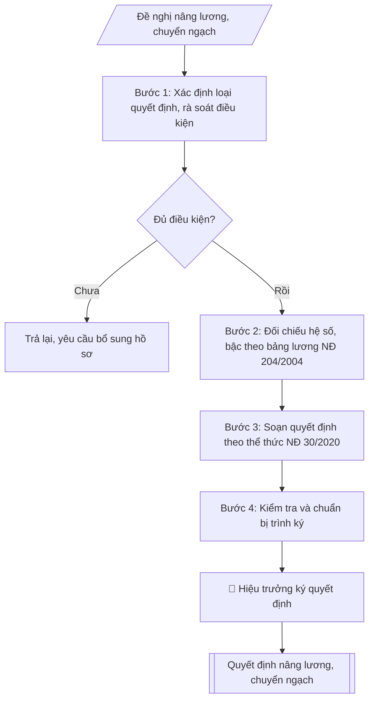

# Tư liệu lịch sử – không phải quy trình hiện hành

Nội dung từ phiên bản nguồn trước 1.1.0, giữ để đối chiếu dữ liệu đầu vào và thay đổi; căn cứ, điều kiện, mẫu và ví dụ có thể đã lỗi thời. Không dùng để thực hiện nghiệp vụ hiện tại.

## Khi nào dùng
Khi xét nâng bậc lương thường xuyên (đủ 36 tháng giữ bậc đối với ngạch có hệ số lương
> 2,34; đủ 24 tháng đối với ngạch có hệ số ≤ 2,34), nâng bậc lương trước thời hạn
12 tháng do lập thành tích xuất sắc, xét hưởng phụ cấp thâm niên vượt khung
(đủ 36 tháng giữ bậc lương cuối cùng của ngạch), hoặc chuyển ngạch / chuyển chức danh
nghề nghiệp khi viên chức trúng tuyển / đủ tiêu chuẩn ngạch mới.

## Đầu vào (Input)

| Trường | Mô tả | Bắt buộc |
|---|---|---|
| `loai_qd` | Nâng bậc lương thường xuyên / Nâng lương trước thời hạn / Phụ cấp thâm niên vượt khung / Chuyển ngạch | Có |
| `danh_sach` | Danh sách viên chức: họ tên, ngày sinh, chức danh + mã ngạch hiện tại, đơn vị | Có |
| `luong_cu` | Bậc, hệ số lương hiện hưởng của từng người | Có |
| `luong_moi` | Bậc, hệ số lương mới (hoặc % phụ cấp TNVK; ngạch mới khi chuyển ngạch) | Có |
| `thoi_diem_huong` | Ngày bắt đầu hưởng lương mới (VD: 01/01/2027) | Có |
| `thoi_gian_giu_bac` | Thời gian giữ bậc lương hiện tại (để kiểm tra đủ điều kiện) | Có |
| `thanh_tich` | Thành tích làm căn cứ (nếu nâng trước thời hạn: danh hiệu thi đua, hình thức khen thưởng) | Không (bắt buộc nếu loại = trước thời hạn) |
| `nguoi_ky` | Hiệu trưởng | Có |

## Quy trình

**Bước 1. Xác định loại quyết định và rà soát điều kiện từng người**
- Làm gì: xác định loại quyết định (Nâng bậc lương thường xuyên / Nâng lương trước thời hạn / Phụ cấp thâm niên vượt khung / Chuyển ngạch) và kiểm tra điều kiện từng viên chức trong danh sách:
  - Nâng thường xuyên: đủ thời gian giữ bậc (36 tháng nếu hệ số > 2,34; 24 tháng nếu hệ số ≤ 2,34) + 2 năm liên tiếp xếp loại hoàn thành tốt nhiệm vụ trở lên, không vi phạm kỷ luật;
  - Nâng trước thời hạn: có thành tích xuất sắc (danh hiệu thi đua, hình thức khen thưởng kèm quyết định), tối đa 12 tháng;
  - Thâm niên vượt khung: đủ 36 tháng giữ bậc lương cuối cùng của ngạch;
  - Chuyển ngạch: có quyết định trúng tuyển / công nhận đủ tiêu chuẩn ngạch mới.
  Loại khỏi danh sách người chưa đủ điều kiện, ghi rõ lý do.
- Dùng input: `loai_qd`, `danh_sach`, `thoi_gian_giu_bac`, `thanh_tich`.
- Vai trò: Chuyên viên Phòng TCCB (Trưởng phòng kiểm tra lại) · AI hỗ trợ: phân tích input, xác định yêu cầu · ⏱ ~15–30 phút (ước tính)
- Lưu ý nghiệp vụ: nâng trước thời hạn không quá 2 lần liên tiếp trong quá trình công tác; thành tích làm căn cứ phải có quyết định khen thưởng kèm theo, không dùng giấy khen "chung chung".
- → Kết quả bước: danh sách viên chức đủ điều kiện + bảng rà soát điều kiện (đạt/không đạt, lý do).

**Bước 2. Đối chiếu hệ số – bậc theo bảng lương**
- Làm gì: tra bảng lương NĐ 204/2004 cho từng người: nâng thường xuyên → bậc liền kề; chuyển ngạch → xếp bậc, hệ số mới theo nguyên tắc không thấp hơn lương đang hưởng (trừ trường hợp đặc biệt theo quy định); phụ cấp thâm niên vượt khung: 5% mức lương của bậc lương cuối cùng + 1% cho mỗi năm tiếp theo đủ 12 tháng.
- Dùng input: `luong_cu`, `luong_moi`, `loai_qd`.
- Vai trò: Chuyên viên Phòng TCCB (Trưởng phòng kiểm tra lại) · AI hỗ trợ: đối chiếu chéo tự động · ⏱ ~15–30 phút (ước tính)
- Lưu ý nghiệp vụ: kiểm tra chéo bậc/hệ số mới trực tiếp trên bảng lương — tra nhầm bậc là lỗi phổ biến; hệ số ngạch mới khi chuyển ngạch phải đúng quy định xếp lương.
- → Kết quả bước: bảng đối chiếu lương cũ → mới đã kiểm tra (họ tên, bậc–hệ số cũ, bậc–hệ số mới).

**Bước 3. Soạn quyết định theo thể thức NĐ 30/2020**
- Làm gì: soạn quyết định hành chính đầy đủ các phần: Quốc hiệu – Tiêu ngữ; tên cơ quan; số/ký hiệu; địa danh, ngày tháng; tên loại "QUYẾT ĐỊNH" + trích yếu; phần "Căn cứ..." (Luật Viên chức, NĐ 204/2004, NĐ 115/2020, biên bản họp Hội đồng lương); phần "Theo đề nghị..."; nội dung "QUYẾT ĐỊNH:" theo điều — Điều 1: loại nâng lương, danh sách viên chức trình bày dạng bảng (họ tên, chức danh/mã ngạch, đơn vị, bậc–hệ số cũ → mới) + thời điểm hưởng; Điều 2: trách nhiệm thi hành; Điều 3: hiệu lực; nơi nhận; chữ ký Hiệu trưởng.
- Dùng input: toàn bộ input và kết quả các bước 1–2 (`loai_qd`, `danh_sach`, `luong_cu`, `luong_moi`, `thoi_diem_huong`, `nguoi_ky`).
- Vai trò: Chuyên viên Phòng TCCB · AI hỗ trợ: soạn dự thảo đúng thể thức · ⏱ ~20–45 phút (ước tính)
- Lưu ý nghiệp vụ: thời điểm hưởng ghi rõ ngày/tháng/năm; danh sách nhiều người trình bày dạng bảng để dễ đối chiếu; thời điểm hưởng không sớm hơn thời điểm đủ điều kiện.
- → Kết quả bước: dự thảo quyết định hoàn chỉnh.

**Bước 4. Kiểm tra và chuẩn bị trình ký**
- Làm gì: đối chiếu danh sách trong dự thảo với biên bản họp Hội đồng lương (khớp 100%); kiểm tra hệ số/bậc đúng bảng lương, thời điểm hưởng đúng; kiểm tra thể thức, chính tả, số/ký hiệu; hoàn thiện để trình Hiệu trưởng ký, đóng dấu.
- Dùng input: `thoi_diem_huong`, `nguoi_ky`.
- Vai trò: Chuyên viên Phòng TCCB chuẩn bị, Hiệu trưởng phê duyệt · AI hỗ trợ: tổng hợp hồ sơ, soạn phiếu trình/tờ trình đầy đủ · ⏱ ~15–30 phút chuẩn bị + chờ duyệt (ước tính)
- Lưu ý nghiệp vụ: danh sách trong quyết định phải khớp tuyệt đối biên bản Hội đồng lương — sai một người thì phải sửa đồng thời cả hai văn bản.
- → Kết quả bước: dự thảo quyết định đã kiểm tra + checklist kiểm tra (trình ký tại Human gate; sau khi ký: ban hành, gửi các đơn vị và cá nhân, lưu hồ sơ).

## Luồng quy trình (Workflow)



## Đầu ra (Output)
- Quyết định nâng lương / phụ cấp thâm niên / chuyển ngạch hoàn chỉnh.
- Checklist kiểm tra điều kiện và thể thức.

**Cấu trúc output chuẩn** (Quyết định nâng lương / phụ cấp thâm niên / chuyển ngạch):
1. Quốc hiệu – Tiêu ngữ;
2. Tên cơ quan ban hành;
3. Số, ký hiệu văn bản;
4. Địa danh, ngày tháng năm ban hành;
5. Tên loại "QUYẾT ĐỊNH" + trích yếu;
6. Người ban hành (HIỆU TRƯỞNG...);
7. Phần "Căn cứ..." (Luật Viên chức, NĐ 204/2004, NĐ 115/2020, biên bản họp Hội đồng lương);
8. Phần "Theo đề nghị..." (Trưởng phòng Tổ chức – Cán bộ);
9. Nội dung "QUYẾT ĐỊNH:": Điều 1 (loại nâng lương; danh sách viên chức trình bày dạng bảng:
   họ tên, chức danh/mã ngạch, đơn vị, bậc–hệ số cũ → mới; thời điểm hưởng), Điều 2 (trách nhiệm thi hành),
   Điều 3 (hiệu lực);
10. Nơi nhận;
11. Chữ ký, đóng dấu.

## Checklist nghiệm thu

Tiêu chí đạt: tất cả các ô dưới đây được đánh dấu.

- [ ] Đủ các phần theo Cấu trúc output chuẩn: Quốc hiệu – Tiêu ngữ; Tên cơ quan ban hành; Số, ký hiệu văn bản; Địa danh, ngày tháng năm ban hành; … (đủ 11 phần)
- [ ] Nội dung và số liệu trong output khớp đúng với Input đã cho (không thêm, bớt hay suy diễn)
- [ ] Không bịa đặt số liệu, minh chứng, trích dẫn hay căn cứ
- [ ] Đúng thể thức và định dạng theo Nghị định 204/2004/NĐ-CP về chế độ tiền lương đối với cán bộ, công…
- [ ] Căn cứ pháp lý được trích dẫn đầy đủ và còn hiệu lực
- [ ] Đã qua Human gate: người có thẩm quyền đã kiểm tra/duyệt trước khi phát hành
- [ ] Thành tích làm căn cứ phải có quyết định khen thưởng kèm theo, không dùng giấy khen "chung chung"
- [ ] Kiểm tra chéo bậc/hệ số mới trực tiếp trên bảng lương — tra nhầm bậc là lỗi phổ biến
- [ ] Hệ số ngạch mới khi chuyển ngạch phải đúng quy định xếp lương

## Ví dụ mô phỏng (dữ liệu giả lập)

> Tất cả tên trường, cá nhân, số liệu dưới đây đều là **giả lập**, không liên quan tổ chức/cá nhân có thật.

### Input mẫu

| Trường | Giá trị |
|---|---|
| `loai_qd` | Nâng bậc lương thường xuyên |
| `danh_sach` | 1. TS. Trần Văn D (12/06/1982), Giảng viên chính hạng II – V.07.01.02, Khoa CNTT. 2. ThS. Bùi Thị A (25/09/1990), Giảng viên hạng III – V.07.01.03, Khoa Kinh tế. 3. ThS. Đỗ Thị A (14/03/1998), Giảng viên hạng III – V.07.01.03, Khoa CNTT |
| `luong_cu` | Trần Văn D: bậc 3/8, hệ số 4,40; Bùi Thị A: bậc 2/9, hệ số 2,67; Đỗ Thị A: bậc 1/9, hệ số 2,34 |
| `luong_moi` | Trần Văn D: bậc 4/8, hệ số 4,74; Bùi Thị A: bậc 3/9, hệ số 3,00; Đỗ Thị A: bậc 2/9, hệ số 2,67 |
| `thoi_diem_huong` | 01/01/2027 |
| `thoi_gian_giu_bac` | Cả 3 người đều đủ 36 tháng giữ bậc hiện tại; 2 năm 2024–2025 xếp loại Hoàn thành tốt nhiệm vụ trở lên, không vi phạm kỷ luật |
| `nguoi_ky` | Hiệu trưởng |

### Output mẫu

```
TRƯỜNG ĐẠI HỌC A            CỘNG HÒA XÃ HỘI CHỦ NGHĨA VIỆT NAM
                                         Độc lập – Tự do – Hạnh phúc
      Số: 12/QĐ-ĐHA
                                                 Thành phố C, ngày 05 tháng 01 năm 2027

QUYẾT ĐỊNH
Về việc nâng bậc lương thường xuyên đối với viên chức

HIỆU TRƯỞNG TRƯỜNG ĐẠI HỌC A

Căn cứ Luật Viên chức số 58/2010/QH12 và Luật sửa đổi, bổ sung một số điều
của Luật Cán bộ, công chức và Luật Viên chức;
Căn cứ Nghị định số 204/2004/NĐ-CP ngày 14/12/2004 của Chính phủ về chế độ
tiền lương đối với cán bộ, công chức, viên chức và lực lượng vũ trang;
Căn cứ Nghị định số 115/2020/NĐ-CP ngày 25/9/2020 của Chính phủ về tuyển dụng,
sử dụng và quản lý viên chức;
Căn cứ Biên bản họp Hội đồng xét nâng bậc lương ngày 28/12/2026;
Theo đề nghị của Trưởng phòng Tổ chức – Cán bộ,

QUYẾT ĐỊNH:

Điều 1. Nâng bậc lương thường xuyên cho 03 viên chức có tên sau, thời điểm
hưởng lương mới từ ngày 01/01/2027:

| TT | Họ và tên | Chức danh, mã ngạch | Đơn vị | Bậc, hệ số cũ | Bậc, hệ số mới |
|---|---|---|---|---|---|
| 1 | TS. Trần Văn D | Giảng viên chính hạng II – V.07.01.02 | Khoa CNTT | 3/8 – 4,40 | 4/8 – 4,74 |
| 2 | ThS. Bùi Thị A | Giảng viên hạng III – V.07.01.03 | Khoa Kinh tế | 2/9 – 2,67 | 3/9 – 3,00 |
| 3 | ThS. Đỗ Thị A | Giảng viên hạng III – V.07.01.03 | Khoa CNTT | 1/9 – 2,34 | 2/9 – 2,67 |

Điều 2. Trưởng phòng Tổ chức – Cán bộ, Trưởng phòng Tài chính – Kế toán,
Thủ trưởng các đơn vị có liên quan và các viên chức có tên tại Điều 1 chịu
trách nhiệm thi hành Quyết định này.

Điều 3. Quyết định này có hiệu lực kể từ ngày ký./.

Nơi nhận:                                             HIỆU TRƯỞNG
- Như Điều 2;                                              (đã ký, đóng dấu)
- Lưu: VT, TCCB.

                                                    PGS.TS. Trần Văn B
```

### Checklist kiểm tra (output kèm theo)
- [x] Đúng loại quyết định (nâng bậc lương thường xuyên)
- [x] Đủ căn cứ pháp lý (Luật Viên chức, NĐ 204/2004, NĐ 115/2020, biên bản Hội đồng lương)
- [x] Điều kiện từng người: đủ thời gian giữ bậc, xếp loại 2 năm liền đạt yêu cầu, không kỷ luật
- [x] Hệ số, bậc mới đúng bảng lương NĐ 204/2004 (bậc liền kề)
- [x] Thời điểm hưởng lương mới rõ ràng
- [x] Thẩm quyền ký (Hiệu trưởng), nơi nhận đầy đủ

## Căn cứ & lưu ý
- Nghị định 204/2004/NĐ-CP về chế độ tiền lương đối với cán bộ, công chức, viên chức.
- Nghị định 90/2020/NĐ-CP về đánh giá, xếp loại viên chức (căn cứ điều kiện nâng lương).
- Nghị định 115/2020/NĐ-CP về tuyển dụng, sử dụng và quản lý viên chức.
- Nghị định 30/2020/NĐ-CP về thể thức văn bản (áp dụng cho quyết định hành chính).
- Lưu ý: nâng trước thời hạn tối đa 12 tháng và không quá 2 lần liên tiếp trong quá trình công tác;
  phụ cấp thâm niên vượt khung = 5% mức lương bậc cuối + 1% cho mỗi năm tiếp theo đủ 12 tháng;
  khi chuyển ngạch phải xếp lại bậc, hệ số theo nguyên tắc không thấp hơn lương đang hưởng
  (trừ trường hợp đặc biệt theo quy định).
- Không dùng tên thật của trường/cá nhân khi mô phỏng.
