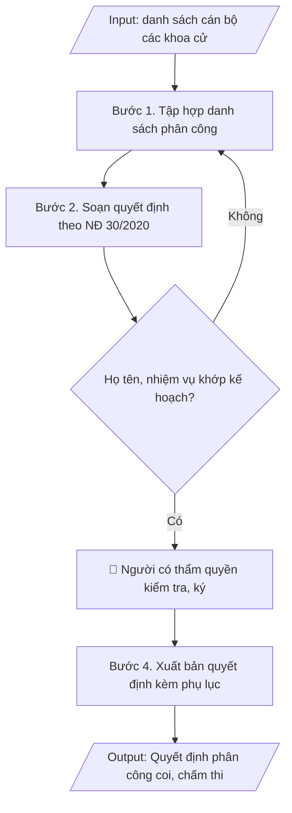

# Skill: Quyết định phân công coi thi / chấm thi

## Khi nào dùng
Khi cần ban hành quyết định phân công cán bộ tham gia coi thi, chấm thi, thanh tra thi
cho một kỳ thi cụ thể.

## Đầu vào (Input)

| Trường | Mô tả | Bắt buộc |
|---|---|---|
| `ky_thi` | Tên kỳ thi | Có |
| `thoi_gian` | Thời gian diễn ra kỳ thi | Có |
| `danh_sach_phan_cong` | Bảng: họ tên, đơn vị, nhiệm vụ (coi thi/chấm thi/thanh tra/thư ký), ghi chú | Có |
| `can_cu` | Các văn bản căn cứ (quy chế đào tạo, kế hoạch tổ chức kỳ thi...) | Có |
| `nguoi_ky` | Hiệu trưởng / Phó Hiệu trưởng | Có |

## Quy trình

**Bước 1. Tập hợp danh sách phân công**
- Làm gì: Gửi văn bản đề nghị các khoa, phòng cử cán bộ tham gia kỳ thi (ghi rõ số lượng, yêu cầu chuyên môn); Phòng Khảo thí & ĐBCL tổng hợp danh sách: họ tên, chức danh/học vị, đơn vị, nhiệm vụ đề xuất (coi thi/chấm thi/thanh tra/thư ký), ca thi/phạm vi phụ trách; loại khỏi danh sách các cán bộ có người thân dự thi học phần được phân công (tránh xung đột lợi ích).
- Dùng input: `ky_thi`, `thoi_gian`, `danh_sach_phan_cong`.
- Vai trò: Chuyên viên Phòng Khảo thí & ĐBCL · AI hỗ trợ: tổng hợp danh sách sơ bộ từ văn bản cử cán bộ của các khoa, rà soát trùng tên và xung đột lợi ích · ⏱ ~2 giờ (ước tính)
- Lưu ý nghiệp vụ: cán bộ chấm thi phải đúng chuyên môn học phần; cán bộ thanh tra thi phải độc lập, không kiêm nhiệm coi thi cùng ca; kiểm tra không trùng tên, không sót đơn vị được giao chỉ tiêu.
- → Kết quả bước: Bảng tổng hợp danh sách cán bộ phân công đã rà soát xung đột lợi ích.

**Bước 2. Soạn quyết định theo thể thức NĐ 30/2020**
- Làm gì: Soạn thảo văn bản quyết định đúng thể thức Nghị định 30/2020/NĐ-CP với bố cục: (a) Phần căn cứ — Luật Giáo dục đại học, quy chế đào tạo, kế hoạch tổ chức kỳ thi (trích từ `can_cu`); (b) "Xét đề nghị của Trưởng phòng Khảo thí & ĐBCL"; (c) Điều 1 — phân công cán bộ (danh sách chi tiết kèm theo phụ lục); (d) Điều 2 — nhiệm vụ và trách nhiệm của từng nhóm (thực hiện đúng quy chế thi, chịu trách nhiệm trước Hiệu trưởng); (e) Điều 3 — hiệu lực thi hành và trách nhiệm thi hành; (f) Nơi nhận đầy đủ các đơn vị liên quan + lưu.
- Dùng input: `ky_thi`, `thoi_gian`, `can_cu`, `nguoi_ky`, `danh_sach_phan_cong`.
- Vai trò: Chuyên viên Phòng Khảo thí & ĐBCL · AI hỗ trợ: soạn dự thảo đúng thể thức NĐ 30/2020/NĐ-CP, kiểm tra lỗi chính tả và đánh số/ký hiệu văn bản · ⏱ ~45 phút (ước tính)
- Lưu ý nghiệp vụ: thẩm quyền ký — Hiệu trưởng ký quyết định phân công toàn kỳ thi, Phó Hiệu trưởng ký khi được ủy quyền; số/ký hiệu văn bản đánh số liên tục theo sổ văn thư; trích yếu ghi đúng tên kỳ thi.
- → Kết quả bước: Dự thảo quyết định phân công + phụ lục danh sách cán bộ.

**Bước 3. Kiểm tra**
- Làm gì: Đối chiếu từng dòng trong phụ lục danh sách với bảng tổng hợp ở Bước 1: họ tên, đơn vị, nhiệm vụ, ca thi; kiểm tra thẩm quyền ký của `nguoi_ky`; kiểm tra nơi nhận đủ các đơn vị có cán bộ được phân công; hiệu đính lỗi chính tả, số liệu trước khi trình ký.
- Dùng input: `danh_sach_phan_cong`, `nguoi_ky`.
- Vai trò: Trưởng phòng Khảo thí & ĐBCL (rà soát, hiệu đính) · AI hỗ trợ: đối chiếu từng dòng phụ lục với bảng tổng hợp, cảnh báo sai lệch họ tên/nhiệm vụ · ⏱ ~1 giờ (ước tính)
- Lưu ý nghiệp vụ: bẫy thường gặp — sai họ tên/học vị cán bộ, thiếu đơn vị trong nơi nhận, nhiệm vụ trong quyết định không khớp với phân công thực tế đã thông báo cho khoa.
- → Kết quả bước: Dự thảo quyết định đã hiệu đính, sẵn sàng trình ký.

**Bước 4. Xuất bản**
- Làm gì: Trình `nguoi_ky` ký ban hành; đóng dấu, đánh số, lưu văn thư; gửi quyết định đến tất cả đơn vị trong nơi nhận và từng cán bộ được phân công trước ngày thi ít nhất 03 ngày; lưu 01 bản vào hồ sơ kỳ thi.
- Dùng input: `nguoi_ky`, `ky_thi`.
- Vai trò: Hiệu trưởng/Phó Hiệu trưởng ký ban hành, Văn thư đóng dấu và phát hành · AI hỗ trợ: kiểm tra nơi nhận đầy đủ các đơn vị trước khi phát hành · ⏱ ~0,5 ngày làm việc (ước tính)
- Lưu ý nghiệp vụ: quyết định là minh chứng kiểm định cho công tác tổ chức thi — phải lưu đầy đủ, mã hóa theo quy tắc của trường.
- → Kết quả bước: Quyết định phân công coi/chấm thi đã ban hành + phụ lục danh sách cán bộ.

## Luồng quy trình (Workflow)


## Đầu ra (Output)
- Văn bản quyết định phân công hoàn chỉnh.
- Phụ lục: danh sách cán bộ coi thi / chấm thi / thanh tra.

**Cấu trúc output chuẩn:** quyết định theo thể thức Nghị định 30/2020/NĐ-CP, các phần bắt buộc theo đúng thứ tự:
1. Quốc hiệu, tên cơ quan ban hành, số/ký hiệu văn bản, địa danh và ngày tháng năm ban hành;
2. Tên loại văn bản (QUYẾT ĐỊNH) + trích yếu nội dung;
3. Thẩm quyền ban hành (chức vụ người ký + tên cơ quan, viết hoa);
4. Các căn cứ pháp lý (mỗi căn cứ một dòng, bắt đầu bằng "Căn cứ");
5. "Xét đề nghị của..." (đơn vị đề xuất);
6. "QUYẾT ĐỊNH:" + các điều: Điều 1 – nội dung phân công (danh sách chi tiết kèm theo); Điều 2 – nhiệm vụ, trách nhiệm của các cá nhân/đơn vị; Điều 3 – hiệu lực thi hành và trách nhiệm thi hành;
7. Nơi nhận (đầy đủ các đơn vị liên quan + lưu);
8. Chức vụ người ký, chữ ký, họ tên người ký (đóng dấu);
9. Phụ lục – Danh sách cán bộ phân công (STT, họ tên, đơn vị, nhiệm vụ, ghi chú).

## Checklist nghiệm thu

- [ ] Đủ 9 phần theo "Cấu trúc output chuẩn" NĐ 30/2020: quốc hiệu + số/ký hiệu + địa danh, ngày tháng; QUYẾT ĐỊNH + trích yếu; thẩm quyền ban hành; các căn cứ pháp lý; "Xét đề nghị của..."; các điều (Điều 1 – nội dung phân công; Điều 2 – nhiệm vụ, trách nhiệm; Điều 3 – hiệu lực thi hành); Nơi nhận; chức vụ/chữ ký/họ tên người ký (đóng dấu); Phụ lục danh sách cán bộ phân công.
- [ ] Danh sách cán bộ trong phụ lục khớp 100% với Input (`danh_sach_phan_cong`): họ tên, học vị, đơn vị, nhiệm vụ, ca thi.
- [ ] Không bịa đặt họ tên, học vị, chức danh cán bộ.
- [ ] Đúng thể thức Nghị định 30/2020/NĐ-CP: mỗi căn cứ một dòng bắt đầu bằng "Căn cứ", số/ký hiệu văn bản liên tục theo sổ văn thư, trích yếu ghi đúng tên kỳ thi.
- [ ] Căn cứ pháp lý (Luật Giáo dục đại học, quy chế đào tạo, kế hoạch tổ chức kỳ thi) đầy đủ, còn hiệu lực.
- [ ] Đã qua Human gate: người có thẩm quyền theo quy trình đã duyệt.
- [ ] Thẩm quyền ký đúng: Hiệu trưởng ký quyết định phân công toàn kỳ thi, Phó Hiệu trưởng ký khi được ủy quyền.
- [ ] Đã loại khỏi danh sách cán bộ có người thân dự thi học phần được phân công; cán bộ thanh tra thi độc lập, không kiêm coi thi cùng ca.
- [ ] Đã gửi quyết định đến đầy đủ đơn vị trong nơi nhận và từng cán bộ được phân công trước ngày thi ít nhất 03 ngày.

Tiêu chí đạt = tất cả các ô được đánh dấu.

## Ví dụ mô phỏng (dữ liệu giả lập)

> Tất cả tên trường, cá nhân, số liệu dưới đây đều là **giả lập**, không liên quan tổ chức/cá nhân có thật.

### Input mẫu

| Trường | Giá trị |
|---|---|
| `ky_thi` | Thi kết thúc học phần học kỳ 1, năm học 2026–2027 |
| `thoi_gian` | 15/12/2026 – 03/01/2027 |
| `danh_sach_phan_cong` | 08 cán bộ (xem phụ lục mẫu) |
| `can_cu` | Quy chế đào tạo trình độ đại học (TT 08/2021/TT-BGDĐT); Kế hoạch số 78/KH-ĐHA-KTĐBCL ngày 09/10/2026 |
| `nguoi_ky` | Phó Hiệu trưởng |

### Output mẫu

```
TRƯỜNG ĐẠI HỌC A            CỘNG HÒA XÃ HỘI CHỦ NGHĨA VIỆT NAM
                                              Độc lập – Tự do – Hạnh phúc
      Số: 210/QĐ-ĐHA
                                                 Thành phố C, ngày 09 tháng 10 năm 2026

QUYẾT ĐỊNH
Về việc phân công cán bộ coi thi, chấm thi kỳ thi kết thúc học phần
học kỳ 1, năm học 2026–2027

HIỆU TRƯỞNG TRƯỜNG ĐẠI HỌC A

Căn cứ Luật Giáo dục đại học ngày 18/6/2012 và Luật sửa đổi, bổ sung năm 2018;
Căn cứ Quy chế đào tạo trình độ đại học ban hành kèm theo Thông tư
số 08/2021/TT-BGDĐT ngày 18/3/2021 của Bộ trưởng Bộ Giáo dục và Đào tạo;
Căn cứ Kế hoạch số 78/KH-ĐHA-KTĐBCL ngày 09/10/2026 về tổ chức thi kết thúc
học phần học kỳ 1, năm học 2026–2027;
Xét đề nghị của Trưởng phòng Khảo thí & Đảm bảo chất lượng,

QUYẾT ĐỊNH:

Điều 1. Phân công cán bộ tham gia coi thi, chấm thi, thanh tra kỳ thi kết thúc
học phần học kỳ 1, năm học 2026–2027 (danh sách chi tiết kèm theo).

Điều 2. Các ông (bà) có tên trong danh sách có trách nhiệm thực hiện đúng
quy chế thi và kế hoạch tổ chức kỳ thi; chịu trách nhiệm trước Hiệu trưởng
về nhiệm vụ được phân công.

Điều 3. Quyết định này có hiệu lực kể từ ngày ký. Trưởng các đơn vị có liên quan
và các ông (bà) có tên tại Điều 1 chịu trách nhiệm thi hành Quyết định này./.

Nơi nhận:                                            HIỆU TRƯỞNG
- Như Điều 3;                                            (đã ký)
- Lưu: VT, KTĐBCL, TCCB.

                                                   GS.TS. Hoàng Văn A
```

**Phụ lục – Danh sách phân công (mẫu giả lập)**

| STT | Họ tên | Đơn vị | Nhiệm vụ | Ghi chú |
|---|---|---|---|---|
| 1 | TS. Phạm Văn B | Khoa CNTT | Tổ trưởng tổ coi thi | Ca sáng |
| 2 | ThS. Bùi Thị B | Khoa CNTT | Cán bộ coi thi | Ca sáng |
| 3 | ThS. Trần Văn D | Khoa Kinh tế | Cán bộ coi thi | Ca chiều |
| 4 | TS. Đỗ Thị C | Phòng KT&ĐBCL | Thư ký hội đồng thi | Toàn kỳ |
| 5 | ThS. Ngô Văn B | Phòng Thanh tra & PC | Thanh tra thi | Độc lập |
| 6 | TS. Vũ Thị Lan | Khoa CNTT | Tổ trưởng tổ chấm thi | Tự luận |
| 7 | ThS. Đỗ Văn B | Khoa Kinh tế | Cán bộ chấm thi | Tự luận |
| 8 | CN. Hoàng Thị D | Phòng KT&ĐBCL | Nhập điểm, tổng hợp | Toàn kỳ |

## Căn cứ & lưu ý
- Nghị định 30/2020/NĐ-CP về công tác văn thư (thể thức quyết định).
- Quy chế đào tạo trình độ đại học (Thông tư 08/2021/TT-BGDĐT).
- Cán bộ có người thân dự thi không được phân công coi/chấm thi học phần đó (tránh xung đột lợi ích).
- Không dùng tên thật của trường/cá nhân khi mô phỏng.
