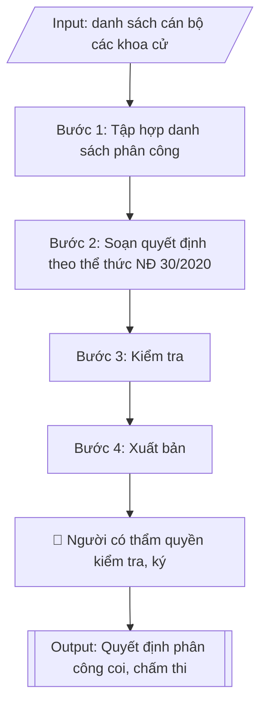

# Quyết định phân công coi thi / chấm thi

## Định dạng và file đầu ra
Định dạng đầu ra có thể chọn theo sản phẩm/yêu cầu: .docx, .pdf. Đọc mục “Định dạng bổ sung” trong quy cách đầu ra trước khi chọn.

**Phải tạo file thực tế để tải xuống, không chỉ trả nội dung trong chat.** Định dạng mặc định của skill: **.docx**. Nếu có bảng số liệu nghiệp vụ yêu cầu file bảng tính riêng, tạo thêm Excel theo yêu cầu; không tự tạo file kiểm tra. Không chờ người dùng yêu cầu xuất file lần nữa. Ưu tiên định dạng người dùng chỉ định; đọc quy tắc xuất file tại references/quy-cach-dau-ra.md.

## Quy cách đầu ra và thông tin thiếu
Đọc [quy cách và cấu trúc sản phẩm](references/quy-cach-dau-ra.md) trước khi soạn/xuất. File giao chỉ gồm sản phẩm nghiệp vụ được yêu cầu; kiểm tra nội bộ không xuất kèm. Thiếu thông tin thì giữ nguyên trường/mục và chỗ điền theo mẫu gốc (dòng dấu chấm, dấu gạch hoặc ô trống); không tự điền dữ liệu mẫu, số 0, mã chờ xác minh hay dòng chờ ký. Mẫu chuyên ngành còn áp dụng được ưu tiên về cấu trúc, mã biểu và người ký. Bản đầy đủ: [quy tắc chung](references/quy-tac-chung.md).

## Kiểm soát áp dụng và phê duyệt
Trước khi chạy, xác định `ngay_ap_dung`, `loai_hinh_truong`, `quy_che_noi_bo`, `nguon_du_lieu`, `nguoi_kiem_duyet`; chỉ hỏi thông tin liên quan nghiệp vụ, không dùng giá trị giả định thay dữ liệu bắt buộc. Đối chiếu căn cứ pháp lý với văn bản gốc, hiệu lực, điều khoản áp dụng và chuyển tiếp. Bản đầy đủ: [quy tắc chung](references/quy-tac-chung.md).

Nếu có cập nhật pháp lý dưới đây, đọc [căn cứ và điều kiện áp dụng](references/phap-ly.md) trước khi làm. Quy trình dưới đây giữ nghiệp vụ từ bản gốc; mọi viện dẫn văn bản, mẫu biểu, điều khoản phải theo căn cứ đã chọn trong phap-ly.md, không theo văn bản cũ.

## Giới hạn và human gate
AI hỗ trợ chuẩn bị và đối chiếu; cán bộ phụ trách kiểm tra dữ liệu/căn cứ, người có thẩm quyền duyệt và ký. Không đánh dấu đã ký, đã duyệt, đã công bố khi chưa có chứng cứ. Dữ liệu sinh viên, sức khỏe, nhân sự, tài chính chỉ dùng theo mục đích và phân quyền, che thông tin định danh khi dùng ví dụ (Luật 91/2025/QH15, hiệu lực 01/01/2026); không tải dữ liệu lên dịch vụ ngoài khi chưa có quyền. Bản đầy đủ: [quy tắc chung](references/quy-tac-chung.md).

## Khi nào dùng
Khi cần ban hành quyết định phân công cán bộ tham gia coi thi, chấm thi, thanh tra thi
cho một kỳ thi cụ thể.

## Đầu vào (Input)
| Trường | Mô tả | Bắt buộc |
|---|---|---|
| `ky_thi` | Tên kỳ thi | Có |
| `thoi_gian` | Thời gian diễn ra kỳ thi | Có |
| `danh_sach_phan_cong` | Bảng: họ tên, đơn vị, nhiệm vụ (coi thi/chấm thi/thanh tra/thư ký), ghi chú | Có |
| `can_cu` | Các văn bản căn cứ (quy chế đào tạo, kế hoạch tổ chức kỳ thi...) | Có |
| `nguoi_ky` | Hiệu trưởng / Phó Hiệu trưởng | Có |

## Quy trình
**Ràng buộc pháp lý khi thực hiện** (trích references/phap-ly.md; đối chiếu toàn văn và hiệu lực tại ngày nghiệp vụ):
- Thông tư 56/2026/TT-BGDĐT, hiệu lực 07/07/2026: Yêu cầu khóa tuyển sinh, chương trình, ngày áp dụng và quy chế đào tạo nội bộ. Đối chiếu điều khoản chuyển tiếp trong toàn văn trước khi chọn quy tắc; không tự áp dụng quy định mới hồi tố cho mọi khóa. Không dùng điều/khoản, thang điểm hoặc điều kiện tốt nghiệp cũ như quy định hiện hành nếu chưa đối chiếu.
- Trước Bước 1: chọn căn cứ theo đối tượng, loại hình trường và chuyển tiếp; lập bảng văn bản / điều khoản / lý do áp dụng / bằng chứng. Thiếu văn bản gốc hoặc điều khoản thì ghi nhận nội bộ [CẦN XÁC MINH] (không đưa vào file giao), để trống phần tương ứng, chưa kết luận tuân thủ.
- Các con số, thời hạn, số điều, số mức xếp loại, hệ số và mẫu biểu nêu trong các bước dưới đây được giữ từ quy trình gốc (trước cập nhật pháp lý); chỉ dùng khi đã đối chiếu đúng với căn cứ đã chọn, khác thì theo căn cứ. Danh sách điểm cần đối chiếu: docs/DIEM_CAN_DOI_CHIEU_PHAP_LY.md.

**Bước 1. Tập hợp danh sách phân công**
- Làm gì: Gửi văn bản đề nghị các khoa, phòng cử cán bộ tham gia kỳ thi (ghi rõ số lượng, yêu cầu chuyên môn); Phòng Khảo thí & ĐBCL tổng hợp danh sách: họ tên, chức danh/học vị, đơn vị, nhiệm vụ đề xuất (coi thi/chấm thi/thanh tra/thư ký), ca thi/phạm vi phụ trách; loại khỏi danh sách các cán bộ có người thân dự thi học phần được phân công (tránh xung đột lợi ích).
- Dùng input: `ky_thi`, `thoi_gian`, `danh_sach_phan_cong`.
- Vai trò: Chuyên viên Phòng Khảo thí & ĐBCL · AI hỗ trợ: tổng hợp danh sách sơ bộ từ văn bản cử cán bộ của các khoa, rà soát trùng tên và xung đột lợi ích · ⏱ ~2 giờ (ước tính)
- Lưu ý nghiệp vụ: cán bộ chấm thi phải đúng chuyên môn học phần; cán bộ thanh tra thi phải độc lập, không kiêm nhiệm coi thi cùng ca; kiểm tra không trùng tên, không sót đơn vị được giao chỉ tiêu.
- → Kết quả bước: Bảng tổng hợp danh sách cán bộ phân công đã rà soát xung đột lợi ích.

**Bước 2. Soạn quyết định theo thể thức NĐ 30/2020**
- Làm gì: Soạn thảo văn bản quyết định đúng thể thức Nghị định 30/2020/NĐ-CP với bố cục: (a) Phần căn cứ — Luật Giáo dục đại học, quy chế đào tạo, kế hoạch tổ chức kỳ thi (trích từ `can_cu`); (b) "Xét đề nghị của Trưởng phòng Khảo thí & ĐBCL"; (c) Điều 1 — phân công cán bộ (danh sách chi tiết kèm theo phụ lục); (d) Điều 2 — nhiệm vụ và trách nhiệm của từng nhóm (thực hiện đúng quy chế thi, chịu trách nhiệm trước Hiệu trưởng); (e) Điều 3 — hiệu lực thi hành và trách nhiệm thi hành; (f) Nơi nhận đầy đủ các đơn vị liên quan + lưu.
- Dùng input: `ky_thi`, `thoi_gian`, `can_cu`, `nguoi_ky`, `danh_sach_phan_cong`.
- Vai trò: Chuyên viên Phòng Khảo thí & ĐBCL · AI hỗ trợ: soạn dự thảo đúng thể thức NĐ 30/2020/NĐ-CP, kiểm tra lỗi chính tả và đánh số/ký hiệu văn bản · ⏱ ~45 phút (ước tính)
- Lưu ý nghiệp vụ: thẩm quyền ký — Hiệu trưởng ký quyết định phân công toàn kỳ thi, Phó Hiệu trưởng ký khi được ủy quyền; số/ký hiệu văn bản đánh số liên tục theo sổ văn thư; trích yếu ghi đúng tên kỳ thi.
- → Kết quả bước: Dự thảo quyết định phân công + phụ lục danh sách cán bộ.

**Bước 3. Kiểm tra**
- Làm gì: Đối chiếu từng dòng trong phụ lục danh sách với bảng tổng hợp ở Bước 1: họ tên, đơn vị, nhiệm vụ, ca thi; kiểm tra thẩm quyền ký của `nguoi_ky`; kiểm tra nơi nhận đủ các đơn vị có cán bộ được phân công; hiệu đính lỗi chính tả, số liệu trước khi trình ký.
- Dùng input: `danh_sach_phan_cong`, `nguoi_ky`.
- Vai trò: Trưởng phòng Khảo thí & ĐBCL (rà soát, hiệu đính) · AI hỗ trợ: đối chiếu từng dòng phụ lục với bảng tổng hợp, cảnh báo sai lệch họ tên/nhiệm vụ · ⏱ ~1 giờ (ước tính)
- Lưu ý nghiệp vụ: bẫy thường gặp — sai họ tên/học vị cán bộ, thiếu đơn vị trong nơi nhận, nhiệm vụ trong quyết định không khớp với phân công thực tế đã thông báo cho khoa.
- → Kết quả bước: Dự thảo quyết định đã hiệu đính, sẵn sàng trình ký.

**Bước 4. Xuất bản**
- Làm gì: Trình `nguoi_ky` ký ban hành; đóng dấu, đánh số, lưu văn thư; gửi quyết định đến tất cả đơn vị trong nơi nhận và từng cán bộ được phân công trước ngày thi ít nhất 03 ngày; lưu 01 bản vào hồ sơ kỳ thi.
- Dùng input: `nguoi_ky`, `ky_thi`.
- Vai trò: Hiệu trưởng/Phó Hiệu trưởng ký ban hành, Văn thư đóng dấu và phát hành · AI hỗ trợ: kiểm tra nơi nhận đầy đủ các đơn vị trước khi phát hành · ⏱ ~0,5 ngày làm việc (ước tính)
- Lưu ý nghiệp vụ: quyết định là minh chứng kiểm định cho công tác tổ chức thi — phải lưu đầy đủ, mã hóa theo quy tắc của trường.
- → Kết quả bước: Quyết định phân công coi/chấm thi đã ban hành + phụ lục danh sách cán bộ.

## Luồng quy trình (Workflow)

## Đầu ra
- Văn bản quyết định phân công hoàn chỉnh.
- Phụ lục: danh sách cán bộ coi thi / chấm thi / thanh tra.

File nghiệp vụ thực tế theo định dạng mặc định ở đầu skill hoặc định dạng người dùng yêu cầu, kèm liên kết tải trong phản hồi cuối.

Sản phẩm nghiệp vụ hoàn chỉnh theo [quy cách và cấu trúc](references/quy-cach-dau-ra.md), giữ các trường chưa có dữ liệu ở trạng thái trống. Không xuất kèm checklist/phụ lục kiểm tra đầu ra.

## Kiểm tra nội bộ trước khi giao
Các tiêu chí sau dùng để tự đối chiếu; không sao chép vào file xuất. Mục thiếu dữ liệu được để trống, không đánh dấu đã đạt hoặc đã duyệt.

- [ ] Đủ các phần và đúng bố cục theo cấu trúc tại references/quy-cach-dau-ra.md (không theo cấu trúc của bản gốc).
- [ ] Danh sách cán bộ trong phụ lục khớp 100% với Input (`danh_sach_phan_cong`): họ tên, học vị, đơn vị, nhiệm vụ, ca thi.
- [ ] Không bịa đặt họ tên, học vị, chức danh cán bộ.
- [ ] Đúng thể thức Nghị định 30/2020/NĐ-CP: mỗi căn cứ một dòng bắt đầu bằng "Căn cứ", số/ký hiệu văn bản liên tục theo sổ văn thư, trích yếu ghi đúng tên kỳ thi.
- [ ] Căn cứ pháp lý (Luật Giáo dục đại học, quy chế đào tạo, kế hoạch tổ chức kỳ thi) đầy đủ, còn hiệu lực.
- [ ] Đã qua Human gate: người có thẩm quyền theo quy trình đã duyệt.
- [ ] Thẩm quyền ký đúng: Hiệu trưởng ký quyết định phân công toàn kỳ thi, Phó Hiệu trưởng ký khi được ủy quyền.
- [ ] Đã loại khỏi danh sách cán bộ có người thân dự thi học phần được phân công; cán bộ thanh tra thi độc lập, không kiêm coi thi cùng ca.
- [ ] Đã gửi quyết định đến đầy đủ đơn vị trong nơi nhận và từng cán bộ được phân công trước ngày thi ít nhất 03 ngày.

## Căn cứ & lưu ý
- Căn cứ hiện hành: xem [căn cứ và điều kiện áp dụng](references/phap-ly.md); phải đối chiếu văn bản gốc, hiệu lực và chuyển tiếp tại ngày nghiệp vụ.
- Nghị định 30/2020/NĐ-CP về công tác văn thư (thể thức quyết định).
- Cán bộ có người thân dự thi không được phân công coi/chấm thi học phần đó (tránh xung đột lợi ích).
- Không dùng tên thật của trường/cá nhân khi mô phỏng.

## Tư liệu đối chiếu
Bản gốc trước cập nhật pháp lý (kèm ví dụ giả lập) lưu tại `references/quy-trinh-lich-su.md`, chỉ để đối chiếu hồ sơ lịch sử; không dùng căn cứ, mẫu hay số liệu trong đó làm chỉ dẫn hiện hành.

## Quản trị phiên bản
- Phiên bản gói `1.3.2` (cập nhật 2026-10-10); hồ sơ đầy đủ tại [references/version.json](references/version.json).
- Người phê duyệt nghiệp vụ: **chưa chỉ định**. Trạng thái: dự thảo nghiệp vụ; kiểm tra pháp lý trước thực thi. Ngày cập nhật không đồng nghĩa mọi văn bản đã được rà soát toàn văn.
- Giấy phép theo LICENSE của kho (bản quyền CES Global). Lịch sử thay đổi: CHANGELOG.md.
