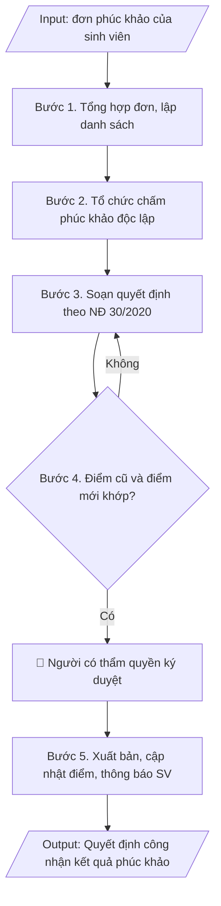

# Quyết định kết quả phúc khảo bài thi

## Định dạng và file đầu ra
Định dạng đầu ra có thể chọn theo sản phẩm/yêu cầu: .docx, .pdf. Đọc mục “Định dạng bổ sung” trong quy cách đầu ra trước khi chọn.

**Phải tạo file thực tế để tải xuống, không chỉ trả nội dung trong chat.** Định dạng mặc định của skill: **.docx**. Nếu có bảng số liệu nghiệp vụ yêu cầu file bảng tính riêng, tạo thêm Excel theo yêu cầu; không tự tạo file kiểm tra. Không chờ người dùng yêu cầu xuất file lần nữa. Ưu tiên định dạng người dùng chỉ định; đọc quy tắc xuất file tại references/quy-cach-dau-ra.md.

## Quy cách đầu ra và thông tin thiếu
Đọc [quy cách và cấu trúc sản phẩm](references/quy-cach-dau-ra.md) trước khi soạn/xuất. File giao chỉ gồm sản phẩm nghiệp vụ được yêu cầu; kiểm tra nội bộ không xuất kèm. Thiếu thông tin thì giữ nguyên trường/mục và chỗ điền theo mẫu gốc (dòng dấu chấm, dấu gạch hoặc ô trống); không tự điền dữ liệu mẫu, số 0, mã chờ xác minh hay dòng chờ ký. Mẫu chuyên ngành còn áp dụng được ưu tiên về cấu trúc, mã biểu và người ký. Bản đầy đủ: [quy tắc chung](references/quy-tac-chung.md).

## Kiểm soát áp dụng và phê duyệt
Trước khi chạy, xác định `ngay_ap_dung`, `loai_hinh_truong`, `quy_che_noi_bo`, `nguon_du_lieu`, `nguoi_kiem_duyet`; chỉ hỏi thông tin liên quan nghiệp vụ, không dùng giá trị giả định thay dữ liệu bắt buộc. Đối chiếu căn cứ pháp lý với văn bản gốc, hiệu lực, điều khoản áp dụng và chuyển tiếp. Bản đầy đủ: [quy tắc chung](references/quy-tac-chung.md).

Nếu có cập nhật pháp lý dưới đây, đọc [căn cứ và điều kiện áp dụng](references/phap-ly.md) trước khi làm. Quy trình dưới đây giữ nghiệp vụ từ bản gốc; mọi viện dẫn văn bản, mẫu biểu, điều khoản phải theo căn cứ đã chọn trong phap-ly.md, không theo văn bản cũ.

## Giới hạn và human gate
AI hỗ trợ chuẩn bị và đối chiếu; cán bộ phụ trách kiểm tra dữ liệu/căn cứ, người có thẩm quyền duyệt và ký. Không đánh dấu đã ký, đã duyệt, đã công bố khi chưa có chứng cứ. Dữ liệu sinh viên, sức khỏe, nhân sự, tài chính chỉ dùng theo mục đích và phân quyền, che thông tin định danh khi dùng ví dụ (Luật 91/2025/QH15, hiệu lực 01/01/2026); không tải dữ liệu lên dịch vụ ngoài khi chưa có quyền. Bản đầy đủ: [quy tắc chung](references/quy-tac-chung.md).

## Khi nào dùng
Khi đã nhận đơn phúc khảo của sinh viên, tổ chức chấm phúc khảo xong và cần ban hành
quyết định công nhận kết quả (điểm giữ nguyên hoặc điều chỉnh).

## Đầu vào (Input)
| Trường | Mô tả | Bắt buộc |
|---|---|---|
| `ky_thi` | Tên kỳ thi | Có |
| `danh_sach_phuc_khao` | Bảng: họ tên, MSSV, lớp, học phần, điểm công bố, điểm phúc khảo, kết luận (giữ nguyên/điều chỉnh) | Có |
| `hoi_dong_phuc_khao` | Quyết định thành lập hội đồng phúc khảo (số, ngày) | Có |
| `can_cu` | Quy chế đào tạo, quy định về phúc khảo của trường | Có |
| `nguoi_ky` | Hiệu trưởng / Phó Hiệu trưởng | Có |

## Quy trình
**Ràng buộc pháp lý khi thực hiện** (trích references/phap-ly.md; đối chiếu toàn văn và hiệu lực tại ngày nghiệp vụ):
- Thông tư 56/2026/TT-BGDĐT, hiệu lực 07/07/2026: Yêu cầu khóa tuyển sinh, chương trình, ngày áp dụng và quy chế đào tạo nội bộ. Đối chiếu điều khoản chuyển tiếp trong toàn văn trước khi chọn quy tắc; không tự áp dụng quy định mới hồi tố cho mọi khóa. Không dùng điều/khoản, thang điểm hoặc điều kiện tốt nghiệp cũ như quy định hiện hành nếu chưa đối chiếu.
- Trước Bước 1: chọn căn cứ theo đối tượng, loại hình trường và chuyển tiếp; lập bảng văn bản / điều khoản / lý do áp dụng / bằng chứng. Thiếu văn bản gốc hoặc điều khoản thì ghi nhận nội bộ [CẦN XÁC MINH] (không đưa vào file giao), để trống phần tương ứng, chưa kết luận tuân thủ.

**Bước 1. Tổng hợp đơn phúc khảo**
- Làm gì: Phòng Khảo thí & ĐBCL tiếp nhận đơn phúc khảo của sinh viên trong thời hạn quy định của trường (thường 07–15 ngày sau công bố điểm); kiểm tra tính hợp lệ của đơn (đúng mẫu, còn thời hạn, đã nộp lệ phí nếu có); lập danh sách tổng hợp: họ tên, MSSV, lớp, học phần, điểm đã công bố.
- Dùng input: `ky_thi`, `danh_sach_phuc_khao`.
- Vai trò: Chuyên viên Phòng Khảo thí & ĐBCL · AI hỗ trợ: lập danh sách tổng hợp sơ bộ từ các đơn phúc khảo, kiểm tra thời hạn nộp đơn · ⏱ ~1 giờ (ước tính)
- Lưu ý nghiệp vụ: đơn nộp quá hạn phải từ chối bằng văn bản, không đưa vào danh sách; kiểm tra sinh viên có đúng là người dự thi học phần đó trong kỳ thi này.
- → Kết quả bước: Danh sách sinh viên đề nghị phúc khảo hợp lệ.

**Bước 2. Tổ chức chấm phúc khảo**
- Làm gì: Căn cứ quyết định thành lập hội đồng phúc khảo (`hoi_dong_phuc_khao`), rút bài thi của các sinh viên trong danh sách; hội đồng chấm lại độc lập (cán bộ chấm phúc khảo không phải người đã chấm lần đầu); lập biên bản chấm phúc khảo cho từng bài thi, ghi rõ điểm chấm lại.
- Dùng input: `danh_sach_phuc_khao`, `hoi_dong_phuc_khao`.
- Vai trò: Hội đồng phúc khảo / Cán bộ chấm phúc khảo · AI hỗ trợ: rút bài thi theo danh sách, đối chiếu điểm cũ/mới để lập bảng kết quả · ⏱ ~1–2 ngày làm việc (ước tính)
- Lưu ý nghiệp vụ: điểm phúc khảo là điểm chính thức cuối cùng của học phần, kể cả khi thấp hơn điểm đã công bố; biên bản chấm phúc khảo phải có chữ ký của các thành viên hội đồng.
- → Kết quả bước: Biên bản chấm phúc khảo từng bài thi + bảng điểm phúc khảo.

**Bước 3. Soạn quyết định theo thể thức NĐ 30/2020**
- Làm gì: Soạn thảo quyết định đúng thể thức Nghị định 30/2020/NĐ-CP với bố cục: (a) Phần căn cứ — quy chế đào tạo, quy định phúc khảo của trường (trích từ `can_cu`), quyết định thành lập hội đồng phúc khảo, biên bản chấm phúc khảo; (b) "Xét đề nghị của Trưởng phòng Khảo thí & ĐBCL"; (c) Điều 1 — công nhận kết quả phúc khảo (danh sách chi tiết kèm theo: điểm công bố → điểm phúc khảo → kết luận giữ nguyên/điều chỉnh); (d) Điều 2 — Phòng Đào tạo cập nhật điểm vào hệ thống quản lý học vụ, Phòng Khảo thí thông báo đến từng sinh viên; (e) Điều 3 — hiệu lực thi hành; (f) Nơi nhận đầy đủ + lưu.
- Dùng input: `ky_thi`, `danh_sach_phuc_khao`, `hoi_dong_phuc_khao`, `can_cu`, `nguoi_ky`.
- Vai trò: Chuyên viên Phòng Khảo thí & ĐBCL · AI hỗ trợ: soạn dự thảo đúng thể thức NĐ 30/2020/NĐ-CP, đối chiếu danh sách điểm với biên bản chấm · ⏱ ~45 phút (ước tính)
- Lưu ý nghiệp vụ: thẩm quyền ký — Hiệu trưởng hoặc Phó Hiệu trưởng phụ trách đào tạo; danh sách kèm theo phải liệt kê đủ 100% sinh viên trong danh sách phúc khảo, kể cả trường hợp điểm giữ nguyên.
- → Kết quả bước: Dự thảo quyết định công nhận kết quả phúc khảo + danh sách kết quả kèm theo.

**Bước 4. Kiểm tra**
- Làm gì: Đối chiếu từng dòng trong danh sách kèm theo với biên bản chấm phúc khảo: họ tên, MSSV, học phần, điểm công bố, điểm phúc khảo, kết luận giữ nguyên/điều chỉnh; kiểm tra thẩm quyền ký của `nguoi_ky`; hiệu đính trước khi trình ký.
- Dùng input: `danh_sach_phuc_khao`, `nguoi_ky`.
- Vai trò: Trưởng phòng Khảo thí & ĐBCL (rà soát, hiệu đính) · AI hỗ trợ: đối chiếu điểm công bố/điểm phúc khảo từng dòng, cảnh báo dòng bị nhầm · ⏱ ~1 giờ (ước tính)
- Lưu ý nghiệp vụ: bẫy thường gặp — nhầm điểm công bố với điểm phúc khảo ở các dòng, sót sinh viên có điểm giữ nguyên không đưa vào danh sách; sai một con số điểm là phải ban hành quyết định đính chính.
- → Kết quả bước: Dự thảo quyết định đã đối chiếu khớp 100% với biên bản chấm phúc khảo.

**Bước 5. Xuất bản**
- Làm gì: Trình `nguoi_ky` ký ban hành; đóng dấu, lưu văn thư; gửi Phòng Đào tạo để cập nhật điểm vào hệ thống quản lý học vụ; thông báo kết quả đến từng sinh viên (niêm yết/email); lưu 01 bản vào hồ sơ kỳ thi.
- Dùng input: `nguoi_ky`, `ky_thi`.
- Vai trò: Hiệu trưởng/Phó Hiệu trưởng ký ban hành, Phòng Đào tạo cập nhật điểm và thông báo sinh viên · AI hỗ trợ: chuẩn bị danh sách thông báo kết quả theo từng sinh viên · ⏱ ~0,5 ngày làm việc (ước tính)
- Lưu ý nghiệp vụ: cập nhật điểm trên hệ thống phải khớp đúng điểm trong quyết định; quyết định phúc khảo là minh chứng kiểm định cho công tác khảo thí.
- → Kết quả bước: Quyết định công nhận kết quả phúc khảo đã ban hành; điểm đã cập nhật và thông báo đến sinh viên.

## Luồng quy trình (Workflow)

## Đầu ra
- Văn bản quyết định công nhận kết quả phúc khảo hoàn chỉnh.
- Danh sách kết quả phúc khảo kèm theo (điểm trước/sau).

**Cấu trúc output chuẩn:** quyết định theo thể thức Nghị định 30/2020/NĐ-CP, các phần bắt buộc theo đúng thứ tự:
1. Quốc hiệu, tên cơ quan ban hành, số/ký hiệu văn bản, địa danh và ngày tháng năm ban hành;
2. Tên loại văn bản (QUYẾT ĐỊNH) + trích yếu nội dung;
3. Thẩm quyền ban hành (chức vụ người ký + tên cơ quan, viết hoa);
4. Các căn cứ pháp lý: quy chế đào tạo, quy định phúc khảo của trường, quyết định thành lập hội đồng phúc khảo, biên bản chấm phúc khảo (mỗi căn cứ một dòng, bắt đầu bằng "Căn cứ");
5. "Xét đề nghị của..." (đơn vị đề xuất);
6. "QUYẾT ĐỊNH:" + các điều: Điều 1 – công nhận kết quả phúc khảo (danh sách chi tiết kèm theo); Điều 2 – cập nhật điểm vào hệ thống và thông báo đến sinh viên; Điều 3 – hiệu lực thi hành và trách nhiệm thi hành;
7. Nơi nhận (đầy đủ các đơn vị liên quan + lưu);
8. Chức vụ người ký, chữ ký, họ tên người ký (đóng dấu);
9. Danh sách kết quả phúc khảo kèm theo (STT, họ tên, MSSV, lớp, học phần, điểm công bố, điểm phúc khảo, kết luận giữ nguyên/điều chỉnh).

File nghiệp vụ thực tế theo định dạng mặc định ở đầu skill hoặc định dạng người dùng yêu cầu, kèm liên kết tải trong phản hồi cuối.

Sản phẩm nghiệp vụ hoàn chỉnh theo [quy cách và cấu trúc](references/quy-cach-dau-ra.md), giữ các trường chưa có dữ liệu ở trạng thái trống. Không xuất kèm checklist/phụ lục kiểm tra đầu ra.

## Kiểm tra nội bộ trước khi giao
Các tiêu chí sau dùng để tự đối chiếu; không sao chép vào file xuất. Mục thiếu dữ liệu được để trống, không đánh dấu đã đạt hoặc đã duyệt.

- [ ] Đủ 9 phần theo "Cấu trúc output chuẩn" NĐ 30/2020: quốc hiệu + số/ký hiệu + địa danh, ngày tháng; QUYẾT ĐỊNH + trích yếu; thẩm quyền ban hành; các căn cứ pháp lý (quy chế đào tạo, quy định phúc khảo của trường, quyết định thành lập hội đồng phúc khảo, biên bản chấm phúc khảo); "Xét đề nghị của..."; các điều (Điều 1 – công nhận kết quả phúc khảo; Điều 2 – cập nhật điểm và thông báo; Điều 3 – hiệu lực thi hành); Nơi nhận; chức vụ/chữ ký/họ tên người ký (đóng dấu); danh sách kết quả phúc khảo kèm theo.
- [ ] Danh sách kèm theo liệt kê đủ 100% sinh viên trong `danh_sach_phuc_khao` (kể cả trường hợp điểm giữ nguyên); họ tên, MSSV, học phần, điểm công bố, điểm phúc khảo khớp với Input và biên bản chấm phúc khảo.
- [ ] Không bịa đặt điểm công bố, điểm phúc khảo, kết luận giữ nguyên/điều chỉnh.
- [ ] Đúng thể thức Nghị định 30/2020/NĐ-CP.
- [ ] Căn cứ pháp lý đầy đủ, còn hiệu lực.
- [ ] Đã qua Human gate: người có thẩm quyền theo quy trình đã duyệt.
- [ ] Điểm phúc khảo được công nhận là điểm chính thức cuối cùng của học phần, kể cả khi thấp hơn điểm đã công bố.
- [ ] Cán bộ chấm phúc khảo không phải người đã chấm lần đầu; biên bản chấm phúc khảo có chữ ký của các thành viên hội đồng.
- [ ] Đơn nộp quá thời hạn đã bị từ chối bằng văn bản, không đưa vào danh sách; điểm đã cập nhật đúng vào hệ thống quản lý học vụ và thông báo đến từng sinh viên.

## Căn cứ & lưu ý
- Căn cứ hiện hành: xem [căn cứ và điều kiện áp dụng](references/phap-ly.md); phải đối chiếu văn bản gốc, hiệu lực và chuyển tiếp tại ngày nghiệp vụ.
- Nghị định 30/2020/NĐ-CP về công tác văn thư (thể thức quyết định).
- Thời hạn nhận đơn phúc khảo do trường quy định (thường 07–15 ngày sau công bố điểm).
- Điểm phúc khảo là điểm chính thức cuối cùng của học phần.
- Không dùng tên thật của trường/cá nhân khi mô phỏng.

## Tư liệu đối chiếu
Bản gốc trước cập nhật pháp lý (kèm ví dụ giả lập) lưu tại `references/quy-trinh-lich-su.md`, chỉ để đối chiếu hồ sơ lịch sử; không dùng căn cứ, mẫu hay số liệu trong đó làm chỉ dẫn hiện hành.

## Quản trị phiên bản
- Phiên bản gói `1.3.2` (cập nhật 2026-10-10); hồ sơ đầy đủ tại [references/version.json](references/version.json).
- Người phê duyệt nghiệp vụ: **chưa chỉ định**. Trạng thái: dự thảo nghiệp vụ; kiểm tra pháp lý trước thực thi. Ngày cập nhật không đồng nghĩa mọi văn bản đã được rà soát toàn văn.
- Giấy phép theo LICENSE của kho (bản quyền CES Global). Lịch sử thay đổi: CHANGELOG.md.
