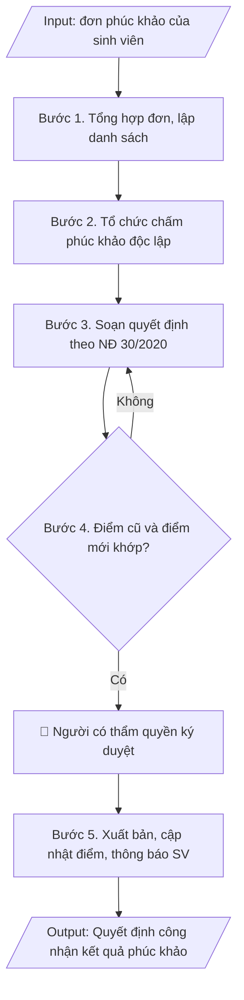

# Tư liệu lịch sử – không phải quy trình hiện hành

Nội dung từ phiên bản nguồn trước 1.1.0, giữ để đối chiếu dữ liệu đầu vào và thay đổi; căn cứ, điều kiện, mẫu và ví dụ có thể đã lỗi thời. Không dùng để thực hiện nghiệp vụ hiện tại.

## Khi nào dùng
Khi đã nhận đơn phúc khảo của sinh viên, tổ chức chấm phúc khảo xong và cần ban hành
quyết định công nhận kết quả (điểm giữ nguyên hoặc điều chỉnh).

## Đầu vào (Input)

| Trường | Mô tả | Bắt buộc |
|---|---|---|
| `ky_thi` | Tên kỳ thi | Có |
| `danh_sach_phuc_khao` | Bảng: họ tên, MSSV, lớp, học phần, điểm công bố, điểm phúc khảo, kết luận (giữ nguyên/điều chỉnh) | Có |
| `hoi_dong_phuc_khao` | Quyết định thành lập hội đồng phúc khảo (số, ngày) | Có |
| `can_cu` | Quy chế đào tạo, quy định về phúc khảo của trường | Có |
| `nguoi_ky` | Hiệu trưởng / Phó Hiệu trưởng | Có |

## Quy trình

**Bước 1. Tổng hợp đơn phúc khảo**
- Làm gì: Phòng Khảo thí & ĐBCL tiếp nhận đơn phúc khảo của sinh viên trong thời hạn quy định của trường (thường 07–15 ngày sau công bố điểm); kiểm tra tính hợp lệ của đơn (đúng mẫu, còn thời hạn, đã nộp lệ phí nếu có); lập danh sách tổng hợp: họ tên, MSSV, lớp, học phần, điểm đã công bố.
- Dùng input: `ky_thi`, `danh_sach_phuc_khao`.
- Vai trò: Chuyên viên Phòng Khảo thí & ĐBCL · AI hỗ trợ: lập danh sách tổng hợp sơ bộ từ các đơn phúc khảo, kiểm tra thời hạn nộp đơn · ⏱ ~1 giờ (ước tính)
- Lưu ý nghiệp vụ: đơn nộp quá hạn phải từ chối bằng văn bản, không đưa vào danh sách; kiểm tra sinh viên có đúng là người dự thi học phần đó trong kỳ thi này.
- → Kết quả bước: Danh sách sinh viên đề nghị phúc khảo hợp lệ.

**Bước 2. Tổ chức chấm phúc khảo**
- Làm gì: Căn cứ quyết định thành lập hội đồng phúc khảo (`hoi_dong_phuc_khao`), rút bài thi của các sinh viên trong danh sách; hội đồng chấm lại độc lập (cán bộ chấm phúc khảo không phải người đã chấm lần đầu); lập biên bản chấm phúc khảo cho từng bài thi, ghi rõ điểm chấm lại.
- Dùng input: `danh_sach_phuc_khao`, `hoi_dong_phuc_khao`.
- Vai trò: Hội đồng phúc khảo / Cán bộ chấm phúc khảo · AI hỗ trợ: rút bài thi theo danh sách, đối chiếu điểm cũ/mới để lập bảng kết quả · ⏱ ~1–2 ngày làm việc (ước tính)
- Lưu ý nghiệp vụ: điểm phúc khảo là điểm chính thức cuối cùng của học phần, kể cả khi thấp hơn điểm đã công bố; biên bản chấm phúc khảo phải có chữ ký của các thành viên hội đồng.
- → Kết quả bước: Biên bản chấm phúc khảo từng bài thi + bảng điểm phúc khảo.

**Bước 3. Soạn quyết định theo thể thức NĐ 30/2020**
- Làm gì: Soạn thảo quyết định đúng thể thức Nghị định 30/2020/NĐ-CP với bố cục: (a) Phần căn cứ — quy chế đào tạo, quy định phúc khảo của trường (trích từ `can_cu`), quyết định thành lập hội đồng phúc khảo, biên bản chấm phúc khảo; (b) "Xét đề nghị của Trưởng phòng Khảo thí & ĐBCL"; (c) Điều 1 — công nhận kết quả phúc khảo (danh sách chi tiết kèm theo: điểm công bố → điểm phúc khảo → kết luận giữ nguyên/điều chỉnh); (d) Điều 2 — Phòng Đào tạo cập nhật điểm vào hệ thống quản lý học vụ, Phòng Khảo thí thông báo đến từng sinh viên; (e) Điều 3 — hiệu lực thi hành; (f) Nơi nhận đầy đủ + lưu.
- Dùng input: `ky_thi`, `danh_sach_phuc_khao`, `hoi_dong_phuc_khao`, `can_cu`, `nguoi_ky`.
- Vai trò: Chuyên viên Phòng Khảo thí & ĐBCL · AI hỗ trợ: soạn dự thảo đúng thể thức NĐ 30/2020/NĐ-CP, đối chiếu danh sách điểm với biên bản chấm · ⏱ ~45 phút (ước tính)
- Lưu ý nghiệp vụ: thẩm quyền ký — Hiệu trưởng hoặc Phó Hiệu trưởng phụ trách đào tạo; danh sách kèm theo phải liệt kê đủ 100% sinh viên trong danh sách phúc khảo, kể cả trường hợp điểm giữ nguyên.
- → Kết quả bước: Dự thảo quyết định công nhận kết quả phúc khảo + danh sách kết quả kèm theo.

**Bước 4. Kiểm tra**
- Làm gì: Đối chiếu từng dòng trong danh sách kèm theo với biên bản chấm phúc khảo: họ tên, MSSV, học phần, điểm công bố, điểm phúc khảo, kết luận giữ nguyên/điều chỉnh; kiểm tra thẩm quyền ký của `nguoi_ky`; hiệu đính trước khi trình ký.
- Dùng input: `danh_sach_phuc_khao`, `nguoi_ky`.
- Vai trò: Trưởng phòng Khảo thí & ĐBCL (rà soát, hiệu đính) · AI hỗ trợ: đối chiếu điểm công bố/điểm phúc khảo từng dòng, cảnh báo dòng bị nhầm · ⏱ ~1 giờ (ước tính)
- Lưu ý nghiệp vụ: bẫy thường gặp — nhầm điểm công bố với điểm phúc khảo ở các dòng, sót sinh viên có điểm giữ nguyên không đưa vào danh sách; sai một con số điểm là phải ban hành quyết định đính chính.
- → Kết quả bước: Dự thảo quyết định đã đối chiếu khớp 100% với biên bản chấm phúc khảo.

**Bước 5. Xuất bản**
- Làm gì: Trình `nguoi_ky` ký ban hành; đóng dấu, lưu văn thư; gửi Phòng Đào tạo để cập nhật điểm vào hệ thống quản lý học vụ; thông báo kết quả đến từng sinh viên (niêm yết/email); lưu 01 bản vào hồ sơ kỳ thi.
- Dùng input: `nguoi_ky`, `ky_thi`.
- Vai trò: Hiệu trưởng/Phó Hiệu trưởng ký ban hành, Phòng Đào tạo cập nhật điểm và thông báo sinh viên · AI hỗ trợ: chuẩn bị danh sách thông báo kết quả theo từng sinh viên · ⏱ ~0,5 ngày làm việc (ước tính)
- Lưu ý nghiệp vụ: cập nhật điểm trên hệ thống phải khớp đúng điểm trong quyết định; quyết định phúc khảo là minh chứng kiểm định cho công tác khảo thí.
- → Kết quả bước: Quyết định công nhận kết quả phúc khảo đã ban hành; điểm đã cập nhật và thông báo đến sinh viên.

## Luồng quy trình (Workflow)


## Đầu ra (Output)
- Văn bản quyết định công nhận kết quả phúc khảo hoàn chỉnh.
- Danh sách kết quả phúc khảo kèm theo (điểm trước/sau).

**Cấu trúc output chuẩn:** quyết định theo thể thức Nghị định 30/2020/NĐ-CP, các phần bắt buộc theo đúng thứ tự:
1. Quốc hiệu, tên cơ quan ban hành, số/ký hiệu văn bản, địa danh và ngày tháng năm ban hành;
2. Tên loại văn bản (QUYẾT ĐỊNH) + trích yếu nội dung;
3. Thẩm quyền ban hành (chức vụ người ký + tên cơ quan, viết hoa);
4. Các căn cứ pháp lý: quy chế đào tạo, quy định phúc khảo của trường, quyết định thành lập hội đồng phúc khảo, biên bản chấm phúc khảo (mỗi căn cứ một dòng, bắt đầu bằng "Căn cứ");
5. "Xét đề nghị của..." (đơn vị đề xuất);
6. "QUYẾT ĐỊNH:" + các điều: Điều 1 – công nhận kết quả phúc khảo (danh sách chi tiết kèm theo); Điều 2 – cập nhật điểm vào hệ thống và thông báo đến sinh viên; Điều 3 – hiệu lực thi hành và trách nhiệm thi hành;
7. Nơi nhận (đầy đủ các đơn vị liên quan + lưu);
8. Chức vụ người ký, chữ ký, họ tên người ký (đóng dấu);
9. Danh sách kết quả phúc khảo kèm theo (STT, họ tên, MSSV, lớp, học phần, điểm công bố, điểm phúc khảo, kết luận giữ nguyên/điều chỉnh).

## Checklist nghiệm thu

- [ ] Đủ 9 phần theo "Cấu trúc output chuẩn" NĐ 30/2020: quốc hiệu + số/ký hiệu + địa danh, ngày tháng; QUYẾT ĐỊNH + trích yếu; thẩm quyền ban hành; các căn cứ pháp lý (quy chế đào tạo, quy định phúc khảo của trường, quyết định thành lập hội đồng phúc khảo, biên bản chấm phúc khảo); "Xét đề nghị của..."; các điều (Điều 1 – công nhận kết quả phúc khảo; Điều 2 – cập nhật điểm và thông báo; Điều 3 – hiệu lực thi hành); Nơi nhận; chức vụ/chữ ký/họ tên người ký (đóng dấu); danh sách kết quả phúc khảo kèm theo.
- [ ] Danh sách kèm theo liệt kê đủ 100% sinh viên trong `danh_sach_phuc_khao` (kể cả trường hợp điểm giữ nguyên); họ tên, MSSV, học phần, điểm công bố, điểm phúc khảo khớp với Input và biên bản chấm phúc khảo.
- [ ] Không bịa đặt điểm công bố, điểm phúc khảo, kết luận giữ nguyên/điều chỉnh.
- [ ] Đúng thể thức Nghị định 30/2020/NĐ-CP.
- [ ] Căn cứ pháp lý đầy đủ, còn hiệu lực.
- [ ] Đã qua Human gate: người có thẩm quyền theo quy trình đã duyệt.
- [ ] Điểm phúc khảo được công nhận là điểm chính thức cuối cùng của học phần, kể cả khi thấp hơn điểm đã công bố.
- [ ] Cán bộ chấm phúc khảo không phải người đã chấm lần đầu; biên bản chấm phúc khảo có chữ ký của các thành viên hội đồng.
- [ ] Đơn nộp quá thời hạn đã bị từ chối bằng văn bản, không đưa vào danh sách; điểm đã cập nhật đúng vào hệ thống quản lý học vụ và thông báo đến từng sinh viên.

Tiêu chí đạt = tất cả các ô được đánh dấu.

## Ví dụ mô phỏng (dữ liệu giả lập)

> Tất cả tên trường, cá nhân, số liệu dưới đây đều là **giả lập**, không liên quan tổ chức/cá nhân có thật.

### Input mẫu

| Trường | Giá trị |
|---|---|
| `ky_thi` | Thi kết thúc học phần học kỳ 1, năm học 2026–2027 |
| `danh_sach_phuc_khao` | 03 sinh viên (xem bảng mẫu) |
| `hoi_dong_phuc_khao` | Quyết định số 215/QĐ-ĐHA ngày 12/01/2027 |
| `nguoi_ky` | Phó Hiệu trưởng |

### Output mẫu

```
TRƯỜNG ĐẠI HỌC A            CỘNG HÒA XÃ HỘI CHỦ NGHĨA VIỆT NAM
                                              Độc lập – Tự do – Hạnh phúc
      Số: 228/QĐ-ĐHA
                                                 Thành phố C, ngày 09 tháng 10 năm 2026

QUYẾT ĐỊNH
Về việc công nhận kết quả phúc khảo bài thi kết thúc học phần
học kỳ 1, năm học 2026–2027

HIỆU TRƯỞNG TRƯỜNG ĐẠI HỌC A

Căn cứ Quy chế đào tạo trình độ đại học ban hành kèm theo Thông tư
số 08/2021/TT-BGDĐT ngày 18/3/2021 của Bộ trưởng Bộ Giáo dục và Đào tạo;
Căn cứ Quy định về phúc khảo bài thi của Trường Đại học A;
Căn cứ Quyết định số 215/QĐ-ĐHA ngày 12/01/2027 về việc thành lập Hội đồng
phúc khảo bài thi học kỳ 1, năm học 2026–2027;
Căn cứ Biên bản chấm phúc khảo ngày 18/01/2027 của Hội đồng phúc khảo;
Xét đề nghị của Trưởng phòng Khảo thí & Đảm bảo chất lượng,

QUYẾT ĐỊNH:

Điều 1. Công nhận kết quả phúc khảo bài thi kết thúc học phần học kỳ 1,
năm học 2026–2027 đối với 03 sinh viên có tên trong danh sách kèm theo.

Điều 2. Phòng Đào tạo cập nhật điểm phúc khảo vào hệ thống quản lý đào tạo;
Phòng Khảo thí & Đảm bảo chất lượng thông báo kết quả đến từng sinh viên.

Điều 3. Quyết định này có hiệu lực kể từ ngày ký. Trưởng các đơn vị có liên quan
chịu trách nhiệm thi hành Quyết định này./.

Nơi nhận:                                            HIỆU TRƯỞNG
- Như Điều 3;                                            [CHỜ KÝ]
- Lưu: VT, KTĐBCL, ĐT.

                                                   GS.TS. Hoàng Văn A
```

**Danh sách kết quả phúc khảo kèm theo (mẫu giả lập)**

| STT | Họ tên | MSSV | Lớp | Học phần | Điểm công bố | Điểm phúc khảo | Kết luận |
|---|---|---|---|---|---|---|---|
| 1 | Lê Thị A | MD20230101 | CNTT-K5 | CNTT101 | 5.5 | 6.0 | Điều chỉnh |
| 2 | Trần Văn Khoa | MD20230102 | CNTT-K5 | CNTT101 | 7.0 | 7.0 | Giữ nguyên |
| 3 | Lê Thị Ngọc | MD20230210 | KT-K5 | KT201 | 4.0 | 4.5 | Điều chỉnh |

## Căn cứ & lưu ý
- Nghị định 30/2020/NĐ-CP về công tác văn thư (thể thức quyết định).
- Quy chế đào tạo trình độ đại học (Thông tư 08/2021/TT-BGDĐT); quy định phúc khảo
  của Trường Đại học A (giả lập).
- Thời hạn nhận đơn phúc khảo do trường quy định (thường 07–15 ngày sau công bố điểm).
- Điểm phúc khảo là điểm chính thức cuối cùng của học phần.
- Không dùng tên thật của trường/cá nhân khi mô phỏng.
