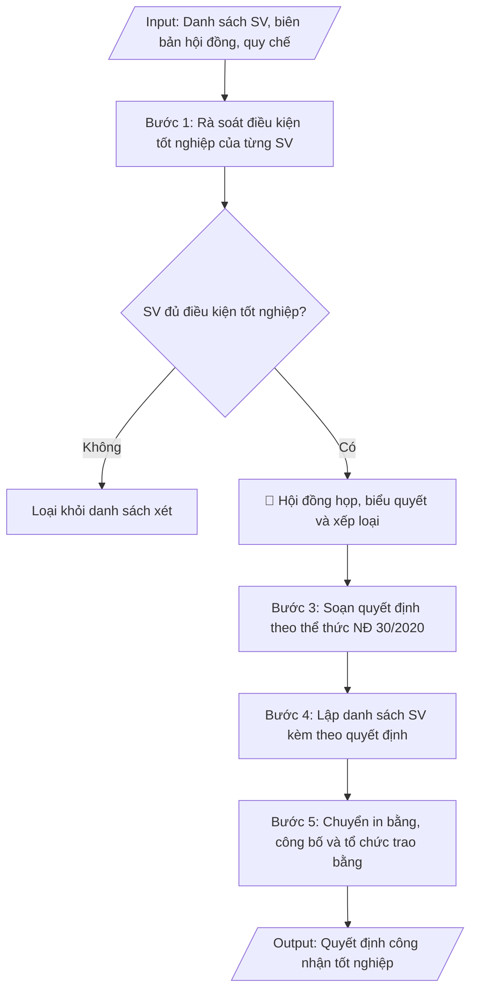

# Skill: Soạn quyết định công nhận tốt nghiệp

## Khi nào dùng
Khi hội đồng xét tốt nghiệp của trường đã họp và kết luận danh sách sinh viên đủ điều kiện
tốt nghiệp trong đợt xét: cần soạn quyết định công nhận tốt nghiệp (kèm danh sách SV, xếp loại
tốt nghiệp) để làm căn cứ in bằng, cấp bảng điểm và tổ chức lễ trao bằng.

## Đầu vào (Input)

| Trường | Mô tả | Bắt buộc |
|---|---|---|
| `dot_xet` | Đợt xét tốt nghiệp (ví dụ: Đợt 2 tháng 6/2027) | Có |
| `danh_sach_sv` | Danh sách SV đủ điều kiện (mã SV, họ tên, lớp, ngành, ĐTB toàn khóa, xếp loại) | Có |
| `bien_ban_hoi_dong` | Biên bản họp hội đồng xét tốt nghiệp (số, ngày họp, kết luận) | Có |
| `can_cu_quy_che` | Điều, khoản quy chế đào tạo về điều kiện tốt nghiệp | Có |
| `nguoi_ky` | Hiệu trưởng / Phó Hiệu trưởng phụ trách đào tạo | Có |
| `so_quyet_dinh` | Số quyết định (nếu đã cấp số; nếu chưa, để trống để điền khi ban hành) | Không |
| `ngay_trao_bang` | Ngày dự kiến tổ chức lễ trao bằng (để ghi chú phối hợp) | Không |

## Quy trình

**Bước 1. Rà soát điều kiện tốt nghiệp của từng SV**
- Làm gì: đối chiếu từng SV trong danh sách dự kiến với 5 nhóm điều kiện: (a) tích lũy đủ số tín chỉ
  của chương trình đào tạo; (b) điểm trung bình chung toàn khóa đạt ngưỡng tốt nghiệp (thường ≥ 2.00);
  (c) có chứng chỉ ngoại ngữ, tin học đạt chuẩn đầu ra của ngành; (d) hoàn thành nghĩa vụ học phí,
  thư viện, ký túc xá, điểm rèn luyện (nếu quy định); (e) không bị kỷ luật ở mức đình chỉ học tập
  trong thời gian xét. Trích xuất số liệu từ hệ thống quản lý đào tạo, Phòng TC-KT, thư viện.
- Dùng input: `danh_sach_sv`, `can_cu_quy_che`, `dot_xet`
- Vai trò: Chuyên viên Phòng Đào tạo · AI hỗ trợ: đối chiếu tự động 5 nhóm điều kiện, cảnh báo trường hợp thiếu · ⏱ ~1 giờ (ước tính)
- Lưu ý nghiệp vụ: SV không đủ bất kỳ điều kiện nào thì loại khỏi danh sách xét đợt này (không trình
  hội đồng); chứng chỉ ngoại ngữ/tin học phải còn hiệu lực tại thời điểm xét; đối chiếu họ tên, ngày
  sinh với hồ sơ gốc (CCCD) ngay từ bước này để tránh sai sót khi in bằng.
- → Kết quả bước: danh sách SV đủ điều kiện tốt nghiệp (đã loại các trường hợp chưa đủ) kèm bảng
  kiểm tra điều kiện của từng SV.

**Bước 2. Hội đồng xét tốt nghiệp họp, biểu quyết và xếp loại**
- Làm gì: Phòng Đào tạo trình danh sách đủ điều kiện kèm hồ sơ minh chứng lên hội đồng xét tốt
  nghiệp; hội đồng họp, biểu quyết từng trường hợp, xác định xếp loại tốt nghiệp (Xuất sắc / Giỏi /
  Khá / Trung bình) theo thang điểm quy chế; thư ký lập biên bản ghi kết luận từng trường hợp.
- Dùng input: `bien_ban_hoi_dong`, `danh_sach_sv`, `can_cu_quy_che`
- Vai trò: Hội đồng xét tốt nghiệp · AI hỗ trợ: chuẩn bị tài liệu, tổng hợp hồ sơ minh chứng trước phiên họp · ⏱ ~1 buổi (ước tính)
- Lưu ý nghiệp vụ: đây là Human gate — xếp loại phải tính đúng thang điểm quy chế, lưu ý các trường
  hợp bị hạ xếp loại do kỷ luật; biên bản là căn cứ pháp lý bắt buộc của quyết định.
- → Kết quả bước: biên bản họp hội đồng xét tốt nghiệp (số, ngày họp, kết luận và xếp loại từng SV).

**Bước 3. Soạn quyết định theo thể thức NĐ 30/2020**
- Làm gì: soạn quyết định gồm: quốc hiệu – tiêu ngữ, tên cơ quan, số/ký hiệu, địa danh – ngày tháng
  năm ban hành, trích yếu (công nhận tốt nghiệp đợt…), phần căn cứ (quy chế đào tạo, biên bản hội
  đồng, đề nghị của Trưởng phòng Đào tạo), các điều khoản: Điều 1 công nhận tốt nghiệp và cấp bằng
  (ghi rõ số lượng SV, danh sách kèm theo); Điều 2 giao Phòng Đào tạo phối hợp in bằng và tổ chức
  lễ trao bằng (ghi ngày dự kiến nếu có); Điều 3 trách nhiệm thi hành; nơi nhận; chữ ký người có
  thẩm quyền.
- Dùng input: `dot_xet`, `danh_sach_sv`, `bien_ban_hoi_dong`, `can_cu_quy_che`, `nguoi_ky`,
  `so_quyet_dinh`, `ngay_trao_bang`
- Vai trò: Chuyên viên Phòng Đào tạo · AI hỗ trợ: soạn dự thảo đúng thể thức NĐ 30/2020 · ⏱ ~30 phút (ước tính)
- Lưu ý nghiệp vụ: kiểm tra thẩm quyền ký; số lượng SV trong Điều 1 phải khớp biên bản hội đồng
  và danh sách kèm theo; nếu chưa cấp số quyết định thì để trống để điền khi ban hành.
- → Kết quả bước: dự thảo quyết định công nhận tốt nghiệp đúng thể thức NĐ 30/2020.

**Bước 4. Lập danh sách SV kèm theo quyết định**
- Làm gì: lập danh sách đầy đủ các cột: STT, mã SV, họ tên, ngày sinh, lớp, ngành, ĐTB toàn khóa,
  xếp loại; sắp xếp theo ngành/khoa để thuận tiện in bằng; đối chiếu từng dòng với biên bản hội
  đồng và hồ sơ gốc của SV.
- Dùng input: `danh_sach_sv`, `bien_ban_hoi_dong`
- Vai trò: Chuyên viên Phòng Đào tạo · AI hỗ trợ: lập danh sách trích ngang tự động từ hệ thống · ⏱ ~1 giờ (ước tính)
- Lưu ý nghiệp vụ: sai sót tên, ngày sinh, xếp loại dẫn đến phải thu hồi, cấp lại bằng — đối chiếu
  kỹ với hồ sơ gốc; không để sót hoặc thừa SV so với biên bản hội đồng.
- → Kết quả bước: danh sách SV được công nhận tốt nghiệp (đầy đủ thông tin, có xếp loại), sắp xếp
  theo ngành.

**Bước 5. Chuyển in bằng, công bố và tổ chức trao bằng**
- Làm gì: chuyển danh sách cho đơn vị in phôi bằng; thông báo đến SV; phối hợp tổ chức lễ trao bằng
  theo ngày dự kiến; lưu hồ sơ tốt nghiệp (quyết định + biên bản + danh sách kèm theo).
- Dùng input: `danh_sach_sv`, `ngay_trao_bang`
- Vai trò: Phòng Đào tạo · AI hỗ trợ: chuẩn bị danh sách in bằng, soạn thông báo gửi SV · ⏱ ~2–3 ngày (ước tính)
- Lưu ý nghiệp vụ: kiểm tra phôi bằng in thử trước khi in hàng loạt; lưu hồ sơ tốt nghiệp đầy đủ
  để phục vụ xác minh văn bằng sau này.
- → Kết quả bước: quyết định đã ban hành; phôi bằng đã in; hồ sơ tốt nghiệp đã lưu trữ đầy đủ.

## Luồng quy trình (Workflow)


## Đầu ra (Output)
- Quyết định công nhận tốt nghiệp hoàn chỉnh (đúng thể thức), kèm danh sách SV có xếp loại.
- Thống kê nhanh: tổng số SV tốt nghiệp theo ngành và theo xếp loại.
- Checklist kiểm tra: điều kiện tốt nghiệp từng SV, biên bản hội đồng, thẩm quyền ký.

**Cấu trúc output chuẩn:** khung mẫu cố định của quyết định công nhận tốt nghiệp, các phần theo đúng thứ tự:
1. Phần đầu văn bản: quốc hiệu – tiêu ngữ; tên cơ quan ban hành; số, ký hiệu quyết định;
   địa danh, ngày tháng năm ban hành.
2. Tên loại và trích yếu: "QUYẾT ĐỊNH" + "Về việc công nhận tốt nghiệp…" (ghi rõ đợt xét).
3. Thẩm quyền ban hành: chức danh người ký (HIỆU TRƯỞNG / KT. HIỆU TRƯỞNG – PHÓ HIỆU TRƯỞNG).
4. Phần căn cứ: quy chế đào tạo (điều, khoản về điều kiện tốt nghiệp); biên bản họp hội đồng
   xét tốt nghiệp (số, ngày họp); đề nghị của Trưởng phòng Đào tạo.
5. Phần quyết định: Điều 1 (công nhận tốt nghiệp và cấp bằng cho số lượng SV có tên trong danh
   sách kèm theo); Điều 2 (giao Phòng Đào tạo phối hợp in bằng, tổ chức lễ trao bằng — ghi ngày
   dự kiến nếu có); Điều 3 (trách nhiệm thi hành).
6. Phần cuối: nơi nhận; chữ ký, họ tên người ký.
7. Phụ lục kèm theo: danh sách SV (STT, mã SV, họ tên, ngày sinh, lớp, ngành, ĐTB toàn khóa,
   xếp loại) sắp xếp theo ngành; bảng thống kê số SV tốt nghiệp theo ngành và theo xếp loại.


## Checklist nghiệm thu
- [ ] Đủ các phần theo "Cấu trúc output chuẩn": phần đầu văn bản; tên loại + trích yếu (đợt xét); thẩm quyền ban hành; phần căn cứ; 3 điều khoản quyết định; nơi nhận, chữ ký; phụ lục danh sách SV có xếp loại + bảng thống kê theo ngành/xếp loại.
- [ ] Số liệu/nội dung trong output khớp với Input đã cho (mã SV, họ tên, ngày sinh, lớp, ngành, ĐTB toàn khóa, xếp loại, đợt xét).
- [ ] Không bịa đặt số liệu, minh chứng, trích dẫn.
- [ ] Đúng thể thức văn bản hành chính theo Nghị định 30/2020/NĐ-CP.
- [ ] Căn cứ pháp lý đầy đủ, còn hiệu lực (Thông tư 08/2021/TT-BGDĐT, Thông tư 21/2019/TT-BGDĐT, quy chế đào tạo của trường, biên bản họp hội đồng).
- [ ] Đã qua Human gate: hội đồng xét tốt nghiệp đã họp, biểu quyết và xếp loại từng SV; người có thẩm quyền đã ký duyệt.
- [ ] SV thiếu bất kỳ điều kiện tốt nghiệp nào đã bị loại khỏi danh sách xét; chứng chỉ ngoại ngữ/tin học còn hiệu lực tại thời điểm xét.
- [ ] Họ tên, ngày sinh đã đối chiếu với hồ sơ gốc (CCCD); xếp loại đúng thang điểm quy chế (kể cả hạ xếp loại do kỷ luật).
- [ ] Số lượng SV trong Điều 1 khớp biên bản hội đồng và danh sách kèm theo.
Tiêu chí đạt = tất cả các ô được đánh dấu.

## Ví dụ mô phỏng (dữ liệu giả lập)

> Tất cả tên trường, cá nhân, số liệu dưới đây đều là **giả lập**, không liên quan tổ chức/cá nhân có thật.

### Input mẫu

| Trường | Giá trị |
|---|---|
| `dot_xet` | Đợt 2 tháng 6/2027 |
| `danh_sach_sv` | 1. Phạm Văn B — 202200101 — CNTT-K16 — CNTT — ĐTB 3.45 — Giỏi. 2. Bùi Thị B — 202200102 — KT-K16 — Kế toán — ĐTB 3.10 — Khá. 3. Đặng Văn C — 202200103 — QTKD-K16 — QTKD — ĐTB 2.85 — Khá. |
| `bien_ban_hoi_dong` | Biên bản họp Hội đồng xét tốt nghiệp ngày 25/06/2027 |
| `can_cu_quy_che` | Điều 15 Quy chế đào tạo trình độ đại học của Trường Đại học A (Quyết định số 88/QĐ-ĐHA ngày 15/08/2022) |
| `nguoi_ky` | Phó Hiệu trưởng |
| `ngay_trao_bang` | 15/07/2027 |

### Output mẫu

```
TRƯỜNG ĐẠI HỌC A            CỘNG HÒA XÃ HỘI CHỦ NGHĨA VIỆT NAM
       Số: 210/QĐ-ĐHA-ĐT                  Độc lập – Tự do – Hạnh phúc
                                                 Thành phố C, ngày 28 tháng 6 năm 2027

                                  QUYẾT ĐỊNH
                Về việc công nhận tốt nghiệp đợt 2 tháng 6 năm 2027

HIỆU TRƯỞNG TRƯỜNG ĐẠI HỌC A

Căn cứ Quy chế đào tạo trình độ đại học ban hành kèm theo Thông tư số 08/2021/TT-BGDĐT
ngày 18 tháng 3 năm 2021 của Bộ trưởng Bộ Giáo dục và Đào tạo;
Căn cứ Quy chế đào tạo trình độ đại học của Trường Đại học A ban hành kèm theo
Quyết định số 88/QĐ-ĐHA ngày 15 tháng 8 năm 2022 của Hiệu trưởng Trường Đại học A;
Căn cứ Biên bản họp Hội đồng xét tốt nghiệp ngày 25 tháng 6 năm 2027;
Theo đề nghị của Trưởng phòng Đào tạo,

                                  QUYẾT ĐỊNH:

Điều 1. Công nhận tốt nghiệp và cấp bằng cử nhân đợt 2 tháng 6 năm 2027 cho 03 sinh viên
có tên trong danh sách kèm theo.

Điều 2. Giao Phòng Đào tạo phối hợp với các khoa hoàn thiện hồ sơ, in bằng tốt nghiệp
và tổ chức lễ trao bằng vào ngày 15/7/2027.

Điều 3. Trưởng phòng Đào tạo, Trưởng các khoa và các sinh viên có tên trong danh sách
chịu trách nhiệm thi hành Quyết định này./.

Nơi nhận:                                          KT. HIỆU TRƯỞNG
- Như Điều 3;                                      PHÓ HIỆU TRƯỞNG
- Lưu: VT, ĐT.
                                                         (đã ký)

                                                PGS.TS. Trần Văn B

DANH SÁCH SINH VIÊN ĐƯỢC CÔNG NHẬN TỐT NGHIỆP
(Kèm theo Quyết định số 210/QĐ-ĐHA-ĐT ngày 28/6/2027 — Đợt 2 tháng 6/2027)

| STT | Mã SV | Họ và tên | Ngày sinh | Lớp | Ngành | ĐTB toàn khóa | Xếp loại |
|---|---|---|---|---|---|---|---|
| 1 | 202200101 | Phạm Văn B | 12/03/2004 | CNTT-K16 | Công nghệ thông tin | 3.45 | Giỏi |
| 2 | 202200102 | Bùi Thị B | 05/07/2004 | KT-K16 | Kế toán | 3.10 | Khá |
| 3 | 202200103 | Đặng Văn C | 20/11/2004 | QTKD-K16 | Quản trị kinh doanh | 2.85 | Khá |
```

**Thống kê đợt xét:**

| Ngành | Tổng SV | Xuất sắc | Giỏi | Khá | Trung bình |
|---|---|---|---|---|---|
| Công nghệ thông tin | 1 | 0 | 1 | 0 | 0 |
| Kế toán | 1 | 0 | 0 | 1 | 0 |
| Quản trị kinh doanh | 1 | 0 | 0 | 1 | 0 |
| **Tổng** | **3** | **0** | **1** | **2** | **0** |

### Checklist kiểm tra (output kèm theo)
- [x] Từng SV đủ điều kiện tốt nghiệp (tín chỉ, ĐTB, chứng chỉ, nghĩa vụ)
- [x] Biên bản hội đồng xét tốt nghiệp đầy đủ, có kết luận từng trường hợp
- [x] Xếp loại tốt nghiệp đúng thang điểm quy chế
- [x] Thể thức quyết định đúng NĐ 30/2020; thẩm quyền ký phù hợp
- [x] Danh sách sắp xếp theo ngành, thuận tiện in bằng

## Căn cứ & lưu ý
- Thông tư 08/2021/TT-BGDĐT (Quy chế đào tạo trình độ đại học): điều kiện và xếp loại tốt nghiệp.
- Thông tư 21/2019/TT-BGDĐT về quản lý văn bằng, chứng chỉ (in, cấp bằng tốt nghiệp).
- Nghị định 30/2020/NĐ-CP về công tác văn thư (thể thức quyết định).
- Sai sót trong danh sách tốt nghiệp (tên, ngày sinh, xếp loại) dẫn đến phải thu hồi, cấp lại bằng —
  cần đối chiếu kỹ với hồ sơ gốc của SV trước khi ban hành.
- Khi mô phỏng không dùng tên thật của trường/cá nhân.
