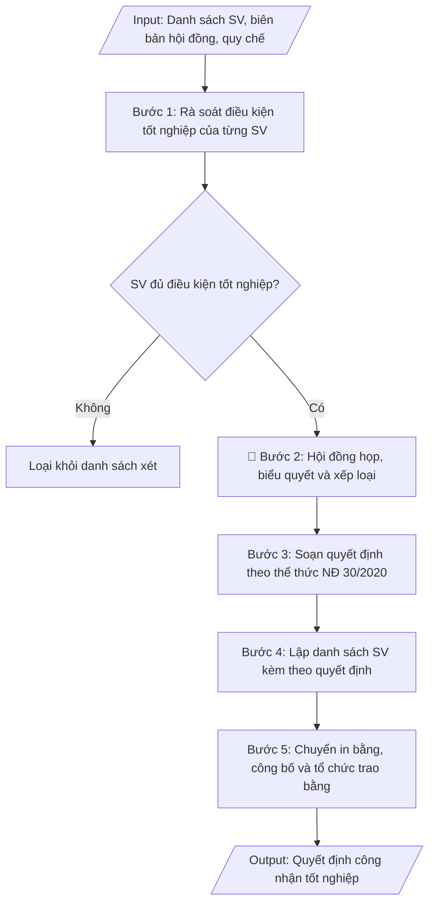

# Soạn quyết định công nhận tốt nghiệp

## Định dạng và file đầu ra
Định dạng đầu ra có thể chọn theo sản phẩm/yêu cầu: .docx, .pdf. Đọc mục “Định dạng bổ sung” trong quy cách đầu ra trước khi chọn.

**Phải tạo file thực tế để tải xuống, không chỉ trả nội dung trong chat.** Định dạng mặc định của skill: **.docx**. Nếu có bảng số liệu nghiệp vụ yêu cầu file bảng tính riêng, tạo thêm Excel theo yêu cầu; không tự tạo file kiểm tra. Không chờ người dùng yêu cầu xuất file lần nữa. Ưu tiên định dạng người dùng chỉ định; đọc quy tắc xuất file tại references/quy-cach-dau-ra.md.

## Quy cách đầu ra và thông tin thiếu
Đọc [quy cách và cấu trúc sản phẩm](references/quy-cach-dau-ra.md) trước khi soạn/xuất. File giao chỉ gồm sản phẩm nghiệp vụ được yêu cầu; kiểm tra nội bộ không xuất kèm. Thiếu thông tin thì giữ nguyên trường/mục và chỗ điền theo mẫu gốc (dòng dấu chấm, dấu gạch hoặc ô trống); không tự điền dữ liệu mẫu, số 0, mã chờ xác minh hay dòng chờ ký. Mẫu chuyên ngành còn áp dụng được ưu tiên về cấu trúc, mã biểu và người ký. Bản đầy đủ: [quy tắc chung](references/quy-tac-chung.md).

## Kiểm soát áp dụng và phê duyệt
Trước khi chạy, xác định `ngay_ap_dung`, `loai_hinh_truong`, `quy_che_noi_bo`, `nguon_du_lieu`, `nguoi_kiem_duyet`; chỉ hỏi thông tin liên quan nghiệp vụ, không dùng giá trị giả định thay dữ liệu bắt buộc. Đối chiếu căn cứ pháp lý với văn bản gốc, hiệu lực, điều khoản áp dụng và chuyển tiếp. Bản đầy đủ: [quy tắc chung](references/quy-tac-chung.md).

Nếu có cập nhật pháp lý dưới đây, đọc [căn cứ và điều kiện áp dụng](references/phap-ly.md) trước khi làm. Quy trình dưới đây giữ nghiệp vụ từ bản gốc; mọi viện dẫn văn bản, mẫu biểu, điều khoản phải theo căn cứ đã chọn trong phap-ly.md, không theo văn bản cũ.

## Giới hạn và human gate
Soạn quyết định từ biên bản và danh sách xét tốt nghiệp đã xác nhận. Không tự triệu tập hội đồng lần nữa, đổi xếp loại hoặc loại sinh viên. Sai lệch với hồ sơ được đối chiếu nội bộ để cơ quan có thẩm quyền xử lý; không kèm bảng kiểm tra vào quyết định.

AI hỗ trợ chuẩn bị và đối chiếu; cán bộ phụ trách kiểm tra dữ liệu/căn cứ, người có thẩm quyền duyệt và ký. Không đánh dấu đã ký, đã duyệt, đã công bố khi chưa có chứng cứ. Dữ liệu sinh viên, sức khỏe, nhân sự, tài chính chỉ dùng theo mục đích và phân quyền, che thông tin định danh khi dùng ví dụ (Luật 91/2025/QH15, hiệu lực 01/01/2026); không tải dữ liệu lên dịch vụ ngoài khi chưa có quyền. Bản đầy đủ: [quy tắc chung](references/quy-tac-chung.md).

## Khi nào dùng
Khi hội đồng xét tốt nghiệp của trường đã họp và kết luận danh sách sinh viên đủ điều kiện
tốt nghiệp trong đợt xét: cần soạn quyết định công nhận tốt nghiệp (kèm danh sách SV, xếp loại
tốt nghiệp) để làm căn cứ in bằng, cấp bảng điểm và tổ chức lễ trao bằng.

## Đầu vào (Input)
| Trường | Mô tả | Bắt buộc |
|---|---|---|
| `dot_xet` | Đợt xét tốt nghiệp (ví dụ: Đợt 2 tháng 6/2027) | Có |
| `danh_sach_sv` | Danh sách SV đủ điều kiện (mã SV, họ tên, lớp, ngành, ĐTB toàn khóa, xếp loại) | Có |
| `bien_ban_hoi_dong` | Biên bản họp hội đồng xét tốt nghiệp (số, ngày họp, kết luận) | Có |
| `can_cu_quy_che` | Điều, khoản quy chế đào tạo về điều kiện tốt nghiệp | Có |
| `nguoi_ky` | Hiệu trưởng / Phó Hiệu trưởng phụ trách đào tạo | Có |
| `so_quyet_dinh` | Số quyết định (nếu đã cấp số; nếu chưa, để trống để điền khi ban hành) | Không |
| `ngay_trao_bang` | Ngày dự kiến tổ chức lễ trao bằng (để ghi chú phối hợp) | Không |

## Quy trình
**Ràng buộc pháp lý khi thực hiện** (trích references/phap-ly.md; đối chiếu toàn văn và hiệu lực tại ngày nghiệp vụ):
- Thông tư 56/2026/TT-BGDĐT, hiệu lực 07/07/2026: Yêu cầu khóa tuyển sinh, chương trình, ngày áp dụng và quy chế đào tạo nội bộ. Đối chiếu điều khoản chuyển tiếp trong toàn văn trước khi chọn quy tắc; không tự áp dụng quy định mới hồi tố cho mọi khóa. Không dùng điều/khoản, thang điểm hoặc điều kiện tốt nghiệp cũ như quy định hiện hành nếu chưa đối chiếu.
- Thông tư 10/2026/TT-BGDĐT – Quy chế văn bằng, chứng chỉ: Đối chiếu văn bản gốc, ngày hiệu lực và chuyển tiếp trước khi chọn mẫu, sổ, quy trình cấp/chỉnh sửa/thu hồi; không dùng mẫu 21/2019 như mẫu hiện hành. Yêu cầu hồ sơ gốc, quyết định và thẩm quyền. AI chỉ chuẩn bị hồ sơ, không cấp bằng, gán số hay tự xác nhận chữ ký.
- Trước Bước 1: chọn căn cứ theo đối tượng, loại hình trường và chuyển tiếp; lập bảng văn bản / điều khoản / lý do áp dụng / bằng chứng. Thiếu văn bản gốc hoặc điều khoản thì ghi nhận nội bộ [CẦN XÁC MINH] (không đưa vào file giao), để trống phần tương ứng, chưa kết luận tuân thủ.

**Bước 1. Rà soát điều kiện tốt nghiệp của từng SV**
- Làm gì: đối chiếu từng SV trong danh sách dự kiến với 5 nhóm điều kiện: (a) tích lũy đủ số tín chỉ
  của chương trình đào tạo; (b) điểm trung bình chung toàn khóa đạt ngưỡng tốt nghiệp (thường ≥ 2.00);
  (c) có chứng chỉ ngoại ngữ, tin học đạt chuẩn đầu ra của ngành; (d) hoàn thành nghĩa vụ học phí,
  thư viện, ký túc xá, điểm rèn luyện (nếu quy định); (e) không bị kỷ luật ở mức đình chỉ học tập
  trong thời gian xét. Trích xuất số liệu từ hệ thống quản lý đào tạo, Phòng TC-KT, thư viện.
- Dùng input: `danh_sach_sv`, `can_cu_quy_che`, `dot_xet`
- Vai trò: Chuyên viên Phòng Đào tạo · AI hỗ trợ: đối chiếu tự động 5 nhóm điều kiện, cảnh báo trường hợp thiếu · ⏱ ~1 giờ (ước tính)
- Lưu ý nghiệp vụ: SV không đủ bất kỳ điều kiện nào thì loại khỏi danh sách xét đợt này (không trình
  hội đồng); chứng chỉ ngoại ngữ/tin học phải còn hiệu lực tại thời điểm xét; đối chiếu họ tên, ngày
  sinh với hồ sơ gốc (CCCD) ngay từ bước này để tránh sai sót khi in bằng.
- → Kết quả bước: danh sách SV đủ điều kiện tốt nghiệp (đã loại các trường hợp chưa đủ) kèm bảng
  kiểm tra điều kiện của từng SV.

**Bước 2. Hội đồng xét tốt nghiệp họp, biểu quyết và xếp loại**
- Làm gì: Phòng Đào tạo trình danh sách đủ điều kiện kèm hồ sơ minh chứng lên hội đồng xét tốt
  nghiệp; hội đồng họp, biểu quyết từng trường hợp, xác định xếp loại tốt nghiệp (Xuất sắc / Giỏi /
  Khá / Trung bình) theo thang điểm quy chế; thư ký lập biên bản ghi kết luận từng trường hợp.
- Dùng input: `bien_ban_hoi_dong`, `danh_sach_sv`, `can_cu_quy_che`
- Vai trò: Hội đồng xét tốt nghiệp · AI hỗ trợ: chuẩn bị tài liệu, tổng hợp hồ sơ minh chứng trước phiên họp · ⏱ ~1 buổi (ước tính)
- Lưu ý nghiệp vụ: đây là Human gate — xếp loại phải tính đúng thang điểm quy chế, lưu ý các trường
  hợp bị hạ xếp loại do kỷ luật; biên bản là căn cứ pháp lý bắt buộc của quyết định.
- → Kết quả bước: biên bản họp hội đồng xét tốt nghiệp (số, ngày họp, kết luận và xếp loại từng SV).

**Bước 3. Soạn quyết định theo thể thức NĐ 30/2020**
- Làm gì: soạn quyết định gồm: quốc hiệu – tiêu ngữ, tên cơ quan, số/ký hiệu, địa danh – ngày tháng
  năm ban hành, trích yếu (công nhận tốt nghiệp đợt…), phần căn cứ (quy chế đào tạo, biên bản hội
  đồng, đề nghị của Trưởng phòng Đào tạo), các điều khoản: Điều 1 công nhận tốt nghiệp và cấp bằng
  (ghi rõ số lượng SV, danh sách kèm theo); Điều 2 giao Phòng Đào tạo phối hợp in bằng và tổ chức
  lễ trao bằng (ghi ngày dự kiến nếu có); Điều 3 trách nhiệm thi hành; nơi nhận; chữ ký người có
  thẩm quyền.
- Dùng input: `dot_xet`, `danh_sach_sv`, `bien_ban_hoi_dong`, `can_cu_quy_che`, `nguoi_ky`,
  `so_quyet_dinh`, `ngay_trao_bang`
- Vai trò: Chuyên viên Phòng Đào tạo · AI hỗ trợ: soạn dự thảo đúng thể thức NĐ 30/2020 · ⏱ ~30 phút (ước tính)
- Lưu ý nghiệp vụ: kiểm tra thẩm quyền ký; số lượng SV trong Điều 1 phải khớp biên bản hội đồng
  và danh sách kèm theo; nếu chưa cấp số quyết định thì để trống để điền khi ban hành.
- → Kết quả bước: dự thảo quyết định công nhận tốt nghiệp đúng thể thức NĐ 30/2020.

**Bước 4. Lập danh sách SV kèm theo quyết định**
- Làm gì: lập danh sách đầy đủ các cột: STT, mã SV, họ tên, ngày sinh, lớp, ngành, ĐTB toàn khóa,
  xếp loại; sắp xếp theo ngành/khoa để thuận tiện in bằng; đối chiếu từng dòng với biên bản hội
  đồng và hồ sơ gốc của SV.
- Dùng input: `danh_sach_sv`, `bien_ban_hoi_dong`
- Vai trò: Chuyên viên Phòng Đào tạo · AI hỗ trợ: lập danh sách trích ngang tự động từ hệ thống · ⏱ ~1 giờ (ước tính)
- Lưu ý nghiệp vụ: sai sót tên, ngày sinh, xếp loại dẫn đến phải thu hồi, cấp lại bằng — đối chiếu
  kỹ với hồ sơ gốc; không để sót hoặc thừa SV so với biên bản hội đồng.
- → Kết quả bước: danh sách SV được công nhận tốt nghiệp (đầy đủ thông tin, có xếp loại), sắp xếp
  theo ngành.

**Bước 5. Chuyển in bằng, công bố và tổ chức trao bằng**
- Làm gì: chuyển danh sách cho đơn vị in phôi bằng; thông báo đến SV; phối hợp tổ chức lễ trao bằng
  theo ngày dự kiến; lưu hồ sơ tốt nghiệp (quyết định + biên bản + danh sách kèm theo).
- Dùng input: `danh_sach_sv`, `ngay_trao_bang`
- Vai trò: Phòng Đào tạo · AI hỗ trợ: chuẩn bị danh sách in bằng, soạn thông báo gửi SV · ⏱ ~2–3 ngày (ước tính)
- Lưu ý nghiệp vụ: kiểm tra phôi bằng in thử trước khi in hàng loạt; lưu hồ sơ tốt nghiệp đầy đủ
  để phục vụ xác minh văn bằng sau này.
- → Kết quả bước: quyết định đã ban hành; phôi bằng đã in; hồ sơ tốt nghiệp đã lưu trữ đầy đủ.

## Luồng quy trình (Workflow)

## Đầu ra
- Quyết định công nhận tốt nghiệp hoàn chỉnh (đúng thể thức), kèm danh sách SV có xếp loại.
- Thống kê nhanh: tổng số SV tốt nghiệp theo ngành và theo xếp loại.
- Checklist kiểm tra: điều kiện tốt nghiệp từng SV, biên bản hội đồng, thẩm quyền ký.

**Cấu trúc output chuẩn:** khung mẫu cố định của quyết định công nhận tốt nghiệp, các phần theo đúng thứ tự:
1. Phần đầu văn bản: quốc hiệu – tiêu ngữ; tên cơ quan ban hành; số, ký hiệu quyết định;
   địa danh, ngày tháng năm ban hành.
2. Tên loại và trích yếu: "QUYẾT ĐỊNH" + "Về việc công nhận tốt nghiệp…" (ghi rõ đợt xét).
3. Thẩm quyền ban hành: chức danh người ký (HIỆU TRƯỞNG / KT. HIỆU TRƯỞNG – PHÓ HIỆU TRƯỞNG).
4. Phần căn cứ: quy chế đào tạo (điều, khoản về điều kiện tốt nghiệp); biên bản họp hội đồng
   xét tốt nghiệp (số, ngày họp); đề nghị của Trưởng phòng Đào tạo.
5. Phần quyết định: Điều 1 (công nhận tốt nghiệp và cấp bằng cho số lượng SV có tên trong danh
   sách kèm theo); Điều 2 (giao Phòng Đào tạo phối hợp in bằng, tổ chức lễ trao bằng — ghi ngày
   dự kiến nếu có); Điều 3 (trách nhiệm thi hành).
6. Phần cuối: nơi nhận; chữ ký, họ tên người ký.
7. Phụ lục kèm theo: danh sách SV (STT, mã SV, họ tên, ngày sinh, lớp, ngành, ĐTB toàn khóa,
   xếp loại) sắp xếp theo ngành; bảng thống kê số SV tốt nghiệp theo ngành và theo xếp loại.

File nghiệp vụ thực tế theo định dạng mặc định ở đầu skill hoặc định dạng người dùng yêu cầu, kèm liên kết tải trong phản hồi cuối.

Sản phẩm nghiệp vụ hoàn chỉnh theo [quy cách và cấu trúc](references/quy-cach-dau-ra.md), giữ các trường chưa có dữ liệu ở trạng thái trống. Không xuất kèm checklist/phụ lục kiểm tra đầu ra.

## Kiểm tra nội bộ trước khi giao
Các tiêu chí sau dùng để tự đối chiếu; không sao chép vào file xuất. Mục thiếu dữ liệu được để trống, không đánh dấu đã đạt hoặc đã duyệt.

- [ ] Đủ các phần theo "Cấu trúc output chuẩn": phần đầu văn bản; tên loại + trích yếu (đợt xét); thẩm quyền ban hành; phần căn cứ; 3 điều khoản quyết định; nơi nhận, chữ ký; phụ lục danh sách SV có xếp loại + bảng thống kê theo ngành/xếp loại.
- [ ] Số liệu/nội dung trong output khớp với Input đã cho (mã SV, họ tên, ngày sinh, lớp, ngành, ĐTB toàn khóa, xếp loại, đợt xét).
- [ ] Không bịa đặt số liệu, minh chứng, trích dẫn.
- [ ] Đúng thể thức văn bản hành chính theo Nghị định 30/2020/NĐ-CP.
- [ ] Căn cứ pháp lý đầy đủ, còn hiệu lực (văn bản hiện hành nêu tại phap-ly.md, quy chế đào tạo của trường, biên bản họp hội đồng).
- [ ] Đã qua Human gate: hội đồng xét tốt nghiệp đã họp, biểu quyết và xếp loại từng SV; người có thẩm quyền đã ký duyệt.
- [ ] SV thiếu bất kỳ điều kiện tốt nghiệp nào đã bị loại khỏi danh sách xét; chứng chỉ ngoại ngữ/tin học còn hiệu lực tại thời điểm xét.
- [ ] Họ tên, ngày sinh đã đối chiếu với hồ sơ gốc (CCCD); xếp loại đúng thang điểm quy chế (kể cả hạ xếp loại do kỷ luật).
- [ ] Số lượng SV trong Điều 1 khớp biên bản hội đồng và danh sách kèm theo.

## Căn cứ & lưu ý
- Căn cứ hiện hành: xem [căn cứ và điều kiện áp dụng](references/phap-ly.md); phải đối chiếu văn bản gốc, hiệu lực và chuyển tiếp tại ngày nghiệp vụ.
- Nghị định 30/2020/NĐ-CP về công tác văn thư (thể thức quyết định).
- Sai sót trong danh sách tốt nghiệp (tên, ngày sinh, xếp loại) dẫn đến phải thu hồi, cấp lại bằng —
  cần đối chiếu kỹ với hồ sơ gốc của SV trước khi ban hành.
- Khi mô phỏng không dùng tên thật của trường/cá nhân.

## Tư liệu đối chiếu
Bản gốc trước cập nhật pháp lý (kèm ví dụ giả lập) lưu tại `references/quy-trinh-lich-su.md`, chỉ để đối chiếu hồ sơ lịch sử; không dùng căn cứ, mẫu hay số liệu trong đó làm chỉ dẫn hiện hành.

## Quản trị phiên bản
- Phiên bản gói `1.3.2` (cập nhật 2026-10-10); hồ sơ đầy đủ tại [references/version.json](references/version.json).
- Người phê duyệt nghiệp vụ: **chưa chỉ định**. Trạng thái: dự thảo nghiệp vụ; kiểm tra pháp lý trước thực thi. Ngày cập nhật không đồng nghĩa mọi văn bản đã được rà soát toàn văn.
- Giấy phép theo LICENSE của kho (bản quyền CES Global). Lịch sử thay đổi: CHANGELOG.md.
