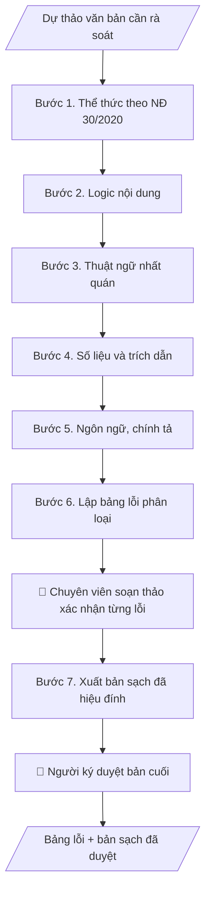

# Rà soát dự thảo văn bản

## Định dạng và file đầu ra
Định dạng đầu ra có thể chọn theo sản phẩm/yêu cầu: .docx, .pdf. Đọc mục “Định dạng bổ sung” trong quy cách đầu ra trước khi chọn.

**Phải tạo file thực tế để tải xuống, không chỉ trả nội dung trong chat.** Định dạng mặc định của skill: **.docx**. Nếu có bảng số liệu nghiệp vụ yêu cầu file bảng tính riêng, tạo thêm Excel theo yêu cầu; không tự tạo file kiểm tra. Không chờ người dùng yêu cầu xuất file lần nữa. Ưu tiên định dạng người dùng chỉ định; đọc quy tắc xuất file tại references/quy-cach-dau-ra.md.

## Quy cách đầu ra và thông tin thiếu
Khi dựng file Word/Excel, áp dụng mục “Thể thức và bảng biểu khi dựng file” trong quy cách đầu ra (cỡ chữ từng thành phần, bảng nhiều trang, số trang, phụ lục). Đọc [quy cách và cấu trúc sản phẩm](references/quy-cach-dau-ra.md) trước khi soạn/xuất. File giao chỉ gồm sản phẩm nghiệp vụ được yêu cầu; kiểm tra nội bộ không xuất kèm. Thiếu thông tin thì giữ nguyên trường/mục và chỗ điền theo mẫu gốc (dòng dấu chấm, dấu gạch hoặc ô trống); không tự điền dữ liệu mẫu, số 0, mã chờ xác minh hay dòng chờ ký. Mẫu chuyên ngành còn áp dụng được ưu tiên về cấu trúc, mã biểu và người ký. Bản đầy đủ: [quy tắc chung](references/quy-tac-chung.md).

Khi người dùng yêu cầu bộ slide (.pptx), đọc mục “Xuất PowerPoint (.pptx) khi được yêu cầu” trong quy cách đầu ra.

## Kiểm soát áp dụng và phê duyệt
Trước khi chạy, xác định `ngay_ap_dung`, `loai_hinh_truong`, `quy_che_noi_bo`, `nguon_du_lieu`, `nguoi_kiem_duyet`; chỉ hỏi thông tin liên quan nghiệp vụ, không dùng giá trị giả định thay dữ liệu bắt buộc. Đối chiếu căn cứ pháp lý với văn bản gốc, hiệu lực, điều khoản áp dụng và chuyển tiếp. Bản đầy đủ: [quy tắc chung](references/quy-tac-chung.md).

Nếu có cập nhật pháp lý dưới đây, đọc [căn cứ và điều kiện áp dụng](references/phap-ly.md) trước khi làm. Quy trình dưới đây giữ nghiệp vụ từ bản gốc; mọi viện dẫn văn bản, mẫu biểu, điều khoản phải theo căn cứ đã chọn trong phap-ly.md, không theo văn bản cũ.

## Giới hạn và human gate
AI hỗ trợ chuẩn bị và đối chiếu; cán bộ phụ trách kiểm tra dữ liệu/căn cứ, người có thẩm quyền duyệt và ký. Không đánh dấu đã ký, đã duyệt, đã công bố khi chưa có chứng cứ. Dữ liệu sinh viên, sức khỏe, nhân sự, tài chính chỉ dùng theo mục đích và phân quyền, che thông tin định danh khi dùng ví dụ (Luật 91/2025/QH15, hiệu lực 01/01/2026); không tải dữ liệu lên dịch vụ ngoài khi chưa có quyền. Bản đầy đủ: [quy tắc chung](references/quy-tac-chung.md).

## Khi nào dùng
Trước khi trình lãnh đạo ký bất kỳ văn bản nào: công văn, tờ trình, quyết định, thông báo,
kế hoạch, báo cáo... Áp dụng cho mọi phòng ban, khoa, trung tâm — không phụ thuộc tên đơn vị.

## Đầu vào (Input)
| Trường | Mô tả | Bắt buộc |
|---|---|---|
| `loai_van_ban` | Công văn / Tờ trình / Quyết định / Thông báo / Kế hoạch / Báo cáo / Quy chế... | Có |
| `du_thao` | Toàn văn dự thảo cần rà soát | Có |
| `can_cu_phap_ly` | Các văn bản pháp lý, quy định nội bộ liên quan (để đối chiếu trích dẫn) | Không |
| `glossary` | Bảng thuật ngữ chuẩn của trường/đơn vị (nếu có) | Không |
| `muc_do` | Rà soát nhanh (thể thức + lỗi chính) / Rà soát kỹ (toàn diện 5 lớp) | Không (mặc định: kỹ) |

## Quy trình
**Ràng buộc pháp lý khi thực hiện** (trích references/phap-ly.md; đối chiếu toàn văn và hiệu lực tại ngày nghiệp vụ):
- Thông tư 56/2026/TT-BGDĐT, hiệu lực 07/07/2026: Yêu cầu khóa tuyển sinh, chương trình, ngày áp dụng và quy chế đào tạo nội bộ. Đối chiếu điều khoản chuyển tiếp trong toàn văn trước khi chọn quy tắc; không tự áp dụng quy định mới hồi tố cho mọi khóa. Không dùng điều/khoản, thang điểm hoặc điều kiện tốt nghiệp cũ như quy định hiện hành nếu chưa đối chiếu.
- Trước Bước 1: chọn căn cứ theo đối tượng, loại hình trường và chuyển tiếp; lập bảng văn bản / điều khoản / lý do áp dụng / bằng chứng. Thiếu văn bản gốc hoặc điều khoản thì ghi nhận nội bộ [CẦN XÁC MINH] (không đưa vào file giao), để trống phần tương ứng, chưa kết luận tuân thủ.
- Các con số, thời hạn, số điều, số mức xếp loại, hệ số và mẫu biểu nêu trong các bước dưới đây được giữ từ quy trình gốc (trước cập nhật pháp lý); chỉ dùng khi đã đối chiếu đúng với căn cứ đã chọn, khác thì theo căn cứ. Danh sách điểm cần đối chiếu: docs/DIEM_CAN_DOI_CHIEU_PHAP_LY.md.

Nếu `muc_do` = "Rà soát nhanh": chỉ thực hiện Bước 1 (thể thức), Bước 4 (số liệu và trích dẫn chính),
Bước 5 (lỗi chính tả rõ ràng), rồi sang Bước 6–7 rút gọn. Mặc định (`muc_do` = "kỹ") thực hiện đủ 7 bước.

**Bước 1. Rà soát thể thức theo NĐ 30/2020**
- Làm gì: đối chiếu dự thảo với danh mục thành phần bắt buộc theo đúng `loai_van_ban`: Quốc hiệu, Tiêu ngữ;
  tên cơ quan ban hành; số, ký hiệu; địa danh, ngày tháng năm; tên loại và trích yếu; kính gửi (nếu có);
  nội dung; thẩm quyền ký; nơi nhận; chữ ký (chức danh + họ tên); dấu chỉ mức độ khẩn, mật (nếu có).
  Đánh dấu từng thành phần: đủ / thiếu / sai vị trí.
- Dùng input: `du_thao`, `loai_van_ban`, `muc_do` (nhanh: chỉ Bước 1 và Bước 5; kỹ: đủ Bước 1–5; thiếu thì mặc định kỹ).
- Vai trò: Chuyên viên soạn thảo (đơn vị soạn thảo văn bản) · AI hỗ trợ: đối chiếu tự động theo danh mục thành phần NĐ 30/2020, đánh dấu đủ/thiếu/sai vị trí · ⏱ ~10–20 phút (ước tính)
- Lưu ý nghiệp vụ: mỗi loại văn bản có bộ thành phần riêng (VD: quyết định không có kính gửi, công văn
  bắt buộc có kính gửi và nơi nhận) — không áp rập khuôn một mẫu cho mọi loại; kiểm tra chính tả tên
  cơ quan, chức danh người ký.
- → Kết quả bước: danh sách thành phần thể thức đủ/thiếu/sai vị trí.

**Bước 2. Rà soát logic nội dung**
- Làm gì: kiểm tra mạch lý do → căn cứ → nội dung → kiến nghị có liền mạch không; các điều/khoản có
  mâu thuẫn nhau không; phạm vi điều chỉnh và đối tượng áp dụng có được xác định rõ ràng; nội dung
  có vượt quá thẩm quyền ban hành của người ký không.
- Dùng input: `du_thao`, `loai_van_ban`.
- Vai trò: Chuyên viên soạn thảo (đơn vị soạn thảo văn bản) · AI hỗ trợ: rà mạch logic, phát hiện mâu thuẫn giữa các điều/khoản · ⏱ ~15–30 phút (ước tính)
- Lưu ý nghiệp vụ: bẫy thường gặp là viện dẫn căn cứ nhưng nội dung không dùng đến, hoặc kiến nghị
  vượt thẩm quyền người ký; với quyết định/quy chế, kiểm tra từng điều không "đá" nhau.
- → Kết quả bước: danh sách điểm mâu thuẫn, thiếu logic kèm vị trí điều/khoản/mục.

**Bước 3. Kiểm tra thuật ngữ nhất quán**
- Làm gì: quét toàn văn, liệt kê các thuật ngữ chỉ cùng một đối tượng/khái niệm
  (VD: "sinh viên"/"học viên", "khoa"/"bộ môn"); đối chiếu với `glossary` nếu có; kiểm tra tên đơn vị,
  chức danh, học hàm học vị viết đúng chuẩn.
- Dùng input: `du_thao`, `glossary`.
- Vai trò: Chuyên viên soạn thảo (đơn vị soạn thảo văn bản) · AI hỗ trợ: quét toàn văn, lập bảng thuật ngữ lẫn lộn, đối chiếu glossary · ⏱ ~10–20 phút (ước tính)
- Lưu ý nghiệp vụ: lỗi thuật ngữ thường rải rác các mục do nhiều người cùng soạn; phải chọn MỘT cách
  viết chuẩn và thống nhất toàn văn, không giữ cả hai.
- → Kết quả bước: bảng thuật ngữ lẫn lộn (vị trí | các cách viết | cách viết chuẩn đề xuất).

**Bước 4. Kiểm tra số liệu và trích dẫn**
- Làm gì: cộng dồn lại mọi số liệu tính toán (tổng, tỷ lệ %) để đối chiếu với con số ghi trong văn bản;
  kiểm tra đơn vị tính, định dạng ngày tháng nhất quán; tra từng số/ký hiệu văn bản được trích dẫn
  đối chiếu với `can_cu_phap_ly`; kiểm tra căn cứ còn hiệu lực hay đã bị thay thế.
- Dùng input: `du_thao`, `can_cu_phap_ly`.
- Vai trò: Chuyên viên soạn thảo (đơn vị soạn thảo văn bản) · AI hỗ trợ: cộng dồn số liệu, tra cứu trích dẫn; chuyên viên xác nhận trạng thái hiệu lực căn cứ · ⏱ ~20–40 phút + ~15–30 phút duyệt (ước tính)
- Lưu ý nghiệp vụ: bẫy kinh điển là tổng các khoản không khớp tổng ghi trong văn bản, và trích dẫn
  nhầm số hiệu văn bản (VD: nhầm thông tư tuyển sinh với thông tư đào tạo); căn cứ hết hiệu lực
  phải cảnh báo ở mức Nghiêm trọng.
- → Kết quả bước: bảng lỗi số liệu/trích dẫn (vị trí | số liệu ghi | số liệu đúng | nguồn đối chiếu).

**Bước 5. Rà soát ngôn ngữ, chính tả**
- Làm gì: kiểm tra chính tả, dấu câu, lỗi đánh máy; câu văn hành chính có rõ ràng, không tối nghĩa,
  không gây hiểu hai nghĩa.
- Dùng input: `du_thao`.
- Vai trò: Chuyên viên soạn thảo (đơn vị soạn thảo văn bản) · AI hỗ trợ: quét chính tả, dấu câu, phát hiện câu tối nghĩa · ⏱ ~10–15 phút (ước tính)
- Lưu ý nghiệp vụ: chỉ sửa lỗi ngôn ngữ, KHÔNG viết lại văn phong của người soạn; câu nào tối nghĩa
  thì đề xuất cách viết lại cụ thể, không tự ý thay đổi ý.
- → Kết quả bước: danh sách lỗi chính tả, dấu câu, câu tối nghĩa kèm đề xuất sửa.

**Bước 6. Lập bảng lỗi tổng hợp**
- Làm gì: gộp kết quả 5 bước thành một bảng lỗi duy nhất; mỗi lỗi ghi: vị trí (dòng/điều/mục),
  loại lỗi, mức độ (Nghiêm trọng / Cần sửa / Gợi ý), đề xuất sửa cụ thể; sắp xếp theo mức độ giảm dần;
  lập thống kê số lỗi theo mức độ và theo lớp rà soát.
- Dùng input: kết quả các Bước 1–5 (các bán thành phẩm).
- Vai trò: Chuyên viên soạn thảo (đơn vị soạn thảo văn bản) · AI hỗ trợ: gộp bảng lỗi, phân loại mức độ, lập thống kê · ⏱ ~15–25 phút (ước tính)
- Lưu ý nghiệp vụ: mức Nghiêm trọng = lỗi làm văn bản mất hiệu lực hoặc gây hiểu sai (thiếu thành phần
  thể thức bắt buộc, số liệu sai, căn cứ hết hiệu lực); phân biệt rõ lỗi "bắt buộc sửa" với "gợi ý hoàn thiện".
- → Kết quả bước: bảng lỗi chi tiết đã phân loại, đánh mức độ, có thống kê.

**Bước 7. Xuất bản sạch đã hiệu đính**
- Làm gì: áp toàn bộ đề xuất sửa trong bảng lỗi lên dự thảo, giữ nguyên ý đồ và văn phong của người soạn;
  đánh dấu mọi chỗ đã sửa để đối chiếu với số thứ tự lỗi trong bảng; đọc soát lại toàn văn sau hiệu đính.
- Dùng input: `du_thao`, bảng lỗi (Bước 6).
- Vai trò: Chuyên viên soạn thảo (đơn vị soạn thảo văn bản) + Người ký (Trưởng phòng/Hiệu trưởng theo thẩm quyền) · AI hỗ trợ: áp đề xuất sửa thành bản sạch, đánh dấu chỗ sửa để đối chiếu · ⏱ ~20–40 phút + ~30–60 phút duyệt (ước tính)
- Lưu ý nghiệp vụ: chỗ nào người soạn có thể không đồng ý thì giữ nguyên văn và ghi chú trong bảng lỗi,
  không tự ý sửa; bản sạch phải ở trạng thái "trình ký được ngay" sau khi human gate duyệt.
- → Kết quả bước: bản sạch sẵn sàng trình ký + kết quả rà soát 5 lớp (giữ nội bộ, không xuất kèm file).

## Luồng quy trình (Workflow)

## Đầu ra
- Bảng lỗi chi tiết (vị trí | loại lỗi | mức độ | đề xuất sửa).
- Bản sạch đã hiệu đính, sẵn sàng trình ký.
- Checklist 5 lớp rà soát đã đánh dấu.

File nghiệp vụ thực tế theo định dạng mặc định ở đầu skill hoặc định dạng người dùng yêu cầu, kèm liên kết tải trong phản hồi cuối.

Sản phẩm nghiệp vụ hoàn chỉnh theo [quy cách và cấu trúc](references/quy-cach-dau-ra.md), giữ các trường chưa có dữ liệu ở trạng thái trống. Không xuất kèm checklist/phụ lục kiểm tra đầu ra.

## Kiểm tra nội bộ trước khi giao
Các tiêu chí sau dùng để tự đối chiếu; không sao chép vào file xuất. Mục thiếu dữ liệu được để trống, không đánh dấu đã đạt hoặc đã duyệt.

- [ ] Đủ các phần và đúng bố cục theo cấu trúc tại references/quy-cach-dau-ra.md (không theo cấu trúc của bản gốc).
- [ ] Số liệu, số/ký hiệu văn bản trích dẫn trong output khớp với Input đã cho; căn cứ pháp lý còn hiệu lực, trích dẫn đúng số hiệu.
- [ ] Không bịa đặt số liệu, minh chứng, trích dẫn văn bản pháp lý.
- [ ] Bản sạch giữ nguyên ý đồ và văn phong của người soạn; chỗ người soạn có thể không đồng ý giữ nguyên văn + ghi chú, không tự ý sửa.
- [ ] Đúng thể thức theo NĐ 30/2020/NĐ-CP với loại văn bản tương ứng.
- [ ] Đã qua Human gate: chuyên viên soạn thảo đã xác nhận từng lỗi; người ký đã duyệt bản cuối; không còn lỗi Nghiêm trọng chưa được con người xác nhận.
- [ ] Bản sạch ở trạng thái "trình ký được ngay" sau khi human gate duyệt.
- [ ] Mỗi lỗi đánh số, truy vết được vị trí tương ứng trong bản sạch đã hiệu đính.

## Căn cứ & lưu ý
- Nghị định 30/2020/NĐ-CP về công tác văn thư.
- Rà soát càng sớm càng tốt — lý tưởng là ngay sau khi có dự thảo, trước khi trình ký 1–2 ngày làm việc.
- Không dùng tên thật của trường/cá nhân khi mô phỏng.

## Tư liệu đối chiếu
Bản gốc trước cập nhật pháp lý (kèm ví dụ giả lập) lưu tại `references/quy-trinh-lich-su.md`, chỉ để đối chiếu hồ sơ lịch sử; không dùng căn cứ, mẫu hay số liệu trong đó làm chỉ dẫn hiện hành.

## Quản trị phiên bản
- Phiên bản gói `1.3.2` (cập nhật 2026-10-10); hồ sơ đầy đủ tại [references/version.json](references/version.json).
- Người phê duyệt nghiệp vụ: **chưa chỉ định**. Trạng thái: dự thảo nghiệp vụ; kiểm tra pháp lý trước thực thi. Ngày cập nhật không đồng nghĩa mọi văn bản đã được rà soát toàn văn.
- Giấy phép theo LICENSE của kho (bản quyền CES Global). Lịch sử thay đổi: CHANGELOG.md.
