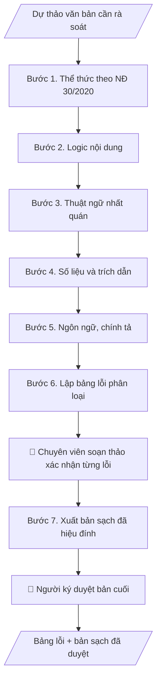

# Skill: Rà soát dự thảo văn bản

## Khi nào dùng
Trước khi trình lãnh đạo ký bất kỳ văn bản nào: công văn, tờ trình, quyết định, thông báo,
kế hoạch, báo cáo... Áp dụng cho mọi phòng ban, khoa, trung tâm — không phụ thuộc tên đơn vị.

## Đầu vào (Input)

| Trường | Mô tả | Bắt buộc |
|---|---|---|
| `loai_van_ban` | Công văn / Tờ trình / Quyết định / Thông báo / Kế hoạch / Báo cáo / Quy chế... | Có |
| `du_thao` | Toàn văn dự thảo cần rà soát | Có |
| `can_cu_phap_ly` | Các văn bản pháp lý, quy định nội bộ liên quan (để đối chiếu trích dẫn) | Không |
| `glossary` | Bảng thuật ngữ chuẩn của trường/đơn vị (nếu có) | Không |
| `muc_do` | Rà soát nhanh (thể thức + lỗi chính) / Rà soát kỹ (toàn diện 5 lớp) | Không (mặc định: kỹ) |

## Quy trình

Nếu `muc_do` = "Rà soát nhanh": chỉ thực hiện Bước 1 (thể thức), Bước 4 (số liệu và trích dẫn chính),
Bước 5 (lỗi chính tả rõ ràng), rồi sang Bước 6–7 rút gọn. Mặc định (`muc_do` = "kỹ") thực hiện đủ 7 bước.

**Bước 1. Rà soát thể thức theo NĐ 30/2020**
- Làm gì: đối chiếu dự thảo với danh mục thành phần bắt buộc theo đúng `loai_van_ban`: Quốc hiệu, Tiêu ngữ;
  tên cơ quan ban hành; số, ký hiệu; địa danh, ngày tháng năm; tên loại và trích yếu; kính gửi (nếu có);
  nội dung; thẩm quyền ký; nơi nhận; chữ ký (chức danh + họ tên); dấu chỉ mức độ khẩn, mật (nếu có).
  Đánh dấu từng thành phần: đủ / thiếu / sai vị trí.
- Dùng input: `du_thao`, `loai_van_ban`.
- Vai trò: Chuyên viên soạn thảo (đơn vị soạn thảo văn bản) · AI hỗ trợ: đối chiếu tự động theo danh mục thành phần NĐ 30/2020, đánh dấu đủ/thiếu/sai vị trí · ⏱ ~10–20 phút (ước tính)
- Lưu ý nghiệp vụ: mỗi loại văn bản có bộ thành phần riêng (VD: quyết định không có kính gửi, công văn
  bắt buộc có kính gửi và nơi nhận) — không áp rập khuôn một mẫu cho mọi loại; kiểm tra chính tả tên
  cơ quan, chức danh người ký.
- → Kết quả bước: danh sách thành phần thể thức đủ/thiếu/sai vị trí.

**Bước 2. Rà soát logic nội dung**
- Làm gì: kiểm tra mạch lý do → căn cứ → nội dung → kiến nghị có liền mạch không; các điều/khoản có
  mâu thuẫn nhau không; phạm vi điều chỉnh và đối tượng áp dụng có được xác định rõ ràng; nội dung
  có vượt quá thẩm quyền ban hành của người ký không.
- Dùng input: `du_thao`, `loai_van_ban`.
- Vai trò: Chuyên viên soạn thảo (đơn vị soạn thảo văn bản) · AI hỗ trợ: rà mạch logic, phát hiện mâu thuẫn giữa các điều/khoản · ⏱ ~15–30 phút (ước tính)
- Lưu ý nghiệp vụ: bẫy thường gặp là viện dẫn căn cứ nhưng nội dung không dùng đến, hoặc kiến nghị
  vượt thẩm quyền người ký; với quyết định/quy chế, kiểm tra từng điều không "đá" nhau.
- → Kết quả bước: danh sách điểm mâu thuẫn, thiếu logic kèm vị trí điều/khoản/mục.

**Bước 3. Kiểm tra thuật ngữ nhất quán**
- Làm gì: quét toàn văn, liệt kê các thuật ngữ chỉ cùng một đối tượng/khái niệm
  (VD: "sinh viên"/"học viên", "khoa"/"bộ môn"); đối chiếu với `glossary` nếu có; kiểm tra tên đơn vị,
  chức danh, học hàm học vị viết đúng chuẩn.
- Dùng input: `du_thao`, `glossary`.
- Vai trò: Chuyên viên soạn thảo (đơn vị soạn thảo văn bản) · AI hỗ trợ: quét toàn văn, lập bảng thuật ngữ lẫn lộn, đối chiếu glossary · ⏱ ~10–20 phút (ước tính)
- Lưu ý nghiệp vụ: lỗi thuật ngữ thường rải rác các mục do nhiều người cùng soạn; phải chọn MỘT cách
  viết chuẩn và thống nhất toàn văn, không giữ cả hai.
- → Kết quả bước: bảng thuật ngữ lẫn lộn (vị trí | các cách viết | cách viết chuẩn đề xuất).

**Bước 4. Kiểm tra số liệu và trích dẫn**
- Làm gì: cộng dồn lại mọi số liệu tính toán (tổng, tỷ lệ %) để đối chiếu với con số ghi trong văn bản;
  kiểm tra đơn vị tính, định dạng ngày tháng nhất quán; tra từng số/ký hiệu văn bản được trích dẫn
  đối chiếu với `can_cu_phap_ly`; kiểm tra căn cứ còn hiệu lực hay đã bị thay thế.
- Dùng input: `du_thao`, `can_cu_phap_ly`.
- Vai trò: Chuyên viên soạn thảo (đơn vị soạn thảo văn bản) · AI hỗ trợ: cộng dồn số liệu, tra cứu trích dẫn; chuyên viên xác nhận trạng thái hiệu lực căn cứ · ⏱ ~20–40 phút + ~15–30 phút duyệt (ước tính)
- Lưu ý nghiệp vụ: bẫy kinh điển là tổng các khoản không khớp tổng ghi trong văn bản, và trích dẫn
  nhầm số hiệu văn bản (VD: nhầm thông tư tuyển sinh với thông tư đào tạo); căn cứ hết hiệu lực
  phải cảnh báo ở mức Nghiêm trọng.
- → Kết quả bước: bảng lỗi số liệu/trích dẫn (vị trí | số liệu ghi | số liệu đúng | nguồn đối chiếu).

**Bước 5. Rà soát ngôn ngữ, chính tả**
- Làm gì: kiểm tra chính tả, dấu câu, lỗi đánh máy; câu văn hành chính có rõ ràng, không tối nghĩa,
  không gây hiểu hai nghĩa.
- Dùng input: `du_thao`.
- Vai trò: Chuyên viên soạn thảo (đơn vị soạn thảo văn bản) · AI hỗ trợ: quét chính tả, dấu câu, phát hiện câu tối nghĩa · ⏱ ~10–15 phút (ước tính)
- Lưu ý nghiệp vụ: chỉ sửa lỗi ngôn ngữ, KHÔNG viết lại văn phong của người soạn; câu nào tối nghĩa
  thì đề xuất cách viết lại cụ thể, không tự ý thay đổi ý.
- → Kết quả bước: danh sách lỗi chính tả, dấu câu, câu tối nghĩa kèm đề xuất sửa.

**Bước 6. Lập bảng lỗi tổng hợp**
- Làm gì: gộp kết quả 5 bước thành một bảng lỗi duy nhất; mỗi lỗi ghi: vị trí (dòng/điều/mục),
  loại lỗi, mức độ (Nghiêm trọng / Cần sửa / Gợi ý), đề xuất sửa cụ thể; sắp xếp theo mức độ giảm dần;
  lập thống kê số lỗi theo mức độ và theo lớp rà soát.
- Dùng input: kết quả các Bước 1–5 (các bán thành phẩm).
- Vai trò: Chuyên viên soạn thảo (đơn vị soạn thảo văn bản) · AI hỗ trợ: gộp bảng lỗi, phân loại mức độ, lập thống kê · ⏱ ~15–25 phút (ước tính)
- Lưu ý nghiệp vụ: mức Nghiêm trọng = lỗi làm văn bản mất hiệu lực hoặc gây hiểu sai (thiếu thành phần
  thể thức bắt buộc, số liệu sai, căn cứ hết hiệu lực); phân biệt rõ lỗi "bắt buộc sửa" với "gợi ý hoàn thiện".
- → Kết quả bước: bảng lỗi chi tiết đã phân loại, đánh mức độ, có thống kê.

**Bước 7. Xuất bản sạch đã hiệu đính**
- Làm gì: áp toàn bộ đề xuất sửa trong bảng lỗi lên dự thảo, giữ nguyên ý đồ và văn phong của người soạn;
  đánh dấu mọi chỗ đã sửa để đối chiếu với số thứ tự lỗi trong bảng; đọc soát lại toàn văn sau hiệu đính.
- Dùng input: `du_thao`, bảng lỗi (Bước 6).
- Vai trò: Chuyên viên soạn thảo (đơn vị soạn thảo văn bản) + Người ký (Trưởng phòng/Hiệu trưởng theo thẩm quyền) · AI hỗ trợ: áp đề xuất sửa thành bản sạch, đánh dấu chỗ sửa để đối chiếu · ⏱ ~20–40 phút + ~30–60 phút duyệt (ước tính)
- Lưu ý nghiệp vụ: chỗ nào người soạn có thể không đồng ý thì giữ nguyên văn và ghi chú trong bảng lỗi,
  không tự ý sửa; bản sạch phải ở trạng thái "trình ký được ngay" sau khi human gate duyệt.
- → Kết quả bước: bản sạch (markdown) sẵn sàng trình ký + checklist 5 lớp đã đánh dấu.
## Luồng quy trình (Workflow)

## Đầu ra (Output)
- Bảng lỗi chi tiết (vị trí | loại lỗi | mức độ | đề xuất sửa).
- Bản sạch đã hiệu đính (markdown), sẵn sàng trình ký.
- Checklist 5 lớp rà soát đã đánh dấu.

**Cấu trúc output chuẩn** (sản phẩm chính: Bảng lỗi chi tiết):
1. Tiêu đề: "Bảng lỗi rà soát" + tên văn bản, loại văn bản, ngày rà soát.
2. Các dòng lỗi theo thứ tự mức độ (Nghiêm trọng → Cần sửa → Gợi ý); mỗi dòng: STT | Vị trí | Loại lỗi | Mức độ | Đề xuất sửa.
3. Thống kê: tổng số lỗi theo từng mức độ và theo từng lớp rà soát.
4. Ghi chú đối chiếu: cách tra cứu từng lỗi trong bản sạch đã hiệu đính.
5. Checklist 5 lớp rà soát đã đánh dấu từng lớp.

## Checklist nghiệm thu

- [ ] Bảng lỗi đầy đủ 5 phần theo Cấu trúc output chuẩn: tiêu đề bảng lỗi; dòng lỗi theo mức độ (Nghiêm trọng → Cần sửa → Gợi ý); thống kê số lỗi theo mức độ và lớp rà soát; ghi chú đối chiếu; checklist 5 lớp đã đánh dấu.
- [ ] Số liệu, số/ký hiệu văn bản trích dẫn trong output khớp với Input đã cho; căn cứ pháp lý còn hiệu lực, trích dẫn đúng số hiệu.
- [ ] Không bịa đặt số liệu, minh chứng, trích dẫn văn bản pháp lý.
- [ ] Bản sạch giữ nguyên ý đồ và văn phong của người soạn; chỗ người soạn có thể không đồng ý giữ nguyên văn + ghi chú, không tự ý sửa.
- [ ] Đúng thể thức theo NĐ 30/2020/NĐ-CP với loại văn bản tương ứng.
- [ ] Đã qua Human gate: chuyên viên soạn thảo đã xác nhận từng lỗi; người ký đã duyệt bản cuối; không còn lỗi Nghiêm trọng chưa được con người xác nhận.
- [ ] Bản sạch ở trạng thái "trình ký được ngay" sau khi human gate duyệt.
- [ ] Mỗi lỗi đánh số, truy vết được vị trí tương ứng trong bản sạch đã hiệu đính.

> Tiêu chí đạt: tất cả các ô được đánh dấu.

## Ví dụ mô phỏng (dữ liệu giả lập)

> Tất cả tên trường, cá nhân, số liệu dưới đây đều là **giả lập**, không liên quan tổ chức/cá nhân có thật.
> Ví dụ này mô phỏng Phòng Đào tạo rà soát, nhưng skill áp dụng tương tự cho mọi phòng ban.

### Input mẫu

| Trường | Giá trị |
|---|---|
| `loai_van_ban` | Tờ trình |
| `du_thao` | (Dự thảo Tờ trình của Phòng Đào tạo về kế hoạch ôn thi tốt nghiệp — có 4 lỗi cố ý: thiếu Nơi nhận; lẫn "sinh viên"/"học viên"; tổng kinh phí 3 khoản 50+30+25=105 nhưng ghi 100 triệu; trích dẫn "Thông tư 08/2022" cho quy chế đào tạo) |
| `can_cu_phap_ly` | Quy chế đào tạo (TT 08/2021/TT-BGDĐT); Quy chế chi tiêu nội bộ trường |
| `muc_do` | Rà soát kỹ |

### Output mẫu

**BẢNG LỖI RÀ SOÁT — Dự thảo Tờ trình kế hoạch ôn thi tốt nghiệp** (loại: Tờ trình; ngày rà soát: 09/10/2026)

**Bảng lỗi:**

| # | Vị trí | Loại lỗi | Mức độ | Đề xuất sửa |
|---|---|---|---|---|
| 1 | Cuối văn bản | Thể thức: thiếu mục Nơi nhận | Nghiêm trọng | Bổ sung Nơi nhận (Ban Giám hiệu; Lưu VT, ĐT) |
| 2 | Mục 2, 3 | Thuật ngữ: lẫn "sinh viên" và "học viên" cho cùng đối tượng hệ chính quy | Cần sửa | Thống nhất dùng "sinh viên" toàn văn |
| 3 | Mục 4 | Số liệu: 50+30+25=105, văn bản ghi 100 triệu đồng | Nghiêm trọng | Sửa thành 105 triệu đồng hoặc kiểm tra lại từng khoản |
| 4 | Phần căn cứ | Trích dẫn sai: TT 08/2022 là quy chế tuyển sinh, quy chế đào tạo là TT 08/2021 | Cần sửa | Sửa thành Thông tư 08/2021/TT-BGDĐT |

**Thống kê:** 4 lỗi — Nghiêm trọng: 2 (thể thức, số liệu) | Cần sửa: 2 (thuật ngữ, trích dẫn) | Gợi ý: 0.

**Ghi chú đối chiếu:** mỗi lỗi đánh số #1–#4, tra cứu vị trí tương ứng trong bản sạch dưới đây.

**Bản sạch (trích):** ... *(văn bản đã hiệu đính cả 4 lỗi, giữ nguyên ý đồ)* ...

**Checklist:** [x] Thể thức [x] Logic [x] Thuật ngữ [x] Số liệu [x] Ngôn ngữ

## Human gate (người kiểm duyệt)
1. **Chuyên viên soạn thảo** (đầu mối của đơn vị): xác nhận từng lỗi trong bảng — chấp nhận sửa hay giữ nguyên (ghi lý do).
2. **Người ký** (Trưởng phòng/Hiệu trưởng theo thẩm quyền): duyệt bản sạch cuối cùng trước khi phát hành.
3. AI không được tự ý "chốt" bản cuối khi còn lỗi mức Nghiêm trọng chưa được con người xác nhận.

## Giới hạn (guardrails)
- KHÔNG thay thế thẩm định pháp lý/chuyên môn cuối cùng của phòng Thanh tra & Pháp chế hoặc hội đồng chuyên môn.
- KHÔNG tự ý thay đổi nội dung quyết định, số liệu, kiến nghị — chỉ đề xuất sửa, người soạn quyết định.
- KHÔNG tự phát hành/gửi văn bản dưới bất kỳ hình thức nào.
- Khi phát hiện căn cứ pháp lý có dấu hiệu hết hiệu lực, chỉ cảnh báo, không tự kết luận thay văn bản khác.

## Căn cứ & lưu ý
- Nghị định 30/2020/NĐ-CP về công tác văn thư.
- Rà soát càng sớm càng tốt — lý tưởng là ngay sau khi có dự thảo, trước khi trình ký 1–2 ngày làm việc.
- Không dùng tên thật của trường/cá nhân khi mô phỏng.
