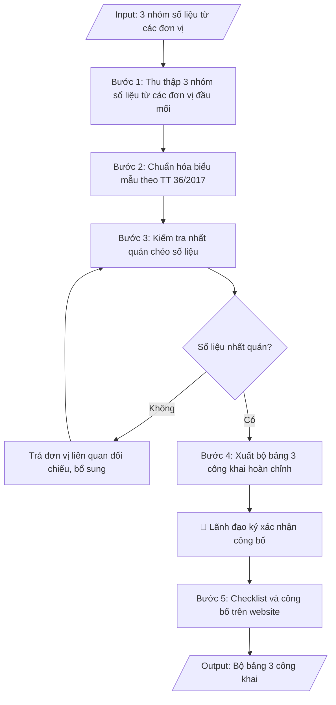

# Skill: Tổng hợp số liệu 3 công khai mảng đào tạo

## Khi nào dùng
Khi đến kỳ công khai thông tin theo năm học (định kỳ hằng năm, thường trước 30/9 theo TT 36/2017):
tổng hợp 3 nhóm nội dung — (1) công khai chất lượng đào tạo, (2) công khai điều kiện đảm bảo chất lượng,
(3) công khai thu chi tài chính mảng đào tạo — từ số liệu của Phòng Đào tạo, Phòng TC-KT, Phòng TCCB,
Phòng Quản trị – Thiết bị để công bố trên website và báo cáo cơ quan chủ quản.

## Đầu vào (Input)

| Trường | Mô tả | Bắt buộc |
|---|---|---|
| `nam_hoc` | Năm học công khai, vd: 2025–2026 | Có |
| `so_lieu_chat_luong` | Quy mô SV theo ngành/khóa, số tốt nghiệp, tỷ lệ tốt nghiệp, tỷ lệ có việc làm sau 1 năm, tỷ lệ bỏ học/thôi học | Có |
| `so_lieu_dieu_kien` | Đội ngũ giảng viên (số lượng, trình độ, tỷ lệ GV/SV), diện tích sàn, số phòng học, thư viện, trang thiết bị | Có |
| `so_lieu_tai_chinh` | Học phí theo ngành, tổng thu, tổng chi mảng đào tạo, kinh phí NCKH/sinh viên | Có |
| `don_vi_cap_so_lieu` | Danh sách đơn vị cung cấp số liệu (Đào tạo, TC-KT, TCCB, QTTB...) kèm người phụ trách | Không |
| `ngay_cong_khai` | Thời điểm dự kiến công bố trên website | Không (mặc định: trước 30/9 năm liền kề) |

## Quy trình

**Bước 1. Thu thập 3 nhóm số liệu từ các đơn vị đầu mối**
- Làm gì: gửi yêu cầu và thu thập số liệu từ từng đơn vị đầu mối, đúng 3 nhóm:
  - *Nhóm 1 – Chất lượng đào tạo* (từ Phòng Đào tạo): quy mô SV theo ngành và khóa; số lượng, tỷ lệ
    tốt nghiệp theo ngành; tỷ lệ SV thôi học/bỏ học; tỷ lệ SV tốt nghiệp có việc làm sau 12 tháng
    (từ kết quả khảo sát việc làm).
  - *Nhóm 2 – Điều kiện đảm bảo chất lượng* (từ Phòng TCCB, Phòng QTTB): tổng số giảng viên
    (cơ hữu/thỉnh giảng), trình độ (TS, ThS, ĐH), tỷ lệ SV/GV; diện tích sàn học tập; số phòng học,
    phòng thí nghiệm; số đầu sách, diện tích thư viện.
  - *Nhóm 3 – Thu chi tài chính* (từ Phòng TC-KT): mức học phí từng ngành và hình thức thu; tổng
    thu – tổng chi hoạt động đào tạo; kinh phí chi cho NCKH, học bổng tính trên đầu SV.
- Dùng input: `nam_hoc`, `so_lieu_chat_luong`, `so_lieu_dieu_kien`, `so_lieu_tai_chinh`,
  `don_vi_cap_so_lieu`
- Vai trò: Các đơn vị đầu mối (khoa, phòng) cung cấp số liệu · AI hỗ trợ: soạn biểu mẫu thu thập chuẩn hóa · ⏱ ~2–3 ngày (ước tính)
- Lưu ý nghiệp vụ: yêu cầu mỗi đơn vị ghi rõ thời điểm chốt số liệu của mình; kỳ số liệu thống
  nhất toàn trường (tính đến 30/9 hoặc cuối năm học) — lệch kỳ chốt là lỗi phổ biến nhất ở bước này.
- → Kết quả bước: 3 nhóm số liệu thô đã thu thập đủ từ các đơn vị, kèm ghi chú thời điểm chốt
  và đơn vị cung cấp của từng nhóm.

**Bước 2. Chuẩn hóa biểu mẫu theo Thông tư 36/2017**
- Làm gì: đưa 3 nhóm số liệu vào đúng biểu mẫu tại Phụ lục Thông tư 36/2017/TT-BGDĐT: thống nhất
  đơn vị tính (người, %, triệu đồng/tỷ đồng); thống nhất kỳ số liệu; chuẩn hóa tên ngành đúng theo
  danh mục ngành được cấp phép đào tạo.
- Dùng input: `so_lieu_chat_luong`, `so_lieu_dieu_kien`, `so_lieu_tai_chinh`
- Vai trò: Chuyên viên Phòng Đào tạo · AI hỗ trợ: chuẩn hóa biểu mẫu đúng Phụ lục TT 36/2017, thống nhất đơn vị tính · ⏱ ~1 giờ (ước tính)
- Lưu ý nghiệp vụ: tên ngành trên bảng công khai phải khớp tuyệt đối với tên trong quyết định mở
  ngành và đề án tuyển sinh đã công bố; đơn vị tiền tệ ghi rõ trong tiêu đề từng bảng.
- → Kết quả bước: bộ bảng 3 công khai đã điền số liệu theo đúng biểu mẫu TT 36/2017 (bản nháp).

**Bước 3. Kiểm tra nhất quán chéo số liệu**
- Làm gì: kiểm tra các đẳng thức bắt buộc: tổng số SV = tổng các ngành/khóa; tổng số tốt nghiệp =
  tổng các ngành; tổng thu/chi khớp số liệu Phòng TC-KT; đội ngũ GV khớp số liệu Phòng TCCB;
  chỉ tiêu tuyển sinh khớp đề án tuyển sinh đã công bố. Ghi rõ nguồn số liệu và thời điểm chốt
  dưới mỗi bảng.
- Dùng input: `so_lieu_chat_luong`, `so_lieu_dieu_kien`, `so_lieu_tai_chinh`, `don_vi_cap_so_lieu`
- Vai trò: Chuyên viên Phòng Đào tạo · AI hỗ trợ: kiểm tra đẳng thức bắt buộc, cảnh báo chênh lệch · ⏱ ~2 giờ (ước tính)
- Lưu ý nghiệp vụ: mọi chênh lệch đều phải trả về đơn vị liên quan để đối chiếu, bổ sung — không
  tự ý điều chỉnh số liệu cho khớp; lập bảng đối chiếu ghi lại từng điểm đã kiểm tra.
- → Kết quả bước: bảng đối chiếu nhất quán số liệu giữa các đơn vị (từng điểm kiểm tra đạt/không đạt).

**Bước 4. Xuất bộ bảng 3 công khai hoàn chỉnh**
- Làm gì: hoàn thiện bộ bảng sau khi đã nhất quán: tiêu đề chung (tên trường + tên bộ công khai +
  năm học + căn cứ TT 36/2017); 3 nhóm nội dung A/B/C với đầy đủ các bảng; ghi chú nguồn số liệu
  và thời điểm chốt; phần ký xác nhận (địa danh, ngày tháng, chức danh, chữ ký).
- Dùng input: `nam_hoc`, `ngay_cong_khai`
- Vai trò: Chuyên viên Phòng Đào tạo · AI hỗ trợ: xuất bộ bảng hoàn chỉnh, kiểm tra thể thức tiêu đề chung · ⏱ ~45 phút (ước tính)
- Lưu ý nghiệp vụ: đủ cả 3 nhóm nội dung bắt buộc mới được công bố; ngày ký xác nhận không được
  sau thời hạn công khai quy định (trong 3 tháng đầu năm học mới, thường trước 30/9).
- → Kết quả bước: bộ bảng 3 công khai hoàn chỉnh (markdown), sẵn sàng đăng website và đính kèm
  báo cáo gửi cơ quan chủ quản.

**Bước 5. Checklist và công bố trên website**
- Làm gì: chạy checklist cuối: đủ 3 nhóm nội dung; số liệu nhất quán; có đóng dấu, ký xác nhận;
  còn trong thời hạn công khai; sau đó đăng bộ bảng lên website trường (mục "3 công khai").
- Dùng input: `ngay_cong_khai`
- Vai trò: Chuyên viên Phòng Đào tạo · AI hỗ trợ: chạy checklist cuối (đủ 3 nhóm, số liệu nhất quán, dấu/ký xác nhận) · ⏱ ~30 phút (ước tính)
- Lưu ý nghiệp vụ: kiểm tra lại file đã đăng trên website (định dạng hiển thị đúng, không lỗi font
  bảng biểu); lưu bản đã công bố để đối chiếu khi thanh tra, kiểm tra.
- → Kết quả bước: bộ bảng 3 công khai đã công bố trên website + checklist kiểm tra trước công bố
  đã hoàn tất.

## Luồng quy trình (Workflow)


## Đầu ra (Output)
- Bộ bảng 3 công khai hoàn chỉnh (3 nhóm: chất lượng đào tạo; điều kiện đảm bảo chất lượng; thu chi tài chính).
- Bảng đối chiếu nhất quán số liệu giữa các đơn vị.
- Checklist kiểm tra trước khi công bố.

**Cấu trúc output chuẩn:** khung mẫu cố định của bộ bảng 3 công khai mảng đào tạo, các phần theo đúng thứ tự:
1. Tiêu đề chung: tên trường; tên bộ công khai ("CÔNG KHAI THÔNG TIN…"); năm học công khai;
   dòng căn cứ ban hành theo Thông tư 36/2017/TT-BGDĐT.
2. Nhóm A. Công khai chất lượng đào tạo: các bảng theo biểu mẫu (quy mô SV theo ngành/khóa;
   tốt nghiệp theo ngành; kết quả khảo sát việc làm sau 12 tháng; tỷ lệ thôi học).
3. Nhóm B. Công khai điều kiện đảm bảo chất lượng: các bảng theo biểu mẫu (đội ngũ GV cơ hữu
   theo trình độ, tỷ lệ SV/GV; cơ sở vật chất phục vụ đào tạo).
4. Nhóm C. Công khai thu chi tài chính (mảng đào tạo): các bảng theo biểu mẫu (học phí từng
   ngành; thu – chi hoạt động đào tạo; chi học bổng, chi NCKH trên đầu SV).
5. Ghi chú nguồn số liệu và thời điểm chốt số liệu (dưới mỗi bảng hoặc cuối bộ bảng).
6. Phần ký xác nhận: địa danh, ngày tháng năm; chức danh, chữ ký và họ tên người ký.
7. Sản phẩm kèm theo: bảng đối chiếu nhất quán số liệu giữa các đơn vị; checklist kiểm tra
   trước khi công bố.


## Checklist nghiệm thu
- [ ] Đủ các phần theo "Cấu trúc output chuẩn": tiêu đề chung + căn cứ TT 36/2017; Nhóm A (chất lượng đào tạo); Nhóm B (điều kiện đảm bảo chất lượng); Nhóm C (thu chi tài chính mảng đào tạo); ghi chú nguồn và thời điểm chốt số liệu; phần ký xác nhận; bảng đối chiếu nhất quán; checklist trước công bố.
- [ ] Số liệu/nội dung trong output khớp với Input đã cho (năm học, 3 nhóm số liệu từ các đơn vị).
- [ ] Không bịa đặt số liệu, minh chứng, trích dẫn.
- [ ] Đúng biểu mẫu tại Phụ lục Thông tư 36/2017/TT-BGDĐT; đơn vị tính thống nhất, đơn vị tiền tệ ghi rõ.
- [ ] Căn cứ pháp lý đầy đủ, còn hiệu lực (Thông tư 36/2017/TT-BGDĐT).
- [ ] Đã qua Human gate: lãnh đạo đã ký xác nhận công bố (ngày ký không sau thời hạn công khai quy định).
- [ ] Tên ngành trên bảng công khai khớp tuyệt đối với quyết định mở ngành và đề án tuyển sinh đã công bố.
- [ ] Các đẳng thức bắt buộc đúng: tổng SV = tổng các ngành/khóa; tổng tốt nghiệp = tổng các ngành; tổng thu/chi khớp số liệu Phòng TC-KT; đội ngũ GV khớp số liệu Phòng TCCB.
- [ ] Công bố trong thời hạn quy định (3 tháng đầu năm học mới, thường trước 30/9); file trên website hiển thị đúng, không lỗi font; đã lưu bản công bố để đối chiếu khi thanh tra.
Tiêu chí đạt = tất cả các ô được đánh dấu.

## Ví dụ mô phỏng (dữ liệu giả lập)

> Tất cả tên trường, cá nhân, số liệu dưới đây đều là **giả lập**, không liên quan tổ chức/cá nhân có thật.

### Input mẫu

| Trường | Giá trị |
|---|---|
| `nam_hoc` | 2025–2026 |
| `so_lieu_chat_luong` | Tổng 8.450 SV (CNTT: 3.200; QTKD: 3.050; Kế toán: 2.200). Tốt nghiệp: 1.920 SV (tỷ lệ 94,2%). Việc làm sau 12 tháng: 88,5%. Thôi học: 2,1%. |
| `so_lieu_dieu_kien` | 386 GV cơ hữu (12 GS/PGS, 118 TS, 210 ThS, 46 ĐH); tỷ lệ SV/GV: 21,9. Diện tích sàn: 42.500 m²; 96 phòng học; 12 phòng thí nghiệm; thư viện 85.000 đầu sách. |
| `so_lieu_tai_chinh` | Học phí: 18–24 triệu đồng/năm tùy ngành. Tổng thu đào tạo: 168,5 tỷ đồng; tổng chi: 152,3 tỷ đồng; học bổng: 6,8 tỷ đồng. |
| `don_vi_cap_so_lieu` | Phòng Đào tạo (ThS. Đỗ Thị A); Phòng TC-KT; Phòng TCCB; Phòng QTTB |
| `ngay_cong_khai` | 25/9/2026 |

### Output mẫu

```
TRƯỜNG ĐẠI HỌC A
CÔNG KHAI THÔNG TIN CHẤT LƯỢNG ĐÀO TẠO — NĂM HỌC 2025–2026
(Ban hành theo Thông tư 36/2017/TT-BGDĐT)

A. CÔNG KHAI CHẤT LƯỢNG ĐÀO TẠO

Bảng 1. Quy mô sinh viên (tính đến 30/9/2026)
| Ngành đào tạo       | Chỉ tiêu TS 2026 | SV đang học | Tốt nghiệp năm 2026 | Tỷ lệ TN (%) |
|---------------------|------------------|-------------|---------------------|---------------|
| Công nghệ thông tin | 900              | 3.200       | 742                 | 95,1          |
| Quản trị kinh doanh | 850              | 3.050       | 698                 | 93,8          |
| Kế toán             | 620              | 2.200       | 480                 | 93,5          |
| TỔNG                | 2.370            | 8.450       | 1.920               | 94,2          |

Bảng 2. Kết quả khảo sát việc làm sinh viên tốt nghiệp (sau 12 tháng)
| Ngành đào tạo       | Có việc làm | Đúng ngành đào tạo | Học tiếp SĐH | Chưa có việc làm |
|---------------------|-------------|--------------------|--------------|------------------|
| Công nghệ thông tin | 93,2%       | 81,5%              | 4,1%         | 6,8%             |
| Quản trị kinh doanh | 86,4%       | 68,2%              | 3,5%         | 13,6%            |
| Kế toán             | 85,9%       | 74,6%              | 2,8%         | 14,1%            |
| BÌNH QUÂN           | 88,5%       | 74,8%              | 3,5%         | 11,5%            |
Tỷ lệ thôi học toàn trường: 2,1%.

B. CÔNG KHAI ĐIỀU KIỆN ĐẢM BẢO CHẤT LƯỢNG

Bảng 3. Đội ngũ giảng viên cơ hữu (tính đến 30/9/2026)
| Trình độ   | Số lượng | Tỷ lệ (%) |
|------------|----------|-----------|
| GS / PGS   | 12       | 3,1       |
| Tiến sĩ    | 118      | 30,6      |
| Thạc sĩ    | 210      | 54,4      |
| Đại học    | 46       | 11,9      |
| TỔNG       | 386      | 100       |
Tỷ lệ sinh viên / giảng viên: 21,9. Giảng viên thỉnh giảng: 54 người.

Bảng 4. Cơ sở vật chất phục vụ đào tạo
| Hạng mục              | Số lượng / Diện tích |
|-----------------------|----------------------|
| Diện tích sàn học tập | 42.500 m²            |
| Phòng học             | 96 phòng             |
| Phòng thí nghiệm      | 12 phòng             |
| Thư viện (đầu sách)   | 85.000 đầu sách      |
| Ký túc xá (chỗ ở SV)  | 2.400 chỗ            |

C. CÔNG KHAI THU CHI TÀI CHÍNH (MẢNG ĐÀO TẠO)

Bảng 5. Học phí năm học 2025–2026
| Ngành đào tạo       | Học phí (triệu đồng/năm) |
|---------------------|--------------------------|
| Công nghệ thông tin | 24                       |
| Quản trị kinh doanh | 21                       |
| Kế toán             | 18                       |

Bảng 6. Thu – chi hoạt động đào tạo (đơn vị: tỷ đồng)
| Nội dung                          | Số tiền |
|-----------------------------------|---------|
| Tổng thu hoạt động đào tạo        | 168,5   |
| Tổng chi hoạt động đào tạo        | 152,3   |
| Trong đó: chi học bổng            | 6,8     |
| Chi NCKH / sinh viên (bình quân)  | 0,42 triệu đồng/SV |

Nguồn số liệu: Phòng Đào tạo, Phòng TC-KT, Phòng TCCB, Phòng QTTB — chốt đến 30/9/2026.
Thành phố C, ngày 25 tháng 9 năm 2026
KT. HIỆU TRƯỞNG — PHÓ HIỆU TRƯỞNG (đã ký): PGS.TS. Trần Văn B
```

### Bảng đối chiếu nhất quán (output kèm theo)
- [x] Tổng SV (8.450) = tổng 3 ngành (3.200 + 3.050 + 2.200)
- [x] Tổng tốt nghiệp (1.920) = tổng 3 ngành (742 + 698 + 480)
- [x] Đội ngũ GV khớp số liệu Phòng TCCB (386 cơ hữu)
- [x] Tổng thu/chi khớp số liệu Phòng TC-KT
- [x] Tên ngành đúng danh mục được cấp phép đào tạo

## Căn cứ & lưu ý
- Thông tư 36/2017/TT-BGDĐT ngày 28/12/2017 của Bộ GD&ĐT về thực hiện công khai đối với
  cơ sở giáo dục và đào tạo thuộc hệ thống giáo dục quốc dân.
- Công khai 3 nhóm nội dung bắt buộc: chất lượng đào tạo; điều kiện đảm bảo chất lượng;
  thu chi tài chính. Công bố trên website trong 3 tháng đầu năm học mới.
- Không dùng tên thật của trường/cá nhân khi mô phỏng.
