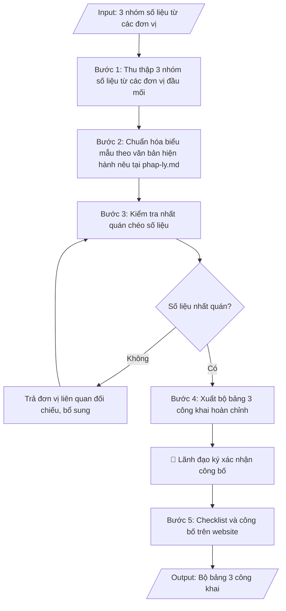

# Tổng hợp số liệu 3 công khai mảng đào tạo

## Định dạng và file đầu ra
Định dạng đầu ra có thể chọn theo sản phẩm/yêu cầu: .xlsx, .csv, .pdf. Đọc mục “Định dạng bổ sung” trong quy cách đầu ra trước khi chọn.

**Phải tạo file thực tế để tải xuống, không chỉ trả nội dung trong chat.** Định dạng mặc định của skill: **.xlsx**. Nếu yêu cầu gồm cả báo cáo thuyết minh, tạo thêm file Word cho báo cáo; không ghép báo cáo dài vào bảng tính. Không chờ người dùng yêu cầu xuất file lần nữa. Ưu tiên định dạng người dùng chỉ định; đọc quy tắc xuất file tại references/quy-cach-dau-ra.md.

## Quy cách đầu ra và thông tin thiếu
Đọc [quy cách và cấu trúc sản phẩm](references/quy-cach-dau-ra.md) trước khi soạn/xuất. File giao chỉ gồm sản phẩm nghiệp vụ được yêu cầu; kiểm tra nội bộ không xuất kèm. Thiếu thông tin thì giữ nguyên trường/mục và chỗ điền theo mẫu gốc (dòng dấu chấm, dấu gạch hoặc ô trống); không tự điền dữ liệu mẫu, số 0, mã chờ xác minh hay dòng chờ ký. Mẫu chuyên ngành còn áp dụng được ưu tiên về cấu trúc, mã biểu và người ký. Bản đầy đủ: [quy tắc chung](references/quy-tac-chung.md).

## Kiểm soát áp dụng và phê duyệt
Trước khi chạy, xác định `ngay_ap_dung`, `loai_hinh_truong`, `quy_che_noi_bo`, `nguon_du_lieu`, `nguoi_kiem_duyet`; chỉ hỏi thông tin liên quan nghiệp vụ, không dùng giá trị giả định thay dữ liệu bắt buộc. Đối chiếu căn cứ pháp lý với văn bản gốc, hiệu lực, điều khoản áp dụng và chuyển tiếp. Bản đầy đủ: [quy tắc chung](references/quy-tac-chung.md).

Nếu có cập nhật pháp lý dưới đây, đọc [căn cứ và điều kiện áp dụng](references/phap-ly.md) trước khi làm. Quy trình dưới đây giữ nghiệp vụ từ bản gốc; mọi viện dẫn văn bản, mẫu biểu, điều khoản phải theo căn cứ đã chọn trong phap-ly.md, không theo văn bản cũ.

## Giới hạn và human gate
AI hỗ trợ chuẩn bị và đối chiếu; cán bộ phụ trách kiểm tra dữ liệu/căn cứ, người có thẩm quyền duyệt và ký. Không đánh dấu đã ký, đã duyệt, đã công bố khi chưa có chứng cứ. Dữ liệu sinh viên, sức khỏe, nhân sự, tài chính chỉ dùng theo mục đích và phân quyền, che thông tin định danh khi dùng ví dụ (Luật 91/2025/QH15, hiệu lực 01/01/2026); không tải dữ liệu lên dịch vụ ngoài khi chưa có quyền. Bản đầy đủ: [quy tắc chung](references/quy-tac-chung.md).

## Khi nào dùng
Khi đến kỳ công khai thông tin theo năm học (định kỳ hằng năm, thường trước 30/9 theo văn bản hiện hành nêu tại phap-ly.md):
tổng hợp 3 nhóm nội dung — (1) công khai chất lượng đào tạo, (2) công khai điều kiện đảm bảo chất lượng,
(3) công khai thu chi tài chính mảng đào tạo — từ số liệu của Phòng Đào tạo, Phòng TC-KT, Phòng TCCB,
Phòng Quản trị – Thiết bị để công bố trên website và báo cáo cơ quan chủ quản.

## Đầu vào (Input)
| Trường | Mô tả | Bắt buộc |
|---|---|---|
| `nam_hoc` | Năm học công khai, vd: 2025–2026 | Có |
| `so_lieu_chat_luong` | Quy mô SV theo ngành/khóa, số tốt nghiệp, tỷ lệ tốt nghiệp, tỷ lệ có việc làm sau 1 năm, tỷ lệ bỏ học/thôi học | Có |
| `so_lieu_dieu_kien` | Đội ngũ giảng viên (số lượng, trình độ, tỷ lệ GV/SV), diện tích sàn, số phòng học, thư viện, trang thiết bị | Có |
| `so_lieu_tai_chinh` | Học phí theo ngành, tổng thu, tổng chi mảng đào tạo, kinh phí NCKH/sinh viên | Có |
| `don_vi_cap_so_lieu` | Danh sách đơn vị cung cấp số liệu (Đào tạo, TC-KT, TCCB, QTTB...) kèm người phụ trách | Không |
| `ngay_cong_khai` | Thời điểm dự kiến công bố trên website | Không (mặc định: trước 30/9 năm liền kề) |

## Quy trình
**Ràng buộc pháp lý khi thực hiện** (trích references/phap-ly.md; đối chiếu toàn văn và hiệu lực tại ngày nghiệp vụ):
- Thông tư 09/2024/TT-BGDĐT, hiệu lực 19/07/2024, thay 36/2017: Chuyển từ mẫu ba công khai cũ sang nội dung công khai và báo cáo thường niên theo 09/2024. Đối chiếu phần thông tin chung, phần giáo dục đại học và phụ lục báo cáo thường niên; lưu nội dung trên website tối thiểu 5 năm. Ghi thời điểm, đường dẫn công bố, người duyệt và bằng chứng cập nhật. Không tự thêm số liệu hoặc tự công bố; không coi báo cáo gửi cơ quan quản lý là nghĩa vụ định kỳ nếu không có căn cứ/yêu cầu bằng văn bản.
- Trước Bước 1: chọn căn cứ theo đối tượng, loại hình trường và chuyển tiếp; lập bảng văn bản / điều khoản / lý do áp dụng / bằng chứng. Thiếu văn bản gốc hoặc điều khoản thì ghi nhận nội bộ [CẦN XÁC MINH] (không đưa vào file giao), để trống phần tương ứng, chưa kết luận tuân thủ.

**Bước 1. Thu thập 3 nhóm số liệu từ các đơn vị đầu mối**
- Làm gì: gửi yêu cầu và thu thập số liệu từ từng đơn vị đầu mối, đúng 3 nhóm:
  - *Nhóm 1 – Chất lượng đào tạo* (từ Phòng Đào tạo): quy mô SV theo ngành và khóa; số lượng, tỷ lệ
    tốt nghiệp theo ngành; tỷ lệ SV thôi học/bỏ học; tỷ lệ SV tốt nghiệp có việc làm sau 12 tháng
    (từ kết quả khảo sát việc làm).
  - *Nhóm 2 – Điều kiện đảm bảo chất lượng* (từ Phòng TCCB, Phòng QTTB): tổng số giảng viên
    (cơ hữu/thỉnh giảng), trình độ (TS, ThS, ĐH), tỷ lệ SV/GV; diện tích sàn học tập; số phòng học,
    phòng thí nghiệm; số đầu sách, diện tích thư viện.
  - *Nhóm 3 – Thu chi tài chính* (từ Phòng TC-KT): mức học phí từng ngành và hình thức thu; tổng
    thu – tổng chi hoạt động đào tạo; kinh phí chi cho NCKH, học bổng tính trên đầu SV.
- Dùng input: `nam_hoc`, `so_lieu_chat_luong`, `so_lieu_dieu_kien`, `so_lieu_tai_chinh`,
  `don_vi_cap_so_lieu`
- Vai trò: Các đơn vị đầu mối (khoa, phòng) cung cấp số liệu · AI hỗ trợ: soạn biểu mẫu thu thập chuẩn hóa · ⏱ ~2–3 ngày (ước tính)
- Lưu ý nghiệp vụ: yêu cầu mỗi đơn vị ghi rõ thời điểm chốt số liệu của mình; kỳ số liệu thống
  nhất toàn trường (tính đến 30/9 hoặc cuối năm học) — lệch kỳ chốt là lỗi phổ biến nhất ở bước này.
- → Kết quả bước: 3 nhóm số liệu thô đã thu thập đủ từ các đơn vị, kèm ghi chú thời điểm chốt
  và đơn vị cung cấp của từng nhóm.

**Bước 2. Chuẩn hóa biểu mẫu theo văn bản hiện hành nêu tại phap-ly.md**
- Làm gì: đưa 3 nhóm số liệu vào đúng biểu mẫu tại Phụ lục văn bản hiện hành nêu tại phap-ly.md: thống nhất
  đơn vị tính (người, %, triệu đồng/tỷ đồng); thống nhất kỳ số liệu; chuẩn hóa tên ngành đúng theo
  danh mục ngành được cấp phép đào tạo.
- Dùng input: `so_lieu_chat_luong`, `so_lieu_dieu_kien`, `so_lieu_tai_chinh`
- Vai trò: Chuyên viên Phòng Đào tạo · AI hỗ trợ: chuẩn hóa biểu mẫu đúng Phụ lục văn bản hiện hành nêu tại phap-ly.md, thống nhất đơn vị tính · ⏱ ~1 giờ (ước tính)
- Lưu ý nghiệp vụ: tên ngành trên bảng công khai phải khớp tuyệt đối với tên trong quyết định mở
  ngành và đề án tuyển sinh đã công bố; đơn vị tiền tệ ghi rõ trong tiêu đề từng bảng.
- → Kết quả bước: bộ bảng 3 công khai đã điền số liệu theo đúng biểu mẫu văn bản hiện hành nêu tại phap-ly.md (bản nháp).

**Bước 3. Kiểm tra nhất quán chéo số liệu**
- Làm gì: kiểm tra các đẳng thức bắt buộc: tổng số SV = tổng các ngành/khóa; tổng số tốt nghiệp =
  tổng các ngành; tổng thu/chi khớp số liệu Phòng TC-KT; đội ngũ GV khớp số liệu Phòng TCCB;
  chỉ tiêu tuyển sinh khớp đề án tuyển sinh đã công bố. Ghi rõ nguồn số liệu và thời điểm chốt
  dưới mỗi bảng.
- Dùng input: `so_lieu_chat_luong`, `so_lieu_dieu_kien`, `so_lieu_tai_chinh`, `don_vi_cap_so_lieu`
- Vai trò: Chuyên viên Phòng Đào tạo · AI hỗ trợ: kiểm tra đẳng thức bắt buộc, cảnh báo chênh lệch · ⏱ ~2 giờ (ước tính)
- Lưu ý nghiệp vụ: mọi chênh lệch đều phải trả về đơn vị liên quan để đối chiếu, bổ sung — không
  tự ý điều chỉnh số liệu cho khớp; lập bảng đối chiếu ghi lại từng điểm đã kiểm tra.
- → Kết quả bước: bảng đối chiếu nhất quán số liệu giữa các đơn vị (từng điểm kiểm tra đạt/không đạt).

**Bước 4. Xuất bộ bảng 3 công khai hoàn chỉnh**
- Làm gì: hoàn thiện bộ bảng sau khi đã nhất quán: tiêu đề chung (tên trường + tên bộ công khai +
  năm học + căn cứ văn bản hiện hành nêu tại phap-ly.md); 3 nhóm nội dung A/B/C với đầy đủ các bảng; ghi chú nguồn số liệu
  và thời điểm chốt; phần ký xác nhận (địa danh, ngày tháng, chức danh, chữ ký).
- Dùng input: `nam_hoc`, `ngay_cong_khai`
- Vai trò: Chuyên viên Phòng Đào tạo · AI hỗ trợ: xuất bộ bảng hoàn chỉnh, kiểm tra thể thức tiêu đề chung · ⏱ ~45 phút (ước tính)
- Lưu ý nghiệp vụ: đủ cả 3 nhóm nội dung bắt buộc mới được công bố; ngày ký xác nhận không được
  sau thời hạn công khai quy định (trong 3 tháng đầu năm học mới, thường trước 30/9).
- → Kết quả bước: bộ bảng 3 công khai hoàn chỉnh, sẵn sàng đăng website và đính kèm
  báo cáo gửi cơ quan chủ quản.

**Bước 5. Checklist và công bố trên website**
- Làm gì: chạy checklist cuối: đủ 3 nhóm nội dung; số liệu nhất quán; có đóng dấu, ký xác nhận;
  còn trong thời hạn công khai; sau đó đăng bộ bảng lên website trường (mục "3 công khai").
- Dùng input: `ngay_cong_khai`
- Vai trò: Chuyên viên Phòng Đào tạo · AI hỗ trợ: chạy checklist cuối (đủ 3 nhóm, số liệu nhất quán, dấu/ký xác nhận) · ⏱ ~30 phút (ước tính)
- Lưu ý nghiệp vụ: kiểm tra lại file đã đăng trên website (định dạng hiển thị đúng, không lỗi font
  bảng biểu); lưu bản đã công bố để đối chiếu khi thanh tra, kiểm tra.
- → Kết quả bước: bộ bảng 3 công khai đã công bố trên website + checklist kiểm tra trước công bố
  đã hoàn tất.

## Luồng quy trình (Workflow)

## Đầu ra
- Bộ bảng 3 công khai hoàn chỉnh (3 nhóm: chất lượng đào tạo; điều kiện đảm bảo chất lượng; thu chi tài chính).
- Bảng đối chiếu nhất quán số liệu giữa các đơn vị.
- Checklist kiểm tra trước khi công bố.

**Cấu trúc output chuẩn:** khung mẫu cố định của bộ bảng 3 công khai mảng đào tạo, các phần theo đúng thứ tự:
1. Tiêu đề chung: tên trường; tên bộ công khai ("CÔNG KHAI THÔNG TIN…"); năm học công khai;
   dòng căn cứ ban hành theo Thông tư 36/2017/TT-BGDĐT.
2. Nhóm A. Công khai chất lượng đào tạo: các bảng theo biểu mẫu (quy mô SV theo ngành/khóa;
   tốt nghiệp theo ngành; kết quả khảo sát việc làm sau 12 tháng; tỷ lệ thôi học).
3. Nhóm B. Công khai điều kiện đảm bảo chất lượng: các bảng theo biểu mẫu (đội ngũ GV cơ hữu
   theo trình độ, tỷ lệ SV/GV; cơ sở vật chất phục vụ đào tạo).
4. Nhóm C. Công khai thu chi tài chính (mảng đào tạo): các bảng theo biểu mẫu (học phí từng
   ngành; thu – chi hoạt động đào tạo; chi học bổng, chi NCKH trên đầu SV).
5. Ghi chú nguồn số liệu và thời điểm chốt số liệu (dưới mỗi bảng hoặc cuối bộ bảng).
6. Phần ký xác nhận: địa danh, ngày tháng năm; chức danh, chữ ký và họ tên người ký.
7. Sản phẩm kèm theo: bảng đối chiếu nhất quán số liệu giữa các đơn vị; checklist kiểm tra
   trước khi công bố.

File nghiệp vụ thực tế theo định dạng mặc định ở đầu skill hoặc định dạng người dùng yêu cầu, kèm liên kết tải trong phản hồi cuối.

Sản phẩm nghiệp vụ hoàn chỉnh theo [quy cách và cấu trúc](references/quy-cach-dau-ra.md), giữ các trường chưa có dữ liệu ở trạng thái trống. Không xuất kèm checklist/phụ lục kiểm tra đầu ra.

## Kiểm tra nội bộ trước khi giao
Các tiêu chí sau dùng để tự đối chiếu; không sao chép vào file xuất. Mục thiếu dữ liệu được để trống, không đánh dấu đã đạt hoặc đã duyệt.

- [ ] Đủ các phần theo "Cấu trúc output chuẩn": tiêu đề chung + căn cứ văn bản hiện hành nêu tại phap-ly.md; Nhóm A (chất lượng đào tạo); Nhóm B (điều kiện đảm bảo chất lượng); Nhóm C (thu chi tài chính mảng đào tạo); ghi chú nguồn và thời điểm chốt số liệu; phần ký xác nhận; bảng đối chiếu nhất quán; checklist trước công bố.
- [ ] Số liệu/nội dung trong output khớp với Input đã cho (năm học, 3 nhóm số liệu từ các đơn vị).
- [ ] Không bịa đặt số liệu, minh chứng, trích dẫn.
- [ ] Đúng biểu mẫu tại Phụ lục văn bản hiện hành nêu tại phap-ly.md; đơn vị tính thống nhất, đơn vị tiền tệ ghi rõ.
- [ ] Căn cứ pháp lý đầy đủ, còn hiệu lực (văn bản hiện hành nêu tại phap-ly.md).
- [ ] Đã qua Human gate: lãnh đạo đã ký xác nhận công bố (ngày ký không sau thời hạn công khai quy định).
- [ ] Tên ngành trên bảng công khai khớp tuyệt đối với quyết định mở ngành và đề án tuyển sinh đã công bố.
- [ ] Các đẳng thức bắt buộc đúng: tổng SV = tổng các ngành/khóa; tổng tốt nghiệp = tổng các ngành; tổng thu/chi khớp số liệu Phòng TC-KT; đội ngũ GV khớp số liệu Phòng TCCB.
- [ ] Công bố trong thời hạn quy định (3 tháng đầu năm học mới, thường trước 30/9); file trên website hiển thị đúng, không lỗi font; đã lưu bản công bố để đối chiếu khi thanh tra.

## Căn cứ & lưu ý
- Căn cứ hiện hành: xem [căn cứ và điều kiện áp dụng](references/phap-ly.md); phải đối chiếu văn bản gốc, hiệu lực và chuyển tiếp tại ngày nghiệp vụ.
- Công khai 3 nhóm nội dung bắt buộc: chất lượng đào tạo; điều kiện đảm bảo chất lượng;
  thu chi tài chính. Công bố trên website trong 3 tháng đầu năm học mới.
- Không dùng tên thật của trường/cá nhân khi mô phỏng.

## Tư liệu đối chiếu
Bản gốc trước cập nhật pháp lý (kèm ví dụ giả lập) lưu tại `references/quy-trinh-lich-su.md`, chỉ để đối chiếu hồ sơ lịch sử; không dùng căn cứ, mẫu hay số liệu trong đó làm chỉ dẫn hiện hành.

## Quản trị phiên bản
- Phiên bản gói `1.3.2` (cập nhật 2026-10-10); hồ sơ đầy đủ tại [references/version.json](references/version.json).
- Người phê duyệt nghiệp vụ: **chưa chỉ định**. Trạng thái: dự thảo nghiệp vụ; kiểm tra pháp lý trước thực thi. Ngày cập nhật không đồng nghĩa mọi văn bản đã được rà soát toàn văn.
- Giấy phép theo LICENSE của kho (bản quyền CES Global). Lịch sử thay đổi: CHANGELOG.md.
