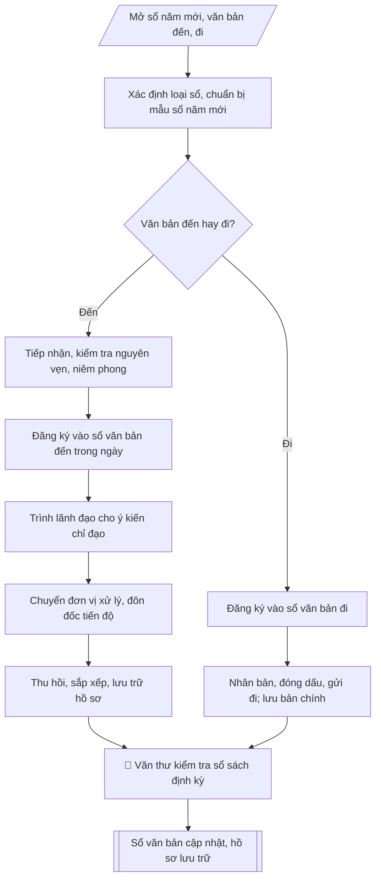

# Quản lý sổ văn bản đi / đến

## Định dạng và file đầu ra

Định dạng đầu ra có thể chọn theo sản phẩm/yêu cầu: .xlsx, .csv, .pdf. Đọc mục “Định dạng bổ sung” trong quy cách đầu ra trước khi chọn.

**Phải tạo file thực tế để tải xuống, không chỉ trả nội dung trong chat.** Định dạng mặc định của skill: **.xlsx**. Nếu yêu cầu gồm cả báo cáo thuyết minh, tạo thêm file Word cho báo cáo; không ghép báo cáo dài vào bảng tính. Không chờ người dùng yêu cầu xuất file lần nữa. Ưu tiên định dạng người dùng chỉ định; đọc quy tắc xuất file tại references/quy-cach-dau-ra.md.

## Quy cách đầu ra và thông tin thiếu
Đọc [quy cách và cấu trúc sản phẩm](references/quy-cach-dau-ra.md) trước khi soạn/xuất. File giao chỉ gồm sản phẩm nghiệp vụ được yêu cầu; kiểm tra nội bộ không xuất kèm. Thiếu thông tin thì giữ nguyên trường/mục và chỗ điền theo mẫu gốc (dòng dấu chấm, dấu gạch hoặc ô trống); không tự điền dữ liệu mẫu, số 0, mã chờ xác minh hay dòng chờ ký. Mẫu chuyên ngành còn áp dụng được ưu tiên về cấu trúc, mã biểu và người ký. Bản đầy đủ: [quy tắc chung](references/quy-tac-chung.md).

## Kiểm soát áp dụng và phê duyệt
Trước khi chạy, xác định `ngay_ap_dung`, `loai_hinh_truong`, `quy_che_noi_bo`, `nguon_du_lieu`, `nguoi_kiem_duyet`; chỉ hỏi thông tin liên quan nghiệp vụ, không dùng giá trị giả định thay dữ liệu bắt buộc. Đối chiếu căn cứ pháp lý với văn bản gốc, hiệu lực, điều khoản áp dụng và chuyển tiếp. Bản đầy đủ: [quy tắc chung](references/quy-tac-chung.md).

## Giới hạn và human gate
AI hỗ trợ chuẩn bị và đối chiếu; cán bộ phụ trách kiểm tra dữ liệu/căn cứ, người có thẩm quyền duyệt và ký. Không đánh dấu đã ký, đã duyệt, đã công bố khi chưa có chứng cứ. Dữ liệu sinh viên, sức khỏe, nhân sự, tài chính chỉ dùng theo mục đích và phân quyền, che thông tin định danh khi dùng ví dụ (Luật 91/2025/QH15, hiệu lực 01/01/2026); không tải dữ liệu lên dịch vụ ngoài khi chưa có quyền. Bản đầy đủ: [quy tắc chung](references/quy-tac-chung.md).

## Khi nào dùng
Khi lập sổ theo dõi văn bản đi, văn bản đến của trường / đơn vị; khi xây dựng hoặc
chuẩn hóa quy trình xử lý văn bản đến.

## Đầu vào (Input)

| Trường | Mô tả | Bắt buộc |
|---|---|---|
| `loai_so` | Sổ văn bản đi / Sổ văn bản đến | Có |
| `don_vi` | Đơn vị quản lý sổ (Văn phòng trường / phòng ban) | Có |
| `nam` | Năm mở sổ | Có |

## Quy trình

**Bước 1. Xác định loại sổ, chuẩn bị mẫu sổ năm mới**
- Làm gì: căn cứ `loai_so` để chọn đúng mẫu sổ (văn bản đến hay văn bản đi); kiểm tra đầy đủ các cột bắt buộc của mẫu; mở sổ cho `nam` (sổ giấy: đánh số trang, đóng dấu giáp lai; sổ điện tử: tạo file, phân quyền truy cập, đặt lịch sao lưu định kỳ); ghi tên `don_vi` quản lý sổ lên bìa/trang đầu.
- Dùng input: `loai_so`, `don_vi`, `nam`.
- Vai trò: Chuyên viên Phòng HCTH · AI hỗ trợ: phân tích input, xác định yêu cầu · ⏱ ~20–45 phút (ước tính)
- Lưu ý nghiệp vụ: sổ phải mở từ đầu năm, không bỏ trống số thứ tự; sổ điện tử phải sao lưu định kỳ, tránh mất dữ liệu; mỗi đơn vị chỉ dùng một sổ đi và một sổ đến cho một năm.
- → Kết quả bước: mẫu sổ năm mới đầy đủ cột bắt buộc, sẵn sàng ghi chép.

### Nhánh A — Xử lý văn bản đến

**Bước 2. Tiếp nhận văn bản đến**
- Làm gì: nhận văn bản từ các kênh (trực tiếp, bưu điện, email công vụ); kiểm tra số lượng trang, tính nguyên vẹn, dấu niêm phong (nếu là văn bản mật); đối chiếu thông tin bì thư với văn bản bên trong; từ chối ký nhận và yêu cầu bổ sung nếu văn bản rách, thiếu trang, sai địa chỉ nhận.
- Dùng input: `don_vi` (đầu mối tiếp nhận), `loai_so` (xác định là văn bản đến).
- Vai trò: Văn thư/Chuyên viên Phòng HCTH · AI hỗ trợ: ghi nhận, phân loại ban đầu · ⏱ ~15 phút (ước tính)
- Lưu ý nghiệp vụ: văn bản mật chỉ người có thẩm quyền được mở; ghi lại thời điểm nhận chính xác (làm căn cứ tính hạn xử lý); không tự ý mở văn bản ghi "chỉ người có tên được mở".
- → Kết quả bước: văn bản đến đã kiểm tra nguyên vẹn, ghi nhận thời điểm tiếp nhận.

**Bước 3. Đăng ký vào sổ văn bản đến**
- Làm gì: ghi ngay trong ngày làm việc vào sổ: số thứ tự đến (liên tục từ đầu năm), số/ký hiệu văn bản, ngày tháng văn bản, cơ quan ban hành, trích yếu nội dung, ngày đến, đơn vị/người nhận xử lý, hạn xử lý.
- Dùng input: `loai_so` (mẫu sổ văn bản đến).
- Vai trò: Văn thư Phòng HCTH · AI hỗ trợ: ghi sổ theo dõi, đánh số thứ tự · ⏱ ~15 phút (ước tính)
- Lưu ý nghiệp vụ: đăng ký trong ngày làm việc — bẫy thường gặp là dồn cuối tuần mới ghi, gây sai lệch số thứ tự và hạn xử lý; trích yếu phải ngắn gọn, nêu đúng việc cần xử lý; văn bản khẩn ghi chú "KHẨN" và xử lý ngay.
- → Kết quả bước: dòng đăng ký văn bản đến đầy đủ các cột trong sổ.

**Bước 4. Trình lãnh đạo cho ý kiến chỉ đạo**
- Làm gì: chuyển văn bản (kèm phiếu trình nếu cần) tới lãnh đạo có thẩm quyền; ghi ý kiến chỉ đạo của lãnh đạo (giao đơn vị nào chủ trì/phối hợp, hạn hoàn thành) vào cột ghi chú của sổ.
- Dùng input: `don_vi` (đầu mối trình).
- Vai trò: Chuyên viên Phòng HCTH trình xin ý kiến, Lãnh đạo cho ý kiến chỉ đạo · AI hỗ trợ: tổng hợp nội dung, dự thảo phương án trình · ⏱ ~15–30 phút (ước tính)
- Lưu ý nghiệp vụ: xác định đúng lãnh đạo phụ trách lĩnh vực để trình, tránh trình lòng vòng; nếu lãnh đạo đi vắng, trình người được ủy quyền và ghi rõ.
- → Kết quả bước: ý kiến chỉ đạo của lãnh đạo đã ghi vào sổ.

**Bước 5. Chuyển xử lý, đôn đốc tiến độ**
- Làm gì: chuyển bản chính/bản sao cho đơn vị được giao xử lý (có ký nhận); cập nhật bảng theo dõi tiến độ (đơn vị xử lý – tình trạng – quá hạn?); định kỳ đôn đốc các văn bản sắp đến hạn và nhắc đơn vị chậm trễ.
- Dùng input: `loai_so` (mẫu sổ văn bản đến, bảng theo dõi).
- Vai trò: Chuyên viên Phòng HCTH · AI hỗ trợ: xử lý sơ bộ theo quy trình · ⏱ ~20–30 phút (ước tính)
- Lưu ý nghiệp vụ: văn bản có hạn xử lý phải được theo dõi riêng, nhắc trước hạn 02–03 ngày; đơn vị quá hạn phải có văn bản giải trình; cập nhật tình trạng ngay khi đơn vị báo hoàn thành.
- → Kết quả bước: bảng theo dõi tiến độ xử lý được cập nhật.

**Bước 6. Thu hồi, lưu trữ hồ sơ văn bản đến**
- Làm gì: thu hồi văn bản đã xử lý xong kèm tài liệu xử lý (phúc đáp, báo cáo); sắp xếp hồ sơ theo số thứ tự đến hoặc theo số/ký hiệu văn bản; lưu trữ theo thời hạn quy định của trường; ghi chú kết quả xử lý vào sổ.
- Dùng input: `loai_so` (mẫu sổ văn bản đến).
- Vai trò: Văn thư Phòng HCTH · AI hỗ trợ: sắp xếp, đánh chỉ mục hồ sơ · ⏱ ~20 phút (ước tính)
- Lưu ý nghiệp vụ: không lưu lẫn văn bản chưa xử lý xong với hồ sơ đã hoàn thành; hồ sơ mật lưu riêng theo quy định bảo mật.
- → Kết quả bước: hồ sơ văn bản đến đã sắp xếp, lưu trữ đúng quy định.

### Nhánh B — Phát hành văn bản đi

**Bước 7. Đăng ký, phát hành văn bản đi**
- Làm gì: nhận văn bản đã trình ký hoàn tất; đăng ký vào sổ văn bản đi: số thứ tự đi (liên tục), số/ký hiệu, ngày ban hành, trích yếu, nơi nhận, người ký; nhân bản theo số lượng nơi nhận, đóng dấu, gửi đi (trực tiếp/bưu điện/email); lưu bản chính tại văn thư.
- Dùng input: `loai_so` (mẫu sổ văn bản đi), `don_vi`.
- Vai trò: Văn thư Phòng HCTH · AI hỗ trợ: định dạng bản chính, cập nhật sổ phát hành · ⏱ ~30 phút (ước tính)
- Lưu ý nghiệp vụ: số thứ tự đi không được trùng, không bỏ số; kiểm tra nơi nhận đầy đủ trước khi nhân bản — bẫy là gửi thiếu nơi nhận ghi trong văn bản; bản lưu văn thư phải có đủ chữ ký và dấu.
- → Kết quả bước: văn bản đi đã phát hành + bản chính lưu tại văn thư.

**Bước 8. Kiểm tra định kỳ sổ sách**
- Làm gì: văn thư kiểm tra sổ sách định kỳ (số thứ tự liên tục, cột ghi đầy đủ, không tẩy xóa); đối chiếu số liệu sổ đi/đến với thực tế hồ sơ lưu; lập bảng tổng hợp số lượng văn bản đi/đến theo tháng/quý phục vụ báo cáo.
- Dùng input: `loai_so`, `don_vi`, `nam`.
- Vai trò: Chuyên viên Phòng HCTH (Trưởng phòng kiểm tra lại) · AI hỗ trợ: quét lỗi theo checklist · ⏱ ~15–30 phút (ước tính)
- Lưu ý nghiệp vụ: phát hiện số thứ tự bị nhảy/bỏ thì lập biên bản xác nhận ngay, không tự ý sửa; số liệu tổng hợp phải khớp 100% với sổ trước khi đưa vào báo cáo.
- → Kết quả bước: sổ văn bản được kiểm tra, bảng tổng hợp số liệu định kỳ.

## Luồng quy trình (Workflow)

## Đầu ra

File nghiệp vụ thực tế theo định dạng mặc định ở đầu skill hoặc định dạng người dùng yêu cầu, kèm liên kết tải trong phản hồi cuối.

Sản phẩm nghiệp vụ hoàn chỉnh theo [quy cách và cấu trúc](references/quy-cach-dau-ra.md), giữ các trường chưa có dữ liệu ở trạng thái trống. Không xuất kèm checklist/phụ lục kiểm tra đầu ra.

## Kiểm tra nội bộ trước khi giao

Các tiêu chí sau dùng để tự đối chiếu; không sao chép vào file xuất. Mục thiếu dữ liệu được để trống, không đánh dấu đã đạt hoặc đã duyệt.

- [ ] Bố cục khớp mẫu áp dụng và cấu trúc tại references/quy-cach-dau-ra.md.
- [ ] Nội dung và số liệu trong output khớp đúng với Input đã cho (không thêm, bớt hay suy diễn)
- [ ] Không bịa đặt số liệu, minh chứng, trích dẫn hay căn cứ
- [ ] Đúng thể thức và định dạng theo Nghị định 30/2020/NĐ-CP về công tác văn thư.
- [ ] Căn cứ pháp lý được trích dẫn đầy đủ và còn hiệu lực
- [ ] Không coi bản soạn là đã ký/đã duyệt; việc phê duyệt thuộc người có thẩm quyền trước phát hành
- [ ] Sổ phải mở từ đầu năm, không bỏ trống số thứ tự
- [ ] Sổ điện tử phải sao lưu định kỳ, tránh mất dữ liệu
- [ ] Trích yếu phải ngắn gọn, nêu đúng việc cần xử lý

## Căn cứ & lưu ý
- Nghị định 30/2020/NĐ-CP về công tác văn thư.
- Văn bản đến phải được đăng ký trong ngày làm việc; văn bản khẩn xử lý ngay.
- Không dùng tên thật của trường/cá nhân khi mô phỏng.

## Quản trị phiên bản
- Phiên bản gói `1.3.2` (cập nhật 2026-10-10); hồ sơ đầy đủ tại [references/version.json](references/version.json).
- Người phê duyệt nghiệp vụ: **chưa chỉ định**. Trạng thái: dự thảo nghiệp vụ; kiểm tra pháp lý trước thực thi. Ngày cập nhật không đồng nghĩa mọi văn bản đã được rà soát toàn văn.
- Giấy phép theo LICENSE của kho (bản quyền CES Global). Lịch sử thay đổi: CHANGELOG.md.
