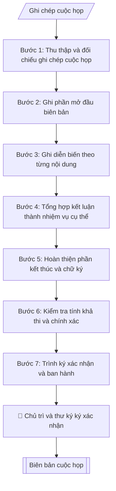

# Soạn biên bản cuộc họp

## Kiểm soát áp dụng và phê duyệt

Trước khi chạy quy trình, xác định `ngay_ap_dung`, `loai_hinh_truong`, `quy_che_noi_bo`, `nguon_du_lieu` và `nguoi_kiem_duyet`. Chỉ yêu cầu thông tin có liên quan đến nghiệp vụ; không dùng giá trị giả định thay dữ liệu bắt buộc. Hồ sơ có yếu tố pháp lý phải kèm văn bản gốc, tình trạng hiệu lực, điều khoản áp dụng và chuyển tiếp.

## Giới hạn và human gate

AI hỗ trợ chuẩn bị và đối chiếu. Cán bộ phụ trách kiểm tra dữ liệu/căn cứ, người có thẩm quyền duyệt và ký. Mọi đầu ra mặc định là **DỰ THẢO – CHỜ KIỂM DUYỆT**; không đánh dấu đã ký, đã duyệt hoặc đã công bố nếu chưa có chứng cứ. Dữ liệu sinh viên, sức khỏe, nhân sự và tài chính phải hạn chế theo mục đích, phân quyền và che thông tin định danh khi dùng ví dụ. Không tải dữ liệu lên dịch vụ ngoài khi chưa có quyền. Kiểm tra Luật 91/2025/QH15 về bảo vệ dữ liệu cá nhân (hiệu lực 01/01/2026) và quy định áp dụng trước xử lý/chia sẻ dữ liệu cá nhân.


## Khi nào dùng
Sau mỗi cuộc họp, hội nghị, phiên họp hội đồng cần lập biên bản ghi nhận diễn biến và kết luận
làm căn cứ triển khai.

## Đầu vào (Input)

| Trường | Mô tả | Bắt buộc |
|---|---|---|
| `ten_cuoc_hop` | Tên cuộc họp | Có |
| `thoi_gian` | Ngày, giờ bắt đầu – kết thúc | Có |
| `dia_diem` | Địa điểm họp | Có |
| `chu_tri` | Người chủ trì | Có |
| `thu_ky` | Thư ký ghi biên bản | Có |
| `thanh_phan` | Thành phần tham dự (và vắng mặt có lý do) | Có |
| `noi_dung` | Nội dung họp: từng vấn đề, ý kiến phát biểu chính | Có |
| `ket_luan` | Kết luận / phân công nhiệm vụ của chủ trì | Có |

## Quy trình

**Bước 1. Thu thập và đối chiếu ghi chép cuộc họp**
- Làm gì: Thu thập ghi chép/bản ghi âm cuộc họp; đối chiếu thông tin hành chính: `ten_cuoc_hop`, `thoi_gian` (giờ bắt đầu – kết thúc), `dia_diem`, `chu_tri`, `thu_ky`, `thanh_phan` (người dự, người vắng mặt và lý do); kiểm tra tên, chức danh người dự có chính xác không (đối chiếu danh sách triệu tập).
- Dùng input: `ten_cuoc_hop`, `thoi_gian`, `dia_diem`, `chu_tri`, `thu_ky`, `thanh_phan`.
- Vai trò: Chuyên viên Phòng HCTH (Trưởng phòng kiểm tra lại) · AI hỗ trợ: đối chiếu chéo tự động · ⏱ ~15–30 phút (ước tính)
- Lưu ý nghiệp vụ: Tên người và chức danh sai là lỗi nghiêm trọng trong biên bản — kiểm tra kỹ từng tên; người vắng mặt phải ghi rõ lý do (vắng có phép/vắng không phép/đi công tác).
- → Kết quả bước: Khung thông tin hành chính cuộc họp đã kiểm chuẩn.

**Bước 2. Ghi phần mở đầu biên bản**
- Làm gì: Viết phần đầu: tên trường + quốc hiệu – tiêu ngữ, dòng "BIÊN BẢN" + tên cuộc họp (in hoa, căn giữa), các dòng Thời gian / Địa điểm / Chủ trì / Thư ký / Thành phần (ghi số lượng người dự, liệt kê người vắng mặt kèm lý do).
- Dùng input: `ten_cuoc_hop`, `thoi_gian`, `dia_diem`, `chu_tri`, `thu_ky`, `thanh_phan`.
- Vai trò: Chuyên viên Phòng HCTH · AI hỗ trợ: xử lý sơ bộ theo quy trình · ⏱ ~20–45 phút (ước tính)
- Lưu ý nghiệp vụ: Giờ họp ghi đầy đủ "08h00 – 10h00, ngày 12 tháng 10 năm 2026"; chủ trì và thư ký ghi đủ học hàm/học vị + họ tên + chức danh.
- → Kết quả bước: Phần mở đầu biên bản hoàn chỉnh.

**Bước 3. Ghi diễn biến theo từng nội dung**
- Làm gì: Với từng vấn đề trong `noi_dung`, ghi thành mục đánh số 1., 2., 3...; mỗi mục ghi: nội dung vấn đề được trình bày + ý kiến phát biểu chính (ghi tên người phát biểu + ý chính, không ghi nguyên văn dài dòng trừ phát biểu cần lưu chính xác); giữ giọng văn khách quan, trung thực, không bình luận.
- Dùng input: `noi_dung`.
- Vai trò: Chuyên viên Phòng HCTH · AI hỗ trợ: xử lý sơ bộ theo quy trình · ⏱ ~20–45 phút (ước tính)
- Lưu ý nghiệp vụ: Chỉ ghi ý kiến có giá trị (đề xuất, phản biện, số liệu) — bỏ qua phát biểu mang tính xã giao; ý kiến trái chiều phải ghi đầy đủ cả hai phía, không thiên lệch; không tự ý "làm đẹp" lời phát biểu.
- → Kết quả bước: Dự thảo phần diễn biến theo từng nội dung.

**Bước 4. Tổng hợp kết luận thành nhiệm vụ cụ thể**
- Làm gì: Từ `ket_luan`, chuyển từng kết luận/phân công của chủ trì thành mục đánh số, mỗi mục ghi rõ 3 yếu tố: việc gì – đơn vị/cá nhân thực hiện (đầu mối) – thời hạn hoàn thành; kiểm tra mỗi nhiệm vụ có đầu mối rõ ràng và deadline cụ thể (ngày/tháng/năm), không để nhiệm vụ "treo" (không ai làm, không hạn).
- Dùng input: `ket_luan`.
- Vai trò: Chuyên viên Phòng HCTH · AI hỗ trợ: tổng hợp và chuẩn hóa dữ liệu · ⏱ ~20–45 phút (ước tính)
- Lưu ý nghiệp vụ: Bẫy thường gặp — kết luận ghi "các đơn vị triển khai" mà không chỉ rõ đơn vị nào; deadline ghi "sớm" hoặc "trong thời gian tới". Mọi nhiệm vụ phải có đầu mối + mốc thời gian đo được.
- → Kết quả bước: Dự thảo phần kết luận với nhiệm vụ đã gắn đầu mối và thời hạn.

**Bước 5. Hoàn thiện phần kết thúc và chữ ký**
- Làm gì: Ghi dòng thời gian kết thúc cuộc họp ("Cuộc họp kết thúc lúc ... cùng ngày./."); bố trí khối chữ ký: bên trái "THƯ KÝ", bên phải "CHỦ TRÌ", họ tên người ký bên dưới (ghi "[CHỜ KÝ]" ở bản trình ký).
- Dùng input: `thoi_gian`, `chu_tri`, `thu_ky`.
- Vai trò: Chuyên viên Phòng HCTH (Trưởng phòng kiểm tra lại) · AI hỗ trợ: áp dụng góp ý, hoàn thiện bản thảo · ⏱ ~15–30 phút (ước tính)
- Lưu ý nghiệp vụ: Giờ kết thúc phải khớp thực tế (không sớm hơn giờ bắt đầu đã ghi); biên bản hợp lệ cần chữ ký của cả chủ trì và thư ký.
- → Kết quả bước: Phần kết thúc + khối chữ ký hoàn chỉnh.

**Bước 6. Kiểm tra tính khả thi và chính xác**
- Làm gì: Kiểm tra từng nhiệm vụ trong kết luận: có khả thi không (đầu mối có năng lực/thẩm quyền thực hiện, deadline có thực tế không); đối chiếu tên người, chức danh, số liệu với ghi chép gốc; đọc soát chính tả toàn văn.
- Dùng input: toàn bộ input (đối chiếu chéo).
- Vai trò: Chuyên viên Phòng HCTH (Trưởng phòng kiểm tra lại) · AI hỗ trợ: quét lỗi theo checklist · ⏱ ~15–30 phút (ước tính)
- Lưu ý nghiệp vụ: Nhiệm vụ giao cho đơn vị không dự họp phải được xác nhận lại với đơn vị đó trước khi ban hành biên bản; deadline đã qua so với ngày lập biên bản là lỗi phải sửa ngay.
- → Kết quả bước: Báo cáo kiểm tra + danh sách chỗ cần sửa (nếu có), trả về bước tương ứng để chỉnh.

**Bước 7. Trình ký xác nhận và ban hành**
- Làm gì: Ghép toàn bộ thành biên bản hoàn chỉnh ở định dạng markdown; chuyển cho thư ký và chủ trì ký xác nhận (human gate); sau khi ký, gửi biên bản cho các thành phần dự họp và đơn vị được phân công nhiệm vụ.
- Dùng input: toàn bộ.
- Vai trò: Chuyên viên Phòng HCTH chuẩn bị, Hiệu trưởng phê duyệt · AI hỗ trợ: tổng hợp hồ sơ, soạn phiếu trình/tờ trình đầy đủ · ⏱ ~15–30 phút chuẩn bị + chờ duyệt (ước tính)
- Lưu ý nghiệp vụ: Không sửa nội dung diễn biến/kết luận sau khi chủ trì đã ký mà không có ý kiến đồng ý bằng văn bản.
- → Kết quả bước: Biên bản cuộc họp đã ký xác nhận, gửi đến các bên liên quan.

## Luồng quy trình (Workflow)



## Đầu ra (Output)
- Biên bản cuộc họp hoàn chỉnh (markdown).

**Cấu trúc output chuẩn:** khung mẫu cố định của biên bản cuộc họp — các phần bắt buộc theo đúng thứ tự xuất hiện:
1. Tên trường + Quốc hiệu "CỘNG HÒA XÃ HỘI CHỦ NGHĨA VIỆT NAM" + Tiêu ngữ "Độc lập – Tự do – Hạnh phúc"
2. Tên loại "BIÊN BẢN" (in hoa, căn giữa) + tên cuộc họp
3. Phần mở đầu: Thời gian (giờ bắt đầu – kết thúc, ngày tháng năm) / Địa điểm / Chủ trì / Thư ký / Thành phần (số lượng, người vắng mặt kèm lý do)
4. Phần nội dung (diễn biến): đánh số theo từng vấn đề; ý kiến phát biểu ghi tên người phát biểu + ý chính
5. Phần kết luận: đánh số từng nhiệm vụ, mỗi nhiệm vụ ghi rõ việc gì – đơn vị/cá nhân thực hiện – thời hạn hoàn thành
6. Dòng thời gian kết thúc cuộc họp, kết bằng "./."
7. Khối chữ ký: "THƯ KÝ" (trái) và "CHỦ TRÌ" (phải) + họ tên người ký

## Checklist nghiệm thu

Tiêu chí đạt: tất cả các ô dưới đây được đánh dấu.

- [ ] Đủ các phần theo Cấu trúc output chuẩn: Tên trường + Quốc hiệu "CỘNG HÒA XÃ HỘI CHỦ NGHĨA VIỆT NAM" + Tiêu…; Tên loại "BIÊN BẢN" (in hoa, căn giữa) + tên cuộc họp; Phần mở đầu: Thời gian; Phần nội dung (diễn biến): đánh số theo từng vấn đề; ý kiến phát bi…; … (đủ 7 phần)
- [ ] Nội dung và số liệu trong output khớp đúng với Input đã cho (không thêm, bớt hay suy diễn)
- [ ] Không bịa đặt số liệu, minh chứng, trích dẫn hay căn cứ
- [ ] Đúng thể thức và định dạng theo Biên bản phải khách quan, trung thực
- [ ] Căn cứ pháp lý được trích dẫn đầy đủ và còn hiệu lực
- [ ] Đã qua Human gate: người có thẩm quyền đã kiểm tra/duyệt trước khi phát hành
- [ ] Tên người và chức danh sai là lỗi nghiêm trọng trong biên bản — kiểm tra kỹ từng tên
- [ ] Người vắng mặt phải ghi rõ lý do (vắng có phép/vắng không phép/đi công tác)
- [ ] Giờ họp ghi đầy đủ "08h00 – 10h00, ngày 12 tháng 10 năm 2026"

## Ví dụ mô phỏng (dữ liệu giả lập)

> Tất cả tên trường, cá nhân, số liệu dưới đây đều là **giả lập**.

### Input mẫu

| Trường | Giá trị |
|---|---|
| `ten_cuoc_hop` | Giao ban Ban Giám hiệu |
| `thoi_gian` | 08h00 – 10h00, ngày 12/10/2026 |
| `dia_diem` | Phòng họp A101, Trường Đại học A |
| `chu_tri` | PGS.TS. Trần Văn B – Phó Hiệu trưởng |
| `thu_ky` | ThS. Vũ Văn B – Phòng HCTH |
| `thanh_phan` | Trưởng 08 phòng/ban; vắng: Trưởng phòng TCKT (công tác) |
| `noi_dung` | 1. Phòng Đào tạo báo cáo tiến độ tuyển sinh đợt 2 (đạt 85% chỉ tiêu). 2. Phòng KHCN đề xuất tổ chức hội thảo sinh viên tháng 12/2026. 3. Phòng QTTB báo cáo sửa chữa giảng đường B. |
| `ket_luan` | 1. Phòng Đào tạo hoàn thành tuyển sinh đợt 2 trước 25/10/2026. 2. Đồng ý chủ trương hội thảo, Phòng KHCN trình kế hoạch chi tiết trước 20/10/2026. 3. Phòng QTTB hoàn thành sửa chữa giảng đường B trước 30/10/2026. |

### Output mẫu

```
TRƯỜNG ĐẠI HỌC A            CỘNG HÒA XÃ HỘI CHỦ NGHĨA VIỆT NAM
                                                 Độc lập – Tự do – Hạnh phúc

                          BIÊN BẢN
                   Giao ban Ban Giám hiệu

Thời gian: 08h00 – 10h00, ngày 12 tháng 10 năm 2026
Địa điểm: Phòng họp A101, Trường Đại học A
Chủ trì: PGS.TS. Trần Văn B – Phó Hiệu trưởng
Thư ký: ThS. Vũ Văn B – Phòng Hành chính – Tổng hợp
Thành phần: Trưởng 08 phòng/ban. Vắng mặt: Trưởng phòng Tài chính – Kế toán (đi công tác).

NỘI DUNG

1. Phòng Đào tạo báo cáo tiến độ tuyển sinh đợt 2: đến nay đạt 85% chỉ tiêu được giao.

2. Phòng Khoa học công nghệ đề xuất tổ chức Hội thảo khoa học sinh viên vào tháng 12/2026.

3. Phòng Quản trị – Thiết bị báo cáo tiến độ sửa chữa giảng đường B.

KẾT LUẬN

1. Phòng Đào tạo hoàn thành công tác tuyển sinh đợt 2 trước ngày 25/10/2026.

2. Ban Giám hiệu đồng ý về chủ trương tổ chức Hội thảo; Phòng KHCN trình kế hoạch
chi tiết trước ngày 20/10/2026.

3. Phòng Quản trị – Thiết bị hoàn thành sửa chữa giảng đường B trước ngày 30/10/2026.

Cuộc họp kết thúc lúc 10h00 cùng ngày./.

        THƯ KÝ                                     CHỦ TRÌ
        [CHỜ KÝ]                                     [CHỜ KÝ]

   ThS. Vũ Văn B                        PGS.TS. Trần Văn B
```

## Căn cứ & lưu ý
- Biên bản phải khách quan, trung thực; kết luận ghi rõ đầu mối và thời hạn.
- Không dùng tên thật của trường/cá nhân khi mô phỏng.

## Quản trị phiên bản

- Phiên bản gói: `1.1.0`; ngày cập nhật: `2026-10-09`.
- Kho nguồn: https://github.com/phamtruong91/dh-skills
- Người duy trì trên GitHub: `phamtruong91` (Phạm Văn Trường). Người phê duyệt nghiệp vụ: **chưa chỉ định**.
- Commit nguồn trước cập nhật: `78fd1d51b8acd1a724d9b9af6c488460bc7551ad`. Commit chứa phiên bản này xem bằng `git log -1 -- skills/soan-bien-ban-hop`; không tự gán SHA chưa tạo.
- Giấy phép: theo LICENSE của kho; bản quyền CES Global.
- Lịch sử 1.1.0: bổ sung metadata giao diện, kiểm soát áp dụng, quản trị phiên bản.
- Trạng thái: dự thảo nghiệp vụ; kiểm tra pháp lý trước thực thi. Ngày cập nhật không đồng nghĩa mọi văn bản đã được rà soát toàn văn.
