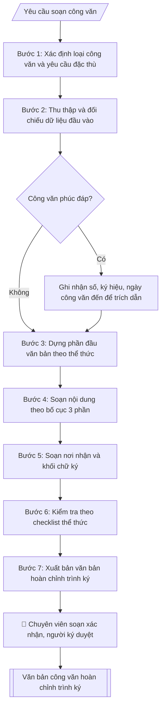

# Soạn công văn đi

## Kiểm soát áp dụng và phê duyệt

Trước khi chạy quy trình, xác định `ngay_ap_dung`, `loai_hinh_truong`, `quy_che_noi_bo`, `nguon_du_lieu` và `nguoi_kiem_duyet`. Chỉ yêu cầu thông tin có liên quan đến nghiệp vụ; không dùng giá trị giả định thay dữ liệu bắt buộc. Hồ sơ có yếu tố pháp lý phải kèm văn bản gốc, tình trạng hiệu lực, điều khoản áp dụng và chuyển tiếp.

## Giới hạn và human gate

AI hỗ trợ chuẩn bị và đối chiếu. Cán bộ phụ trách kiểm tra dữ liệu/căn cứ, người có thẩm quyền duyệt và ký. Mọi đầu ra mặc định là **DỰ THẢO – CHỜ KIỂM DUYỆT**; không đánh dấu đã ký, đã duyệt hoặc đã công bố nếu chưa có chứng cứ. Dữ liệu sinh viên, sức khỏe, nhân sự và tài chính phải hạn chế theo mục đích, phân quyền và che thông tin định danh khi dùng ví dụ. Không tải dữ liệu lên dịch vụ ngoài khi chưa có quyền. Kiểm tra Luật 91/2025/QH15 về bảo vệ dữ liệu cá nhân (hiệu lực 01/01/2026) và quy định áp dụng trước xử lý/chia sẻ dữ liệu cá nhân.


## Khi nào dùng
Khi cần ban hành văn bản hành chính để trao đổi công việc: phúc đáp công văn đến, đề nghị phối hợp,
thông báo, giải trình, báo cáo đột xuất.

## Đầu vào (Input)

| Trường | Mô tả | Bắt buộc |
|---|---|---|
| `loai_cong_van` | Phúc đáp / Đề nghị / Thông báo / Giải trình / Báo cáo | Có |
| `trich_yeu` | Trích yếu nội dung (1 dòng, sau "V/v") | Có |
| `noi_dung` | Các ý chính cần truyền đạt, dạng gạch đầu dòng | Có |
| `cong_van_den` | Số, ký hiệu, ngày tháng công văn đến cần phúc đáp (nếu loại Phúc đáp) | Không |
| `noi_nhan` | Danh sách nơi nhận (cơ quan + lưu) | Có |
| `nguoi_ky` | Hiệu trưởng / Phó Hiệu trưởng / Trưởng phòng (thừa ủy quyền) | Có |
| `do_khan` | Thường / Khẩn / Thượng khẩn / Hỏa tốc | Không (mặc định: Thường) |

## Quy trình

**Bước 1. Xác định loại công văn và yêu cầu đặc thù**
- Làm gì: Đọc `loai_cong_van`, xác định tập yêu cầu riêng của từng loại: Phúc đáp → bắt buộc có công văn đến để trích dẫn; Đề nghị → nêu rõ đề xuất và thời hạn mong hồi âm; Thông báo → nội dung ngắn, rõ đối tượng và thời hạn; Giải trình → nêu rõ vấn đề được yêu cầu giải trình kèm lập luận; Báo cáo → trình bày đúng nội dung được giao, có số liệu.
- Dùng input: `loai_cong_van`, `cong_van_den` (bắt buộc khi loại là Phúc đáp).
- Vai trò: Chuyên viên Phòng HCTH · AI hỗ trợ: phân tích input, xác định yêu cầu · ⏱ ~20–45 phút (ước tính)
- Lưu ý nghiệp vụ: Loại công văn quyết định giọng văn và thẩm quyền ký — Giải trình/Báo cáo gửi cấp trên thường do Hiệu trưởng ký; Đề nghị giữa các đơn vị trong trường có thể do Trưởng phòng ký thừa ủy quyền.
- → Kết quả bước: Xác nhận loại công văn + danh sách trường input bắt buộc tương ứng.

**Bước 2. Thu thập và đối chiếu dữ liệu đầu vào**
- Làm gì: Rà soát `noi_dung` — mỗi gạch đầu dòng phải là một ý độc lập, kiểm tra số liệu (ngày tháng, số lượng người, kinh phí) có nhất quán với nhau và khớp với `cong_van_den`; kiểm tra `noi_nhan` có đủ cơ quan nhận chính và các nơi lưu (VT, đơn vị soạn); kiểm tra `nguoi_ky` có thẩm quyền ký loại công văn này theo quy chế phân cấp của trường.
- Dùng input: `noi_dung`, `cong_van_den`, `noi_nhan`, `nguoi_ky`.
- Vai trò: Chuyên viên Phòng HCTH (Trưởng phòng kiểm tra lại) · AI hỗ trợ: đối chiếu chéo tự động · ⏱ ~15–30 phút (ước tính)
- Lưu ý nghiệp vụ: Bẫy thường gặp — chép sai một ký tự trong số/ký hiệu/ngày công văn đến; nơi nhận thiếu dòng "Lưu: VT" khiến văn thư không có bản lưu; mốc thời hạn trong nội dung (vd "trước ngày 20/10/2026") đã qua so với ngày ban hành dự kiến.
- → Kết quả bước: Bảng đối chiếu dữ liệu đầu vào đã kiểm chuẩn, kèm danh sách lỗi cần bổ sung (nếu có).

**Bước 3. Dựng phần đầu văn bản theo thể thức NĐ 30/2020**
- Làm gì: Lắp ráp đúng thứ tự: dòng 1 — "TRƯỜNG ĐẠI HỌC A" (chữ in hoa, bên trái) và Quốc hiệu "CỘNG HÒA XÃ HỘI CHỦ NGHĨA VIỆT NAM" (bên phải); dòng 2 — tên đơn vị soạn và Tiêu ngữ "Độc lập – Tự do – Hạnh phúc"; Số, ký hiệu (lấy số tiếp theo từ sổ đăng ký văn bản đi của đơn vị, kèm ký hiệu loại văn bản và mã đơn vị); địa danh, ngày tháng năm; trích yếu sau chữ "V/v"; dòng "Kính gửi". Nếu `do_khan` khác Thường: ghi dấu độ khẩn (Khẩn / Thượng khẩn / Hỏa tốc) ngay dưới số, ký hiệu.
- Dùng input: `trich_yeu`, `noi_nhan` (xác định đối tượng "Kính gửi"), `do_khan`.
- Vai trò: Chuyên viên Phòng HCTH · AI hỗ trợ: soạn dự thảo đúng thể thức · ⏱ ~20–45 phút (ước tính)
- Lưu ý nghiệp vụ: Số văn bản phải lấy từ sổ đăng ký văn bản đi — không tự đặt số trùng; trích yếu viết sau "V/v", không có dấu chấm cuối câu; "Kính gửi" ghi đúng tên cơ quan như trong `noi_nhan`.
- → Kết quả bước: Khung phần đầu văn bản đã lắp đủ các thành phần thể thức.

**Bước 4. Soạn nội dung theo bố cục 3 phần**
- Làm gì: (a) Mở đầu — một đoạn nêu lý do/căn cứ ban hành; nếu là Phúc đáp, mở bằng "Phúc đáp Công văn số ... ngày ... của ... về việc ..."; (b) Nội dung chính — chuyển từng gạch đầu dòng trong `noi_dung` thành các điểm đánh số 1., 2., 3..., mỗi điểm một ý trọn vẹn, câu văn hành chính với động từ chuẩn ("đồng ý", "cử", "đề nghị"); (c) Kết thúc — một câu đề nghị phối hợp/hồi âm kèm lời cảm ơn, kết bằng ký hiệu "./.".
- Dùng input: `loai_cong_van`, `noi_dung`, `cong_van_den`.
- Vai trò: Chuyên viên Phòng HCTH · AI hỗ trợ: soạn dự thảo đúng thể thức · ⏱ ~20–45 phút (ước tính)
- Lưu ý nghiệp vụ: Mỗi điểm đánh số chỉ chứa MỘT ý; viết tắt (vd "HCTH") phải giải thích đầy đủ ở lần xuất hiện đầu tiên; mốc thời gian trong nội dung thống nhất định dạng ngày/tháng/năm.
- → Kết quả bước: Dự thảo nội dung 3 phần hoàn chỉnh.

**Bước 5. Soạn nơi nhận và khối chữ ký**
- Làm gì: Liệt kê nơi nhận: dòng "- Như trên;" (hoặc "- Như Kính gửi;"), tiếp theo các nơi nhận để biết/lưu, kết thúc bằng "- Lưu: VT, [mã đơn vị]."; khối chữ ký phía bên phải: Phó Hiệu trưởng ký thay → "KT. HIỆU TRƯỞNG" / "PHÓ HIỆU TRƯỞNG"; Trưởng phòng ký thừa ủy quyền → "TUQ. HIỆU TRƯỞNG" / "TRƯỞNG PHÒNG [tên phòng]"; bản trình ký ghi họ tên người dự kiến ký và trạng thái [CHỜ KÝ].
- Dùng input: `noi_nhan`, `nguoi_ky`.
- Vai trò: Chuyên viên Phòng HCTH · AI hỗ trợ: soạn dự thảo đúng thể thức · ⏱ ~20–45 phút (ước tính)
- Lưu ý nghiệp vụ: Thừa lệnh (TL.) phải có căn cứ giao ký trong quy chế làm việc/quy chế văn thư; thừa ủy quyền (TUQ.) phải có văn bản ủy quyền giới hạn thời gian và nội dung, không được ủy quyền lại. Kiểm tra căn cứ trước khi chọn ký hiệu; nơi nhận thiếu đơn vị lưu thì văn thư không có bản lưu.
- → Kết quả bước: Phần nơi nhận và khối chữ ký đúng thẩm quyền.

**Bước 6. Kiểm tra theo checklist thể thức**
- Làm gì: Đối chiếu từng mục checklist: quốc hiệu – tiêu ngữ đúng vị trí, chữ in hoa; đủ số, ký hiệu, ngày tháng, trích yếu; trích dẫn công văn đến (nếu Phúc đáp); nội dung đánh số thứ tự, chính tả, số liệu; nơi nhận đầy đủ; thẩm quyền ký phù hợp; dấu độ khẩn (nếu có).
- Dùng input: toàn bộ input (đối chiếu chéo).
- Vai trò: Chuyên viên Phòng HCTH (Trưởng phòng kiểm tra lại) · AI hỗ trợ: quét lỗi theo checklist · ⏱ ~15–30 phút (ước tính)
- Lưu ý nghiệp vụ: Đọc soát chính tả một lượt riêng (tên cơ quan, tên người); kiểm tra lại số/ký hiệu/ngày công văn đến một lần nữa vì đây là lỗi sai phổ biến nhất.
- → Kết quả bước: Checklist kiểm tra đã đánh dấu + danh sách lỗi cần sửa (nếu có), trả về bước tương ứng để chỉnh.

**Bước 7. Xuất bản văn bản hoàn chỉnh trình ký**
- Làm gì: Ghép phần đầu văn bản + nội dung + nơi nhận + khối chữ ký thành văn bản hoàn chỉnh ở định dạng markdown; đính kèm checklist kiểm tra; chuyển cho chuyên viên soạn xác nhận rồi trình người ký duyệt (human gate).
- Dùng input: toàn bộ.
- Vai trò: Chuyên viên Phòng HCTH chuẩn bị, Hiệu trưởng phê duyệt · AI hỗ trợ: tổng hợp hồ sơ, soạn phiếu trình/tờ trình đầy đủ · ⏱ ~15–30 phút chuẩn bị + chờ duyệt (ước tính)
- Lưu ý nghiệp vụ: Sau khi đã đăng ký số vào sổ văn bản đi thì không tự ý đổi số, ký hiệu.
- → Kết quả bước: Văn bản công văn hoàn chỉnh + checklist kiểm tra, sẵn sàng trình ký / chuyển sang Word.

## Luồng quy trình (Workflow)



## Đầu ra (Output)
- Văn bản công văn hoàn chỉnh.
- Checklist kiểm tra thể thức (đánh dấu từng thành phần đã đủ/chưa).

**Cấu trúc output chuẩn:** khung mẫu cố định của văn bản công văn — các phần bắt buộc theo đúng thứ tự xuất hiện:
1. Tên cơ quan ban hành ("TRƯỜNG ĐẠI HỌC A") + Quốc hiệu "CỘNG HÒA XÃ HỘI CHỦ NGHĨA VIỆT NAM"
2. Tên đơn vị soạn thảo + Tiêu ngữ "Độc lập – Tự do – Hạnh phúc"
3. Số, ký hiệu văn bản (ghi dấu độ khẩn ngay bên dưới nếu có: Khẩn / Thượng khẩn / Hỏa tốc)
4. Địa danh, ngày tháng năm ban hành
5. Trích yếu nội dung sau chữ "V/v"
6. Dòng "Kính gửi" + tên cơ quan/cá nhân nhận
7. Phần mở đầu: lý do, căn cứ ban hành (trích dẫn số, ký hiệu, ngày của công văn đến nếu là loại Phúc đáp)
8. Nội dung chính: đánh số thứ tự 1., 2., 3..., mỗi điểm một ý
9. Phần kết thúc: đề nghị phối hợp/hồi âm + lời cảm ơn, kết bằng ký hiệu "./."
10. Nơi nhận (dòng "- Như trên;" rồi các nơi nhận để biết/lưu, kết thúc "- Lưu: VT, [mã đơn vị].")
11. Khối chữ ký: ký hiệu thay mặt (KT. / TL.) + chức danh + họ tên người ký

## Checklist nghiệm thu

Tiêu chí đạt: tất cả các ô dưới đây được đánh dấu.

- [ ] Đủ các phần theo Cấu trúc output chuẩn: Tên cơ quan ban hành ("TRƯỜNG ĐẠI HỌC A") + Quốc hiệu "CỘNG…; Tên đơn vị soạn thảo + Tiêu ngữ "Độc lập – Tự do – Hạnh phúc"; Số, ký hiệu văn bản; Địa danh, ngày tháng năm ban hành; … (đủ 11 phần)
- [ ] Nội dung và số liệu trong output khớp đúng với Input đã cho (không thêm, bớt hay suy diễn)
- [ ] Không bịa đặt số liệu, minh chứng, trích dẫn hay căn cứ
- [ ] Đúng thể thức và định dạng theo Nghị định 30/2020/NĐ-CP về công tác văn thư.
- [ ] Căn cứ pháp lý được trích dẫn đầy đủ và còn hiệu lực
- [ ] Đã qua Human gate: người có thẩm quyền đã kiểm tra/duyệt trước khi phát hành
- [ ] Số văn bản phải lấy từ sổ đăng ký văn bản đi — không tự đặt số trùng
- [ ] "Kính gửi" ghi đúng tên cơ quan như trong `noi_nhan`
- [ ] Viết tắt (vd "HCTH") phải giải thích đầy đủ ở lần xuất hiện đầu tiên

## Ví dụ mô phỏng (dữ liệu giả lập)

> Tất cả tên trường, cá nhân, số liệu dưới đây đều là **giả lập**, không liên quan tổ chức/cá nhân có thật.

### Input mẫu

| Trường | Giá trị |
|---|---|
| `loai_cong_van` | Phúc đáp |
| `trich_yeu` | phối hợp tổ chức Hội thảo khoa học sinh viên năm 2026 |
| `cong_van_den` | Số 45/CV-B ngày 02/10/2026 của Học viện B (giả lập) |
| `noi_dung` | 1. Đồng ý phối hợp tổ chức Hội thảo theo đề xuất. 2. Cử 02 giảng viên Khoa CNTT tham gia Ban Tổ chức (danh sách kèm theo). 3. Đề nghị gửi chương trình chi tiết trước ngày 20/10/2026. |
| `noi_nhan` | Học viện B (giả lập); Phòng KHCN (lưu); Lưu: VT, HCTH |
| `nguoi_ky` | Phó Hiệu trưởng |

### Output mẫu

```
TRƯỜNG ĐẠI HỌC A            CỘNG HÒA XÃ HỘI CHỦ NGHĨA VIỆT NAM
PHÒNG HÀNH CHÍNH – TỔNG HỢP              Độc lập – Tự do – Hạnh phúc
      Số: 182/CV-ĐHA-HCTH
                                                 Thành phố C, ngày 09 tháng 10 năm 2026

V/v phối hợp tổ chức Hội thảo khoa học sinh viên năm 2026

Kính gửi: Học viện B (giả lập)

Phúc đáp Công văn số 45/CV-B ngày 02/10/2026 của Quý cơ quan về việc phối hợp
tổ chức Hội thảo khoa học sinh viên năm 2026, Trường Đại học A trân trọng
thông báo:

1. Nhà trường đồng ý phối hợp tổ chức Hội thảo theo đề xuất của Quý cơ quan.

2. Nhà trường cử 02 giảng viên Khoa Công nghệ thông tin tham gia Ban Tổ chức
Hội thảo (danh sách kèm theo).

3. Đề nghị Quý cơ quan gửi chương trình chi tiết của Hội thảo về Nhà trường
trước ngày 20/10/2026 để phối hợp triển khai.

Trân trọng cảm ơn sự phối hợp của Quý cơ quan./.

Nơi nhận:                                          KT. HIỆU TRƯỞNG
- Như trên;                                        PHÓ HIỆU TRƯỞNG
- Phòng KHCN (lưu);
- Lưu: VT, HCTH.                                       [CHỜ KÝ]

                                                PGS.TS. Trần Văn B
```

### Checklist kiểm tra thể thức (output kèm theo)
- [x] Quốc hiệu – Tiêu ngữ đúng vị trí, chữ in hoa
- [x] Số, ký hiệu văn bản
- [x] Địa danh, ngày tháng năm
- [x] Trích yếu nội dung
- [x] Trích dẫn công văn đến (loại Phúc đáp)
- [x] Nội dung đánh số thứ tự rõ ràng
- [x] Nơi nhận đầy đủ
- [x] Thẩm quyền ký phù hợp

## Căn cứ & lưu ý
- Nghị định 30/2020/NĐ-CP về công tác văn thư.
- Công văn có độ khẩn "Hỏa tốc"/"Thượng khẩn" cần ghi dấu độ khẩn dưới số, ký hiệu.
- Không dùng tên thật của trường/cá nhân khi mô phỏng.

## Quản trị phiên bản

- Phiên bản gói: `1.1.0`; ngày cập nhật: `2026-10-09`.
- Kho nguồn: https://github.com/phamtruong91/dh-skills
- Người duy trì trên GitHub: `phamtruong91` (Phạm Văn Trường). Người phê duyệt nghiệp vụ: **chưa chỉ định**.
- Commit nguồn trước cập nhật: `78fd1d51b8acd1a724d9b9af6c488460bc7551ad`. Commit chứa phiên bản này xem bằng `git log -1 -- skills/soan-cong-van`; không tự gán SHA chưa tạo.
- Giấy phép: theo LICENSE của kho; bản quyền CES Global.
- Lịch sử 1.1.0: bổ sung metadata giao diện, kiểm soát áp dụng, quản trị phiên bản.
- Trạng thái: dự thảo nghiệp vụ; kiểm tra pháp lý trước thực thi. Ngày cập nhật không đồng nghĩa mọi văn bản đã được rà soát toàn văn.
