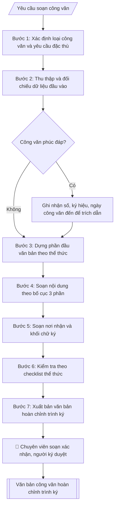

# Soạn công văn đi

## Định dạng và file đầu ra

Định dạng đầu ra có thể chọn theo sản phẩm/yêu cầu: .docx, .pdf. Đọc mục “Định dạng bổ sung” trong quy cách đầu ra trước khi chọn.

**Phải tạo file thực tế để tải xuống, không chỉ trả nội dung trong chat.** Định dạng mặc định của skill: **.docx**. Nếu có bảng số liệu nghiệp vụ yêu cầu file bảng tính riêng, tạo thêm Excel theo yêu cầu; không tự tạo file kiểm tra. Không chờ người dùng yêu cầu xuất file lần nữa. Ưu tiên định dạng người dùng chỉ định; đọc quy tắc xuất file tại references/quy-cach-dau-ra.md.

## Quy cách đầu ra và thông tin thiếu
Khi dựng file Word/Excel, áp dụng mục “Thể thức và bảng biểu khi dựng file” trong quy cách đầu ra (cỡ chữ từng thành phần, bảng nhiều trang, số trang, phụ lục). Đọc [quy cách và cấu trúc sản phẩm](references/quy-cach-dau-ra.md) trước khi soạn/xuất. File giao chỉ gồm sản phẩm nghiệp vụ được yêu cầu; kiểm tra nội bộ không xuất kèm. Thiếu thông tin thì giữ nguyên trường/mục và chỗ điền theo mẫu gốc (dòng dấu chấm, dấu gạch hoặc ô trống); không tự điền dữ liệu mẫu, số 0, mã chờ xác minh hay dòng chờ ký. Mẫu chuyên ngành còn áp dụng được ưu tiên về cấu trúc, mã biểu và người ký. Bản đầy đủ: [quy tắc chung](references/quy-tac-chung.md).

## Kiểm soát áp dụng và phê duyệt
Trước khi chạy, xác định `ngay_ap_dung`, `loai_hinh_truong`, `quy_che_noi_bo`, `nguon_du_lieu`, `nguoi_kiem_duyet`; chỉ hỏi thông tin liên quan nghiệp vụ, không dùng giá trị giả định thay dữ liệu bắt buộc. Đối chiếu căn cứ pháp lý với văn bản gốc, hiệu lực, điều khoản áp dụng và chuyển tiếp. Bản đầy đủ: [quy tắc chung](references/quy-tac-chung.md).

## Giới hạn và human gate
AI hỗ trợ chuẩn bị và đối chiếu; cán bộ phụ trách kiểm tra dữ liệu/căn cứ, người có thẩm quyền duyệt và ký. Không đánh dấu đã ký, đã duyệt, đã công bố khi chưa có chứng cứ. Dữ liệu sinh viên, sức khỏe, nhân sự, tài chính chỉ dùng theo mục đích và phân quyền, che thông tin định danh khi dùng ví dụ (Luật 91/2025/QH15, hiệu lực 01/01/2026); không tải dữ liệu lên dịch vụ ngoài khi chưa có quyền. Bản đầy đủ: [quy tắc chung](references/quy-tac-chung.md).

## Khi nào dùng
Khi cần ban hành văn bản hành chính để trao đổi công việc: phúc đáp công văn đến, đề nghị phối hợp,
thông báo, giải trình, báo cáo đột xuất.

## Đầu vào (Input)

| Trường | Mô tả | Bắt buộc |
|---|---|---|
| `loai_cong_van` | Phúc đáp / Đề nghị / Thông báo / Giải trình / Báo cáo | Có |
| `trich_yeu` | Trích yếu nội dung (1 dòng, sau "V/v") | Có |
| `noi_dung` | Các ý chính cần truyền đạt, dạng gạch đầu dòng | Có |
| `cong_van_den` | Số, ký hiệu, ngày tháng công văn đến cần phúc đáp (nếu loại Phúc đáp) | Không |
| `noi_nhan` | Danh sách nơi nhận (cơ quan + lưu) | Có |
| `nguoi_ky` | Hiệu trưởng / Phó Hiệu trưởng / Trưởng phòng (thừa ủy quyền) | Có |
| `do_khan` | Thường / Khẩn / Thượng khẩn / Hỏa tốc | Không (mặc định: Thường) |
| `co_quan_chu_quan` | Tên cơ quan chủ quản trực tiếp (chỉ khi trường có cấp trên; trường tư thục thường không có) | Không |
| `co_quan_ban_hanh` | Tên cơ quan ban hành văn bản (thường là trường), khác với đơn vị soạn thảo | Có |
| `dia_danh` | Địa danh ghi ở dòng ngày tháng năm | Có |
| `so_van_ban` | Số, ký hiệu văn bản đã được cấp (để trống nếu chưa cấp; không tự đặt) | Không |

## Quy trình

**Bước 1. Xác định loại công văn và yêu cầu đặc thù**
- Làm gì: Đọc `loai_cong_van`, xác định tập yêu cầu riêng của từng loại: Phúc đáp → bắt buộc có công văn đến để trích dẫn; Đề nghị → nêu rõ đề xuất và thời hạn mong hồi âm; Thông báo → nội dung ngắn, rõ đối tượng và thời hạn; Giải trình → nêu rõ vấn đề được yêu cầu giải trình kèm lập luận; Báo cáo → trình bày đúng nội dung được giao, có số liệu.
- Dùng input: `loai_cong_van`, `cong_van_den` (bắt buộc khi loại là Phúc đáp).
- Vai trò: Chuyên viên Phòng HCTH · AI hỗ trợ: phân tích input, xác định yêu cầu · ⏱ ~20–45 phút (ước tính)
- Lưu ý nghiệp vụ: Loại công văn quyết định giọng văn và thẩm quyền ký — Giải trình/Báo cáo gửi cấp trên thường do Hiệu trưởng ký; Đề nghị giữa các đơn vị trong trường có thể do Trưởng phòng ký thừa ủy quyền.
- → Kết quả bước: Xác nhận loại công văn + danh sách trường input bắt buộc tương ứng.

**Bước 2. Thu thập và đối chiếu dữ liệu đầu vào**
- Làm gì: Rà soát `noi_dung` — mỗi gạch đầu dòng phải là một ý độc lập, kiểm tra số liệu (ngày tháng, số lượng người, kinh phí) có nhất quán với nhau và khớp với `cong_van_den`; kiểm tra `noi_nhan` có đủ cơ quan nhận chính và các nơi lưu (VT, đơn vị soạn); kiểm tra `nguoi_ky` có thẩm quyền ký loại công văn này theo quy chế phân cấp của trường.
- Dùng input: `noi_dung`, `cong_van_den`, `noi_nhan`, `nguoi_ky`.
- Vai trò: Chuyên viên Phòng HCTH (Trưởng phòng kiểm tra lại) · AI hỗ trợ: đối chiếu chéo tự động · ⏱ ~15–30 phút (ước tính)
- Lưu ý nghiệp vụ: Bẫy thường gặp — chép sai một ký tự trong số/ký hiệu/ngày công văn đến; nơi nhận thiếu dòng "Lưu: VT" khiến văn thư không có bản lưu; mốc thời hạn trong nội dung (vd "trước ngày 20/10/2026") đã qua so với ngày ban hành dự kiến.
- → Kết quả bước: Bảng đối chiếu dữ liệu đầu vào đã kiểm chuẩn, kèm danh sách lỗi cần bổ sung (nếu có).

**Bước 3. Dựng phần đầu văn bản theo thể thức NĐ 30/2020**
- Làm gì: Dùng Mẫu 1.5 Phụ lục III Nghị định 30: bên trái là cơ quan chủ quản trực tiếp (nếu có), cơ quan ban hành; bên phải là quốc hiệu, tiêu ngữ. Dưới cơ quan là số, ký hiệu và trích yếu V/v; dưới tiêu ngữ là địa danh/ngày. Số đã cấp lấy đúng hồ sơ văn thư; chưa cấp để trống. Ký hiệu công văn chỉ gồm mã cơ quan và mã đơn vị soạn/lĩnh vực, không dùng chữ CV. Không đặt phòng soạn thảo thay tên cơ quan ban hành. Nếu có độ khẩn được xác nhận, bố trí dấu ở ô 10a Phụ lục I. Phần đầu văn bản lấy từ `co_quan_chu_quan` (nếu có), `co_quan_ban_hanh`, `dia_danh`, `so_van_ban` (để dòng dấu chấm nếu chưa cấp số).
- Dùng input: `trich_yeu`, `noi_nhan` (xác định đối tượng "Kính gửi"), `do_khan`, `co_quan_chu_quan`, `co_quan_ban_hanh`, `dia_danh`, `so_van_ban`.
- Vai trò: Chuyên viên Phòng HCTH · AI hỗ trợ: soạn dự thảo đúng thể thức · ⏱ ~20–45 phút (ước tính)
- Lưu ý nghiệp vụ: Số văn bản phải lấy từ sổ đăng ký văn bản đi — không tự đặt số trùng; trích yếu viết sau "V/v", không có dấu chấm cuối câu; "Kính gửi" ghi đúng tên cơ quan như trong `noi_nhan`.
- → Kết quả bước: Khung phần đầu văn bản đã lắp đủ các thành phần thể thức.

**Bước 4. Soạn nội dung theo bố cục 3 phần**
- Làm gì: (a) Mở đầu — một đoạn nêu lý do/căn cứ ban hành; nếu là Phúc đáp, mở bằng "Phúc đáp Công văn số ... ngày ... của ... về việc ..."; (b) Nội dung chính — chuyển từng gạch đầu dòng trong `noi_dung` thành các điểm đánh số 1., 2., 3..., mỗi điểm một ý trọn vẹn, câu văn hành chính với động từ chuẩn ("đồng ý", "cử", "đề nghị"); (c) Kết thúc — một câu đề nghị phối hợp/hồi âm kèm lời cảm ơn, kết bằng ký hiệu "./.".
- Dùng input: `loai_cong_van`, `noi_dung`, `cong_van_den`.
- Vai trò: Chuyên viên Phòng HCTH · AI hỗ trợ: soạn dự thảo đúng thể thức · ⏱ ~20–45 phút (ước tính)
- Lưu ý nghiệp vụ: Mỗi điểm đánh số chỉ chứa MỘT ý; viết tắt (vd "HCTH") phải giải thích đầy đủ ở lần xuất hiện đầu tiên; mốc thời gian trong nội dung thống nhất định dạng ngày/tháng/năm.
- → Kết quả bước: Dự thảo nội dung 3 phần hoàn chỉnh.

**Bước 5. Soạn nơi nhận và khối chữ ký**
- Làm gì: Liệt kê nơi nhận: dòng "- Như trên;" (hoặc "- Như Kính gửi;"), tiếp theo các nơi nhận để biết/lưu, kết thúc bằng "- Lưu: VT, [mã đơn vị]."; khối chữ ký phía bên phải: Phó Hiệu trưởng ký thay → "KT. HIỆU TRƯỞNG" / "PHÓ HIỆU TRƯỞNG"; Trưởng phòng ký thừa ủy quyền → "TUQ. HIỆU TRƯỞNG" / "TRƯỞNG PHÒNG [tên phòng]"; bản trình ký ghi họ tên người dự kiến ký và chừa khoảng trống ký.
- Dùng input: `noi_nhan`, `nguoi_ky`.
- Vai trò: Chuyên viên Phòng HCTH · AI hỗ trợ: soạn dự thảo đúng thể thức · ⏱ ~20–45 phút (ước tính)
- Lưu ý nghiệp vụ: Thừa lệnh (TL.) phải có căn cứ giao ký trong quy chế làm việc/quy chế văn thư; thừa ủy quyền (TUQ.) phải có văn bản ủy quyền giới hạn thời gian và nội dung, không được ủy quyền lại. Kiểm tra căn cứ trước khi chọn ký hiệu; nơi nhận thiếu đơn vị lưu thì văn thư không có bản lưu.
- → Kết quả bước: Phần nơi nhận và khối chữ ký đúng thẩm quyền.

**Bước 6. Kiểm tra theo checklist thể thức**
- Làm gì: Đối chiếu từng mục checklist: quốc hiệu – tiêu ngữ đúng vị trí, chữ in hoa; đủ số, ký hiệu, ngày tháng, trích yếu; trích dẫn công văn đến (nếu Phúc đáp); nội dung đánh số thứ tự, chính tả, số liệu; nơi nhận đầy đủ; thẩm quyền ký phù hợp; dấu độ khẩn (nếu có).
- Dùng input: toàn bộ input (đối chiếu chéo).
- Vai trò: Chuyên viên Phòng HCTH (Trưởng phòng kiểm tra lại) · AI hỗ trợ: quét lỗi theo checklist · ⏱ ~15–30 phút (ước tính)
- Lưu ý nghiệp vụ: Đọc soát chính tả một lượt riêng (tên cơ quan, tên người); kiểm tra lại số/ký hiệu/ngày công văn đến một lần nữa vì đây là lỗi sai phổ biến nhất.
- → Kết quả bước: Kết quả đối chiếu thể thức (giữ nội bộ, không xuất kèm file) + danh sách lỗi cần sửa (nếu có), trả về bước tương ứng để chỉnh.

**Bước 7. Xuất bản văn bản hoàn chỉnh trình ký**
- Làm gì: Ghép phần đầu văn bản + nội dung + nơi nhận + khối chữ ký thành văn bản hoàn chỉnh file theo định dạng đầu ra của skill; thực hiện đối chiếu nội bộ, không xuất kèm checklist; chuyển cho chuyên viên soạn xác nhận rồi trình người ký duyệt (human gate).
- Dùng input: toàn bộ.
- Vai trò: Chuyên viên Phòng HCTH chuẩn bị, người có thẩm quyền ký · AI hỗ trợ: tổng hợp hồ sơ, soạn phiếu trình/tờ trình đầy đủ · ⏱ ~15–30 phút chuẩn bị + chờ duyệt (ước tính)
- Lưu ý nghiệp vụ: Sau khi đã đăng ký số vào sổ văn bản đi thì không tự ý đổi số, ký hiệu.
- → Kết quả bước: Văn bản công văn hoàn chỉnh; phần kiểm tra giữ nội bộ, sẵn sàng trình ký / xuất file Word.

## Luồng quy trình (Workflow)

## Đầu ra

File nghiệp vụ thực tế theo định dạng mặc định ở đầu skill hoặc định dạng người dùng yêu cầu, kèm liên kết tải trong phản hồi cuối.

Sản phẩm nghiệp vụ hoàn chỉnh theo [quy cách và cấu trúc](references/quy-cach-dau-ra.md), giữ các trường chưa có dữ liệu ở trạng thái trống. Không xuất kèm checklist/phụ lục kiểm tra đầu ra.

## Kiểm tra nội bộ trước khi giao

Các tiêu chí sau dùng để tự đối chiếu; không sao chép vào file xuất. Mục thiếu dữ liệu được để trống, không đánh dấu đã đạt hoặc đã duyệt.

- [ ] Bố cục khớp mẫu áp dụng và cấu trúc tại references/quy-cach-dau-ra.md.
- [ ] Nội dung và số liệu trong output khớp đúng với Input đã cho (không thêm, bớt hay suy diễn)
- [ ] Không bịa đặt số liệu, minh chứng, trích dẫn hay căn cứ
- [ ] Đúng thể thức và định dạng theo Nghị định 30/2020/NĐ-CP về công tác văn thư.
- [ ] Căn cứ pháp lý được trích dẫn đầy đủ và còn hiệu lực
- [ ] Không coi bản soạn là đã ký/đã duyệt; việc phê duyệt thuộc người có thẩm quyền trước phát hành
- [ ] Số văn bản phải lấy từ sổ đăng ký văn bản đi — không tự đặt số trùng
- [ ] "Kính gửi" ghi đúng tên cơ quan như trong `noi_nhan`
- [ ] Viết tắt (vd "HCTH") phải giải thích đầy đủ ở lần xuất hiện đầu tiên

## Căn cứ & lưu ý
- Nghị định 30/2020/NĐ-CP về công tác văn thư.
- Công văn có độ khẩn được xác nhận dùng KHẨN/THƯỢNG KHẨN/HỎA TỐC tại ô 10a theo Phụ lục I.
- Không dùng tên thật của trường/cá nhân khi mô phỏng.

## Quản trị phiên bản
- Phiên bản gói `1.3.2` (cập nhật 2026-10-10); hồ sơ đầy đủ tại [references/version.json](references/version.json).
- Người phê duyệt nghiệp vụ: **chưa chỉ định**. Trạng thái: dự thảo nghiệp vụ; kiểm tra pháp lý trước thực thi. Ngày cập nhật không đồng nghĩa mọi văn bản đã được rà soát toàn văn.
- Giấy phép theo LICENSE của kho (bản quyền CES Global). Lịch sử thay đổi: CHANGELOG.md.
