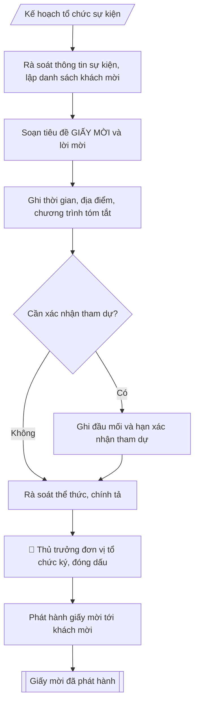

# Soạn giấy mời

## Kiểm soát áp dụng và phê duyệt

Trước khi chạy quy trình, xác định `ngay_ap_dung`, `loai_hinh_truong`, `quy_che_noi_bo`, `nguon_du_lieu` và `nguoi_kiem_duyet`. Chỉ yêu cầu thông tin có liên quan đến nghiệp vụ; không dùng giá trị giả định thay dữ liệu bắt buộc. Hồ sơ có yếu tố pháp lý phải kèm văn bản gốc, tình trạng hiệu lực, điều khoản áp dụng và chuyển tiếp.

## Giới hạn và human gate

AI hỗ trợ chuẩn bị và đối chiếu. Cán bộ phụ trách kiểm tra dữ liệu/căn cứ, người có thẩm quyền duyệt và ký. Mọi đầu ra mặc định là **DỰ THẢO – CHỜ KIỂM DUYỆT**; không đánh dấu đã ký, đã duyệt hoặc đã công bố nếu chưa có chứng cứ. Dữ liệu sinh viên, sức khỏe, nhân sự và tài chính phải hạn chế theo mục đích, phân quyền và che thông tin định danh khi dùng ví dụ. Không tải dữ liệu lên dịch vụ ngoài khi chưa có quyền. Kiểm tra Luật 91/2025/QH15 về bảo vệ dữ liệu cá nhân (hiệu lực 01/01/2026) và quy định áp dụng trước xử lý/chia sẻ dữ liệu cá nhân.


## Khi nào dùng
Khi mời đại biểu, khách mời dự họp, hội nghị, hội thảo, lễ khai giảng / bế giảng /
kỷ niệm, và các sự kiện khác của trường.

## Đầu vào (Input)

| Trường | Mô tả | Bắt buộc |
|---|---|---|
| `su_kien` | Tên sự kiện | Có |
| `thoi_gian` | Giờ, ngày, tháng, năm tổ chức | Có |
| `dia_diem` | Địa điểm tổ chức | Có |
| `thanh_phan` | Đối tượng được mời | Có |
| `chuong_trinh` | Chương trình tóm tắt (nếu cần) | Không |
| `xac_nhan` | Yêu cầu xác nhận tham dự (đầu mối, hạn) | Không |
| `don_vi_moi` | Đơn vị đứng tên mời, người ký | Có |

## Quy trình

**Bước 1. Rà soát thông tin sự kiện, lập danh sách khách mời**
- Làm gì: đối chiếu `su_kien`, `thoi_gian`, `dia_diem` với kế hoạch tổ chức đã phê duyệt (kiểm tra ngày giờ còn trống lịch, địa điểm đã được đặt giữ chỗ); lập danh sách khách mời theo `thanh_phan`, phân loại ưu tiên (lãnh đạo cấp trên – khách mời quan trọng – đại biểu nội bộ); chốt thời điểm gửi (sự kiện lớn gửi trước ít nhất 07 ngày, sự kiện trọng thể trước 14 ngày).
- Dùng input: `su_kien`, `thoi_gian`, `dia_diem`, `thanh_phan`.
- Vai trò: Chuyên viên Phòng HCTH (Trưởng phòng kiểm tra lại) · AI hỗ trợ: quét lỗi theo checklist · ⏱ ~15–30 phút (ước tính)
- Lưu ý nghiệp vụ: kiểm tra chức danh, học hàm, học vị của khách mời — bẫy thường gặp là ghi sai chức danh; địa điểm phải đủ chi tiết để tìm được (số nhà, đường, quận/huyện); không gửi trùng một khách qua 2 kênh.
- → Kết quả bước: danh sách khách mời đã phân loại + lịch kiểm tra (ngày gửi – ngày sự kiện).

**Bước 2. Soạn tiêu đề và lời mời**
- Làm gì: viết tiêu đề "GIẤY MỜI" kèm tên sự kiện in hoa, căn giữa, trình bày trang trọng; viết lời mời "Trân trọng kính mời: ..." ghi đúng đối tượng; chọn cách xưng hô phù hợp từng loại khách mời.
- Dùng input: `su_kien`, `thanh_phan`, `don_vi_moi`.
- Vai trò: Chuyên viên Phòng HCTH · AI hỗ trợ: soạn dự thảo đúng thể thức · ⏱ ~20–45 phút (ước tính)
- Lưu ý nghiệp vụ: tên sự kiện phải khớp đúng tên trong kế hoạch đã duyệt; với lãnh đạo cấp trên dùng "Kính mời" kèm chức danh đầy đủ; không viết tắt tên đơn vị mời.
- → Kết quả bước: dự thảo phần đầu giấy mời (tiêu đề + lời mời).

**Bước 3. Ghi thông tin sự kiện và chương trình tóm tắt**
- Làm gì: ghi đầy đủ `thoi_gian` (giờ, ngày, tháng, năm) và `dia_diem` (tên hội trường + địa chỉ chi tiết); nếu có `chuong_trinh`, trình bày các nội dung chính theo thứ tự thời gian, đánh số thứ tự.
- Dùng input: `thoi_gian`, `dia_diem`, `chuong_trinh`.
- Vai trò: Chuyên viên Phòng HCTH · AI hỗ trợ: xử lý sơ bộ theo quy trình · ⏱ ~20–45 phút (ước tính)
- Lưu ý nghiệp vụ: đối chiếu thứ trong tuần với ngày dương lịch — bẫy sai thứ/ngày rất hay gặp; chương trình tóm tắt chỉ nêu ý chính, không sao chép nguyên văn diễn văn; với hội nghị nhỏ có thể bỏ chương trình.
- → Kết quả bước: dự thảo phần thân giấy mời (thời gian – địa điểm – chương trình).

**Bước 4. Bổ sung thông tin xác nhận tham dự (nếu cần)**
- Làm gì: nếu có `xac_nhan`, ghi rõ đầu mối liên hệ (họ tên, số điện thoại, email) và hạn xác nhận; nếu không yêu cầu xác nhận thì bỏ qua bước này.
- Dùng input: `xac_nhan`.
- Vai trò: Chuyên viên Phòng HCTH · AI hỗ trợ: xử lý sơ bộ theo quy trình · ⏱ ~20–30 phút (ước tính)
- Lưu ý nghiệp vụ: hạn xác nhận đặt trước sự kiện ít nhất 02–03 ngày để tổng hợp số lượng; số điện thoại đầu mối phải là số thật đã kiểm tra gọi được.
- → Kết quả bước: dự thảo phần cuối giấy mời (lời cảm ơn + thông tin xác nhận).

**Bước 5. Rà soát thể thức, trình ký**
- Làm gì: kiểm tra chính tả, thể thức trang trọng (font chữ, căn lề, logo đơn vị); đối chiếu lần cuối ngày giờ, địa điểm, danh sách khách mời; trình thủ trưởng `don_vi_moi` ký, đóng dấu; ghi số lưu hành nội bộ nếu cần.
- Dùng input: `don_vi_moi` (người ký).
- Vai trò: Chuyên viên Phòng HCTH chuẩn bị, Hiệu trưởng phê duyệt · AI hỗ trợ: tổng hợp hồ sơ, soạn phiếu trình/tờ trình đầy đủ · ⏱ ~15–30 phút chuẩn bị + chờ duyệt (ước tính)
- Lưu ý nghiệp vụ: chữ ký phải đúng người có thẩm quyền — giấy mời cấp trường do Hiệu trưởng hoặc người được ủy quyền ký; kiểm tra dấu đóng rõ nét, đúng vị trí.
- → Kết quả bước: giấy mời đã ký, đóng dấu.

**Bước 6. Phát hành giấy mời**
- Làm gì: gửi giấy mời tới từng khách mời trong danh sách Bước 1 (trực tiếp, chuyển phát, email công vụ); đánh dấu đã gửi từng người; tổng hợp xác nhận tham dự gửi lại đơn vị tổ chức.
- Dùng input: danh sách khách mời (từ Bước 1), `xac_nhan` (từ Bước 4).
- Vai trò: Văn thư Phòng HCTH · AI hỗ trợ: định dạng bản chính, cập nhật sổ phát hành · ⏱ ~30 phút (ước tính)
- Lưu ý nghiệp vụ: khách mời quan trọng ưu tiên gửi tay hoặc chuyển phát nhanh; lưu biên nhận gửi để đối chiếu khi cần; chốt danh sách xác nhận trước sự kiện 01 ngày.
- → Kết quả bước: giấy mời đã phát hành + danh sách xác nhận tham dự.

## Luồng quy trình (Workflow)



## Đầu ra (Output)
- Giấy mời hoàn chỉnh, trình bày trang trọng.

**Cấu trúc output chuẩn:** khung mẫu cố định của giấy mời, theo đúng thứ tự:
1. Tiêu đề đơn vị (tên trường / đơn vị đứng tên mời);
2. Tiêu đề "GIẤY MỜI" + tên sự kiện (in hoa, căn giữa);
3. Lời mời: "Trân trọng kính mời: ..." (ghi rõ đối tượng được mời);
4. Nội dung mời: tới dự sự kiện nào của đơn vị nào;
5. Thông tin sự kiện: thời gian (giờ, ngày, tháng, năm); địa điểm (tên nơi tổ chức + địa chỉ chi tiết);
6. Chương trình tóm tắt (nếu là hội nghị, lễ lớn);
7. Thông tin xác nhận tham dự (nếu cần): đầu mối liên hệ, hạn xác nhận;
8. Lời cảm ơn / vinh dự;
9. Chữ ký người mời: chức danh, chữ ký, họ tên (kèm dấu).

## Checklist nghiệm thu

Tiêu chí đạt: tất cả các ô dưới đây được đánh dấu.

- [ ] Đủ các phần theo Cấu trúc output chuẩn: Tiêu đề đơn vị (tên trường / đơn vị đứng tên mời); Tiêu đề "GIẤY MỜI" + tên sự kiện (in hoa, căn giữa); Lời mời: "Trân trọng kính mời: ..." (ghi rõ đối tượng được mời); Nội dung mời: tới dự sự kiện nào của đơn vị nào; … (đủ 9 phần)
- [ ] Nội dung và số liệu trong output khớp đúng với Input đã cho (không thêm, bớt hay suy diễn)
- [ ] Không bịa đặt số liệu, minh chứng, trích dẫn hay căn cứ
- [ ] Đúng thể thức và định dạng theo Giấy mời sự kiện lớn nên gửi trước ít nhất 07 ngày
- [ ] Căn cứ pháp lý được trích dẫn đầy đủ và còn hiệu lực
- [ ] Đã qua Human gate: người có thẩm quyền đã kiểm tra/duyệt trước khi phát hành
- [ ] Kiểm tra chức danh, học hàm, học vị của khách mời — bẫy thường gặp là ghi sai chức danh
- [ ] Địa điểm phải đủ chi tiết để tìm được (số nhà, đường, quận/huyện)
- [ ] Tên sự kiện phải khớp đúng tên trong kế hoạch đã duyệt

## Ví dụ mô phỏng (dữ liệu giả lập)

> Tất cả tên trường, cá nhân, số liệu dưới đây đều là **giả lập**, không liên quan tổ chức/cá nhân có thật.

### Input mẫu

| Trường | Giá trị |
|---|---|
| `su_kien` | Lễ khai giảng năm học 2026–2027 |
| `thoi_gian` | 08 giờ 00, ngày 05 tháng 10 năm 2026 |
| `dia_diem` | Hội trường A, Trường Đại học A (123 đường Giảng Võ, thành phố C) |
| `thanh_phan` | Đại diện lãnh đạo Bộ Giáo dục và Đào tạo; đại biểu các cơ quan; toàn thể CBVC và tân sinh viên |
| `chuong_trinh` | Văn nghệ chào mừng; tuyên bố lý do, giới thiệu đại biểu; diễn văn khai giảng; phát biểu của lãnh đạo; đánh trống khai giảng |
| `don_vi_moi` | Trường Đại học A – Hiệu trưởng |

### Output mẫu

```
TRƯỜNG ĐẠI HỌC A
(Dữ liệu giả lập)

                        GIẤY MỜI
          Dự Lễ khai giảng năm học 2026–2027

Trân trọng kính mời: Quý vị đại biểu

Tới dự Lễ khai giảng năm học 2026–2027 của Trường Đại học A.

- Thời gian: 08 giờ 00, ngày 05 tháng 10 năm 2026.
- Địa điểm: Hội trường A, Trường Đại học A
            (123 đường Giảng Võ, thành phố C).

Chương trình:
1. Văn nghệ chào mừng;
2. Tuyên bố lý do, giới thiệu đại biểu;
3. Diễn văn khai giảng năm học mới của Hiệu trưởng;
4. Phát biểu của lãnh đạo Bộ Giáo dục và Đào tạo;
5. Nghi thức đánh trống khai giảng.

Sự hiện diện của Quý vị là niềm vinh dự của Nhà trường.

                                                      HIỆU TRƯỞNG
                                                         [CHỜ KÝ]

                                                  PGS.TS. Phạm Văn A
```

## Căn cứ & lưu ý
- Giấy mời sự kiện lớn nên gửi trước ít nhất 07 ngày; gửi kèm chương trình chi tiết nếu cần.
- Không dùng tên thật của trường/cá nhân khi mô phỏng.

## Quản trị phiên bản

- Phiên bản gói: `1.1.0`; ngày cập nhật: `2026-10-09`.
- Kho nguồn: https://github.com/phamtruong91/dh-skills
- Người duy trì trên GitHub: `phamtruong91` (Phạm Văn Trường). Người phê duyệt nghiệp vụ: **chưa chỉ định**.
- Commit nguồn trước cập nhật: `78fd1d51b8acd1a724d9b9af6c488460bc7551ad`. Commit chứa phiên bản này xem bằng `git log -1 -- skills/soan-giay-moi`; không tự gán SHA chưa tạo.
- Giấy phép: theo LICENSE của kho; bản quyền CES Global.
- Lịch sử 1.1.0: bổ sung metadata giao diện, kiểm soát áp dụng, quản trị phiên bản.
- Trạng thái: dự thảo nghiệp vụ; kiểm tra pháp lý trước thực thi. Ngày cập nhật không đồng nghĩa mọi văn bản đã được rà soát toàn văn.
