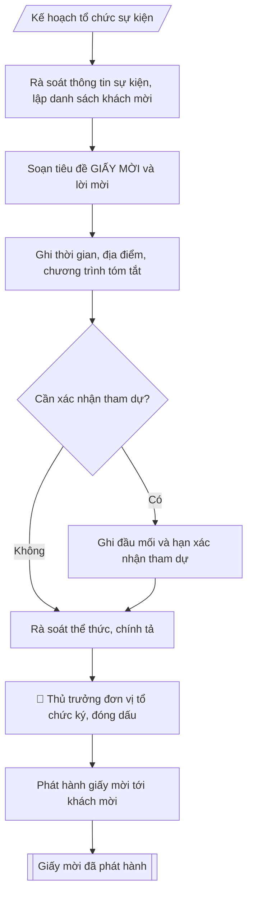

# Soạn giấy mời

## Định dạng và file đầu ra

Định dạng đầu ra có thể chọn theo sản phẩm/yêu cầu: .docx, .pdf. Đọc mục “Định dạng bổ sung” trong quy cách đầu ra trước khi chọn.

**Phải tạo file thực tế để tải xuống, không chỉ trả nội dung trong chat.** Định dạng mặc định của skill: **.docx**. Nếu có bảng số liệu nghiệp vụ yêu cầu file bảng tính riêng, tạo thêm Excel theo yêu cầu; không tự tạo file kiểm tra. Không chờ người dùng yêu cầu xuất file lần nữa. Ưu tiên định dạng người dùng chỉ định; đọc quy tắc xuất file tại references/quy-cach-dau-ra.md.

## Quy cách đầu ra và thông tin thiếu
Đọc [quy cách và cấu trúc sản phẩm](references/quy-cach-dau-ra.md) trước khi soạn/xuất. File giao chỉ gồm sản phẩm nghiệp vụ được yêu cầu; kiểm tra nội bộ không xuất kèm. Thiếu thông tin thì giữ nguyên trường/mục và chỗ điền theo mẫu gốc (dòng dấu chấm, dấu gạch hoặc ô trống); không tự điền dữ liệu mẫu, số 0, mã chờ xác minh hay dòng chờ ký. Mẫu chuyên ngành còn áp dụng được ưu tiên về cấu trúc, mã biểu và người ký. Bản đầy đủ: [quy tắc chung](references/quy-tac-chung.md).

## Kiểm soát áp dụng và phê duyệt
Trước khi chạy, xác định `ngay_ap_dung`, `loai_hinh_truong`, `quy_che_noi_bo`, `nguon_du_lieu`, `nguoi_kiem_duyet`; chỉ hỏi thông tin liên quan nghiệp vụ, không dùng giá trị giả định thay dữ liệu bắt buộc. Đối chiếu căn cứ pháp lý với văn bản gốc, hiệu lực, điều khoản áp dụng và chuyển tiếp. Bản đầy đủ: [quy tắc chung](references/quy-tac-chung.md).

## Giới hạn và human gate
AI hỗ trợ chuẩn bị và đối chiếu; cán bộ phụ trách kiểm tra dữ liệu/căn cứ, người có thẩm quyền duyệt và ký. Không đánh dấu đã ký, đã duyệt, đã công bố khi chưa có chứng cứ. Dữ liệu sinh viên, sức khỏe, nhân sự, tài chính chỉ dùng theo mục đích và phân quyền, che thông tin định danh khi dùng ví dụ (Luật 91/2025/QH15, hiệu lực 01/01/2026); không tải dữ liệu lên dịch vụ ngoài khi chưa có quyền. Bản đầy đủ: [quy tắc chung](references/quy-tac-chung.md).

## Khi nào dùng
Khi mời đại biểu, khách mời dự họp, hội nghị, hội thảo, lễ khai giảng / bế giảng /
kỷ niệm, và các sự kiện khác của trường.

## Đầu vào (Input)

| Trường | Mô tả | Bắt buộc |
|---|---|---|
| `su_kien` | Tên sự kiện | Có |
| `thoi_gian` | Giờ, ngày, tháng, năm tổ chức | Có |
| `dia_diem` | Địa điểm tổ chức | Có |
| `thanh_phan` | Đối tượng được mời | Có |
| `chuong_trinh` | Chương trình tóm tắt (nếu cần) | Không |
| `xac_nhan` | Yêu cầu xác nhận tham dự (đầu mối, hạn) | Không |
| `don_vi_moi` | Đơn vị đứng tên mời, người ký | Có |

## Quy trình

**Bước 1. Rà soát thông tin sự kiện, lập danh sách khách mời**
- Làm gì: đối chiếu `su_kien`, `thoi_gian`, `dia_diem` với kế hoạch tổ chức đã phê duyệt (kiểm tra ngày giờ còn trống lịch, địa điểm đã được đặt giữ chỗ); lập danh sách khách mời theo `thanh_phan`, phân loại ưu tiên (lãnh đạo cấp trên – khách mời quan trọng – đại biểu nội bộ); chốt thời điểm gửi (sự kiện lớn gửi trước ít nhất 07 ngày, sự kiện trọng thể trước 14 ngày).
- Dùng input: `su_kien`, `thoi_gian`, `dia_diem`, `thanh_phan`.
- Vai trò: Chuyên viên Phòng HCTH (Trưởng phòng kiểm tra lại) · AI hỗ trợ: quét lỗi theo checklist · ⏱ ~15–30 phút (ước tính)
- Lưu ý nghiệp vụ: kiểm tra chức danh, học hàm, học vị của khách mời — bẫy thường gặp là ghi sai chức danh; địa điểm phải đủ chi tiết để tìm được (số nhà, đường, quận/huyện); không gửi trùng một khách qua 2 kênh.
- → Kết quả bước: danh sách khách mời đã phân loại + lịch kiểm tra (ngày gửi – ngày sự kiện).

**Bước 2. Soạn tiêu đề và lời mời**
- Làm gì: viết tiêu đề "GIẤY MỜI" kèm tên sự kiện in hoa, căn giữa, trình bày trang trọng; viết lời mời "Trân trọng kính mời: ..." ghi đúng đối tượng; chọn cách xưng hô phù hợp từng loại khách mời.
- Dùng input: `su_kien`, `thanh_phan`, `don_vi_moi`.
- Vai trò: Chuyên viên Phòng HCTH · AI hỗ trợ: soạn dự thảo đúng thể thức · ⏱ ~20–45 phút (ước tính)
- Lưu ý nghiệp vụ: tên sự kiện phải khớp đúng tên trong kế hoạch đã duyệt; với lãnh đạo cấp trên dùng "Kính mời" kèm chức danh đầy đủ; không viết tắt tên đơn vị mời.
- → Kết quả bước: dự thảo phần đầu giấy mời (tiêu đề + lời mời).

**Bước 3. Ghi thông tin sự kiện và chương trình tóm tắt**
- Làm gì: ghi đầy đủ `thoi_gian` (giờ, ngày, tháng, năm) và `dia_diem` (tên hội trường + địa chỉ chi tiết); nếu có `chuong_trinh`, trình bày các nội dung chính theo thứ tự thời gian, đánh số thứ tự.
- Dùng input: `thoi_gian`, `dia_diem`, `chuong_trinh`.
- Vai trò: Chuyên viên Phòng HCTH · AI hỗ trợ: xử lý sơ bộ theo quy trình · ⏱ ~20–45 phút (ước tính)
- Lưu ý nghiệp vụ: đối chiếu thứ trong tuần với ngày dương lịch — bẫy sai thứ/ngày rất hay gặp; chương trình tóm tắt chỉ nêu ý chính, không sao chép nguyên văn diễn văn; với hội nghị nhỏ có thể bỏ chương trình.
- → Kết quả bước: dự thảo phần thân giấy mời (thời gian – địa điểm – chương trình).

**Bước 4. Bổ sung thông tin xác nhận tham dự (nếu cần)**
- Làm gì: nếu có `xac_nhan`, ghi rõ đầu mối liên hệ (họ tên, số điện thoại, email) và hạn xác nhận; nếu không yêu cầu xác nhận thì bỏ qua bước này.
- Dùng input: `xac_nhan`.
- Vai trò: Chuyên viên Phòng HCTH · AI hỗ trợ: xử lý sơ bộ theo quy trình · ⏱ ~20–30 phút (ước tính)
- Lưu ý nghiệp vụ: hạn xác nhận đặt trước sự kiện ít nhất 02–03 ngày để tổng hợp số lượng; số điện thoại đầu mối phải là số thật đã kiểm tra gọi được.
- → Kết quả bước: dự thảo phần cuối giấy mời (lời cảm ơn + thông tin xác nhận).

**Bước 5. Rà soát thể thức, trình ký**
- Làm gì: kiểm tra chính tả, thể thức trang trọng (font chữ, căn lề, logo đơn vị); đối chiếu lần cuối ngày giờ, địa điểm, danh sách khách mời; trình thủ trưởng `don_vi_moi` ký, đóng dấu; ghi số lưu hành nội bộ nếu cần.
- Dùng input: `don_vi_moi` (người ký).
- Vai trò: Chuyên viên Phòng HCTH chuẩn bị, Hiệu trưởng phê duyệt · AI hỗ trợ: tổng hợp hồ sơ, soạn phiếu trình/tờ trình đầy đủ · ⏱ ~15–30 phút chuẩn bị + chờ duyệt (ước tính)
- Lưu ý nghiệp vụ: chữ ký phải đúng người có thẩm quyền — giấy mời cấp trường do Hiệu trưởng hoặc người được ủy quyền ký; kiểm tra dấu đóng rõ nét, đúng vị trí.
- → Kết quả bước: giấy mời đã ký, đóng dấu.

**Bước 6. Phát hành giấy mời**
- Làm gì: gửi giấy mời tới từng khách mời trong danh sách Bước 1 (trực tiếp, chuyển phát, email công vụ); đánh dấu đã gửi từng người; tổng hợp xác nhận tham dự gửi lại đơn vị tổ chức.
- Dùng input: danh sách khách mời (từ Bước 1), `xac_nhan` (từ Bước 4).
- Vai trò: Văn thư Phòng HCTH · AI hỗ trợ: định dạng bản chính, cập nhật sổ phát hành · ⏱ ~30 phút (ước tính)
- Lưu ý nghiệp vụ: khách mời quan trọng ưu tiên gửi tay hoặc chuyển phát nhanh; lưu biên nhận gửi để đối chiếu khi cần; chốt danh sách xác nhận trước sự kiện 01 ngày.
- → Kết quả bước: giấy mời đã phát hành + danh sách xác nhận tham dự.

## Luồng quy trình (Workflow)

## Đầu ra

File nghiệp vụ thực tế theo định dạng mặc định ở đầu skill hoặc định dạng người dùng yêu cầu, kèm liên kết tải trong phản hồi cuối.

Sản phẩm nghiệp vụ hoàn chỉnh theo [quy cách và cấu trúc](references/quy-cach-dau-ra.md), giữ các trường chưa có dữ liệu ở trạng thái trống. Không xuất kèm checklist/phụ lục kiểm tra đầu ra.

## Kiểm tra nội bộ trước khi giao

Các tiêu chí sau dùng để tự đối chiếu; không sao chép vào file xuất. Mục thiếu dữ liệu được để trống, không đánh dấu đã đạt hoặc đã duyệt.

- [ ] Bố cục khớp mẫu áp dụng và cấu trúc tại references/quy-cach-dau-ra.md.
- [ ] Nội dung và số liệu trong output khớp đúng với Input đã cho (không thêm, bớt hay suy diễn)
- [ ] Không bịa đặt số liệu, minh chứng, trích dẫn hay căn cứ
- [ ] Đúng thể thức và định dạng theo Giấy mời sự kiện lớn nên gửi trước ít nhất 07 ngày
- [ ] Căn cứ pháp lý được trích dẫn đầy đủ và còn hiệu lực
- [ ] Không coi bản soạn là đã ký/đã duyệt; việc phê duyệt thuộc người có thẩm quyền trước phát hành
- [ ] Kiểm tra chức danh, học hàm, học vị của khách mời — bẫy thường gặp là ghi sai chức danh
- [ ] Địa điểm phải đủ chi tiết để tìm được (số nhà, đường, quận/huyện)
- [ ] Tên sự kiện phải khớp đúng tên trong kế hoạch đã duyệt

## Căn cứ & lưu ý
- Giấy mời sự kiện lớn nên gửi trước ít nhất 07 ngày; gửi kèm chương trình chi tiết nếu cần.
- Không dùng tên thật của trường/cá nhân khi mô phỏng.

## Quản trị phiên bản
- Phiên bản gói `1.3.2` (cập nhật 2026-10-10); hồ sơ đầy đủ tại [references/version.json](references/version.json).
- Người phê duyệt nghiệp vụ: **chưa chỉ định**. Trạng thái: dự thảo nghiệp vụ; kiểm tra pháp lý trước thực thi. Ngày cập nhật không đồng nghĩa mọi văn bản đã được rà soát toàn văn.
- Giấy phép theo LICENSE của kho (bản quyền CES Global). Lịch sử thay đổi: CHANGELOG.md.
