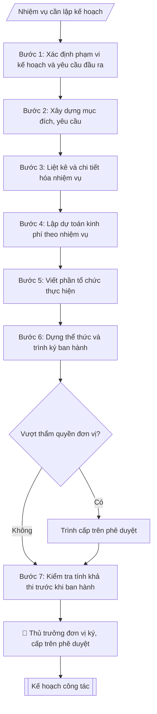

# Soạn kế hoạch công tác

## Kiểm soát áp dụng và phê duyệt

Trước khi chạy quy trình, xác định `ngay_ap_dung`, `loai_hinh_truong`, `quy_che_noi_bo`, `nguon_du_lieu` và `nguoi_kiem_duyet`. Chỉ yêu cầu thông tin có liên quan đến nghiệp vụ; không dùng giá trị giả định thay dữ liệu bắt buộc. Hồ sơ có yếu tố pháp lý phải kèm văn bản gốc, tình trạng hiệu lực, điều khoản áp dụng và chuyển tiếp.

## Giới hạn và human gate

AI hỗ trợ chuẩn bị và đối chiếu. Cán bộ phụ trách kiểm tra dữ liệu/căn cứ, người có thẩm quyền duyệt và ký. Mọi đầu ra mặc định là **DỰ THẢO – CHỜ KIỂM DUYỆT**; không đánh dấu đã ký, đã duyệt hoặc đã công bố nếu chưa có chứng cứ. Dữ liệu sinh viên, sức khỏe, nhân sự và tài chính phải hạn chế theo mục đích, phân quyền và che thông tin định danh khi dùng ví dụ. Không tải dữ liệu lên dịch vụ ngoài khi chưa có quyền. Kiểm tra Luật 91/2025/QH15 về bảo vệ dữ liệu cá nhân (hiệu lực 01/01/2026) và quy định áp dụng trước xử lý/chia sẻ dữ liệu cá nhân.


## Khi nào dùng
Khi đơn vị cần lập kế hoạch công tác tháng, quý, năm; khi lập kế hoạch triển khai
một nhiệm vụ, đợt công tác cụ thể.

## Đầu vào (Input)

| Trường | Mô tả | Bắt buộc |
|---|---|---|
| `don_vi` | Đơn vị lập kế hoạch | Có |
| `thoi_gian` | Tháng / quý / năm thực hiện | Có |
| `muc_tieu` | Mục đích, yêu cầu của kế hoạch | Có |
| `nhiem_vu` | Bảng nhiệm vụ: nội dung, đơn vị/cá nhân thực hiện, thời gian, kết quả mong đợi | Có |
| `kinh_phi` | Dự toán kinh phí (nếu có) | Không |

## Quy trình

**Bước 1. Xác định phạm vi kế hoạch và yêu cầu đầu ra**
- Làm gì: Đọc `don_vi` và `thoi_gian` để xác định phạm vi (kế hoạch tháng/quý/năm của đơn vị hay kế hoạch triển khai một nhiệm vụ cụ thể); xác định kế hoạch do thủ trưởng đơn vị ký ban hành hay phải trình cấp trên phê duyệt (kế hoạch vượt thẩm quyền về kinh phí/nhân sự phải trình phê duyệt); đọc `muc_tieu` để nắm mục đích, yêu cầu tổng thể.
- Dùng input: `don_vi`, `thoi_gian`, `muc_tieu`.
- Vai trò: Chuyên viên Phòng HCTH · AI hỗ trợ: phân tích input, xác định yêu cầu · ⏱ ~20–45 phút (ước tính)
- Lưu ý nghiệp vụ: Phạm vi thời gian quyết định độ chi tiết — kế hoạch năm nêu định hướng theo quý, kế hoạch tháng/quý phải có nhiệm vụ cụ thể từng tuần; xác định sai cấp phê duyệt khiến kế hoạch phải làm lại.
- → Kết quả bước: Xác nhận phạm vi kế hoạch + cấp ban hành/phê duyệt.

**Bước 2. Xây dựng mục đích, yêu cầu**
- Làm gì: Từ `muc_tieu`, viết phần "I. MỤC ĐÍCH, YÊU CẦU": nêu rõ kế hoạch nhằm đạt mục tiêu gì (gắn với kế hoạch năm học của trường và chức năng nhiệm vụ của đơn vị), yêu cầu về chất lượng – tiến độ – phối hợp; yêu cầu phải đo được (đúng tiến độ, đúng thể thức) thay vì chung chung.
- Dùng input: `muc_tieu`, `don_vi`.
- Vai trò: Chuyên viên Phòng HCTH · AI hỗ trợ: soạn dự thảo đúng thể thức · ⏱ ~20–45 phút (ước tính)
- Lưu ý nghiệp vụ: Mục đích phải trả lời "làm kế hoạch này để đạt gì"; tránh sao chép nguyên văn chức năng nhiệm vụ của đơn vị thành mục đích.
- → Kết quả bước: Dự thảo phần I. Mục đích, yêu cầu.

**Bước 3. Liệt kê và chi tiết hóa nhiệm vụ**
- Làm gì: Từ `nhiem_vu`, liệt kê từng nhiệm vụ và chi tiết hóa thành bảng với 5 cột: STT | Nội dung | Đơn vị/cá nhân thực hiện | Thời gian | Kết quả mong đợi; mỗi nhiệm vụ phải gắn một đầu mối chịu trách nhiệm chính và một mốc thời gian cụ thể; kết quả mong đợi phải là sản phẩm đo được (báo cáo, danh mục, kịch bản...).
- Dùng input: `nhiem_vu`.
- Vai trò: Chuyên viên Phòng HCTH · AI hỗ trợ: xử lý sơ bộ theo quy trình · ⏱ ~20–45 phút (ước tính)
- Lưu ý nghiệp vụ: Bẫy thường gặp — nhiệm vụ không có đầu mối ("các đơn vị phối hợp" mà không rõ ai chủ trì), thời gian ghi "trong quý" thay vì tháng cụ thể, kết quả mong đợi chung chung ("hoàn thành tốt"). Mỗi nhiệm vụ trong bảng phải đứng độc lập, không trùng lặp.
- → Kết quả bước: Bảng nhiệm vụ chi tiết (STT, nội dung, thực hiện, thời gian, kết quả).

**Bước 4. Lập dự toán kinh phí theo nhiệm vụ**
- Làm gì: Nếu có `kinh_phi`: phân bổ dự toán chi tiết theo từng nhiệm vụ trong bảng (nhiệm vụ nào – bao nhiêu – nội dung chi gì), ghi tổng kinh phí và nguồn kinh phí (thường xuyên / đề án / ...); kiểm tra tổng các khoản chi tiết khớp với tổng dự toán.
- Dùng input: `kinh_phi`, `nhiem_vu` (đã chi tiết hóa ở Bước 3).
- Vai trò: Chuyên viên Phòng HCTH · AI hỗ trợ: lập bảng tính toán · ⏱ ~20–45 phút (ước tính)
- Lưu ý nghiệp vụ: Kinh phí phải gắn với nhiệm vụ cụ thể — không để khoản "chi khác" quá lớn; nếu `kinh_phi` không có thì bỏ qua bước này và đánh số lại các phần tiếp theo.
- → Kết quả bước: Dự thảo phần Kinh phí: bảng phân bổ theo nhiệm vụ + tổng + nguồn.

**Bước 5. Viết phần tổ chức thực hiện**
- Làm gì: Viết phần "Tổ chức thực hiện": phân công trách nhiệm (ai chủ trì chung, ai theo dõi từng nhóm nhiệm vụ), cơ chế báo cáo tiến độ (giao ban tuần/tháng của đơn vị), cơ chế kiểm tra, xử lý khi chậm tiến độ; nêu đầu mối tổng hợp báo cáo.
- Dùng input: `don_vi`, `nhiem_vu` (đã chi tiết hóa).
- Vai trò: Chuyên viên Phòng HCTH · AI hỗ trợ: soạn dự thảo đúng thể thức · ⏱ ~20–45 phút (ước tính)
- Lưu ý nghiệp vụ: Phải có ít nhất một cơ chế kiểm tra tiến độ định kỳ — kế hoạch không có cơ chế giám sát thường không thực hiện được; ghi rõ ai là đầu mối tổng hợp để tránh "mỗi người báo một kiểu".
- → Kết quả bước: Dự thảo phần Tổ chức thực hiện.

**Bước 6. Dựng thể thức và trình ký ban hành**
- Làm gì: Lắp ráp phần đầu: tên trường + tên `don_vi` (in hoa), dòng "KẾ HOẠCH CÔNG TÁC [phạm vi thời gian]" (in hoa, căn giữa); sắp xếp các phần theo thứ tự: I. Mục đích, yêu cầu → II. Nhiệm vụ cụ thể → III. Kinh phí (nếu có) → IV. Tổ chức thực hiện; cuối văn bản: địa danh, ngày tháng năm + khối chữ ký thủ trưởng đơn vị (chức danh + họ tên); trình thủ trưởng đơn vị ký ban hành (human gate), hoặc trình cấp trên phê duyệt nếu vượt thẩm quyền.
- Dùng input: `don_vi`, `thoi_gian`.
- Vai trò: Chuyên viên Phòng HCTH chuẩn bị, Hiệu trưởng phê duyệt · AI hỗ trợ: tổng hợp hồ sơ, soạn phiếu trình/tờ trình đầy đủ · ⏱ ~15–30 phút chuẩn bị + chờ duyệt (ước tính)
- Lưu ý nghiệp vụ: Người ký là thủ trưởng đơn vị lập kế hoạch; nếu kế hoạch trình cấp trên phê duyệt thì đơn vị chỉ ký phần đề xuất, không ghi "ban hành".
- → Kết quả bước: Văn bản kế hoạch hoàn chỉnh về thể thức, đã trình ký.

**Bước 7. Kiểm tra tính khả thi trước khi ban hành**
- Làm gì: Rà soát toàn văn: mỗi nhiệm vụ có đầu mối + thời hạn cụ thể không; thời gian các nhiệm vụ có nằm trong phạm vi `thoi_gian` không; tổng kinh phí có khớp phân bổ chi tiết không; nhiệm vụ có phù hợp năng lực và chức năng của đơn vị không; chính tả, tên đơn vị chính xác.
- Dùng input: toàn bộ input (đối chiếu chéo).
- Vai trò: Chuyên viên Phòng HCTH (Trưởng phòng kiểm tra lại) · AI hỗ trợ: quét lỗi theo checklist · ⏱ ~15–30 phút (ước tính)
- Lưu ý nghiệp vụ: Nhiệm vụ có thời hạn nằm ngoài phạm vi kế hoạch (vd kế hoạch quý IV nhưng nhiệm vụ hạn tháng 1 năm sau) phải điều chỉnh; nhiệm vụ vượt năng lực đơn vị phải ghi rõ cần phối hợp/hỗ trợ từ đơn vị nào.
- → Kết quả bước: Báo cáo kiểm tra + danh sách chỗ cần sửa (nếu có); sau khi sửa xong thì ban hành.

## Luồng quy trình (Workflow)



## Đầu ra (Output)
- Văn bản kế hoạch công tác hoàn chỉnh.
- Bảng nhiệm vụ chi tiết.

**Cấu trúc output chuẩn:** khung mẫu cố định của kế hoạch công tác — các phần bắt buộc theo đúng thứ tự xuất hiện:
1. Tên trường (in hoa) + tên đơn vị lập kế hoạch (in hoa)
2. Tên loại "KẾ HOẠCH CÔNG TÁC [phạm vi thời gian]" (in hoa, căn giữa)
3. I. MỤC ĐÍCH, YÊU CẦU: mục tiêu cần đạt + yêu cầu chất lượng – tiến độ – phối hợp
4. II. NHIỆM VỤ CỤ THỂ: bảng đúng 5 cột theo thứ tự — STT | Nội dung | Đơn vị/cá nhân thực hiện | Thời gian | Kết quả mong đợi
5. III. KINH PHÍ (nếu có): tổng dự toán + nguồn kinh phí (phân bổ chi tiết theo nhiệm vụ)
6. IV. TỔ CHỨC THỰC HIỆN: phân công trách nhiệm, cơ chế báo cáo và kiểm tra tiến độ
7. Địa danh, ngày tháng năm + khối chữ ký thủ trưởng đơn vị (chức danh + họ tên)

## Checklist nghiệm thu

Tiêu chí đạt: tất cả các ô dưới đây được đánh dấu.

- [ ] Đủ các phần theo Cấu trúc output chuẩn: Tên trường; Tên loại "KẾ HOẠCH CÔNG TÁC [phạm vi thời gian]"; I. MỤC ĐÍCH, YÊU CẦU: mục tiêu cần đạt + yêu cầu chất lượng – tiến…; II. NHIỆM VỤ CỤ THỂ: bảng đúng 5 cột theo thứ tự — STT | Nội dung |…; … (đủ 7 phần)
- [ ] Nội dung và số liệu trong output khớp đúng với Input đã cho (không thêm, bớt hay suy diễn)
- [ ] Không bịa đặt số liệu, minh chứng, trích dẫn hay căn cứ
- [ ] Đúng thể thức và định dạng theo Kế hoạch năm học toàn trường
- [ ] Căn cứ pháp lý được trích dẫn đầy đủ và còn hiệu lực
- [ ] Đã qua Human gate: người có thẩm quyền đã kiểm tra/duyệt trước khi phát hành
- [ ] Phạm vi thời gian quyết định độ chi tiết — kế hoạch năm nêu định hướng theo quý, kế hoạch tháng/quý phải có nhiệm vụ cụ thể từng tuần
- [ ] Xác định sai cấp phê duyệt khiến kế hoạch phải làm lại
- [ ] Mục đích phải trả lời "làm kế hoạch này để đạt gì"

## Ví dụ mô phỏng (dữ liệu giả lập)

> Tất cả tên trường, cá nhân, số liệu dưới đây đều là **giả lập**, không liên quan tổ chức/cá nhân có thật.

### Input mẫu

| Trường | Giá trị |
|---|---|
| `don_vi` | Phòng Hành chính – Tổng hợp, Trường Đại học A |
| `thoi_gian` | Quý IV năm 2026 |
| `muc_tieu` | Đảm bảo công tác văn phòng phục vụ tổng kết năm học và chuẩn bị năm học mới |
| `nhiem_vu` | 1. Tổng hợp báo cáo tổng kết năm học (HCTH chủ trì, T12/2026). 2. Rà soát, thanh lý văn bản hết giá trị lưu trữ (T11/2026). 3. Chuẩn bị khánh tiết Lễ khai giảng (T10/2026). |
| `kinh_phi` | 120.000.000 đồng |

### Output mẫu

```
TRƯỜNG ĐẠI HỌC A
PHÒNG HÀNH CHÍNH – TỔNG HỢP

KẾ HOẠCH CÔNG TÁC QUÝ IV NĂM 2026
(Dữ liệu giả lập)

I. MỤC ĐÍCH, YÊU CẦU
1. Đảm bảo công tác văn phòng, văn thư, lễ tân phục vụ tổng kết năm học
   2025–2026 và chuẩn bị cho năm học mới.
2. Yêu cầu: đúng tiến độ, đúng thể thức, phối hợp chặt chẽ với các đơn vị.

II. NHIỆM VỤ CỤ THỂ
| STT | Nội dung | Thực hiện | Thời gian | Kết quả |
|-----|----------|-----------|-----------|---------|
| 1 | Tổng hợp báo cáo tổng kết năm học 2025–2026 | HCTH chủ trì, các đơn vị phối hợp | T12/2026 | Báo cáo trình BGH |
| 2 | Rà soát, lập danh mục văn bản hết giá trị, đề xuất thanh lý | Tổ Văn thư | T11/2026 | Danh mục trình duyệt |
| 3 | Chuẩn bị lễ tân, khánh tiết Lễ khai giảng năm học mới | HCTH | T10/2026 | Kịch bản, hậu cần |

III. KINH PHÍ: 120.000.000 đồng (nguồn: kinh phí thường xuyên).

IV. TỔ CHỨC THỰC HIỆN
Các tổ, cá nhân báo cáo tiến độ vào giao ban tuần của Phòng.

Thành phố C, ngày 01 tháng 10 năm 2026
TRƯỞNG PHÒNG [CHỜ KÝ]
ThS. Vũ Thị D
```

## Căn cứ & lưu ý
- Kế hoạch năm học toàn trường; chức năng nhiệm vụ của đơn vị.
- Nhiệm vụ phải gắn người chịu trách nhiệm và thời hạn cụ thể, tránh chung chung.
- Không dùng tên thật của trường/cá nhân khi mô phỏng.

## Quản trị phiên bản

- Phiên bản gói: `1.1.0`; ngày cập nhật: `2026-10-09`.
- Kho nguồn: https://github.com/phamtruong91/dh-skills
- Người duy trì trên GitHub: `phamtruong91` (Phạm Văn Trường). Người phê duyệt nghiệp vụ: **chưa chỉ định**.
- Commit nguồn trước cập nhật: `78fd1d51b8acd1a724d9b9af6c488460bc7551ad`. Commit chứa phiên bản này xem bằng `git log -1 -- skills/soan-ke-hoach-ct`; không tự gán SHA chưa tạo.
- Giấy phép: theo LICENSE của kho; bản quyền CES Global.
- Lịch sử 1.1.0: bổ sung metadata giao diện, kiểm soát áp dụng, quản trị phiên bản.
- Trạng thái: dự thảo nghiệp vụ; kiểm tra pháp lý trước thực thi. Ngày cập nhật không đồng nghĩa mọi văn bản đã được rà soát toàn văn.
