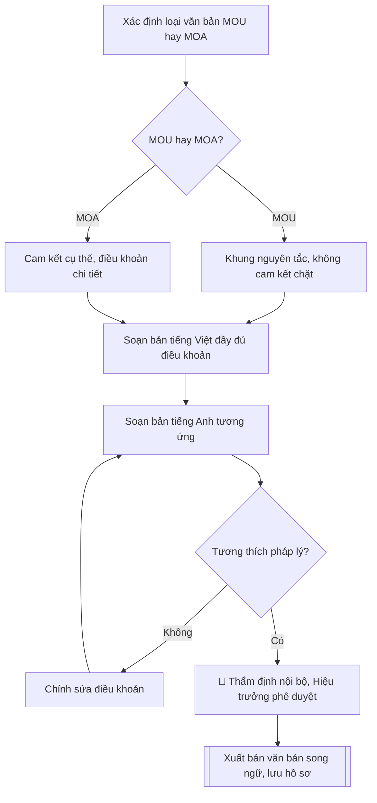

# Soạn biên bản ghi nhớ / thỏa thuận hợp tác (MOU/MOA) song ngữ Việt–Anh

## Kiểm soát áp dụng và phê duyệt

Trước khi chạy quy trình, xác định `ngay_ap_dung`, `loai_hinh_truong`, `quy_che_noi_bo`, `nguon_du_lieu` và `nguoi_kiem_duyet`. Chỉ yêu cầu thông tin có liên quan đến nghiệp vụ; không dùng giá trị giả định thay dữ liệu bắt buộc. Hồ sơ có yếu tố pháp lý phải kèm văn bản gốc, tình trạng hiệu lực, điều khoản áp dụng và chuyển tiếp.

## Giới hạn và human gate

AI hỗ trợ chuẩn bị và đối chiếu. Cán bộ phụ trách kiểm tra dữ liệu/căn cứ, người có thẩm quyền duyệt và ký. Mọi đầu ra mặc định là **DỰ THẢO – CHỜ KIỂM DUYỆT**; không đánh dấu đã ký, đã duyệt hoặc đã công bố nếu chưa có chứng cứ. Dữ liệu sinh viên, sức khỏe, nhân sự và tài chính phải hạn chế theo mục đích, phân quyền và che thông tin định danh khi dùng ví dụ. Không tải dữ liệu lên dịch vụ ngoài khi chưa có quyền. Kiểm tra Luật 91/2025/QH15 về bảo vệ dữ liệu cá nhân (hiệu lực 01/01/2026) và quy định áp dụng trước xử lý/chia sẻ dữ liệu cá nhân.


## Khi nào dùng
Khi cần soạn thảo văn bản ghi nhớ (MOU – Memorandum of Understanding) hoặc thỏa thuận
hợp tác (MOA – Memorandum of Agreement) giữa Trường Đại học A với đối tác trong nước
hoặc quốc tế, phục vụ ký kết hợp tác đào tạo, nghiên cứu khoa học, trao đổi giảng viên –
sinh viên.

## Đầu vào (Input)

| Trường | Mô tả | Bắt buộc |
|---|---|---|
| `loai_van_ban` | MOU (ghi nhớ, không ràng buộc pháp lý chặt) / MOA (thỏa thuận, có cam kết cụ thể) | Có |
| `ten_doi_tac` | Tên đầy đủ của đối tác (tiếng Việt và tiếng Anh), quốc gia, người đại diện | Có |
| `muc_dich` | Mục đích hợp tác (1–2 câu) | Có |
| `linh_vuc_hop_tac` | Các lĩnh vực hợp tác: đào tạo, NCKH, trao đổi GV-SV, đồng tổ chức hội thảo... | Có |
| `trach_nhiem_ben_a` | Trách nhiệm của Trường Đại học A | Có |
| `trach_nhiem_ben_b` | Trách nhiệm của đối tác | Có |
| `thoi_han` | Thời hạn hiệu lực (số năm) và điều kiện gia hạn/chấm dứt | Có |
| `nguoi_ky` | Người ký hai bên (chức danh, họ tên) | Có |
| `ngay_ky_du_kien` | Ngày dự kiến ký kết | Không |

## Quy trình

**Bước 1. Xác định loại văn bản (MOU hay MOA)**
- Làm gì: căn cứ `loai_van_ban` và mức độ cam kết trong `muc_dich`, `linh_vuc_hop_tac` để chốt khung soạn: MOU dùng khi hai bên mới thiết lập quan hệ, nội dung mang tính nguyên tắc; MOA dùng khi đã có cam kết cụ thể (kinh phí, số lượng, tiến độ) — điều khoản chi tiết và chặt chẽ hơn.
- Dùng input: `loai_van_ban`, `muc_dich`, `linh_vuc_hop_tac`.
- Vai trò: Trưởng Phòng KHCN và HTQT · AI hỗ trợ: phân tích mức độ cam kết · ⏱ ~20–30 phút (ước tính)
- Lưu ý nghiệp vụ: nếu trong `linh_vuc_hop_tac` hoặc trách nhiệm hai bên xuất hiện cam kết tài chính cụ thể mà `loai_van_ban` là MOU thì phải cảnh báo và đề xuất chuyển sang MOA hoặc tách phụ lục hợp đồng riêng.
- → Kết quả bước: quyết định loại văn bản + khung điều khoản áp dụng (nguyên tắc cho MOU, chi tiết cho MOA).

**Bước 2. Soạn bản tiếng Việt đầy đủ điều khoản**
- Làm gì: soạn bản tiếng Việt theo đúng thứ tự: Tiêu ngữ – Quốc hiệu → tên văn bản → tên hai bên (Bên A/Bên B) → căn cứ ký kết → Điều 1. Mục đích → Điều 2. Lĩnh vực hợp tác → Điều 3. Trách nhiệm của Bên A → Điều 4. Trách nhiệm của Bên B → Điều 5. Thời hạn hiệu lực → Điều 6. Điều khoản chung (ngôn ngữ sử dụng, giải quyết bất đồng, sửa đổi, hiệu lực thi hành) → phần ký.
- Dùng input: `ten_doi_tac`, `muc_dich`, `linh_vuc_hop_tac`, `trach_nhiem_ben_a`, `trach_nhiem_ben_b`, `thoi_han`, `nguoi_ky`, `ngay_ky_du_kien`.
- Vai trò: Chuyên viên Phòng KHCN và HTQT · AI hỗ trợ: soạn dự thảo tiếng Việt · ⏱ ~1–2 giờ (ước tính)
- Lưu ý nghiệp vụ: trách nhiệm Bên A và Bên B phải đối xứng, không để một bên chỉ có quyền mà không có nghĩa vụ; MOA phải ghi rõ số lượng, kinh phí, tiến độ cụ thể chứ không dùng chữ chung chung như "hỗ trợ tối đa".
- → Kết quả bước: dự thảo bản tiếng Việt hoàn chỉnh (đủ 6 điều + phần ký).

**Bước 3. Soạn bản tiếng Anh tương ứng**
- Làm gì: dịch đầy đủ từng điều của bản tiếng Việt sang tiếng Anh với thuật ngữ pháp lý – hành chính chuẩn (Memorandum of Understanding/Agreement, Party A/Party B, Article, validity, termination...); ghi rõ hai bản có giá trị ngang nhau hoặc chỉ định bản có giá trị ưu tiên khi có khác biệt.
- Dùng input: dự thảo bản tiếng Việt (Bước 2), `ten_doi_tac` (tên tiếng Anh), `nguoi_ky`.
- Vai trò: Chuyên viên Phòng KHCN và HTQT · AI hỗ trợ: dịch sang tiếng Anh · ⏱ ~1–2 giờ (ước tính)
- Lưu ý nghiệp vụ: tên đối tác và chức danh người ký bằng tiếng Anh phải lấy đúng theo văn bản chính thức của đối tác, không tự dịch tên riêng; số năm, số bản, thời hạn thông báo phải khớp tuyệt đối với bản Việt.
- → Kết quả bước: dự thảo bản tiếng Anh tương ứng từng điều (Article 1–6 + phần ký).

**Bước 4. Rà soát tính tương thích pháp lý**
- Làm gì: đối chiếu từng điều khoản của cả hai bản với quy định của Nhà trường và pháp luật Việt Nam; kiểm tra điều khoản tài chính (nếu có) có phù hợp quy định quản lý tài chính; lập bảng các điểm không tương thích và đề xuất chỉnh sửa.
- Dùng input: dự thảo hai bản (Bước 2, Bước 3).
- Vai trò: Phòng Pháp chế · AI hỗ trợ: lập bảng đối chiếu hỗ trợ · ⏱ ~1–2 ngày làm việc (ước tính)
- Lưu ý nghiệp vụ: MOU không được chứa điều khoản tạo nghĩa vụ pháp lý bắt buộc kiểu hợp đồng (phạt vi phạm, bồi thường) — nếu có thì phải chuyển sang MOA; điều khoản nào đối tác yêu cầu mà trái quy định thì ghi rõ để đàm phán lại, không tự ý "làm mềm".
- → Kết quả bước: bảng rà soát tương thích pháp lý (điều khoản – đánh giá – đề xuất chỉnh sửa).

**Bước 5. Trình duyệt nội bộ**
- Làm gì: trình theo đúng trình tự: Phòng KHCN&HTQT thẩm định nội dung → Phòng Tổ chức – Hành chính (hoặc Phòng Pháp chế) rà soát pháp lý → Hiệu trưởng phê duyệt trước khi ký; ghi nhận ý kiến, chữ ký từng đơn vị vào phiếu trình duyệt nội bộ.
- Dùng input: `nguoi_ky`, dự thảo đã rà soát (Bước 4).
- Vai trò: Hiệu trưởng · AI hỗ trợ: chuẩn bị hồ sơ trình ký, nhắc lịch và theo dõi tiến độ · ⏱ ~3–5 ngày làm việc (ước tính)
- Lưu ý nghiệp vụ: không được bỏ qua bước rà soát pháp lý với văn bản ký cùng đối tác nước ngoài; ý kiến chưa thống nhất thì phải sửa dự thảo và trình lại, không trình "vượt cấp".
- → Kết quả bước: phiếu trình duyệt nội bộ (đơn vị thẩm định, ý kiến, chữ ký, ngày duyệt).

**Bước 6. Xuất bản văn bản song ngữ**
- Làm gì: hoàn thiện văn bản song ngữ (hai cột hoặc hai phần riêng), kiểm tra lần cuối tính song hành giữa hai bản; xuất bản sẵn sàng in ký kết; lưu 01 bản tại Phòng KHCN&HTQT.
- Dùng input: dự thảo đã duyệt (Bước 5).
- Vai trò: Chuyên viên Phòng KHCN và HTQT · AI hỗ trợ: hoàn thiện văn bản song ngữ và xuất bản · ⏱ ~30–45 phút (ước tính)
- Lưu ý nghiệp vụ: số bản in phải khớp Điều khoản chung (ví dụ 04 bản song ngữ, mỗi bên giữ 02 bản); kiểm tra chữ ký, chức danh, con dấu hai bên trước khi coi là hoàn tất.
- → Kết quả bước: văn bản MOU/MOA song ngữ Việt–Anh hoàn chỉnh + phiếu trình duyệt nội bộ, đã lưu hồ sơ.

## Luồng quy trình (Workflow)


## Đầu ra (Output)
- Văn bản MOU/MOA song ngữ Việt–Anh hoàn chỉnh (bản tiếng Việt đầy đủ + bản tiếng Anh).
- Phiếu trình duyệt nội bộ (đơn vị thẩm định, ý kiến, chữ ký).

**Cấu trúc output chuẩn:** khung mẫu cố định của sản phẩm chính — Văn bản MOU/MOA song ngữ,
các phần bắt buộc theo đúng thứ tự:
1. Tiêu ngữ – Quốc hiệu (bản tiếng Việt).
2. Tên văn bản (Biên bản ghi nhớ / Thỏa thuận hợp tác + tên tiếng Anh) và tên hai bên (Bên A / Bên B).
3. Căn cứ ký kết (nhu cầu và khả năng hợp tác của hai bên).
4. Điều 1. Mục đích.
5. Điều 2. Lĩnh vực hợp tác.
6. Điều 3. Trách nhiệm của Bên A.
7. Điều 4. Trách nhiệm của Bên B.
8. Điều 5. Thời hạn hiệu lực (số năm, điều kiện gia hạn/chấm dứt).
9. Điều 6. Điều khoản chung (ngôn ngữ sử dụng, sửa đổi bổ sung, giải quyết bất đồng, hiệu lực thi hành).
10. Phần ký: đại diện hai bên (chức danh, họ tên, đơn vị).
11. Bản tiếng Anh tương ứng đầy đủ (Article 1–6 + phần ký).
12. Phiếu trình duyệt nội bộ (kèm theo): đơn vị thẩm định, ý kiến, người thẩm định, ngày duyệt.

## Checklist nghiệm thu
- [ ] Đủ các phần theo "Cấu trúc output chuẩn": tiêu ngữ – quốc hiệu, tên văn bản, Điều 1–6, phần ký hai bên, bản tiếng Anh đầy đủ, phiếu trình duyệt nội bộ.
- [ ] Nội dung khớp với Input: tên đối tác, lĩnh vực hợp tác, trách nhiệm hai bên, thời hạn, người ký.
- [ ] Không bịa đặt cam kết, số liệu tài chính, thông tin đối tác.
- [ ] Đúng thể thức văn bản ký kết đối ngoại; hai bản Việt – Anh song hành (số năm, số bản, thời hạn thông báo khớp tuyệt đối).
- [ ] Căn cứ pháp lý đầy đủ, còn hiệu lực: Luật Giáo dục đại học 2012 (sửa đổi 2018) và văn bản hướng dẫn hợp tác quốc tế.
- [ ] Đã qua Human gate: Phòng KHCN&HTQT thẩm định, Phòng Pháp chế rà soát, Hiệu trưởng phê duyệt trước khi ký.
- [ ] Trách nhiệm hai bên đối xứng (không bên nào chỉ có quyền mà không có nghĩa vụ); MOU không chứa điều khoản phạt vi phạm/bồi thường.
- [ ] Tên đối tác, chức danh người ký tiếng Anh đúng theo văn bản chính thức của đối tác.
- [ ] Số bản in khớp Điều khoản chung; phiếu trình duyệt có đủ ý kiến, chữ ký, ngày duyệt từng đơn vị.

Tiêu chí đạt = tất cả các ô được đánh dấu.

## Ví dụ mô phỏng (dữ liệu giả lập)

> Tất cả tên trường, cá nhân, số liệu dưới đây đều là **giả lập**, không liên quan tổ chức/cá nhân có thật.

### Input mẫu

| Trường | Giá trị |
|---|---|
| `loai_van_ban` | MOU |
| `ten_doi_tac` | Trường Đại học Khoa học Ứng dụng C (C University of Applied Sciences), Vương quốc Hà Lan; đại diện: GS. Willem Janssen – Hiệu trưởng |
| `muc_dich` | Thiết lập khuôn khổ hợp tác trong đào tạo và nghiên cứu khoa học về công nghệ thông tin và trí tuệ nhân tạo |
| `linh_vuc_hop_tac` | 1. Trao đổi giảng viên, sinh viên. 2. Hợp tác nghiên cứu khoa học và đồng hướng dẫn nghiên cứu sinh. 3. Đồng tổ chức hội thảo khoa học. 4. Chia sẻ tài liệu, học liệu |
| `trach_nhiem_ben_a` | Trường Đại học A: cử giảng viên/sinh viên tham gia chương trình trao đổi; hỗ trợ thủ tục visa, chỗ ở cho đoàn đối tác; đồng tổ chức 01 hội thảo chung mỗi 2 năm |
| `trach_nhiem_ben_b` | Trường Đại học C: tiếp nhận giảng viên/sinh viên trao đổi; hỗ trợ học bổng một phần cho sinh viên A; cử chuyên gia tham gia hội thảo chung |
| `thoi_han` | 5 năm kể từ ngày ký; tự động gia hạn từng 5 năm nếu không bên nào thông báo chấm dứt trước 6 tháng |
| `nguoi_ky` | Bên A: PGS.TS. Trần Văn B – Phó Hiệu trưởng Trường Đại học A; Bên B: GS. Willem Janssen – Hiệu trưởng Trường Đại học C |

### Output mẫu

```
────────────────────────────────────────
BẢN TIẾNG VIỆT
────────────────────────────────────────

CỘNG HÒA XÃ HỘI CHỦ NGHĨA VIỆT NAM
Độc lập – Tự do – Hạnh phúc

BIÊN BẢN GHI NHỚ HỢP TÁC
(MEMORANDUM OF UNDERSTANDING)

giữa
TRƯỜNG ĐẠI HỌC A (BÊN A)
và
TRƯỜNG ĐẠI HỌC KHOA HỌC ỨNG DỤNG HANSE (BÊN B)

Căn cứ nhu cầu và khả năng hợp tác của hai bên trong lĩnh vực đào tạo và
nghiên cứu khoa học, hai bên thống nhất ký kết Biên bản ghi nhớ với các
điều khoản sau:

Điều 1. Mục đích
Thiết lập khuôn khổ hợp tác giữa hai bên trong đào tạo và nghiên cứu khoa
học về công nghệ thông tin và trí tuệ nhân tạo, trên nguyên tắc bình đẳng,
cùng có lợi.

Điều 2. Lĩnh vực hợp tác
1. Trao đổi giảng viên, sinh viên giữa hai trường.
2. Hợp tác nghiên cứu khoa học và đồng hướng dẫn nghiên cứu sinh.
3. Đồng tổ chức hội thảo, hội nghị khoa học.
4. Chia sẻ tài liệu, học liệu và thông tin học thuật.

Điều 3. Trách nhiệm của Bên A (Trường Đại học A)
1. Cử giảng viên, sinh viên tham gia các chương trình trao đổi theo thỏa
   thuận cụ thể từng năm.
2. Hỗ trợ thủ tục visa, chỗ ở và chương trình làm việc cho các đoàn công
   tác của Bên B đến Việt Nam.
3. Đồng tổ chức 01 hội thảo khoa học chung mỗi 02 năm.

Điều 4. Trách nhiệm của Bên B (Trường Đại học C)
1. Tiếp nhận giảng viên, sinh viên của Bên A tham gia chương trình trao đổi.
2. Hỗ trợ học bổng một phần cho sinh viên của Bên A theo quy định của Bên B.
3. Cử chuyên gia tham gia các hội thảo khoa học chung do hai bên tổ chức.

Điều 5. Thời hạn hiệu lực
Biên bản này có hiệu lực 05 năm kể từ ngày ký. Hết thời hạn, Biên bản tự
động gia hạn từng 05 năm nếu không bên nào có văn bản thông báo chấm dứt
trước ít nhất 06 tháng.

Điều 6. Điều khoản chung
1. Biên bản được lập thành 04 bản song ngữ Việt – Anh, mỗi bên giữ 02 bản;
   hai bản có giá trị pháp lý ngang nhau.
2. Mọi sửa đổi, bổ sung phải được hai bên thống nhất bằng văn bản.
3. Các bất đồng phát sinh được giải quyết trước hết bằng thương lượng,
   hòa giải trên tinh thần hợp tác hữu nghị.

Đại diện Bên A                              Đại diện Bên B

PGS.TS. Trần Văn B                       GS. Willem Janssen
Phó Hiệu trưởng                             Hiệu trưởng
Trường Đại học A                     Trường Đại học C

────────────────────────────────────────
ENGLISH VERSION
────────────────────────────────────────

MEMORANDUM OF UNDERSTANDING
between
MINH DUC UNIVERSITY (PARTY A)
and
HANSE UNIVERSITY OF APPLIED SCIENCES (PARTY B)

Article 1. Purpose
To establish a framework for cooperation between the two Parties in
education and scientific research in information technology and artificial
intelligence, on the principles of equality and mutual benefit.

Article 2. Areas of Cooperation
1. Exchange of lecturers and students between the two universities.
2. Cooperation in scientific research and joint supervision of doctoral
   candidates.
3. Co-organization of scientific conferences and seminars.
4. Sharing of academic materials and information.

Article 3. Responsibilities of Party A (Minh Duc University)
1. To nominate lecturers and students to join exchange programmes as
   agreed annually.
2. To support visa procedures, accommodation and working programmes for
   delegations of Party B visiting Viet Nam.
3. To co-organize one joint scientific conference every two years.

Article 4. Responsibilities of Party B (C University of Applied Sciences)
1. To receive lecturers and students of Party A in exchange programmes.
2. To provide partial scholarships for students of Party A in accordance
   with Party B's regulations.
3. To nominate experts to joint scientific conferences organized by both Parties.

Article 5. Validity
This MOU shall be valid for five (05) years from the signing date and shall
be automatically renewed for successive five-year periods unless either Party
gives written notice of termination at least six (06) months in advance.

Article 6. General Provisions
1. This MOU is made in four (04) bilingual Vietnamese–English copies, two
   for each Party; both versions are equally valid.
2. Any amendment must be mutually agreed in writing by both Parties.
3. Disputes shall first be settled through negotiation in a spirit of
   friendly cooperation.

For Party A                                     For Party B

Assoc. Prof. Dr. Tran Van Binh                  Prof. Willem Janssen
Vice Rector                                     Rector
Minh Duc University                             C University of Applied Sciences
```

### Phiếu trình duyệt nội bộ (output kèm theo)

```
PHIẾU TRÌNH DUYỆT NỘI BỘ
Văn bản: Biên bản ghi nhớ hợp tác (MOU) giữa Trường Đại học A
và Trường Đại học Khoa học Ứng dụng C (Vương quốc Hà Lan)

| Đơn vị thẩm định | Ý kiến | Người thẩm định | Ngày |
|---|---|---|---|
| Phòng KHCN&HTQT | Nhất trí nội dung hợp tác | TS. Nguyễn Thị A | 20/10/2026 |
| Phòng Tổ chức – Hành chính | Không trái quy định pháp luật hiện hành | [CHỜ KÝ] | 22/10/2026 |
| Hiệu trưởng | Phê duyệt ký kết | PGS.TS. Trần Văn B | 25/10/2026 |

(dữ liệu giả lập)
```

## Căn cứ & lưu ý
- Luật Giáo dục đại học 2012 (sửa đổi, bổ sung 2018) và các văn bản hướng dẫn về hợp tác quốc tế trong giáo dục.
- MOU mang tính nguyên tắc, không tạo nghĩa vụ pháp lý bắt buộc như MOA; khi có cam kết tài chính cụ thể nên dùng MOA hoặc phụ lục hợp đồng riêng.
- Văn bản ký với đối tác nước ngoài cần rà soát pháp lý nội bộ trước khi trình Hiệu trưởng.
- Không dùng tên thật của trường/cá nhân khi mô phỏng.

## Quản trị phiên bản

- Phiên bản gói: `1.1.0`; ngày cập nhật: `2026-10-09`.
- Kho nguồn: https://github.com/phamtruong91/dh-skills
- Người duy trì trên GitHub: `phamtruong91` (Phạm Văn Trường). Người phê duyệt nghiệp vụ: **chưa chỉ định**.
- Commit nguồn trước cập nhật: `78fd1d51b8acd1a724d9b9af6c488460bc7551ad`. Commit chứa phiên bản này xem bằng `git log -1 -- skills/soan-mou-moa`; không tự gán SHA chưa tạo.
- Giấy phép: theo LICENSE của kho; bản quyền CES Global.
- Lịch sử 1.1.0: bổ sung metadata giao diện, kiểm soát áp dụng, quản trị phiên bản.
- Trạng thái: dự thảo nghiệp vụ; kiểm tra pháp lý trước thực thi. Ngày cập nhật không đồng nghĩa mọi văn bản đã được rà soát toàn văn.
