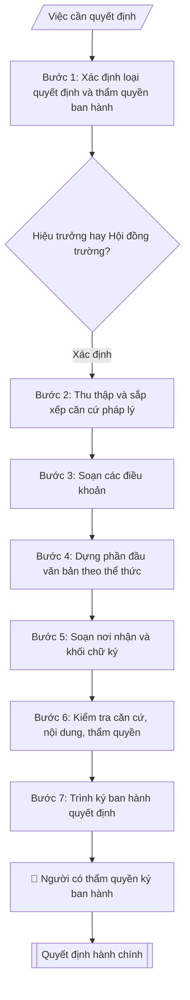

# Soạn quyết định hành chính

## Kiểm soát áp dụng và phê duyệt

Trước khi chạy quy trình, xác định `ngay_ap_dung`, `loai_hinh_truong`, `quy_che_noi_bo`, `nguon_du_lieu` và `nguoi_kiem_duyet`. Chỉ yêu cầu thông tin có liên quan đến nghiệp vụ; không dùng giá trị giả định thay dữ liệu bắt buộc. Hồ sơ có yếu tố pháp lý phải kèm văn bản gốc, tình trạng hiệu lực, điều khoản áp dụng và chuyển tiếp.

## Giới hạn và human gate

AI hỗ trợ chuẩn bị và đối chiếu. Cán bộ phụ trách kiểm tra dữ liệu/căn cứ, người có thẩm quyền duyệt và ký. Mọi đầu ra mặc định là **DỰ THẢO – CHỜ KIỂM DUYỆT**; không đánh dấu đã ký, đã duyệt hoặc đã công bố nếu chưa có chứng cứ. Dữ liệu sinh viên, sức khỏe, nhân sự và tài chính phải hạn chế theo mục đích, phân quyền và che thông tin định danh khi dùng ví dụ. Không tải dữ liệu lên dịch vụ ngoài khi chưa có quyền. Kiểm tra Luật 91/2025/QH15 về bảo vệ dữ liệu cá nhân (hiệu lực 01/01/2026) và quy định áp dụng trước xử lý/chia sẻ dữ liệu cá nhân.


## Khi nào dùng
Khi ban hành quyết định: thành lập / giải thể đơn vị, ban hành quy chế – quy định,
điều động – bổ nhiệm, khen thưởng – kỷ luật, phê duyệt kế hoạch – đề án.

## Đầu vào (Input)

| Trường | Mô tả | Bắt buộc |
|---|---|---|
| `loai_quyet_dinh` | Thành lập / Ban hành văn bản / Nhân sự / Khen thưởng – kỷ luật / Phê duyệt | Có |
| `can_cu` | Căn cứ pháp lý: luật, nghị định, quy chế, tờ trình đề nghị | Có |
| `noi_dung` | Nội dung các điều (Điều 1 – quyết định việc gì; Điều 2 – hiệu lực; Điều 3 – trách nhiệm thi hành) | Có |
| `nguoi_ky` | Hiệu trưởng / Chủ tịch Hội đồng trường / Phó Hiệu trưởng (thừa ủy quyền) | Có |
| `don_vi_soan` | Đơn vị soạn thảo, số ký hiệu dự kiến | Không |

## Quy trình

**Bước 1. Xác định loại quyết định và thẩm quyền ban hành**
- Làm gì: Đọc `loai_quyet_dinh` để xác định nhóm quyết định (Thành lập / Ban hành văn bản / Nhân sự / Khen thưởng – kỷ luật / Phê duyệt); đối chiếu với `nguoi_ky`: quyết định về tổ chức bộ máy, chiến lược, quy chế thuộc thẩm quyền Hội đồng trường (Chủ tịch Hội đồng trường ký); quyết định cá biệt điều hành thuộc thẩm quyền Hiệu trưởng; Phó Hiệu trưởng chỉ ký thừa ủy quyền trong phạm vi được ủy quyền.
- Dùng input: `loai_quyet_dinh`, `nguoi_ky`.
- Vai trò: Chuyên viên Phòng HCTH · AI hỗ trợ: phân tích input, xác định yêu cầu · ⏱ ~20–45 phút (ước tính)
- Lưu ý nghiệp vụ: Xác định sai thẩm quyền là lỗi nghiêm trọng nhất — quyết định do người không có thẩm quyền ký là vô hiệu; khi `nguoi_ky` là Phó Hiệu trưởng, kiểm tra quyết định ủy quyền còn hiệu lực.
- → Kết quả bước: Xác nhận loại quyết định + người có thẩm quyền ký phù hợp.

**Bước 2. Thu thập và sắp xếp căn cứ pháp lý**
- Làm gì: Từ `can_cu`, liệt kê từng căn cứ, kiểm tra hiệu lực và sắp xếp từ văn bản có hiệu lực cao xuống thấp: Luật → Nghị định/Thông tư → Quy chế tổ chức và hoạt động của trường → Nghị quyết Hội đồng trường → Tờ trình đề nghị của đơn vị; căn cứ là tờ trình phải ghi đủ số/ký hiệu/ngày và chức danh người ký tờ trình.
- Dùng input: `can_cu`.
- Vai trò: Chuyên viên Phòng HCTH · AI hỗ trợ: xử lý sơ bộ theo quy trình · ⏱ ~20–45 phút (ước tính)
- Lưu ý nghiệp vụ: Bẫy thường gặp — viện dẫn luật đã được sửa đổi, bổ sung mà không ghi rõ luật sửa đổi; thiếu tờ trình đề nghị của đơn vị khiến quyết định thiếu cơ sở thực tiễn; mỗi căn cứ viết thành dòng riêng bắt đầu bằng "Căn cứ".
- → Kết quả bước: Chuỗi căn cứ đã kiểm chuẩn, sắp xếp đúng thứ tự hiệu lực.

**Bước 3. Soạn các điều khoản**
- Làm gì: Chuyển `noi_dung` thành các điều đánh số theo trình tự chuẩn: Điều 1 — nội dung quyết định (quyết định việc gì, đối tượng áp dụng); Điều 2 — hiệu lực thi hành (kể từ ngày ký hoặc ngày cụ thể); Điều 3 (hoặc điều cuối) — trách nhiệm thi hành (liệt kê cụ thể các đơn vị, cá nhân chịu trách nhiệm); điều bổ sung theo loại: quyết định thành lập thêm điều về cơ cấu tổ chức, nhiệm vụ, con dấu/tài khoản (nếu có); quyết định nhân sự ghi rõ họ tên, chức vụ, thời hạn bổ nhiệm.
- Dùng input: `loai_quyet_dinh`, `noi_dung`.
- Vai trò: Chuyên viên Phòng HCTH · AI hỗ trợ: soạn dự thảo đúng thể thức · ⏱ ~20–45 phút (ước tính)
- Lưu ý nghiệp vụ: Mỗi điều chỉ quy định MỘT nội dung; câu chữ điều khoản phải chặt chẽ, không mơ hồ vì quyết định là văn bản có hiệu lực pháp lý; điều cuối cùng kết bằng "./.".
- → Kết quả bước: Dự thảo các điều khoản đầy đủ, đúng trình tự.

**Bước 4. Dựng phần đầu văn bản theo thể thức NĐ 30/2020**
- Làm gì: Lắp ráp phần đầu: tên trường + quốc hiệu – tiêu ngữ; số, ký hiệu (ký hiệu "QĐ"); địa danh, ngày tháng năm; dòng "QUYẾT ĐỊNH" (in hoa, căn giữa) + trích yếu "Về việc ..."; dòng thẩm quyền ban hành (vd "HIỆU TRƯỞNG TRƯỜNG ĐẠI HỌC A", in hoa, căn giữa).
- Dùng input: `don_vi_soan`, `loai_quyet_dinh`.
- Vai trò: Chuyên viên Phòng HCTH · AI hỗ trợ: soạn dự thảo đúng thể thức · ⏱ ~20–45 phút (ước tính)
- Lưu ý nghiệp vụ: Số quyết định lấy tiếp theo từ sổ đăng ký văn bản đi, ký hiệu "QĐ" (+ mã đơn vị nếu có); trích yếu sau "Về việc" viết ngắn gọn, không dấu chấm cuối.
- → Kết quả bước: Khung phần đầu quyết định đúng thể thức.

**Bước 5. Soạn nơi nhận và khối chữ ký**
- Làm gì: Liệt kê nơi nhận: "- Như Điều [số điều trách nhiệm thi hành];" rồi các nơi nhận khác để biết/lưu, kết thúc "- Lưu: VT, [mã đơn vị]."; khối chữ ký bên phải: chức danh người ký theo `nguoi_ky` (HIỆU TRƯỞNG / CHỦ TỊCH HỘI ĐỒNG TRƯỜNG / KT. HIỆU TRƯỞNG – PHÓ HIỆU TRƯỞNG) + họ tên; ghi chú đóng dấu (bản chính đóng dấu đỏ của trường).
- Dùng input: `nguoi_ky`, `noi_dung` (xác định điều trách nhiệm thi hành).
- Vai trò: Chuyên viên Phòng HCTH · AI hỗ trợ: soạn dự thảo đúng thể thức · ⏱ ~20–45 phút (ước tính)
- Lưu ý nghiệp vụ: Nơi nhận phải bao gồm tất cả đơn vị/cá nhân được nêu trong điều trách nhiệm thi hành; quyết định của Hội đồng trường do Chủ tịch Hội đồng trường ký, không phải Hiệu trưởng.
- → Kết quả bước: Phần nơi nhận + khối chữ ký đúng thẩm quyền.

**Bước 6. Kiểm tra căn cứ, nội dung, thẩm quyền**
- Làm gì: Đối chiếu checklist: căn cứ đầy đủ, sắp xếp đúng thứ tự hiệu lực; các điều đánh số đúng trình tự, nội dung rõ ràng, chặt chẽ; thẩm quyền ký đúng với loại quyết định; nơi nhận bao phủ điều trách nhiệm thi hành; thể thức NĐ 30/2020 (quốc hiệu, số ký hiệu, ngày tháng); chính tả, tên người, tên văn bản viện dẫn.
- Dùng input: toàn bộ input (đối chiếu chéo).
- Vai trò: Chuyên viên Phòng HCTH (Trưởng phòng kiểm tra lại) · AI hỗ trợ: quét lỗi theo checklist · ⏱ ~15–30 phút (ước tính)
- Lưu ý nghiệp vụ: Đọc lại từng căn cứ một lần nữa — viện dẫn sai tên/số văn bản là lỗi phổ biến; kiểm tra điều hiệu lực: "kể từ ngày ký" hay ngày cụ thể phải thống nhất với ý đồ ban hành.
- → Kết quả bước: Checklist kiểm tra đã đánh dấu + danh sách lỗi cần sửa (nếu có), trả về bước tương ứng để chỉnh.

**Bước 7. Trình ký ban hành quyết định**
- Làm gì: Ghép toàn bộ thành quyết định hoàn chỉnh ở định dạng markdown; đính kèm checklist kiểm tra; trình người có thẩm quyền ký ban hành (human gate); sau khi ký, chuyển văn thư đóng dấu, đăng ký vào sổ văn bản đi và phát hành.
- Dùng input: toàn bộ.
- Vai trò: Chuyên viên Phòng HCTH chuẩn bị, Hiệu trưởng phê duyệt · AI hỗ trợ: tổng hợp hồ sơ, soạn phiếu trình/tờ trình đầy đủ · ⏱ ~15–30 phút chuẩn bị + chờ duyệt (ước tính)
- Lưu ý nghiệp vụ: Quyết định chỉ có hiệu lực sau khi ký và đóng dấu; không phát hành bản chưa ký.
- → Kết quả bước: Quyết định hành chính hoàn chỉnh, sẵn sàng ký ban hành.

## Luồng quy trình (Workflow)



## Đầu ra (Output)
- Văn bản quyết định hoàn chỉnh.
- Checklist kiểm tra thể thức.

**Cấu trúc output chuẩn:** khung mẫu cố định của quyết định hành chính — các phần bắt buộc theo đúng thứ tự xuất hiện:
1. Tên trường + Quốc hiệu "CỘNG HÒA XÃ HỘI CHỦ NGHĨA VIỆT NAM" + Tiêu ngữ "Độc lập – Tự do – Hạnh phúc"
2. Số, ký hiệu quyết định (ký hiệu "QĐ"); địa danh, ngày tháng năm
3. Tên loại "QUYẾT ĐỊNH" (in hoa, căn giữa) + trích yếu "Về việc ..."
4. Dòng thẩm quyền ban hành (in hoa, căn giữa): "HIỆU TRƯỞNG TRƯỜNG ĐẠI HỌC A" hoặc "HỘI ĐỒNG TRƯỜNG TRƯỜNG ĐẠI HỌC A"
5. Chuỗi căn cứ: mỗi căn cứ một dòng bắt đầu bằng "Căn cứ", sắp xếp từ văn bản có hiệu lực cao xuống thấp, kết bằng mệnh đề "Xét..."
6. Dòng "QUYẾT ĐỊNH:" rồi các điều khoản: Điều 1 — nội dung quyết định; Điều 2 — hiệu lực thi hành; Điều cuối — trách nhiệm thi hành (thêm điều về cơ cấu tổ chức/con dấu/tài khoản với quyết định thành lập)
7. Điều cuối cùng kết bằng "./."
8. Nơi nhận (dòng đầu "- Như Điều [trách nhiệm thi hành];")
9. Khối chữ ký: chức danh người có thẩm quyền + họ tên (bản chính đóng dấu)

## Checklist nghiệm thu

Tiêu chí đạt: tất cả các ô dưới đây được đánh dấu.

- [ ] Đủ các phần theo Cấu trúc output chuẩn: Tên trường + Quốc hiệu "CỘNG HÒA XÃ HỘI CHỦ NGHĨA VIỆT NAM" + Tiêu…; Số, ký hiệu quyết định (ký hiệu "QĐ"); địa danh, ngày tháng năm; Tên loại "QUYẾT ĐỊNH" (in hoa, căn giữa) + trích yếu "Về việc ..."; Dòng thẩm quyền ban hành (in hoa, căn giữa): "HIỆU TRƯỞNG TRƯỜNG ĐẠ…; … (đủ 9 phần)
- [ ] Nội dung và số liệu trong output khớp đúng với Input đã cho (không thêm, bớt hay suy diễn)
- [ ] Không bịa đặt số liệu, minh chứng, trích dẫn hay căn cứ
- [ ] Đúng thể thức và định dạng theo Nghị định 30/2020/NĐ-CP về công tác văn thư.
- [ ] Căn cứ pháp lý được trích dẫn đầy đủ và còn hiệu lực
- [ ] Đã qua Human gate: người có thẩm quyền đã kiểm tra/duyệt trước khi phát hành
- [ ] Khi `nguoi_ky` là Phó Hiệu trưởng, kiểm tra quyết định ủy quyền còn hiệu lực
- [ ] Câu chữ điều khoản phải chặt chẽ, không mơ hồ vì quyết định là văn bản có hiệu lực pháp lý
- [ ] Nơi nhận phải bao gồm tất cả đơn vị/cá nhân được nêu trong điều trách nhiệm thi hành

## Ví dụ mô phỏng (dữ liệu giả lập)

> Tất cả tên trường, cá nhân, số liệu dưới đây đều là **giả lập**, không liên quan tổ chức/cá nhân có thật.

### Input mẫu

| Trường | Giá trị |
|---|---|
| `loai_quyet_dinh` | Thành lập |
| `can_cu` | Luật GDĐH 2012 (sửa đổi 2018); Quy chế tổ chức và hoạt động Trường ĐH A; Tờ trình số 45/TTr-KHCN ngày 01/10/2026 của Phòng KHCN&HTQT |
| `noi_dung` | Điều 1: Thành lập Ban Tổ chức Hội thảo khoa học sinh viên toàn trường năm 2026 gồm 09 thành viên (danh sách kèm theo), Trưởng ban là TS. Đỗ Thị A. Điều 2: QĐ có hiệu lực kể từ ngày ký; Ban tự giải thể sau khi hoàn thành nhiệm vụ. Điều 3: Các phòng ban, khoa liên quan chịu trách nhiệm thi hành. |
| `nguoi_ky` | Hiệu trưởng |

### Output mẫu

```
TRƯỜNG ĐẠI HỌC A            CỘNG HÒA XÃ HỘI CHỦ NGHĨA VIỆT NAM
                                              Độc lập – Tự do – Hạnh phúc
      Số: 210/QĐ-ĐHA
                                                 Thành phố C, ngày 09 tháng 10 năm 2026

QUYẾT ĐỊNH
Về việc thành lập Ban Tổ chức Hội thảo khoa học sinh viên toàn trường năm 2026
(Dữ liệu giả lập)

HIỆU TRƯỞNG TRƯỜNG ĐẠI HỌC A

Căn cứ Luật Giáo dục đại học ngày 18 tháng 6 năm 2012 và Luật sửa đổi, bổ sung
một số điều của Luật Giáo dục đại học ngày 19 tháng 11 năm 2018;
Căn cứ Quy chế tổ chức và hoạt động của Trường Đại học A;
Xét đề nghị của Trưởng phòng Khoa học công nghệ và Hợp tác quốc tế tại Tờ trình
số 45/TTr-KHCN ngày 01 tháng 10 năm 2026,

QUYẾT ĐỊNH:

Điều 1. Thành lập Ban Tổ chức Hội thảo khoa học sinh viên toàn trường năm 2026
gồm 09 thành viên (có danh sách kèm theo). Trưởng ban: TS. Đỗ Thị A –
Trưởng phòng Khoa học công nghệ và Hợp tác quốc tế.

Điều 2. Ban Tổ chức có nhiệm vụ xây dựng kế hoạch, tổ chức thực hiện Hội thảo
theo quy định; tự giải thể sau khi hoàn thành nhiệm vụ.

Điều 3. Quyết định này có hiệu lực kể từ ngày ký.

Điều 4. Trưởng các phòng: Hành chính – Tổng hợp, Khoa học công nghệ và Hợp tác
quốc tế, Tài chính – Kế toán; Trưởng các khoa và các thành viên có tên trong
danh sách chịu trách nhiệm thi hành Quyết định này./.

Nơi nhận:                                          HIỆU TRƯỞNG
- Như Điều 4;                                         [CHỜ KÝ]
- Lưu: VT, HCTH, KHCN.

                                              PGS.TS. Phạm Văn A
```

### Checklist kiểm tra thể thức (output kèm theo)
- [x] Quốc hiệu – Tiêu ngữ, tên cơ quan ban hành
- [x] Số, ký hiệu; địa danh, ngày tháng năm
- [x] Tên loại văn bản + trích yếu
- [x] Căn cứ pháp lý đầy đủ, sắp xếp đúng thứ tự hiệu lực
- [x] Các điều đánh số thứ tự, nội dung rõ ràng
- [x] Thẩm quyền ký phù hợp; nơi nhận đầy đủ

## Căn cứ & lưu ý
- Nghị định 30/2020/NĐ-CP về công tác văn thư.
- Quyết định về tổ chức bộ máy, chiến lược thuộc thẩm quyền Hội đồng trường.
- Không dùng tên thật của trường/cá nhân khi mô phỏng.

## Quản trị phiên bản

- Phiên bản gói: `1.1.0`; ngày cập nhật: `2026-10-09`.
- Kho nguồn: https://github.com/phamtruong91/dh-skills
- Người duy trì trên GitHub: `phamtruong91` (Phạm Văn Trường). Người phê duyệt nghiệp vụ: **chưa chỉ định**.
- Commit nguồn trước cập nhật: `78fd1d51b8acd1a724d9b9af6c488460bc7551ad`. Commit chứa phiên bản này xem bằng `git log -1 -- skills/soan-quyet-dinh-hc`; không tự gán SHA chưa tạo.
- Giấy phép: theo LICENSE của kho; bản quyền CES Global.
- Lịch sử 1.1.0: bổ sung metadata giao diện, kiểm soát áp dụng, quản trị phiên bản.
- Trạng thái: dự thảo nghiệp vụ; kiểm tra pháp lý trước thực thi. Ngày cập nhật không đồng nghĩa mọi văn bản đã được rà soát toàn văn.
